# XProc4J 框架 Wiki

## 概述

XProc4J（全称 `i2f-extension-xproc4j`）是一个基于 XML 的 JDBC 存储过程编排框架，提供多语言脚本执行能力，支持在 XML
中定义复杂的数据库操作流程和业务逻辑。

- **模块路径**: `i2f-extension/i2f-extension-xproc4j`
- **ArtifactId**: `i2f-extension-xproc4j`
- **父模块**: `i2f-extension`
- **版本**: `1.0-jdk8`
- **核心包名**: `i2f.jdbc.procedure`

## 框架定位

XProc4J 是 `i2f-jdbc-procedure` 基础模块的扩展实现层。基础模块定义了存储过程编排的核心接口与执行引擎，而 xproc4j 在此基础上增加了：

1. **多语言脚本执行节点** — Java / Groovy / JavaScript / TinyScript / Funic / OGNL
2. **语法检查报告器** — 启动时预编译校验所有脚本语法
3. **脚本预加载监听器** — 元数据刷新时预热脚本缓存
4. **依赖关系解析器** — 分析存储过程间的调用依赖图
5. **SpringBoot Starter** — 开箱即用的自动配置

### 脚本语言演进路线

> **重要**: Funic 是 TinyScript 的增强版本和未来替代方案。在 XProc4J 中，Funic 将逐渐演变并最终完全替代 TinyScript。

| 阶段                | 状态   | 说明                                                                                    |
|-------------------|------|---------------------------------------------------------------------------------------|
| **TinyScript 时代** | 已完成  | TinyScript 作为主要嵌入式脚本语言，广泛用于存储过程编排                                                     |
| **Funic 引入与共存**   | 当前阶段 | Funic 作为增强替代方案引入，与 TinyScript 并存。通过 `enableFunic` 配置一键切换执行器，**已具备完全替代能力**             |
| **Funic 统一**      | 未来   | Funic 完全替代 TinyScript，`FunicJdbcProcedureExecutor` 成为默认执行器，`enableFunic` 默认值改为 `true` |

**当前阶段的完全替代能力：**

通过 SpringBoot Starter 的自动配置，只需设置 `xproc4j.enable-funic=true`，即可将默认的 `DefaultJdbcProcedureExecutor`（基于
OGNL）**整体替换**为 `FunicJdbcProcedureExecutor`。这意味着：

- **表达式引擎替换**：`test()` / `eval()` / `visit()` 等核心方法从 OGNL 切换为 Funic 语法
- **脚本语言替换**：所有 `<lang-eval-tinyscript>` 的功能均可由 `<lang-eval-funic>` 替代
- **一键迁移**：无需修改业务代码，仅通过配置即可完成执行器切换

```java
// SpringContextJdbcProcedureExecutorAutoConfiguration 核心逻辑
if(jdbcProcedureProperties.isEnableFunic()){
ret =new

FunicJdbcProcedureExecutor(context, iEnvironment, namingContext);
}else{
ret =new

DefaultJdbcProcedureExecutor(context, iEnvironment, namingContext);
}
```

**迁移建议：**

- 新编写的存储过程统一使用 `<lang-eval-funic>` 标签
- 新项目建议直接开启 `xproc4j.enable-funic=true`
- 已有 TinyScript 存储过程可按计划逐步迁移至 Funic
- 语法迁移详见 [TinyScript → Funic 演进指南](funic-framework.md#tinyscript--funic-演进指南)

## 依赖关系

### 核心依赖

| 依赖                       | 版本       | 说明                                  |
|--------------------------|----------|-------------------------------------|
| `i2f-jdbc-procedure`     | 内部       | JDBC 存储过程核心引擎（接口层）                  |
| `i2f-extension-groovy`   | 内部       | Groovy 脚本封装                         |
| `i2f-extension-ognl`     | 内部       | OGNL 表达式封装                          |
| `i2f-extension-velocity` | 内部       | Velocity 模板引擎封装                     |
| `i2f-extension-antlr4`   | 内部       | ANTLR4 语法解析封装                       |
| Groovy                   | 4.0.18   | Groovy 脚本引擎（provided）               |
| Nashorn                  | 15.4     | JavaScript 引擎（Java 15+ 需要，provided） |
| OGNL                     | 3.4.11   | 表达式引擎（provided）                     |
| Velocity                 | 2.3      | 模板引擎（provided）                      |
| ANTLR4 Runtime           | 4.13.2   | 语法解析运行时（provided）                   |
| ojdbc8                   | 19.8.0.0 | Oracle JDBC 驱动（provided）            |
| mysql-connector-j        | 8.3.0    | MySQL JDBC 驱动（provided）             |

### 模块依赖图

```
i2f-jdbc-procedure (核心接口层, 位于 i2f-jdk)
    ↑
i2f-extension-xproc4j (扩展实现层)
    ↑
i2f-springboot-xproc4j-starter (SpringBoot 自动装配层)
```

## 核心架构

### 1. 执行器（Executor）

执行器是 XProc4J 的核心引擎，负责解析和执行 XML 中定义的存储过程。

#### DefaultJdbcProcedureExecutor

默认执行器，继承自 `BasicJdbcProcedureExecutor`，注册了全部语言节点和特性函数。

**核心能力：**

| 方法                          | 说明            |
|-----------------------------|---------------|
| `test(expression, params)`  | OGNL 表达式条件测试  |
| `eval(script, params)`      | OGNL 表达式求值    |
| `visit(expression, params)` | OGNL 变量访问     |
| `render(script, params)`    | Velocity 模板渲染 |
| `exec(procedureId, params)` | 执行指定存储过程      |
| `call(procedureId, params)` | 调用存储过程        |

**注册的语言节点：**

| 节点                       | 标签                                      | 语言         |
|--------------------------|-----------------------------------------|------------|
| `LangEvalFunicNode`      | `lang-eval-funic`                       | Funic      |
| `LangEvalGroovyNode`     | `lang-eval-groovy`                      | Groovy     |
| `LangEvalJavaNode`       | `lang-eval-java`                        | Java       |
| `LangEvalJavascriptNode` | `lang-eval-javascript` / `lang-eval-js` | JavaScript |
| `LangEvalNode`           | `lang-eval`                             | OGNL       |
| `LangEvalTinyScriptNode` | `lang-eval-tinyscript` / `lang-eval-ts` | TinyScript |

**注册的特性函数：**

| 特性常量                          | 说明            |
|-------------------------------|---------------|
| `EVAL_JAVA`                   | Java 代码执行     |
| `EVAL_JS`                     | JavaScript 执行 |
| `EVAL_TINYSCRIPT` / `EVAL_TS` | TinyScript 执行 |
| `EVAL_GROOVY`                 | Groovy 脚本执行   |
| `EVAL_FUNIC`                  | Funic 脚本执行    |

#### FunicJdbcProcedureExecutor

Funic 增强执行器，继承 `DefaultJdbcProcedureExecutor`，将默认的 OGNL 表达式引擎替换为 Funic 脚本引擎。*
*通过 `xproc4j.enable-funic=true` 一键启用，代表当前阶段 Funic 已具备完全替代默认执行器的能力。** 未来将演进为默认执行器。

```java
// 使用 Funic 执行器
FunicJdbcProcedureExecutor executor = new FunicJdbcProcedureExecutor(context);
// test/eval/visit 均使用 Funic 语法
```

### 2. 语言执行节点（LangEvalNode）

所有语言节点均实现 `ExecutorNode`（XML 标签执行）和 `EvalScriptProvider`（脚本提供者）双接口。

#### 节点基类结构

```
AbstractExecutorNode
    ├── tag()           — 返回匹配的 XML 标签名
    ├── alias()         — 返回标签别名
    ├── execInner()     — XML 节点执行逻辑
    ├── reportGrammar() — 语法校验
    ├── support(lang)   — 是否支持指定语言
    └── eval()          — 脚本执行入口
```

#### 2.1 LangEvalNode — OGNL 表达式

- **标签**: `<lang-eval>`
- **语言标识**: `ognl`
- **能力**: 执行 OGNL 表达式，支持属性值或元素体两种方式

```xml
<!-- 属性值方式 -->
<lang-eval value="a + b" result="sum"/>

<!-- 元素体方式 -->
<lang-eval result="now">
    new Date()
</lang-eval>
```

#### 2.2 LangEvalJavaNode — Java 动态编译

- **标签**: `<lang-eval-java>`
- **语言标识**: `java`
- **能力**: 动态编译执行 Java 代码，支持 import / member / body 三段式结构
- **编译缓存**: 使用 `LruMap`（容量 2048）缓存编译结果，以 SHA-1 哈希生成类名

```xml
<lang-eval-java result="date">
    import java.text.SimpleDateFormat;
    long ts = System.currentTimeMillis();
    String str = Long.toString(ts, 16);
    return new Date();
</lang-eval-java>

<!-- 三段式结构 -->
<lang-eval-java result="obj">
    <lang-java-import>
        import com.example.MyClass;
    </lang-java-import>
    <lang-java-member>
        private int helper() { return 42; }
    </lang-java-member>
    <lang-java-body>
        return helper();
    </lang-java-body>
</lang-eval-java>
```

**自动导入的包**: 框架预置了大量常用 import，包括框架核心类、Java
标准库（`java.util.*`, `java.math.*`, `java.time.*`, `java.io.*` 等），无需手动导入。

#### 2.3 LangEvalGroovyNode — Groovy 脚本

- **标签**: `<lang-eval-groovy>`
- **语言标识**: `groovy`
- **能力**: 执行 Groovy 脚本，自动注入框架 import

```xml
<lang-eval-groovy result="sum">
    params.a + params.b
</lang-eval-groovy>
```

#### 2.4 LangEvalJavascriptNode — JavaScript

- **标签**: `<lang-eval-javascript>` / `<lang-eval-js>`
- **语言标识**: `javascript` / `js`
- **能力**: 使用 Nashorn/JavaScript 引擎执行 JS 脚本
- **注意**: Java 15+ 需要额外引入 `nashorn-core` 依赖

```xml
<lang-eval-javascript result="js">
    function test() {
        return 'hello' + (1 + 2);
    }
    test()
</lang-eval-javascript>
```

#### 2.5 LangEvalTinyScriptNode — TinyScript（旧，将被 Funic 替代）

- **标签**: `<lang-eval-tinyscript>` / `<lang-eval-ts>`
- **语言标识**: `tinyscript` / `ts`
- **状态**: 旧版脚本引擎，**将被 Funic 逐步替代**，新存储过程推荐使用 `<lang-eval-funic>`
- **能力**: 执行 TinyScript 脚本（基于 ANTLR4 的自定义脚本语言）
- **特点**: 支持 `${变量}` 语法引用上下文变量
- **详细文档**: 见 [TinyScript 表达式引擎 Wiki](tinyscript-framework.md)

```xml
<lang-eval-tinyscript result="sum">
    ${a} + ${b}
</lang-eval-tinyscript>
```

#### 2.6 LangEvalFunicNode — Funic（推荐，替代 TinyScript）

- **标签**: `<lang-eval-funic>`
- **语言标识**: `funic`
- **状态**: **推荐的脚本引擎**，TinyScript 的增强版本和未来替代
- **能力**: 执行 Funic 脚本（基于 ANTLR4 的增强脚本语言）
- **特点**: 支持全局函数调用、静态方法调用、实例方法调用，变量直接访问无需 `${}`
- **详细文档**: 见 [Funic 脚本引擎 Wiki](funic-framework.md)

```xml
<lang-eval-funic result="sum">
    a + b
</lang-eval-funic>
```

### 3. 脚本解析器（Resolver）

脚本解析器负责在脚本执行过程中桥接框架上下文，实现过程调用、变量访问、类加载等能力。

#### ProcedureTinyScriptResolver

TinyScript 的框架集成解析器，继承 `DefaultTinyScriptResolver`：

| 能力    | 方法                                                                             |
|-------|--------------------------------------------------------------------------------|
| 过程调用  | `beforeFunctionCall()` — 拦截函数调用，查找已注册的 ProcedureMeta 并执行                       |
| 变量读写  | `setValue()` / `getValue()` — 通过 executor 读写上下文变量                              |
| 类加载   | `loadClass()` — 通过 executor 加载类                                                |
| 方法查找  | `findMethod()` — 按名称查找已注册方法、ExecutorMethodProvider 和 ExecContextMethodProvider |
| 字符串渲染 | `renderString()` — 通过 executor 渲染 Velocity 模板                                  |
| 调试支持  | `debugBridge()` / `openDebugger()` — 调试桥接                                      |

#### ProcedureFunicResolver

Funic 的框架集成解析器，继承 `DefaultFunicResolver`，能力与 TinyScript 解析器类似但适配 Funic 语法体系。

### 4. 脚本内置方法

在 TinyScript 和 Funic 脚本中，可以直接调用以下内置方法（Funic 将替代 TinyScript，两者共享相同的内置方法体系）：

#### ExecutorMethodProvider — 执行器方法

| 方法                                                            | 说明             |
|---------------------------------------------------------------|----------------|
| `load_class(className)`                                       | 加载指定类          |
| `is_debug()`                                                  | 是否调试模式         |
| `env(property)` / `env(property, default)`                    | 读取环境变量         |
| `env_int()` / `env_long()` / `env_double()` / `env_boolean()` | 类型化环境变量        |
| `get_bean(name)` / `get_bean(type)`                           | 获取 Spring Bean |
| `get_meta(procedureId)`                                       | 获取存储过程元数据      |
| `trace_location()` / `trace_file()` / `trace_line()`          | 追踪信息           |
| `trace_node()` / `trace_error()` / `trace_errmsg()`           | 追踪节点与错误        |
| `tracking_comment()`                                          | 追踪注释           |
| `log_debug()` / `log_info()` / `log_warn()` / `log_error()`   | 日志输出           |

#### ExecContextMethodProvider — 执行上下文方法

| 方法                                                       | 说明             |
|----------------------------------------------------------|----------------|
| `get_connection(datasource)`                             | 获取数据库连接        |
| `eval(script)`                                           | OGNL 表达式求值     |
| `eval_script(lang, script)`                              | 指定语言脚本执行       |
| `render(script)`                                         | Velocity 模板渲染  |
| `visit(expression)`                                      | 变量访问           |
| `visit_set(expression, value)`                           | 变量赋值           |
| `visit_delete(expression)`                               | 变量删除           |
| `test(expression)`                                       | 条件测试           |
| `sql_adapt(datasource, databases)`                       | SQL 方言适配判断     |
| `sql_trans_begin(datasource)`                            | 开始事务           |
| `sql_trans_commit(datasource)`                           | 提交事务           |
| `sql_trans_rollback(datasource)`                         | 回滚事务           |
| `sql_query_object(datasource, sql, args...)`             | 查询单值           |
| `sql_query_row(datasource, sql, args...)`                | 查询单行           |
| `sql_query_list(datasource, sql, args...)`               | 查询列表           |
| `sql_query_page(datasource, offset, size, sql, args...)` | 分页查询           |
| `sql_query_columns(datasource, sql, args...)`            | 查询列            |
| `sql_update(datasource, sql, args...)`                   | 更新操作           |
| `sql_script_query_*`                                     | 脚本化 SQL 查询系列方法 |

### 5. 语法检查与预加载

#### DefaultGrammarReporter

语法报告器，在启动时校验所有存储过程中脚本的语法正确性。

**支持的语法校验：**

| 特性                                       | 校验方式                                     |
|------------------------------------------|------------------------------------------|
| OGNL (`EVAL`)                            | `OgnlUtil.parseExpressionTreeNode()`     |
| Groovy (`EVAL_GROOVY`)                   | `GroovyShell.parse()`                    |
| Java (`EVAL_JAVA`)                       | `MemoryCompiler.findCompileClass()` 动态编译 |
| TinyScript (`EVAL_TINYSCRIPT`/`EVAL_TS`) | `TinyScript.parse()` ANTLR4 语法分析         |
| Funic (`EVAL_FUNIC`)                     | `Funic.parse()` ANTLR4 语法分析              |

#### ScriptPreloadEventListener

脚本预加载监听器，在元数据刷新事件触发时，预热所有脚本的解析/编译缓存。

- 监听 `JdbcProcedureMetaMapRefreshedEvent` 事件
- 遍历所有 XML 类型的 ProcedureMeta
- 按标签类型分别执行 OGNL 解析、TinyScript 解析、Java 编译、Groovy 编译、Funic 解析
- 支持执行次数限制（`maxCount`）

#### ProcedureMetaMapGrammarReporterListener

元数据刷新时的语法检查监听器，首次启动时同步执行检查，后续异步执行。

### 6. 依赖关系解析

#### MetaDependencyResolver

分析存储过程之间的调用依赖关系，构建依赖图。

**核心功能：**

| 方法                                     | 说明                |
|----------------------------------------|-------------------|
| `getDependencyMap(metaMap)`            | 从元数据映射构建依赖关系      |
| `getDependencyGraph(dependencyMap)`    | 生成依赖图（含正向依赖和反向使用） |
| `getDependencyUsageMap(dependencyMap)` | 反转依赖为使用关系         |
| `printDependencyGraph(graph)`          | 打印树形依赖图           |
| `convertAsEchartsGraph(graph)`         | 转换为 ECharts 图数据格式 |

**依赖识别规则：**

通过以下标签/属性识别过程间调用：

- `<procedure-call refid="...">` — 过程调用
- `<function-call refid="...">` — 函数调用
- `<java-call refid="...">` — Java 调用
- `<script-include refid="...">` — 脚本包含
- TinyScript/Funic 中的函数调用（通过 ANTLR4 解析树分析）
- 脚本中的 `.call()`/`.invoke()`/`.exec()` 方法调用
- SQL 中的函数调用（正则匹配）

**依赖命名约定：** 以 `FUN_`、`SP_`、`PKG_`、`F_`、`FUNC_`、`FN_`、`PROC_` 开头的标识符被识别为过程依赖。

### 7. SpringBoot Starter

`i2f-springboot-xproc4j-starter` 提供 SpringBoot 自动配置。

#### 执行器切换配置

自动配置类 `SpringContextJdbcProcedureExecutorAutoConfiguration` 根据 `enableFunic` 属性决定创建哪种执行器：

| 配置项                       | 默认值     | 说明                                                                             |
|---------------------------|---------|--------------------------------------------------------------------------------|
| `xproc4j.enable-funic`    | `false` | 设为 `true` 时创建 `FunicJdbcProcedureExecutor`，否则创建 `DefaultJdbcProcedureExecutor` |
| `xproc4j.enable`          | `true`  | XProc4J 总开关                                                                    |
| `xproc4j.executor.enable` | `true`  | 执行器开关                                                                          |

```java
// 核心切换逻辑（SpringContextJdbcProcedureExecutorAutoConfiguration#L278-L282）
if(jdbcProcedureProperties.isEnableFunic()){
ret =new

FunicJdbcProcedureExecutor(context, iEnvironment, namingContext);
}else{
ret =new

DefaultJdbcProcedureExecutor(context, iEnvironment, namingContext);
}
```

> **说明**: `FunicJdbcProcedureExecutor` 继承自 `DefaultJdbcProcedureExecutor`，将默认的 OGNL 表达式引擎整体替换为 Funic
> 脚本引擎。开启后，`test()` / `eval()` / `visit()` 等核心方法均使用 Funic 语法，**代表当前阶段 Funic 已具备完全替代能力**。

**核心类：**

| 类                                                     | 说明                  |
|-------------------------------------------------------|---------------------|
| `SpringContextJdbcProcedureExecutorAutoConfiguration` | 执行器自动配置             |
| `SpringJdbcProcedureProperties`                       | 配置属性                |
| `JdbcProcedureHelper`                                 | 辅助工具类               |
| `SpringJdbcProcedureXmlNodeMetaCacheProvider`         | Spring 资源加载 XML 元数据 |
| `SpringRoutingDataSourceProvider`                     | Spring 路由数据源提供者     |
| `BaomidouDynamicRoutingDatasourceProvider`            | Baomidou 动态数据源适配    |
| `Slf4jJdbcProcedureLogger`                            | SLF4J 日志实现          |

**扩展功能集成：**

| 类                            | 说明            |
|------------------------------|---------------|
| `SpringContextFunctions`     | Spring 上下文函数  |
| `SpringEnvironmentFunctions` | Spring 环境变量函数 |
| `SpringRedisFunctions`       | Redis 操作函数    |
| `SpringRedissonFunctions`    | Redisson 操作函数 |
| `SpringSlf4jFunctions`       | SLF4J 日志函数    |
| `SpringWebFunctions`         | Web 相关函数      |

**MyBatis Mapper 代理：**

| 类/注解                                              | 说明           |
|---------------------------------------------------|--------------|
| `@ProcedureMapper`                                | 声明 Mapper 接口 |
| `@ProcedureId`                                    | 指定存储过程 ID    |
| `@ProcedureParam`                                 | 参数映射         |
| `SpringJdbcProcedureProxyMapperAutoConfiguration` | 代理自动配置       |
| `ProxyJdbcProcedureMapperHandler`                 | 代理处理器        |

## XML 语法参考

### 基本结构

```xml
<!DOCTYPE procedure SYSTEM "procedure.dtd">

<procedure id="PROCEDURE_ID">
    <!-- 存储过程体 -->
</procedure>
```

### 常用标签

| 标签                                                      | 说明         |
|---------------------------------------------------------|------------|
| `<procedure id="...">`                                  | 存储过程定义     |
| `<lang-set value="..." result="..."/>`                  | 变量赋值       |
| `<lang-if test="...">`                                  | 条件判断       |
| `<lang-fori begin="..." end="..." item="...">`          | for 循环     |
| `<lang-foreach collection="..." item="...">`            | foreach 循环 |
| `<lang-println tag="..." />`                            | 打印输出       |
| `<lang-printf>`                                         | 格式化输出      |
| `<lang-invoke method="..." target="..." result="..."/>` | 方法调用       |
| `<procedure-call refid="..."/>`                         | 调用其他存储过程   |
| `<function-call refid="..."/>`                          | 函数调用       |
| `<java-call refid="..."/>`                              | Java 调用    |
| `<sql-query-object>`                                    | 查询单值       |
| `<sql-query-row>`                                       | 查询单行       |
| `<sql-query-list>`                                      | 查询列表       |
| `<sql-query-page>`                                      | 分页查询       |
| `<sql-update>`                                          | 更新操作       |
| `<sql-dialect databases="...">`                         | SQL 方言适配   |

### 脚本上下文变量

在脚本执行中，以下变量自动可用：

| 变量         | 类型                      | 说明      |
|------------|-------------------------|---------|
| `executor` | `JdbcProcedureExecutor` | 执行器实例   |
| `params`   | `Map<String, Object>`   | 上下文参数映射 |

### Java Caller（Java 存储过程）

通过 `@JdbcProcedure` 注解定义 Java 存储过程：

```java
@JdbcProcedure(
    value = "SP_SIMPLE",
    arguments = {}
)
public class SimpleJavaCaller implements JdbcProcedureJavaCaller {
    @Override
    public Object exec(JdbcProcedureExecutor executor, Map<String, Object> params) throws Throwable {
        // 业务逻辑
        return null;
    }
}
```

## 完整示例

```xml
<!DOCTYPE procedure SYSTEM "procedure.dtd">

<procedure id="BASIC">
    <!-- 方法调用 -->
    <lang-invoke method="decode" arg0.int="1"
                 arg1.int="0" arg2.string="unknown"
                 result="dec"/>
    <lang-println tag="dec1" dec="dec"/>

    <!-- 日期格式化 -->
    <lang-invoke method="SimpleDateFormat.new" 
                 arg0.string="yyyy-MM-dd HH:mm:ss.SSS" result="fmt"/>
    <lang-invoke method="Date.new" result="now"/>
    <lang-invoke method="format" target="fmt" arg0="now" result="str"/>
    <lang-println tag="now" now="str"/>

    <!-- SQL 方言查询 -->
    <lang-printf>
        <sql-query-object result="count" result-type="Long">
            <sql-dialect databases="mysql,gbase,mariadb">
                select count(1) as cnt from sys_user where del_flag = 1
            </sql-dialect>
            <sql-dialect databases="oracle,dm">
                SELECT COUNT(1) as "cnt" FROM SYS_USER WHERE DEL_FLAG = 1
            </sql-dialect>
        </sql-query-object>
    </lang-printf>

    <!-- 条件判断 -->
    <lang-if test="count gt 0">
        <lang-printf>
            <sql-update result="updateCount">
                delete from sys_user where del_flag = 1
            </sql-update>
        </lang-printf>
    </lang-if>

    <!-- for 循环 -->
    <lang-fori begin.int="0" end.int="10" incr.int="1" item="item">
        <lang-println tag.string="fori" i="item" is-first="first" index="index"/>
    </lang-fori>

    <!-- foreach 循环 -->
    <lang-foreach collection="list" item="item">
        <lang-println tag.string="foreach" item="item" is-first="first" index="index"/>
    </lang-foreach>

    <!-- Java 脚本 -->
    <lang-eval-java result="date">
        long ts = System.currentTimeMillis();
        return new Date();
    </lang-eval-java>
    <lang-println date="date"/>

    <!-- JavaScript 脚本 -->
    <lang-eval-javascript result="js">
        function test() { return 'hello' + (1 + 2); }
        test()
    </lang-eval-javascript>
    <lang-println js="js"/>
</procedure>
```

## 官方文档索引

XProc4J 框架在 `i2f-jdk/i2f-jdbc-procedure` 模块中提供了完整的官方文档体系，位于 `src/main/resources/assets/std/` 目录下。

### 技术文档

| 文档                     | 说明                                                                                                                                                                                 | 路径                                                      |
|------------------------|------------------------------------------------------------------------------------------------------------------------------------------------------------------------------------|---------------------------------------------------------|
| **框架总体架构及功能介绍**        | 框架概述、模块结构、核心组件架构、节点分类体系、上下文函数体系、事件系统、Spring Boot 集成、表达式引擎、多数据源支持、扩展机制、执行流程详解、配置文件参考                                                                                                | `assets/std/framework.md`                               |
| **框架设计思想**             | 核心概念、标签分类（script-/lang-/sql-）、OGNL/Velocity/Groovy/TinyScript/Funic 技术体系、属性修饰符系统（数据类型/取值/脚本/字符串/逻辑/系统值/方言/异常处理修饰符）、脚本引擎实现详解                                                        | `assets/std/design.md`                                  |
| **快速入门手册**             | Maven 依赖、Spring Boot 配置、HelloWorld 示例、核心概念（过程定义/执行上下文）、XML 节点参考（lang-*/sql-*/过程调用/日志）、表达式引擎（OGNL/Velocity/TinyScript）、TinyScript 语法速查、Spring Boot 集成详解、Java 调用方式、调试与日志、常见问题、内建函数大全 | `assets/std/quick-start.md`                             |
| **Oracle 过程转换指南**      | 重要概念、OGNL 快速入门（if 条件/SQL 占位符）、Velocity 模板入门、TinyScript 脚本入门、转换注意事项（大小写/NULL 处理/NULL 运算）、存储过程/函数定义转换、变量定义/赋值/字符串拼接/条件语句等对照转换                                                        | `assets/std/procedure.md`                               |
| **存储过程转换对照指南**         | 从 Oracle PL/SQL 到 XProc4J 的详细转换对照，包含各种控制结构、SQL 操作、异常处理等的转换示例                                                                                                                       | `assets/std/convert-guide.md`                           |
| **XML 节点定义白皮书**        | 所有 XML 节点的完整定义，包括 DTD 定义、属性定义（含默认修饰符）、使用示例、验证依据。覆盖 log-*/debugger/lang-*/sql-*/procedure-*/function-*/java-call/script-*/event-*/context-*/etl-* 全部节点                              | `assets/std/node-definition.md`                         |
| **TinyScript 语法**      | TinyScript 脚本语言的完整语法文档（基于 ANTLR4 实现，将被 Funic 替代）                                                                                                                                   | `assets/std/TinyScript.md`                              |
| **TinyScript 引擎 Wiki** | TinyScript 表达式引擎的完整 Wiki（概述、语法、API、扩展点、IDE 插件）                                                                                                                                     | [docs/tinyscript-framework.md](tinyscript-framework.md) |
| **Funic 语法**           | Funic 脚本语言的完整语法文档（TinyScript 的增强超集与替代方案）                                                                                                                                           | `assets/std/Funic.md`                                   |
| **Funic 引擎 Wiki**      | Funic 脚本引擎的完整 Wiki（概述、语法、API、扩展点、Lambda/异步、沙箱、IDE 插件、TinyScript 迁移指南）                                                                                                              | [docs/funic-framework.md](funic-framework.md)           |

### 过程文档（补充参考）

| 文档               | 说明                                     | 路径                              |
|------------------|----------------------------------------|---------------------------------|
| **XML 节点语法定义参考** | procedure.xml 包含所有节点的详细注释和语法说明（2105 行） | `assets/std/procedure.xml`      |
| **DTD 约束文件**     | procedure.dtd 定义 XML 节点的结构约束（1257 行）   | `assets/std/procedure.dtd`      |
| **产品对比分析**       | XProc4J 与其他同类产品/方案的对比分析                | `assets/std/product-compare.md` |

> **文档根路径**: `i2f-jdk/i2f-jdbc-procedure/src/main/resources/assets/std/`

## 效果预览

XProc4J 提供了 IDEA 编辑器的语法高亮和代码补全插件支持。以下为效果展示：

> 插件详细介绍见 [IDEA 插件 Wiki](idea-plugin.md)

> 源文件: [demo_main.xml](../../i2f-jdk/i2f-jdbc-procedure/docs/src/demo_main.xml)

### 编辑效果动图

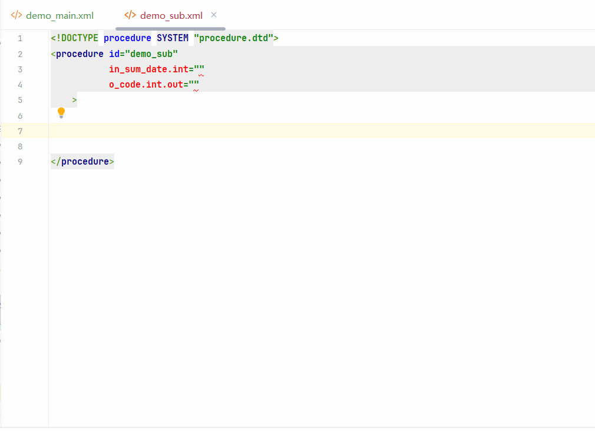

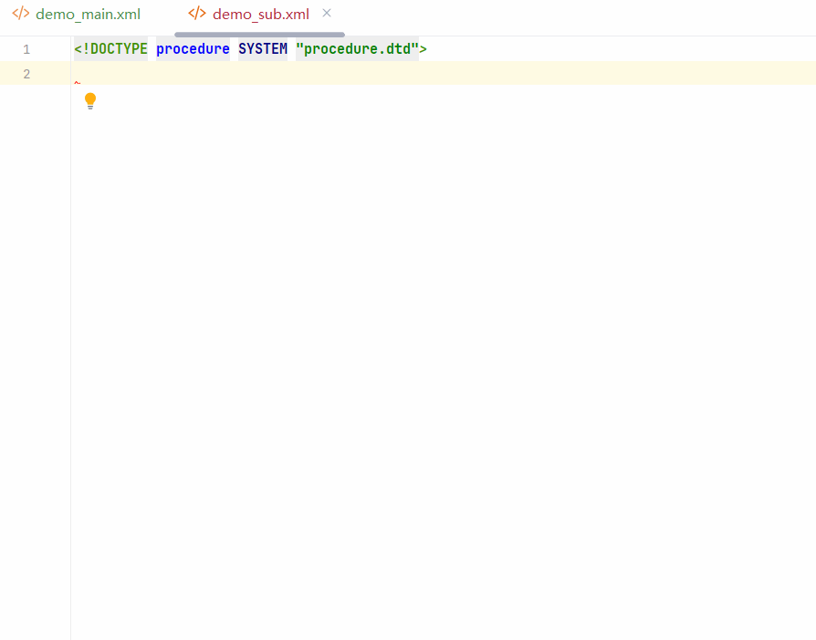

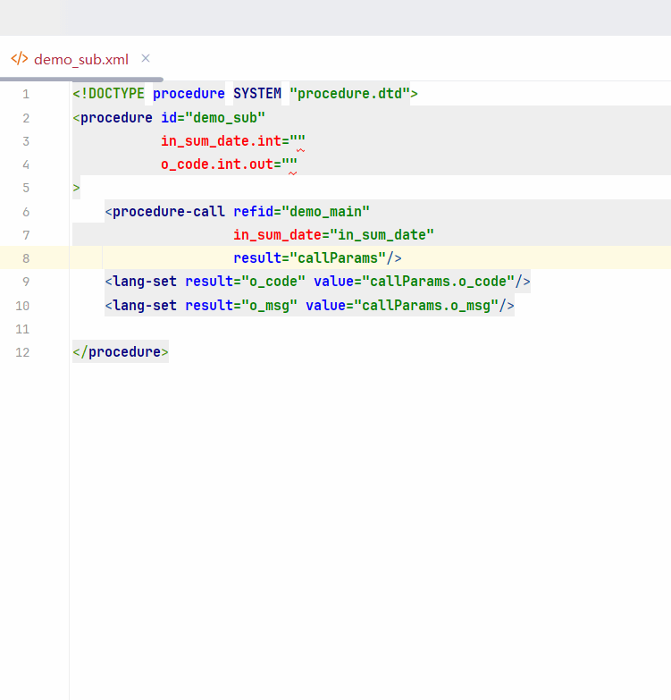

### IDEA 整体效果

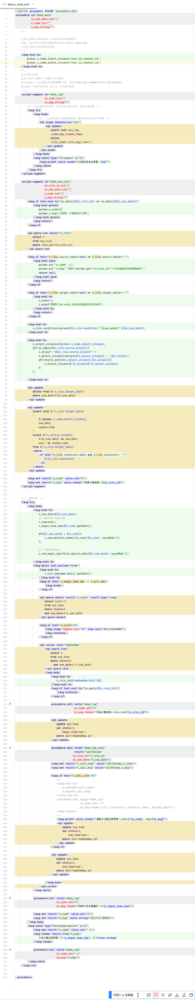

### IDEA 分段效果

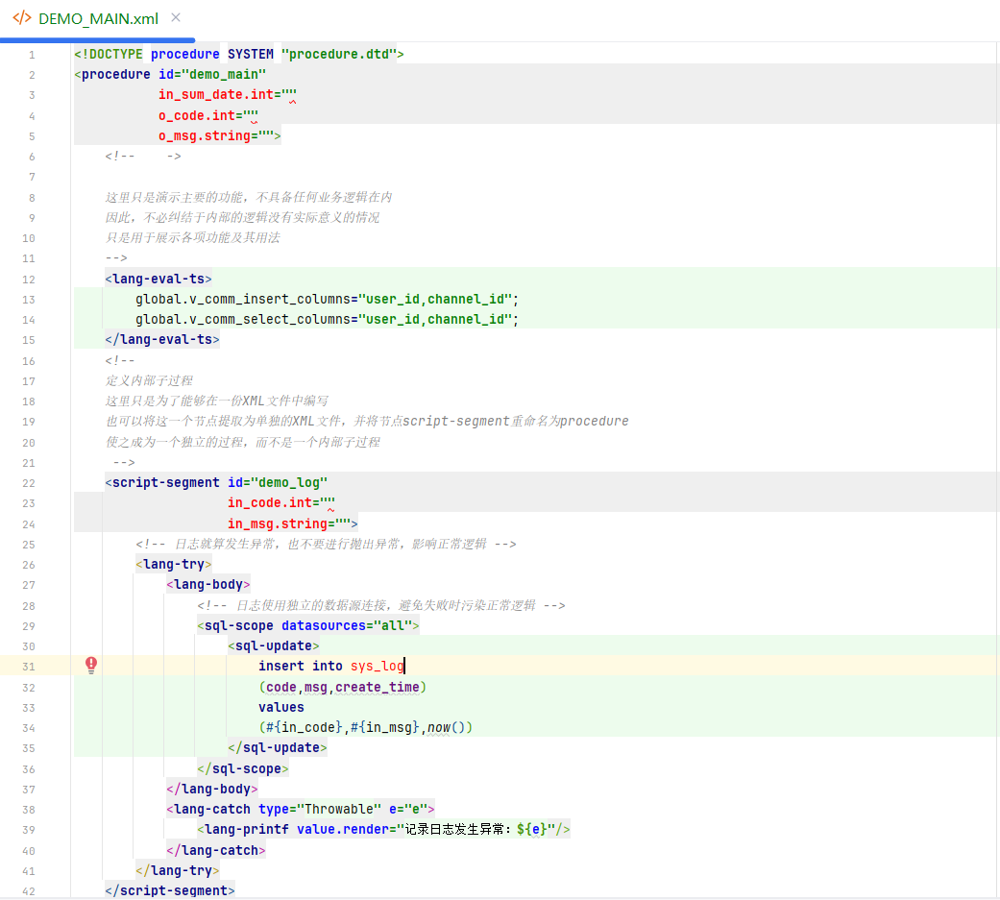

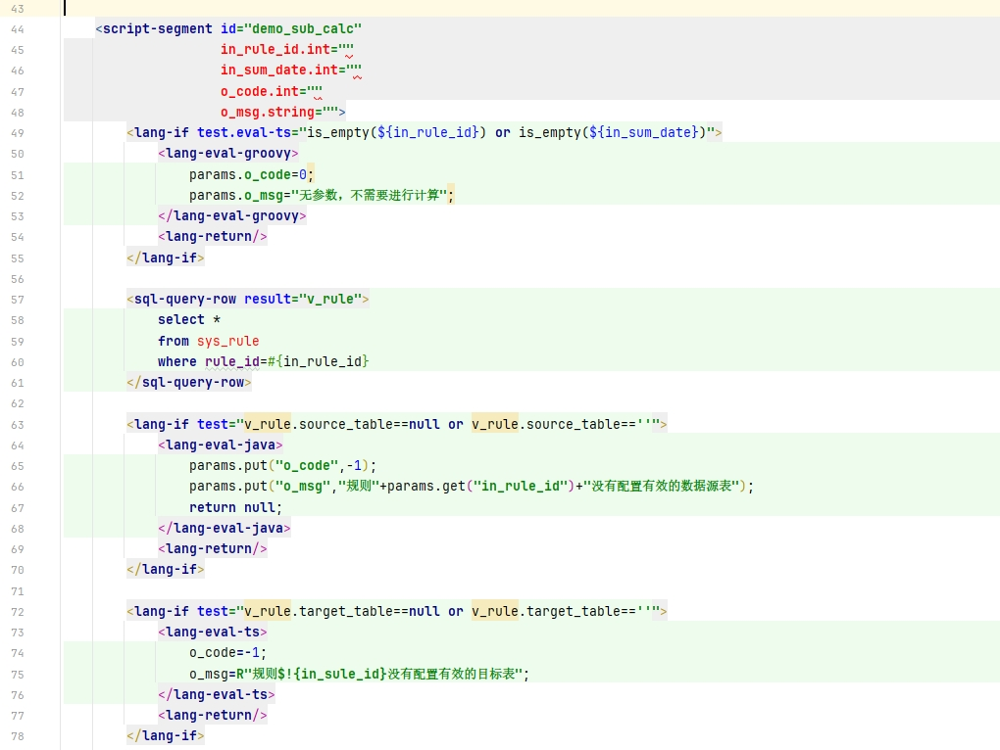

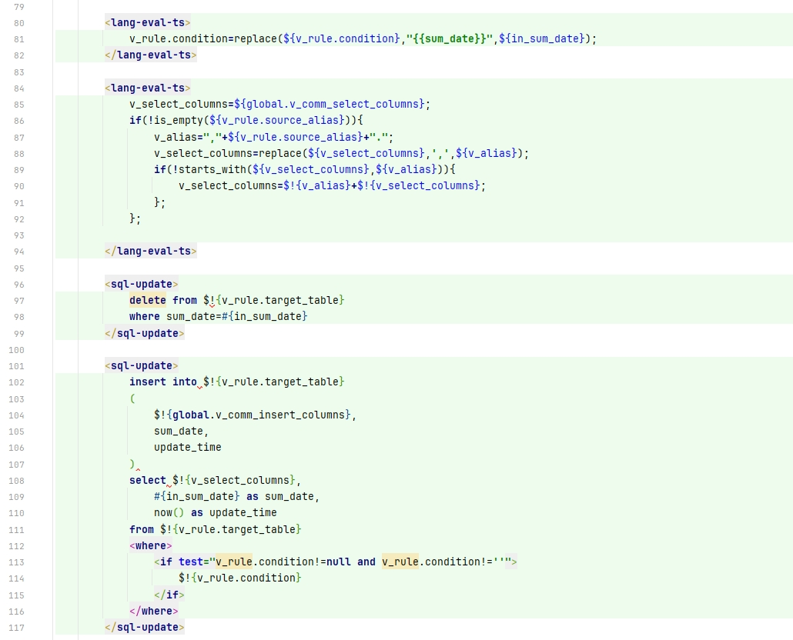

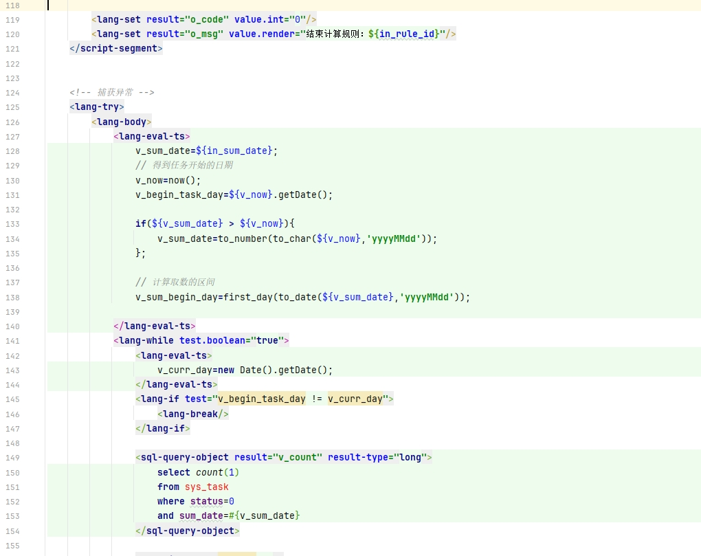

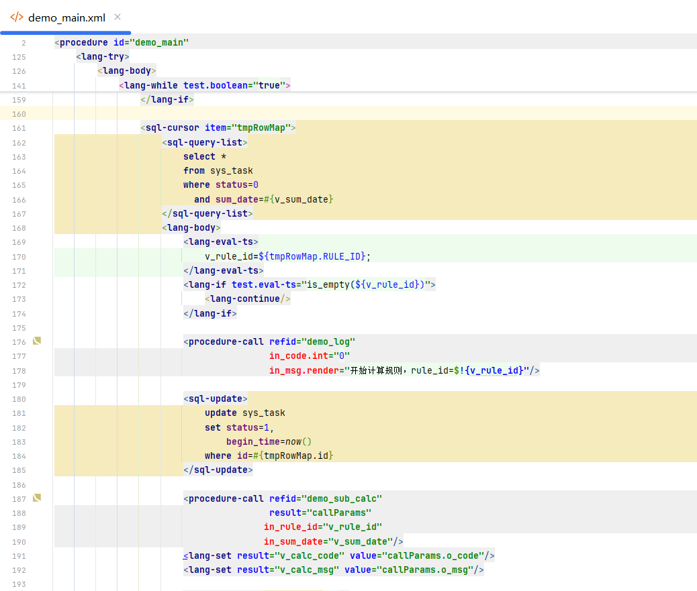

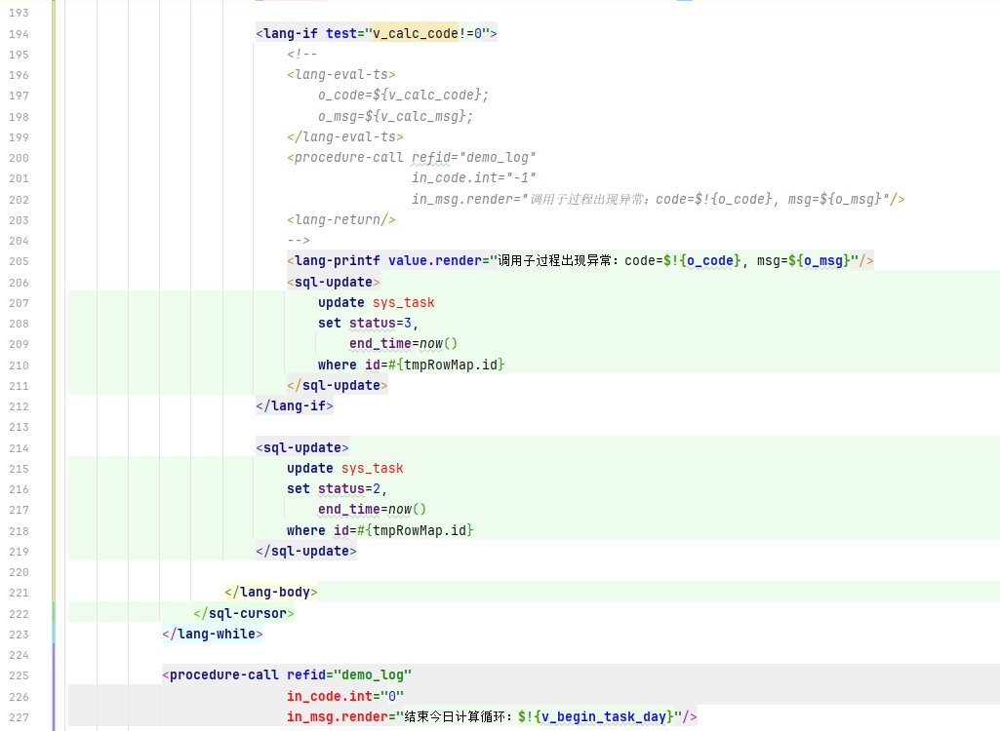

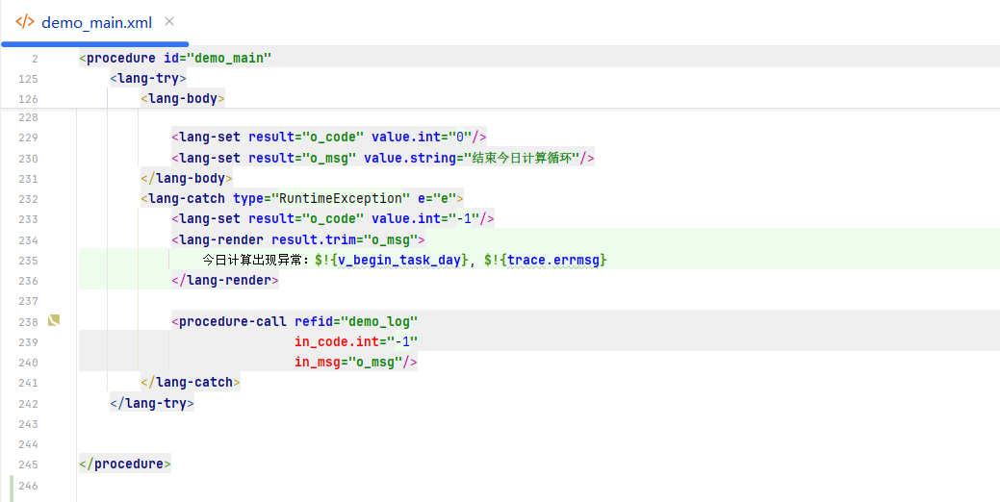

### IDEA 动图效果


## 生产实践

### Oracle 过程迁移至国产数据库

XProc4J 框架在真实生产环境中完成了大规模的 Oracle 存储过程（含函数）向国产数据库的迁移工作，具体成果如下：

| 指标          | 数据                    |
|-------------|-----------------------|
| **迁移对象**    | 线上系统 Oracle 存储过程 + 函数 |
| **目标数据库**   | 国产数据库                 |
| **核心计算系统数** | 500+                  |
| **迁移过程总行数** | 12 万+ 行               |
| **每日调度次数**  | 2000+ 次               |
| **稳定运行时长**  | 1 年+                  |

**迁移特点：**

- **全量过程迁移**：将 Oracle 存储过程（含函数）整体迁移至国产数据库，覆盖 500+ 核心计算系统
- **超大规模**：累计迁移超过 12 万行过程代码
- **高频调度**：每日调度执行 2000+ 次
- **长期稳定**：已稳定运行超过一年，验证了框架在大规模生产环境下的可靠性和跨数据库迁移能力

## 源文件清单

### 主代码（src/main/java）

| 包路径                    | 类                                         | 说明                 |
|------------------------|-------------------------------------------|--------------------|
| `executor.impl`        | `DefaultJdbcProcedureExecutor`            | 默认执行器              |
| `executor.impl`        | `FunicJdbcProcedureExecutor`              | Funic 增强执行器        |
| `node.impl`            | `LangEvalNode`                            | OGNL 表达式节点         |
| `node.impl`            | `LangEvalJavaNode`                        | Java 动态编译节点        |
| `node.impl`            | `LangEvalGroovyNode`                      | Groovy 脚本节点        |
| `node.impl`            | `LangEvalJavascriptNode`                  | JavaScript 节点      |
| `node.impl`            | `LangEvalTinyScriptNode`                  | TinyScript 节点      |
| `node.impl`            | `LangEvalFunicNode`                       | Funic 脚本节点         |
| `node.impl.funic`      | `ProcedureFunicResolver`                  | Funic 解析器          |
| `node.impl.funic`      | `ProcedureFunicFunctionCallContext`       | Funic 函数调用上下文      |
| `node.impl.tinyscript` | `ProcedureTinyScriptResolver`             | TinyScript 解析器     |
| `node.impl.tinyscript` | `ProcedureFunctionCallContext`            | TinyScript 函数调用上下文 |
| `node.impl.tinyscript` | `ExecutorMethodProvider`                  | 执行器内置方法提供者         |
| `node.impl.tinyscript` | `ExecContextMethodProvider`               | 执行上下文内置方法提供者       |
| `reportor`             | `MetaDependencyResolver`                  | 依赖关系解析器            |
| `reportor.impl`        | `DefaultGrammarReporter`                  | 默认语法报告器            |
| `context.event`        | `ScriptPreloadEventListener`              | 脚本预加载监听器           |
| `context.impl`         | `ProcedureMetaMapGrammarReporterListener` | 语法检查监听器            |
