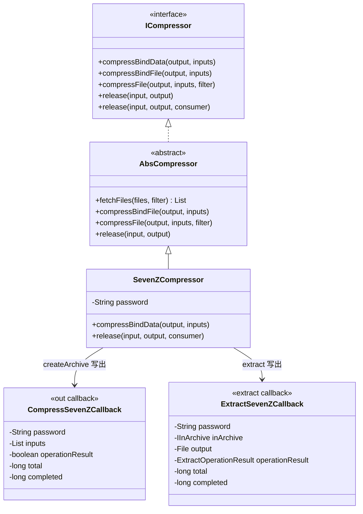
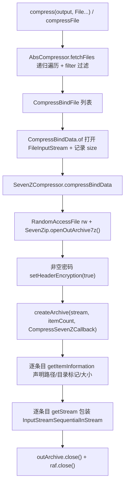
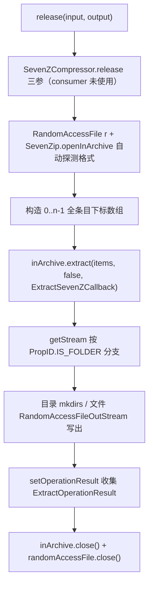

# i2f-extension-7zip

> 基于 **SevenZipJBinding** 的 **7z 归档 `ICompressor` 实现**：以单类 `SevenZCompressor`（继承上游 `i2f-compress-std` 的 `AbsCompressor`）复用「文件遍历 → 绑定数据 → 打包/解包」骨架，把目录树打包为 `.7z`（可选密码、头部加密），并把 `.7z` 解包回目录。打包与解包分别由 `CompressSevenZCallback`（`IOutCreateCallback<IOutItem7z>` + `ICryptoGetTextPassword`）与 `ExtractSevenZCallback`（`IArchiveExtractCallback` + `ICryptoGetTextPassword`）承接 SevenZipJBinding 的流式回调。模块共 4 个类（3 main + 1 test），sevenzipjbinding 以 `provided` 引入、运行期需由使用方提供。

## 模块路径

- `i2f-extension/i2f-extension-7zip`

## 模块依赖

> 内部依赖在前、三方在后。经源码 `import` 逐一核实。

| 依赖 | Maven 坐标 | scope | optional | 说明 |
| --- | --- | --- | --- | --- |
| i2f-compress-std | `i2f.turbo:i2f-compress-std`（版本由父 POM `i2f.version` 管理） | compile | 否 | **实依赖**：`ICompressor` 契约、`AbsCompressor` 骨架（`compressFile` 递归遍历 / `compressBindFile` 流绑定 / 默认 `release` 写盘）、`CompressBindData` 数据模型 |
| lombok | `org.projectlombok:lombok` | compile | 否 | **真实使用**：3 个类均标注 `@Data` `@NoArgsConstructor` |
| sevenzipjbinding | `net.sf.sevenzipjbinding:sevenzipjbinding:16.02-2.01` | provided | 否 | **实依赖**：`SevenZip`/`IInArchive`/`IOutCreateArchive7z`/`RandomAccessFile{In,Out}Stream`/`InputStreamSequentialInStream`/`OutItemFactory`/`PropID` 与各回调契约；编译与测试可见，**运行期须使用方提供** |
| sevenzipjbinding-all-platforms | `net.sf.sevenzipjbinding:sevenzipjbinding-all-platforms:16.02-2.01` | provided | 否 | **源码零 `import`**：打包各平台 native 库，运行期与 API jar 同屏时供 SevenZipJBinding 首次调用时自动初始化 native |

> 注记：两个 sevenzipjbinding 依赖的版本 `16.02-2.01` 直接声明在模块 pom 中（根 POM 的 `dependencyManagement` 未收录该三方坐标）。根 POM 仅管理本项目坐标 `i2f-extension-7zip` 的版本（`${i2f.version}`）。

### 消费方与聚合

| 消费模块 | 关系 | 说明 |
| --- | --- | --- |
| `i2f-extension/i2f-extension-all` | 聚合引入 | 汇总进扩展全家桶（无版本号，走根 POM 管理） |
| `src/test` `TestCompress` | 自测 | 演示普通与密码两种压缩/解压全流程 |

> 全仓无其它业务模块直接引用本模块（`SevenZCompressor` 唯一外部出现处为聚合 POM），属于「契约实现族中按需引入」的典型形态。

## 模块设计

### 1. 契约链位置



- 本模块只实现契约的最底层两个方法：`compressBindData`（写归档）与 `release(input, output, consumer)`（解归档），其余能力全部继承自 `AbsCompressor`。

### 2. 压缩路径（目录树 → `.7z`）



- **条目路径装配**：`path = directory + "/" + fileName`，前缀 `/` 会被剥除，保证 7z 内路径均为相对路径。
- **目录条目**：`CompressBindData.inputStream == null` 时置 `setPropertyIsDir(true)`；文件条目在 `size >= 0` 时 `setDataSize(size)`，`size` 未知（`-1`）时不声明大小、由库顺序读流至 EOF。
- **密码**：仅当 password 非空时开启 7z 头部加密（README 中的 `-mhe=on` 等价物，文件名列表一并加密）；实际密码由回调 `ICryptoGetTextPassword.cryptoGetTextPassword()` 提供给库。

### 3. 解压路径（`.7z` → 目录）



- 解压目录固定为 `output`：回调以 `new File(output, entryPath)` 直接还原归档内目录结构，逐级 `mkdirs` 兜底。

### 4. 数据模型与回调

| 类型 | 职责 |
| --- | --- |
| `CompressBindData`（上游） | 条目三元组 `fileName` + `directory` + `InputStream`（`null` 表示目录）、`size`（默认 `-1` 未知） |
| `CompressSevenZCallback` | 打包回调：条目声明（路径/目录/大小）+ 流包装；兼作密码提供者 |
| `ExtractSevenZCallback` | 解包回调：条目落盘（目录创建/文件写出）+ 结果记录；兼作密码提供者 |

## 模块目的

- **为 7z 格式落地统一契约**：让 `.7z`（高压缩比、可选 AES 密码）与 Zip/Jar/Tar/Gzip 等格式共享 `i2f-compress-std` 的同一套 `ICompressor` 编程接口，实现可插拔替换。
- **最大化复用骨架**：目录递归、过滤器、`File`→`CompressBindData` 转换、默认写盘等公共逻辑全部沉在 `AbsCompressor`，本模块只编写「7z 写归档」与「7z 读归档」两个最底层实现。
- **流式条目支持**：条目数据源抽象为 `InputStream`，既支持磁盘文件树，也支持内存流（`ByteArrayInputStream` 等）直接打包。

## 模块功能

| 功能 | 入口 | 说明 |
| --- | --- | --- |
| 目录/文件树压缩为 7z | `compress(output, File...)` / `compressFile` | 继承门面，递归遍历并保持相对目录结构 |
| 过滤压缩 | `compressFile(output, inputs, filter)` | `Predicate<File>` 运行时过滤 |
| 自定义绑定压缩 | `compressBindFile` / `compressBindData` | 以 `CompressBindFile`/`CompressBindData` 声明条目 |
| 密码压缩 | `new SevenZCompressor(password)` | 非空密码 → 头部加密（隐藏文件名） |
| 7z 解压到目录 | `release(input, output)` | 全条目提取，按归档内路径还原目录树 |
| 格式自动探测 | 解压内部 | `SevenZip.openInArchive(null, ...)` 不限定后缀 |

## 模块主要使用方法

### 1. 压缩与解压（对齐 `TestCompress` 示例）

```java
// 1) 无密码：把目录树打包为 7z
SevenZCompressor compressor = new SevenZCompressor();
compressor.compress(new File("./output/src.normal.7z"),
        new File("./i2f-jdk/i2f-compress"));

// 2) 带密码：非空密码自动开启头加密（文件名亦加密）
SevenZCompressor encrypted = new SevenZCompressor("123456");
encrypted.compress(new File("./output/src.password.7z"),
        new File("./i2f-jdk/i2f-compress"));

// 3) 解压：还原到目标目录（内部按条目 PATH 自动建目录）
compressor.release(new File("./output/src.normal.7z"),
        new File("./output/release/normal.7z"));
```

### 2. 直接以流绑定条目

```java
// 4) compressBindData 不创建输出父目录，需自行保证目录存在
List<CompressBindData> inputs = new ArrayList<>();
inputs.add(new CompressBindData("hello.txt", "sub/dir",
        new ByteArrayInputStream("hi".getBytes()), 2));
compressor.compressBindData(new File("./output/stream.7z"), inputs);
```

### 3. 注意事项

- **运行期依赖须自行补齐**：模块内 sevenzipjbinding 为 `provided`（编译/测试可见、运行期不可见）。作为库使用时，需在使用方补充 `sevenzipjbinding` 与 `sevenzipjbinding-all-platforms` 的 runtime 依赖，否则打开归档时会因类缺失或 native 初始化失败而报错。
- **密码解压**：读取密码归档时使用带密码构造的实例（`new SevenZCompressor(password)`），密码既用于打开归档（头解密）也用于回调内容解密。
- **consumer 回调不生效**：`release(input, output, consumer)` 的 `consumer` 参数在本实现中被忽略（详见瑕疵 1），解压落盘位置仅由 `output` 决定。

## 模块特性总结

- **契约化实现**：完整复用 `i2f-compress-std` 门面（`compress*`/`release` 全量重载、变参便捷方法），与 JDK Zip、Apache Compress、Zip4j 实现可互换。
- **最小实现面**：仅覆写 `compressBindData` 与 `release(三参)` 两个方法，其余逻辑全部继承，类总量 3 个（main）。
- **流式回调驱动**：打包/解包全程基于 SevenZipJBinding 的流式回调（`ISequential{In,Out}Stream`），不将归档整体读入内存。
- **密码与头加密**：构造注入密码，非空时自动 `setHeaderEncryption(true)`，打包/解包两端均由 `ICryptoGetTextPassword` 提供密码。
- **目录结构保持**：`directory + "/" + fileName` 装配条目路径，解压按 `PropID.PATH` 原样还原。
- **按需引入**：sevenzipjbinding 及全平台 native 均为 `provided`，不污染下游依赖树；聚合入口为 `i2f-extension-all`。

## 模块瑕疵或错误

> 逐行源码核实，均为「契约 / 边界 / 安全 / 资源」类问题，不影响正常主流程使用。

1. **`release` 三参方法的 `consumer` 参数被完全忽略**：`SevenZCompressor.release(input, output, consumer)` 方法体内从未引用 `consumer`，落盘逻辑内联在 `ExtractSevenZCallback`。后果：`AbsCompressor.release(input, output)` 默认装配的「逐条目写盘」consumer 成为死代码，接口约定的自定义条目消费扩展点失效；想自定义落盘行为无处挂钩。

2. **异常路径无 `try-finally` 资源保护**：`compressBindData` 中 `RandomAccessFile` 先于 `SevenZip.openOutArchive7z()` 打开，`release` 中同理；一旦打开归档或写/读过程抛异常，`raf`/`inArchive` 只在 happy-path 末尾关闭，句柄泄漏。应使用 try-finally 或 try-with-resources。

3. **`compressBindData` 不创建输出父目录**：直接 `new RandomAccessFile(output, "rw")`，父目录不存在时抛 `FileNotFoundException`；而基类 `compressBindFile`/`release` 路径均有 `mkdirs` 兜底，两条路径行为不一致（经 `compress(File, File...)`/`compressFile` 入门面没问题，直接以 `CompressBindData` 变参或本方法调用时需调用者自建目录）。

4. **解压写出用 `"rw"` 模式不截断**：`ExtractSevenZCallback.getStream` 以 `new RandomAccessFile(file, "rw")` 写条目，同名旧文件比新内容长时**尾部残留脏数据**；应用 `FileOutputStream`（截断覆盖）或先 `setLength(0)`。二次解压同一目录到更短文件时可复现。

5. **条目路径无逃逸校验（zip-slip 风险）**：`new File(output, name)` 直接信任归档内 `PropID.PATH`，未校验 `../` 或绝对路径条目，恶意构造的 7z 可将文件写出到 `output` 之外。作为通用工具模块应做规范化校验。

6. **文件时间戳与属性不保留**：压缩端 `getItemInformation` 未把 `File` 的 `lastModified` 等写入条目属性；解压端也不恢复修改时间。归档往返后文件时间戳丢失（按库默认值落盘）。

7. **进度与结果数据不可观测**：两个回调都记录了 `total`/`completed`/`operationResult`，但回调实例由 `SevenZCompressor` 内部 `new` 且不对外暴露，无进度监听或结果查询出口，字段实际不可达。

8. **`@Data` 使密码进入 `toString()`/`equals`/`hashCode`**：`SevenZCompressor` 与两个回调均标注 `@Data`，password 字段会被打印进 `toString()`，日志场景存在明文密码泄漏风险。

9. **解压输出目录创建完全依赖条目回调**：`output` 目录本身不在方法入口创建，空归档（0 条目）解压时不会产生任何目录；同时目录创建分散在回调分支（目录条目 `mkdirs`、文件条目的父目录 `mkdirs`），策略零散。

10. **依赖模型的双刃剑**：`provided` + 全平台 native（all-platforms）降低了依赖传染，但运行期缺依赖的报错会发生在首次打开归档时而非启动期；且 all-platforms 含全平台二进制，使用方按需裁剪单一平台包可显著减包体。
