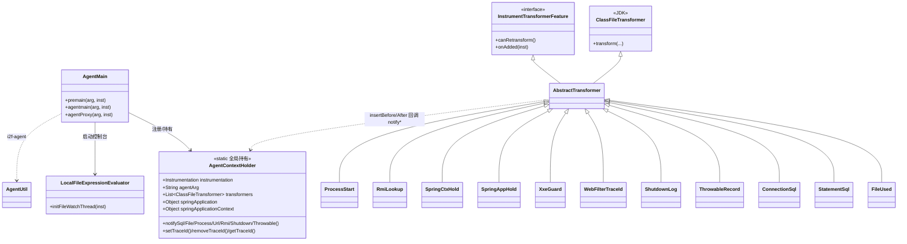

# i2f-extension-agent-javassist

> 基于 **Java Instrumentation Agent + Javassist** 的**运行期字节码增强观测套件**。以 `-javaagent` 启动期挂载（`premain`）或运行期动态附加（`agentmain`）方式，无需改动业务代码即可对整个 JVM 打点：捕获 **SQL**（`Connection.prepareStatement` / `Statement.execute*`）、**文件创建**（`java.io.File` 构造）、**RMI 查找**（`java.rmi.Naming.lookup`）、**进程启动**、**URL 连接**、**未捕获异常**（`Throwable` 构造）、**JVM 退出**（`java.lang.Shutdown.exit`）等事件并回调监听器；**捕获 Spring 的 `SpringApplication` / `ApplicationContext` 实例**到全局持有器；在 Servlet `Filter` 上**编织每请求 traceId**（桥接 SLF4J MDC 与 `i2f-log`）；**全局加固 XXE**（强制关闭 `DocumentBuilderFactory`/`SAXParserFactory`/`XMLInputFactory`/`SourceHttpMessageConverter` 的外部实体）；并提供一个**本地文件表达式热执行控制台**（轮询 `expression.java`，用 `i2f-compiler` 即时编译并在活 JVM 内求值）。全模块单包族 `i2f.extension.agent.javassist`、24 类，运行期仅依赖 Javassist（`provided`）。

## 模块路径

- `i2f-extension/i2f-extension-agent-javassist`

## 模块依赖

> 内部依赖在前、三方在后。经源码 `import` 逐一核实。

| 依赖 | Maven 坐标 | scope | optional | 说明 |
| --- | --- | --- | --- | --- |
| i2f-agent | `i2f.turbo:i2f-agent` | compile | 否 | **实依赖**：`AgentUtil`（`addTransformers`/`retransformLoadedClasses`/`isAssignableFrom(Class,String)`/`appendAgentJarToBootstrapClassLoaderSearch`/`parseClassPattenMap`）与 `InstrumentTransformerFeature` 契约 |
| i2f-extension-javassist | `i2f.turbo:i2f-extension-javassist` | compile | 否 | **实依赖**：`JavassistUtil.isAssignableFrom(CtClass,String)`、`getAllMethods(CtClass)` |
| i2f-compiler | `i2f.turbo:i2f-compiler` | compile | 否 | **实依赖**：`MemoryCompiler.evaluateExpression`（表达式热执行控制台） |
| javassist | `org.javassist:javassist:3.28.0-GA` | provided | 否 | `ClassPool`/`CtClass`/`CtMethod`/`CtConstructor`/`Modifier`，字节码改写核心 |
| tools.jar | `com.sun:tools:1.8.0`（`${java.home}/lib/tools.jar`） | system | 否 | **本模块源码零 `import`**；仅为让 `i2f-agent` 的 `com.sun.tools.attach.VirtualMachine`（动态附加）在打胖 jar 时可见 |
| lombok | `org.projectlombok:lombok` | compile | 否 | **声明但源码零引用**（无 `import lombok`、无任何注解）→ 冗余 |

> **传递使用但未直接声明**（依赖 `i2f-agent`/`i2f-compiler` 等带出的 i2f 模块）：`i2f.clock.SystemClock`（traceId 时间戳）、`i2f.jvm.JvmUtil.getPid`、`i2f.reflect.ReflectResolver`（MDC/LogHolder 反射桥接）、`i2f.match.StringMatcher`（`InvokeWatch` 的 ant 匹配）、`i2f.io.file.FileUtil.loadTxtFile`。这属**依赖声明不完整的隐患**。

### 打包与真实消费方

| 消费模块 | 关系 | 说明 |
| --- | --- | --- |
| `i2f-tools/i2f-tools-agent` | 打胖 agent jar | `maven-assembly-plugin` `jar-with-dependencies`，`finalName=i2f-tools-agent`，`Premain-Class`/`Agent-Class`=`i2f.extension.agent.javassist.AgentMain`、`Main-Class`=`i2f.agent.AppMain`（自附加控制台），并把 javassist 打进去 |
| `i2f-springboot/test-xxl-job` | 运行期挂载方 | 作为被增强目标应用引入本模块 |
| `i2f-extension/i2f-extension-all` | 聚合 | 汇总进扩展全家桶 |

> 本模块自带 `src/main/resources/META-INF/MANIFEST.MF` 是一份 agent 清单模板（`Premain-Class`/`Agent-Class`/`Can-Redefine-Classes`/`Can-Retransform-Classes`/`Main-Class`）；**权威清单由 `i2f-tools-agent` 打包时写入**。仓库根 `agent/i2f-tools-agent.jar` 即产出物。

## 模块设计



### 1. 启动装配：`AgentMain`

`premain`（`-javaagent` 启动前）与 `agentmain`（`VirtualMachine.loadAgent` 运行期附加）皆转发 `agentProxy`：

1. `AgentUtil.appendAgentJarToBootstrapClassLoaderSearch(inst)` —— 把 agent jar 及同级 `lib/*.jar` 注入 **Bootstrap 类加载器搜索路径**，使被增强的 JDK 核心类（`java.io.File`/`java.lang.Shutdown`）在改写后能看见 `AgentContextHolder`。
2. 把 `inst`、`arg` 存入 `AgentContextHolder`。
3. `LocalFileExpressionEvaluator.initFileWatchThread(inst)` —— 启动表达式热执行守护线程。
4. `transformers.add(...)` 依次登记 **11 个** transformer。
5. `AgentUtil.addTransformers(inst, transformers)` —— 先对每个 `inst.addTransformer(t, t.canRetransform())`，再统一回调 `t.onAdded(inst)` 触发**对已加载类的 retransform**。

### 2. 全局中枢：`AgentContextHolder`

单例 `HOLDER` + 一堆 `public static` 字段构成**进程级黑板**：

- **事件监听注册表**：`THROWABLE_LISTENER` / `SQL_LISTENER` / `FILE_LISTENER` / `SHUTDOWN_LISTENER` / `PROCESS_START_LISTENER` / `URL_OPEN_CONNECTION_LISTENER` / `RMI_NAMING_LOOKUP_LISTENER`，均为 `CopyOnWriteArrayList<Predicate/BiPredicate>`；每类配 `notify*()` 分发（遍历，任一 `test` 返回 `true` 即 `break`）。静态块为每个通道挂**默认打印监听**（`SystemOut*`/`SystemError*`）。
- **异常异步通道**：`notifyThrowable` 只入 `LinkedBlockingQueue` 并 `triggerThrowableDispatchThread`；单条守护线程 `throwable-dispatcher` 死循环 `take()` 分发，队列超 `THROWABLE_MAX_QUEUE_SIZE(8192)` 时丢弃最旧——**背压保护**。
- **Spring 捕获位**：`volatile Object springApplication` / `springApplicationContext`（供表达式控制台/远程诊断取用）。
- **traceId 编织**：`ThreadLocal threadTraceId/threadTraceSource`；`setTraceId(request)` 反射读 `getHeader("trace-id")/("traceId")/getParameter("traceId")`，缺省生成 `tid-<ts>-<pid>-<thread>-<uuid>`，并反射写入 **SLF4J MDC** 与 **`i2f.log.holder.LogHolder`**（load-once 守卫，任一不存在则跳过）；`removeTraceId` 对称清理。

### 3. 变换器族（`ClassFileTransformer` + `InstrumentTransformerFeature`）

统一骨架：`transform` 内先按类名过滤，命中则 `ClassPool.getDefault().get(name)`，对目标方法 `insertBefore/insertAfter` 注入回调 `AgentContextHolder.notify*` 的 Javassist 源码片段，`toBytecode()` 返回，`finally` 里 `detach()`。按职责分五组：

| 组 | 类 | 目标 | 动作 |
| --- | --- | --- | --- |
| 资源使用 | `FileUsedClassesTransformer` | `java.io.File` 全部构造 | `notifyFile(this)` |
| 资源使用 | `ProcessStartClassFileTransformer` | `ProcessBuilder.start()` | `notifyProcessStart(this)`（**当前失效**，见瑕疵 1） |
| 资源使用 | `UrlOpenConnectionClassFileTransformer` | `URL.openConnection()` | `notifyUrlOpenConnection(this)`（**未注册**，见瑕疵 2） |
| 资源使用 | `RmiNamingLookupClassFileTransformer` | `java.rmi.Naming.lookup(String)` | `notifyRmiNamingLookup($1)` |
| SQL | `ConnectionSqlClassesTransformer` | `Connection.prepareStatement/prepareCall`（首参 String） | `notifyStatementExecute(sql, null)` |
| SQL | `StatementSqlClassesTransformer` | `Statement.execute*`（首参 String 否则 sql=null） | `notifyStatementExecute(sql, this)` |
| 异常/退出 | `ThrowableRecordClassTransformer` | 名字以 `Throwable/Exception/Error` 结尾类的 public 构造 | `notifyThrowable(this)` |
| 异常/退出 | `ShutdownLogClassTransformer` | `java.lang.Shutdown.exit(int)` | `notifyShutdown(code, stack)` |
| Spring 捕获 | `SpringApplicationHoldClassesTransformer` | `SpringApplication`/`EventPublishingRunListener` 实例方法 | 反射字段抓取存入 `springApplication` |
| Spring 捕获 | `SpringApplicationContextHoldClassesTransformer` | 已知 Aware 处理器（硬编码 5 个 FQCN + 字段名） | 反射字段抓取存入 `springApplicationContext` |
| Web 横切 | `WebFilterThreadTraceIdClassesTransformer` | `*Filter.doFilter/doFilterInternal` | `setTraceId($1)` / finally `removeTraceId()` |
| Web 横切 | `XxeGuardClassTransformer` | 4 个 XML 工厂 `newInstance()` | 强制关外部实体/DTD |

> **未接线的 dead 类**：`InvokeWatchClassesTransformer`（通用 `args/stat/ret` AOP，`AgentMain` 中被注释）、`SpringBeanHoldClassesTransformer`（逐 bean 打印，从不注册）。`XxeGuard`/`WebFilter`/`Spring*` 组不回调 `AgentContextHolder` 而是直接内联逻辑或反射。

### 4. 热执行控制台：`LocalFileExpressionEvaluator`

守护线程 `local-file-expression-evaluator` 每 `3s` 轮询 `./expression/expression.java`；文件内容 `hashCode` 变化即 `MemoryCompiler.evaluateExpression(expr, AgentContextHolder.HOLDER, ADDITIONAL_IMPORTS)` 编译求值并以 `Object` 返回打印。`ADDITIONAL_IMPORTS` 预置 agent/i2f 常用包，`root` 即 `HOLDER` 故表达式可直接引用全局持有器与捕获到的 Spring 上下文——等价于一个**基于文件的热调试 REPL**。同时把自身所在 jar `appendToSystemClassLoaderSearch` 以便编译产物可见 agent 类。

## 模块目的

- **零侵入可观测**：不改业务代码、不加日志埋点，即可从字节码层观测 SQL/文件/进程/URL/RMI/异常/退出等关键副作用。
- **活体诊断入口**：经表达式控制台在运行中的 JVM 内即时执行 Java 片段，读取被捕获的 `SpringApplication`/`ApplicationContext`，把"线上只读排查"能力下放到 agent。
- **横切能力补齐**：为所有 Web `Filter` 自动织入 traceId 并对接 SLF4J/MDC 与 `i2f-log`；全局为常见 XML 解析入口注入 XXE 防护。
- **复用底座**：抽象/装配能力下沉 `i2f-agent`（`AgentUtil`、`InstrumentTransformerFeature`），字节码工具下沉 `i2f-extension-javassist`（`JavassistUtil`），编译下沉 `i2f-compiler`，本模块只做"目标选择 + 片段注入"。

## 模块功能

| 功能 | 载体 | 产出 |
| --- | --- | --- |
| SQL 语句捕获 | Connection/Statement transformer | `SQL_LISTENER`（默认 stdout） |
| 文件访问捕获 | FileUsed transformer | `FILE_LISTENER` |
| RMI 查找捕获 | RmiNamingLookup transformer | `RMI_NAMING_LOOKUP_LISTENER` |
| 未捕获异常记录 | ThrowableRecord transformer + 队列/分发线程 | `THROWABLE_LISTENER`（stderr） |
| JVM 退出栈记录 | ShutdownLog transformer | `SHUTDOWN_LISTENER`（stderr） |
| Spring 上下文捕获 | Spring{Application,ApplicationContext}Hold transformer | `AgentContextHolder.springApplication/Context` |
| 请求级 traceId | WebFilterTraceId transformer | `ThreadLocal` + MDC/`i2f-log` |
| XXE 全局加固 | XxeGuard transformer | 改写 4 个工厂 `newInstance()` |
| 活体表达式执行 | LocalFileExpressionEvaluator | 控制台打印求值结果 |
| 启动/附加装配 | `AgentMain` + `i2f-tools-agent`/`AppMain` | premain/agentmain 两条入口 |

## 模块主要使用方法

### 1. 启动期挂载（premain）

先用 `i2f-tools-agent` 打出胖 agent jar，再挂到任意应用：

```bash
java -javaagent:target/i2f-tools-agent.jar -jar your-app.jar
# 触发 i2f.extension.agent.javassist.AgentMain#premain -> agentProxy
```

### 2. 运行期动态附加（agentmain）

```bash
# Main-Class 指向 i2f.agent.AppMain：列出 JVM 进程→选序号→输入 agent jar→loadAgent
java -jar target/i2f-tools-agent.jar
```

### 3. 追加自定义监听（注意默认监听会截断）

```java
// 默认 SystemOut* 监听在下标 0 且返回 true -> 遍历到它即 break；
// 想让自己的监听生效，须先移除/替换默认监听，或插到队首。
AgentContextHolder.SQL_LISTENER.removeIf(l -> l instanceof SystemOutSqlPrintListener);
AgentContextHolder.SQL_LISTENER.add((sql, stat) -> {
    myCollector.record(sql);
    return false; // 返回 false 才会继续传给后续监听
});
```

### 4. 表达式热控制台

```text
// 编辑 ./expression/expression.java（≤3s 被拾取执行），root 即 AgentContextHolder.HOLDER：
i2f.extension.agent.javassist.context.AgentContextHolder.springApplicationContext
```

### 5. 取用被捕获的上下文 / traceId

```java
Object ctx = AgentContextHolder.springApplicationContext; // 反射调 getBean 即可拿任意 bean
String tid = AgentContextHolder.getTraceId();             // 当前请求 traceId
```

> **注意事项**：被增强类须能被 `ClassPool.getDefault()` 解析；对 Spring Boot 可执行 jar 里的 `BOOT-INF/classes` 应用类，默认 pool 看不到会静默放弃（见瑕疵 4）。挂载核心 JDK 类依赖 `appendAgentJarToBootstrapClassLoaderSearch`，故**必须以 jar 形式运行**，IDE 解压目录（`target/classes`）下该步返回 `null`、`File`/`Shutdown` 改写会因类不可见而失败。

## 模块特性总结

- **双入口 agent**：`premain` + `agentmain`（配合 `AppMain`/`AgentUtil` 动态附加），`Can-Redefine/Retransform-Classes=true`。
- **声明式目标选择**：每个 transformer 只写"类名过滤 + 方法名白名单 + 注入片段"，复用 `JavassistUtil.getAllMethods`（含父类/接口）与 `isAssignableFrom`。
- **事件总线式中枢**：`AgentContextHolder` 以监听器列表 + `notify*` 分发解耦"命中"与"处理"，异常走**队列 + 单守护线程 + 背压丢弃**的异步通道。
- **能力下沉**：装配在 `i2f-agent`、字节码工具在 `i2f-extension-javassist`、编译在 `i2f-compiler`，本模块专注目标与片段。
- **横切增强**：traceId 编织（桥 SLF4J/`i2f-log`）+ XXE 全局关闭 + Spring 上下文捕获 + 文件热执行 REPL。
- **零业务代码耦合**：全程反射（`ReflectResolver`），SLF4J/`i2f-log`/Spring 缺席即跳过。

## 已知实现瑕疵

> 逐行源码核实，非编译错误，多为"失效 / 语义 / 边界 / 可维护性"问题。

1. **进程启动监控完全失效**：`ProcessStartClassFileTransformer` 对名为 `start` 的方法要求 `parameterTypes.length == 1`，但 `java.lang.ProcessBuilder.start()` 是**零参**方法——条件恒不满足，`notifyProcessStart` 永不注入。`PROCESS_START_LISTENER` 及其默认监听形同虚设。

2. **两个 transformer 从未接线**：`UrlOpenConnectionClassFileTransformer` 与 `SpringBeanHoldClassesTransformer` 在 `AgentMain` 中**从未 `add`**（全仓也无其它引用）；故 URL 打开、逐 bean 观测均为 dead。尤其 `URL_OPEN_CONNECTION_LISTENER` 静态块里挂了默认监听却永无调用方。`InvokeWatchClassesTransformer` 亦被注释掉。

3. **监听器扩展被默认实现截断**：所有 `notify*` 采用"遍历 + 任一返回 `true` 即 `break`"，而静态块注册的默认 `SystemOut*/SystemError*` 监听**恒返回 `true` 且位于队首**。用户用 `LISTENER.add(...)`（追加到尾部）注册的监听**永远轮不到**。必须显式移除默认监听或插到队首。

4. **类加载器可见性缺陷**：所有 transformer 用 `ClassPool.getDefault()` 且**忽略 `transform` 的 `loader` 入参**。对非系统类加载器加载的类（Spring Boot `LaunchedURLClassLoader`、自定义 loader），`pool.get(name)` 抛 `NotFoundException`，被 `catch` 后**静默返回原字节码**——增强对这些类无声失效。正解应 `cp.insertClassPath(new LoaderClassPath(loader))`。

5. **XXE 防护不完整**：`DocumentBuilderFactory` 分支仅 `setExpandEntityReferences(false)`，**不足以阻断 XXE**（未关 `http://apache.org/xml/features/disallow-doctype-decl`/外部通用实体），且只补 `newInstance()` 无参重载、只覆盖 `javax.*`（无 `jakarta.*`）。相较之下 `SAXParserFactory`/`XMLInputFactory` 分支较完整，防护强度不一致。

6. **大范围/高危增强带来的性能与稳定性风险**：`ThrowableRecord` 改写**所有** `*Exception/Error` 的 public 构造（进程级高频路径，且格式化时再抛异常有递归放大之虞）；`ShutdownLog` retransform `java.lang.Shutdown`（JVM 核心类，改写脆弱、可能被拒）；`FileUsed` 改写 `java.io.File` 所有构造且默认监听**每次 `new File` 都 println**，极端刷屏。

7. **`parseClassPattenMap` 结果被丢弃**：`agentProxy` 里 `Map actionPattens = AgentUtil.parseClassPattenMap(arg)` 计算后**未使用**（唯一消费者 `InvokeWatch` 已注释）。故 `-javaagent:...=args,stat,ret@...` 这套在 `AgentMain`/`AppMain` 注释里详述的 DSL 参数**当前完全惰性**，仅剩"启动即挂载固定 11 个 transformer"的实际行为。

8. **Spring 捕获依赖硬编码内部结构**：`Spring{,ApplicationContext}Hold` 以写死的 Spring 内部类 FQCN + 私有字段名（如 `WebApplicationContextServletContextAwareProcessor.webApplicationContext`）反射 `getDeclaredField`，并对这些类的**全部实例方法** `insertBefore`——跨 Spring 大版本极易失配、且注入面偏大。

9. **traceId 桥接的小缺陷**：`setTraceId` 连续两次以相同实参调用 `getParameter("traceId")`（复制粘贴冗余）；load-once 守卫 `if(!initialXxx.getAndSet(true))` 使**首次调用时若 SLF4J/LogHolder 尚未在 classpath 则此后永不重试**；`System.out.println("filter-holder-set-trace-id: "+request)` 每请求打印，生产噪声。

10. **Prepared 语句 SQL 双记**：`Connection.prepareStatement(sql)` 与后续 `Statement.execute(sql)` 都触发 `notifyStatementExecute`（前者 `statement=null`、后者带 `this`），默认监听下同一 SQL 打印两遍。

11. **依赖声明问题**：`lombok` 声明但零引用（冗余）；直接使用 `SystemClock`/`JvmUtil`/`ReflectResolver`/`StringMatcher`/`FileUtil` 却**未在 pom 直接声明**其宿主模块，全靠传递依赖，易随上游调整而断链。

12. **装配细节**：`FileUsedClassesTransformer.onAdded` 用**裸非守护线程** `sleep(8s)` 后再 retransform（其余 transformer 走 `retransformLoadedClasses`），最坏拖慢退出 8s；`premain` 与 `agentmain` 均无重复装配守卫，若同一 JVM 先 `-javaagent` 再动态附加会**二次注册全部 transformer**。
