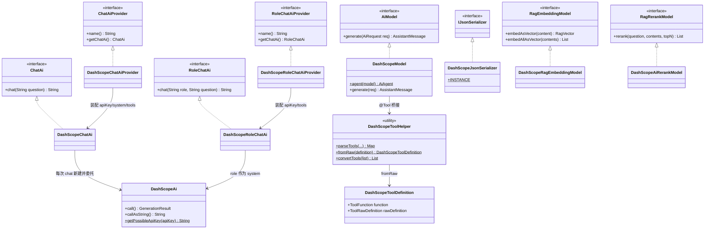
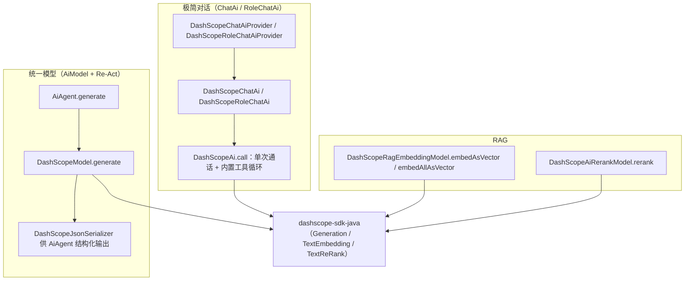
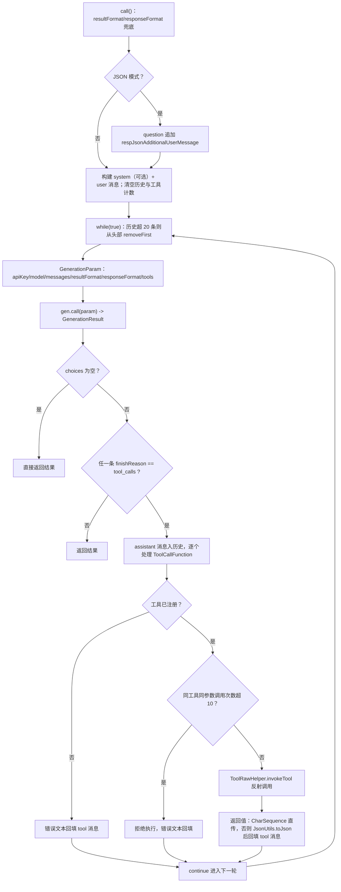

# i2f-extension-ai-dashscope

> 基于 **阿里云百炼（DashScope）官方 Java SDK** 的 **`i2f-ai-std` 契约实现族**（13 个源文件：11 main + 2 test）：以「极简对话」`ChatAi`/`RoleChatAi`（+`*Provider`）、「统一模型」`AiModel`（`DashScopeModel` + `DashScopeJsonSerializer`）、「RAG」`RagEmbeddingModel`/`RagRerankModel` 三组契约对接通义千问系列——对话（qwen-plus）、文本向量化（text-embedding-v4）、重排序（gte-rerank-v2）。`DashScopeAi` 是底层通话实现并内置 **function-calling 自循环**（工具执行、同参 10 次限流、错误回填），`DashScopeToolHelper` 把上游 `@Tool` 注解桥接为 DashScope `ToolFunction`；`dashscope-sdk-java` 以 `provided` + `optional` 引入，运行期须由使用方提供。

## 模块路径

- `i2f-extension/i2f-extension-ai-dashscope`

## 模块依赖

> 内部依赖在前、三方在后。经全模块源码 `import` 逐一核实。

| 依赖 | Maven 坐标 | scope | optional | 说明 |
| --- | --- | --- | --- | --- |
| i2f-ai-std | `i2f.turbo:i2f-ai-std`（版本由父 POM `i2f.version` 管理） | compile | 否 | **实依赖**：`ChatAi`/`RoleChatAi`/`*Provider`、`AiModel`/`AiRequest`/消息族（`User/System/Assistant/Tool`）、`RagEmbeddingModel`/`RagVector`、`RagRerankModel`/`RagRerankDocument`、`ToolRawHelper`/`ToolRawDefinition`/`JsonSchemaAnnotationResolver` 等契约 |
| i2f-context-impl | `i2f.turbo:i2f-context-impl` | compile | 否 | **实依赖**：`ListableContext`（两个 Provider 的默认工具上下文）；并传递上游 `i2f-context-std` 的 `IContext`（`parseTools(IContext)` 形参） |
| i2f-serialize-std | `i2f.turbo:i2f-serialize-std` | compile | 否 | **实依赖**：`IJsonSerializer` —— `DashScopeJsonSerializer` 的落地接口 |
| i2f-convert | `i2f.turbo:i2f-convert` | compile | 否 | **源码零 `import`**：冗余声明，模块源码未直接使用 |
| lombok | `org.projectlombok:lombok` | compile | 否 | **真实使用**：`@Data` `@NoArgsConstructor`（几乎全部类） |
| dashscope-sdk-java | `com.alibaba:dashscope-sdk-java:2.22.12` | provided | **是** | **实依赖**：`Generation`/`Message`/`ToolFunction`/`TextEmbedding`/`TextReRank`/`JsonUtils` 等；编译与测试可见，**运行期须使用方提供**；`com.google.gson`（`TypeToken`/`JsonObject` 被直接使用）由其传递提供 |

> 注记：dashscope-sdk-java 的版本 `2.22.12` 直接声明在模块 pom 中（根 POM 的 `dependencyManagement` 未收录该三方坐标，仅管理本项目坐标 `i2f-extension-ai-dashscope` 的版本）。`provided` + `optional` 双保险意味着：既不会传递给下游依赖树，也不参与运行期类路径，使用方必须显式引入 SDK（及其 gson 传递链）。

### 消费方与聚合

| 消费模块 | 关系 | 说明 |
| --- | --- | --- |
| `i2f-extension/i2f-extension-all` | 聚合引入 | 汇总进扩展全家桶（无版本号，走根 POM 管理） |
| `i2f-springboot/i2f-springboot-ai-starter` | 直接引用 | `SpringAiServiceAutoConfiguration`：`i2f.springboot.ai.model.dashscope.enable`（默认 `false`）时用 `DashScopeModel().apiKey().model()` 注册全局 `AiModel` Bean（`@ConditionalOnMissingBean(AiModel.class)`，默认优先的 `HttpOpenAiAiModel` 开时互斥）；属性前缀 `i2f.springboot.ai.model.dashscope` |
| `i2f-springboot/i2f-springboot-xproc4j-starter` | 直接引用 | `DashScopeAiAutoConfiguration`（`@ConditionalOnClass(Generation.class)`、`dashscope.ai.enable` 默认 `true`）：注册 `DashScopeChatAiProvider`/`DashScopeRoleChatAiProvider` Bean——apiKey 经 `DashScopeAi.getPossibleApiKey` 回退环境变量、`SpringContext` 作为工具上下文；另有 `dashscope.ai.chat-ai.enable`/`dashscope.ai.role-chat-ai.enable` 开关 |
| `test` 包（main 源码树） | 自测 | `TestDashScopeAi`（Provider + 工具 + 技能提示词）与 `TestDashScopeAgent`（AiAgent + `DashScopeModel` 全链路） |

> `DashScopeRagEmbeddingModel`/`DashScopeAiRerankModel`/`DashScopeJsonSerializer`/`DashScopeToolHelper` 全仓仅在本模块内被引用；`i2f-extension-ai-langchain4j8`、`i2f-extension-ai-openai` 中的 `DASHSCOPE_BASE_URL`/`DASHSCOPE_AI_API_KEY` 字符串属于「OpenAI 兼容模式」并列实现，与本模块无代码依赖。

## 模块设计

### 1. 契约实现全景



### 2. 三条调用链路



- **极简对话**：`chat(question)` 每次新建 `DashScopeAi` 实例装配字段后 `callAsString()`，实例级状态（历史、计数器）天然隔离；`RoleChatAi` 把 `role` 映射为 system 消息。
- **统一模型**：`DashScopeModel` 实现 `AiModel.generate(AiRequest)`，在 `AiAgent` 的 Re-Act 循环中承接「消息转换 + 工具声明 + 结果解析」，tools 由 `AiAgent` 过滤/合并后下发。
- **RAG**：向量化（`text-embedding-v4`，默认 1024 维，`embedAllAsVector` 按 10 条/批自动切分）与重排序（`gte-rerank-v2`）均为独立小类，契合 `i2f-ai-std` 的 `RagWorker` 编排契约。

### 3. `DashScopeAi` 的 function-calling 自循环（ChatAi 路径）



- **循环退出**：`isToolCall` 置位后 `continue`，仅当无任何工具调用时返回；工具异常被捕获（解包 `InvocationTargetException`）后以「错误文本」形式回填给模型，让模型自纠。
- **工具身份**：`toolCallCounter` 以 `name#arguments` 为键（`ConcurrentHashMap` + `AtomicInteger`）防同参死循环，超 10 次拒绝执行；计数在每次 `call()` 入口清空。
- **历史窗口**：每轮迭代前 `while (size > 20) removeFirst()` 硬裁剪，控制 token 消耗。

### 4. `DashScopeModel.generate`（AiModel 路径）

| 环节 | 行为 |
| --- | --- |
| 消息转换 | `UserMessage`/`SystemMessage`/`ToolMessage`/`AssistantMessage` → DashScope `Message`（role/content/toolCallId）；已转换过的 `rawMessage` 复用，反向回写（`setRawMessage`） |
| 工具请求还原 | `AssistantMessage.toolCallRequestList` → `ToolCallFunction` 列表（含 `id/name/arguments/output=json`） |
| 工具声明 | `req.getToolMap()` → `DashScopeToolHelper.fromRaw` → `GenerationParam.tools(...)`；`n(1)` 限定单 choice |
| 结果解析 | `finishReason == tool_calls` 的 choice → `ToolCallRequest` 列表；否则收集文本；`finishReason` 归一为 `STOP`/`TOOL_CALL` |

### 5. 工具桥接（`@Tool` → DashScope `ToolFunction`）

- `DashScopeToolHelper.parseTools` 提供三种入口：`IContext`（按 IoC 容器扫描）、`Collection<Object>`、`Object...`；内部统一走上游 `ToolRawHelper.parseTools(JsonSchemaAnnotationResolver.INSTANCE, ...)` 得到 `Map<String, ToolRawDefinition>`。
- `fromRaw` 把 `FunctionJsonSchema.parameters` 经 `JsonUtils.toJson` → `parseString` 转成 Gson `JsonObject`，装配 `ToolFunction.builder().function(FunctionDefinition{name, description, parameters})`。
- `DashScopeToolDefinition` 同时持有 `function`（声明给 SDK）与 `rawDefinition`（调用时经 `ToolRawHelper.invokeTool` 反射执行），是"声明-执行"双桥的载体；`DashScopeToolDefinition` 上还有与 Helper 同签名的一层静态便捷方法。

### 6. 包结构

| 包 | 类 | 职责 |
| --- | --- | --- |
| `impl` | `DashScopeAi`、`DashScopeChatAi`、`DashScopeChatAiProvider`、`DashScopeRoleChatAi`、`DashScopeRoleChatAiProvider` | 底层通话 + 内置工具循环；极简对话契约与 Provider 装配 |
| `model` | `DashScopeModel`、`DashScopeJsonSerializer` | `AiModel`/`IJsonSerializer` 契约实现（对接 AiAgent） |
| `rag` / `rag.rerank` | `DashScopeRagEmbeddingModel`、`DashScopeAiRerankModel` | 文本向量化与重排序 |
| `tool` | `DashScopeToolDefinition`、`DashScopeToolHelper` | `@Tool` 注解桥接为 DashScope 工具声明 |
| `test` | `TestDashScopeAi`、`TestDashScopeAgent` | 可运行示例（位于 main 源码树，随 jar 打包） |

## 模块目的

- **为 DashScope/通义千问落地统一契约**：让百炼模型与 `i2f-ai-rest-openai`（自研 HTTP）、`i2f-extension-ai-langchain4j8`、`i2f-extension-ai-openai` 等实现站在同一抽象面（`ChatAi`/`AiModel`/RAG），按需插拔。
- **三种粒度开箱即用**：一句话对话（`ChatAi`）、完整 Re-Act Agent（`AiModel` + `AiAgent`）、RAG 组件（Embedding/Rerank），覆盖从脚本到生产集成的不同场景。
- **补齐 SDK 缺失的编排**：DashScope SDK 只提供单次调用，本模块在 `DashScopeAi` 内补齐 function-calling 循环、错误回填、同参限流、历史裁剪。
- **默认值友好**：`qwen-plus`、`text-embedding-v4`（1024 维）、`gte-rerank-v2` 开箱可用；API Key 支持 `DASHSCOPE_AI_API_KEY` 环境变量/系统属性兜底（`DashScopeAi.getPossibleApiKey`）。

## 模块功能

| 功能 | 入口 | 说明 |
| --- | --- | --- |
| 极简对话 | `DashScopeChatAi` / `DashScopeChatAiProvider` | `chat(question)`，可选 system 提示词 |
| 角色对话 | `DashScopeRoleChatAi` / `DashScopeRoleChatAiProvider` | `chat(role, question)`，role 即 system |
| 统一模型 | `DashScopeModel`（implements `AiModel`） | 对接 `AiAgent` Re-Act：多轮消息、工具声明、`TOOL_CALL`/`STOP` 归一 |
| Agent 便捷装配 | `DashScopeModel.agent(model)` | 返回已装配 `DashScopeJsonSerializer` 的 `AiAgent` |
| JSON 输出模式 | `GenResultFormat`（TEXT/MESSAGE）× `GenResponseFormat`（TEXT/JSON） | JSON 模式自动追加"仅输出 JSON"约束提示词 |
| function-calling | `DashScopeAi` 自循环 + `DashScopeToolHelper` | `@Tool` 桥接、反射调用、异常回填、同参 10 次限流 |
| JSON 序列化 | `DashScopeJsonSerializer`（implements `IJsonSerializer`） | 基于 SDK `JsonUtils`（Gson），单例 `INSTANCE` |
| 文本向量化 | `DashScopeRagEmbeddingModel` | 单条/批量（10 条/批自动分批） |
| 重排序 | `DashScopeAiRerankModel` | `rerank(question, contents, topN)` → `RagRerankDocument{text,index,score}` |
| API Key 兜底 | `DashScopeAi.getPossibleApiKey` / `getPossibleApiKey(apiKey)` | 空值时回退环境变量/系统属性 `DASHSCOPE_AI_API_KEY` |

## 模块主要使用方法

### 1. Provider + ChatAi（对齐 `TestDashScopeAi`）

```java
DashScopeChatAiProvider provider = new DashScopeChatAiProvider();
provider.setApiKey(System.getenv("DASHSCOPE_AI_API_KEY"));

// 把工具/技能 Bean 放入上下文，Provider 装配时自动解析为工具声明
ListableContext context = new ListableContext();
context.addBean(new TestToolComponent());
context.addBean(new SkillsTools());
provider.setContext(context);

// 可选：技能系统提示词（上游 i2f-ai-std）
provider.setSystem(SkillsHelper.convertSkillDefinitionsAsSystemPrompt(
        SkillsHelper.scanFileSystemSkills()));

ChatAi chatAi = provider.getChatAi();
String ret = chatAi.chat("北京的今天的天气怎么样，并且给出今天的日期");
```

### 2. AiAgent + DashScopeModel（对齐 `TestDashScopeAgent`）

```java
AiAgent agent = new AiAgent()
        .model(new DashScopeModel()
                .apiKey(System.getenv("DASHSCOPE_AI_API_KEY"))
                .model(DashScopeAi.DEFAULT_MODEL))
        .jsonSerializer(DashScopeJsonSerializer.INSTANCE);
// 等价便捷写法：AiAgent agent = DashScopeModel.agent(dashScopeModel);

AiAgentResponse resp = agent.generate(new AiRequest()
                .user("北京的今天的天气怎么样？")
                .tools(ToolRawHelper.parseTools(JsonSchemaAnnotationResolver.INSTANCE, new TestToolComponent())),
        new AiAgentContext());
```

### 3. JSON 输出模式

```java
DashScopeChatAi chatAi = new DashScopeChatAi();
chatAi.setApiKey(System.getenv("DASHSCOPE_AI_API_KEY"));
chatAi.setResultFormat(DashScopeAi.GenResultFormat.MESSAGE);   // 需要 MESSAGE 才能取到多模态/内容列表
chatAi.setResponseFormat(DashScopeAi.GenResponseFormat.JSON);  // 自动追加“仅输出 JSON”提示词
String json = chatAi.chat("以 JSON 输出：{name, age}");
```

### 4. RAG 组件

```java
// 向量化：单条 / 批量（内部按 10 条/批自动拆分）
DashScopeRagEmbeddingModel embedding = new DashScopeRagEmbeddingModel()
        .apiKey(System.getenv("DASHSCOPE_AI_API_KEY"))
        .model("text-embedding-v4");
RagVector vec = embedding.embedAsVector("你好");

// 重排序：注意本类无 apiKey 入口，走 SDK 默认的 DASHSCOPE_API_KEY 环境变量（见瑕疵 9）
List<RagRerankDocument> ranked = new DashScopeAiRerankModel()
        .rerank("你好", Arrays.asList("你好呀", "再见", "晚上好"), 2);
```

### 5. 直接使用工具桥接

```java
// 三种入口任选：IContext / Collection / 变参
Map<String, DashScopeToolDefinition> tools = DashScopeToolHelper.parseTools(new TestToolComponent());
// 或 DashScopeToolDefinition.parseTools(context) / parseTools(bean...)

DashScopeChatAi chatAi = new DashScopeChatAi();
chatAi.setApiKey(System.getenv("DASHSCOPE_AI_API_KEY"));
chatAi.setToolDefinitionMap(tools);
```

### 6. 注意事项

- **运行期依赖须自行补齐**：`dashscope-sdk-java` 为 `provided` + `optional`，使用方需显式引入（如 `com.alibaba:dashscope-sdk-java:2.22.12`，含 gson 传递链），否则类加载即失败。
- **API Key 三种来源**：字段直设 > 环境变量 `DASHSCOPE_AI_API_KEY` > 系统属性 `DASHSCOPE_AI_API_KEY`（后两者仅当显式调用 `getPossibleApiKey` 时生效；重排序模型例外，见瑕疵 9）。
- **JSON 模式注意**：`GenResponseFormat.JSON` 会向 user 消息追加固定提示词；`call()` 对字段 `question` 原地追加（见瑕疵 1），**不要复用同一 `DashScopeAi` 实例反复 `call()`**。
- **`provided` 的灵活用法**：若应用自身已引入更新版本的 dashscope SDK，可利用 `provided` 机制替换版本而不冲突。

## 模块特性总结

- **三组契约全落地**：对话（ChatAi/RoleChatAi + Provider）、统一模型（AiModel + IJsonSerializer）、RAG（Embedding + Rerank），与其它 AI 实现模块可互换。
- **内建工具循环**：`DashScopeAi` 单类完成「调用 → 工具执行 → 回填 → 再调用」全链路，含异常回填与同参限流，不依赖上游 `AiAgent`。
- **双路径 JSON**：`DashScopeJsonSerializer` 服务 `AiAgent` 结构化输出；SDK `JsonUtils` 服务工具参数/返回值直转。
- **双形态装配**：同一底层能力既可从 `ChatAi`（简单实例字段）进入，也可从 `AiModel`（AiAgent）进入，默认值一致（qwen-plus）。
- **默认值齐全**：模型、维度、批大小、重排序模型均有合理默认；API Key 可环境变量兜底。
- **集成就绪**：SpringBoot 两个 starter 直接接线（AiModel Bean / ChatAiProvider Bean），并已在 `i2f-extension-all` 聚合。
- **示例齐备**：`test` 包两条可运行示例覆盖 Provider/Agent 两条主链路。

## 模块瑕疵或错误

> 逐行源码核实，均为「状态管理 / 边界 / 契约一致性」类问题，不影响正常主流程使用。

1. **JSON 模式提示词在字段上累积追加**：`DashScopeAi.call()` 中 `question = question + "\n" + respJsonAdditionalUserMessage` 直接修改字段而非局部变量。同一实例二次 `call()`（如复用实例轮询提问）会把提示词越积越多，且历史上送内容被污染；应改为局部变量拼接。

2. **`responseFormat` 的 null 兜底未覆盖请求装配**：方法开头用局部变量 `resp`/`result` 做了 null 兜底，但 `GenerationParam` 装配行 `ResponseFormat.from(responseFormat.text())` 直接引用字段——实例被显式 `setResponseFormat(null)` 时 NPE（相邻的 `resultFormat` 行却正确使用了兜底变量 `result`，写法不一致）。

3. **历史窗口硬编码 20 且从头部删除**：`while (historyMessageList.size() > 20) historyMessageList.removeFirst()` 位于每轮循环入口，长工具链对话会优先丢掉最前面的 `system` 消息（语义上应优先保留），且条数不可配置。

4. **工具限流策略的副作用**：`toolCallCounter` 以 `name#arguments` 计数，**成功调用同样计入**，阈值 10 硬编码且无配置出口；对大参数字符串直接拼 key（长期高频时注意内存）。

5. **`DashScopeModel.generate` 不判空 `req.getToolMap()`**：`AiRequest` 未调用过 `.tools(...)` 时 `toolMap` 为 `null`，`toolRawMap.entrySet()` 直接 NPE。经 `AiAgent` 调用不受影响（其内部以 `TreeMap` 兜底），把 `DashScopeModel` 当作独立 `AiModel` 直接使用时须自行装配工具。

6. **`DashScopeModel` 消息转换静默丢弃未知消息**：消息转换是 `instanceof` 四分支链（User/System/Tool/Assistant），自定义 `AiMessage` 实现不会进入请求且无任何告警。

7. **`DashScopeRagEmbeddingModel.dimension` 字段形同虚设**：`TextEmbeddingParam` 的 `dimension` 参数用了常量 `DEFAULT_DIMENSION`（1024）而非字段值，`dimension(int)` 流式设置无效；且 `statusCode` 为 null 时 `200 != statusCode` 存在拆箱 NPE 风险。

8. **重排序模型无 `apiKey` 入口**：`DashScopeAiRerankModel` 未向 `TextReRankParam` 传递 apiKey，只能依赖 dashscope SDK 默认的 `DASHSCOPE_API_KEY` 环境变量/系统属性——与本模块其余入口的 `DASHSCOPE_AI_API_KEY` **不同名**，集成时易踩坑；此外 `output.getResults()` 未判空，`topN <= 0` 时因"先添加后判断"仍会返回 1 条。

9. **Provider 默认值未复用常量**：`DashScopeChatAiProvider`/`DashScopeRoleChatAiProvider` 的 `model` 字段硬编码字面量 `"qwen-plus"`（而非 `DashScopeAi.DEFAULT_MODEL`）；且 Provider 不自动调用 `getPossibleApiKey` 做环境变量兜底，需依赖方自理（xproc4j starter 中显式调用了它，可作参照）。

10. **`unwrapResultAsString` 多 choice 只保留最后一条**：`builder.setLength(0)` 位于 choice 循环内部，SDK 若返回多 choice，仅最后一个的文本被保留（当前默认 `n=1` 场景影响有限，属潜在问题）。

11. **多模态分支输出格式不统一**：`unwrapResultAsString` 对 `MessageContentText`/`MessageContentImageURL` 拼接的是 `---\n# text`/`---\n# url` 形式的伪 Markdown 拼装文本，纯文本场景则原样输出，两种形态下游解析口径不一致。

## 消费方与生态位置

- **同族并列**：`i2f-ai-rest-openai`（i2f-jdk，自研 HTTP 实现）、`i2f-extension-ai-openai`（OpenAI 兼容协议，默认 baseUrl 指向 DashScope compatible-mode）、`i2f-extension-ai-langchain4j8`（LangChain4j 实现，同样默认可指向 compatible-mode）——本模块是其中**唯一使用 DashScope 官方 SDK** 的实现，能力面额外覆盖原生 Embedding/Rerank 与 SDK 级工具声明。
- **上游契约**：全部抽象来自 `i2f-ai-std`（详见 [i2f-ai-std 模块文档](../../i2f-jdk/i2f-ai-std/readme.md)），其文档明确"具体模型/向量库由实现方（如 `i2f-extension-ai-*`）落地"，本模块即该定位的对话/向量/重排实现。
- **SpringBoot 集成**：`i2f-springboot-ai-starter`（AiModel Bean）与 `i2f-springboot-xproc4j-starter`（ChatAi/RoleChatAi Provider Bean）两处自动配置，均为条件装配、属性可关。
