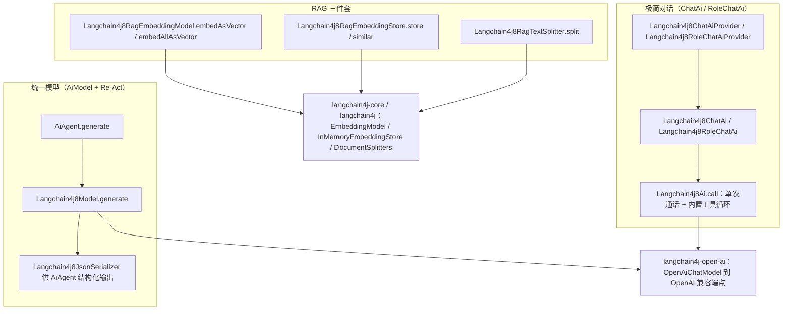
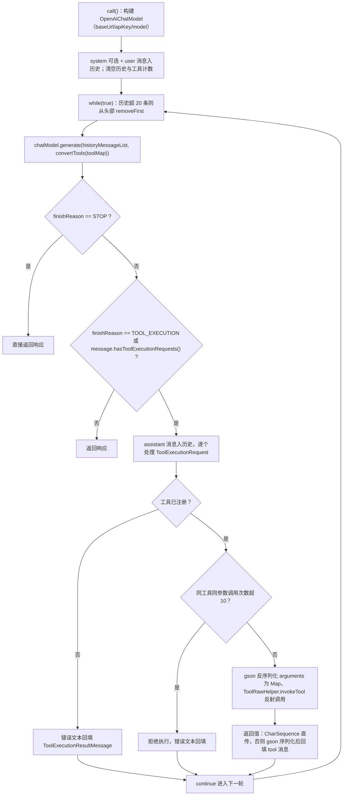

# i2f-extension-ai-langchain4j8

> 面向 **Java 8** 的 **langchain4j 0.31.0** 版 `i2f-ai-std` 契约实现族（16 个源文件：14 main + 2 test）：以「极简对话」`ChatAi`/`RoleChatAi`（+`*Provider`）、「统一模型」`AiModel`（`Langchain4j8Model` + `Langchain4j8OpenAiModel` + `Langchain4j8JsonSerializer`）与「RAG 三件套」（`RagEmbeddingModel`/`RagEmbeddingStore`/`RagTextSplitter`）复用 langchain4j 原生模型、消息、存储与工具类型（`ChatLanguageModel`/`AiMessage`/`ToolSpecification`/`EmbeddingModel`/`InMemoryEmbeddingStore`）对接任意 OpenAI 兼容端点——默认阿里云百炼兼容模式（`https://dashscope.aliyuncs.com/compatible-mode/v1`）与 `qwen-plus`。`Langchain4j8Ai` 内置 **function-calling 自循环**（工具执行、同参 10 次限流、错误回填），`Langchain4j8JsonSchemaAnnotationResolver` 在上游 `@Tool`/`@ToolParam` 注解体系之外追加识别 langchain4j 原生 `@Tool`/`@P` 注解；`langchain4j` 与 `langchain4j-open-ai`（0.31.0——最后支持 Java 8 的 langchain4j 版本，模块名 `8` 由此而来）均以 `provided` + `optional` 引入，运行期须由使用方提供。

## 模块路径

- `i2f-extension/i2f-extension-ai-langchain4j8`

## 模块依赖

> 内部依赖在前、三方在后。经全模块源码 `import` 逐一核实。

| 依赖 | Maven 坐标 | scope | optional | 说明 |
| --- | --- | --- | --- | --- |
| i2f-ai-std | `i2f.turbo:i2f-ai-std`（版本由父 POM `i2f.version` 管理） | compile | 否 | **实依赖**：`ChatAi`/`RoleChatAi`/`*Provider`、`AiModel`/`AiRequest`/消息族（`User/System/Assistant/Tool`）、`RagEmbeddingModel`/`RagEmbedding`/`RagVector`/`RagEmbeddingStore`/`RagTextSplitter`、`ToolRawHelper`/`ToolRawDefinition`/`JsonSchema`/`FunctionJsonSchema`/`JsonSchemaAnnotationResolver` 等契约 |
| i2f-context-impl | `i2f.turbo:i2f-context-impl` | compile | 否 | **实依赖**：`ListableContext`（两个 Provider 的默认工具上下文）；并传递上游 `i2f-context-std` 的 `IContext`（`parseTools(IContext)` 形参） |
| i2f-serialize-std | `i2f.turbo:i2f-serialize-std` | compile | 否 | **实依赖**：`IJsonSerializer` —— `Langchain4j8JsonSerializer` 的落地接口 |
| i2f-convert | `i2f.turbo:i2f-convert` | compile | 否 | **源码零 `import`**：冗余声明，模块源码未直接使用 |
| lombok | `org.projectlombok:lombok` | compile | 否 | **真实使用**：`@Data` `@NoArgsConstructor`（几乎全部类） |
| langchain4j | `dev.langchain4j:langchain4j:0.31.0` | provided | **是** | **实依赖**：`dev.langchain4j.data.document.*`（`Document`/`DocumentSplitter`/`DocumentSplitters`）与 `store.embedding.inmemory.InMemoryEmbeddingStore`（本地反编译核实 jar 归属）；传递提供 `langchain4j-core` |
| langchain4j-open-ai | `dev.langchain4j:langchain4j-open-ai:0.31.0` | provided | **是** | **实依赖**：`OpenAiChatModel`（底层通话）；传递提供 `langchain4j-core`（`agent.tool` 的 `@Tool`/`@P`/`ToolSpecification`/`ToolParameters`/`ToolExecutionRequest`、`data.message` 消息族、`ChatLanguageModel`/`EmbeddingModel`/`FinishReason`/`Response`、`data.embedding.Embedding`/`data.segment.TextSegment`、`store.embedding.*` 等，均经反编译核实）、`openai4j`（0.17.0）、`retrofit`/`okhttp` 与 **gson**（`Gson`/`TypeToken` 被本模块直接 `import`） |

> 注记：langchain4j 两个坐标的版本 `0.31.0` 直接声明在模块 pom 中（根 POM 的 `dependencyManagement` 未管理 `dev.langchain4j` 坐标，仅管理本项目坐标 `i2f-extension-ai-langchain4j8` 的版本）。`provided` + `optional` 双保险意味着：既不会传递给下游依赖树，也不参与运行期类路径，使用方必须显式引入 langchain4j + langchain4j-open-ai 0.31.0（含 core/openai4j/gson/okhttp 传递链）。

### 消费方与聚合

| 消费模块 | 关系 | 说明 |
| --- | --- | --- |
| `i2f-extension/i2f-extension-all` | 聚合引入 | 汇总进扩展全家桶（无版本号，走根 POM 管理；i2f-extension-all:29） |
| `i2f-springboot/i2f-springboot-ai-starter` | **声明未用** | pom 第 70-73 行声明依赖，但全模块 Java 源码零引用（仅 pom 命中 `langchain`）；其 `SpringAiServiceAutoConfiguration` 注册的是 `HttpOpenAiAiModel`（`i2f.springboot.ai.model.rest-openai.enable` 默认 true）与 `DashScopeModel`（`...dashscope.enable` 默认 false） |
| `test` 包（main 源码树） | 自测 | `TestLangchain4j8Ai`（Provider + 工具上下文 + 技能提示词）与 `TestLangchain4j8Agent`（AiAgent + `Langchain4j8Model.openai()` 全链路）；演示类位于 main 源码树随 jar 打包 |

## 模块设计

### 1. 契约实现全景

```mermaid
classDiagram
    class ChatAi {
        <<interface>>
        +chat(String question) String
    }
    class RoleChatAi {
        <<interface>>
        +chat(String role, String question) String
    }
    class ChatAiProvider {
        <<interface>>
        +name() String
        +getChatAi() ChatAi
    }
    class RoleChatAiProvider {
        <<interface>>
        +name() String
        +getChatAi() RoleChatAi
    }
    class AiModel {
        <<interface>>
        +generate(AiRequest req) AssistantMessage
    }
    class IJsonSerializer {
        <<interface>>
    }
    class RagEmbeddingModel {
        <<interface>>
        +embedAsVector(content) RagVector
        +embedAllAsVector(contents) List
    }
    class RagEmbeddingStore {
        <<interface>>
        +store(embedding) String
        +similar(vector, topN) List
    }
    class RagTextSplitter {
        <<interface>>
        +split(text) List
    }
    class JsonSchemaAnnotationResolver {
        +isToolMethod(method) boolean
        +getToolMethodName(method) String
    }
    class Langchain4j8Ai {
        +call() Response
        +callAsString() String
        +getPossibleApiKey(apiKey) String$
    }
    class Langchain4j8ChatAi
    class Langchain4j8ChatAiProvider
    class Langchain4j8RoleChatAi
    class Langchain4j8RoleChatAiProvider
    class Langchain4j8Model {
        +agent(model) AiAgent$
        +openai() OpenAiBuilder$
        +generate(req) AssistantMessage
    }
    class Langchain4j8OpenAiModel {
        +openai() OpenAiBuilder$
    }
    class Langchain4j8JsonSerializer {
        +INSTANCE$
    }
    class Langchain4j8RagEmbeddingModel
    class Langchain4j8RagEmbeddingStore {
        +inMemory() Langchain4j8RagEmbeddingStore$
    }
    class Langchain4j8RagTextSplitter
    class Langchain4j8JsonSchemaAnnotationResolver {
        +INSTANCE$
        +isToolMethod(method) boolean
    }
    class Langchain4j8ToolHelper {
        <<utility>>
        +parseTools(...) Map$
        +fromRaw(definition) Langchain4j8ToolDefinition$
        +convertTools(list) List$
    }
    class Langchain4j8ToolDefinition {
        +ToolSpecification function
        +ToolRawDefinition rawDefinition
    }

    ChatAi <|.. Langchain4j8ChatAi
    RoleChatAi <|.. Langchain4j8RoleChatAi
    ChatAiProvider <|.. Langchain4j8ChatAiProvider
    RoleChatAiProvider <|.. Langchain4j8RoleChatAiProvider
    AiModel <|.. Langchain4j8Model
    Langchain4j8Model <|-- Langchain4j8OpenAiModel
    IJsonSerializer <|.. Langchain4j8JsonSerializer
    RagEmbeddingModel <|.. Langchain4j8RagEmbeddingModel
    RagEmbeddingStore <|.. Langchain4j8RagEmbeddingStore
    RagTextSplitter <|.. Langchain4j8RagTextSplitter
    JsonSchemaAnnotationResolver <|-- Langchain4j8JsonSchemaAnnotationResolver
    Langchain4j8ChatAi --> Langchain4j8Ai : 每次 chat 新建并委托
    Langchain4j8RoleChatAi --> Langchain4j8Ai : role 作为 system
    Langchain4j8ChatAiProvider --> Langchain4j8ChatAi : 装配 apiKey/system/tools
    Langchain4j8Model --> Langchain4j8ToolHelper : @Tool 桥接
    Langchain4j8ToolHelper --> Langchain4j8ToolDefinition : fromRaw
    Langchain4j8ToolHelper --> Langchain4j8JsonSchemaAnnotationResolver : 注解解析
    Langchain4j8Model --> Langchain4j8JsonSerializer : agent 工厂装配
```



### 2. 三条调用链路



- **极简对话**：`chat(question)` 每次新建 `Langchain4j8Ai` 实例装配字段后 `callAsString()`，实例级状态（历史、计数器）天然隔离；`RoleChatAi` 把 `role` 映射为 system 消息。单轮语义，无跨调用记忆。
- **统一模型**：`Langchain4j8Model` 实现 `AiModel.generate(AiRequest)`，在 `AiAgent` 的 Re-Act 循环中承接「消息转换 + 工具声明 + 结果解析」；工具由 `AiAgent` 过滤/合并后下发，`Langchain4j8JsonSerializer` 负责结构化输出与工具参数反序列化。
- **RAG**：三件套均为薄桥接——向量化把 `float[]` 与 `RagVector`（`double[]`）互转，存储委托 langchain4j `EmbeddingStore`（内置 `inMemory()` 工厂），切分委托 `DocumentSplitters.recursive`。

### 3. `Langchain4j8Ai` 的 function-calling 自循环（ChatAi 路径）



- **循环退出**：仅在 `finishReason == STOP` 或无双条件命中且无工具调用时返回；工具异常被捕获（解包 `InvocationTargetException`）后以「错误文本」形式回填给模型，让模型自纠。
- **工具身份**：`toolCallCounter` 以 `name#arguments` 为键（`ConcurrentHashMap` + `AtomicInteger`）防同参死循环，超 10 次拒绝执行；计数在每次 `call()` 入口清空。
- **历史窗口**：每轮迭代前 `while (size > 20) removeFirst()` 硬裁剪，控制 token 消耗（会优先滑出 system 消息，详见瑕疵）。
- **消息构件**：langchain4j 原生 `SystemMessage`/`UserMessage` 组装历史，工具回执为 `ToolExecutionResultMessage(id, name, result)`；返回值组装见 `unwrapResultAsString`。
- **参数装配**：`fromJson(arguments, TypeToken<Map<String, Object>>)` 以 gson 解析工具调用参数，交由上游 `ToolRawHelper.invokeTool` 完成类型转换与反射调用。

### 4. `Langchain4j8Model.generate`（AiModel 路径）

| 环节 | 行为 |
| --- | --- |
| 消息转换 | 四分支 `instanceof`：`UserMessage`/`SystemMessage`/`ToolMessage`/`AssistantMessage` → langchain4j `UserMessage`/`SystemMessage`/`ToolExecutionResultMessage`/`AiMessage`；已转换过的 `rawMessage` 直接复用，并把转换结果反向回写（`setRawMessage`） |
| 工具请求还原 | `AssistantMessage.toolCallRequestList` → `ToolExecutionRequest` 列表（含 `id/name/arguments`，回写 `rawRequest`）；文本与工具调用并存时构造 `AiMessage(text, toolRequests)` |
| 工具声明 | `req.getToolMap()` → `Langchain4j8ToolHelper.fromRaw` → `chatModel.generate(messages, toolSpecifications)` |
| 结果解析 | `finishReason == TOOL_EXECUTION` 归一为 `AssistantMessage.FinishReason.TOOL_CALL`，否则 `STOP`；`toolExecutionRequests` → `ToolCallRequest` 列表（含 `rawRequest` 回写）；文本取 `message.text()` |

### 5. 工具桥接（上游注解 + langchain4j `@Tool`/`@P` → `ToolSpecification`）

- `Langchain4j8ToolHelper.parseTools` 提供三种入口：`IContext`（按 IoC 容器扫描 beans）、`Collection<Object>`、`Object...`；内部统一走上游 `ToolRawHelper.parseTools(Langchain4j8JsonSchemaAnnotationResolver.INSTANCE, ...)` 得到 `Map<String, ToolRawDefinition>`。
- `Langchain4j8JsonSchemaAnnotationResolver` 继承上游 `JsonSchemaAnnotationResolver`，覆写 `isToolMethod`（追加 langchain4j `@Tool` 判定）、`getToolMethodName`（追加 `@Tool.name()`）、`getToolMethodDescription`（追加 `@Tool.value()` 以换行拼接）、`getToolParameterDescription`（追加 `@P.value()`）四个方法，实现「上游 `@Tool`/`@ToolParam` + langchain4j `@Tool`/`@P`」双注解体系识别（名称/描述覆盖逻辑存在缺陷，详见瑕疵）。
- `fromRaw` 把 `FunctionJsonSchema.parameters` 直接作为 `ToolParameters.properties`（经源码核实：上游逐参数 `addParameterJsonSchema` 生成的 `parameters` 恰为「参数名 → 参数 schema」映射，与 langchain4j `Map<String, Map<String, Object>>` 结构一致）；装配 `ToolSpecification.builder().name().description().parameters(...)`，`type` 依赖 langchain4j-core Builder 默认值 `"object"`（反编译核实），`required` 无来源保持默认空列表。
- `Langchain4j8ToolDefinition` 同时持有 `function`（声明给 SDK）与 `rawDefinition`（调用时经 `ToolRawHelper.invokeTool` 反射执行），是“声明-执行”双桥的载体；类上另有与 Helper 同签名的三个静态便捷方法。

### 6. RAG 三件套

| 组件 | 契约 | 桥接行为 |
| --- | --- | --- |
| `Langchain4j8RagEmbeddingModel` | `RagEmbeddingModel` | `embedAsVector` 单条 `model.embed(content)`，`float[]` 经 `RagVector.fromFloatArray` 转 `double[]`；`embedAllAsVector` 逐条包 `TextSegment.from` 后 `model.embedAll` |
| `Langchain4j8RagEmbeddingStore` | `RagEmbeddingStore` | 构造注入任意 langchain4j `EmbeddingStore<TextSegment>`，`inMemory()` 工厂创建 `InMemoryEmbeddingStore`；`store` 把 `RagEmbedding` 转 `Embedding`+`TextSegment(content, Metadata(metadata))` 并回写 id；`similar` 经 `EmbeddingSearchRequest.maxResults(topN)` 检索，回填 `score`/`metadata` |
| `Langchain4j8RagTextSplitter` | `RagTextSplitter` | 默认 1024 字符/256 重叠，链式 `maxSegmentSizeInChars`/`maxOverlapSizeInChars` 定制；`split` 委托 `DocumentSplitters.recursive` + `Document.document(text)`，仅取片段 `text()` |

### 7. 包结构

| 包 | 类 | 职责 |
| --- | --- | --- |
| `impl` | `Langchain4j8Ai`、`Langchain4j8ChatAi`、`Langchain4j8ChatAiProvider`、`Langchain4j8RoleChatAi`、`Langchain4j8RoleChatAiProvider` | 底层通话 + 内置工具循环；极简对话契约与 Provider 装配 |
| `model` | `Langchain4j8Model`、`Langchain4j8OpenAiModel`、`Langchain4j8JsonSerializer` | `AiModel`/`IJsonSerializer` 契约实现（对接 AiAgent）；OpenAI 构建器门面 |
| `rag` | `Langchain4j8RagEmbeddingModel`、`Langchain4j8RagEmbeddingStore`、`Langchain4j8RagTextSplitter` | 向量化/向量存储/文本切分桥接 |
| `tool` | `Langchain4j8ToolDefinition`、`Langchain4j8ToolHelper`、`Langchain4j8JsonSchemaAnnotationResolver` | 注解解析与 `ToolSpecification` 桥接 |
| `test` | `TestLangchain4j8Ai`、`TestLangchain4j8Agent` | 演示与自测（位于 main 源码树） |

## 模块目的

为 **Java 8 项目**提供 langchain4j 版的 `i2f-ai-std` 契约落地路径：与 `i2f-extension-ai-dashscope`（阿里官方 SDK）、`i2f-extension-ai-openai`（官方 OpenAI Java SDK）并列的第三种「OpenAI 兼容协议」实现。最大差异是**直接复用 langchain4j 原生类型**——这意味着可以直接注入 langchain4j 生态的组件（任意 `ChatLanguageModel`/`EmbeddingModel`/`EmbeddingStore` 实现），并能与既有 langchain4j 代码库互通，同时保持上游 `AiAgent`/`ChatAi`/RAG 契约的即插即用。模块名中的 `8` 标识其绑定 langchain4j 0.31.0（最后支持 Java 8 的版本）。

## 模块功能

- `ChatAi`/`RoleChatAi` 极简对话（含内置 function-calling 自循环、工具限流与错误回填）
- `ChatAiProvider`/`RoleChatAiProvider`（`name() = "langchain4j8"`，从 `IContext` 装配工具、system 提示词）
- `AiModel`（`Langchain4j8Model`）供 `AiAgent` Re-Act 循环使用；`IJsonSerializer`（`Langchain4j8JsonSerializer`）
- `Langchain4j8OpenAiModel.openai()` 链式构建器（baseUrl/apiKey/model 空值自动跳过）
- RAG 三件套：文本向量化、向量存储（含内存实现工厂）、文本切分
- 工具桥接：上游 `@Tool`/`@ToolParam` 与 langchain4j `@Tool`/`@P` 双注解体系解析、`ToolSpecification` 声明转换
- 环境变量/系统属性兜底助手 `getPossibleApiKey`/`getPossibleBaseUrl`（`OPENAI_AI_API_KEY`/`OPENAI_AI_BASE_URL`，需使用方自行调用）

## 模块主要使用方法

### 1. Provider + ChatAi（对齐 `TestLangchain4j8Ai`）

```java
Langchain4j8ChatAiProvider provider = new Langchain4j8ChatAiProvider();
provider.setApiKey(System.getenv("DASHSCOPE_AI_API_KEY"));
// 工具上下文：注册带 @Tool 注解的组件（上游或 langchain4j 注解均可）
ListableContext context = new ListableContext();
context.addBean(new TestToolComponent());
context.addBean(new SkillsTools());
provider.setContext(context);
// 技能扫描为系统提示词（可选）
Map<String, SkillDefinition> skillMap = SkillsHelper.scanFileSystemSkills();
provider.setSystem(SkillsHelper.convertSkillDefinitionsAsSystemPrompt(skillMap));

ChatAi chatAi = provider.getChatAi();
String ret = chatAi.chat("北京的今天的天气怎么样，并且给出今天的日期");
```

### 2. AiAgent + `Langchain4j8Model.openai()`（对齐 `TestLangchain4j8Agent`）

```java
AiAgent agent = new AiAgent()
        .model(Langchain4j8Model.openai()
                .baseUrl(Langchain4j8Ai.DASHSCOPE_BASE_URL)
                .apiKey(System.getenv("DASHSCOPE_AI_API_KEY"))
                .model(Langchain4j8Ai.DEFAULT_MODEL)
                .build())
        .jsonSerializer(Langchain4j8JsonSerializer.INSTANCE);

AiAgentResponse resp = agent.generate(new AiRequest()
                .user("北京的今天的天气怎么样，并且给出今天的日期")
                .tools(ToolRawHelper.parseTools(
                        Langchain4j8JsonSchemaAnnotationResolver.INSTANCE,
                        new TestToolComponent()))
        , new AiAgentContext());
System.out.println(resp);
```

### 3. 直接作为 AiModel

```java
Langchain4j8Model model = new Langchain4j8Model(chatLanguageModel); // 或 Langchain4j8Model.openai()...build()
Langchain4j8Model.agent(model); // 快捷创建绑定 JsonSerializer 的 AiAgent

// 独立调用时必须装配工具（可为空 Map，但不可为 null，详见瑕疵）：
AiRequest req = new AiRequest()
        .user("你好")
        .tools(Collections.emptyMap());
AssistantMessage msg = model.generate(req);
```

### 4. RAG 组件

```java
// 向量化：包装任意 langchain4j EmbeddingModel（如 langchain4j-open-ai 的 OpenAiEmbeddingModel）
RagEmbeddingModel embeddingModel = new Langchain4j8RagEmbeddingModel(langchain4jEmbeddingModel);
RagVector vector = embeddingModel.embedAsVector("文本内容");

// 向量存储：默认内存实现，也可注入任意 langchain4j EmbeddingStore<TextSegment>
RagEmbeddingStore store = Langchain4j8RagEmbeddingStore.inMemory();
RagEmbedding embedding = new RagEmbedding();
embedding.setContent("文本内容");
embedding.setVector(vector);
String id = store.store(embedding); // 回写 id
List<RagEmbedding> matches = store.similar(vector, 5);

// 文本切分：默认 1024 字符 / 256 重叠
RagTextSplitter splitter = new Langchain4j8RagTextSplitter()
        .maxSegmentSizeInChars(1024)
        .maxOverlapSizeInChars(256);
List<String> segments = splitter.split("长文本...");
```

### 5. 直接使用工具桥接

```java
Map<String, Langchain4j8ToolDefinition> map = Langchain4j8ToolHelper.parseTools(new TestToolComponent());
List<ToolSpecification> specs = Langchain4j8ToolHelper.convertTools(map);
// 或静态便捷入口：Langchain4j8ToolDefinition.parseTools(context / beans / varargs)
```

### 6. 注意事项

- **运行期依赖自备**：langchain4j 与 langchain4j-open-ai 为 `provided` + `optional`，使用方必须显式引入两者（0.31.0）及其传递链（langchain4j-core、openai4j、gson、okhttp、retrofit 等），否则运行期 `NoClassDefFoundError`。
- **apiKey 必须显式提供**：本模块不做环境变量自动回退（`getPossibleApiKey()` 需自行调用）；缺失时由 openai4j 抛出 `IllegalArgumentException("openAiApiKey OR azureApiKey must be defined")`（已反编译核实，langchain4j 0.31.0 无 `OPENAI_API_KEY` 环境变量回退）。
- **切换端点三件套**：`baseUrl` + `apiKey` + `model`；默认百炼兼容模式 `https://dashscope.aliyuncs.com/compatible-mode/v1` 与 `qwen-plus`。
- **单轮语义**：`ChatAi`/`RoleChatAi.chat` 每次新建通话实例，无跨调用记忆；多轮请走 `AiModel`/`AiAgent`。
- **工具参数使用 Java 方法名注册**：受注解解析器缺陷影响，工具名回退为 Java 方法名（见瑕疵第 1 条），系统提示词与工具描述需按方法名表述。

## 模块特性总结

- **唯一直接以 langchain4j 类型为底座的实现族**：消息/模型/工具/存储全部复用 langchain4j 0.31.0（JDK8 上限版本），可与 langchain4j 生态组件自由互注
- **双路径**：`ChatAi` 极简单轮（内置工具循环）+ `AiModel`/`AiAgent` Re-Act 全链路
- **function-calling 自循环内置**：同参限流（10 次）、异常回填、`InvocationTargetException` 解包
- **注解双体系桥接**：上游 `@Tool`/`@ToolParam` 与 langchain4j `@Tool`/`@P` 同时识别（名称覆盖有缺陷）
- **RAG 三件套薄桥接**：任意 langchain4j `EmbeddingModel`/`EmbeddingStore<TextSegment>` 可注入
- **provided + optional 双保险**：不污染下游依赖树，交由使用方选配
- **默认百炼兼容模式**：`DASHSCOPE_BASE_URL` + `qwen-plus` 开箱即用（OpenAI 兼容协议）

## 模块瑕疵或错误

1. **注解解析器 `return null` 丢弃 super 结果——工具名恒失效**：`Langchain4j8JsonSchemaAnnotationResolver` 的 `getToolMethodName`/`getToolMethodDescription`/`getToolParameterDescription` 三个覆写方法均以无条件 `return null` 结尾，把 `super` 的有效返回值丢弃。其中 `getToolMethodName` 因基类内部 `isToolMethod` 为虚调用（会命中子类覆写、langchain4j `@Tool` 方法也返回 true），`super.getToolMethodName` 对本模块所有工具方法**恒返回非空**（注解名或方法名）→ 兜底分支永不进入 → 该方法**恒返回 null** → 注册工具名永远回退为 Java 方法名，langchain4j `@Tool(name=...)` 与上游 `@Tool` 的自定义名均失效（同类：上游描述/参数描述在 super 有值时被丢弃）。修复即结尾改 `return ret;`。
2. **`Langchain4j8Model` 转换 `ToolMessage` 空指针**：`new ToolExecutionResultMessage(rawMsg.getId(), rawMsg.getRequest().getName(), rawMsg.text())` 未判空 `request`；`AiAgent` 的三种限额错误消息 `new ToolMessage(id, text)`（AiAgent.java:194/201/208）恰好不带 request 且会进入历史，下一轮 `generate` 转换即 NPE，打断「错误回填让模型自纠」的容错链路。
3. **`req.getToolMap()`/`getMessageList()` 未判空**：`generate` 直接迭代两者；独立作 `AiModel` 使用且未装配 tools 时 NPE；经 `AiAgent` 的常规循环不受影响（内部兜底 `TreeMap`），但其 `compressOrDropHistoryMessage` 的历史压缩摘要请求（AiAgent.java:317 仅装配 messageList）在开启 `compressHistoryMessage` 且消息数达阈值时必 NPE。
4. **apiKey 无自动兜底且助手全部未接线**：`Langchain4j8Ai.call()` 将 `apiKey` 直送 `OpenAiChatModel`，为 null 时抛 openai4j 的 `IllegalArgumentException("openAiApiKey OR azureApiKey must be defined")`；`getPossibleApiKey()/getPossibleBaseUrl()`（env `OPENAI_AI_API_KEY`/`OPENAI_AI_BASE_URL` → 系统属性）在模块内外均无调用点（未接线的死代码）；测试所用环境变量名 `DASHSCOPE_AI_API_KEY` 与其不一致。
5. **历史窗口与限流硬编码**：`while (size > 20) removeFirst()` 硬编码且每次 `call()` 清空历史，多轮场景最先滑出的恰是 system 消息；工具计数键 `name#arguments`、成功调用也计数、阈值 10 不可配置（对比 `AiAgent` 侧限额均可配）。
6. **无 try-finally 与异常包装丢类型**：`Langchain4j8Ai.call()` 只有 try-catch，异常统一 `throw new RuntimeException(e.getMessage(), e)`，原始异常类型（如 IAE）被吞并包装为 RuntimeException。
7. **`unwrapResultAsString` 小瑕疵**：局部变量 `FinishReason reason` 赋值未用；`message.text()` 为 null 时 `StringBuilder.append` 输出字面量 `"null"`；`call.content()` 为 null 时 NPE。
8. **`fromRaw` 的 required 恒空**：上游注解式 schema 不产出 `required`，`ToolParameters` 未显式设置（`type` 依赖 langchain4j-core Builder 默认 `"object"`、`required` 默认空列表，均已反编译核实）→ 模型视角所有工具参数均为「可选」；另 `convertTools` 直接取 `definition.getFunction()`，手动构造 `Langchain4j8ToolDefinition` 而未 setFunction 时 NPE。
9. **RAG 组件边界**：`Langchain4j8RagEmbeddingStore.store` 对 `metadata` 被置 null 的 `RagEmbedding` 会 NPE（`new Metadata(null)`）；`similar` 不透传 minScore 等检索参数；`Langchain4j8RagTextSplitter` 每次 `split` 新建 recursive splitter（轻量开销）且仅取片段 text（overlap 由 splitter 内部保留）；三个 RAG 类的依赖字段经 lombok setter 可置 null 且无校验。
10. **入口重复与类型收窄**：`openai()` 静态入口在 `Langchain4j8Model` 与 `Langchain4j8OpenAiModel` 各有一份（前者在 `Langchain4j8OpenAiModel` 构造器受保护前定义，功能等价）；`OpenAiBuilder.build()` 返回父类型 `Langchain4j8Model`；`Langchain4j8ChatAiProvider.model` 用字面量 `"qwen-plus"` 而 `Langchain4j8ChatAi` 用 `Langchain4j8Ai.DEFAULT_MODEL` 常量（值相同，风格不统一）。

## 消费方与生态位置

- **家族定位**：`i2f-ai-std` 契约下与 `i2f-extension-ai-dashscope`（阿里官方 SDK）、`i2f-extension-ai-openai`（官方 OpenAI Java SDK）并列的第三种 OpenAI 兼容实现；本模块是全仓**唯一**直接引用 langchain4j 的模块，也是三者中唯一可直通 langchain4j 生态（`EmbeddingStore`/`DocumentSplitter`/`ToolSpecification`）的实现。
- **端点命名**：`DASHSCOPE_BASE_URL`（`https://dashscope.aliyuncs.com/compatible-mode/v1`）与 dashscope 模块的 URL 相同，但本模块走 langchain4j 的 OpenAI 兼容客户端而非官方 SDK，两者无代码依赖。
- **注册链路**：`i2f-extension/pom.xml` modules 第 20 行 → 根 POM `dependencyManagement` 第 910 行 → `i2f-extension-all` 第 29 行聚合；直接消费方仅 `i2f-springboot-ai-starter`（pom 声明未用）。
- 工作区中还残留一个未被 git 跟踪、未注册进构建的同族目录 `i2f-extension/i2f-extension-ai-langchain4j`（仅含历史构建产物 `target/` 与空 `src/`，疑为 jdk21 分支的遗留，不影响本模块）。
