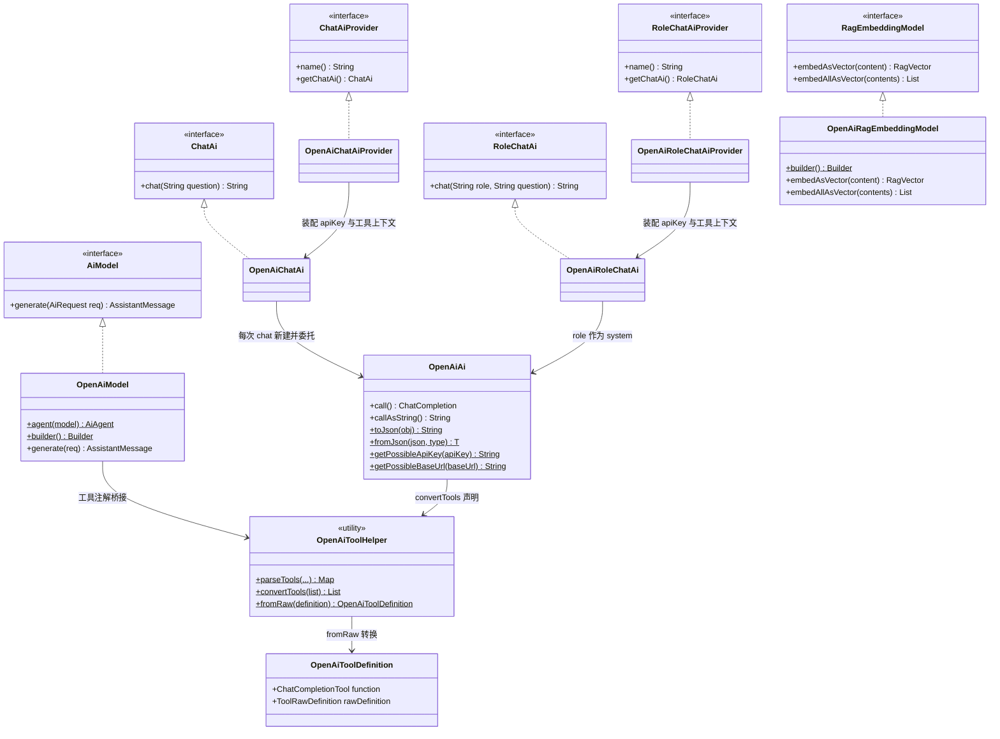
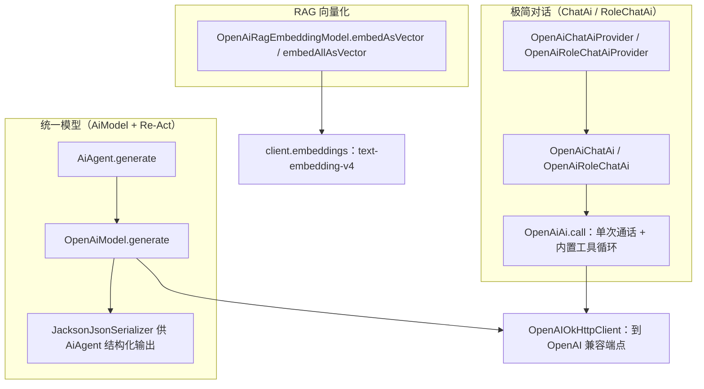
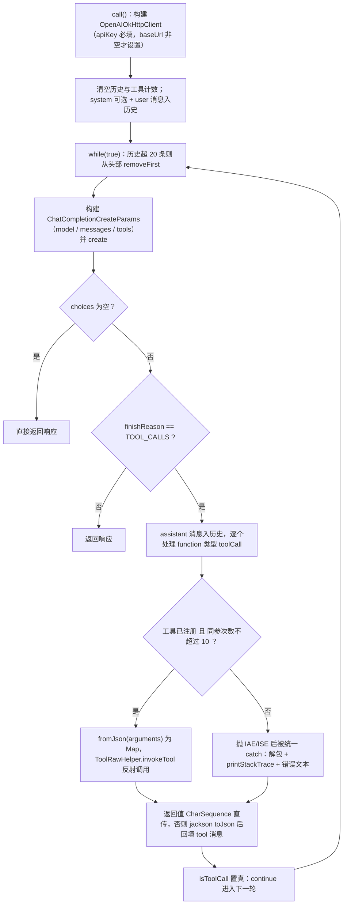

# i2f-extension-ai-openai

> **官方 OpenAI Java SDK**（`com.openai:openai-java:4.28.0`，Kotlin 编译）版的 `i2f-ai-std` 契约实现族（11 个源文件：9 业务 + test 包 2 个演示类，均位于 main 源码树，约 1000 行）：以「极简对话」`ChatAi`/`RoleChatAi`（+`*Provider`）、「统一模型」`AiModel`（`OpenAiModel`，内嵌 `Builder`）、「RAG 向量化」`RagEmbeddingModel`（`OpenAiRagEmbeddingModel`，内嵌 `Builder`）三组契约对接 OpenAI 官方与一切 OpenAI 兼容端点——默认阿里云百炼兼容模式（`https://dashscope.aliyuncs.com/compatible-mode/v1`）与 `qwen-plus`。`OpenAiAi` 内置 **function-calling 自循环**（工具执行、同参 10 次限流、错误回填），`OpenAiToolHelper` 把上游 `@Tool`/`@ToolParam` 解析出的 `FunctionJsonSchema` 桥接为 SDK 的 `ChatCompletionTool`（参数 schema 经 `JsonValue.from(Map)` 直通）；`openai-java` 与 `kotlin-stdlib` 均以 `provided` + `optional` 引入，运行期须由使用方提供。与 `i2f-extension-ai-dashscope` 类结构近一一对应（`OpenAiAi`↔`DashScopeAi`），可平行切换。

## 模块路径

- `i2f-extension/i2f-extension-ai-openai`

## 模块依赖

> 内部依赖在前、三方在后。依赖使用情况经全模块源码 `import` 全量清点核实。

| 依赖 | Maven 坐标 | scope | optional | 说明 |
| --- | --- | --- | --- | --- |
| i2f-ai-std | `i2f.turbo:i2f-ai-std`（版本由父 POM `i2f.version` 管理） | compile | 否 | **实依赖**：`ChatAi`/`RoleChatAi`/`*Provider`、`AiModel`/`AiRequest`/消息族（`User/System/Assistant/Tool`）、`RagEmbeddingModel`/`RagVector`、`ToolRawHelper`/`ToolRawDefinition`/`JsonSchema`/`FunctionJsonSchema`/`JsonSchemaAnnotationResolver` 等契约 |
| i2f-context-impl | `i2f.turbo:i2f-context-impl` | compile | 否 | **实依赖**：`ListableContext`（两个 Provider 的默认工具上下文）；并传递上游 `i2f-context-std` 的 `IContext`（`parseTools(IContext)` 形参） |
| i2f-extension-jackson | `i2f.turbo:i2f-extension-jackson` | compile | 否 | **实依赖**：`JacksonJsonSerializer.INSTANCE`——`OpenAiModel.agent()` 工厂与 `TestOpenAiAgent` 装配 `AiAgent` 的 `jsonSerializer` |
| i2f-convert | `i2f.turbo:i2f-convert` | compile | 否 | **源码零 `import`**：冗余声明，模块源码未直接使用 |
| i2f-serialize-std | `i2f.turbo:i2f-serialize-std` | compile | 否 | **源码零 `import`**：冗余声明（`IJsonSerializer` 由 `i2f-extension-jackson` 传递，无需显式声明） |
| lombok | `org.projectlombok:lombok` | compile | 否 | **真实使用**：`@Data` `@NoArgsConstructor`（绝大多数类；`OpenAiRagEmbeddingModel` 例外，getter/setter 全手写） |
| openai-java | `com.openai:openai-java:4.28.0` | provided | **是** | **实依赖**：`OpenAIOkHttpClient`/`OpenAIClient` 与 SDK 对象模型（`ChatCompletion*`、`Embedding*`、`FunctionDefinition`、`JsonValue`、`FunctionParameters` 等）；排除 `kotlin-stdlib-jdk8` |
| kotlin-stdlib | `org.jetbrains.kotlin:kotlin-stdlib:1.9.24` | provided | **是** | **框架底座**：openai-java 为 Kotlin 产物（`Intrinsics` 非空参数校验、Kotlin 运行时依赖），排除 `kotlin-stdlib-jdk8` 后统一以该坐标由使用方补齐 |

> 注记 1（SDK 结构与传递链）：`openai-java:4.28.0` 是聚合 POM——其 jar 为 343 字节 stub，实体类分布在 `openai-java-core:4.28.0`（约 31 MB）与 `openai-java-client-okhttp:4.28.0`（m2 仓库与反编译核实）；传递链另含 `okhttp:4.12.0`（runtime）、`jackson-core`/`jackson-databind:2.18.2`（compile）与 jackson 其余模块（runtime）、`swagger-annotations`、`victools jsonschema` 等（runtime）。`provided` + `optional` 双保险意味着：既不会传递给下游依赖树，也不参与运行期类路径，使用方必须显式引入 `openai-java` 4.28.0（含 core/client-okhttp 传递链）与 `kotlin-stdlib`（≥1.9.24）。
>
> 注记 2（jackson 来源）：`OpenAiAi` 源码直接 `import` 的 `com.fasterxml.jackson.*`（`ObjectMapper`/`TypeReference`）来自 `openai-java` 的 compile 传递依赖（jackson-core/databind 2.18.2），模块 pom 未显式声明——其编译期可见性依附于 provided 坐标。

### 消费方与聚合

| 消费模块 | 关系 | 说明 |
| --- | --- | --- |
| `i2f-extension/i2f-extension-all` | 聚合引入 | 汇总进扩展全家桶（第 33 行） |
| `i2f-springboot/i2f-springboot-xproc4j-starter` | **实用消费方** | pom 第 105-108 行（compile，无 optional）；`OpenAiAiAutoConfiguration` 注册于 `AutoConfiguration.imports` 第 5 行与 `spring.factories` 第 6 行——`@ConditionalOnClass(Generation.class)`（DashScope SDK 类）+ `${openai.ai.enable:true}`，装配 `OpenAiChatAiProvider`（`${openai.ai.chat-ai.enable:true}`）与 `OpenAiRoleChatAiProvider`（`${openai.ai.role-chat-ai.enable:true}`）两个 bean：apiKey ← `DashScopeAi.getPossibleApiKey`（跨模块兜底 `DASHSCOPE_AI_API_KEY`）、baseUrl ← `OpenAiAi.getPossibleBaseUrl`、context ← `SpringContext` |
| `i2f-springboot/i2f-springboot-ai-starter` | **声明未用** | pom 第 65-68 行声明依赖，但全模块 Java 源码零引用（源码中 "openai" 关键字仅命中 `i2f-ai-rest-openai` 的 `HttpOpenAiAiModel`/`SpringAiModelRestOpenAiProperties`） |
| `test` 包（main 源码树） | 自测 | `TestOpenAi`（schema 打印 + Provider 全链路 + `SkillsTools`）与 `TestOpenAiAgent`（`AiAgent` + `OpenAiModel.builder()`）；演示类位于 main 源码树随 jar 打包 |

## 模块设计

### 1. 契约实现全景



### 2. 三条调用链路



- **极简对话**：`chat(question)` 每次新建 `OpenAiAi` 实例装配字段后 `callAsString()`，实例级状态（历史、计数器）天然隔离；`RoleChatAi` 把 `role` 映射为 system 消息。单轮语义，无跨调用记忆。
- **统一模型**：`OpenAiModel` 实现 `AiModel.generate(AiRequest)`，在 `AiAgent` 的 Re-Act 循环中承接「消息转换 + 工具声明 + 结果解析」；工具由 `AiAgent` 过滤/合并后下发，`JacksonJsonSerializer` 负责结构化输出与工具参数反序列化。
- **RAG**：仅向量化一个组件——包装外部注入的 `OpenAIClient`，`embedAllAsVector` 自动按 10 条分批，`float[]` 经 `RagVector.fromFloatList` 转 `double[]`。

### 3. `OpenAiAi.call()` 的 function-calling 自循环（ChatAi 路径）



- **循环退出**：仅当响应 `choices` 为空、`finishReason` 非 `TOOL_CALLS`（如 STOP）时返回；工具异常被捕获后以「错误文本」形式回填 tool 消息（`"tool [name] invoke failure! cause by ..."`），让模型自纠。
- **工具身份**：`toolCallCounter` 以 `name#arguments` 为键（`ConcurrentHashMap` + `AtomicInteger`）防同参死循环，成功调用也计数、超 10 次拒绝执行；计数在每次 `call()` 入口清空。
- **历史窗口**：每轮迭代前 `while (size > 20) removeFirst()` 硬裁剪，控制 token 消耗（会优先滑出 system 消息，详见瑕疵）。
- **消息构件**：`ChatCompletionMessageParam.ofSystem/ofUser/ofAssistant/ofTool` 组装历史，工具回执为 `ChatCompletionToolMessageParam(toolCallId, content)`；`client` 每次 `call()` 新建（见瑕疵），`ChatCompletionCreateParams` 未设置 `n`（依赖服务端默认）。
- **参数装配**：`fromJson(arguments, TypeReference<Map<String, Object>>)` 以 Jackson 解析工具调用参数，交由上游 `ToolRawHelper.invokeTool` 完成类型转换与反射调用。

### 4. `OpenAiModel.generate`（AiModel 路径）

| 环节 | 行为 |
| --- | --- |
| 消息转换 | 四分支 `instanceof`：`UserMessage`/`SystemMessage`/`ToolMessage`/`AssistantMessage` → SDK `ChatCompletion*MessageParam`；已转换的 `rawMessage` 直接复用并把转换结果反向回写（首轮缓存必不命中，见瑕疵第 4 条） |
| 工具请求还原 | `AssistantMessage.toolCallRequestList` → `ChatCompletionMessageToolCall.ofFunction(...)` union 包装（`id/name/arguments` 回填，`rawRequest` 回写为 union 包装） |
| 工具声明 | `req.getToolMap()` → `OpenAiToolHelper.fromRaw` → `convertTools`；`.n(1)` 限定单 choice |
| 结果解析 | `finishReason == TOOL_CALLS` 的 choice 抽取 `ToolCallRequest`（`rawRequest = asFunction()`）；其余 choice 收集文本；`finishReason` 归一为 `list.isEmpty() ? STOP : TOOL_CALL`；文本 `String.join("\n\n", textList)`；`rawMessage` 回写为整个 `ChatCompletion` 响应 |

### 5. 工具桥接（`@Tool` 注解 → `ChatCompletionTool`）

- `OpenAiToolHelper.parseTools` 提供三种入口：`IContext`（按容器扫描 beans）、`Collection<Object>`、`Object...`；统一走上游 `ToolRawHelper.parseTools(JsonSchemaAnnotationResolver.INSTANCE, ...)` 得到 `Map<String, ToolRawDefinition>` 后逐个 `fromRaw`。
- `fromRaw` 把 `FunctionJsonSchema` 装配为 `ChatCompletionTool.ofFunction(ChatCompletionFunctionTool(...))`：`.name(definition.getName())`、`.description(definition.getDescription())`、`.parameters(JsonValue.from(parametersSchema))`；标准注解路径下 `description` 有方法名兜底（`JsonSchema.getFunctionJsonSchema` 默认取 `method.getName()`），非 null。
- `.parameters(...)` 绑定的是 `parameters(JsonField<FunctionParameters>)` 重载：`JsonValue` 继承原始类型 `JsonField`（`javap` 核实），Java 以**未经检查转换**放行（编译无错、IDE 无报错）；SDK 序列化时按 `JsonValue` 内部 Map 直出参数 schema。
- `strict` 未透传：上游 `JsonSchema.getFunctionJsonSchema` 恒置 `strict=true`，但 `fromRaw` 未调用 SDK 提供的 `.strict(...)`（`FunctionDefinition$Builder` 有 `Boolean`/`boolean`/`Optional`/`JsonField` 四个重载，经字节码核实）→ 模型侧无严格模式约束（详见瑕疵第 6 条）。
- `OpenAiToolDefinition` 同时持有 `function`（声明给 SDK）与 `rawDefinition`（调用时经 `ToolRawHelper.invokeTool` 反射执行），是「声明-执行」双桥的载体；类上另有与 Helper 同签名的三个静态便捷方法。

### 6. 包结构

| 包 | 类 | 职责 |
| --- | --- | --- |
| `impl` | `OpenAiAi`、`OpenAiChatAi`、`OpenAiChatAiProvider`、`OpenAiRoleChatAi`、`OpenAiRoleChatAiProvider` | 底层通话 + 内置工具循环；极简对话契约与 Provider 装配 |
| `model` | `OpenAiModel` | `AiModel` 契约实现（对接 AiAgent；内嵌 `Builder`） |
| `rag` | `OpenAiRagEmbeddingModel` | 向量化桥接（分批提交；内嵌 `Builder`） |
| `tool` | `OpenAiToolDefinition`、`OpenAiToolHelper` | 注解解析与 `ChatCompletionTool` 桥接 |
| `test` | `TestOpenAi`、`TestOpenAiAgent` | 演示与自测（位于 main 源码树） |

## 模块目的

为 `i2f-ai-std` 契约提供**官方 OpenAI Java SDK**（`com.openai:openai-java:4.28.0`）的落地实现：面向 OpenAI 官方端点与一切 OpenAI 兼容端点（默认阿里云百炼 compatible-mode），与 `i2f-extension-ai-dashscope`（阿里官方 SDK）、`i2f-extension-ai-langchain4j8`（langchain4j 开源框架）并列。本模块与 dashscope 模块在类结构与装配方式上几乎一一对应（`OpenAiAi`↔`DashScopeAi`、`OpenAiModel`↔`DashScopeModel`、`OpenAiToolHelper`↔`DashScopeToolHelper`），可平行替换；选型意义在于**锁定 OpenAI 官方 SDK 的对象模型**（`ChatCompletion`/`ChatCompletionMessageParam`/`ChatCompletionTool`），让协议结构可被代码直接感知与操作。

## 模块功能

- `ChatAi`/`RoleChatAi` 极简对话（含内置 function-calling 自循环、工具限流与错误回填）
- `ChatAiProvider`/`RoleChatAiProvider`（`name() = "openai"`，从 `IContext` 装配工具；默认百炼兼容端点 + `qwen-plus`）
- `AiModel`（`OpenAiModel`）供 `AiAgent` Re-Act 循环使用；`agent()` 快捷创建绑定 `JacksonJsonSerializer` 的 `AiAgent`；内嵌 `Builder`（baseUrl/apiKey/model）
- RAG：`OpenAiRagEmbeddingModel` 文本向量化（默认 `text-embedding-v4`/1024 维，自动 10 条分批；内嵌 `Builder`）
- 工具桥接：上游 `@Tool`/`@ToolParam` 注解解析 → `ChatCompletionTool` 声明转换（`OpenAiToolHelper`/`OpenAiToolDefinition`）
- 静态助手：`toJson`/`fromJson`（Jackson）、`unwrapResultAsString`（响应文本抽取）、`getPossibleApiKey`/`getPossibleBaseUrl`（env `OPENAI_AI_API_KEY`/`OPENAI_AI_BASE_URL` → 系统属性，需自行调用）

## 模块主要使用方法

### 1. Provider + ChatAi（对齐 `TestOpenAi`）

```java
OpenAiChatAiProvider provider = new OpenAiChatAiProvider();
provider.setApiKey(System.getenv("DASHSCOPE_AI_API_KEY"));
// 工具上下文：注册带 @Tool 注解的组件
ListableContext context = new ListableContext();
context.addBean(new TestToolComponent());
context.addBean(new SkillsTools());
provider.setContext(context);
// 技能扫描为系统提示词（可选）
Map<String, SkillDefinition> skillMap = SkillsHelper.scanFileSystemSkills();
provider.setSystem(SkillsHelper.convertSkillDefinitionsAsSystemPrompt(skillMap));

ChatAi chatAi = provider.getChatAi();
String ret = chatAi.chat("北京的今天的天气怎么样，并且给出今天的日期");
```

### 2. AiAgent + `OpenAiModel.builder()`（对齐 `TestOpenAiAgent`）

```java
AiAgent agent = new AiAgent()
        .model(OpenAiModel.builder()
                .baseUrl(OpenAiAi.DASHSCOPE_BASE_URL)
                .apiKey(System.getenv("DASHSCOPE_AI_API_KEY"))
                .model(OpenAiAi.DEFAULT_MODEL)
                .build())
        .jsonSerializer(JacksonJsonSerializer.INSTANCE);

AiAgentResponse resp = agent.generate(new AiRequest()
                .user("北京的今天的天气怎么样，并且给出今天的日期")
                .tools(ToolRawHelper.parseTools(JsonSchemaAnnotationResolver.INSTANCE, new TestToolComponent()))
        , new AiAgentContext());
System.out.println(resp);
```

### 3. 直接作为 AiModel

```java
OpenAiModel model = new OpenAiModel(client); // 复用既有 OpenAIClient；或 OpenAiModel.builder()...build()
OpenAiModel.agent(model); // 快捷创建绑定 JsonSerializer 的 AiAgent

// 独立调用时必须装配 tools（可为空 Map，但不可为 null，详见瑕疵）：
AiRequest req = new AiRequest()
        .user("你好")
        .tools(Collections.emptyMap());
AssistantMessage msg = model.generate(req);
```

### 4. RAG 向量化

```java
OpenAiRagEmbeddingModel embeddingModel = OpenAiRagEmbeddingModel.builder()
        .baseUrl(OpenAiRagEmbeddingModel.OPENAI_DASHSCOPE_BASE_URL)
        .apiKey(System.getenv("DASHSCOPE_AI_API_KEY"))
        .build();
RagVector vector = embeddingModel.embedAsVector("文本内容");
List<RagVector> vectors = embeddingModel.embedAllAsVector(Arrays.asList("a", "b")); // 自动按 10 条分批
```

### 5. 直接使用工具桥接

```java
Map<String, OpenAiToolDefinition> map = OpenAiToolHelper.parseTools(new TestToolComponent());
List<ChatCompletionTool> tools = OpenAiToolHelper.convertTools(map);
// 或静态便捷入口：OpenAiToolDefinition.parseTools(context / beans / varargs)
```

### 6. 注意事项

- **运行期依赖自备**：`openai-java` 与 `kotlin-stdlib` 为 `provided` + `optional`，使用方必须显式引入两者（4.28.0 / ≥1.9.24）及其传递链（openai-java-core、openai-java-client-okhttp、okhttp、jackson 等），否则运行期 `NoClassDefFoundError`。
- **apiKey 必须显式提供**：本模块不做环境变量自动回退（`getPossibleApiKey()` 需自行调用）；`null` 会命中官方 SDK 的 Kotlin 参数校验（`Intrinsics.checkNotNullParameter`）直接抛 NPE，而非友好错误提示（对比：xproc4j 装配用 `DashScopeAi.getPossibleApiKey` 兜底 `DASHSCOPE_AI_API_KEY`）。
- **切换端点三件套**：`baseUrl` + `apiKey` + `model`；默认百炼兼容模式 `https://dashscope.aliyuncs.com/compatible-mode/v1` 与 `qwen-plus`。
- **单轮语义**：`ChatAi`/`RoleChatAi.chat` 每次新建 `OpenAiAi` 实例（历史与计数天然隔离），无跨调用记忆；多轮请走 `AiModel`/`AiAgent`。
- **RAG 一次最多 10 条**：`onceMaxSize = 10` 硬编码；`embedAllAsVector` 会自动分批（空集合返回空列表）。
- **`respJsonAdditionalUserMessage` 当前无效果**：全链路（Provider → ChatAi → `OpenAiAi`）传递但不被消费（详见瑕疵第 2 条）。

## 模块特性总结

- **官方 OpenAI Java SDK 底座**：全仓唯一直接绑定 `com.openai:openai-java` 的模块；对象模型与 OpenAI API 一一对应（`ChatCompletion`/`ChatCompletionMessageParam`/`ChatCompletionTool`/`EmbeddingCreateParams`）
- **Kotlin 运行期底座**：SDK 为 Kotlin 产物，额外引入 `kotlin-stdlib`（两者皆 `provided` + `optional`，由使用方自备）
- **与 dashscope 模块同构**：类名/常量/装配几乎一一对应（`OpenAiAi`↔`DashScopeAi`），默认端点同为百炼 compatible-mode，可平行切换
- **双路径**：`ChatAi` 极简单轮（内置工具循环）+ `AiModel`/`AiAgent` Re-Act 全链路
- **function-calling 自循环内置**：同参限流（10 次）、异常回填、`InvocationTargetException` 解包
- **RAG 自动分批**：`embedAllAsVector` 按 10 条分批提交（对百炼 text-embedding-v4 批次上限友好）
- **provided + optional 双保险**：不污染下游依赖树，交由使用方选配

## 模块瑕疵或错误

1. **apiKey 直送 SDK 无兜底：null 即 Kotlin NPE，助手方法全域未接线**：`OpenAiAi.call()` 把 `apiKey` 直送 `OpenAIOkHttpClient.builder().apiKey(apiKey)`，`null` 时命中官方 SDK 的 Kotlin 非空校验（`Intrinsics.checkNotNullParameter`，经反编译核实）直接抛 `NullPointerException`；`getPossibleApiKey()`/`getPossibleBaseUrl()`（env `OPENAI_AI_API_KEY`/`OPENAI_AI_BASE_URL` → 系统属性）在模块内外均无调用点（死代码）——正式装配（xproc4j）与测试均使用 `DASHSCOPE_AI_API_KEY`（前者经 `DashScopeAi.getPossibleApiKey` 跨模块兜底）。
2. **`respJsonAdditionalUserMessage` 全链路传递但无消费（死字段）**：Provider/ChatAi/`OpenAiAi` 三层均声明并逐层装配（默认值 `"请严格按照JSON格式输出且不需要任何多余的解释或者非JSON格式的信息。"`），但 `OpenAiAi.call()` 中从未使用（dashscope 模块同类字段会在用户消息后追加约束）→ 配置无效。
3. **`OpenAiRoleChatAiProvider.system` 声明未用（死字段）**：字段声明后从未读取（对比 `OpenAiChatAiProvider.getChatAi()` 有 `ret.setSystem(system)` 回填；RoleChatAi 路径的 system 由 `chat(role, question)` 的 `role` 充当）→ 通过该 Provider 设置 system 无效。
4. **`OpenAiModel` 缓存回写类型不匹配：首轮转换必 miss**：`AssistantMessage.rawMessage` 回写的是整个 `ChatCompletion` 响应（非 `ChatCompletionMessageParam`），`ToolCallRequest.rawRequest` 回写的是 `ChatCompletionMessageFunctionToolCall`（非 union 包装 `ChatCompletionMessageToolCall`，两者无继承关系、经字节码核实）——后续转换的 `instanceof` 判定首轮必然不命中而重建；功能不受影响（重建逻辑完整），属缓存优化降级。
5. **`req.getMessageList()`/`getToolMap()` 未判空**：`generate` 直接遍历两者（`OpenAiModel.java:90-91` 与 `172-174`）；独立作为 `AiModel` 使用且未装配对应字段时 NPE（`AiAgent` 场景由上游装配保证非空；`ToolMessage` 转换用 `getId`/`getText`，无 `request` 解引用，比 langchain4j8 版安全）。
6. **`strict` 未透传**：上游 `JsonSchema.getFunctionJsonSchema` 恒置 `strict=true`，SDK 也提供 `.strict(...)`（`FunctionDefinition$Builder` 四个重载，经字节码核实），但 `fromRaw` 未调用 → 模型侧无严格模式约束（参数 schema 偏差风险由提示词兜底）。
7. **`.parameters(JsonValue.from(map))` 依赖未经检查转换**：`JsonValue` 继承原始类型 `JsonField`（`javap` 核实），赋给 `parameters(JsonField<FunctionParameters>)` 属 unchecked 转换（编译期无错）；参数 schema 的序列化依赖 SDK 对 `JsonValue` 内部 Map 的直通实现。
8. **每次 `call()` 新建 `OpenAIOkHttpClient`**：`call()` 内构建客户端（`OpenAiAi.java:75-80`），连接池/线程资源无复用亦无显式关闭；对比 `OpenAiModel`/`OpenAiRagEmbeddingModel` 均为外部注入 `OpenAIClient` 复用。
9. **`unwrapResultAsString` 多 choice 时只保留最后一个**：`builder.setLength(0)` 位于循环体内（`OpenAiAi.java:217`），每个 choice 重置缓冲；另局部变量 `reason` 赋值未使用；audio 分支存在时文本与 audio 分节输出（`---` 分隔），无 audio 时输出 `content`（缺失为空串，安全）。
10. **异常处理粗放**：工具异常 `printStackTrace()` 直接打印标准错误（未接日志框架）；`call()` 外层统一 `throw new RuntimeException(e.getMessage(), e)`，原始异常类型（如 SDK 的 NPE/IAE）被吞并包装。
11. **RAG 批次与维度硬编码**：`onceMaxSize = 10`（`embedOnce` 超限即抛 `IllegalStateException`，`embedAllAsVector` 自动分批）；`dimension = 1024` 在 `Builder` 无设置入口（仅 protected 字段）；`embedAsVector` 取 `list.get(0)`（依赖响应 `data` 顺序）。
12. **历史窗口与限流硬编码**：`while (size > 20) removeFirst()`、同参阈值 10 均不可配置，且每次 `call()` 清空历史；Provider 默认 model 用字面量 `"qwen-plus"` 而 `ChatAi`/`AiModel`/`AiAi` 用 `OpenAiAi.DEFAULT_MODEL` 常量（值相同，风格不统一）。

## 消费方与生态位置

- **家族定位**：`i2f-ai-std` 契约下与 `i2f-extension-ai-dashscope`（阿里官方 SDK）、`i2f-extension-ai-langchain4j8`（langchain4j 开源框架）并列的第三种 OpenAI 兼容实现；本模块是全仓**唯一**直接使用 `com.openai:openai-java` 官方 SDK 的模块。
- **与 dashscope 模块对照**（姊妹模块，可平行替换）：

| 维度 | i2f-extension-ai-openai | i2f-extension-ai-dashscope |
| --- | --- | --- |
| SDK 底座 | `com.openai:openai-java`（OpenAI 官方，Kotlin 编译） | `dashscope-sdk-java`（阿里官方，Java） |
| 类对照 | `OpenAiAi`/`OpenAiModel`/`OpenAiToolHelper`/`OpenAiToolDefinition` | `DashScopeAi`/`DashScopeModel`/`DashScopeToolHelper`/`DashScopeToolDefinition` |
| JSON 序列化 | 复用 `i2f-extension-jackson` 的 `JacksonJsonSerializer` | 自带 `DashScopeJsonSerializer`（model 包） |
| RAG | 仅 Embedding（`text-embedding-v4`） | Embedding + Rerank（`gte-rerank-v2`） |
| 运行期依赖 | `openai-java` + `kotlin-stdlib` | `dashscope-sdk-java` |
| 默认端点/模型 | compatible-mode + `qwen-plus`（相同） | compatible-mode + `qwen-plus`（相同） |

- **注册链路**：`i2f-extension/pom.xml` modules 第 21 行 → 根 POM `dependencyManagement` 第 915 行 → `i2f-extension-all` 第 33 行聚合；直接消费方为 `i2f-springboot-xproc4j-starter`（实用）与 `i2f-springboot-ai-starter`（pom 声明未用）。
- **消费注意（xproc4j 装配）**：`OpenAiAiAutoConfiguration` 的启用条件为 `@ConditionalOnClass(Generation.class)`——`Generation` 是 **DashScope SDK** 的类，未引入 `dashscope-sdk-java` 时该装配静默失效；另 `ret.setBaseUrl(OpenAiAi.getPossibleBaseUrl(baseUrl))` 在配置与 env 均缺省时把 `null` 写入 Provider（覆盖其默认 `DASHSCOPE_BASE_URL`），此时 `OpenAiAi.call()` 跳过 baseUrl 设置、SDK 回落官方 `api.openai.com`——与 DashScope apiKey 组合必然 401，需显式配置 `${openai.ai.baseUrl}` 或设置 `OPENAI_AI_BASE_URL`。
