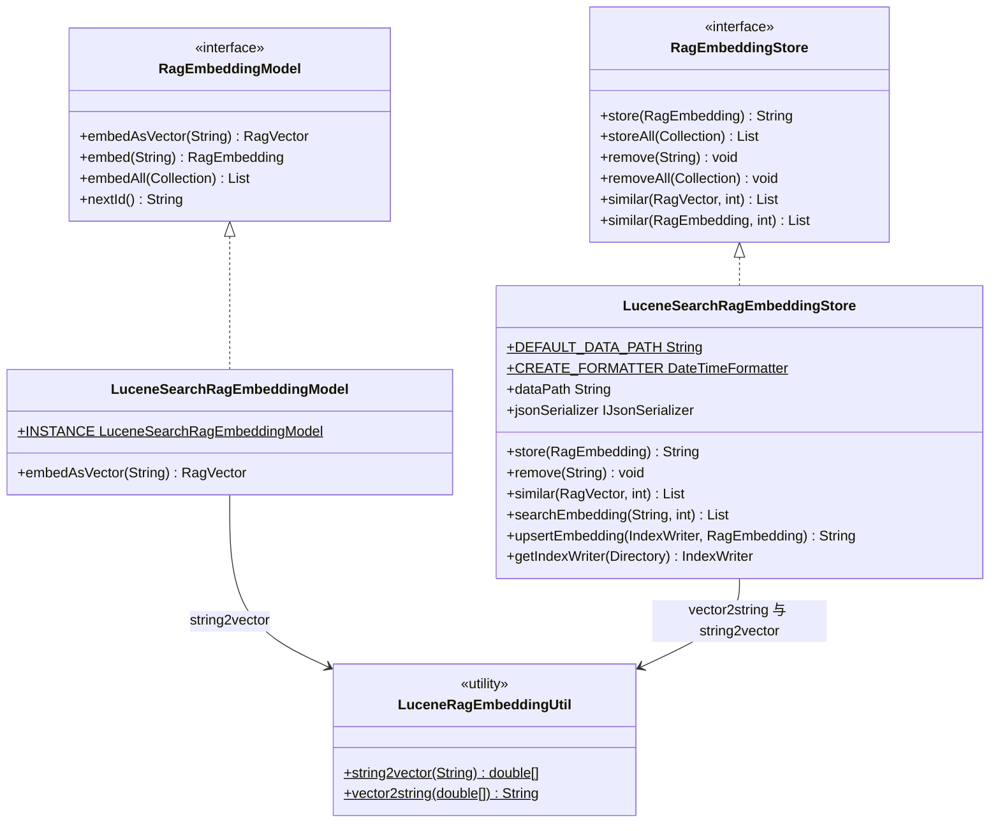
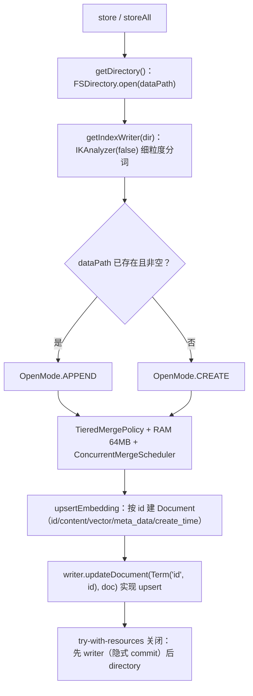
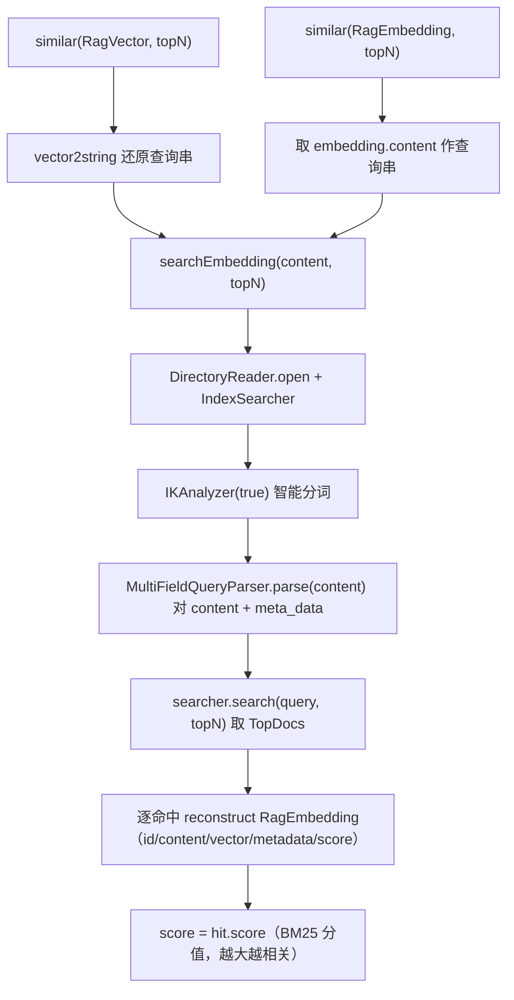

# i2f-extension-ai-rag-lucene

> **Apache Lucene 全文检索版**的 `i2f-ai-std` RAG 存储层实现（3 个源文件共 325 行：`LuceneSearchRagEmbeddingStore` 259 + `LuceneRagEmbeddingUtil` 44 + `LuceneSearchRagEmbeddingModel` 21，单包 `i2f.extension.ai.rag.lucene`，零测试、零自动装配）：以「传统全文搜索引擎」而非「向量数据库」落地 `RagEmbeddingStore`/`RagEmbeddingModel` 双契约——**本实现没有真正的向量概念**，`LuceneRagEmbeddingUtil` 把字符串按 UTF-8 字节 `/1000` 强行映射为 `double[]`「伪向量」（`LuceneSearchRagEmbeddingModel` 生成、`LuceneSearchRagEmbeddingStore` 消费，二者必须成对使用）；写入用 `IKAnalyzer(false)` 细粒度分词建 Lucene 索引（`IndexWriter.updateDocument` 按 `id` upsert），检索用 `IKAnalyzer(true)` 智能分词 + `MultiFieldQueryParser` 对 `content`/`meta_data` 两字段做 BM25 打分召回 topN；`lucene-*` 8.11.4 与 `ik-analyzer` 9.0.0 均以 `provided` + `optional` 引入，运行期须由使用方提供。**含一处确定性的向量回读逻辑错误（`vector` 字段被误当 `content` 反序列化）与 IK/Lucene 大版本错配等风险**（详见「模块瑕疵或错误」，按项目约定仅识别不实证）。

## 模块路径

- `i2f-extension/i2f-extension-ai-rag-lucene`

## 模块依赖

> 内部依赖在前、三方在后。依赖使用情况经全模块源码 `import` 全量清点核实。

| 依赖 | Maven 坐标 | scope | optional | 说明 |
| --- | --- | --- | --- | --- |
| i2f-ai-std | `i2f.turbo:i2f-ai-std`（版本由父 POM 管理） | compile | 否 | **实依赖**：`RagEmbeddingStore`/`RagEmbeddingModel` 契约与 `RagEmbedding`/`RagVector` 数据模型（`RagVector.fromArray`/`fromList`） |
| i2f-std-const | `i2f.turbo:i2f-std-const` | compile | 否 | **实依赖**：`StdConst.RUNTIME_PERSIST_DIR`（默认索引目录 `runtime/persist/lucene_data/rags` 的根路径） |
| i2f-serialize-impl | `i2f.turbo:i2f-serialize-impl` | compile | 否 | **实依赖**：`Json2Serializer`（默认 `jsonSerializer` 字段）；并传递 `i2f-serialize-std` 的 `IJsonSerializer` 契约（向量数组与 `meta_data` 的 JSON 序列化） |
| lombok | `org.projectlombok:lombok` | compile | 否 | **真实使用**：`@Data` `@NoArgsConstructor`（`LuceneSearchRagEmbeddingStore`） |
| lucene-core | `org.apache.lucene:lucene-core:8.11.4` | provided | **是** | **实依赖**：`Directory`/`FSDirectory`、`IndexWriter`/`IndexWriterConfig`/`TieredMergePolicy`/`ConcurrentMergeScheduler`、`Document`/`Field`/`StringField`/`TextField`、`IndexSearcher`/`Query`/`TopDocs`/`ScoreDoc`、`DirectoryReader`/`Term` |
| lucene-analyzers-common | `org.apache.lucene:lucene-analyzers-common:8.11.4` | provided | **是** | 声明引入 `Analyzer` 基类（`import org.apache.lucene.analysis.Analyzer`）；实际分词器由 IK 提供 |
| lucene-queryparser | `org.apache.lucene:lucene-queryparser:8.11.4` | provided | **是** | **实依赖**：`org.apache.lucene.queryparser.classic.MultiFieldQueryParser`（检索入口） |
| ik-analyzer | `cn.shenyanchao.ik-analyzer:ik-analyzer:9.0.0` | provided | **是** | **实依赖**：`org.wltea.analyzer.lucene.IKAnalyzer`（中文分词，索引端 `false`/检索端 `true`）；版本目标为 Lucene 9.x，与本模块声明的 8.11.4 存在大版本错配（见瑕疵第 2 条） |

> 注记（`provided` + `optional` 双保险）：四枚三方依赖均 `provided` + `optional`，既不进运行期类路径也不传递给下游——使用方必须自行按兼容版本引入 `lucene-*` 与 `ik-analyzer`，否则加载即 `NoClassDefFoundError`。

### 消费方与聚合

| 消费模块 | 关系 | 说明 |
| --- | --- | --- |
| `i2f-extension/i2f-extension-all` | 聚合引入 | 汇总进扩展全家桶（pom 第 37 行） |
| 根 `pom.xml` | 版本管理 | `dependencyManagement` 第 920 行锁定坐标；`i2f-extension/pom.xml` 第 22 行注册为 reactor 模块 |

> 与兄弟模块 `i2f-extension-ai-rag-sqlite` 不同：**本模块在全仓内无任何 Spring Boot 自动装配消费方**（`ops-starter` 的 `RagAutoConfiguration` 装配的是 sqlite 版），当前仅经 `i2f-extension-all` 聚合分发，需使用方手工 `new` 并配对使用。

## 模块设计

### 1. 契约实现全景



- **强配对约束**：`LuceneSearchRagEmbeddingModel`（`embedAsVector` = `string2vector`）与 `LuceneSearchRagEmbeddingStore`（`similar(RagVector)` = `vector2string` → 全文检索）通过 `LuceneRagEmbeddingUtil` 的字节 ↔ 浮点互转闭环，**脱离该 Model 单独使用 Store 会使向量失去意义**。
- 所有类集中在单包 `i2f.extension.ai.rag.lucene`，无子包、无 SPI 注册、无自动装配。

### 2. 「伪向量」编码约定（核心设计）


- `LuceneRagEmbeddingUtil.string2vector`：每字节无符号化后除以 `1000.0`，得到值域约 `[0, 0.255]` 的浮点数组；`vector2string` 为逆运算。
- **该「向量」不含任何语义距离信息**——长度等于 UTF-8 字节数、逐位对应字符编码，仅供框架占位与检索端还原原文使用；真正的相似度排序由 Lucene 的 BM25 文本打分完成（源码类注释已明确「语义搜索并不是那么好」）。

### 3. 写入与索引链路（upsert）



- **字段映射**：`id` 用 `StringField`（不分词、精确匹配，作 upsert 唯一键）；`content`/`vector`/`meta_data`/`create_time` 均 `TextField`（`Store.YES` 可回读原值）。
- **向量落库形式**：`embedding.vector` 为空时写入字符串占位 `"null"`；非空时写入 `jsonSerializer.serialize(vector.getArray())` 的 JSON 文本（见瑕疵第 1 条对回读的影响）。
- **时间戳**：`create_time` 用 `yyyy-MM-dd HH:mm:ss.SSS` 文本（`CREATE_FORMATTER`，本地时间、无时区）。
- **id 生成**：`id` 为空时取 32 位去连字符 UUID，否则原样使用。

### 4. 检索链路（全文检索而非 KNN）



- **查询字段**：`{"content", "meta_data"}` 组合，默认 `OR` 操作符（`AND` 分支被注释）。
- **结果向量重建**：`vector` 列为 `"null"` 时，用 `string2vector(content)` 生成占位向量；否则尝试 `jsonSerializer.deserialize(...)` 还原真实数组（此分支存在缺陷，见瑕疵第 1 条），失败静默回落到占位向量。
- **元数据**：`meta_data` 反序列化为 `Map`，异常静默保留空 `HashMap`。

### 5. 包结构

| 包 | 类 | 职责 |
| --- | --- | --- |
| `i2f.extension.ai.rag.lucene` | `LuceneSearchRagEmbeddingStore` | `RagEmbeddingStore` 落地：目录/写入器装配、索引 upsert、删除、全文检索召回 |
| 同上 | `LuceneSearchRagEmbeddingModel` | `RagEmbeddingModel` 落地：`embedAsVector` 委托 `string2vector`；`INSTANCE` 单例 |
| 同上 | `LuceneRagEmbeddingUtil` | 字符串 ↔ `double[]` 的 UTF-8 字节强映射（静态工具） |

## 模块目的

为 `i2f-ai-std` 的 RAG 契约提供一套**零服务依赖、基于本地文件系统的全文检索落地**：借助 Apache Lucene + IK 中文分词，把「嵌入向量检索」降级为「关键词/中文分词全文检索」，免去部署向量数据库与调用嵌入模型的成本，适合「中文文档关键词召回」这类轻量 RAG 场景。与兄弟模块 `i2f-extension-ai-rag-sqlite`（sqlite-vec 真实向量 + cosine KNN）互为对照——本模块**不做向量运算、只做文本匹配**，以「向量占位 + 契约兼容」的方式复用同一套上层 `RagWorker`/工具链。

## 模块功能

- **RAG 存储契约**（`LuceneSearchRagEmbeddingStore`）：`store`/`storeAll`/`remove`/`removeAll`/`similar(RagVector)`/`similar(RagEmbedding)` 全套接口，按 `id` upsert、按 Lucene 分值召回 topN。
- **RAG 嵌入契约**（`LuceneSearchRagEmbeddingModel`）：`embedAsVector` 输出「伪向量」，`INSTANCE` 单例可直接复用。
- **中文字文检索**：`IKAnalyzer` 双模式分词（索引细粒度 / 检索智能）+ `MultiFieldQueryParser` 多字段匹配。
- **可配置属性**：`dataPath`（索引目录）与 `jsonSerializer` 经 `@Data` 暴露，默认 `runtime/persist/lucene_data/rags` + `Json2Serializer`。
- **索引性能调优**：`TieredMergePolicy`（每层 8 段、单次合并 8 段、最大合并段 2GB、删除比例 20% 触发合并）、`RAMBufferSizeMB=64`、`ConcurrentMergeScheduler` 后台异步合并。

## 模块主要使用方法

### 1. 标准用法（Model 与 Store 必须成对）

```java
// 1) 嵌入模型与存储必须配对：向量由 string2vector 生成、由 vector2string 消费
LuceneSearchRagEmbeddingModel model = LuceneSearchRagEmbeddingModel.INSTANCE;
LuceneSearchRagEmbeddingStore store = new LuceneSearchRagEmbeddingStore();
store.setDataPath("runtime/persist/lucene_data/rags");   // 可选，默认即此

// 2) 写入：content 会被 IK 分词建索引，vector 为占位伪向量
RagEmbedding emb = model.embed("i2f-turbo 是一个 Java 工具箱库");
String id = store.store(emb);                            // 按 id upsert

// 3) 检索：按文本内容做全文匹配，score 为 BM25 分值（越大越相关）
List<RagEmbedding> hits = store.similar("Java 工具箱", 5);
for (RagEmbedding hit : hits) {
    System.out.println(hit.getScore() + " -> " + hit.getContent());
}

// 4) 删除
store.remove(id);
```

### 2. 批量存取

```java
List<RagEmbedding> list = model.embedAll(java.util.Arrays.asList("文档一", "文档二"));
store.storeAll(list);                                    // 逐条 upsert，非事务
store.removeAll(java.util.Arrays.asList("id1", "id2"));  // 逐条 deleteDocuments
```

### 3. 注意事项

- **禁止混用其它 EmbeddingModel**：Store 的 `similar(RagVector)` 会把向量当作 UTF-8 字节解码，只有 `LuceneSearchRagEmbeddingModel` 产出的向量能被正确还原为查询文本。
- **本质是关键词检索**：相关性来自 Lucene 文本打分而非语义向量距离，近义/跨语言召回能力有限。
- **运行期自备依赖**：`lucene-*` 与 `ik-analyzer` 均为 `provided` + `optional`，使用方须自行引入版本兼容的依赖。
- **每次操作独立开关索引**：`store`/`remove`/`similar` 各自打开并关闭 `Directory`（见瑕疵第 4 条），高频写入建议外部合并批量或复用。
- **查询串会被当作 Lucene 查询语法解析**：包含 `+ - && || ! ( ) { } [ ] ^ " ~ * ? : \` 等特殊字符的原文可能触发解析异常（见瑕疵第 3 条）。

## 模块特性总结

- **契约兼容的全文检索落地**：以 `RagEmbeddingStore`/`RagEmbeddingModel` 标准接口对外，内部走 Lucene 关键词检索
- **零外部服务**：索引落本地文件目录 `runtime/persist/lucene_data/rags`，无需数据库/向量服务
- **IK 中文分词**：索引端细粒度、检索端智能模式，适配中文召回
- **伪向量占位**：`string2vector`/`vector2string` UTF-8 字节 ↔ 浮点互转，与上层工具链解耦复用
- **按 id upsert**：`updateDocument(Term("id", id), doc)` 天然幂等覆盖
- **索引写入调优齐全**：分层合并策略 + 大内存缓冲 + 并发合并调度器
- **`provided` + `optional` 三方依赖**：不污染下游依赖树，由使用方自备
- **零测试、零自动装配**：全模块无测试类，也无 Spring 装配消费方

## 模块瑕疵或错误

> 按项目约定：项目已完整编译通过，语法层面无误；下列仅为**问题/潜在风险的识别**，未做运行期实证。

1. **检索回读向量误用字段（确定性逻辑错误）**：`searchEmbedding` 中「有效向量」分支写作 `jsonSerializer.deserialize(embedding.getContent())`（`LuceneSearchRagEmbeddingStore.java:159`），而写入时序列化的是 `vector.getArray()` 存入 `vector` 列——应为 `deserialize(vector)`。因 `content` 通常是自然语言而非 JSON 数组，该反序列化几乎必然抛异常落入 `catch`，回退为占位向量，使「存储真实向量后原样取回」的设计意图失效。
2. **IK 与 Lucene 大版本错配（高风险 + 注释自相矛盾）**：pom 声明 `lucene-*` 为 `8.11.4`，却引入面向 **Lucene 9.x** 的 `cn.shenyanchao.ik-analyzer:9.0.0`；同文件注释亦自述「IK 中文分词器，版本需与 Lucene 9.x 兼容」，与实际依赖的 8.x 冲突。IKAnalyzer 依赖 Lucene 内部 Analyzer/TokenStream API，跨大版本很可能触发 `NoClassDefFoundError`/`AbstractMethodError` 等运行期不兼容。
3. **查询串未转义直接 parse（潜在异常）**：`MultiFieldQueryParser.parse(content)`（`:140`）将原始文本按 Lucene 查询语法解析，未调用 `QueryParser.escape`——含保留字符（`+ - && || ! ( ) : \` 等）或空串/纯空白内容会抛 `ParseException`，并被外层包装为 `IllegalStateException`，导致该次检索整体失败。
4. **`Files.list` 流未关闭（资源泄漏）**：`getIndexWriter` 中以 `Files.list(Paths.get(dataPath)).findFirst().isPresent()` 判断目录是否为空（`:231-232`），`Files.list` 返回的 `Stream` 持有目录句柄需显式关闭，此处未纳入 try-with-resources——每次建写器都可能泄漏一个文件描述符。
5. **空/异常输入缺乏前置校验**：`store` 时 `embedding.getContent()` 为 `null` 会使 `new TextField("content", null, ...)` 抛异常；`content` 为空串时检索侧 `parse("")` 亦会失败；`storeAll`/`removeAll` 为逐条操作、无事务，中途失败无回滚。
6. **`store`/`remove` 无显式 commit，语义依赖 close**：`IndexWriter` 经 try-with-resources `close()` 时按默认行为提交，代码未显式 `commit()`；语义可用但可读性欠佳，且在异常路径（`close` 前的写操作抛错）提交点不清晰。
7. **`@Data` 生成的 `equals`/`hashCode`/`toString` 含 `jsonSerializer`**：对含 IO/序列化器的实体类使用 `@Data` 会产生非常规的相等语义与潜在开销（`toString` 打印序列化器对象），属可接受但需注意的建模瑕疵。
8. **占位向量非语义**：`string2vector` 得到的「向量」值域 `[0,0.255]`、维度随字节数变化、无归一化，任何试图对其做 `cosineSimilar`/`dot` 等 `RagVector` 运算的上层逻辑都会得到无意义结果（设计上要求配合同族 Store 使用，但契约本身不阻止误用）。
9. **每次操作全量开合索引与目录**：`store`/`storeAll`/`remove`/`similar` 各自 `FSDirectory.open` + 建 `IndexWriter`/`DirectoryReader`，无实例级复用与写缓冲共享，批量小写入时开销与段文件抖动明显。
