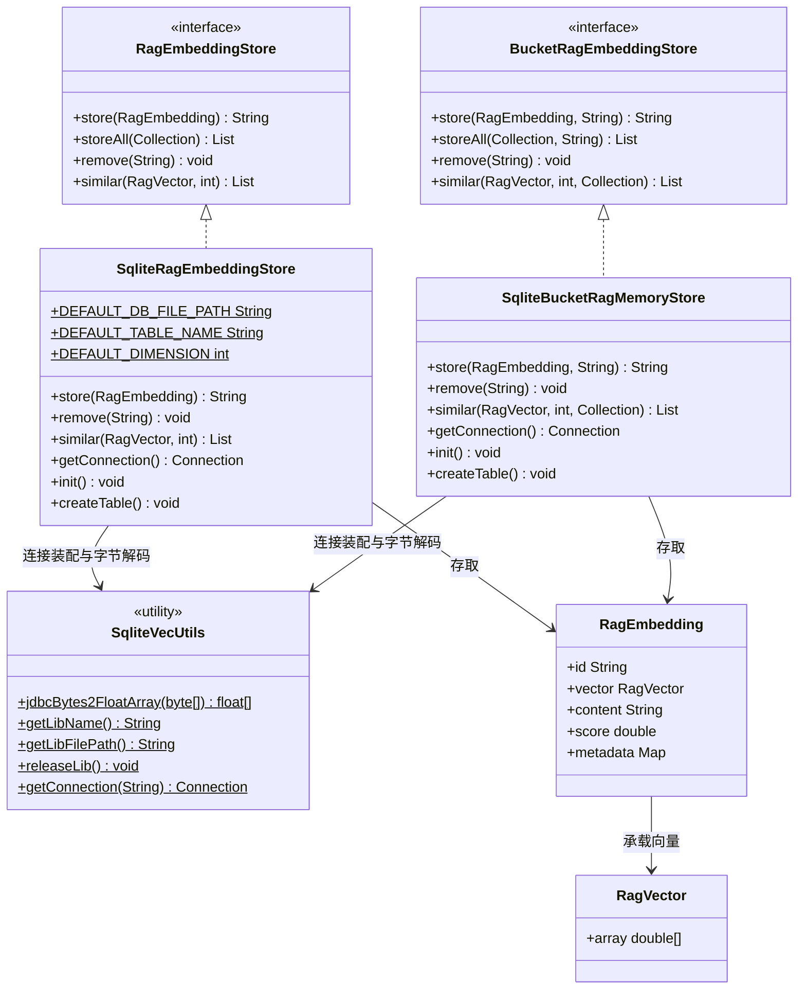
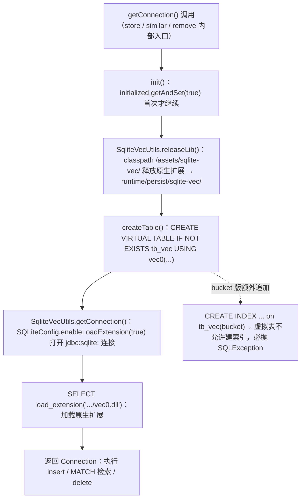
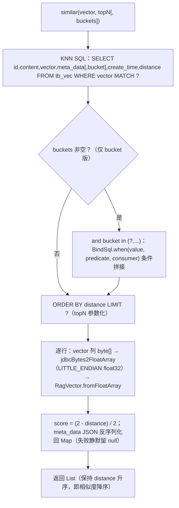

# i2f-extension-ai-rag-sqlite

> **sqlite-vec 原生扩展**版的 `i2f-ai-std` RAG 存储层实现（3 个源文件共 425 行：`SqliteRagEmbeddingStore` 169 + `SqliteBucketRagMemoryStore` 172 + `SqliteVecUtils` 84，单包 `i2f.extension.ai.rag.sqlite`，随包携带 `vec0.dll`/`vec0.so` 双平台原生扩展，零测试）：以「单库向量存储」`RagEmbeddingStore`（`SqliteRagEmbeddingStore`）与「分桶记忆存储」`BucketRagEmbeddingStore`（`SqliteBucketRagMemoryStore`）双契约落地**本地嵌入式向量数据库**——vec0 虚拟表（`vector float[1024] distance_metric=cosine`）承载 JSON 文本向量写入、float32 BLOB 读出（`SqliteVecUtils.jdbcBytes2FloatArray` 按 LITTLE_ENDIAN 解码），KNN 检索（`WHERE vector MATCH ? [+ and bucket in (...)] ORDER BY distance LIMIT ?`）把 cosine 距离转为 `(2-distance)/2` 的 [0,1] 相似度得分；`SqliteVecUtils` 负责原生扩展释放（classpath `/assets/sqlite-vec/` → `runtime/persist/sqlite-vec/`）与连接装配（`SQLiteConfig.enableLoadExtension(true)` + `SELECT load_extension(...)`）；`sqlite-jdbc` 以 `provided` + `optional` 引入，运行期须由使用方提供。**含三处确定性运行时缺陷**（bucket 版虚拟表建索引必失败、bucket 版 insert 六列仅五个占位符、原生扩展重复释放被文件锁拒绝——均经 sqlite-jdbc 3.43.0.0 + vec0.dll 实测复现）。

## 模块路径

- `i2f-extension/i2f-extension-ai-rag-sqlite`

## 模块依赖

> 内部依赖在前、三方在后。依赖使用情况经全模块源码 `import` 全量清点核实。

| 依赖 | Maven 坐标 | scope | optional | 说明 |
| --- | --- | --- | --- | --- |
| i2f-ai-std | `i2f.turbo:i2f-ai-std`（版本由父 POM `i2f.version` 管理） | compile | 否 | **实依赖**：`RagEmbeddingStore`/`BucketRagEmbeddingStore` 契约与 `RagEmbedding`/`RagVector` 数据模型；并传递 `i2f-mutator`（`BaseMutator`）、`i2f-resources`（`ResourceUtil.getClasspathResourceAsStream`）、`i2f-io-stream`（`StreamUtil.writeBytes`）等 |
| i2f-std-const | `i2f.turbo:i2f-std-const` | compile | 否 | **实依赖**：`StdConst.RUNTIME_PERSIST_DIR`（默认库文件与扩展释放目录 `runtime/persist/sqlite-vec/` 的根路径） |
| i2f-serialize-impl | `i2f.turbo:i2f-serialize-impl` | compile | 否 | **实依赖**：`Json2Serializer`（默认 `jsonSerializer` 字段）；并传递 `i2f-serialize-std` 的 `IJsonSerializer` 契约 |
| i2f-jdbc-impl | `i2f.turbo:i2f-jdbc-impl` | compile | 否 | **实依赖**：`JdbcResolver.getConnection/update/query`；并传递 `i2f-bindsql`（`BindSql.of/when/and/add/in`）；`i2f-jdbc-impl` 内置的 `SqliteResultObjectExtractor` 把 BLOB 列读为 `byte[]`（`vector` 列回读依赖此行为） |
| lombok | `org.projectlombok:lombok` | compile | 否 | **真实使用**：`@Data` `@NoArgsConstructor`（两个 store 类） |
| sqlite-jdbc | `org.xerial:sqlite-jdbc:3.43.0.0` | provided | **是** | **实依赖**：`org.sqlite.SQLiteConfig`（启用扩展加载）与 `org.sqlite.JDBC` 驱动；`provided` + `optional` 双保险意味着不传递给下游、不参与运行期类路径，使用方必须显式引入 |

> 注记 1（传递链与直接 import 的对应）：源码直接 `import` 但未在 pom 显式声明的坐标——`i2f.bindsql.BindSql`（← `i2f-jdbc-impl`）、`i2f.mutator.BaseMutator`（← `i2f-ai-std`）、`i2f.io.stream.StreamUtil` 与 `i2f.resources.ResourceUtil`（← `i2f-ai-std`）、`i2f.serialize.std.str.json.IJsonSerializer`（← `i2f-serialize-impl` → `i2f-serialize-std`）——均由四个直接依赖传递带入，编译期可见性依附于上述 compile 坐标，无需显式声明。
>
> 注记 2（原生扩展随包分发）：`src/main/resources/assets/sqlite-vec/` 内含 `vec0.dll`（Windows）与 `vec0.so`（Linux）两个原生扩展二进制；运行期仅释放 `System.mapLibraryName("vec0")` 对应名称的平台文件（Windows 命中 `vec0.dll`；Linux 因名称前缀差异无法命中，详见瑕疵第 4 条）。

### 消费方与聚合

| 消费模块 | 关系 | 说明 |
| --- | --- | --- |
| `i2f-extension/i2f-extension-all` | 聚合引入 | 汇总进扩展全家桶（第 35-38 行） |
| `i2f-springboot/i2f-springboot-ops-starter` | **实用消费方（全仓唯一）** | pom 第 134-137 行（compile，无 optional）并配套声明 `sqlite-jdbc:3.43.0.0`（provided，第 139-144 行）；`RagAutoConfiguration` 装配 `RagEmbeddingStore`/`BucketRagEmbeddingStore` 两个 bean（`ai.rags.store.enable`/`ai.rags.memory.bucket.enable` 默认开启），`RagDataSourceCollector` 把两个 store 的 `getConnection` 包装为 `DirectConnectionDatasource` 暴露给数据源收集机制；注册于 `AutoConfiguration.imports` 第 31-32 行与 `spring.factories` 第 32-33 行 |

## 模块设计

### 1. 契约实现全景



- 两个 store 均实现 `BaseMutator<T>`（上游 `i2f-mutator` 契约），支持 `toMutator().set(...).done()` 流式装配。
- 所有类集中在单包 `i2f.extension.ai.rag.sqlite`，无子包、无 SPI 注册、无自动装配（装配由消费方 Spring 配置类完成）。

### 2. 初始化与连接装载链路



- **原生扩展释放**：`releaseLib()` 每次 `init()` 从 classpath 读取 `/assets/sqlite-vec/{libName}` 写入 `runtime/persist/sqlite-vec/{libName}`（相对进程工作目录）；`getLibFilePath()` 与 `load_extension` 使用同一路径，保证自洽。
- **连接装配**：所有 JDBC 访问都经由 `JdbcResolver.getConnection("org.sqlite.JDBC", "jdbc:sqlite:" + dbFilePath, props)`（`SqliteVecUtils.java:75`），`load_extension` 通过 `JdbcResolver.query` 执行（`SqliteVecUtils.java:79`）。
- **vector 列读取**：`i2f-jdbc-impl` 的 `SqliteResultObjectExtractor` 对 BLOB 列返回 `rs.getBytes()`；vec0 的 `vector` 列在检索结果中即 float32 BLOB，被 `(byte[]) row.get("vector")` 接住后经 `jdbcBytes2FloatArray`（LITTLE_ENDIAN）还原。

### 3. 存储模型（vec0 虚拟表）

| 维度 | 单库版 `SqliteRagEmbeddingStore` | 分桶版 `SqliteBucketRagMemoryStore` |
| --- | --- | --- |
| 默认库文件 | `runtime/persist/sqlite-vec/sqlite-vec.db` | `runtime/persist/sqlite-vec/sqlite-memory-vec.db`（独立库） |
| 默认表名 | `tb_vec` | `tb_vec`（不同库文件，互不冲突） |
| 表结构 | `id/content/vector/meta_data/create_time`（5 列） | 增加 `bucket`（6 列） |
| 建表语句 | `CREATE VIRTUAL TABLE IF NOT EXISTS ... USING vec0(id text primary key, content text, vector float[dimension] distance_metric=cosine, ...)` | 同上 + bucket 列 + `CREATE INDEX ... (bucket)`（必失败，见瑕疵第 1 条） |
| 插入语句 | 5 列 / 5 占位符 / 5 参数（正确） | 6 列 / **5 占位符** / 6 参数（必失败，见瑕疵第 2 条） |
| 检索语句 | `WHERE vector MATCH ? ORDER BY distance LIMIT ?` | 追加 `and bucket in (...)` 条件（`buckets` 非空时经 `BindSql.when` 拼接） |
| 默认写入形式 | 向量经 `IJsonSerializer` 序列化为 **JSON 文本数组**（`[0.1,0.2,...]`）作为 `?` 参数 | 同左 |

- **相似度换算**：`score = (2 - distance) / 2`（`SqliteRagEmbeddingStore.java:101`、`SqliteBucketRagMemoryStore.java:100`）——cosine 距离 `[0,2]` 线性映射到相似度 `[1,0]`；`distance` 缺省值取 3（即 score=-0.5 的理论下限保护，正常路径不触发）。
- **时间与 id**：`create_time` 用 `yyyy-MM-dd HH:mm:ss` 文本写入（不分时区）；`id` 为空时自动生成 32 位 UUID（去连字符），否则原样使用（主键冲突直接抛异常，无 upsert 语义）。
- **元数据**：`meta_data` 为 JSON 文本列，写入 `RagEmbedding.metadata` 的序列化结果，读取时反序列化回 `Map<String,Object>`（异常静默，见瑕疵第 8 条）。

### 4. 检索链路（KNN）



- **KNN 约束**：sqlite-vec 要求 MATCH 查询必须带 `LIMIT` 或 `k = ?`（实测无 LIMIT 报 `A LIMIT or 'k = ?' constraint is required on vec0 knn queries.`）；现行代码 `ORDER BY distance LIMIT ?` 满足该约束。
- **检索向量同样以 JSON 文本传参**（`jsonSerializer.serialize(vector.getArray())`），与写入形式对称；实测 JSON 文本参数的 MATCH 检索与 `bucket in (?)` 组合过滤均可正常工作。

### 5. 包结构

| 包 | 类 | 职责 |
| --- | --- | --- |
| `i2f.extension.ai.rag.sqlite` | `SqliteRagEmbeddingStore` | 单库 `RagEmbeddingStore` 落地（连接/初始化/建表/增删查） |
| 同上 | `SqliteBucketRagMemoryStore` | 分桶 `BucketRagEmbeddingStore` 落地（结构为单库版的复制变体） |
| 同上 | `SqliteVecUtils` | 原生扩展释放、连接装配、float32 BLOB 解码（静态工具） |

## 模块目的

为 `i2f-ai-std` 的 RAG 存储契约提供**零服务依赖的本地持久化落地**：以 SQLite + sqlite-vec 原生扩展把嵌入向量存到进程侧的 `runtime/persist/sqlite-vec/` 目录，免去部署独立向量数据库（Milvus/PGVector 等）的成本，适合「单机 AI Agent 的长期记忆/文档知识库」这类轻量场景；与 `i2f-ai-std` 内置的 `InMemoryRagEmbeddingStore`（纯内存、进程退出即失）相比提供**跨重启持久化**，与 `i2f-extension-ai-langchain4j8` 的 `Langchain4j8RagEmbeddingStore`（依附 langchain4j 嵌入存储体系）相比**不绑定任何 AI 框架**——只依赖 JDBC 与 JSON 序列化。

## 模块功能

- **单库向量存储**（`SqliteRagEmbeddingStore`，实现 `RagEmbeddingStore`）：`store`/`storeAll`/`remove`/`removeAll`/`similar(RagVector,topN)` 全套接口；vec0 虚拟表 + cosine 距离 KNN 检索。
- **分桶记忆存储**（`SqliteBucketRagMemoryStore`，实现 `BucketRagEmbeddingStore`）：在上述能力上增加 `bucket` 列与 `bucket in (...)` 检索过滤——面向「按用户/会话隔离的长期记忆」场景（消费方 `MemoryTools` 用 `public` + 用户 bucket 做双桶检索）。
- **原生扩展自举**（`SqliteVecUtils`）：`vec0.dll`/`vec0.so` 从 classpath 释放到运行目录、`enableLoadExtension` + `load_extension` 连接装配、float32 BLOB ↔ float[] 解码。
- **可装配属性**：`dbFilePath`/`tableName`/`dimension`/`jsonSerializer` 全部经 `@Data` 暴露（`toMutator()` 流式装配），默认 `runtime/persist/sqlite-vec/*.db` + `tb_vec` + 1024 维 + `Json2Serializer`。

## 模块主要使用方法

### 1. 单库向量存储（默认属性）

```java
// toMutator() 流式装配（BaseMutator）：dbFilePath / tableName / dimension / jsonSerializer
SqliteRagEmbeddingStore store = new SqliteRagEmbeddingStore().toMutator()
        .set(u -> u::setDimension, 1024)                       // 必须与嵌入模型维度一致
        .set(u -> u::setDbFilePath, "runtime/persist/sqlite-vec/my.db")
        .done();

String text = "i2f-turbo is a java toolbox";
RagEmbedding embedding = new RagEmbedding();
embedding.setContent(text);
embedding.setVector(model.embedAsVector(text));                // RagVector（RagEmbeddingModel.embedAsVector）
String id = store.store(embedding);                            // 首次调用触发 init（释放扩展+建表）
List<RagEmbedding> hits = store.similar(embedding, 3);         // KNN topN，score=(2-distance)/2
store.remove(id);
```

### 2. 分桶记忆存储（按用户隔离）

```java
SqliteBucketRagMemoryStore memory = new SqliteBucketRagMemoryStore().toMutator()
        .set(u -> u::setDimension, 1024)
        .done();

memory.store(embedding, "user-1001");                          // 写入指定 bucket（当前实现必失败，见瑕疵第 2 条）
RagVector queryVector = model.embedAsVector("新用户的提问");      // 检索向量：嵌入模型对查询文本产出
List<String> buckets = Arrays.asList("public", "user-1001");
List<RagEmbedding> hits = memory.similar(queryVector, 5, buckets); // bucket in (...) 过滤检索
```

### 3. Spring Boot 消费方（i2f-springboot-ops-starter 自动装配）

```java
// ops-starter 的 RagAutoConfiguration 等价装配（默认开启，属性前缀 ai.rags）
// ai.rags.embedding.dimension=1024        # 必配（默认 0 会导致建表失败）
// ai.rags.store.enable=true               # 单库 store
// ai.rags.memory.bucket.enable=true       # 分桶 store
// ai.rags.datasource.enable=true          # 两个库包装为 DataSource 暴露
```

- `RagAutoConfiguration` 为两个 store 注入 `setDimension(properties.getDimension())` 与 `JacksonJsonSerializer`（覆盖默认 `Json2Serializer`），并被 `RagDataSourceCollector` 以 `item::getConnection` 包成 `DirectConnectionDatasource`（数据源名字形如 `rag_{beanName}`/`ragBucket_{beanName}`）。

### 4. 注意事项

- **`dimension` 必须显式配置**：表定义 `vector float[N]` 在**首次建表时固化**，之后写入维度必须与表一致（不一致报 `Dimension mismatch ...`）；ops-starter 的 `ai.rags.embedding.dimension` 默认 0，未配置时 vec0 直接报 `could not parse vector column`。
- **`sqlite-jdbc` 必须自备**：模块以 `provided` + `optional` 引入，消费方（ops-starter）同样声明为 `provided`——最终应用需自行加入 `org.xerial:sqlite-jdbc:3.43.0.0`，否则 `SqliteVecUtils` 加载即 `NoClassDefFoundError`。
- **平台支持**：Windows 开箱可用（资源名 `vec0.dll` 与 `System.mapLibraryName` 一致）；Linux/macOS 因名称前缀差异（`libvec0.so`/`libvec0.dylib`）资源命中失败，需手工放置正确命名的扩展文件（见瑕疵第 4 条）。
- **检索结果 `score` 越大越相似**（`(2-distance)/2`），结果按 distance 升序返回即为相似度降序。
- **每次操作独立连接**：`getConnection()` 无池化、每次执行 `load_extension`；高频场景注意开销（见瑕疵第 10 条）。

## 模块特性总结

- **零服务依赖的本地向量库**：SQLite + vec0 虚拟表，落盘于 `runtime/persist/sqlite-vec/`，无外部中间件
- **双契约双形态**：单库 `RagEmbeddingStore` 与分桶 `BucketRagEmbeddingStore` 覆盖「文档知识库」与「按用户隔离记忆」两类场景
- **原生扩展自举**：`vec0.dll`/`vec0.so` 随包分发、首次使用自动释放并 `load_extension`
- **写入 JSON 文本 / 读出 float32 BLOB**：借助 `SqliteResultObjectExtractor` 的 BLOB→byte[] 行为还原向量
- **cosine 距离归一**：`(2-distance)/2` 输出 [0,1] 相似度
- **可装配属性齐全**：库文件/表名/维度/序列化器均可经 `toMutator()` 覆盖；消费方已注入 Jackson 序列化器
- **`provided` + `optional` 的 sqlite-jdbc**：不污染下游依赖树，由使用方自备
- **零测试**：全模块无测试类；另有已知确定性缺陷三处（详见下节）

## 模块瑕疵或错误

1. **bucket 版虚拟表建索引必失败（确定性，运行时验证）**：`SqliteBucketRagMemoryStore.createTable()` 在 `CREATE VIRTUAL TABLE` 之后执行 `create index IF NOT EXISTS idxtb_vec_bucket on tb_vec(bucket)`（`SqliteBucketRagMemoryStore.java:166-167`）——SQLite 不允许对虚拟表建索引，实测报 `SQLITE_ERROR ... (virtual tables may not be indexed)`。由于 `init()` 先 `getAndSet(true)` 后建表（L146-151），异常抛出后 `initialized` 已为 true **不再重试**：bucket 版**首次** `getConnection()`（即任何 store/similar/remove 调用）必然抛 `SQLException`；所幸 `CREATE VIRTUAL TABLE` 在索引之前已提交，第二次起表已存在而可继续（`similar`/`remove` 反而恢复可用）。消费链上 `MemoryTools`（ops-starter）首次触发即失败。
2. **bucket 版 insert 列数与占位符不匹配（确定性，运行时验证）**：`SqliteBucketRagMemoryStore.store()` 的 SQL 为 6 列 `(id,content,vector,meta_data,bucket,create_time)` 但 `values (?,?,?,?,?)` 仅 5 个占位符，而绑定 6 个参数（`SqliteBucketRagMemoryStore.java:51-57`）——实测报 `SQLITE_ERROR ... (5 values for 6 columns)`，bucket 版**任何插入都不可能成功**（消费方 `memory_save` 工具永久不可用）。对照：单库版 `SqliteRagEmbeddingStore.java:54` 为 5 列/5 占位符/5 参数，正确。
3. **原生扩展重复释放被文件锁拒绝（运行时验证）**：`releaseLib()` 每次初始化都无条件覆盖写 `runtime/persist/sqlite-vec/vec0.dll`；同一 JVM 内第二个 store 实例初始化时（ops-starter 默认同时启用两个 store，且两类共享同一扩展路径），DLL 已被首个连接的 `load_extension` 加载并锁定，覆盖写抛 `FileNotFoundException`（"另一个程序正在使用此文件"）——被 `catch (IOException)` 吞掉仅打印堆栈。影响：每次进程内第二处初始化产生异常噪音，且**模块升级后新 DLL 无法热替换**（锁定期间只能沿用旧版文件）。
4. **Linux/macOS 平台资源名不匹配（静态推断）**：`getLibName()` 用 `System.mapLibraryName("vec0")`——Linux 返回 `libvec0.so`、macOS 返回 `libvec0.dylib`，而包内资源文件为官方命名的 `vec0.so`（无 `lib` 前缀）→ `releaseLib()` 查找 `/assets/sqlite-vec/libvec0.so` 抛 `FileNotFoundException`（吞掉后不释放文件），随后 `load_extension('.../libvec0.so')` 因文件不存在而连接失败——**Linux/macOS 开箱不可用**，需手工放置改名的扩展文件；Windows 为目前唯一开箱可用平台。
5. **`dimension` 决定建表结构，缺省/不一致均失败（运行时验证）**：表定义 `vector float[dimension]`（L161/L160）在首次建表时固化——`dimension` 为 0（消费方配置缺省）时实测 `vec0 constructor error: could not parse vector column`；写入向量维度与表不符时实测 `Dimension mismatch for inserted vector for the "vector" column. Expected N dimensions but received M.`。库文件一旦建成，修改 `dimension` 属性不会迁移旧表。
6. **`init()` 失败不重试**：`initialized.getAndSet(true)` 先置位后执行 `releaseLib`/`createTable`（`SqliteRagEmbeddingStore.java:146-152` / `SqliteBucketRagMemoryStore.java:145-151`）——初始化异常被吞进「已初始化」状态，后续调用跳过初始化直接使用；结合第 1 条，bucket 版由此产生「首次抛异常、此后绕过」的脆弱语义。
7. **`store()` 前置校验缺失**：直接解引用 `embedding.getVector().getArray()`（`SqliteRagEmbeddingStore.java:56`、`SqliteBucketRagMemoryStore.java:53`）——`vector` 为 null 时 NPE；`id` 重复（主键冲突）直接抛经 `IllegalStateException` 包装的 SQLException，无覆盖/去重语义；`storeAll` 为接口默认方法逐条 `store`，中途失败无回滚（非事务批量）。
8. **`similar()` 元数据反序列化静默吞异常 + unchecked 转换**：`(Map<String, Object>) jsonSerializer.deserialize(json)` 未检查类型，异常 `printStackTrace` 后 `metadata` 静默留 null（L104-107、L103-106）；`numeric(distance, 3)` 的缺省 3 在 distance 缺失时产出 score=-0.5 的负分（正常路径 distance∈[0,2] 不触发）。
9. **双类约九成复制粘贴**：`SqliteRagEmbeddingStore` 与 `SqliteBucketRagMemoryStore` 的 `str`/`numeric`/`getConnection`/`init`/`createTable`/`similar` 主干逐行重复（连 `str` 静态方法、常量都各自复制一份），差异仅在 bucket 列与查询条件分支——未抽公共基类；第 1/2 条缺陷也因此仅存在于复制体的单侧。
10. **每次操作独立新建连接**：`getConnection()` 每次调用 `SqliteVecUtils.getConnection`（新连接 + 每次 `load_extension` 查询），无连接池、无 WAL/忙等待配置——写读频繁时开销与锁竞争明显；`initialized` 仅保证一次性初始化而非连接复用。
11. **写入精度损失**：向量以 JSON 文本写入，sqlite-vec 内部转 float32 存储——double→float32 截断（约 7 位有效数字），高精度嵌入向量存在可感知损失；读出经 float32→double 提升无法恢复（实测读回的 `vector` 列为 16 字节 float32 BLOB）。
12. **常量与格式硬编码**：`SQLITE_TIME_FORMATTER`（`yyyy-MM-dd HH:mm:ss`）为文本时间且无时区；`DEFAULT_TABLE_NAME`/`DEFAULT_DIMENSION` 等常量在两个类中重复定义；`maven-assembly-plugin` 声明继承父 POM 的 `jar-with-dependencies` fat-jar 打包（父 POM 第 1848-1856 行绑定 package/single），其 `<addMavenDescriptor>true</addMavenDescriptor>` 仅重申默认值、无实际差异。

## 消费方与生态位置

- **家族定位**：`i2f-ai-std` RAG 契约的**存储层实现**之一——与内置 `InMemoryRagEmbeddingStore`（纯内存）、`i2f-extension-ai-langchain4j8` 的 `Langchain4j8RagEmbeddingStore`（langchain4j 存储体系）并列；本模块是全仓**唯一**基于 sqlite-vec 原生扩展的本地持久化实现，也是全仓唯一随包分发原生二进制（`vec0.dll`/`vec0.so`）的模块。
- **唯一消费方 `i2f-springboot-ops-starter`**（`ai.rags` 配置前缀，默认开启）：

| 组件 | 职责 | 关键点 |
| --- | --- | --- |
| `RagAutoConfiguration` | 装配两个 store bean + `RagWorker`（异步加载文档）+ `RagTools` | `setDimension(properties.getDimension())`、`setJsonSerializer(new JacksonJsonSerializer(...))`；`@ConditionalOnMissingBean` 允许用户覆盖 |
| `MemoryTools` | 长期记忆工具（`memory_search`/`memory_save`/`memory_delete`） | `memory_search` 以 `public` + 用户 `memoryBucket` 双桶 `similar`；`memory_save` 走 `store(embedding, bucket)`——**命中瑕疵第 2 条**；`memory_delete` 走 `removeAll` |
| `RagDataSourceCollector` | 把两个 store 包装为 `DirectConnectionDatasource` 暴露 | `DirectConnectionDatasource(item::getConnection)`——令向量库可作为数据源被 DB 工具访问（`getConnection` 即触发 `init` 链） |
| `RagEmbeddingModelProperties` | `ai.rags.embedding` 配置绑定 | `dimension` 默认 0（**必须显式配置**）；`docsPath`/`maxSegmentSizeInChars`/`docsEmbedBatchSize`/`maxOverlapRate` 等 |

- **注册链路**：`i2f-extension/pom.xml` modules 第 22 行 → 根 POM `dependencyManagement` 第 918-922 行 → `i2f-extension-all` 第 35-38 行聚合 → `i2f-springboot-ops-starter` 第 134-137 行（并配套 provided 的 `sqlite-jdbc` 第 139-144 行）。
- **消费注意（装配缺陷与运行面）**：① `RagAutoConfiguration.memoryTools(...)` 方法**缺少 `@Bean` 注解**（`RagAutoConfiguration.java:142-147`），`MemoryTools` 实际不会被注册（消费方装配瑕疵）；② 默认配置下启用 bucket store，其首次使用即触发瑕疵第 1 条异常、`memory_save` 触发第 2 条——**当前版本 bucket 记忆功能实际不可完整工作**，单库 store（文档 RAG 检索）主链路可用；③ 最终应用必须自备 `sqlite-jdbc`（下游两跳均为 provided）；④ 部署在 Linux 时需先按瑕疵第 4 条修正扩展文件名。
