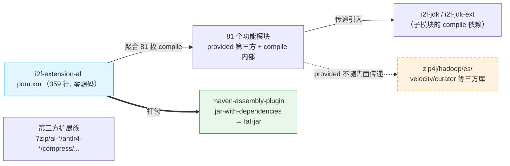
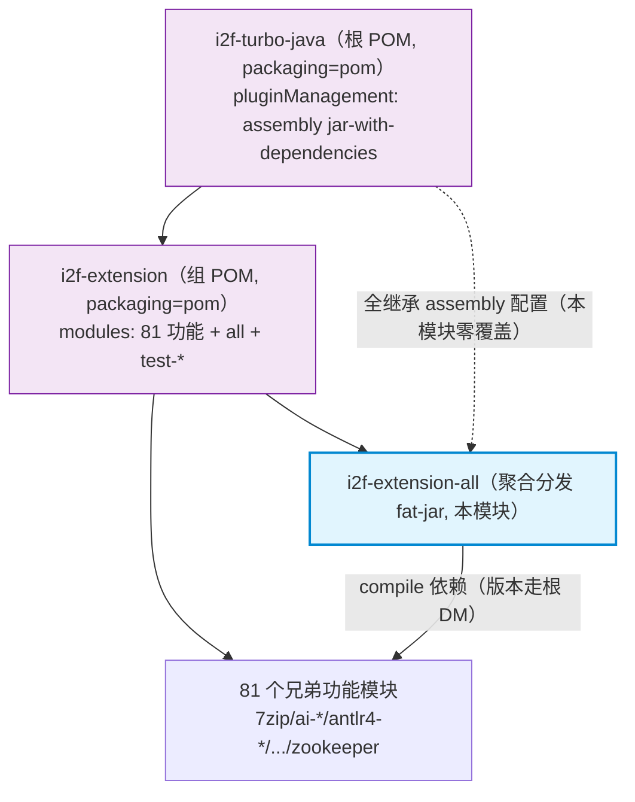

# i2f-extension-all

> **i2f-extension 子模块的 Maven 聚合分发包 / 把第三方扩展族 81 个功能模块打为单体 fat-jar 的构建入口**（仅 1 个 `pom.xml` 共 359 行、无 Java 源码、无测试、无资源、无 SPI）：以 81 枚 compile 依赖「一处声明、整组引入」的方式聚合 `i2f-extension` 组下**除自身外**的全部功能模块（7zip / ai-* / antlr4-* / compress / cron / elasticsearch / filesystem-* / groovy / jackson / mongodb / mybatis / netty / redis-* / velocity* / zookeeper 等），依赖不写版本号（由根 `pom.xml` 的 `dependencyManagement` 以 `${i2f.version}` 锁定），并经继承自根 pom pluginManagement 的 `maven-assembly-plugin`（`jar-with-dependencies` 描述符、`appendAssemblyId=false`）产出单体 fat-jar。它与同仓 `i2f-jdk-all`、`i2f-jdk-ext-all`、`i2f-spring-all` 为同构的「组级聚合分发件」，是本仓库**聚合规模最大**的门面模块。全模块在仓库内**无任何源码级或 POM 级消费方**，仅作为对外统一依赖入口存在。

## 模块路径

`i2f-extension/i2f-extension-all`（artifactId `i2f-extension-all`，groupId 继承 `i2f.turbo`，版本 `1.0-jdk8`）。

本模块是 `i2f-extension` 组（共 84 个 POM 条目：81 功能模块 + `i2f-extension-all` 自身 + `test-flink` + `test-extension`）里的**聚合分发件**：整个模块只有一个 `pom.xml`，无任何 `src` 目录、无 Java 类、无资源、无测试。它在父 POM `i2f-extension/pom.xml` 的 `<modules>` 中被登记为第 7 个子模块（`i2f-extension/pom.xml:23`，紧跟 6 个 ai-* 之后、`antlr4` 之前），职责单一——把同组其余 81 个功能模块收拢为一个「一处声明、整组引入」的依赖门面，并额外通过 assembly 插件产出把这些模块及其 compile 传递依赖解压合并的单体 fat-jar，供不便逐模块列举依赖（如直接放 lib 目录 / `-cp` 部署）的场景使用。

> 打包行为来源：本模块 `<build>`（`pom.xml:350-357`）**只裸声明**了 `maven-assembly-plugin`（仅 `groupId` + `artifactId`，无任何 `<configuration>`）——连兄弟聚合件 `i2f-spring-all` 里那点 `addMavenDescriptor=true` 的覆盖都没有。`jar-with-dependencies` 描述符、`finalName`、`appendAssemblyId=false`、Manifest 元信息（`Class-Path`、`Maven-*`、`Root-*`、`Java-*`）、`package` 阶段 `single` 目标绑定等**全部**继承自根 `pom.xml` 的 `pluginManagement`（约 `pom.xml:1826-1872`）。

## 模块依赖

本模块 `dependencies` 全部为**同组内部模块**，scope 缺省（即 `compile`）、`optional` 缺省（即 `false`）、且**均不写版本号**。共 81 枚，按 artifact 归类如下（表内列出代表性条目，实际 `pom.xml:14-348` 逐条枚举全部 81 个）：

| 类别 | 代表 ArtifactId（groupId 均为 `i2f.turbo`） | 数量 |
|------|---------------------------------------------|------|
| 压缩/归档 | i2f-extension-7zip / -compress / -zip4j | 3 |
| AI/大模型 | i2f-extension-ai-dashscope / -ai-langchain4j8 / -ai-openai / -ai-rag-sqlite | 4 |
| 语法/脚本 | i2f-extension-antlr4 / -antlr4-calculator / -antlr4-funic / -antlr4-tinyscript / -groovy / -ognl / -velocity / -velocity-bindsql / -xproc4j | 9 |
| 字节码/代理 | i2f-extension-agent-javassist / -cglib / -aspectj / -javassist | 4 |
| 语音/视觉 | i2f-extension-asr-vosk / -ocr-tesseract / -opencv / -opencv-data / -opencv-javacv / -tts-espeak / -tts-jacob / -qrcode / -gif / -image-metadata | 10 |
| 浏览器自动化 | i2f-extension-browser-playwright / -browser-selenium | 2 |
| 数据/存储 | i2f-extension-canal / -elasticsearch / -hazelcast / -jedis / -mongodb / -mybatis / -netty / -redis-api / -redis-cache / -zookeeper | 10 |
| 序列化/编解码 | i2f-extension-fastjson / -fastjson2 / -gson / -jackson / -jce-bc / -jce-sm-antherd | 6 |
| 文件系统/对象存储 | i2f-extension-filesystem-{ftp,hdfs,minio,oss-aliyun,oss-aws-s3,sftp} / -ftp / -hdfs / -minio / -oss-aliyun / -oss-aws-s3 / -sftp | 12 |
| 文档/表格 | i2f-extension-document / -easyexcel / -fastexcel | 3 |
| 其它 | i2f-extension-cron / -email / -freemarker / -httpclient / -log-slf4j / -slf4j / -slf4j-log / -sqlparser / -swl / -quartz / -reverse-engineer-generator / -jdbc-procedure-{datax,flink} / -tokenlization-{ansj,hanlp,jcseg,jieba} / -verifycode / -sftp | 余量 |

依赖面特征：

- 版本号由根 `pom.xml` `dependencyManagement` 统一给出（`i2f-extension-all` 自身登记于 `pom.xml:923-927`，被聚合的 81 个模块也各自登记为 `${i2f.version}`），聚合模块自身零版本声明，避免漂移。
- 81 枚依赖全是 `compile`，故「引入 `i2f-extension-all`」在传递依赖层面等价于「同时引入这 81 个扩展模块」；**但**各扩展模块对其第三方库（如 `zip4j`、`hadoop-client`、`elasticsearch-rest-high-level-client`、`velocity-engine-core`、`curator-*` 等）普遍声明为 `provided`（且**多数未叠加 `optional`**），因此这些第三方库**不会**随 `i2f-extension-all` 传递到 Maven 消费方，需运行期自行具备。
- 与 spring-all 的关键区别：本组子模块对内部基础模块（`i2f-jdk`/`i2f-jdk-ext`，如 `i2f-compress-std`、`i2f-bindsql`、`i2f-match`）是 `compile` 依赖，这些**会**随门面传递、也会被 fat-jar 打入。
- 聚合模块本身不引入任何第三方库、不引入 lombok、不直接引入 JDK 基础模块——它只「引用兄弟」。

## 模块设计

### 架构定位

`i2f-extension-all` 是一个**零源码的 Maven 聚合分发模块**，在 `i2f-extension` 组中承担双重角色：

1. **聚合入口（bom/aggregator）**——将同组 81 个功能模块收拢为单一构建/依赖单元，消费方声明一次即可拿到整个第三方扩展能力集。
2. **Fat-jar 分发**——继承根 pom pluginManagement 的 `maven-assembly-plugin`，用 `jar-with-dependencies` 描述符把模块自身（无源码）与 81 个子模块的类、资源及其 compile 传递依赖（内部 i2f-jdk 模块链）解压合并为一个可独立部署的 JAR。



### Maven 模块层级



### 设计要点

1. **零源码纯 POM**：无任何 Java/资源/测试，仅描述构建行为，是典型 Maven aggregator 模式；本仓库聚合规模最大的门面件（81 枚）。
2. **版本全交由根 DM**：81 枚依赖均不写 `<version>`，由根 `dependencyManagement` 以 `${i2f.version}` 统一锁定，聚合层不关心具体版本。
3. **assembly 配置零覆盖**：本模块 `<build>` 仅裸声明 `maven-assembly-plugin`，连 `addMavenDescriptor` 都不覆盖（区别于 `i2f-spring-all` 显式设 `true`），fat-jar 行为完全由根 pom pluginManagement 决定。
4. **第三方库不随门面外泄**：子模块对第三方普遍 `provided`（且多未 `optional`），故 `i2f-extension-all` 作为 Maven 依赖时不会把 81 个模块各自的重型第三方库强行传递给消费方——但代价是 fat-jar **也不含**这些第三方库，并非开箱即用的独立可运行包。
5. **被注释的自依赖块**：`pom.xml:39-42` 存在一段被注释掉的「`i2f-extension-all` 依赖 `i2f-extension-all`」的循环依赖声明，未生效，与同族 `-all` 模块一致的遗留痕迹。

## 模块目的

- **简化依赖引入**：消费方只需声明一个 `i2f-extension-all`，即获得 `i2f-extension` 组 81 个功能模块的全部能力，避免逐个列举。
- **提供预打包分发件**：通过 fat-jar 让不便使用 Maven 依赖管理的场景（直接 `-cp`、lib 目录手动管理）也能整体加载 i2f 扩展族字节码。
- **保持模块边界清晰**：聚合件不引入任何额外逻辑，各子模块的职责、依赖、构建配置仍完全由其自身 POM 定义；聚合层仅做「收拢 + 打包」。
- **双 JDK 分发一致性**：随根构建产出 `i2f-extension-all-1.0-jdk8.jar` 与 `-jdk17.jar`，与组内其他模块保持 jdk8/jdk17 双轨对齐。

## 模块功能

- **Maven 聚合构建**：作为 `i2f-extension` 的子模块，`mvn package -pl i2f-extension/i2f-extension-all -am` 一条命令即可触发 81 个兄弟模块的编译、测试与打包。
- **Fat-jar 产出**：`mvn package` 后生成 `i2f-extension-all-1.0-jdk8.jar`，内含 81 个子模块的类文件与资源，以及它们的 compile 级传递依赖（各子模块依赖的 `i2f-jdk`/`i2f-jdk-ext` 等内部模块链）。
- **统一依赖门面**：对外以单 artifact 表达「整个 i2f-extension 能力集」，屏蔽子模块划分。
- **Manifest 元信息注入**：产出 JAR 的 `META-INF/MANIFEST.MF` 含项目标识、构建时间、仓库链接、编译版本等（继承根 pom pluginManagement）。

## 模块主要使用方法

### 1. 作为 Maven 依赖引入（推荐）

在其他模块 `pom.xml` 中声明一次即可获得 i2f-extension 全部功能：

```xml
<dependency>
    <groupId>i2f.turbo</groupId>
    <artifactId>i2f-extension-all</artifactId>
    <version>1.0-jdk8</version>
</dependency>
```

等价于同时声明本组全部 81 枚功能模块依赖（`i2f-extension-7zip` … `i2f-extension-zookeeper`）。

> 注意：由于各子模块对第三方库为 `provided`（多数未 `optional`），本门面**不会**传递 `zip4j`/`hadoop-client`/`elasticsearch`/`velocity`/`curator` 等第三方本体；作为库引入的宿主仍需按实际使用的扩展自行补齐对应第三方依赖。

### 2. 构建 fat-jar

```bash
mvn package -pl i2f-extension/i2f-extension-all -am
```

产出位于 `i2f-extension/i2f-extension-all/target/i2f-extension-all-1.0-jdk8.jar`（`appendAssemblyId=false`，无 `-jar-with-dependencies` 后缀）。

### 3. 部署使用

fat-jar 可作为 classpath 依赖直接放入应用 lib 目录或经 `-cp` 引用：

```bash
java -cp i2f-extension-all-1.0-jdk8.jar com.example.Application
```

> 该 fat-jar 只含 i2f 扩展字节码与其内部依赖链，不含各扩展所需第三方库；单靠它无法直接驱动 zip4j/hadoop/es 等能力，需另行提供第三方 jar。

### 4. 扩展聚合范围

若 `i2f-extension` 组未来新增功能模块，仅需在 `i2f-extension-all/pom.xml` 追加一枚无版本 `<dependency>` 即自动纳入门面与 fat-jar（版本由根 DM 提供）：

```xml
<dependency>
    <groupId>i2f.turbo</groupId>
    <artifactId>i2f-extension-xxx</artifactId>
</dependency>
```

## 模块特性总结

- **零源码纯 POM**：不含任何 Java/资源/测试，职责单一（聚合 + 打包）。
- **组级依赖门面（最大）**：单 artifact 收拢 81 个第三方扩展模块，是本仓库聚合规模最大的分发件。
- **Fat-jar 聚合分发**：继承根 pom assembly 配置产出 `jar-with-dependencies` 单体 JAR；本模块 `<build>` 对插件零覆盖，比 `i2f-spring-all` 更彻底地全继承。
- **版本零声明**：81 枚依赖全走根 `dependencyManagement`，聚合层不持版本号。
- **第三方依赖隔离**：子模块 `provided`（多未 `optional`）使第三方库不随门面 Maven 传递，但也导致 fat-jar 非自足可运行包。
- **双 JDK 对齐**：产出 jdk8/jdk17 两套 jar，与组内模块分发策略一致。

## 模块瑕疵或错误

以下为静态识别（不实证）：

1. **自依赖注释残留（循环依赖隐患）**：`pom.xml:39-42` 保留了「`i2f-extension-all` 依赖 `i2f-extension-all`」的被注释块，一旦被误取消注释即成 Maven 循环依赖，构建直接失败；属从兄弟 `-all` 模板复制后未清理的死代码。
2. **门面依赖过宽 / 无法按需裁剪**：硬编码全量 81 枚 compile 依赖，任何只要其中一两个能力（例如仅用 `qrcode`）的消费方引入门面都会传递拿到整组 81 模块，缺少更细粒度的分组聚合（如「仅 ai 族」「仅 filesystem 族」）。
3. **fat-jar 与库依赖语义冲突**：本模块同时充当「Maven 依赖门面」（thin，靠传递依赖）与「fat-jar 分发件」（重打包全部子模块类）。若消费方既在 classpath 放 fat-jar、又经 Maven 引入子模块，会出现同一批类的双份定义（重复类 / 类加载歧义），文档未作提示。
4. **fat-jar 非自足可运行**：因第三方库均 `provided`，产出的 fat-jar 缺失 81 个扩展各自运行所需的第三方实现；把它当「开箱即用一体化包」直接 `-cp` 部署会在调用具体扩展时 `NoClassDefFoundError`。
5. **fat-jar 合并冲突无治理**：作为聚合根不对子模块间可能出现的版本冲突或重复资源作统一收敛，完全信任各子模块自身 POM；81 模块合并时同名 `META-INF/services`、`.properties`、`MANIFEST` 条目后者胜，SPI 服务声明易被静默覆盖（本组恰有大量 SPI/ServiceLoader 模块）。
6. **零测试、零聚合完整性校验**：作为分发门面本身无代码可测尚属合理，但也无任何「聚合完整性」约束——若某新扩展被加入 `i2f-extension/pom.xml` 却忘记登记进本件，构建不会报错，门面静默缺件。
7. **`<build>` 零覆盖动机不明**：与 `i2f-spring-all`（显式 `addMavenDescriptor=true`）不一致，本件连这一处覆盖都没有，纯聚合件的 fat-jar 是否保留自身 maven 描述符取决于根 pom 默认，可读性与族内一致性欠佳。
8. **无 README/描述性 `<description>`**：POM 未写 `<description>` 或 `name`，纯靠 artifactId 表达意图，对外 Maven 仓库元数据不自解释。

## 其他扩展章节

### 模块在生态中的位置

- **同构兄弟**：与 `i2f-jdk/i2f-jdk-all`、`i2f-jdk-ext/i2f-jdk-ext-all`、`i2f-spring/i2f-spring-all` 为同一模式的「组级聚合分发件」——零源码、聚合本组功能模块、继承根 pom assembly 产 fat-jar。相较 `i2f-spring-all`（聚合 7 个），本件聚合 81 个，是全仓库规模最大的门面。
- **上层消费方**：仓库内**无任何源码级或 POM 级消费方**（grep `i2f-extension-all` 仅命中其自身 pom、父 `i2f-extension/pom.xml:23` 模块登记、根 `pom.xml:925` DM 登记），它是面向**外部项目/手工部署**的成品分发件，不参与仓库内部模块间的编译依赖。
- **构建登记**：父 `i2f-extension/pom.xml:23`（`<modules>` 第 7 项）、根 `pom.xml` `dependencyManagement` `:923-927`；`bash/{backup,deploy}-jdk8` 与 `bash/{backup,deploy}-jdk17` 四目录均含 `i2f-extension-all-1.0-{jdk8,jdk17}.jar`（四目录齐全，含 jdk17）。
- **组内定位**：`i2f-extension` 组内本件是唯一纯聚合分发件；字母序上 `all` 排在 6 个 `ai-*` 之后、`antlr4` 之前（`all` > `ai-*` 因 'l'>'i'，`all` < `antlr4` 因 'l'<'n'），menus 亦按此位置插入。
