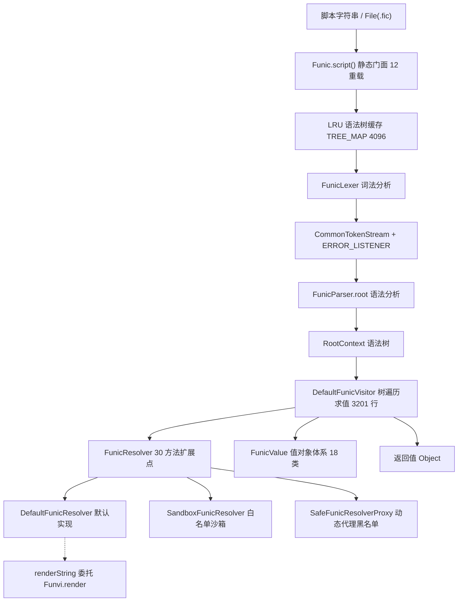
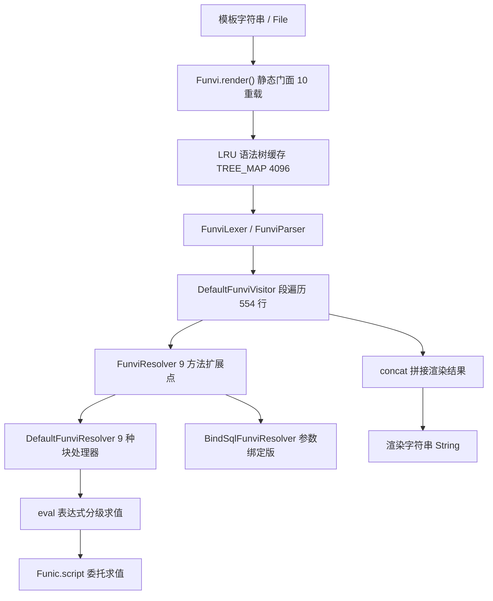

# i2f-extension-antlr4-funic

> **基于 ANTLR4 的「脚本引擎 + 模板引擎」双语言模块 / 提供 Funic 通用脚本语言与 Funvi 轻量模板语言的解析求值能力**（82 个 Java 源文件约 2.3 万行：funic 生成代码 6 类约 1.2 万行 + 手写 51 文件约 8000 行，funvi 生成代码 6 类约 1800 行 + 手写 19 文件约 1800 行；文法 `Funic.g4` 586 行 + `Funvi.g4` 86 行、语言手册 `Funic.md` 1382 行 + `Funvi.md` 365 行随包；`antlr4-runtime:4.13.2` provided + optional，9 个内部 i2f 依赖；静态门面 `Funic.script()` 12 重载 + `Funvi.render()` 10 重载 + LRU(4096) 语法树缓存；`FunicResolver` 30 方法扩展点 + `FunicValue` 值对象体系；语言覆盖模板字符串、`#{}` 解包、`|>` 管道、lambda、`go`/`<-` 异步、`synchronized`、func 函数、import、try-catch-finally；安全体系含 `SandboxFunicResolver` 白名单沙箱与 `SafeFunicResolverProxy` 动态代理黑名单）。**22 项运行时验证：5 项通过、17 项确定性缺陷实锤**——⚠ `try-catch` 完全失效（`resolved` 死变量导致 catch 副作用生效但异常照抛、结果丢弃）、错误监听器 `e=null` 时 NPE 吞掉真实语法错误、下划线数字字面量求值必抛 NFE、Funvi `concat` 遇到 null 追加值丢弃全部前文、Funvi 默认 `debug=true` 全节点日志污染 stdout——详见瑕疵章节。

## 模块路径

- `i2f-extension/i2f-extension-antlr4-funic/pom.xml`
- 相对于仓库根目录：`i2f-extension/i2f-extension-antlr4-funic`

## 模块依赖

### 内部模块（compile 依赖）

| Maven 坐标 | scope | optional | 说明 |
|-----------|-------|----------|------|
| `i2f.turbo:i2f-reflect:1.0-jdk8` | compile | false | `ReflectResolver` 类加载/方法匹配/Bean 映射、`RichConverter` 富转换、`Visitor` 上下文读写 |
| `i2f.turbo:i2f-convert:1.0-jdk8` | compile | false | `ObjectConvertor` 类型转换与数值窄化（`safeConvertAsNumberType`） |
| `i2f.turbo:i2f-typeof:1.0-jdk8` | compile | false | `TypeOf` 类型判定（运算符分派、catch 类型匹配） |
| `i2f.turbo:i2f-match:1.0-jdk8` | compile | false | `RegexUtil.regexFindAndReplace` 实现模板字符串 `${}` 渲染 |
| `i2f.turbo:i2f-invokable:1.0-jdk8` | compile | false | `IMethod`/`JdkMethod`/`JdkInstanceStaticMethod`/`DecorateNameMethod` 方法调用抽象 |
| `i2f.turbo:i2f-mutator:1.0-jdk8` | compile | false | `BaseMutator` 链式构建（`FunicValue` 家族、`FunicLambda`、`FunicMethod` 均实现） |
| `i2f.turbo:i2f-mixins:1.0-jdk8` | compile | false | `AllMixins` 混入函数池 + `MixinProxyFactory` 代理，静态注册为全局函数 |
| `i2f.turbo:i2f-jvm:1.0-jdk8` | compile | false | `JvmUtil.isDebug` 探测 JVM 调试状态（联动调试桥） |
| `i2f.turbo:i2f-bindsql:1.0-jdk8` | compile | false | `BindSql` 参数绑定 SQL 片段，`BindSqlFunviResolver` 的拼接载体 |

> 注：`StreamUtil`（i2f-io-stream）、`LruMap`（i2f-lru）、`Iterators`（i2f-iterator）、`Reference`（i2f-reference）经上述内部依赖传递引入，POM 未直接声明。

### 三方依赖（provided + optional）

| Maven 坐标 | 版本 | scope | optional | 说明 |
|-----------|------|-------|----------|------|
| `org.antlr:antlr4-runtime` | 4.13.2 | provided | true | ANTLR4 运行时（Lexer/Parser 骨架、ParseTree/Visitor API、TokenStream） |
| `org.projectlombok:lombok` | 父 POM 管理 | provided | true | 编译期注解处理（`@Data`/`@NoArgsConstructor`） |

> 打包配置仅启用 `maven-assembly-plugin` 的 `addMavenDescriptor`，无自定义打包描述符。

## 模块设计

### 包结构

```
i2f.extension.antlr4.script.funic             -- Funic 脚本引擎包根（.fic 扩展名）
  ├── grammar/                                -- ANTLR4 生成代码（无 antlr4-maven-plugin，生成类直接入库）
  │   ├── FunicParser.java                    -- 生成语法分析器（7077 行）
  │   ├── FunicLexer.java                     -- 生成词法分析器（843 行）
  │   ├── FunicVisitor.java / FunicBaseVisitor.java   -- 生成 Visitor 接口/基类（639/875 行）
  │   ├── FunicListener.java / FunicBaseListener.java -- 生成 Listener 接口/基类（1104/1457 行）
  │   └── Funic.interp / Funic.tokens / FunicLexer.interp / FunicLexer.tokens
  ├── rule/
  │   ├── Funic.g4                            -- ANTLR4 文法定义（586 行，词法 + 语法规则）
  │   ├── Funic.md                            -- Funic 语言手册（1382 行，语法/类型/示例全解）
  │   ├── Funic.bnf                           -- IDEA Grammar-Kit BNF 兼容副本（仅为 IDE 二义性规避）
  │   └── favicon.ico / favicon.png           -- IDEA 插件图标资产（与插件 assets/funic 目录同步，供 .fic 文件类型显示）
  └── lang/
      ├── Funic.java                          -- 静态求值门面（185 行，12 重载 + 缓存 + 方法注册表）
      ├── annotations/FunicFunction.java      -- 函数别名注解（20 行，@FunicFunction("name")）
      ├── context/FunicFunctionCallContext.java -- 函数调用上下文（34 行，4 类 Type）
      ├── debugger/FunicDebugBridgeReporter.java -- 调试探针（67 行，IDE 断点锚点）
      ├── errors/
      │   ├── DefaultAntlrErrorListener.java  -- 语法错误监听器（75 行，SLF4J 反射输出）
      │   └── DefaultErrorStrategy.java       -- 语法错误策略（44 行，抛带行列解析异常）
      ├── exception/
      │   ├── FunicException.java             -- 异常基类（27 行）
      │   ├── FunicControlException.java      -- 控制流异常基类（27 行）
      │   ├── FunicThrowException.java        -- throw 语句异常（28 行）
      │   ├── control/                        -- FunicBreakException 29 / FunicContinueException 29 / FunicReturnException 46
      │   └── throwable/                      -- FunicEvaluateException 29 / FunicParseException 36 / FunicRejectException 26 / FunicThrowDataException 36
      ├── functions/
      │   ├── FunicBuiltinFunctions.java      -- 内建函数池（171 行：eval/render/assign/compare/cast/assert/类型转换/println）
      │   └── FunicFunctionHelper.java        -- 函数注册助手（123 行，注解别名解析/静态实例统一/过滤）
      ├── impl/DefaultFunicVisitor.java       -- 核心求值 Visitor（3201 行，全量 visit* 实现）
      ├── lambda/FunicLambda.java             -- lambda 表达式（50 行，独立作用域调用）
      ├── method/
      │   ├── FunicMethod.java                -- 脚本函数 IMethod 适配（118 行，支持 return）
      │   ├── Global2InstanceMethod.java      -- UFCS 全局转实例方法（50 行）
      │   └── Instance2GlobalMethod.java      -- 实例转全局方法（55 行）
      ├── operator/                           -- DoubleOperatorFunction 14 / PrefixOperatorFunction 14 / SuffixOperatorFunction 14
      ├── resolver/
      │   ├── FunicResolver.java              -- 30 方法扩展接口（78 行）
      │   ├── FunicSupplier.java              -- 惰性求值标记接口（12 行）
      │   └── impl/
      │       ├── DefaultFunicResolver.java   -- 默认实现（1383 行，运算符表/模板渲染/函数调用链/类加载）
      │       ├── SandboxFunicResolver.java   -- 白名单沙箱（240 行，3 开关 + 10 Mixins 白名单）
      │       ├── SafeFunicResolverProxy.java -- 动态代理安全壳（876 行，危险类/包/方法黑名单 + 链式配置）
      │       └── DangerousConsts.java        -- 黑名单常量（281 行，危险类/包/特定类方法/全局方法）
      ├── value/
      │   ├── FunicValue.java                 -- 值对象接口（11 行，get/set/toMutator 家族）
      │   └── impl/                           -- 18 类约 576 行：Default/Null/Boolean/Float/Number/Numeric/Type/FullName/Terminal/Parent/KeyPair/List/Map/ListKeyPair/ConstString/CatchBlock/PipelineFunction
      └── test/TestFunic.java                 -- 示例（21 行）
i2f.extension.antlr4.funvi                    -- Funvi 模板引擎包根（与 funic 平级，二者联动）
  ├── grammar/                                -- ANTLR4 生成代码
  │   ├── FunviParser.java 1036 / FunviLexer.java 181
  │   ├── FunviVisitor.java 94 / FunviBaseVisitor.java 109
  │   ├── FunviListener.java 143 / FunviBaseListener.java 199
  │   └── Funvi.interp / Funvi.tokens / FunviLexer.interp / FunviLexer.tokens
  ├── rule/
  │   ├── Funvi.g4                            -- 文法定义（86 行，块指令 + 文本段）
  │   ├── Funvi.md                            -- Funvi 语言手册（365 行）
  │   └── Funvi.bnf                           -- IDEA Grammar-Kit BNF 兼容副本
  └── lang/
      ├── Funvi.java                          -- 静态渲染门面（127 行，10 重载 + 缓存）
      ├── debugger/FunviDebugBridgeReporter.java -- 调试探针（67 行）
      ├── errors/FunviErrorStrategy.java      -- 语法错误策略（42 行）
      ├── exception/
      │   ├── FunviException.java 27 / FunviControlException.java 27 / FunviThrowException.java 27
      │   └── impl/                           -- FunviBreakException 29 / FunviContinueException 29 / FunviReturnException 45 / FunviEvaluateException 29 / FunviParseException 36
      ├── handler/FunviBlockHandler.java      -- 块处理器接口（18 行）
      ├── impl/DefaultFunviVisitor.java       -- 模板 Visitor（554 行，段/块/内容遍历）
      ├── listener/DefaultAntlrErrorListener.java -- 错误监听器（75 行，与 funic 版同构）
      ├── resolver/
      │   ├── FunviResolver.java              -- 9 方法扩展接口（36 行）
      │   └── impl/
      │       ├── DefaultFunviResolver.java   -- 默认实现（499 行，9 种块处理器 + eval 求值）
      │       └── BindSqlFunviResolver.java   -- 参数绑定版（97 行，#{} 转 ? 占位符）
      ├── value/ParameterValue.java           -- 参数值载体（19 行）
      └── test/TestFunvi.java                 -- 示例（44 行）
```

### 架构设计

Funic 为「ANTLR4 解析层 → Visitor 求值层 → Resolver 扩展层」三层结构，语法树带 LRU 缓存；Funvi 为同构的「文本段 + 块指令」模板渲染链路，表达式求值委托 Funic：





### 设计要点

1. **双语言双文法**：funic 为图灵完备脚本语言（`Funic.g4` 586 行，语句/表达式/函数/控制流/异步），funvi 为轻量模板语言（`Funvi.g4` 86 行，文本段 + `#块指令`）；`DefaultFunicResolver.renderString` 在 `enableFunviRender=true` 时把模板渲染委托给 `Funvi.render`，二者联动
2. **生成代码入库**：两套 `FunicParser/Lexer/Visitor/Listener` 与 `FunviParser/...` 生成类直接提交到源码树（`grammar` 包），POM 未配置 `antlr4-maven-plugin`，构建零代码生成依赖；文法与语言手册、IDEA BNF 副本随包
3. **静态门面 + LRU 缓存**：`Funic.script()` 12 个重载（File/String/RootContext/Visitor 四类入口）、`Funvi.render()` 10 个重载；两套 `TREE_MAP` 各为 `LruMap(4096)`，重复公式跳过解析（缓存区以空 catch 包裹，故障静默降级）
4. **Visitor 模式求值 + 值对象体系**：`DefaultFunicVisitor`（3201 行）全量实现每个 `visit*`；所有中间结果以 `FunicValue` 家族（18 实现类）承载节点/父链/文本坐标，统一 `get/set/toMutator`
5. **Resolver 委托链**：`FunicResolver` 30 方法（取值/赋值/函数调用/运算符/解包/类加载/调试）与 `FunviResolver` 9 方法（concat/block/parameter/value/toBoolean/调试）全量委托，`Default*Resolver` 开箱可用，下游继承覆盖个别方法即可定制
6. **三级函数注册**：全局方法按「visitor 注册表 → `Funic.GLOBAL_METHODS` 静态表（静态块预注册 `AllMixins` + `System.out.print*` + `Math`）→ `FunicBuiltinFunctions` 内建池（eval/render/assert/int/string/...）」三源合并；实例/静态方法经 `FunicFunctionHelper` 与 `@FunicFunction` 别名装饰注册，支持 UFCS（`Global2InstanceMethod`）
7. **安全双保险**：`SandboxFunicResolver` 以谓词过滤器 + 3 开关（默认全关）做白名单限制，拒绝时抛 `FunicRejectException`；`SafeFunicResolverProxy` 以 JDK 动态代理包裹任意 resolver，按 `DangerousConsts` 黑名单检查类/包/方法（`loadDefaults/clearAll/resetToDefaults` 管理）
8. **异常实现控制流**：`break`/`continue`/`return` 以 `FunicControlException` 家族实现，`FunicLambda` 与 `FunicMethod` 用「新 Visitor + `global` 引用宿主上下文 + 复制 importPackages/registryMethods」构建独立函数作用域
9. **异步与并发**：`go`/`<-` await 由 `DEFAULT_GO_POOL`（`WorkStealingPool`，CPU×2 线程）承载，任务结果以 `Reference` + `Condition` 回传；`synchronized` 语句按取值对象加锁
10. **调试体系**：`debugger` 语句 + `debugBridge` 探针（`FunicDebugBridgeReporter`）+ `JvmUtil.isDebug()` 联动；`Funic.VISITOR`/`FUNCTION_CALL_CONTEXT` 以 `InheritableThreadLocal` 暴露当前调用上下文（供存储过程等宿主桥接）

## 模块目的

- 作为 TinyScript 的完全重构增强替代品（详见 `.wiki/docs/funic-framework.md` 主题 Wiki），以更清晰的 Visitor 分层、值对象体系与双语法（脚本 + 模板）覆盖 XProc4J 存储过程编排的表达式求值与动态 SQL 渲染场景
- 提供「任意 Java 对象作为上下文」的通用求值门面：脚本经 `${}` 读写宿主对象属性，返回值直接为 Java 对象；Funvi 面向「模板 + 少量逻辑」的文本渲染场景
- 构建可插拔安全执行能力：沙箱白名单与动态代理黑名单两条路径，支撑不可信脚本/模板的受限执行

## 模块功能

### 1. Funic 脚本求值引擎

**门面 API**

- `Funic.script()` 12 重载：String / File（`.fic`）/ 语法树 `RootContext` / 直接传入 `DefaultFunicVisitor` 四类入口，均可选配 `scriptFileName`、`scriptLineOffset`（错误定位行偏移）与 `FunicResolver`
- `Funic.parse(formula)` / `Funic.parseTokens(formula)`：分步解析；`TREE_MAP`（`LruMap` 4096）缓存语法树
- `Funic.registryMethods(...)` 5 重载：向 `GLOBAL_METHODS` 注册全局方法（`Class`/`Object`/`Iterable` + 可选 `Predicate<Method>` 过滤）；`Funic.IMPORT_PACKAGES` 维护全局默认导入包

**语言能力**（详见 `rule/Funic.md` 语言手册与 `.wiki/docs/funic-framework.md`）

| 分类 | 能力 |
|-----|------|
| 字面量 | 整型（10 进制 / `0x` 16 进制 / `0o`、`0t` 8 进制 / `0b` 2 进制，支持 `L` 后缀与 `_` 分隔）、浮点（`F` 后缀、科学计数法）、布尔、null、单双引号字符串、渲染字符串 `R"..."`、多行字符串 ```` ``` ```` / `"""`（NAMING 特性链 + 行处理）、`Class.class` 类字面量 |
| 取值 | 变量名直接引用（`resolver.getFieldValue`）、`${expr}`/`$!{expr}` 子表达式引用（递归求值，`!` 版 null 转空串）、`.成员`/`?.成员` 实例属性、`[下标]` 中括号取值（List/数组/Map/字符串按索引）、`@Class` 类型引用、`Class@FIELD`/`Class::FIELD` 静态成员 |
| 赋值 | `=`、复合 `+= -= *= /= %=`、空赋值 `?=`、非空赋值 `.=`、解包赋值 `#{a:expr, b}` / `#{}` |
| 运算符 | 逻辑 `&& \|\| ! and or not`、比较 `=== !== > >= < <= == != <>` 及关键字 `teq/tneq/gt/gte/lt/lte/eq/neq/ne`、`in` / `not in`、`instanceof` / `is`、`as` 转换、位运算 `<< >> >>> ^ & \|` 及关键字 `shl/shr/ushr/xor/band/bor`、算术 `+ - * \ / %`、前后缀 `! not ~ - ++ --`、后缀 `!`（阶乘）/ `%`（百分比）、三元 `?:` |
| 控制流 | `if/elif/else`、for-range（`for(i 0...20)`）、C 风格 for、foreach（`for(i : list)`）、`while`、`do-while`、`try-catch-finally`（多类型 `catch(A\|B e)`）、`throw`、`return/break/continue` |
| 函数 | `func`/`def` 声明（参数类型可选、返回类型、独立作用域与 `global` 宿主引用）、lambda `(args) -> { ... }`、具名参数调用 `f(name: value)`、`new` 实例/数组创建 |
| 管道与并发 | `\|>` 管道链（`::` 前缀表示以上一值为目标的成员调用、静态函数/静态字段、全局函数动态名 `<expr>`）、`go` 异步启动、`<-` await 等待、`synchronized(expr) { ... }` 同步块 |
| 其他 | `import 包名.*`、`debugger [tag] [(cond)]` 调试断点、`new`、类型转换 `as` |

**函数与内建体系**

- 静态块预注册三个全局方法源：`AllMixins` 混入池（`MixinProxyFactory` 代理）、`System.out` 的 print 系方法、`Math`（排除 `extra` 系）
- 内建函数池 `FunicBuiltinFunctions`：`eval`（携当前 visitor 上下文递归执行）、`render`（模板渲染）、`assign`（解包赋值）、`compare`、`cast`、`assert`、类型转换 `int/string/double/boolean/decimal`、`println/printf`
- 全局方法三级搜索：visitor 注册表 → `Funic.GLOBAL_METHODS` 静态表 → 内建池（`getBuiltinGlobalMethods`）
- `@FunicFunction("name")` 注解为方法附加别名，`FunicFunctionHelper` 自动生成 `DecorateNameMethod` 装饰方法
- UFCS 支持：`Global2InstanceMethod` 让全局方法可挂任意实例调用，`Instance2GlobalMethod` 反向包装
- 自定义函数：`func/def` 声明包装为 `FunicMethod`（实现 `IMethod`），lambda 包装为 `FunicLambda`，二者均在「新 Visitor + `global` 引用宿主上下文 + 复制导入包与注册方法」的独立作用域中执行

**异步与调试**

- `go` 提交任务到 `DEFAULT_GO_POOL`（`Executors.newWorkStealingPool(CPU×2)`），`<-` await 以 `Reference` + `Condition` 等待结果
- `debugger` 语句 + `debugBridge` 探针（`FunicDebugBridgeReporter`，IDE 断点锚点）+ `JvmUtil.isDebug()` 自动联动；`Funic.VISITOR`/`Funic.FUNCTION_CALL_CONTEXT`（`InheritableThreadLocal`）向宿主暴露当前 visitor 与函数调用上下文

### 2. Funvi 模板渲染引擎

**门面 API**

- `Funvi.render()` 10 重载（String / File / `RootContext` × 可选 fileName/lineOffset/resolver）；`Funvi.parse/parseTokens` + `TREE_MAP`（4096）缓存

**模板语法**（块结束符统一为 `##`，`BLOCK_END: SHARP SHARP`）

| 块 | 语法 | 说明 |
|----|------|------|
| 文本段 | 任意文本 | 原样输出 |
| 取值段 | `${expr}` / `#{}` | 委托 `resolver.value` 求值；Default 版两者均为表达式求值，BindSql 版 `${}` 字符串拼接、`#{}` 转 `?` 占位符 |
| if | `#if(cond) ... #else(cond)? ... ##` | 条件块；无匹配分支返回 null（详见瑕疵 J4） |
| foreach | `#foreach(n:item, coll:${list}) ... ##` | 迭代块，支持 Iterable/Iterator/数组，循环变量结束后恢复 |
| for | `#for(...) ... ##` | 计数循环 |
| while | `#while(cond) ... ##` | 条件循环 |
| bind | `#bind(name, value)` | 绑定变量（无块体）；Default 版 `#set(...)` 为 bind 别名 |
| trim | `#trim(...) ... ##` | 前后缀修剪（prefix/suffix/prefixOverrides/suffixOverrides） |
| break / continue | `#break` / `#continue` | 循环控制（异常实现） |
| sharp / dollar | `#sharp` / `#dollar` | 输出 `#` / `$` 字面量 |
| where / set（BindSql 版） | `#where(...) ... ##` / `#set(...) ... ##` | SQL 子句块：自动去除首尾 `and/or`、`,` 并补 `where`/`set` 关键字 |

**求值链**

- `DefaultFunviResolver.parameter/value`：块参数与取值段求值；`eval` 分级：null/true/false → int → double → BigInteger → BigDecimal → 字符串字面量 → `Funic.script` 委托求值
- `concat(obj, append)`：段间拼接（Default 版字符串拼接、BindSql 版 `BindSql.concat`）
- `BindSqlFunviResolver`：继承并覆盖 `concat`/`postProcessValue`，追加 `where`/`set` 块，把 `#{}` 值转为 `BindSql.of("?", value)` 参数占位片段

### 3. 安全执行能力

| 方案 | 类 | 机制 |
|-----|----|------|
| 白名单沙箱 | `SandboxFunicResolver` | 6 个谓词过滤器（多行特性/渲染占位/方法执行/实例化/数组创建/类加载）+ 3 个默认关闭开关（静态全局/内建全局/visitor 注册全局方法）+ 默认放行池（10 个 Mixins + `System.out` print + `Math`）；拒绝时抛 `FunicRejectException`；`createDefault()` 静态工厂开箱即用 |
| 黑名单代理 | `SafeFunicResolverProxy` | JDK 动态代理（`InvocationHandler`）包裹任意 `FunicResolver`；按 `DangerousConsts` 检查危险类全限定名（Runtime/ProcessBuilder/Unsafe/ClassLoader/反射/序列化/编译器/Socket/Robot/DriverManager 等）、危险包前缀（javax.management/java.rmi/javax.naming/JDI/sun.misc/javax.script/groovy/字节码工程等）、特定类方法（System/Class/File/URL/URI/Thread）与全局方法名（exec/load/loadLibrary/halt/deleteOnExit 等，`DangerousConsts` 另含 `eval`）；支持 `addDangerousClassName/addDangerousPackage/addDangerousMethod/addGlobalDangerousMethod/addWhitelistClassName` 链式追加与 `remove*/clearAll/loadDefaults/resetToDefaults` 管理；`create(delegate)` / `build()` 生成代理实例 |

### 4. 解析错误处理

- `DefaultErrorStrategy` / `FunviErrorStrategy`：接管 ANTLR 错误报告，抛出携带 `line`/`column` 的 `FunicParseException` / `FunviParseException`
- `DefaultAntlrErrorListener`（funic 与 funvi 两份同构）：注册进静态 `ERROR_LISTENER` 列表，以 SLF4J 反射输出错误（SLF4J 不可用时 `System.err` 兜底）——该监听器含缺陷，详见瑕疵 J2
- 求值异常统一包装：`FunicEvaluateException` 附 `location at line x:y , near <片段>` 定位信息

## 模块主要使用方法

### 1. 基础执行（Funic）

```java
Map<String, Object> context = new HashMap<>();
context.put("a", 1);
context.put("b", 2.5);

Object ret = Funic.script("a+b", context);                   // 3.5，最后一条语句为返回值
Object ret2 = Funic.script("b+'***'.length()+'*'", context); // "4*"（字符串拼接 + 实例方法链）
Object ret3 = Funic.script("${a+b}*2", context);             // 7.0（${} 子表达式递归求值）
```

### 2. 从文件执行（.fic）

```java
Object ret = Funic.script(new File("rule.fic"), context);
// 或带自定义 resolver
Object ret2 = Funic.script(new File("rule.fic"), context, new MyResolver());
```

### 3. 语法树复用（跳过解析）

```java
FunicParser.RootContext tree = Funic.parse(script); // 内部 LRU(4096) 自动缓存
Object ret = Funic.script(tree, context, "user.fic", 0, null);
```

### 4. 自定义 Resolver

```java
public class MyResolver extends DefaultFunicResolver {
    @Override
    public Object invokeGlobalMethod(String methodName, List<Map.Entry<String, Object>> args,
                                     DefaultFunicVisitor visitor) {
        if ("myFunc".equals(methodName)) {
            return "custom:" + args.size();
        }
        return super.invokeGlobalMethod(methodName, args, visitor);
    }
}
Object ret = Funic.script(script, context, new MyResolver());
```

### 5. 注册全局方法

```java
Funic.registryMethods(MyUtils.class);                 // 静态方法统一入全局表
Funic.registryMethods(MyBean.INSTANCE);               // 实例方法（自动按 JdkInstanceStaticMethod 包装）
Funic.registryMethods(MyUtils.class, m -> !m.getName().startsWith("_")); // 带过滤
// 脚本中可直接调用；@FunicFunction("alias") 可附加调用别名
```

### 6. 安全执行

```java
// 白名单沙箱：默认关闭静态/内建/注册全局方法三开关，仅放行 10 Mixins + System.out + Math
FunicResolver sandbox = SandboxFunicResolver.createDefault();
Object ret1 = Funic.script(script, context, sandbox);

// 黑名单动态代理：包裹任意 resolver
FunicResolver safe = SafeFunicResolverProxy.create(new DefaultFunicResolver());
// 链式定制后再 build()
FunicResolver custom = new SafeFunicResolverProxy(new DefaultFunicResolver())
        .addDangerousClassName("com.foo.Dangerous") // 追加危险类
        .addWhitelistClassName("com.foo.Safe")      // 白名单例外（谨慎）
        .build();
Object ret2 = Funic.script(script, context, custom);
```

### 7. Funvi 模板渲染

```java
Map<String, Object> context = new HashMap<>();
context.put("username", "zhang");
context.put("status", true);

Object ret = Funvi.render("username=${username}, status=${status?\"yes\":\"no\"}", context);
// "username=zhang, status=yes"

// 块指令（## 为块结束符）
Object ret2 = Funvi.render("#if(${status})active#else(inactive)##", context); // "active"
```

### 8. Funic 渲染字符串联动 Funvi

```java
public class FunviEnabledResolver extends DefaultFunicResolver {
    public FunviEnabledResolver() {
        this.enableFunviRender.set(true); // 开启后 R"..." 渲染字符串委托 Funvi.render（默认 false 走 ${} 正则替换）
    }
}
Object ret = Funic.script("R\"hello ${username}\"", context, new FunviEnabledResolver());
```

### 9. Maven 依赖引入

```xml
<dependency>
    <groupId>i2f.turbo</groupId>
    <artifactId>i2f-extension-antlr4-funic</artifactId>
    <version>1.0-jdk8</version>
</dependency>
<!-- antlr4-runtime 为 provided + optional，运行期需额外提供 -->
<dependency>
    <groupId>org.antlr</groupId>
    <artifactId>antlr4-runtime</artifactId>
    <version>4.13.2</version>
</dependency>
```

### 10. 在 XProc4J 中使用

```xml
<lang-eval-funic result="ret">
    a + b
</lang-eval-funic>
```

- 标签名 `lang-eval-funic`（`TagConsts.LANG_EVAL_FUNIC`），由 `LangEvalFunicNode` 执行；特性名 `eval-funic`（`FeatureConsts.EVAL_FUNIC`）用于属性表达式
- 执行走 `ProcedureFunicResolver`：`debugBridge` 转发执行器调试桥、`openDebugger` 转发执行器、`findClass` 优先执行器类加载器、函数调用桥接存储过程调用与 `ContextHolder.INVOKE_METHOD_MAP`
- SpringBoot 场景（`i2f-springboot-xproc4j-starter`）：配置 `xproc4j.enable-funic=true`（默认 false）启用 `FunicJdbcProcedureExecutor`
- ⚠ 由于 try-catch 缺陷（见下文 J1）与词法错误缺陷（J2），编排脚本中请避免 `try-catch` 且确保无词法错误字符

### 11. IDE 支持

- `i2f-tools/i2f-jdbc-procedure-idea-plugin`（Gradle 独立工程）为 `.fic` / `.fvi` 提供语法高亮、格式化、折叠、括号匹配、补全、Live Templates 与断点调试（`FunicPositionManager`/`FunicLineBreakpointType`），其语法定义与图标资产位于插件 `assets/funic`、`assets/funvi` 目录（与本模块 `rule/` 目录同源）
- 插件按语言独立实现 PSI 解析（Grammar-Kit BNF + 生成 Parser），非直接依赖本模块生成代码

## 模块特性总结

- **双引擎一体交付**：Funic 图灵完备脚本语言（`.fic`）+ Funvi 轻量模板语言（`.fvi`）同模块发布；`R"..."` 渲染字符串在 `enableFunviRender=true` 时委托 Funvi 引擎，两套引擎可组合使用
- **ANTLR4 文法驱动**：`Funic.g4` 586 行 + `Funvi.g4` 86 行文法定义，生成代码入库构建零代码生成依赖，文法即语言规格（`rule/` 目录随包语言手册 `Funic.md` / `Funvi.md`）
- **静态门面零配置**：`Funic.script()` 12 重载 / `Funvi.render()` 10 重载覆盖「字符串 / 文件 / 语法树 × 任意上下文对象 × 可选 Resolver / 文件名 / 行偏移」组合
- **LRU 语法树缓存**：两套引擎各以 `LruMap(4096)` 缓存解析结果，重复脚本执行免除解析开销
- **语言表达力全面**（对 TinyScript 的重构增强）：渲染字符串 `${}`/`$!{}`、多行字符串、`#{}` 解包、管道 `|>` 链、lambda、`go`/`<-` 异步（工作窃取线程池）、`synchronized` 块、`func/def` 独立作用域函数、`import`、try-catch-finally、for-range/foreach/C 风格 for、关键字运算符（teq/band/shl 等）
- **30 方法扩展点**：`FunicResolver` 覆盖取值赋值 / 方法调用 / 实例化 / 运算符 / 解包 / 类加载 / 类型转换 / 调试全链路，`DefaultFunicResolver` 可继承覆盖任意单点
- **函数注册生态**：三级全局方法搜索（visitor 注册表 → `GLOBAL_METHODS` 静态表 → 内建函数池）+ `@FunicFunction` 注解别名 + UFCS 双向包装（全局方法可挂实例、实例方法可注册全局）
- **安全执行双方案**：`SandboxFunicResolver` 白名单沙箱（谓词过滤器 + 3 开关 + Mixins 放行池）与 `SafeFunicResolverProxy` 黑名单动态代理（危险类/包/方法 + 链式定制），适配不可信脚本场景
- **Funvi 块处理体系**：11 种块处理器（if/foreach/for/while/bind/trim/break/continue/sharp/dollar + BindSql 版 where/set），`BindSqlFunviResolver` 可将模板直接渲染为 `BindSql` 参数化 SQL
- **IDE 一等公民支持**：IDEA 插件对 `.fic`/`.fvi` 提供高亮、格式化、折叠、补全、Live Templates 与断点调试（探针锚点 `debugBridge`）

## 模块运行时验证结果

对 `target/classes`（与源码同步编译）以 JDK8 `javac` 直编驱动（classpath：本模块 classes + `antlr4-runtime-4.13.2` + deploy-jdk8 依赖包）执行 22 项场景，结果为 **5 项通过、17 项缺陷复现、0 项意外**：

### 通过项（5）

| 场景 | 结果 |
|-----|------|
| 基础 Funic 执行 `b=1;b+'***'.length()+'*'` | `4*`，字符串拼接与实例方法链正确 |
| try-finally 正常路径（return 与 finally 副作用） | 返回 `x`，`context.f=fin`（finally 已执行） |
| 解析错误正常路径（`1+` 截断） | `FunicParseException: line 1:3 no viable alternative at input '<EOF>'`，cause 正确包装 `InputMismatchException` |
| Funvi 基础渲染 `${}` + 三元表达式 | `username=zhang, status=yes` |
| Funvi 控制流对照 `#if(true)` | `A${username}B#if(true)X## C` → `AzhangBX C` |

### 缺陷复现项（17）

| 场景 | 结果 |
|-----|------|
| J1a try-catch（`throw`） | catch 赋值生效（`c=caught`）但原异常仍抛出；catch 参数 `e=null`（未绑定异常对象） |
| J1b try-catch（`1/0`） | `FunicThrowException ... Division by zero` 仍抛出（catch 赋值副作用生效） |
| J1c try-catch 多类型 `catch(A\|B e)` | 同 J1a，原异常仍抛出 |
| J2a 词法错误（未闭合字符串） | `LexerNoViableAltException` 裸抛（`getMessage()=null`）；stderr 消息打印两次 + 堆栈 |
| J2b 词法错误（反引号字符） | 同 J2a |
| J2d Funvi 解析器可恢复错误 | `NullPointerException: null`（无任何消息） |
| J2e Funic 解析器可恢复错误（extraneous input） | `NullPointerException: null` |
| J3a 下划线十进制 `1_000` | `For input string: "1_000"` |
| J3b 下划线十六进制 `0xff_ff` | `For input string: "ff_ff"` |
| J3c 下划线浮点 `1_000.5` | `cause by: null`（JDK8 NFE 无消息） |
| J3d 下划线二进制 `0b1_0` | `For input string: "1_0"` |
| J3e 下划线八进制 `0o1_0` | `For input string: "1_0"` |
| J4a Funvi `#if(false)` 丢前文 | `A${username}B#if(false)X## C` → `" C"`（丢失 `AzhangB`，应 `"AzhangB C"`） |
| J4b Funvi `#bind` 丢前文 | `a#bind(${'x'},7) b${x}` → `" b7"`（丢失 `a`） |
| J4d foreach 内无体 `#bind` | `FunviEvaluateException: set block not require body!` |
| J4e foreach 内 `#if(false)` | `"BBB"`（每轮迭代丢失 `A${item}` 前缀，应 `A1BA2BA3B`） |
| J5 默认调试输出 | 渲染 26 字符模板即产生 635 字符 / 7 行 stdout DEBUG 日志 |

> 验证驱动代码：`runtime/tmp/funic-verify/ValidateFunic.java`；原始记录：`result.log` / `result.err.log`。

## 模块瑕疵或错误

### J1. try-catch 匹配成功后仍抛原异常，catch 体返回值被丢弃（确定性，实锤）

- **位置**：`DefaultFunicVisitor.java` L1336（`boolean resolved = false` 声明）、L1348/L1373（两处 `if (!resolved)` 判断）、L1360-1367（catch 匹配处理体）
- **机制**：`resolved` 声明后无任何写入点（死变量），永远不会变为 `true`；即使 catch 类型匹配成功——L1362 将异常对象绑定到 catch 参数、L1363 执行 catch 体（其返回值 `FunicValue value` 被直接丢弃）、L1366 finally 恢复变量旧值——流程走到 L1373 时 `if (!resolved)` 依然恒真，L1374-1377 必然抛出原异常（`FunicException` 原样抛，否则包装为 `FunicThrowException`）
- **影响**：**try-catch 语言特性整体失效**——catch 体只产生变量副作用（赋值生效），异常照旧炸出；依赖 catch 兜底的脚本行为与用户预期相反，且 catch 参数在块外被恢复（实测 `context.e=null`）
- **修复提示**：catch 体执行完成后应置 `resolved = true`，并考虑按需保留 catch 参数绑定
- **实测**：J1a（`throw` 字符串）、J1b（`1/0`）、J1c（多类型 `catch(A|B e)`）三项均「catch 副作用生效 + 原异常照抛」

### J2. ANTLR 错误处理三重缺陷：消息双打印、词法异常裸抛、可恢复错误 NPE（确定性，实锤）

- **位置**：`DefaultAntlrErrorListener.java`（funic `lang/errors/` 与 funvi `lang/listener/` 两份同构）L55-60 `syntaxError`、L62-72 `logError`；`Funic.parse` L157-162 / `Funic.parseTokens` L175-180（`Funvi.parse` L98-103 / `Funvi.parseTokens` L116-121 同构）
- **机制**（三条独立缺陷叠加）：
  1. **消息双打印**：`parse`/`parseTokens` 仅 `addErrorListener` 而未先 `removeErrorListeners()`，ANTLR 默认 `ConsoleErrorListener` 保留，与自定义监听器叠加输出，每条错误消息在 stderr 打印两次（实测）
  2. **词法异常裸抛**：L59 `throw e` 把非 null 的 `LexerNoViableAltException` 直接抛给调用方（未经 `FunicParseException` 包装），`getMessage()=null`、行号只存在于堆栈中；且 L58 已先行 `logError`（L70 打印消息 + L71 `e.printStackTrace()` 输出堆栈）
  3. **可恢复错误 NPE**：parser 恢复路径（extraneous input 等）以 `e=null` 进入 `syntaxError`，L71 `e.printStackTrace()`（空引用调用）先于 L59 `throw e` 执行 → 用户收到无任何消息的 `NullPointerException`
- **影响**：脚本语法/词法错误无法获得规范化异常与完整定位；两个 NPE 场景零信息；stderr 输出重复且夹带堆栈
- **实测**：J2a/J2b（词法裸抛 + 双打印）、J2d/J2e（NPE）；对照 J2c（不触发上述路径的语法错误可正常包装）

### J3. 下划线数字字面量词法支持但求值失败（确定性，实锤）

- **位置**：`DefaultFunicVisitor.java` `visitTerminal` L2943-3080：HEX L2976-2987、OTC L2988-2999、BIN L3000-3011、浮点/科学计数 L3012-3047、十进制 L3048-3059
- **机制**：文法允许数字含 `_` 分隔符（`Funic.g4` L71 `fragment TERM_INTEGER: (TERM_DIGIT)+ ('_' TERM_DIGIT+)*`），但求值直接以原文调用 `parseInt/parseLong/parseFloat/double`，catch 内兜底的 `new BigInteger(text, radix)` / `new BigDecimal(text)` 同样未剥离 `_`，全部抛 `NumberFormatException`
- **影响**：所有进制（10/16/8/2）与浮点场景的下划线字面量均在运行期失败（J3a-J3e）；十进制浮点场景 NFE 消息为 null（JDK8），用户完全无从定位
- **修复提示**：数值解析前统一 `text = text.replace("_", "")`

### J4. Funvi `concat` 空值语义缺陷：`append=null` 丢弃已累积前文（确定性，实锤）

- **位置**：`DefaultFunviResolver.concat` L89-98（`if (obj == null) return append; if (append == null) return null;`）；`DefaultFunviVisitor.visitIfBlock` L240（无匹配分支 `return null`）；`DefaultFunviVisitor.visitBlockBody` L310（`ret = resolver.concat(ret, nextValue)` 段间拼接链）
- **机制**：`concat` 规定「后件为 null 时整体返回 null」——一旦某片段求值为 null（如 `#if(false)` 无匹配分支），此前已拼接的全部文本被丢弃，且 null 继续沿拼接链向后传播；该语义无法区分「块无输出」与「放弃前文」两种意图
- **影响**（三类复现）：
  - 文本 + 控制流：`A${username}B#if(false)X## C` → `" C"`，`AzhangB` 全部丢失（J4a）
  - 文本 + 赋值块：`a#bind(${'x'},7) b${x}` → `" b7"`，`a` 丢失（J4b）
  - 循环内叠加：foreach 体内 `#if(false)` 每轮丢失迭代前缀，`"BBB"`（应 `A1BA2BA3B`，J4e）
- **附加问题**：foreach 循环体内使用无块体 `#bind(...)##` 且后随文本时，块边界解析异常，抛 `FunviEvaluateException: set block not require body!`（J4d）
- **修复提示**：`append == null` 时应返回 `obj`（或将 null 视为空串参与拼接）

### J5. Funvi 默认 debug=true，渲染任何模板污染 stdout（确定性，实锤）

- **位置**：`DefaultFunviResolver.java` L45 `protected final AtomicBoolean debug = new AtomicBoolean(true);`、L64-74 `debugLog`（`debug.get()` 为真即 `System.out.println`）；`DefaultFunviVisitor.debugNode` L533 **无条件**调用 `resolver.debugLog`
- **机制**：与 funic 侧相反（`DefaultFunicResolver` L60 默认 `false`），Funvi 默认打开调试开关；且 `debugNode` 的 `debugLog` 调用不设任何分支，是否输出完全取决于 resolver 的 debug 值，二者组合为「默认无条件打印」
- **影响**：默认配置下渲染 26 字符模板即产生 7 行 / 635 字符 stdout DEBUG 日志（含每个 AST 节点文本与位置）；宿主未显式 `debug(false)` 或覆盖 `debugLog` 时生产日志被刷屏
- **附加问题**：`DefaultFunviVisitor` L521 调试桥文件名 fallback 写死 `"virtual_script.tis"`（TinyScript 复制残留，`.tis` 为 TinyScript 扩展名；funic 侧 L3163 已正确为 `"virtual_script.fic"`）
- **缓解**：XProc4J 场景可经 `ProcedureFunicResolver` 覆盖 `debugLog` 为空规避

### 次级问题（代码审查发现）

1. **解析缓存区空 catch 吞异常**：`Funic.parse` L151-153 / L164-168、`Funvi.parse` L92-94 / L107-109，缓存读写故障静默降级（无任何日志线索）
2. **默认安全边界依赖宿主**：`Funic` 静态块默认注册 `AllMixins` 混入池 + `System.out` print 系 + `Math`（L44-50），默认解析器下这些方法全局可见；不可信脚本必须显式套 `SandboxFunicResolver` / `SafeFunicResolverProxy`
3. **默认导入包全局共享**：`Funic.IMPORT_PACKAGES` 为静态全局列表，`import` 语句与注册方法对所有上下文可见，多租户场景存在相互污染可能

## 消费方情况

### POM 级

| 消费方 | 依赖方式 | 说明 |
|-------|---------|------|
| `i2f-extension-antlr4` | POM 依赖（L27） | ANTLR 子模块聚合门面 |
| `i2f-extension-all` | POM 依赖（L53） | extension 域全量聚合分发包 |
| `i2f-extension` 父 POM | module 声明（L26） | 多模块子模块注册 |
| 根 POM `i2f-turbo-java` | dependencyManagement（L940） | 版本统一管理 |

### Java 级（i2f-extension-xproc4j，经 `i2f-extension-antlr4` 聚合间接依赖）

| 文件 | 引用 | 说明 |
|-----|------|------|
| `node/impl/LangEvalFunicNode.java` | `Funic`/`FunicParser`/`FunicResolver` | Funic 语言执行节点（TAG `lang-eval-funic`） |
| `node/impl/funic/ProcedureFunicResolver.java` | 继承 `DefaultFunicResolver` | 存储过程 Resolver：debugBridge/openDebugger 转发执行器、findClass 优先执行器类加载器、函数调用桥接 `ContextHolder.INVOKE_METHOD_MAP` |
| `node/impl/funic/ProcedureFunicFunctionCallContext.java` | 函数调用上下文 | 过程函数调用上下文载体 |
| `executor/impl/FunicJdbcProcedureExecutor.java` | Funic 语言求值 | 基于 Funic 的存储过程执行器（`enable-funic` 开关） |
| `executor/impl/DefaultJdbcProcedureExecutor.java` | Funic 语言求值 | 默认执行器集成 |
| `context/event/ScriptPreloadEventListener.java` | `Funic.parse` | 脚本预加载（语法树预热） |
| `reportor/MetaDependencyResolver.java` | `Funic`/`FunicParser` | 元数据依赖解析（Funic 表达式识别与语法树遍历） |
| `reportor/impl/DefaultGrammarReporter.java` | `Funic.ERROR_LISTENER` | 语法特性报告期间临时挂载/移除错误监听器 |

### Java 级（i2f-springboot-xproc4j-starter）

| 文件 | 引用 | 说明 |
|-----|------|------|
| `SpringJdbcProcedureProperties.java` | `enableFunic`（默认 `false`） | 配置项定义（`xproc4j.enable-funic`） |
| `SpringContextJdbcProcedureExecutorAutoConfiguration.java` | `FunicJdbcProcedureExecutor` | 按开关条件装配执行器 |

### 工具级

| 消费方 | 依赖方式 | 说明 |
|-------|---------|------|
| `i2f-tools/i2f-jdbc-procedure-idea-plugin` | Gradle 独立工程（lib 引入 xproc4j jar） | `.fic`/`.fvi` 双语言一等公民支持：PSI 解析、语法高亮、格式化、折叠、括号匹配、补全、Live Templates、断点调试（`FunicPositionManager`/`FunicLineBreakpointType`）；语法定义（BNF/g4）与图标资产位于插件 `assets/funic`、`assets/funvi` 目录（与本模块 `rule/` 同源） |

### 文档生态

- 主题 Wiki：`.wiki/docs/funic-framework.md`（834 行，Funic/Funvi 框架主题文档）
- 关联文档：`.wiki/docs/idea-plugin.md`（IDE 语言支持）、`.wiki/docs/xproc4j-framework.md`（XProc4J 集成）、`.wiki/docs/tinyscript-framework.md`（前代语言，已标注被 Funic 超越）
- 模块内语言手册：`rule/Funic.md`（1382 行）、`rule/Funvi.md`（365 行）
