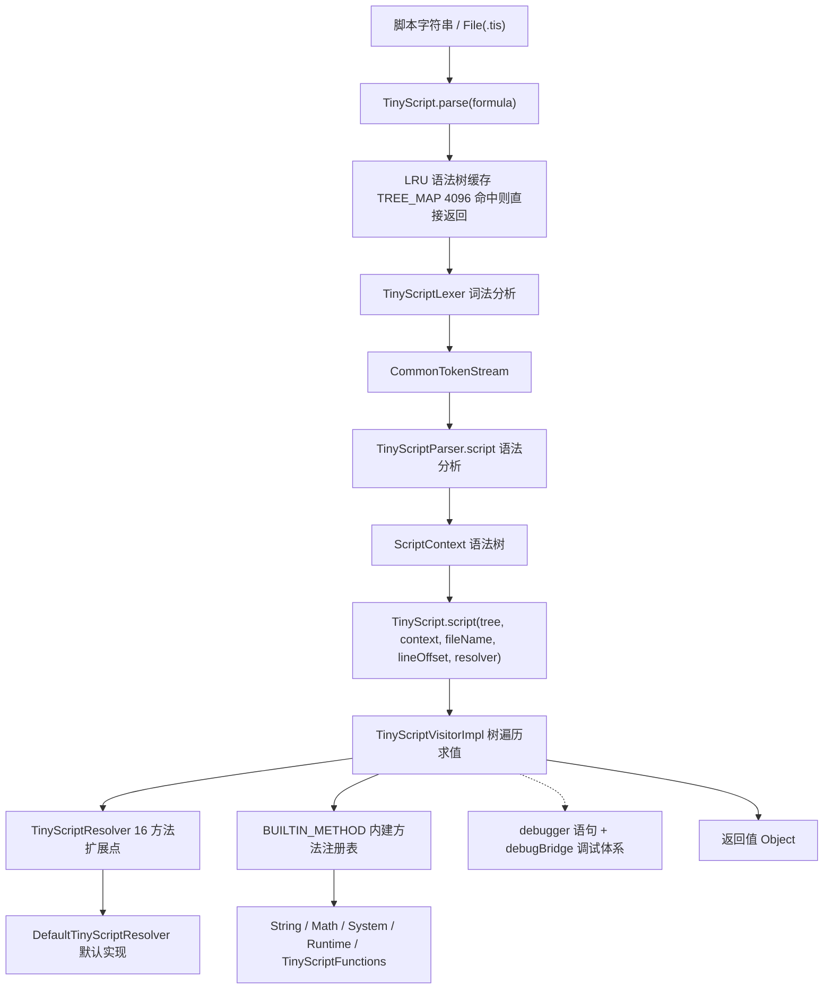

# i2f-extension-antlr4-tinyscript

> **基于 ANTLR4 的嵌入式迷你脚本语言引擎 / 为 XProc4J 等宿主提供「字符串脚本 → Java 对象」的表达式与多语句求值能力**（30 个主源文件约 1.33 万行：ANTLR4 生成 6 类约 8600 行入库 + 手写求值器 `TinyScriptVisitorImpl` 3129 行；文法 `TinyScript.g4` 397 行 + 语言手册 `TinyScript.md` 1137 行随包；`antlr4-runtime:4.13.2` provided + optional，9 个内部 i2f 依赖；静态门面 `TinyScript.script()` + LRU(4096) 语法树缓存 + `TinyScriptResolver` 16 方法扩展点 + 内建方法注册表；语言覆盖模板字符串、`$!{}` null 安全取值、`#{}` 解包、`|>` 管道、JSON 字面量、枚举/静态访问、自定义函数 `func` 与 `debugger` 调试断点）。**23 项运行时验证：13 项通过、10 项确定性缺陷实锤**——⚠ 任何 `catch` 子句在元数据收集阶段必 NPE（`CatchMetadata.classNameCtxList` 未初始化）致 try-catch 完全不可用、try 体异常后被 `un-support try segment found` IAE 替换致原异常丢失、`DefaultTinyScriptResolver` 默认 `debug=true` 全节点日志污染 stdout、下划线数字字面量求值失败、null 参与算术/复合赋值 NPE、函数声明不跨 `script()` 调用保留——详见瑕疵章节。

## 模块路径

- `i2f-extension/i2f-extension-antlr4-tinyscript/pom.xml`
- 相对于仓库根目录：`i2f-extension/i2f-extension-antlr4-tinyscript`

## 模块依赖

### 内部模块（compile 依赖）

| Maven 坐标 | scope | optional | 说明 |
|-----------|-------|----------|------|
| `i2f.turbo:i2f-reflect:1.0-jdk8` | compile | false | `ReflectResolver.loadClass/matchExecMethod` 类加载与方法匹配 + `Visitor` 上下文变量读写 |
| `i2f.turbo:i2f-convert:1.0-jdk8` | compile | false | `ObjectConvertor` 类型转换、`toBoolean` 宽泛真值判定、数值窄化 |
| `i2f.turbo:i2f-typeof:1.0-jdk8` | compile | false | `TypeOf.instanceOf/typeOf/isBaseType` 类型判定（catch 匹配、中括号取值分派） |
| `i2f.turbo:i2f-match:1.0-jdk8` | compile | false | `RegexUtil.regexFindAndReplace` 实现模板字符串 `${}` 渲染 |
| `i2f.turbo:i2f-invokable:1.0-jdk8` | compile | false | `IMethod`/`JdkMethod`/`JdkInstanceStaticMethod` 方法调用抽象（内建方法与自定义函数） |
| `i2f.turbo:i2f-mutator:1.0-jdk8` | compile | false | POM 声明依赖，源码中未见直接引用 |
| `i2f.turbo:i2f-mixins:1.0-jdk8` | compile | false | `AllMixins` 混入函数池，`TinyScriptFunctions` 继承后注册为内建函数 |
| `i2f.turbo:i2f-jvm:1.0-jdk8` | compile | false | `JvmUtil.isDebug` 探测 JVM 调试状态（联动调试桥） |
| `i2f.turbo:i2f-bindsql:1.0-jdk8` | compile | false | POM 声明依赖，源码中未见直接引用 |

### 三方依赖（provided + optional）

| Maven 坐标 | 版本 | scope | optional | 说明 |
|-----------|------|-------|----------|------|
| `org.antlr:antlr4-runtime` | 4.13.2 | provided | true | ANTLR4 运行时（Lexer/Parser 骨架、ParseTree/Visitor API、TokenStream） |
| `org.projectlombok:lombok` | 父 POM 管理 | provided | true | 编译期注解处理（`@Data` 等） |

> 注：`StreamUtil`（i2f-io-stream）、`LruMap`（i2f-lru）、`Reference`（i2f-reference）等类经上述内部依赖传递引入，POM 未直接声明。
> 打包配置仅启用 `maven-assembly-plugin` 的 `addMavenDescriptor`，无自定义打包描述符。

## 模块设计

### 包结构

```
i2f.extension.antlr4.script.tiny            -- 生成代码包根（ANTLR 生成类直接入库，无 antlr4-maven-plugin）
  ├── TinyScriptParser.java                 -- 生成语法分析器（5068 行）
  ├── TinyScriptLexer.java                  -- 生成词法分析器（699 行）
  ├── TinyScriptVisitor.java                -- 生成 Visitor 接口（446 行）
  ├── TinyScriptBaseVisitor.java            -- 生成 Visitor 基类（610 行）
  ├── TinyScriptListener.java               -- 生成 Listener 接口（767 行）
  ├── TinyScriptBaseListener.java           -- 生成 Listener 基类（1024 行）
  ├── TinyScript.interp / .tokens / TinyScriptLexer.interp / .tokens
  │                                         -- 生成辅助文件（ATN 序列化/词法 token 表）
  └── rule/
      ├── TinyScript.g4                     -- ANTLR4 文法定义（397 行，词法 + 语法规则）
      └── TinyScript.md                     -- 语言手册（1137 行，类型/语法/示例全解）
i2f.extension.antlr4.script.tiny.impl       -- 手写实现包
  ├── TinyScript.java                       -- 静态求值门面（250 行，含语法树 LRU 缓存与内建方法注册表）
  ├── TinyScriptResolver.java               -- 16 方法扩展接口（44 行）
  ├── DefaultTinyScriptResolver.java        -- 默认解析器实现（683 行，运算符表/模板渲染/函数调用链）
  ├── TinyScriptVisitorImpl.java            -- 核心求值 Visitor（3129 行，全部 visitor 方法与控制流实现）
  ├── TinyScriptErrorStrategy.java          -- 语法错误策略（41 行，抛带行列的解析异常）
  ├── DefaultAntlrErrorListener.java        -- 语法错误监听器（74 行，SLF4J 反射探测输出）
  ├── context/
  │   ├── TinyScriptFunctions.java          -- 内建函数池（14 行，继承 AllMixins）
  │   ├── DefaultFunctionCallContext.java   -- 函数调用上下文（23 行）
  │   └── TinyScriptMethod.java             -- 自定义函数封装（103 行，实现 IMethod）
  ├── debugger/
  │   └── TinyScriptDebugBridgeReporter.java-- 调试探针（66 行，IDE 断点锚点）
  └── exception/
      ├── TinyScriptException.java          -- 异常基类（26 行）
      ├── TinyScriptControlException.java   -- 控制流异常基类（26 行）
      ├── TinyScriptThrowException.java     -- throw 语句异常（26 行）
      └── impl/
          ├── TinyScriptBreakException.java     -- break 控制流（28 行）
          ├── TinyScriptContinueException.java  -- continue 控制流（28 行）
          ├── TinyScriptReturnException.java    -- return 控制流（44 行，携带返回值）
          ├── TinyScriptEvaluateException.java  -- 求值异常（28 行）
          └── TinyScriptParseException.java     -- 解析异常（35 行，携带行列号）
```

### 架构设计

整体为「ANTLR4 解析层 → Visitor 求值层 → Resolver 扩展层」三层结构，语法树带 LRU 缓存：



### 设计要点

1. **生成代码入库**：`TinyScriptParser/Lexer/Visitor/Listener` 等 6 个生成类直接提交到源码树（包根为 `tiny`），POM 未配置 `antlr4-maven-plugin`，构建零代码生成依赖；文法 `TinyScript.g4` 与语言手册 `TinyScript.md` 以资源形式随包
2. **静态门面 + LRU 缓存**：`TinyScript.script()` 提供 File/String/ScriptContext 三类入口共 9 个重载；`parse()` 内置 `LruMap(4096)` 语法树缓存（上限 4096 条公式），重复公式执行跳过解析
3. **Visitor 模式求值**：`TinyScriptVisitorImpl` 全量重写 ANTLR 生成的每个 `visit*` 方法，节点级 `debugNode` 打点 + `try-catch` 统一包装为 `TinyScriptEvaluateException`（附 `location at line x:y` 定位）
4. **Resolver 委托链**：`TinyScriptResolver` 定义 16 个扩展方法（运算符/取值/函数调用/渲染/类加载/调试），求值器所有环境相关操作全部委托 resolver；`DefaultTinyScriptResolver` 提供开箱实现，下游只需继承覆盖个别方法
5. **异常实现控制流**：`break`/`continue`/`return` 以 `TinyScriptControlException` 家族异常实现，由 `visit()` 顶层截获；`throw` 语句抛原始对象（要求 `Throwable`），`try-catch` 按 `TypeOf.instanceOf` 匹配
6. **内建方法注册表**：静态块预注册 `String.join/format`、数值类 `to*/parse*`、`Math`（排除 copy*/next*）、`Thread`（排除 sleep*/yield*）、`System`、`System.out.print*`、`Runtime.getRuntime()`（exec/load/gc/halt/exit/Memory/Hook）、`TinyScriptFunctions.INSTANCE`；支持运行时经 `registryBuiltinMethod*` 三 API 动态追加
7. **自定义函数**：`func` 声明存入 visitor 实例级 `declareFunctionMap`，`TinyScriptMethod` 实现 `IMethod`，函数体在「global 全局上下文 + 参数」的独立作用域中递归执行
8. **管道调用**：`|>` 管道与 `::` 自身调用展开为 `FunctionCallContextImpl(pipeline/selfPipe)` 包装，前一个值作为首个实参注入
9. **调试体系**：`debugger` 语句（非阻塞，打印后继续）+ `debugBridge`（文件名/行号/变量快照回调）+ `JvmUtil.isDebug()` 自动联动 + `TinyScriptDebugBridgeReporter` 供 IDE 插件设置断点

## 模块目的

- 为 XProc4J（JDBC 存储过程编排框架）提供内嵌脚本语言，支撑存储过程编排中的表达式计算、结果装配与动态逻辑
- 提供「任意 Java 对象作为上下文」的通用求值门面：脚本经 `${}` 读写宿主对象属性，返回值直接为 Java 对象
- 作为 ANTLR4 技术栈的落地范例与 Funic 语言的前身底座（详见 `.wiki/docs/tinyscript-framework.md`，Funic 为 TinyScript 的增强替代方案）

## 模块功能

### 1. 静态求值门面

- `script(String|File|ScriptContext, context[, fileName[, lineOffset[, resolver]]])` 9 个重载
- `parse(String)` / `parseTokens(String)` 分步解析，支持语法树复用与预检
- `BUILTIN_METHOD` / `TREE_MAP` / `ERROR_LISTENER` 全局注册表与缓存

### 2. 语言能力（详见 TinyScript.md / 主题 Wiki）

| 分类 | 能力 |
|-----|------|
| 字面量 | 整型（10/16`0x`/8`0t`/2`0b` 进制，`L` 后缀）、浮点（`F` 后缀、科学计数法）、布尔、null、单双引号字符串、模板字符串 `R"..."`、多行字符串 ```` ``` ```` / `"""`（trim/align/render 特性链）、JSON 对象/数组字面量、`int.class` 类字面量 |
| 取值 | `${path.to.value}`、null 安全 `$!{...}`、中括号 `${list[0]}`/`${map['k']}`、静态/枚举 `@Class.FIELD`、`Class@FIELD` |
| 赋值 | `=`、复合 `+= -= *= /= %=`、空赋值 `?=`、非空赋值 `.=`、解包 `#{a:user.a, b:user.b} = expr` |
| 运算符 | `>= <= > < == != && \|\| in notin as/cast is/instanceof/typeof` + 四则与取模（BigDecimal 精度 20 HALF_UP）、前后缀 `! not - %`、三元 `?:` |
| 控制流 | `if/elif/else`、`foreach`、`for`、`while`、`do-while`、`try-catch-finally`、`throw`、`return/break/continue` |
| 函数 | 自定义 `func`（独立作用域 + `global` 全局访问 + 递归）、具名参数 `f(name: value)`、方法/静态/构造调用、`new` 对象创建 |
| 管道 | `${x} \|> ::method() \|> func(args)` 链式管道与自身调用 |
| 调试 | `debugger;`、`debugger tag;`、`debugger (cond);`、`debugger tag (cond);` |

### 3. 内建与扩展能力

- 内建函数：`eval(script)`（共享上下文执行）、`String`/`Math`/`System`/`Thread` 静态方法、`println/print`、`Runtime` 运行时方法、`TinyScriptFunctions`（AllMixins）混入池
- 扩展接口：`TinyScriptResolver` 16 方法全量覆盖运算符解析、取值、函数调用、模板渲染、多行字符串、类加载、调试
- 动态注册：`registryBuiltinMethod(IMethod|Method)`、`registryBuiltMethodByStaticMethod(Class[, filter])`、`registryBuiltMethodByInstanceMethod(Object[, filter])`

## 模块主要使用方法

### 1. 基础执行

```java
Map<String, Object> context = new HashMap<>();
context.put("a", 1);
context.put("b", 2.5);
Object ret = TinyScript.script("${a}+${b}", context);
// ret = 3.5 (Double)，脚本最后一条语句为返回值
```

### 2. 从文件执行（.tis）

```java
Object ret = TinyScript.script(new File("rule.tis"), context);
// 或带自定义 resolver
Object ret2 = TinyScript.script(new File("rule.tis"), context, new MyResolver());
```

### 3. 语法树复用（跳过解析）

```java
TinyScriptParser.ScriptContext tree = TinyScript.parse(script); // 内部 LRU(4096) 自动缓存
Object ret = TinyScript.script(tree, context, "user.tis", 0, null);
```

### 4. 自定义 Resolver

```java
public class MyResolver extends DefaultTinyScriptResolver {
    @Override
    public void debugLog(java.util.function.Supplier<Object> supplier) {
        // 默认实现会向 stdout 打印每个 AST 节点（debug 默认 true），生产环境建议压制
    }
}
Object ret = TinyScript.script(script, context, new MyResolver());
```

### 5. 注册内建方法

```java
TinyScript.registryBuiltinMethod(MyUtils.class.getMethod("hello", String.class));
TinyScript.registryBuiltMethodByStaticMethod(MyUtils.class);
TinyScript.registryBuiltMethodByInstanceMethod(MyBean.INSTANCE);
// 脚本中即可直接调用 hello("x") / myBeanMethod()
```

### 6. Maven 依赖引入

```xml
<dependency>
    <groupId>i2f.turbo</groupId>
    <artifactId>i2f-extension-antlr4-tinyscript</artifactId>
    <version>1.0-jdk8</version>
</dependency>
<!-- antlr4-runtime 为 provided + optional，运行期需额外提供 -->
<dependency>
    <groupId>org.antlr</groupId>
    <artifactId>antlr4-runtime</artifactId>
    <version>4.13.2</version>
</dependency>
```

### 7. 在 XProc4J 中使用

```xml
<lang-eval-tinyscript result="ret">
    ${a} + ${b}
</lang-eval-tinyscript>
```

- 标签名 `lang-eval-tinyscript`（别名 `lang-eval-ts`），由 `LangEvalTinyScriptNode` 执行
- 执行走 `ProcedureTinyScriptResolver`：`debugLog` 已覆盖为空、`openDebugger` 转发执行器调试、函数调用桥接存储过程调用
- ⚠ 由于 catch 缺陷（见下文 A 项），编排脚本中不要使用 `try-catch`

### 8. IDE 支持

- `i2f-tools/i2f-jdbc-procedure-idea-plugin`（Gradle 独立工程）为 `.tis` 文件提供语法高亮与 PSI 解析（JFlex 词法 + 手写 PSI，独立实现，非直接依赖本模块生成代码）

## 模块特性总结

- **ANTLR4 文法驱动**：`TinyScript.g4` 397 行文法定义，生成代码入库，文法即语言规格
- **静态门面零配置**：`TinyScript.script(formula, context)` 一行完成「解析 + 求值」
- **LRU 语法树缓存**：4096 条目上限，重复公式执行免除解析开销
- **16 方法扩展点**：运算符、取值、函数调用、渲染、调试全链路可插拔（`DefaultTinyScriptResolver` 可继承覆盖）
- **宿主无关上下文**：context 任意 Java 对象（Map/POJO），借 `i2f-reflect` 的 `Visitor` 统一读写
- **语言表达力丰富**：模板/多行字符串、null 安全、解包、管道 `|>`、JSON 字面量、具名参数、递归函数、枚举访问、三元运算
- **内建方法生态**：静态块预注册常用 JDK 方法 + 运行时三 API 动态注册
- **调试支持**：`debugger` 语句 + IDE 探针桥（`TinyScriptDebugBridgeReporter`）双通道

## 模块运行时验证结果

对 `target/classes`（与源码同步编译）以 JDK8 `javac` 直编驱动（classpath：本模块 classes + `antlr4-runtime-4.13.2` + deploy-jdk8 依赖包）执行 23 项场景，结果为 **13 项通过、10 项缺陷复现、0 项意外**：

### 通过项（13）

| 场景 | 结果 |
|-----|------|
| 基础算术 `${a}+${b}`（a=1, b=2.5） | `3.5`，数值类型提升正确 |
| try-finally 正常路径 `try{ v=1; }finally{ w=2; }` | 返回 1 且 finally 副作用生效 |
| 十进制/十六进制字面量 `1000` / `0xffff` | `1000` / `65535` |
| 复合赋值对照 `v=1; v+=1` | `2` |
| `debugger;` 语句 | 2ms 返回，非阻塞 |
| `eval("1+1")` 内建函数 | `2`，共享上下文 |
| 三元 + `$!{}` null 安全 | `v=10` |
| 静态字段 `@java.lang.Integer.MAX_VALUE` | `2147483647` |
| `throw` 语句 | 原消息 `check-msg` 正确传播 |
| 管道 `${s} \|> ::trim()` | `"abc"` |
| if-else 控制流 | 分支正确 |
| JSON 对象字面量 `{a:1}` 属性访问 | `1` |

### 缺陷复现项（10）

| 场景 | 结果 |
|-----|------|
| try-catch（赋值/return/finally/不匹配 4 变体） | 全部 `cause by: null`（NPE，缺陷 A） |
| try-finally 异常路径 | `cause by: un-support try segment found`，原异常丢失（缺陷 B） |
| `1_000` 下划线十进制 | `cause by: null`（NFE 无消息，缺陷 D） |
| `0xFF_FF` 下划线十六进制 | `For input string: "FF_FF"`（缺陷 D） |
| 未定义变量 `v += 1` | `cause by: null`（NPE，缺陷 E） |
| `1;` 默认调试输出量 | 4 行 stdout 日志（缺陷 C） |
| 函数跨 `script()` 调用 | 第二次调用 `cannot found class by method : f`（缺陷 F） |

## 模块瑕疵或错误

### A. 任何 `catch` 子句必 NPE，try-catch 完全不可用（确定性，实锤）

- **位置**：`TinyScriptVisitorImpl.java` L511-515（`CatchMetadata.classNameCtxList` 字段声明但从未初始化）、L528/L540-543（收集阶段）
- **机制**：`visitTrySegment` 元数据收集循环中，遇 `ClassNameBlockContext` 即执行 `catchMetadata.classNameCtxList.add(nextCtx)`；`classNameCtxList` 为 `null` 必抛 NPE（JDK8 NPE 无消息，故对外表现为 `cause by: null`）
- **影响**：**含任何 catch 子句的脚本在求值进入 try 段时必然崩溃**，`try{...}catch(Exception e){...}` 这一语言特性整体失效；JDK8 下错误信息无任何线索
- **附加问题**：L541 `catchMetadata = new CatchMetadata()` 在遇到每个异常类型时重建对象——即使初始化了 list，`catch(A | B e)` 多类型场景也会覆盖已收集的 `namingCtx` 等状态，修复时需一并处理

### B. try 体抛异常后必然抛 IAE，原异常丢失（确定性，实锤）

- **位置**：`TinyScriptVisitorImpl.java` L593 `throw new IllegalArgumentException("un-support try segment found : " + ctx.getText())`
- **机制**：try 体异常被 L560 捕获后，无论 catch 是否匹配、是否成功处理，控制流最终都会走到 L593（除非 catch 体内再抛控制流/用户异常）
- **影响**：`try{ throw ... }finally{...}` 这类无 catch 书写中，原异常被 IAE 替换（消息中仅回显脚本文本，原 `Throwable` 与堆栈丢失）；有 catch 场景在当前 A 缺陷下不可达，但 A 修复后同样会触发
- **实测**：`try{ throw new RuntimeException("boom"); }finally{ w=2; }; ${w};` → `TinyScriptEvaluateException: location at line 1:0 cause by: un-support try segment found : ...`（finally 副作用 `w=2` 已生效）

### C. 默认 debug=true，执行任何脚本污染 stdout（确定性，实锤）

- **位置**：`DefaultTinyScriptResolver.java` L35 `protected final AtomicBoolean debug = new AtomicBoolean(true)`、L293-302 `debugLog`（`debug.get()` 为真即 `System.out.println` 格式化日志）
- **机制**：`TinyScriptVisitorImpl` 每个节点调用 `debugNode` → resolver 的 `debugLog`；默认实现与默认开关组合为「无条件打印」
- **影响**：默认执行 `1;` 即产生 4 行 stdout 日志；宿主未显式 `debug(false)` 或覆盖 `debugLog` 时，生产环境日志被脚本引擎刷屏
- **备注**：XProc4J 的 `ProcedureTinyScriptResolver` 已覆盖 `debugLog` 为空规避此问题

### D. 下划线数字字面量词法支持但求值失败（确定性，实锤）

- **位置**：`TinyScriptVisitorImpl.java` `visitDecNumber` L2472 `new BigDecimal(term)`、`visitHexNumber` L2509-2518、`visitOtcNumber` L2545-2554、`visitBinNumber` L2581-2590
- **机制**：`TinyScript.g4` 词法允许数字含 `_` 分隔符（如 `TERM_INTEGER` 中的 `('_' TERM_DIGIT+)*`），但求值直接以原文构造 `BigDecimal`/调用 `parseInt(term, radix)`，未剥离 `_`
- **实测**：`v=1_000;` → `cause by: null`（JDK8 `new BigDecimal("1_000")` 抛 NumberFormatException 且 message 为 null，用户完全无从定位）；`v=0xFF_FF;` → `For input string: "FF_FF"`
- **影响**：所有进制支持下划线书写的字面量均在运行期失败，且十进制错误信息为空

### E. null 参与算术运算/复合赋值 NPE（确定性，实锤）

- **位置**：`DefaultTinyScriptResolver.java` 运算符处理中 `left.getClass()` 无空值保护：L206（`+`）、L218/229（`-` 含日期分支）、L241、L252（`*`）、L263（`/`）、L274（`%`）
- **机制**：`DOUBLE_OPERATOR_MAP` 处理器先 `left instanceof CharSequence` 判型，随后直接 `ObjectConvertor.isNumericType(left.getClass())`；`left == null` 时 NPE
- **实测**：未定义变量 `v += 1;` → `cause by: null`；对照 `v=1; v+=1` 正常返回 2
- **影响**：未初始化变量参与算术/复合赋值仅报无信息的 NPE；且 `+` 的字符串拼接分支也因先判 `instanceof` 而无法救场（null 不匹配任何分支）

### F. 函数声明不跨 `script()` 调用保留（行为缺陷，实锤）

- **位置**：`TinyScriptVisitorImpl.java` L42 `declareFunctionMap` 为 visitor 实例字段；`TinyScript.script()` L136 每次调用 `new TinyScriptVisitorImpl(...)`
- **机制**：`func` 声明登记在单次调用创建的 visitor 上，调用结束即丢弃
- **实测**：第一次 `func f(){ return 7; }; f();` → `7`；第二次 `f();` → `cannot found class by method : f`
- **影响**：宿主无法「一次声明、多次执行」；变量虽存于 context 得以保留，函数却丢失，行为不一致

### 次级问题（代码审查发现）

1. **错误消息文案错误**：`resolveSuffixOperator` 的异常消息写作 `un-support prefix operator`（L393，应为 suffix）；`visitScriptBlock` 校验 `{`/`}` 的文案写作 `expect '('`（L1932/L1935/L1956/L1959）、`visitParenSegment` 校验 `)` 的文案写作 `expect '('`（L757），均为复制粘贴残留
2. **`Runtime.getRuntime()` 全量开放**：静态块注册了 `exec/load/gc/halt/exit/available/Memory/Hook` 系方法（L77-87），任意脚本可获得执行系统命令、退出 JVM 的能力，安全边界完全依赖宿主隔离
3. **`parse()` 缓存区空 catch 吞异常**：`TREE_MAP.get/put` 均以空 catch 包裹（L150-152、L163-167），缓存故障静默降级（行为可接受，但无任何日志线索）
4. **冗余依赖**：`i2f-mutator`、`i2f-bindsql` 声明为 compile 依赖但源码零引用
5. **执行器与生成代码耦合**：`TinyScriptVisitorImpl` 3129 行含大量 `instanceof` 分支分派与重复错误包装样板，维护成本高（对比 Funic 已重构）

## 消费方情况

### POM 级

| 消费方 | 依赖方式 | 说明 |
|-------|---------|------|
| `i2f-extension-antlr4` | POM 依赖（L32） | ANTLR 子模块聚合门面 |
| `i2f-extension-all` | POM 依赖（L57） | extension 域全量聚合分发包 |
| `i2f-extension` 父 POM | module 声明 | 多模块子模块注册 |
| 根 POM `i2f-turbo-java` | dependencyManagement（L945） | 版本统一管理 |

### Java 级（i2f-extension-xproc4j，经 `i2f-extension-antlr4` 聚合间接依赖）

| 文件 | 引用 | 说明 |
|-----|------|------|
| `node/impl/LangEvalTinyScriptNode.java` | `TinyScript`/`TinyScriptParser`/`TinyScriptResolver` | 语言执行节点（TAG `lang-eval-tinyscript`/`lang-eval-ts`），`evalTinyScript` 静态入口 |
| `node/impl/tinyscript/ProcedureTinyScriptResolver.java` | 继承 `DefaultTinyScriptResolver` | 存储过程 Resolver：debugLog 置空、openDebugger 转发、函数调用桥接存储过程 |
| `node/impl/tinyscript/ProcedureFunctionCallContext.java` | 函数调用上下文 | 过程函数调用上下文载体 |
| `node/impl/tinyscript/ExecContextMethodProvider.java` | 配套方法提供者 | 执行上下文方法注入 |
| `node/impl/tinyscript/ExecutorMethodProvider.java` | 配套方法提供者 | 执行器方法注入 |
| `context/event/ScriptPreloadEventListener.java` | `TinyScript` | 脚本预加载（语法树预热） |
| `node/impl/LangEvalJavaNode.java` | `TinyScript`/`TinyScriptException`/`TinyScriptBreakException` | Java 节点复用异常体系与控制流异常 |
| `node/impl/LangEvalFunicNode.java` | `TinyScriptFunctions` | Funic 节点复用内建函数池 |
| `reportor/MetaDependencyResolver.java` | `TinyScript`/`TinyScriptParser` | 元数据依赖解析中的 TinyScript 表达式识别 |
| `reportor/impl/DefaultGrammarReporter.java` | `TinyScript` | 语法特性报告 |

### 工具级

| 消费方 | 依赖方式 | 说明 |
|-------|---------|------|
| `i2f-tools/i2f-jdbc-procedure-idea-plugin` | Gradle 独立工程（lib 引入 xproc4j jar） | `.tis` 文件 IDE 支持：JFlex 词法 + 手写 PSI 解析（独立实现，非直接依赖本模块生成代码） |

### 文档生态

- 主题 Wiki：`.wiki/docs/tinyscript-framework.md`（514 行，含「TinyScript 已被 Funic 完全超越」演进提示，新项目建议使用 Funic）
