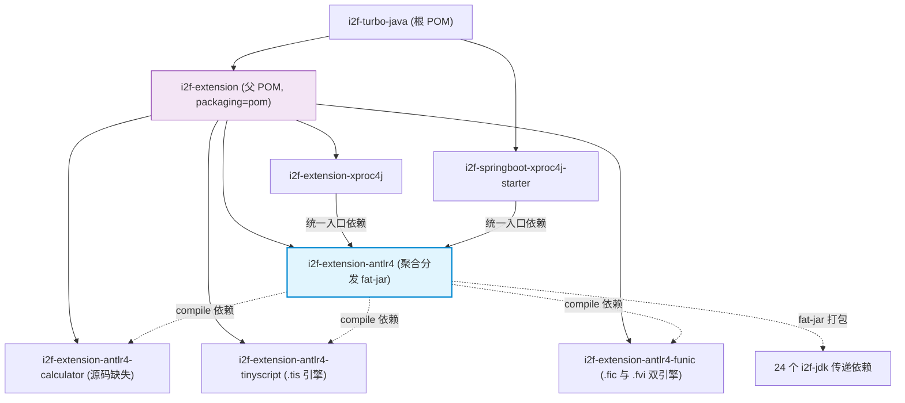

# i2f-extension-antlr4

> **ANTLR4 语言族（calculator + tinyscript + funic）的 Maven 聚合分发模块 / 将三个 ANTLR4 子模块及其 24 个 i2f-jdk 传递依赖打包为单体 fat-jar 的一站式构建入口**（仅 1 个 pom.xml 共 51 行、无 Java 源码、零测试零资源，三个子模块均为 compile 依赖；使用 `maven-assembly-plugin:3.1.0` 以 `jar-with-dependencies` 目标打包，产出 1.07 MB / 733 条目 / 516 类文件的独立 JAR；是 `i2f-extension-xproc4j` 与 `i2f-springboot-xproc4j-starter` 的统一依赖入口）；ANTLR 运行时按 `provided` 约定由最终使用方自备。

## 模块路径

- `i2f-extension/i2f-extension-antlr4/pom.xml`
- 相对于仓库根目录：`i2f-extension/i2f-extension-antlr4`

## 模块依赖

### 内部模块（compile 依赖，共 3 个）

| Maven 坐标 | scope | optional | 说明 |
|-----------|-------|----------|------|
| `i2f.turbo:i2f-extension-antlr4-calculator:1.0-jdk8` | compile | false | 计算器表达式解析与求值（⚠ 模块主源码缺失，当前不贡献任何类文件，详见其模块文档） |
| `i2f.turbo:i2f-extension-antlr4-tinyscript:1.0-jdk8` | compile | false | TinyScript 嵌入式脚本引擎（`.tis`；30 主源文件约 1.33 万行，`TinyScript.script()` 门面 + LRU(4096) 语法树缓存） |
| `i2f.turbo:i2f-extension-antlr4-funic:1.0-jdk8` | compile | false | Funic 脚本（`.fic`）+ Funvi 模板（`.fvi`）双引擎（82 Java 文件约 2.3 万行，安全执行双方案 + IDE 一等支持） |

### 三方依赖

| Maven 坐标 | scope | optional | 说明 |
|-----------|-------|----------|------|
| `org.projectlombok:lombok` | provided | true | 编译期注解处理（版本由根 POM `dependencyManagement` 管理），不打入 fat-jar |

> 注：`org.antlr:antlr4-runtime:4.13.2` **不由本模块直接声明**，而由三个子模块各自以 `provided` + `optional` 声明——`provided` 不参与依赖传递，因此本模块的 fat-jar 不包含 ANTLR 运行时，使用方需自行提供（xproc4j / starter 均显式声明同版本）。

### 构建插件

| 插件坐标 | 版本 | 用途 |
|---------|------|------|
| `org.apache.maven.plugins:maven-assembly-plugin` | 3.1.0 | 将 3 个子模块与 24 个 i2f-jdk 传递依赖打包为单体 fat-jar |

打包配置继承自根 POM（`pom.xml:1825-1872`）的 `pluginManagement`：`jar-with-dependencies` 预定义描述符、`finalName=${project.artifactId}-${project.version}`、`appendAssemblyId=false`（不附加描述符后缀）、`make-assembly` 执行绑定 `package` 阶段 `single` 目标；本模块 POM 仅补充 `archive.addMavenDescriptor=true`。产出 JAR 的 Manifest 实测包含以下条目：

- `Main-Class` 无（已注释，库依赖而非可执行应用）；`Class-Path: . ./resources/`
- `Maven-Group` / `Maven-Artifact` / `Maven-Version` 与 `Build-Time`（`2026-09-12 07:23:53` UTC）、`Created-By: Apache Maven 3.6.3` / `Build-Jdk: 1.8.0_201`
- `Root-Maven-Group` / `Root-Maven-Artifact` / `Root-Maven-Version` 与 `Root-Project-Author` / `Root-Project-Nature`
- `Root-Link-Email` / `Root-Link-Github` / `Root-Link-Gitee`
- `Java-Source-Version: 1.8` / `Java-Target-Version: 1.8`

### fat-jar 实际打包内容（构建产物审计）

对构建产物 `target/i2f-extension-antlr4-1.0-jdk8.jar`（2026-09-12 构建）逐条目审计：733 个条目、516 个 `.class` 文件、1.07 MB。

| 来源 | class 数 | 包路径 |
|------|---------|--------|
| `i2f-extension-antlr4-funic` | 175 | `i2f/extension/antlr4/script/funic/` 137 + `i2f/extension/antlr4/funvi/` 38（Funic + Funvi 双引擎） |
| `i2f-extension-antlr4-tinyscript` | 88 | `i2f/extension/antlr4/script/tiny/`（TinyScript 引擎与生成代码） |
| `i2f-extension-antlr4-calculator` | 0 | 模块自身主源码缺失，不贡献类文件 |
| 24 个 i2f-jdk 传递依赖 | 253 | 含 `i2f/math/calculator/FormulaCalculator.class`（来自 `i2f-math`，非 calculator 子模块产物） |

24 个 `i2f-jdk` 传递依赖（由 jar 内 `META-INF/maven/i2f.turbo/` 描述符实测）：`i2f-reflect`、`i2f-convert`、`i2f-typeof`、`i2f-invokable`、`i2f-mutator`、`i2f-mixins`、`i2f-jvm`、`i2f-bindsql`、`i2f-match`、`i2f-match-std`、`i2f-math`、`i2f-lambda-core`、`i2f-reference`、`i2f-iterator`、`i2f-text`、`i2f-cache-std`、`i2f-lru-map`、`i2f-clock-std`、`i2f-clock-impl`、`i2f-os`、`i2f-io-stream`、`i2f-uid-std`、`i2f-uid-impl`、`i2f-proxy-std`。

- **不包含**：`antlr4-runtime`（实测 jar 内无 `org/antlr` 条目）、lombok 及任何三方库（均为 provided，排除在打包之外）
- jar 内保留 28 个 `META-INF/maven/i2f.turbo/*` 依赖描述符（3 个子模块 + 24 个传递依赖 + 自身）

## 模块设计

### 架构定位

`i2f-extension-antlr4` 是 ANTLR4 语言族的聚合分发模块，承担双重角色：

1. **统一依赖入口** — 下游（xproc4j 及其 Spring Boot Starter）只需声明 `i2f-extension-antlr4` 一个坐标，compile 传递即获得 calculator + tinyscript + funic 三个语言模块及全套 i2f-jdk 反射/转换/调用基建
2. **Fat-jar 独立分发** — `mvn package` 产出脱离 Maven 管理的单体 JAR，内含三个语言引擎的全部类文件，为 `-cp` 直启、lib 目录托管等离线场景提供一站式产物

### 模块关系特殊性（兄弟式聚合）

与常见的「父 POM 聚合 + `<modules>` 嵌套继承」模式不同：三个子模块的 `<parent>` 均为 `i2f-extension`（与本模块平级），四个坐标并列注册在 `i2f-extension/pom.xml` 的 `<modules>`（L24-27）中；本模块通过 `<dependencies>` 引用三个子模块形成聚合——聚合关系是**依赖关系而非父子继承关系**，本模块不参与子模块的属性/版本继承链。

### 项目全局位置



### 设计要点

1. **零源码纯声明** — 仅 `pom.xml` 51 行，无 `src` 目录、无测试、无资源；职责单一：聚合声明 + 打包配置
2. **兄弟式聚合** — 四坐标并列注册于 `i2f-extension` 父 POM，聚合靠 `<dependencies>` 挂接（见上文「模块关系特殊性」）
3. **provided 穿透约定** — 三个子模块的 `antlr4-runtime` 均为 `provided` + `optional`：编译期可见、不传递、不打包；ANTLR 运行时由最终使用方提供，保持 fat-jar 轻量（1.07 MB、零三方 JAR）
4. **继承根 POM 打包规范** — Manifest 注入项目元信息（作者/仓库链接/构建时间/编译版本），无 `Main-Class`；本模块仅覆写 `addMavenDescriptor`
5. **统一版本门面** — 三个子模块依赖不声明版本，由根 POM `dependencyManagement`（L928-947，四坐标并列）经 `${i2f.version}`（`1.0-jdk8`）统一管理
6. **透明传递全部 DSL 能力** — 声明本模块即获得 Funic（`.fic`）与 Funvi（`.fvi`）与 TinyScript（`.tis`）三语言引擎及共享的 24 个 i2f-jdk 基建模块

## 模块目的

- **一站式引入 ANTLR4 语言族** — 宿主方无需逐一罗列 calculator/tinyscript/funic 及其 24 个传递依赖坐标，一个聚合坐标即完成引入
- **Fat-jar 离线分发** — 为不便于使用 Maven 的部署场景（`-cp` 直接启动、lib 目录手动管理）提供包含三个语言引擎全部类文件的独立 JAR
- **语言族版本一致性** — 三个语言模块经同一聚合坐标传递，版本随根 POM 统一管理，避免宿主侧版本漂移

## 模块功能

- **Maven 聚合构建** — `mvn package -pl i2f-extension/i2f-extension-antlr4 -am` 触发三个子模块及全部依赖的构建
- **Fat-jar 产出** — 执行 `mvn package` 后生成 `i2f-extension-antlr4-1.0-jdk8.jar`，内含：
  - 三个语言子模块的全部类文件（263 个，其中 funic+funvi 引擎 175 个、tinyscript 引擎 88 个）
  - 24 个 i2f-jdk 传递依赖的类文件（253 个）
  - 各依赖的 `META-INF/maven/**` 描述符（28 份）
- **依赖传递** — 下游声明本模块即 compile 传递三个子模块，可直接使用 `TinyScript.script(...)` / `Funic.script(...)` / `Funvi.render(...)`
- **Manifest 元信息注入** — 产出 JAR 的 `META-INF/MANIFEST.MF` 包含项目标识、根项目信息、构建时间与编译版本等元数据

## 模块主要使用方法

### 1. 作为统一 Maven 依赖引入（推荐，xproc4j 模式）

```xml
<!-- 一个坐标引入 calculator + tinyscript + funic 全家族 -->
<dependency>
    <groupId>i2f.turbo</groupId>
    <artifactId>i2f-extension-antlr4</artifactId>
    <version>1.0-jdk8</version>
</dependency>

<!-- ANTLR 运行时需显式补充（provided 不参与传递） -->
<dependency>
    <groupId>org.antlr</groupId>
    <artifactId>antlr4-runtime</artifactId>
    <version>4.13.2</version>
    <scope>provided</scope>
    <optional>true</optional>
</dependency>
```

引入后即可直接使用三个引擎（如 `TinyScript.script(script, context)`、`Funic.script(script, context)`、`Funvi.render(template, context)`）。

### 2. 构建 fat-jar

```bash
mvn package -pl i2f-extension/i2f-extension-antlr4 -am
```

产出物位于 `i2f-extension/i2f-extension-antlr4/target/i2f-extension-antlr4-1.0-jdk8.jar`。

### 3. 独立部署（`-cp` 方式）

```bash
java -cp "i2f-extension-antlr4-1.0-jdk8.jar;antlr4-runtime-4.13.2.jar;./resources/" com.example.Application
```

⚠ fat-jar 不包含 ANTLR 运行时，classpath 必须同时提供 `antlr4-runtime-4.13.2.jar`，否则引擎初始化时抛 `NoClassDefFoundError: org/antlr/...`。

### 4. 仅需单一语言模块时

如果宿主只需要一门语言（例如仅 TinyScript 表达式求值），直接声明对应子模块 + `antlr4-runtime` 更轻量；聚合坐标适合多语言共用、需要 fat-jar 分发的场景（这正是 xproc4j 的用法）。

## 模块特性总结

- **全语言族聚合** — calculator + tinyscript + funic 一个坐标获取，附带 24 个 i2f-jdk 基建模块
- **零源码纯 POM** — 51 行声明，职责单一纯净
- **Fat-jar 一键产出** — 516 类文件 / 1.07 MB / 733 条目
- **无三方 JAR** — provided 约定保证产物纯净（antlr4-runtime / lombok 均不入包）
- **兄弟式聚合** — `dependencies` 挂接而非 `modules` 嵌套，不干扰子模块继承链
- **版本统一管理** — 依赖版本由根 POM `dependencyManagement` 统一，零版本声明冗余
- **统一消费入口** — xproc4j 与 springboot starter 的实际引入坐标

## 模块瑕疵或错误

1. **calculator 子模块源码缺失，聚合覆盖不全** — `i2f-extension-antlr4-calculator` 主源码（含文法文件与生成类）缺失，模块自身贡献 0 个类文件；fat-jar 内 `i2f/math/calculator/FormulaCalculator.class` 实为 `i2f-math`（i2f-jdk）传递依赖所带（源码位于 `i2f-jdk/i2f-math/src/main/java/i2f/math/calculator/FormulaCalculator.java`），易被误认为 calculator 子模块产物。聚合 JAR 中「calculator 求值能力」处于空转状态（详见 calculator 模块文档）
2. **fat-jar 非完全自包含（设计约定衍生使用陷阱）** — `antlr4-runtime` 为 provided 不打包，独立 `-cp` 使用若遗漏 `antlr4-runtime-4.13.2.jar` 将在引擎初始化时抛 `NoClassDefFoundError: org/antlr/...`；Maven 依赖方式则需按上文示范自行声明
3. **组合声明会重复引入** — `i2f-extension-all` 同时声明本模块（L43-46）与三个子模块（L49/L53/L57），classpath 将出现同类两份副本（首份生效、无功能影响，属冗余声明）
4. **28 个 `META-INF/maven` 描述符冗余保留** — `jar-with-dependencies` 解包依赖 JAR 时原样保留各依赖的 `META-INF/maven/**`（pom.xml + pom.properties），属打包副作用，无功能影响，仅增大少量体积

## 消费方情况

| 消费方 | 位置 | 方式 | 说明 |
|-------|------|------|------|
| 根 POM `i2f-turbo-java` | `pom.xml:928-932` | dependencyManagement | 版本 `${i2f.version}`（`1.0-jdk8`）统一管理 |
| `i2f-extension` 父 POM | `pom.xml:24-27`（modules 列表） | module 注册 | 本模块与三个子模块四坐标并列注册 |
| `i2f-extension-all` | `i2f-extension/i2f-extension-all/pom.xml:43-46` | compile 依赖 | extension 域全量聚合分发包（另有三个子模块单独声明，见瑕疵 3） |
| `i2f-extension-xproc4j` | `i2f-extension/i2f-extension-xproc4j/pom.xml:81-84` | compile 依赖 | 实际消费方：`lang-eval-tinyscript` / `lang-eval-funic` 求值节点、Procedure Resolver、脚本预加载、元依赖解析等 Java 类经此获得全部语言能力；L86-92 自备 `antlr4-runtime` |
| `i2f-springboot-xproc4j-starter` | `i2f-springboot/i2f-springboot-xproc4j-starter/pom.xml:66-69` | compile 依赖 | Spring Boot 侧统一入口；L71-77 自备 `antlr4-runtime`；`enable-tinyscript` / `enable-funic` 条件装配开关 |
| IDEA 插件（工具级） | `i2f-tools/i2f-jdbc-procedure-idea-plugin` | 无依赖 | `.tis` / `.fic` / `.fvi` 语法支持采用 Grammar-Kit BNF 独立 PSI 实现，不消费本模块产物 |
