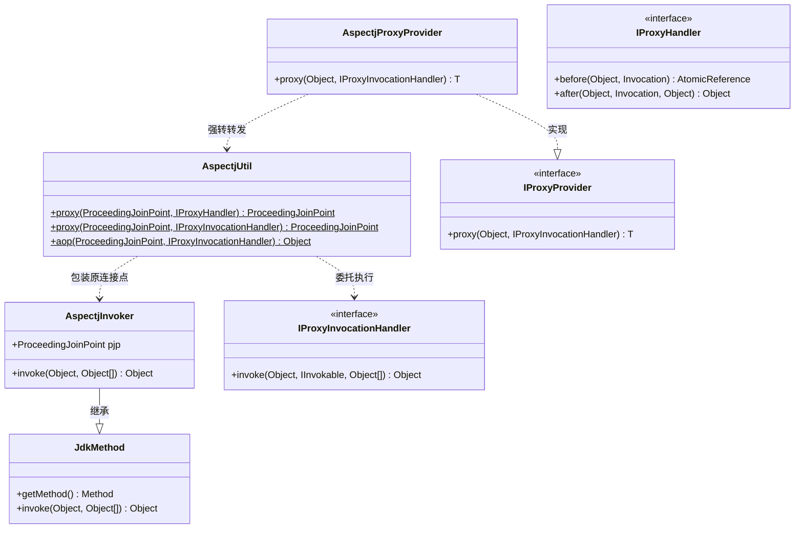
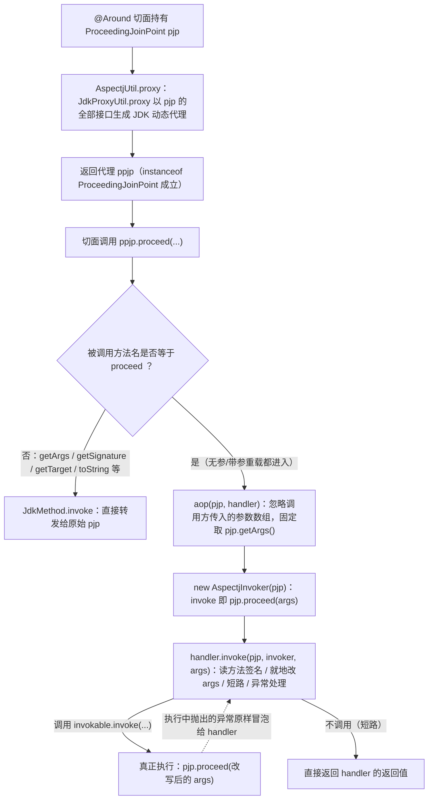

# i2f-extension-aspectj

> **AspectJ 连接点与 i2f-proxy 统一代理模型之间的桥接层**（3 源文件共 93 行：`AspectjUtil` 49 + `AspectjInvoker` 25 + `AspectjProxyProvider` 19，单包族 `i2f.extension.aspectj` + `.impl`，零资源、零 JUnit 测试——`src/test` 仅 2 个 main 演示类共 81 行）：把 `@Around` 切面中的 `ProceedingJoinPoint` 经 `JdkProxyUtil` 包装为 **JDK 动态代理**返回（代理接口自动取自连接点实现类）——对返回代理调用 `proceed*` 不再直接放行，而是把原连接点包装为 `AspectjInvoker`（继承 `JdkMethod`：方法签名取自 `MethodSignature`、`invoke` ≡ `pjp.proceed(args)`），交由统一的 `IProxyInvocationHandler`：handler 可读目标方法签名、**就地改写 `pjp.getArgs()` 数组**（参数修改生效）、短路返回、拦截/替换异常，何时真正放行由 `invokable.invoke(...)` 决定；非 `proceed` 方法（`getArgs`/`getSignature`/`getTarget`/`toString` 等）原样转发给真实连接点。`AspectjProxyProvider` 把同一能力注册为 `IProxyProvider` 家族成员（与 `JdkProxyProvider`/`CglibProxyProvider` 并列）。`aspectjweaver 1.9.6` 以 `provided` 引入（版本硬编码于本模块 pom），编译期织入由 `aspectj-maven-plugin 1.15.0` 工程化（空 sources + `weaveDirectories=classes`，先 javac 后二进制织入以规避 Lombok 冲突）。**11 项运行时验证**（javac 直编本模块与上游 14 个源文件 + JDK 动态代理 mock PJP）：核心链路 7 项全部符合预期；3 处行为瑕疵实锤——`proceed(Object[])` 传入的新参数被静默丢弃、构造器连接点强转 `MethodSignature` 抛 CCE、`IProxyHandler` 重载在目标抛 Exception 时因上游 `ProxyHandlerAdapter` 传参缺陷退化为无信息 NPE。

## 模块路径

- `i2f-extension/i2f-extension-aspectj`

## 模块依赖

> 内部依赖在前、三方在后。依赖使用情况经全模块源码 `import` 全量清点核实。

| 依赖 | Maven 坐标 | scope | optional | 说明 |
| --- | --- | --- | --- | --- |
| i2f-proxy | `i2f.turbo:i2f-proxy` | compile | 否 | **实依赖**：`JdkProxyUtil.proxy`（JDK 动态代理生成）；并传递 `i2f-proxy-std`（`IProxyProvider`/`IProxyHandler`/`IProxyInvocationHandler` 契约与 `ProxyHandlerAdapter`）与 `i2f-invokable`（`IInvokable`/`JdkMethod`/`Invocation`） |
| lombok | `org.projectlombok:lombok` | compile | 否 | 本模块源码未直接 import；经上游 `i2f-invokable` 的 `JdkMethod`/`Invocation` 传递带入（编译期注解） |
| aspectjweaver | `org.aspectj:aspectjweaver:1.9.6` | provided | 否 | **实依赖（编译期）**：`org.aspectj.lang.ProceedingJoinPoint`、`MethodSignature`、`ConstructorSignature` 等类型，并支撑 `aspectj-maven-plugin` 编译期织入；版本在本模块 pom 硬编码（父 POM 未做版本管理）；`provided` 意味着**不传递给下游**，运行期须由使用方类路径提供 aspectj 运行时（见注意事项） |

> 注记 1（传递链与直接 import 的对应）：源码直接 `import` 但未在 pom 显式声明的坐标——`i2f.proxy.JdkProxyUtil`（← `i2f-proxy`）、`i2f.proxy.std.IProxyProvider`/`IProxyHandler`/`IProxyInvocationHandler`（← `i2f-proxy-std`）、`i2f.invokable.IInvokable` 与 `i2f.invokable.method.impl.jdk.JdkMethod`（← `i2f-invokable`）——均由 `i2f-proxy` 一个 compile 坐标传递带入。
>
> 注记 2（编译期织入插件与 Lombok 共存）：`aspectj-maven-plugin:1.15.0`（`org.codehaus.mojo`，直接声明于本模块 `build/plugins`）配置 `forceAjcCompile=true` + 空 `<sources/>` + `weaveDirectories=${project.build.directory}/classes`——即对 javac（含 Lombok 处理）产出的 classes 目录做**二进制织入**，绕开 ajc 与 Lombok 注解处理器的冲突；`weaveDependencies` 默认空，pom 注释明示「要织入第三方依赖必须显式列入」（模板中被注释的 ibatis 示例）。pom L45-61 的长注释还阐明了本质区别：本模块面向**编译期真织入**（ajc 改写字节码，不依赖运行期、切面类型支持更全），与 Spring Boot 常说的「AspectJ 风格」实为 **Spring AOP 运行期代理**（只对 ApplicationContext 中的 bean 建代理，未注册为 bean 的 `@Aspect` 不生效）不是一回事。

### 消费方与聚合

| 消费模块 | 关系 | 说明 |
| --- | --- | --- |
| `i2f-extension/i2f-extension-all` | 聚合引入 | 汇总进扩展全家桶（pom 第 47-50 行） |
| （无其他消费方） | — | 全仓（除自带演示类外）零源码 `import`；作为 `IProxyProvider` 家族成员目前仅被聚合模块收录 |

- 聚合：`i2f-extension/pom.xml` 第 25 行模块声明；根 POM 第 933-937 行 `dependencyManagement`。

## 模块设计

### 1. 类与契约



- **入口双重重载**：`AspectjUtil.proxy(pjp, IProxyInvocationHandler)` 为核心（`AspectjUtil.java:26-36`）；`proxy(pjp, IProxyHandler)`（L22-24）经 `IProxyInvocationHandler.of` 适配到 `ProxyHandlerAdapter` 五阶段编排。
- **`AspectjInvoker`** 是「连接点 → `IInvokable`」的桥：`invoke(ivkObj, args)` 完全忽略 `ivkObj`，直接 `pjp.proceed(args)`（`AspectjInvoker.java:21-23`）；方法签名在构造时从 `((MethodSignature) pjp.getSignature()).getMethod()` 取得（L16）。
- **`AspectjProxyProvider`** 是 `IProxyProvider` 家族成员：`proxy(obj, handler)` 把 `obj` 强转 `ProceedingJoinPoint` 后转发 `AspectjUtil.proxy`（`AspectjProxyProvider.java:16-18`）；注意该 provider 只对「目标为 PJP」的场景成立（非 PJP 入参直接 CCE）。
- 所有类集中单包族，无 SPI 注册、无自动装配。

### 2. 核心拦截链路（两层代理）



- **两层代理语义**：外层是 JDK 动态代理（拦截对 PJP 的方法调用），内层是 `AspectjInvoker`（把「放行」动作标准化为 `IInvokable.invoke`）——切面对 `ppjp.proceed()` 的调用被重定向为「一次携带完整上下文的编程式拦截」。
- **参数共享机制**：`aop()` 传入 handler 的 `args` 就是 `pjp.getArgs()` 返回的数组引用，`args[i]=...` 就地修改即改写目标实参（`AspectjUtil.java:43-47`）；运行时验证 T1 证实改写生效且修改落在连接点参数数组上。
- **非 proceed 方法透传**：`AspectjUtil.java:30-33` 中「方法名等于 proceed → 走 aop，否则 `invokable.invoke`」——`getArgs`/`getTarget`/`toString` 等实测全部转发到原始 pjp（验证 T3）。

### 3. 与 AspectJ @Around 的组合模式

演示类 `TestAspect`（`src/test`，L38-58）给出的标准编排：`@Around` 内先 `AspectjUtil.proxy(pjp, handler)` 包装，再对返回代理调 `proceed()`——即包装不改变「proceed 触发目标执行」的大框架，只在中间插入一个可编程 handler：

```java
@Around("pointcut()")
public Object around(ProceedingJoinPoint pjp) throws Throwable {
    ProceedingJoinPoint ppjp = AspectjUtil.proxy(pjp, handler);   // ① 包装
    System.out.println("start ...");
    Object ret = ppjp.proceed();                                  // ② 触发 handler，而非直接放行
    System.out.println("end ...");
    return ret;
}
```

### 4. 包结构

| 包 | 类 | 职责 |
| --- | --- | --- |
| `i2f.extension.aspectj` | `AspectjUtil` | 包装入口双重重载 + `aop` 执行核（连接点 → handler 委托） |
| 同上 | `AspectjProxyProvider` | `IProxyProvider` 契约适配（PJP → 代理） |
| `i2f.extension.aspectj.impl` | `AspectjInvoker` | 连接点 → `IInvokable` 的执行桥（继承 `JdkMethod`） |

## 模块目的

为 AspectJ 切面提供**可编程的 `proceed`**：原生 `@Around` 中 `pjp.proceed()` 是一放到底的不透明调用，若要根据运行时信息改写参数、短路返回、定制异常语义，只能手写参数数组操作等散装代码；本模块把连接点转换为 i2f-proxy 的统一代理模型（`IProxyInvocationHandler`），使「切面拦截」与「JDK/CGLIB/Javassist 代理拦截」共享同一套 handler 语义与现成 handler 生态（如 `i2f-proxy-handlers` 的重试/锁/校验）。

## 模块功能

- **连接点包装**（`AspectjUtil.proxy`）：`ProceedingJoinPoint` 进、JDK 动态代理版 PJP 出；`proceed*` 被重定向为 handler 驱动。
- **执行桥**（`AspectjInvoker`）：把连接点抽象为 `IInvokable`——方法签名可读（`getMethod()`），`invoke` 即 `pjp.proceed(args)`。
- **provider 适配**（`AspectjProxyProvider`）：以 `IProxyProvider` 契约对外提供，可与统一代理工厂体系并联。
- **统一 handler 体验**：参数改写（就地改数组）、短路、异常拦截/透传，全部走标准 `IProxyInvocationHandler` 三参 `invoke`。
- **编译期织入工程化**：`aspectj-maven-plugin` + 空 sources + `weaveDirectories` 的二进制织入配置（与 Lombok 共存），`weaveDependencies` 预留第三方织入入口。

## 模块主要使用方法

### 1. 在 @Around 中包装连接点（核心用法）

```java
@Aspect
public class MyAspect {
    @Pointcut("execution(* com.example.service.*.*(..))")
    public void pointcut() {
    }

    @Around("pointcut()")
    public Object around(ProceedingJoinPoint pjp) throws Throwable {
        // 包装为「handler 驱动」的连接点代理
        ProceedingJoinPoint ppjp = AspectjUtil.proxy(pjp, new IProxyInvocationHandler() {
            @Override
            public Object invoke(Object ivkObj, IInvokable invokable, Object... args) throws Throwable {
                Method method = ((JdkMethod) invokable).getMethod();  // 目标方法签名
                System.out.println("invoke: " + method.getName());
                if ("say".equals(method.getName())) {
                    args[0] = "modify:" + args[0];                    // 就地改写实参（共享数组，生效）
                }
                return invokable.invoke(ivkObj, args);                // 放行：执行 pjp.proceed(args)
            }
        });
        System.out.println("start ...");
        Object ret = ppjp.proceed();                                  // 先进入 handler，由 handler 决定放行
        System.out.println("end ...");
        return ret;
    }
}
```

### 2. 以 IProxyProvider 身份使用

```java
IProxyProvider provider = new AspectjProxyProvider();
ProceedingJoinPoint ppjp = provider.proxy(pjp, handler);  // obj 必须是 ProceedingJoinPoint，否则 CCE
Object ret = ppjp.proceed();
```

### 3. 注意事项

- **运行期须自备 aspectj 运行时**：`aspectjweaver` 是 `provided`——若目标应用只把本模块当作普通库使用（非 aspectj 编译织入部署），类路径需显式加入 aspectjrt/weaver，否则 `org.aspectj.lang.*` 处 `NoClassDefFoundError`。
- **参数改写用「就地改数组」而非 `proceed(newArgs)`**：handler 收到的 `args` 即 `pjp.getArgs()` 数组引用，直接改元素即已生效；调用 `ppjp.proceed(newArgs)` 期望替换参数**不成立**（新参数被静默丢弃，见瑕疵第 1 条）。
- **短路 = 不调 `invokable.invoke`**：handler 直接返回即阻断目标执行（验证 T4）。
- **异常处理**：目标在 `invokable.invoke` 内抛出的异常**原样**到达 handler，可捕获与改写（验证 T7）；但改用 `IProxyHandler` 重载且目标抛 `Exception` 时，会因上游 `ProxyHandlerAdapter` 传参缺陷变成无信息 NPE（见瑕疵第 3 条）——建议优先使用 `IProxyInvocationHandler` 版本，或在 `invokable.invoke` 外自包 try-catch。
- **仅方法执行连接点可用**：`@Around` 拦截构造器（`ConstructorSignature`）时，包装后调 `proceed` 抛 CCE（见瑕疵第 2 条）。

## 模块特性总结

- **约 93 行完成 AspectJ ↔ i2f-proxy 语义互通**：三个类各司其职（入口/桥/provider）
- **两层代理嵌套**：JDK 动态代理包装连接点，`proceed` 被重定向为 handler 驱动的编程式执行点
- **参数可改写、可短路、异常可拦截**：复用统一 `IProxyInvocationHandler` 语义
- **现成 handler 生态复用**：可挂接 i2f-proxy-handlers 的重试/锁/校验等 handler（经 `IProxyHandler` 桥接，但注意瑕疵第 3 条）
- **provider 家族成员**：与 JDK/CGLIB/Javassist 等动态代理 provider 并列
- **编译期真织入工程化**：`aspectj-maven-plugin` + Lombok 共存方案，`weaveDependencies` 预留第三方织入
- **零 JUnit 测试**：`src/test` 为 main 演示类，且不被编译期织入（见瑕疵第 5 条）

## 模块瑕疵或错误

1. **`proceed(Object[])` 的新参数被静默丢弃（运行时验证 T2）**：拦截判定只看方法名 `"proceed"`（`AspectjUtil.java:30`），无参与带参重载都被路由进 `aop()`，而 `aop()` 固定取 `pjp.getArgs()`（L43）——通过代理调用 `ppjp.proceed(new Object[]{...})` 时，传入的新参数数组被**完全忽略**（实测 handler 与最终执行看到的仍是连接点原参数）。原生 AspectJ 的 `proceed(Object[])` 语义是用传入数组执行，此处两者不一致；无参 `proceed()` 不受影响。
2. **构造器连接点抛 CCE（运行时验证 T8）**：`aop()` 首行与 `AspectjInvoker` 构造均把 `pjp.getSignature()` 强转 `MethodSignature`（`AspectjUtil.java:39`、`AspectjInvoker.java:16`）——`@Around` 拦截构造器执行时签名是 `ConstructorSignature`，实测抛 `ClassCastException: ... cannot be cast to MethodSignature`。本模块仅适用于方法执行连接点。
3. **`IProxyHandler` 重载的异常路径退化为无信息 NPE（运行时验证 T10/T11，上游 `ProxyHandlerAdapter` 引起）**：`proxy(pjp, IProxyHandler)`（`AspectjUtil.java:22-24`）经 `IProxyInvocationHandler.of` 适配到 `ProxyHandlerAdapter`——其 `except(context, invocation, ex)` 传参笔误（第三参恒为尚未赋值的 `null`，原始异常 `e` 被丢弃），默认实现返回值又直接 `throw ex`——目标方法抛 `Exception` 实测变成 `NullPointerException`（`msg`/`cause` 均为 null，**原始异常信息全部丢失**）；目标抛 `Error` 则不被其 `catch (Exception)` 拦截、原样传播（验证 T11）。正常路径（验证 T9）无碍；`AspectjProxyProvider` 继承的 `proxy(obj, IProxyHandler)` default 桥接同受影响。
4. **`aop()` 存在死代码（静态核实）**：`MethodSignature ms`、`Method method`、`Class clazz`、`Parameter[] params`、`Object target` 五行（`AspectjUtil.java:39-44`）的计算结果除 `args` 外未参与任何逻辑——`clazz`/`params`/`target` 赋值后从未使用；`ms`/`method` 仅为推算这三个死变量而取值。其中 `(MethodSignature)` 强转正是瑕疵第 2 条 CCE 的来源，`target`/`params` 取值纯属开销。
5. **演示测试类不会被编译期织入（构建事实）**：`aspectj-maven-plugin` 只配置了 `compile` goal（未配置 `test-compile`），`weaveDirectories` 仅指向 `${project.build.directory}/classes`——`src/test` 下的 `TestAspect`（`@Aspect` + main）不会被 ajc 织入，其 main 直接运行也不会触发切面；模块无 JUnit 依赖，「零测试」实为「演示类不可独立验证」。
6. **`AspectjProxyProvider` 缺单例常量（风格不一致）**：同族 `JdkProxyProvider.INSTANCE`（i2f-proxy）提供静态单例，本类无 `INSTANCE`，使用方须自行 new。
7. **`AspectjUtil` 工具类未 final、无私有构造（风格）**：可被无意义实例化（`new AspectjUtil()`），对比常见工具类惯例。
8. **`proxy(pjp, null)` 无前置校验（防御性）**：handler 为 null 时 `IProxyInvocationHandler.of(null)` 会构造出坏适配器，NPE 延迟到首次 `proceed` 才抛出，定位成本高。

## 附：运行时验证摘要

验证方式：javac 直编本模块 3 个源文件 + 上游 14 个源文件（`i2f-proxy`/`i2f-proxy-std`/`i2f-invokable`，classpath 含 aspectjweaver-1.9.6 + lombok），JDK 动态代理 mock `ProceedingJoinPoint`/`MethodSignature`/`ConstructorSignature`，共 11 项断言：

| 编号 | 断言 | 结果 |
| --- | --- | --- |
| T1 | `proceed()` 劫持：handler 收到 `AspectjInvoker`（method=say）、就地改 args 生效、`ivkObj` 为原始 pjp | 通过 |
| T2 | `proceed(new Object[]{"fresh"})` 的新参数是否被采用 | **未采用（瑕疵 1 实锤）** |
| T3 | `getArgs`/`getTarget`/`toString` 转发原始 pjp、`instanceof ProceedingJoinPoint` 成立 | 通过 |
| T4 | handler 不调 `invokable.invoke` 时短路（目标不执行） | 通过 |
| T5 | handler 抛出的异常原样透传调用方 | 通过 |
| T6 | `AspectjProxyProvider` 包装与 `AspectjUtil.proxy` 等价 | 通过 |
| T7 | 目标在 `invokable.invoke` 内抛异常时 handler 原样可见（`IllegalStateException: TARGET-BOOM`） | 通过 |
| T8 | `ConstructorSignature` 连接点包装后 `proceed` | **CCE（瑕疵 2 实锤）** |
| T9 | `IProxyHandler` 重载正常路径 | 通过 |
| T10 | `IProxyHandler` 重载 + 目标抛 RuntimeException | **无信息 NPE（瑕疵 3 实锤）** |
| T11 | `IProxyHandler` 重载 + 目标抛 Error | Error 原样传播（符合上游 `catch (Exception)` 行为） |
