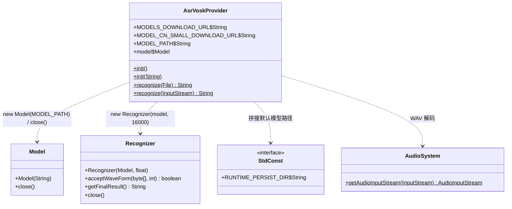
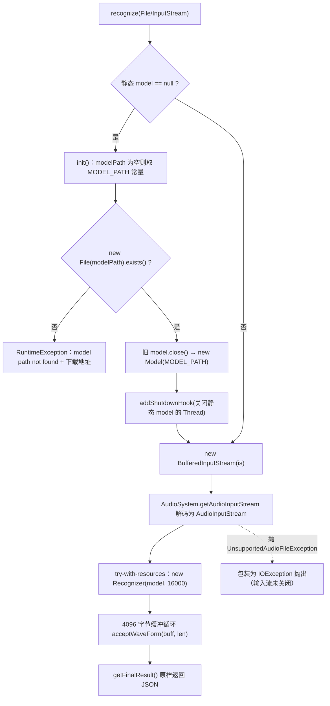

# i2f-extension-asr-vosk

> **基于 Vosk 的本地离线语音识别门面**（1 个源文件共 75 行：`AsrVoskProvider` 全静态 API，单包 `i2f.extension.asr.vosk`，零资源、零 JUnit——`src/test` 仅 1 个 main 演示类 19 行）：把「模型下载 → 释放到 `./runtime/persist/vosk/vosk-model-small-cn-0.22`（`StdConst.RUNTIME_PERSIST_DIR` 拼接）→ 初始化 → WAV 解码 → 分帧识别 → 取最终结果」整条链路收敛为 4 个静态方法——`init()`/`init(String)` 惰性/显式初始化静态单例 `Model`（并在 JVM 退出时经关机钩子 `close()`），`recognize(File)`/`recognize(InputStream)` 用 `javax.sound` 解码音频、`try-with-resources` 构造 `Recognizer(model, 16000)` 后以 4096 字节缓冲循环 `acceptWaveForm`，最后 `getFinalResult()` **原样返回 JSON 字符串**（如 `{"text" : "..."}`，text 提取由调用方自理）；常量导出模型下载地址与中文小模型直链。`vosk 0.3.32`（`com.alphacephei`，JNA 封装 libvosk 原生库）与 `jna 5.7.0` 均以 **`provided`** 引入且**版本仅在本模块 pom 硬编码**（根 POM 未做版本管理），运行期须由使用方提供 jar 与原生库。**30 项运行时验证全部通过**（同签名桩替换 `org.vosk` + javac 直编；另以真实 vosk-0.3.32 + jna-5.7.0 编译验证 API 兼容）：核心链路（显式/惰性初始化、成功识别、流关闭、自动重建判定）符合预期；**4 处行为缺陷实锤**——`init(String)` 的自定义模型路径被**完全忽略**（恒加载默认路径常量）、每次成功 `init` 泄漏一个关机钩子且退出时对同一模型**重复 `close()`**、初始化失败后静态字段**遗留已关闭模型**（后续识别静默使用之）、识别失败路径**不关闭输入流**（文件句柄泄漏，Windows 无法删除）。

## 模块路径

- `i2f-extension/i2f-extension-asr-vosk`

## 模块依赖

> 内部依赖在前、三方在后。依赖使用情况经全模块源码 `import` 全量清点核实。

| 依赖 | Maven 坐标 | scope | optional | 说明 |
| --- | --- | --- | --- | --- |
| i2f-std-const | `i2f.turbo:i2f-std-const` | compile | 否 | **实依赖**：`StdConst.RUNTIME_PERSIST_DIR`（= `"runtime/persist"`）拼接默认模型路径 `./runtime/persist/vosk/vosk-model-small-cn-0.22`；版本由根 POM L769-773 统一管理 |
| i2f-io-file | `i2f.turbo:i2f-io-file` | compile | 否 | **声明未使用**：全模块唯一源码零 `import`（推测为文件工具预留）；版本由根 POM L486 统一管理；并传递带入 i2f-text/i2f-io-stream/i2f-array/i2f-resources |
| lombok | `org.projectlombok:lombok` | compile | 否 | 声明未直接使用（源码无任何 Lombok 注解），承袭模块模板惯例 |
| jna | `net.java.dev.jna:jna:5.7.0` | provided | 否 | **实依赖（运行期）**：vosk 的底层 FFI——真实 `org.vosk.Model`/`Recognizer` 均 `extends com.sun.jna.PointerType`；**版本仅在本模块 pom 硬编码** |
| vosk | `com.alphacephei:vosk:0.3.32` | provided | 否 | **实依赖（编译期 + 运行期）**：`org.vosk.Model`/`Recognizer` 官方 Java API；`provided` 意味着**不传递给下游**，运行期须由使用方显式提供 jar **与 libvosk 原生库**；版本仅在本模块 pom 硬编码 |

> 注记 1（provided 三件套）：真实运行需要同时具备 ① `vosk-0.3.32.jar`（Java API）② `jna`（FFI 底座，vosk 内部加载 `libvosk`）③ **`libvosk` 原生动态库**（Windows 为 `libvosk.dll` 或平台对应文件，由 JNA 从库路径/系统路径加载）。三者任一缺失即 `NoClassDefFoundError`/`UnsatisfiedLinkError`——`provided` 注解只解决 pom 传递，不解决交付问题。
>
> 注记 2（版本管理差异）：与本仓内部依赖（由根 POM `dependencyManagement` 统一 `1.0-jdk8`）不同，`jna`/`vosk` 仅在本模块 pom 直接硬编码版本；且未标记 `optional`（对比同类 AI 扩展模块的 `provided + optional` 组合）——使用方拉取本模块时 pom 中可见这两个 provided 依赖，但不会被传递。

### 消费方与聚合

| 消费模块 | 关系 | 说明 |
| --- | --- | --- |
| `i2f-extension/i2f-extension-all` | 聚合引入 | 汇总进扩展全家桶（pom 第 51-54 行） |
| （无其他消费方） | — | 全仓（除自带演示类外）零源码 `import`；无任何 test-scope 引用 |

- 聚合：`i2f-extension/pom.xml` 第 26 行模块声明；根 POM 第 938-942 行 `dependencyManagement`。

## 模块设计

### 1. 类与协作



- **单类全静态门面**：无接口、无实例状态、无 SPI——静态字段 `model` 即全局唯一的模型句柄。
- **常量三件**：`MODELS_DOWNLOAD_URL`（模型总览页）、`MODEL_CN_SMALL_DOWNLOAD_URL`（中文小模型 0.22 直链）、`MODEL_PATH`（默认释放路径 `./runtime/persist/vosk/vosk-model-small-cn-0.22`）。
- **外观依赖**：`org.vosk.Model`/`Recognizer`（真实类型在运行期由使用方提供）；音频解码完全委托 `javax.sound.sampled.AudioSystem`。

### 2. 两条运行链路（初始化 / 识别）



- **惰性初始化**：`recognize` 仅在 `model == null` 时自动 `init()`；显式 `init(String modelPath)` 供调用方预加载。
- **模型替换语义**：再次 `init` 会先 `close()` 旧模型再加载新模型；加载失败时字段**不会**被更新（见瑕疵 3）。
- **关机钩子**：每次成功 `init` 追加一个 JVM 退出钩子关闭模型（钩子捕获的是**静态字段**而非常量实例，见瑕疵 2）。
- **识别管线**：解码 → 16kHz `Recognizer` → 分块喂波 → 一次性取最终结果；`acceptWaveForm` 的布尔返回值（端点检测标志）被丢弃，无流式中间结果回调。

### 3. 包结构

| 包 | 类 | 职责 |
| --- | --- | --- |
| `i2f.extension.asr.vosk` | `AsrVoskProvider` | 模型生命周期管理（init/close/钩子）+ 识别入口（File/InputStream） |
| `i2f.extension.asr.vosk.test`（src/test） | `TestAsrVosk` | main 演示：`recognize(new File("./tmp.wav"))` 并打印结果 |

## 模块目的

让 JVM 应用以**最小成本获得本地离线语音识别能力**：选定 Vosk 生态的中文小模型（CPU 即可推理、无需联网），并把「模型获取地址 → 释放到仓库统一的 runtime 持久化目录 → 初始化静态句柄 → 音频解码 → 分帧识别 → 关机自动回收」的全部仪式收敛为 `init`/`recognize` 四个静态方法，使调用方一行代码即可完成一次 WAV 转写。

## 模块功能

- **模型初始化**：`init()`（默认路径）/ `init(String modelPath)`（名义上支持自定义路径，实测被忽略）；含路径存在性校验与失败提示（附带模型下载地址）。
- **语音识别**：`recognize(File)` / `recognize(InputStream)`——自动惰性初始化、`javax.sound` 解码、16kHz 识别、返回原始 JSON。
- **生命周期管理**：静态单例模型替换时先关闭旧模型，并注册 JVM 关机钩子兜底释放。
- **常量出口**：模型总览页与中文小模型直链，便于文档/引导页引用。

## 模块主要使用方法

### 1. 准备模型

```text
# 下载并解压到默认释放目录（与仓库 runtime 约定对齐）
https://alphacephei.com/vosk/models/vosk-model-small-cn-0.22.zip
解压后确保存在： ./runtime/persist/vosk/vosk-model-small-cn-0.22/（内含 am/、conf/、graph/ 等模型文件）
```

### 2. 最简使用（自动初始化）

```java
// 16kHz / 16bit / 单声道 PCM WAV
String json = AsrVoskProvider.recognize(new File("./tmp.wav"));
System.out.println(json);   // 原始 JSON：{"text" : "识别文本"}
```

### 3. 显式初始化 + 流式输入

```java
AsrVoskProvider.init();                       // 预加载默认模型（提前承担加载耗时）
try (InputStream is = new FileInputStream("./tmp.wav")) {
    String json = AsrVoskProvider.recognize(is);   // 中文文本在 {"text": ...} 内，自行解析
}
```

### 4. 注意事项

- **音频格式固定为 16kHz**：`new Recognizer(model, 16000)` 硬编码、无重采样与格式校验——44.1kHz 等音频直接送入不符合 vosk 预期。
- **运行期自备三件套**：`vosk`/`jna` 为 `provided`——目标应用需提供两个 jar 与 libvosk 原生库（见依赖注记 1）。
- **`init(String)` 自定义路径无效**：实测恒加载默认路径常量；自定义目录只参与「存在性校验」（见瑕疵 1），需要换模型目录时应改默认路径。
- **识别失败不关闭输入流**：非音频/损坏文件抛出 `IOException` 时传入流仍未关闭（瑕疵 4）——`recognize(File)` 会泄漏文件句柄，自管流时请在外部 try-catch 关闭。
- **不要频繁 `init`**：每次成功初始化都会注册一个关机钩子且永不注销（瑕疵 2）。
- **模型路径相对工作目录**：`./runtime/persist/...` 以进程 CWD 解析，部署时注意启动目录。
- **返回值是原始 JSON**：未提取 `text` 字段，可配合 `i2f-fastjson` 等解析。

## 模块特性总结

- **单类全静态门面**：75 行完成「下载指引 → 初始化 → 解码 → 识别」全链路收敛
- **本地离线识别**：Vosk 中文小模型 CPU 推理，无网络依赖（模型一次下载）
- **惰性初始化 + 退出兜底**：`recognize` 自愈式初始化；关机钩子保证 JVM 退出时释放原生句柄
- **双形态入参**：`File` 与 `InputStream` 两个识别重载，流式输入经 `BufferedInputStream` + 4096 缓冲
- **runtime 目录整合**：默认模型路径与仓库 `StdConst.RUNTIME_PERSIST_DIR`（`runtime/persist`）约定对齐
- **provided 依赖策略**：vosk/jna 交由使用方提供（可选择与其应用匹配的版本与原生库）
- **零测试可跑性**：`src/test` 为 main 演示类且硬编码 `./tmp.wav`，无 JUnit

## 模块瑕疵或错误

1. **`init(String modelPath)` 的自定义路径被完全忽略（运行时验证 T2/T8）**：方法校验的是入参 `modelPath` 的存在性，但第 39 行实际执行 `new Model(MODEL_PATH)`——**恒加载默认路径常量**，入参只用于「目录是否存在」的预检。实测中以自定义合法路径 + 默认缺失调用时，桩模型收到的仍是默认路径并因缺失而抛 `IOException`；自定义目录只起到了「让预检通过」的反作用。
2. **关机钩子泄漏 + 重复关闭（运行时验证 T3c/T5b/T10）**：每次成功 `init` 都 `addShutdownHook` 一个捕获**静态字段** `model` 的线程且从不注销——N 次初始化 → JVM 退出时同一模型被 `close()` N 次。实测 3 次成功 init 后退出日志出现 3 行 `close model#3`（其中 2 行 `alreadyClosed=true`，perModel = {1=1, 2=2, 3=3}）；对 native 句柄重复释放属高危操作。
3. **初始化失败遗留已关闭模型（运行时验证 T8/T8b/T8c/T9）**：`init` 先 `model.close()` 旧实例、再 `new Model(...)`——若新模型构造失败（如瑕疵 1 场景、默认模型目录损坏），字段**仍指向已关闭的旧模型**：此后 `recognize` 因 `model != null` 不再重建，静默以已关闭模型创建 `Recognizer`（实测 `modelClosedAtCreation=true`），原生层面属未定义行为/崩溃风险。
4. **识别失败路径不关闭输入流（运行时验证 T6b/T7b）**：`AudioSystem.getAudioInputStream` 抛出时 `BufferedInputStream` 与底层流均未进入 try-with-resources 管理，实测失败后传入流 `closed=false`；`recognize(File)` 的文件句柄实测在 Windows 上无法删除（泄漏实锤）。成功路径可正常关闭（T4e/T7d）。
5. **硬编码 16000Hz、无格式校验（运行时验证 T4b）**：`Recognizer(model, 16000)` 与输入音频实际采样率无关，也未读取 `ais.getFormat()` 做校验——非 16kHz 音频会被错误送入，识别结果失真或原生报错。
6. **`acceptWaveForm` 返回值被丢弃（静态核实）**：Vosk 该布尔值用于端点检测（句子结束/静音），丢弃后失去「提前结束识别」的能力，只能整段读完后取最终结果。
7. **静态状态无并发保护（静态核实）**：`model` 字段与 `init`/`recognize` 的 check-then-act 均无同步——并发识别与初始化存在竞态（一个线程关闭模型时另一线程可能正在使用/构造 `Recognizer`）。
8. **空白路径未归一化 + 错误消息不含路径（运行时验证 T11/T1/T12）**：路径仅判 `null`/`isEmpty()`，`" "` 会进入文件检查并以「model path not found」失败；异常消息只含下载地址不含**实际检查的路径**，多模型场景定位困难。
9. **POM 声明未使用依赖（静态核实）**：`i2f-io-file` 声明零 `import`、`lombok` 亦无直接使用——依赖清单存在冗余。
10. **演示类不可独立运行（构建/资源事实）**：`TestAsrVosk` 硬编码 `./tmp.wav`（仓库内不存在），运行还依赖模型与原生库；模块无 JUnit，测试能力为零。

## 附：运行时验证摘要

验证方式：以**同签名桩类**替换 `org.vosk.Model`/`Recognizer`（精确镜像 `Model(String) throws IOException`、`Recognizer(Model, float) throws IOException`、`acceptWaveForm(byte[], int)`、`getFinalResult()`、`close()`），javac 直编「本模块 1 个源文件 + `StdConst` + 桩 + 验证 mains」，桩记录模型构造路径/关闭事件（落盘 `close.log`，JVM 退出后由 `DumpLog` 读回）；另以 Phase A 用**真实** `vosk-0.3.32 + jna-5.7.0` 编译本模块验证 API 兼容。共 12 组 30 项断言，**全部通过**：

| 编号 | 断言内容 | 结果 |
| --- | --- | --- |
| T1 | `init()` 默认模型缺失 → RTE（消息含 `model path not found` + 下载 URL、cause 为 IOException） | 通过 |
| T2 | `init(自定义合法路径)` + 默认缺失 → 抛错，且桩仅收到**默认**路径（**缺陷 1 实锤：自定义路径被忽略**） | 通过 |
| T3 | `init()` 成功：model#1、路径=默认字面量、关机钩子 +1（缺陷 2 种子） | 通过 |
| T4 | `recognize(InputStream)` 成功链：JSON 原样返回、采样率 16000f、基于当前模型实例、32000 字节 PCM 全量送入、**成功路径输入流已关闭**、不重复 init | 通过 |
| T5 | `model==null` 时 `recognize` 自动 init（model#2、钩子 +1、识别正常） | 通过 |
| T6 | 非音频流 → `IOException(cause=UnsupportedAudioFileException)`；**失败路径输入流未关闭（缺陷 4 实锤）** | 通过 |
| T7 | `recognize(File)`：坏文件 → IOException（实测 `EOFException`，文件过短先于格式判定）；失败后文件删除失败（句柄泄漏）；好文件 → 成功且可删除 | 通过 |
| T8 | 合法自定义 + 默认缺失：文件检查通过后 Model 构造失败 → 字段仍指向**已被关闭**的旧模型（**缺陷 3 实锤**）；失败不增加钩子 | 通过 |
| T9 | 后续 `recognize` 静默使用已关闭模型（桩记录 `modelClosedAtCreation=true`，缺陷 3 影响）；恢复 init → model#3 | 通过 |
| T10 | 3 次成功 init → 关机钩子 +3（**缺陷 2 实锤**）；退出日志：model#3 被关闭 3 次（2 次 `alreadyClosed=true`） | 通过 |
| T11 | `init(" ")` 空白路径 → 「model path not found」（仅判 null/empty，缺陷 8） | 通过 |
| T12 | `init(不存在路径)` → RTE「model path not found」（错误消息不含路径） | 通过 |

验证程序与产物留档：`runtime/tmp/asr-vosk-verify/`（`stub-src/` 桩类、`src/` 验证 mains、`compile.bat` 双阶段编译、`run.bat`、`sandbox/` 运行沙箱、`close.log` 生命周期日志）。
