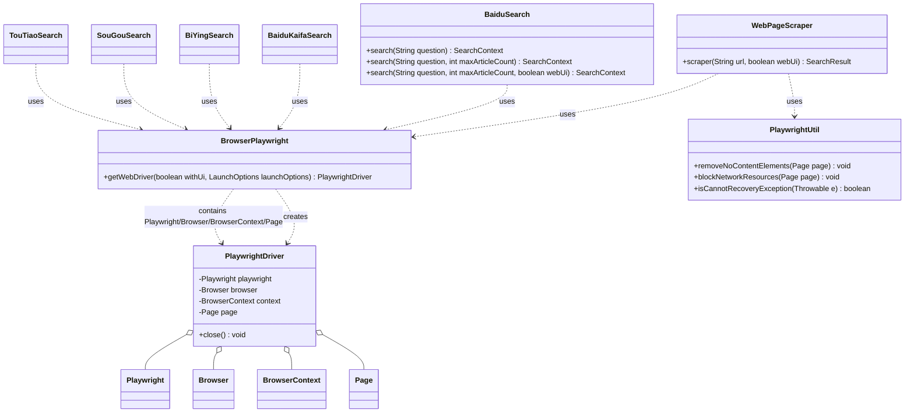
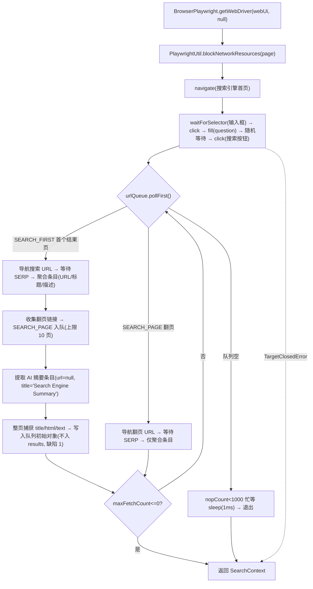

# i2f-extension-browser-playwright

> **基于 Microsoft Playwright 的浏览器自动化搜索抓取扩展**（9 源文件 1677 行、包族 `i2f.extension.browser.playwright` / `.context` / `.search` / `.search.utils`，零资源、无 JUnit 测试）：以 `i2f-browser-std` 契约（`SearchContext` / `SearchResult` / `SearchType` / `SearchBlockConsts` / `SearchUtil`）为上游，把「Playwright 驱动装配 → 反检测启动 → 首页模拟人工输入点击 → SERP 结果聚合 → 翻页 / AI 摘要采集 → 整页正文捕获」全流程沉淀为静态 API——`BrowserPlaywright.getWebDriver(withUi, launchOptions)` 工厂（默认 4 项反自动化 Chromium 参数 + `chromiumSandbox=false` + 60s/30s 超时）、`PlaywrightDriver` 四层持有者（page→context→browser→playwright 级联 close 并置 null，实现 `Closeable` 支持 try-with-resources）、`PlaywrightUtil` 三工具（`blockNetworkResources` 双层判定拦截图片 / 音视频 / 字体省带宽、`removeNoContentElements` 三段 JS 清洗页面、`isCannotRecoveryException` 识别 `TargetClosedError`）、`WebPageScraper.scraper(url, webUi)` 通用网页正文抓取、五大搜索引擎同构实现 `BaiduSearch` / `BaiduKaifaSearch` / `BiYingSearch` / `SouGouSearch` / `TouTiaoSearch`（三重重载 `search(question[, maxArticleCount[, webUi]])`，`LinkedBlockingDeque<Map.Entry<SearchResult, SearchType>>` 阶段队列驱动：SEARCH_FIRST 聚合 + 翻页入队 + AI 摘要，SEARCH_PAGE 仅聚合，SouGou 独有滚动加载策略）；`playwright 1.58.0` 以 `provided + optional` 引入且**版本仅本模块硬编码**（运行期需备齐 playwright jar + driver-bundle + Chromium 二进制）。**72 项桩替换运行时验证全部通过**（同签名桩替换 `com.microsoft.playwright` + javac 直编；另以真实 playwright-1.58.0.jar 编译验证 API 兼容）：核心链路全通过；**两处缺陷实锤**——五搜索类整页 `title/html/text` 写入队列局部对象后从不入 `results`（**整页数据丢失**）、`WebPageScraper` 等待 body 失败被吞后未判空直接解引用（**NPE**）——详见文档。

## 模块路径

- `i2f-extension/i2f-extension-browser-playwright`

## 模块依赖

| 依赖 | maven 坐标 | scope | optional | 说明 |
| --- | --- | --- | --- | --- |
| i2f-browser-std | `i2f.turbo:i2f-browser-std` | compile | - | 核心契约：`SearchContext` / `SearchResult` / `SearchType` / `SearchBlockConsts` / `SearchUtil`（版本由根 POM `dependencyManagement` 管理） |
| i2f-std-const | `i2f.turbo:i2f-std-const` | compile | - | **声明了依赖但源码零 import（未使用）** |
| lombok | `org.projectlombok:lombok` | compile（版本由根 POM 管理） | - | 仅 `PlaywrightDriver` 的 `@Data` / `@NoArgsConstructor` |
| playwright | `com.microsoft.playwright:playwright:1.58.0` | provided | true | **版本仅本模块硬编码**（根 POM 未管理），不向下游传递 |

> 注 1：`provided + optional` 双重限定意味着使用方必须自行引入 `playwright`（以及运行期必需的 `driver-bundle` 内含 Node 驱动与 Chromium 二进制）。参考消费方 `i2f-tools-ops` 即以硬编码 `1.58.0`、非 provided 直接引入。
>
> 注 2：与 `i2f-extension-asr-vosk` 同模式——外部引擎依赖仅有本模块硬编码版本；`i2f-std-const` 属延续性冗余声明。

## 模块设计

### 架构设计

延续仓库「std 契约 + 多实现」范式：`i2f-browser-std` 定义出参模型与阶段枚举，本模块与 `i2f-extension-browser-selenium` 是两个可互换的抓取实现（共享 `SearchContext` / `SearchResult` / `SearchType`，均为静态方法门面）。本模块自身再分四层职责：

1. **驱动层**：`BrowserPlaywright`（装配工厂，反检测默认参数）与 `PlaywrightDriver`（生命周期持有者）；
2. **工具层**：`PlaywrightUtil`（网络拦截、页面清洗、异常分类）；
3. **抓取层**：`WebPageScraper`（通用正文页）；
4. **搜索层**：五个搜索引擎同构实现（每个类一个站点，复制粘贴骨架 + 站点专属选择器与翻页策略）。

### 类图



### 搜索主流程



### 包结构

| 包 | 文件 | 行数 | 职责 |
| --- | --- | --- | --- |
| `i2f.extension.browser.playwright` | `BrowserPlaywright` | 47 | 驱动工厂：默认反检测启动参数、有头/无头、四层装配 |
| `.context` | `PlaywrightDriver` | 46 | 四层持有者：级联 `close()` 并置 null，支持 try-with-resources |
| `.search.utils` | `PlaywrightUtil` | 108 | 网络资源拦截、页面清洗（3 段 JS）、致命异常判定 |
| `.search` | `WebPageScraper` | 69 | 通用网页抓取：url/title/html/text（description 恒 null） |
| `.search` | `BaiduSearch` | 302 | 百度搜索：链接式翻页 + AI 摘要 + 整页捕获 |
| `.search` | `BaiduKaifaSearch` | 315 | 百度开发者搜索（kaifa.baidu.com）：点击式翻页 |
| `.search` | `BiYingSearch` | 263 | 必应搜索：链接式翻页，含人机验证提前返回注释 |
| `.search` | `SouGouSearch` | 267 | 搜狗搜索：独有滚动加载翻页（scrollHeight 对比） |
| `.search` | `TouTiaoSearch` | 260 | 头条搜索：链接式翻页（缺少相对 URL 转换，见瑕疵 9） |

### 关键机制

- **反检测默认参数**：`--no-sandbox`、`--disable-gpu`、`--remote-allow-origins=*`、`--disable-blink-features=AutomationControlled` + `setChromiumSandbox(false)`；`webUi=false` 无头运行。
- **模拟人工路径**：先打开站点首页、`waitForSelector` 输入框、`click` + `fill(question)` + 随机等待（1~3s）+ 点击搜索按钮，随后再导航搜索 URL；每步之间穿插 1~5s 随机等待。
- **阶段队列**：`LinkedBlockingDeque<Map.Entry<SearchResult, SearchType>>`——`SEARCH_FIRST` 负责聚合 + 翻页入队 + AI 摘要 + 整页捕获，`SEARCH_PAGE` 仅聚合；`maxFetchCount` 为总条目配额（AI 摘要也占配额），归零立即返回。
- **网络拦截双层判定**：先按 `route.request().resourceType()` 命中 `SearchBlockConsts.BLOCK_RESOURCE_TYPE`（image/media/font），再按 URL 后缀命中 `BLOCK_URL_SUFFIX`（图片/音视频/字体后缀表，大小写归一），命中即 `abort()`，否则 `resume()`。
- **页面清洗**：移除 `style/script/link/svg/canvas/noscript/hidden input` → 清除所有元素的 `class/style/id/onclick` 属性 → TreeWalker 移除注释；清洗后 `body.innerText()` 作为正文、`content()` 作为 HTML。
- **SouGou 滚动策略**：不使用翻页链接，改为 `window.scrollTo(0, scrollHeight)` + `document.body.scrollHeight` 高度对比（不变即停，最多 10 次，每次硬 `Thread.sleep(2000)`）。

## 模块目的

- 为数据采集 / AI 工具链提供开箱即用的「搜索引擎检索 + 网页正文抓取」能力（消费方 `i2f-tools-ops` 将其封装为 4 个 AI Tool）；
- 以 `i2f-browser-std` 契约与 selenium 实现保持对称，宿主可按需替换引擎；
- 用反检测默认参数、网络拦截、页面清洗构建「低带宽、拟人化、输出干净」的工程默认值。

## 模块功能

- Playwright 驱动装配：有头 / 无头切换、自定义 `LaunchOptions` 透传、默认超时（导航 60s / 动作 30s）；
- 五大搜索引擎检索：SERP 条目（URL / 标题 / 描述）、翻页、AI 摘要（百度系 / 开发者搜索）；
- 通用网页抓取：任意 URL 的 title / html / text；
- 底层工具：请求拦截、无内容元素清洗、致命异常判定。

## 模块主要使用方法

```java
// 1. 最简搜索：无头模式，默认最多 5 条
SearchContext ctx = BaiduSearch.search("Playwright 是什么");
for (SearchResult r : ctx.getResults()) {
    System.out.println(r.getTitle() + " -> " + r.getUrl() + "\n" + r.getDescription());
}

// 2. 指定条数 + 有头模式（便于人工处理验证码）
SearchContext ctx2 = BaiduSearch.search("spring boot 3 新特性", 10, true);

// 3. 抓取任意网页正文（title/html/text）
SearchResult page = WebPageScraper.scraper("https://spring.io/projects/spring-boot", false);
System.out.println(page.getTitle());
System.out.println(page.getText());

// 4. 底层驱动：自定义自动化操作（必须 try-with-resources 保证退出）
try (PlaywrightDriver driver = BrowserPlaywright.getWebDriver(true, null)) {
    PlaywrightUtil.blockNetworkResources(driver.getPage());
    driver.getPage().navigate("https://example.com");
    System.out.println(driver.getPage().title());
}
```

五种引擎对照：

| 类 | 目标站点 | 搜索结果选择器（示意） | 翻页方式 | AI 摘要 |
| --- | --- | --- | --- | --- |
| `BaiduSearch` | www.baidu.com | `div[tpl="www_index"]` + `a.cos-link` | 收集 `div[tpl="app/page"] a` 链接入队 | 支持（`.ai-entry ...` + `new_baikan_index`） |
| `BaiduKaifaSearch` | kaifa.baidu.com | `#content-left .ant-list-items .ant-list-item` | `page.click()` 点击分页码 + 硬 sleep | 支持（`div[tpl="ai_index"] ...`） |
| `BiYingSearch` | cn.bing.com | `#b_results .b_algo` + `h2 a` | 收集 `#b_results .b_pag ... li a` 入队 | 无 |
| `SouGouSearch` | sogou.com | `.results .vrwrap[exposed="1"]` + `.vr-title a` | 滚动加载（高度对比） | 无 |
| `TouTiaoSearch` | so.toutiao.com | `.s-result-list .result-content .cs-card-content` | 收集 `.cs-pagination a` 入队 | 无 |

注意事项：

1. **运行期三件套**：playwright jar + driver-bundle（Node 驱动）+ Chromium 二进制；`provided + optional` 意味着下游必须自行引入，官方方式为 `com.microsoft.playwright.CLI` 执行 `install chromium`；
2. `maxArticleCount` 是**总条目上限**（含 AI 摘要条目），`<=0` 时回退默认 5；
3. 搜索引擎选择器与目标站 DOM 强绑定，站点改版即失效（由 `waitForSelector` 超时兜底）；
4. 有头模式便于人工过验证码；无头更快但更易触发风控（BiYingSearch 源码注释已提示「可能有人机验证」时的提前返回策略）；
5. 搜索为同步阻塞调用，正常完成后因忙等机制固定多耗约 1 秒（见瑕疵 3）；
6. 检索失败不抛异常而是 `printStackTrace` 后返回部分 / 空结果（`WebPageScraper` 对 `TargetClosedError` 等致命错误会重抛）；
7. 所有类均为静态方法门面，无状态、可并发调用（各自独立浏览器实例，注意资源开销）。

## 模块特性总结

- **std 契约对齐**：与 selenium 模块共享 `SearchContext` / `SearchResult` / `SearchType`，双引擎可互换；
- **反检测默认值**：4 项 Chromium 开关 + sandbox 关闭 + 随机等待拟人化；
- **省带宽**：图片 / 音视频 / 字体资源直接中止请求，页面清洗输出干净正文；
- **生命周期安全**：`PlaywrightDriver` 实现 `Closeable`，try-with-resources 级联关闭四层资源；
- **阶段化爬行**：SEARCH_FIRST / SEARCH_PAGE 队列区分，翻页与聚合职责清晰；
- **失败降级**：致命异常（页面关闭）与可恢复异常分类处理，抓取失败尽量返回部分结果。

## 模块瑕疵或错误

1. **[实锤·整页数据丢失]** 五个搜索类 SEARCH_FIRST 分支把整页 `title` / `html` / `text` 写入 `entry.getKey()`（队列初始 result 对象），但该对象**从未加入 `context.getResults()`**，方法返回后无引用——整页采集必然丢失；验证 T11g / T11h 实锤（`page.title()/content()` 已被读取，但 results 中无任何 html 与页面标题）。正确做法应将其加入 results 或置于 `SearchContext` 的附加字段。
2. **[实锤·NPE]** `WebPageScraper.scraper`：`waitForSelector("body")` 失败（非 `TargetClosedError`）被 catch 吞掉后继续执行，随后 `querySelector("body")` 返回 null 时直接解引用（L42；L48-49 二次读取同模式）→ `NullPointerException`；验证 T10a 实锤。
3. **[实锤·忙等延迟]** 五个搜索类主循环 `while (nopCount < 1000)`：阶段队列排空后不主动退出，以 `Thread.sleep(1ms)` 空转 1000 次才返回——每次搜索固定多耗约 1 秒；验证 T14 实测 1197ms。
4. **[静态·恒真冗余]** `if (context != null)`（`context` 刚 new 必然非 null）与 `if (true)` 块遍布五个搜索类（骨架复制遗留），掩盖真实逻辑分支。
5. **[静态·防御缺失]** `URLEncoder.encode(question, "UTF-8")` 的 `UnsupportedEncodingException` 空 catch：失败时 `result.url` 保持 null 并将 null 入队（UTF-8 恒可用故实际不触发，但缺少兜底）。
6. **[静态·调试残留]** `System.out.println("www-href:\n" + href)` 直写标准输出（每页每条命中均打印），库代码污染调用方日志。
7. **[静态·重复条件]** `BiYingSearch` L135-137 将 `SEARCH_PAGE == entry.getValue()` 重复书写两次（无行为影响，复制粘贴遗留）。
8. **[静态·重试失效]** `BaiduKaifaSearch` AI 元素等待 `for (int i = 0; i < 3; i++)` 的 catch 分支直接 `break`——失败一次即跳出，3 次重试意图失效（其余类均为 `continue` 或 `i==2` 兜底）。
9. **[静态·不一致]** `TouTiaoSearch` 翻页 href 未做相对路径转换（BaiduSearch / BiYingSearch 均有 `new URL(href, location.href)` 处理）且未判空——相对链接直接入队将导致翻页导航失败。
10. **[实锤·入参副作用]** `BrowserPlaywright.getWebDriver` 对非 null 的 `launchOptions` 原地 `setHeadless(!withUi)` 后直接 launch——调用者对象被修改（验证 T3b）；且自定义参数完全替换默认反检测参数（4 项 args 不再生效），属需知悉的设计取舍。
11. **[静态·关闭链脆弱]** `PlaywrightDriver.close()` 无 try-finally：任一层 `close()` 抛异常，后续 browser / playwright 不再关闭（浏览器进程泄漏风险）；方法声明 `throws IOException` 亦与实际（Playwright 不抛 IO 异常）不符。
12. **[静态·提前放弃]** SERP 等待选择器 3 次重试失败即 `return context`（被风控时的空结果策略）；外层大 try 将导航 / 交互异常全部吞为「部分结果」，调用方无法区分「确实无结果」与「请求被拦截」。
13. **[静态·中断吞没]** `BaiduKaifaSearch` / `SouGouSearch` 中的 `TimeUnit.SECONDS.sleep` / `Thread.sleep` 抛出的 `InterruptedException` 被外层 catch 吞掉，未恢复中断标志；Kaifa 翻页采用「点击分页码 + 硬 sleep 2~4s」而非链接入队，与其余四类策略不一致。

## 附：运行时验证摘要

- **验证方式**：同签名桩替换 `com.microsoft.playwright`（11 个桩类：`Playwright` / `BrowserType`(含 `LaunchOptions`) / `Browser` / `BrowserContext` / `Page`(含 `WaitForSelectorOptions`，支持按选择器注入元素、`innerText` 序列、`evaluate` 返回值映射) / `ElementHandle` / `Route` / `Request` / `PlaywrightException` / `impl.TargetClosedError` / `Events`）+ javac 直编；
  - **Phase A**：以真实 `playwright-1.58.0.jar`（+ lombok）编译模块全源（9 文件）与 `i2f-browser-std`（5 文件）——验证桩签名与真实 API 兼容（EXIT=0）；
  - **Phase B**：换入桩编译并运行 `VerifyPlaywright` 断言套件。
- **验证环境**：JDK 1.8.0_201（`javac` / `java` 直编直跑，无 Maven / 无网络 / 无浏览器）。
- **结果**：**72/72 全部通过**。

| 测试组 | 覆盖内容 | 断言数 |
| --- | --- | --- |
| T1-T2 驱动工厂默认值 | 4 项反检测参数、sandbox、headless 开关、60s/30s 超时、上下文创建 | 10/10 |
| T3 自定义 LaunchOptions | 同一对象透传、`setHeadless` 副作用实锤、自定义 args/sandbox 保留 | 4/4 |
| T4 关闭链 | close 顺序 page→context→browser→playwright、字段置 null、二次 close 幂等 | 3/3 |
| T5 网络拦截 | image/media/FONT 类型、`.JPG` 后缀大小写归一、html/无后缀放行 | 6/6 |
| T6 页面清洗 | 三段 JS 内容断言（元素移除 / 属性清除 / 注释移除） | 4/4 |
| T7 异常判定 | `TargetClosedError` 为致命、普通异常非致命 | 3/3 |
| T8-T10b 网页抓取 | 正常链路、空文本 5s 重试、**wait 失败 NPE 实锤**、致命重抛 | 12/12 |
| T11 百度全流程 | 输入点击、换行拆标题、链接式翻页、AI 摘要、相对 URL 转换、**整页丢失实锤**、URL 编码、导航序列 | 14/14 |
| T12 配额 | `maxArticleCount=2` 精确截断、`<=0` 回退默认 5 | 5/5 |
| T13 搜狗滚动 | 高度不变即停（1 次 scrollTo + 2 次高度探测）、硬 sleep 2s | 6/6 |
| T14 忙等退出 | 空队列 1000×1ms 空转（实测 1197ms）、零结果返回 | 3/3 |
| **合计** | | **72/72** |

- **缺陷实锤**：① 整页数据丢失（T11g/T11h）；② `WebPageScraper` NPE（T10a）；③ 忙等固定延迟（T14）；④ `launchOptions` 入参副作用（T3b）。
- **验证留档**：`runtime/tmp/pw-verify/`（`stub-src/` 桩 11 类、`src/VerifyPlaywright.java` 断言套件、`compile.bat` 双阶段编译、`run.bat` 运行、`run-output.txt` 全量输出、`javap-*.txt` 真实 API 探针输出）。
