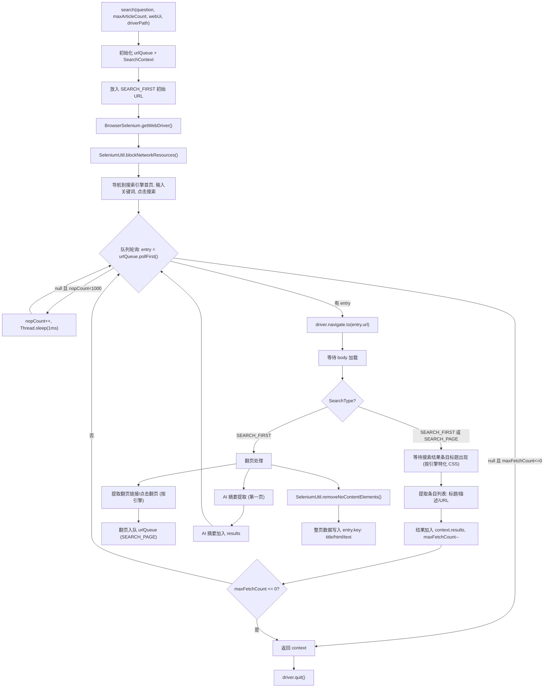
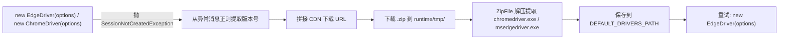

# i2f-extension-browser-selenium

> **基于 Selenium WebDriver 的浏览器自动化搜索抓取扩展 / 将浏览器搜索引擎抓取能力装配为 Selenium 实现的驱动工厂 + 五大中文搜索引擎适配 + 通用正文抓取器**（9 源文件共 2016 行、单资源文件 `chromedriver.exe` + `msedgedriver.exe`、1 测试文件，依赖 `selenium-java:4.32.0` provided + optional，内部依赖 `i2f-browser-std`/`i2f-io-stream`/`i2f-match`/`i2f-std-const`）。

## 模块路径

- `i2f-extension/i2f-extension-browser-selenium/pom.xml`
- 相对于仓库根目录：`i2f-extension/i2f-extension-browser-selenium`

## 模块依赖

### 内部模块（compile 依赖）

| Maven 坐标 | scope | optional | 说明 |
|-----------|-------|----------|------|
| `i2f.turbo:i2f-std-const:1.0-jdk8` | compile | false | 标准常量（`StdConst.RUNTIME_PERSIST_DIR`/`RUNTIME_TMP_DIR` 用于驱动文件存放路径） |
| `i2f.turbo:i2f-browser-std:1.0-jdk8` | compile | false | 浏览器搜索引擎抓取标准契约层（`SearchContext`/`SearchResult`/`SearchType`/`SearchBlockConsts`/`SearchUtil`） |
| `i2f.turbo:i2f-io-stream:1.0-jdk8` | compile | false | IO 流工具（`StreamUtil.streamCopy` 用于下载 driver zip、`StreamUtil.writeBytes` 用于解压提取） |
| `i2f.turbo:i2f-match:1.0-jdk8` | compile | false | 正则工具箱（`RegexUtil.regexFinds` 用于从异常消息中解析浏览器版本号） |

### 第三方依赖（provided + optional）

| Maven 坐标 | 版本 | scope | optional | 说明 |
|-----------|------|-------|----------|------|
| `org.seleniumhq.selenium:selenium-java` | 4.32.0 | provided | true | Selenium WebDriver 全套（含 `WebDriver`/`ChromeDriver`/`EdgeDriver`/`ChromeOptions`/`EdgeOptions`/`WebDriverWait`/`By`/`JavascriptExecutor`/`HasCdp` 等），运行期由使用方提供 |
| `org.projectlombok:lombok` | 父 POM 托管 | provided | true | 编译期注解处理器（模块内未实际使用） |

### 构建插件

| 插件坐标 | 用途 |
|---------|------|
| `maven-assembly-plugin` | 打包 fat-jar（由父 POM 统一配置） |

## 模块设计

### 包结构

```
i2f.extension.browser.selenium/
├── BrowserSelenium.java          # 驱动工厂（Edge/Chrome 创建、内置 driver 释放、版本不匹配自动下载）
└── search/
    ├── WebPageScraper.java       # 通用正文页抓取器
    ├── BaiduSearch.java          # 百度搜索适配（www.baidu.com）
    ├── BaiduKaifaSearch.java     # 百度开发者搜索适配（kaifa.baidu.com）
    ├── BiYingSearch.java         # 必应搜索适配（cn.bing.com）
    ├── SouGouSearch.java         # 搜狗搜索适配（sogou.com，滚动加载）
    ├── TouTiaoSearch.java        # 头条搜索适配（so.toutiao.com）
    └── utils/
        └── SeleniumUtil.java     # 工具类（CDP 网络拦截、DOM 清洗、异常判定）
```

### 模块分层架构

```
┌────────────────────────────────────────────────────────────┐
│  消费方 (i2f-tools-ops / i2f-extension-all)               │
│  AI Tool 封装、聚合打包                                     │
└──────────────┬─────────────────────────────────────────────┘
               │ 依赖 i2f-browser-std 契约
┌──────────────▼──────────────────────────────────────────────┐
│  i2f-extension-browser-selenium                            │
│                                                             │
│  ┌────────────────────────────────────────────────────┐     │
│  │ BrowserSelenium 驱动工厂                            │     │
│  │ · releaseDrivers() - classpath→disk 释放内置 driver │     │
│  │ · getWebDriver() - Edge / Chrome 带反检测选项创建   │     │
│  │ · download{Chrome,Edge}Driver() - 异常时自动下载    │     │
│  └────────────────────────────────────────────────────┘     │
│                                                             │
│  ┌────────────────────────────────────────────────────┐     │
│  │ 五大搜索引擎搜索类 (同构骨架)                       │     │
│  │ BaiduSearch / BaiduKaifaSearch                     │     │
│  │ BiYingSearch / SouGouSearch / TouTiaoSearch        │     │
│  │ · LinkedBlockingDeque 阶段队列爬行                  │     │
│  │ · SEARCH_FIRST: 聚合+翻页+AI摘要+页面源码          │     │
│  │ · SEARCH_PAGE: 仅聚合条目                          │     │
│  │ · maxFetchCount 配额截断                           │     │
│  └────────────────────────────────────────────────────┘     │
│                                                             │
│  ┌────────────────────────────────────────────────────┐     │
│  │ WebPageScraper 正文页抓取器                        │     │
│  │ · 单 URL → SearchResult (title/html/text)         │     │
│  └────────────────────────────────────────────────────┘     │
│                                                             │
│  ┌────────────────────────────────────────────────────┐     │
│  │ SeleniumUtil 工具层                                │     │
│  │ · blockNetworkResources (CDP Network.enable)      │     │
│  │ · removeNoContentElements (JS 三段 DOM 清洗)       │     │
│  │ · isCannotRecoveryException (致命异常判定)          │     │
│  └────────────────────────────────────────────────────┘     │
└──────────────────────────────────────────────────────────────┘
          │
          ▼
┌──────────────────────────────────────────────────────────────┐
│  底层依赖                                                  │
│  · i2f-browser-std (契约层：SearchContext/SearchResult/... ) │
│  · selenium-java 4.32.0 (WebDriver + Chrome/Edge 驱动)      │
│  · i2f-match (RegexUtil 版本解析)                            │
│  · i2f-io-stream (StreamUtil 流拷贝/写出)                    │
└──────────────────────────────────────────────────────────────┘
```

### 搜索爬行流程



### 五大搜索引擎特化对比

| 搜索引擎 | 搜索首页 URL | 搜索结果 CSS 选择器 | 翻页方式 | 特有行为 |
|---------|-------------|-------------------|---------|---------|
| `BaiduSearch` | `https://www.baidu.com/` | `div[tpl="www_index"]` | URL 翻页 (`div[tpl="app/page"] a`) | 开发者聚合块 (`div[tpl="kaifa_pc_blog_weak_no_border"]`) |
| `BaiduKaifaSearch` | `https://kaifa.baidu.com/` | `#content-left .ant-list-items .ant-list-item` | 点击翻页 (`#pagination-pc .pagination-item`) | Ant Design 组件、`TimeUnit.SECONDS.sleep` 等待 |
| `BiYingSearch` | `https://cn.bing.com/` | `#b_results .b_algo` | URL 翻页 (`#b_results .b_pag a`) | 首尾页跳过 |
| `SouGouSearch` | `https://www.sogou.com/` | `.results .vrwrap[exposed="1"]` | JS 滚动加载 (scrollHeight 检测) | 无翻页、无限滚动、`JavascriptExecutor` 滚动 |
| `TouTiaoSearch` | `https://www.toutiao.com/` | `.s-result-list .cs-card-content` | URL 翻页 (`.cs-pagination a`) | 额外回车提交搜索、首尾页跳过 |

### 驱动自动下载机制

当浏览器版本与内置 driver 不匹配时，`SessionNotCreatedException` 会触发自动下载流程：



- Chrome：`https://storage.googleapis.com/chrome-for-testing-public/{version}/win64/chromedriver-win64.zip`
- Edge：`https://msedgedriver.microsoft.com/{version}/edgedriver_win64.zip`

## 模块目的

将 Selenium WebDriver 的浏览器自动化能力封装为搜索引擎数据抓取工具，使 AI Agent / 搜索应用能通过统一的 `i2f-browser-std` 契约获取搜索结果与正文页内容，同时解决 Selenium 集成中的 driver 分发、版本匹配、反检测配置、网络资源拦截等工程化问题。

## 模块功能

1. **双浏览器驱动工厂**：Edge / Chrome 双引擎支持，内置 no-sandbox / disable-gpu / 反自动化检测等选项
2. **内置 driver 分发**：classpath 捆绑 `chromedriver.exe` + `msedgedriver.exe`，首次使用时自动释放到磁盘
3. **版本不匹配自动降级**：`SessionNotCreatedException` 时自动解析浏览器版本号，从 Google/Microsoft CDN 下载匹配的 driver 并解压
4. **CDP 网络资源拦截**：通过 Chrome DevTools Protocol 阻断图片/音视频/字体等带宽消耗资源，加速抓取
5. **DOM 运行期清洗**：清除 style/script/link/svg/canvas/noscript/hidden input，剥离 class/style/id/onclick 属性，移除 HTML 注释
6. **五大中文搜索引擎适配**：百度、百度开发者（kaifa）、必应、搜狗、头条，各引擎特化的 CSS 选择器与翻页/滚动策略
7. **阶段队列爬行架构**：`LinkedBlockingDeque<Map.Entry<SearchResult, SearchType>>` 驱动 SEARCH_FIRST（聚合+翻页+AI 摘要+源码）→ SEARCH_PAGE（仅聚合）多阶段爬行
8. **配额截断**：`maxFetchCount` AtomicInteger 控制总结果数（含 AI 摘要）
9. **通用正文页抓取**：`WebPageScraper.scraper(url)` 全自动打开 URL、等待 body、提取 title/html/text 后关闭浏览器
10. **致命异常保护**：`NoSuchSessionException`/`NoSuchWindowException`/`ConnectionFailedException`/`UnreachableBrowserException` 自动熔断退出

## 模块主要使用方法

### 1. 引入依赖

```xml
<dependency>
    <groupId>i2f.turbo</groupId>
    <artifactId>i2f-extension-browser-selenium</artifactId>
    <version>1.0-jdk8</version>
</dependency>
<!-- 运行期需提供 selenium-java 4.32.0 -->
<dependency>
    <groupId>org.seleniumhq.selenium</groupId>
    <artifactId>selenium-java</artifactId>
    <version>4.32.0</version>
</dependency>
```

### 2. 驱动工厂使用

```java
// 自动检测可用 driver、无头模式
WebDriver driver = BrowserSelenium.getWebDriver(null, false, null);

// 指定 Edge 浏览器、带 UI 模式
WebDriver driver = BrowserSelenium.getWebDriver(
    BrowserSelenium.WebDriverType.EDGE, true, null);

// 首次调用自动释放内置 chromedriver.exe / msedgedriver.exe 到 ./runtime/persist/webdriver/
// 版本不匹配时自动从 CDN 下载
```

### 3. 搜索引擎调用

```java
// 百度搜索（5条 + AI 摘要）
SearchContext ctx = BaiduSearch.search("Selenium 用法", 5);

// 必应搜索（10条，无头模式）
SearchContext ctx = BiYingSearch.search("Java WebDriver", 10, true, null);

// 搜狗搜索（滚动加载，自定义 driver 路径）
SearchContext ctx = SouGouSearch.search("Java 并发编程", 3, "G:/webdriver");

// 百度开发者搜索
SearchContext ctx = BaiduKaifaSearch.search("Spring Boot 配置", 5);

// 头条搜索
SearchContext ctx = TouTiaoSearch.search("AI 最新进展", 5);
```

### 4. 正文页抓取

```java
SearchResult result = WebPageScraper.scraper("https://example.com/article", false, null);
String title = result.getTitle();
String text = result.getText();
String html = result.getHtml();
```

### 5. 网络拦截与 DOM 清洗（单独使用）

```java
// CDP 网络拦截（需 HasCdp 驱动）
SeleniumUtil.blockNetworkResources(driver);

// DOM 清洗
SeleniumUtil.removeNoContentElements(driver);

// 致命异常判定
if (SeleniumUtil.isCannotRecoveryException(e)) {
    break; // 浏览器已死，不可恢复
}
```

## 模块特性总结

- **双引擎**：Edge + Chrome 双浏览器支持，自动检测可用 driver
- **零配置首发**：classpath 内置 driver 二进制文件，首次自动释放，无需手动下载
- **自修复**：浏览器版本不匹配时自动从 CDN 下载对应 driver
- **反检测**：`--disable-blink-features=AutomationControlled` + `excludeSwitches=enable-automation` + `useAutomationExtension=false`
- **加速**：CDP 网络拦截阻断图片/音视频/字体带宽消耗
- **兼容 `i2f-browser-std` 契约**：统一 `SearchContext`/`SearchResult` 出参模型
- **阶段队列爬行**：SEARCH_FIRST / SEARCH_PAGE 两阶段多语义爬行
- **引擎特化**：五大搜索引擎各自适配的 CSS 选择器 + 翻页/滚动策略
- **通用抓取器**：`WebPageScraper` 一行代码完成正文页抓取
- **安全熔断**：致命浏览器异常自动退出循环

## 模块瑕疵或错误

1. **整页数据丢失**（与 Playwright 版同类缺陷）：五个搜索类的 `SEARCH_FIRST` 分支将整页 title/html/text 写入 `entry.getKey()`（队列条目的 `SearchResult` 对象），但该对象从未加入 `context.getResults()`，方法返回后无引用——整页采集数据必然丢失。

2. **队列排空忙等**（与 Playwright 版同类缺陷）：主循环 `while(nopCount<1000)` 在阶段队列排空后以 `Thread.sleep(1ms)` 空转 1000 次，每次搜索固定多耗约 1 秒。

3. **`driverPath` 参数语义模糊**：`BrowserSelenium.getWebDriver` 的 `driverPath` 参数在非默认路径且目录不存在时会静默回退到 `DEFAULT_DRIVERS_PATH`，调用者无法感知回退。

4. **`getWebDriver(null, ...)` 降级行为未文档化**：`type` 参数为 `null` 时走 `else` 分支创建 ChromeDriver，但无日志提示，调用者无法预期。

5. **自动下载 URL 硬编码平台**：Chrome driver 下载 URL 硬编码为 `win64` 平台（`chromedriver-win64.zip`），非 Windows 系统上下载失败时仅被空 catch 吞掉。

6. **`TouTiaoSearch` 空列表解引用**：L141 `inputElems.get(0)` 在 `findElements` 返回空列表时抛 `IndexOutOfBoundsException`。

7. **下载方法空 catch 吞异常**：`downloadChromeDriver`/`downloadEdgeDriver` 整个方法体包裹在 `try { ... } catch (Exception ex) { }` 中，所有网络/IO/解压异常均被静默吞掉，调用者无任何反馈。

8. **`BaiduKaifaSearch` 点击翻页引用不稳定**：翻页使用 `page.click()` 而非 `navigate.to(url)`，DOM 重渲染后 `pageElems` 可能变为过期引用。

9. **冗余 null 检查**：五个搜索类的 `if (context != null)` 检查均为死代码——`context` 在调用前已被 `new SearchContext()` 初始化，恒非 null。

10. **`SeleniumUtil.removeNoContentElements` 两处空 catch**：JS 脚本执行异常的捕获静默吞错，调用者无法获知清洗是否成功。

## 消费方情况

| 消费方 | 关系 | 说明 |
|-------|------|------|
| `i2f-extension-all` | POM 聚合 | 聚合打包为单体 fat-jar |
| `i2f-tools-ops` | POM 依赖 | AI Tool 封装（Windows + 开关双条件装配） |
| 根 POM `dependencyManagement` | 版本托管 | L950 声明版本号 |
| `i2f-extension` 父 POM | module 声明 | L27 子模块声明 |