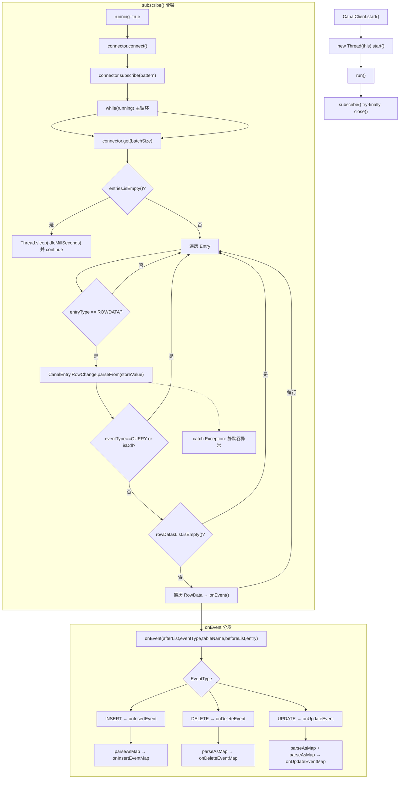

# i2f-extension-canal

> **基于 Alibaba Canal 的 MySQL Binlog 订阅消费模板 / 将 canal client 的「连接-订阅-轮询-解析」流程封装为模板方法模式的事件驱动框架**（2 源文件共 345 行、单包族 `i2f.extension.canal`/`.meta`、0 资源、2 测试文件，依赖 `canal.client:1.1.7` + `canal.protocol:1.1.7` provided + optional，内部依赖 `i2f-convert`）。

## 模块路径

- `i2f-extension/i2f-extension-canal/pom.xml`
- 相对于仓库根目录：`i2f-extension/i2f-extension-canal`

## 模块依赖

### 内部模块（compile 依赖）

| Maven 坐标 | scope | optional | 说明 |
|-----------|-------|----------|------|
| `i2f.turbo:i2f-convert:1.0-jdk8` | compile | false | 通用类型转换工具（`ObjectConvertor.tryParseDate`/`tryConvertAsType` 用于 SQL 日期/布尔值类型映射） |

### 三方依赖（provided + optional）

| Maven 坐标 | 版本 | scope | optional | 说明 |
|-----------|------|-------|----------|------|
| `com.alibaba.otter:canal.client` | 1.1.7 | provided | true | Canal 客户端连接器（`CanalConnector` / `CanalConnectors`） |
| `com.alibaba.otter:canal.protocol` | 1.1.7 | provided | true | Canal 通信协议 Protobuf 数据模型（`Message` / `CanalEntry` / `RowChange` / `RowData` / `Column`） |
| `org.projectlombok:lombok` |  | provided |  | 编译期代码生成（`@Data` / `@NoArgsConstructor`） |

### 构建插件

| 插件坐标 | 版本 | 用途 |
|---------|------|------|
| `maven-assembly-plugin` | 3.1.0 | 打包 fat-jar |

## 模块设计

### 包结构

| 包路径 | 类 | 职责 |
|-------|---|------|
| `i2f.extension.canal` | `CanalClient` | Canal 订阅消费核心：模板方法骨架 + SQL 类型映射引擎 |
| `i2f.extension.canal.meta` | `CanalMeta` | 连接元数据 POJO：host/port/destination/username/password |

### 设计模式

**模板方法模式（Template Method）**：`CanalClient.subscribe()` 定义了固定的订阅消费骨架——
连接 → 订阅 → 轮询 `connector.get(batchSize)` → 过滤 ROWDATA → 解析 RowChange → 过滤 QUERY/DDL → 逐行分发 `onEvent`。子类只需重写三个空钩子 `onInsertEventMap` / `onDeleteEventMap` / `onUpdateEventMap` 即可处理业务逻辑。

**模板方法双钩子**：
- `preParseColumnValue(Column, AtomicReference)` — 优先处理钩子（返回 false 则回退到 `parseColumnValue`）
- `parseColumnValue(Column)` — 默认 SQL 类型映射器（覆盖 15+ JDBC 类型）

**Fluent Builder 风格**：`connector()` / `pattern()` / `batchSize()` / `idleMillSeconds()` 返回 `this` 支持链式调用。

### SQL 类型映射关系

| JDBC 类型 | Java 类型 | 说明 |
|-----------|----------|------|
| `BINARY` / `VARBINARY` / `LONGVARBINARY` / `BLOB` / `CLOB` / `NCLOB` | `byte[]` | 通过 `column.getValueBytes().toByteArray()` 获取原始字节 |
| `VARCHAR` / `NVARCHAR` / `NCHAR` / `LONGVARCHAR` / `LONGNVARCHAR` / `CHAR` / `SQLXML` | `String` | 保持字符串原值 |
| `BIGINT` | `Long` | `Long.parseLong(value)` |
| `INTEGER` / `SMALLINT` / `TINYINT` / `BIT` | `Integer` | `Integer.parseInt(value)`（BIT 也走整型解析） |
| `FLOAT` | `Float` | `Float.parseFloat(value)` |
| `REAL` / `DOUBLE` | `Double` | `Double.parseDouble(value)` |
| `NUMERIC` / `DECIMAL` | `BigDecimal` | `new BigDecimal(value)` |
| `DATE` / `TIME` / `TIMESTAMP` / `TIME_WITH_TIMEZONE` / `TIMESTAMP_WITH_TIMEZONE` | `Date` | 经 `ObjectConvertor.tryParseDate` 尝试解析 |
| `BOOLEAN` | `Boolean` | 经 `ObjectConvertor.tryConvertAsType(value, Boolean.class)` 转换 |
| `OTHER` / 默认 | `String` | 字符串原值 |
| `NULL` / `isNull=true` | `null` | 返回 null |

### 事件分发流程



### 设计要点

1. **单线程消费模型**：`subscribe()` 内部使用单线程 `while(running)` 循环——无并发复杂度，但处理阻塞时无法响应事件。
2. **无 ACK 机制**：整个消费循环从未调用 `connector.ack()` 或 `connector.rollback()`。Canal Server 不会收到消费确认，可能根据配置自动重推或堆积。
3. **无自动重连**：`connect()` 只在 `subscribe()` 开始时调用一次。若连接中断，`connector.get()` 可能抛出异常导致 `subscribe()` 直接退出。
4. **静默吞异常**：RowChange 解析和单行处理异常被空 `catch` 块吞没——整批消息中某行解析失败不中断循环，但无日志可查。
5. **线程生命周期**：`start()` 创建的是普通用户线程（非 daemon）——应用退出时若未 `close()`，线程会阻止 JVM 退出。

## 模块目的

将 Alibaba Canal 的 Binlog 订阅消费流程从「手动管理连接、订阅、轮询、Protobuf 解析、类型映射」收敛为「子类重写三个事件钩子」的模板方法模式，降低 Canal 接入成本；同时提供开箱即用的 SQL 类型→Java 类型映射引擎，适配 MySQL 常用数据类型。

## 模块功能

1. **连接工厂**：`CanalMeta` + `getConnector()` 从元数据 POJO 创建 `CanalConnector`（默认端口 11111、默认 destination `example`）
2. **订阅循环骨架**：`subscribe()` 自动完成连接→订阅→轮询→过滤→分发全流程
3. **事件分发**：按 INSERT/DELETE/UPDATE 三事件路由到对应钩子
4. **SQL 类型映射**：`parseColumnValue` 将 Canal Column 的 sqlType + isNull + value/valueBytes 映射为 Java 类型（byte[] / Long / Integer / Float / Double / BigDecimal / Date / Boolean / String）
5. **类型解析扩展点**：`preParseColumnValue` 优先解析钩子——子类可拦截特定列做自定义转换
6. **列过滤与名称变换**：`parseAsMap` 支持 filter + nameWrapper 回调
7. **异步启动**：`start()` 在新线程中运行订阅循环（线程名 `canal-client-N`）
8. **生命周期管理**：`Closeable` 接口——`close()` 触发 `connector.disconnect()`

## 模块主要使用方法

### 1. Maven 依赖

```xml
<dependency>
    <groupId>i2f.turbo</groupId>
    <artifactId>i2f-extension-canal</artifactId>
    <version>1.0-jdk8</version>
</dependency>
<!-- 运行期需自行引入 canal.client + canal.protocol -->
<dependency>
    <groupId>com.alibaba.otter</groupId>
    <artifactId>canal.client</artifactId>
    <version>1.1.7</version>
</dependency>
<dependency>
    <groupId>com.alibaba.otter</groupId>
    <artifactId>canal.protocol</artifactId>
    <version>1.1.7</version>
</dependency>
```

### 2. 快速开始 — 匿名子类

```java
CanalMeta meta = new CanalMeta("127.0.0.1", 11111, "example", "canal", "password");
new CanalClient(meta) {
    @Override
    public void onInsertEventMap(Map<String, Object> after,
                                  String tableName, CanalEntry.Entry entry) {
        System.out.println("insert:" + tableName + " data:" + after);
    }
    @Override
    public void onDeleteEventMap(Map<String, Object> before,
                                  String tableName, CanalEntry.Entry entry) {
        System.out.println("delete:" + tableName + " data:" + before);
    }
    @Override
    public void onUpdateEventMap(Map<String, Object> after,
                                  Map<String, Object> before,
                                  String tableName, CanalEntry.Entry entry) {
        System.out.println("update:" + tableName + " before:" + before + " after:" + after);
    }
}.pattern("test_db.*")
 .batchSize(100)
 .idleMillSeconds(3000)
 .run(); // 同步阻塞；也可用 start() 异步启动
```

### 3. 自定义类型解析

```java
CanalClient client = new CanalClient(meta) {
    @Override
    public boolean preParseColumnValue(CanalEntry.Column column,
                                        AtomicReference<Object> out) {
        if ("json_col".equals(column.getName())) {
            out.set(parseJson(column.getValue()));
            return true;
        }
        return false; // 回退 parseColumnValue
    }
};
```

### 4. 列过滤与名称包装

```java
Map<String, Object> result = client.parseAsMap(columnList, new LinkedHashMap<>(),
    name -> "col_" + name,               // nameWrapper
    col -> !col.getIsNull()               // filter: 跳过 null 列
);
```

### 5. 异步启动与关闭

```java
CanalClient client = new CanalClient(meta);
client.start();   // 新后台线程

// 应用关闭时
client.close();   // disconnect connector
```

## 模块特性总结

- **模板方法封装**：将 Canal 订阅消费全流程收敛为三个空事件钩子
- **全类型映射**：覆盖 15+ JDBC 类型的 Java 类型自动转换（含二进制/大对象/时间/布尔/精确数值）
- **双扩展点**：`preParseColumnValue`（列级拦截）+ `parseAsMap`（列过滤/名称变换）
- **链式构建**：Fluent API 设置 pattern/batchSize/idleMillSeconds
- **轻量零依赖**：2 源文件 345 行，无多余第三方依赖

## 模块瑕疵或错误

1. **无 ACK 确认（功能级缺陷）**：`subscribe()` 循环内从未调用 `connector.ack()` 或 `connector.rollback()`。Canal Server 无法确认消费进度，可能导致重复消费或累积延迟。

2. **自动重连缺失（可靠性缺陷）**：`connector.connect()` 仅在 `subscribe()` 入口执行一次。网络闪断或 Canal Server 重启后 `connector.get()` 抛异常直接退出循环，无重试逻辑。

3. **空 catch 静默吞异常（可观测性缺陷）**：L122-124 `catch (InterruptedException)` 和 L156-158 `catch (Exception)` 均为空实现——RowChange 解析异常、类型转换异常（如 `NumberFormatException`）被静默吞没，无日志记录，排障困难。

4. **System.out 硬编码日志（可维护性缺陷）**：L115 `System.out.println` 输出订阅启动信息——未接入 `java.util.logging` / SLF4J，生产环境中缺乏统一日志管理。

5. **非 Daemon 用户线程（生命周期缺陷）**：`start()` L93 创建的线程非守护线程——若应用未显式 `close()` 就退出，该线程将阻止 JVM 正常停机。

6. **`BIT` 类型映射为 `Integer`（精度缺陷，轻微）**：MySQL `BIT(>1)` 列的值以十进制数字字符串表示（如 `b'1111111111'` 对应 `"1023"`），当前 `Integer.parseInt()` 可处理；但 `BIT(64)` 理论上可超出 `Integer.MAX_VALUE` 范围（实际 Canal 返回格式为数字字符串，超长时仍可能越界）。

7. **`FLOAT` 类型精度降级（精度缺陷，轻微）**：映射为 `Float.parseFloat()`（7 位十进制精度），而 Canal 传输的 FLOAT 字符串可能是高精度表示。若需精确数值应改用 `Double` 或 `BigDecimal`。

8. **子类未重写 `preParseColumnValue` 时 `AtomicReference` 无用（设计冗余）**：基类 `preParseColumnValue` 始终返回 `false`，`AtomicReference` 形参永远不会被填充——属于为扩展预留但实际在基类无用的设计。

9. **`subscribe()` 异常退出后无资源清理（资源泄漏缺陷）**：`subscribe()` L101-108 的 `try-finally` 确保 `close()` 无退出异常时调用。但若 `connector.get()` 或 `connector.subscribe()` 在执行中抛出未受检异常（如 `NullPointerException`），会直接逃逸 `subscribe()`——此时 `running` 仍为 `true`，且线程未经 `try-finally` 保护（因为异常在 `try` 块之外抛出，`try` 块从 `subscribe()` 开始），导致 `close()` 无法执行。实际异常路径：`run()` L99 调用 `subscribe()` → `subscribe()` L113 `connect()` 在 `try` 前 → L114 `subscribe(pattern)` 在 `try` 前 → 这些若抛异常 → 逃逸到 `run()` 的 `finally` 中 L102 的 `close()` 仍可执行。但 L116-161 的 `while(running)` 循环体内 `connector.get()` 抛出的运行时异常（如连接断开后的 `IllegalStateException`）会被 L156 的 `catch (Exception)` 捕获，不会逃逸。综上，实际风险较低但代码结构可改进。

10. **测试文件含硬编码凭证（安全缺陷，轻微）**：`TestCanal.java` L21-24 和 `TestCanalClient.java` L15-17 包含不可用的示例 IP 和密码占位符——虽非真实凭证，但建议移至外部配置。

## 消费方情况

| 消费方 | 关系 | 说明 |
|-------|------|------|
| `i2f-extension-all` | POM compile 依赖 | 聚合打包该模块 |
| `i2f-extension` 父 POM | module 注册 | 注册为子模块参与构建 |
| 根 POM `dependencyManagement` | 版本管理 | 版本统一声明 |

全仓无 Java 源码级别的 `import i2f.extension.canal` — 该模块目前仅作为扩展库发布，由外部项目通过 Maven 依赖使用。