# i2f-extension-compress

> **基于 Apache Commons Compress 的归档压缩适配层 / 将 commons-compress 的 Archive\* API 桥接为 i2f-compress-std 统一契约的五格式实现族**（5 源文件共 393 行、单包 `i2f.extension.compress`、1 测试文件，依赖 `commons-compress:1.21` + `xz:1.8` provided + optional，内部依赖 `i2f-compress-std`/`i2f-io-file`）。

## 模块路径

- `i2f-extension/i2f-extension-compress/pom.xml`
- 相对于仓库根目录：`i2f-extension/i2f-extension-compress`

## 模块依赖

### 内部模块（compile 依赖）

| Maven 坐标 | scope | optional | 说明 |
|-----------|-------|----------|------|
| `i2f.turbo:i2f-compress-std:1.0-jdk8` | compile | false | 压缩标准契约（`ICompressor` 接口 + `AbsCompressor` 抽象骨架 + `CompressBindData` 数据模型） |
| `i2f.turbo:i2f-io-file:1.0-jdk8` | compile | false | 文件工具（`FileUtil.getTempFile()`/`FileUtil.save()`，Tar 压缩中用于未知大小条目暂存） |

### 三方依赖（provided + optional）

| Maven 坐标 | 版本 | scope | optional | 说明 |
|-----------|------|-------|----------|------|
| `org.apache.commons:commons-compress` | 1.21 | provided | true | Apache Commons Compress 核心库（提供 ArchiveOutputStream/InputStream 体系） |
| `org.tukaani:xz` | 1.8 | provided | true | LZMA2/XZ 压缩算法实现（SevenZ 格式必需） |

### 构建插件

| 插件坐标 | 用途 |
|---------|------|
| `org.apache.maven.plugins:maven-assembly-plugin` | 打包时保留 Maven 元信息（`addMavenDescriptor=true`） |

## 模块设计

### 包结构与类层次

```
i2f.extension.compress
├── ZipApacheCompressor      — ZIP 格式（ZipArchiveOutputStream/InputStream）
├── JarApacheCompressor      — JAR 格式（JarArchiveOutputStream/InputStream）
├── TarApacheCompressor      — TAR 格式（TarArchiveOutputStream/InputStream，需预知条目大小）
├── CpioApacheCompressor     — CPIO 格式（CpioArchiveOutputStream/InputStream）
└── SevenZApacheCompressor   — 7Z 格式（SevenZOutputFile/SevenZFile，API 与归档类不同）
```

所有压缩器继承链：`XXXApacheCompressor` → `AbsCompressor` → `ICompressor`

### 桥接模式 + 骨架方法模式

```
┌─────────────────────────────────────────────────────────────────┐
│ ICompressor (压缩标准契约)                                        │
│  compressBindData(output, Collection<CompressBindData>)          │
│  release(input, output, BiConsumer<CompressBindData, File>)      │
│  ┌─ compressBindFile → compressBindData (AbsCompressor 实现)     │
│  └─ compressFile → compressBindFile → compressBindData           │
└─────────────────────────────────────────────────────────────────┘
                              ▲  implements
             ┌────────────────┴────────────────┐
             │ AbsCompressor (抽象骨架)         │
             │ 提供：compressBindFile /         │
             │ compressFile / release(二参)     │
             │ 抽象：compressBindData /         │
             │ release(三参)                    │
             └────────────────┬────────────────┘
                              ▲  extends
    ┌──────────┬──────────┬───┴───┬──────────┬──────────┐
    │  ZIP     │  JAR     │  TAR   │  CPIO    │   7Z     │
    │Apache    │Apache    │Apache  │Apache    │Apache    │
    │Compressor│Compressor│Compressor│Compressor│Compressor│
    └──────────┴──────────┴────────┴──────────┴──────────┘
                              │
    ┌─────────────────────────┴─────────────────────────┐
    │ Apache Commons Compress Archive API                 │
    │ ZipArchiveOutputStream  TarArchiveOutputStream      │
    │ CpioArchiveOutputStream JarArchiveOutputStream      │
    │ SevenZOutputFile  SevenZFile                        │
    └─────────────────────────────────────────────────────┘
```

### 压缩/解压流程

```mermaid
flowchart TB
    subgraph Compress["压缩流程"]
        A1["用户调用 compress(output, inputs)"] --> A2["AbsCompressor.compressBindFile"]
        A2 --> A3["CompressBindFile 转为 CompressBindData"]
        A3 --> A4["创建 ArchiveOutputStream / SevenZOutputFile"]
        A4 --> A5["遍历每个 CompressBindData"]
        A5 --> A6{"inputStream == null?"}
        A6 -- "是" --> A7["skip (continue)"]
        A6 -- "否" --> A8["拼接 path = directory + '/' + fileName"]
        A8 --> A9{"需预知 size?"}
        A9 -- "Tar 且 size<0" --> A10["暂存临时文件获取确切大小"]
        A10 --> A11["创建 ArchiveEntry，设 size"]
        A11 --> A12["putArchiveEntry"]
        A12 --> A13["streamCopy / zFile.write(is)"]
        A13 --> A14["flush / closeArchiveEntry"]
        A14 --> A15["关闭 is"]
        A15 --> A16{"还有条目?"}
        A16 -- "是" --> A5
        A16 -- "否" --> A17["关闭 zos / zFile"]
    end

    subgraph Release["解压流程"]
        B1["用户调用 release(input, output)"] --> B2["AbsCompressor.release(二参)"]
        B2 --> B3["创建输出父目录"]
        B3 --> B4["release(三参) 并传入写盘 consumer"]
        B4 --> B5["创建 ArchiveInputStream / SevenZFile"]
        B5 --> B6["getNextEntry"]
        B6 --> B7{"entry == null 或 isDirectory?"}
        B7 -- "是" --> B8["跳过"]
        B8 --> B9{"还有条目?"}
        B9 -- "是" --> B6
        B7 -- "否" --> B10["解析 path 为 directory + fileName"]
        B10 --> B11["构造 CompressBindData"]
        B11 --> B12["consumer.accept(data, output)"]
        B12 --> B9
        B9 -- "否" --> B13["关闭 zis / zFile"]
    end
```



### 各格式特殊处理要点

| 格式 | 输出流类 | 输入流类 | 关键差异 |
|------|---------|---------|---------|
| ZIP | `ZipArchiveOutputStream` | `ZipArchiveInputStream` | 标准 Stream API，streamCopy |
| JAR | `JarArchiveOutputStream` | `JarArchiveInputStream` | 标准 Stream API，streamCopy |
| TAR | `TarArchiveOutputStream` | `TarArchiveInputStream` | TarArchiveEntry 构造只传文件名（非 path），size 必须提前知道 |
| CPIO | `CpioArchiveOutputStream` | `CpioArchiveInputStream` | 标准 Stream API，streamCopy |
| 7Z | `SevenZOutputFile` | `SevenZFile` | **非 Stream 体系**：输出用 `zFile.write(is)`，输入需匿名 InputStream 包装 `zFile.read()` |

## 模块目的

将 Apache Commons Compress 的功能丰富的 Archive API 封装为 `i2f-compress-std` 的统一压缩/解压契约，使上层业务代码无需关心底层格式差异——通过同一个 `ICompressor` 接口即可操作 ZIP、JAR、TAR、CPIO、7Z 五种归档格式。

## 模块功能

1. **ZIP 压缩/解压** — `ZipApacheCompressor`，基于 `ZipArchiveOutputStream`/`ZipArchiveInputStream`
2. **JAR 压缩/解压** — `JarApacheCompressor`，基于 `JarArchiveOutputStream`/`JarArchiveInputStream`
3. **TAR 压缩/解压** — `TarApacheCompressor`，基于 `TarArchiveOutputStream`/`TarArchiveInputStream`，支持未知大小条目的临时文件暂存
4. **CPIO 压缩/解压** — `CpioApacheCompressor`，基于 `CpioArchiveOutputStream`/`CpioArchiveInputStream`
5. **7Z 压缩/解压** — `SevenZApacheCompressor`，基于 `SevenZOutputFile`/`SevenZFile`，匿名 InputStream 适配层
6. **骨架方法复用** — 通过 `AbsCompressor` 获得 `compressBindFile`/`compressFile`/`release(二参)` 的免费实现
7. **路径规范化** — 统一处理前导 `/` 剥离，`directory/filename` 按末位 `/` 拆分

## 模块主要使用方法

### 1. Maven 依赖引入

```xml
<dependency>
    <groupId>i2f.turbo</groupId>
    <artifactId>i2f-extension-compress</artifactId>
    <version>1.0-jdk8</version>
</dependency>
<!-- 运行期需额外添加 -->
<dependency>
    <groupId>org.apache.commons</groupId>
    <artifactId>commons-compress</artifactId>
    <version>1.21</version>
</dependency>
```

### 2. 基本压缩使用

```java
// ZIP 压缩 - 指定数据
ICompressor compressor = new ZipApacheCompressor();
CompressBindData data = new CompressBindData("test.txt", "docs", 
    new FileInputStream("./readme.txt"));
compressor.compress(new File("./output.zip"), data);

// TAR 压缩 - 指定目录
compressor = new TarApacheCompressor();
compressor.compress(new File("./output.tar"), 
    new File("./i2f-compress-std"));
```

### 3. 基本解压使用

```java
// ZIP 解压到目录
ICompressor compressor = new ZipApacheCompressor();
compressor.release(new File("./output.zip"), new File("./release/"));

// 带自定义 consumer 的解压
compressor.release(new File("./output.zip"), new File("./release/"), 
    (data, rootDir) -> {
        // 自定义处理每个条目
        System.out.println("解压: " + data.getFileName());
    });
```

### 4. 七种格式切换

```java
// 同一接口，不同实现
ICompressor[] compressors = {
    new ZipApacheCompressor(),
    new JarApacheCompressor(),
    new TarApacheCompressor(),
    new CpioApacheCompressor(),
    new SevenZApacheCompressor()
};

for (ICompressor c : compressors) {
    File out = new File("./output." + getSuffix(c));
    c.compress(out, new File("./source-dir"));
    c.release(out, new File("./release-dir/"));
}
```

### 5. 注意事项

- `TarApacheCompressor` 压缩时若 `CompressBindData.getSize() < 0` 会将条目暂存临时文件以获取确切大小——大文件时注意磁盘空间
- `SevenZApacheCompressor` 的解压流是 `zFile.read()` 的匿名 InputStream 包装，close() 为空实现，底层 SevenZFile 在循环结束时统一关闭
- 所有压缩器均不自动创建输出父目录（由 `AbsCompressor.compressBindFile`/`release(二参)` 负责）
- 所有压缩器均无 try-finally 资源保护——压缩/解压过程中若抛异常，已打开的流资源不会关闭

## 模块特性总结

- **单一职责**：5 个压缩器各管一种格式，继承同一抽象骨架
- **桥接设计**：将 Apache Commons Compress 格式各异的 API 统一到 i2f-compress-std 契约
- **骨架复用**：AbsCompressor 提供 `compressBindFile` → `compressBindData`、`compressFile` → `compressBindFile` → `compressBindData`、`release(二参)` → `release(三参)` 的三层免费实现
- **TAR 智能大小**：未知大小的条目自动暂存临时文件后获取确切 size 再写入归档
- **7Z 兼容**：非 Stream 体系的 SevenZOutputFile 通过 `write(InputStream)` 兼容；解压端通过匿名 InputStream 包装适配

## 模块瑕疵或错误

1. **无 try-finally 资源保护** — `compressBindData` 和 `release` 方法中如果中间抛异常，已打开的 `ArchiveOutputStream`/`SevenZFile`/`ArchiveInputStream` 不会关闭，导致资源泄漏。

2. **Tar 临时文件风险** — 条目大小未知时暂存 `FileUtil.getTempFile()`，极端条件下大文件可能导致磁盘空间不足。

3. **SevenZ 解压流语义不清** — 匿名 InputStream 包装 `zFile.read()`，close() 为空实现。外部 consumer 调用 close() 不关闭底层流，底层 SevenZFile 直到循环结束才关闭。若 consumer 提前 break 循环，资源泄漏。

4. **路径分隔符硬编码** — 所有压缩器使用 `"/"` 硬编码拼接 path（`directory + "/" + fileName`），Windows 环境下路径分隔符不一致。

5. **Cpio 格式信息缺失** — `CpioArchiveEntry` 只传 path，未设置 `format`（NEW/OLD/ODC 等）和 `numberOfBytes`，可能与其他 Cpio 读取器不兼容。

6. **压缩时若 size 不准** — `ZipArchiveEntry.setSize()` 只在 `input.getSize() >= 0` 时设值。若 size 与实际写入数据不符（如调用方传错 size），解压时可能校验失败。

7. **release 传入共享流** — consumer 接收的 `CompressBindData.InputStream` 指向共享的 `ArchiveInputStream`/`SevenZFile`。多 consumer 场景下（虽不会出现），条目间相互冲突。

8. **`closeArchiveEntry()` 后数据可能未完全消费** — 若当前条目未完全读取就跳转下一条目（解压循环内 consumer 提前 return），底层流状态不确定。

9. **测试文件路径硬编码** — `TestCompress.java` 中路径 `"./i2f-jdk/i2f-compress"` 和 `"./output/"` 依赖运行时工作目录。

10. **仅支持归档格式** — 不支持纯压缩格式（gzip/bzip2/xz 单独文件压缩），只支持含文件列表的归档格式（zip/tar/jar/cpio/7z）。

## 消费方情况

| 消费方 | 关系 | 说明 |
|-------|------|------|
| `i2f-extension-all` | POM 聚合 | 作为扩展模块统一聚合 |
| `i2f-extension/pom.xml` | modules 注册 | 父 POM 子模块声明 |
| 根 `pom.xml` | dependencyManagement | L965 版本管理