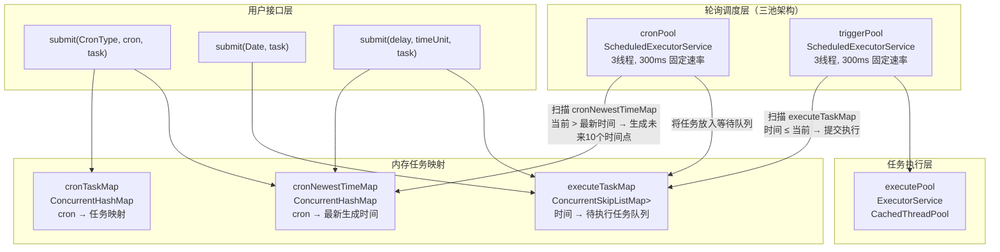
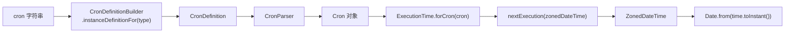

# i2f-extension-cron

> **基于 cron-utils 的嵌入式单机 CRON 任务调度器 / 将 cron 表达式解析与多级线程池轮询结合，提供内存驻留的定时任务提交-调度-执行框架**（2 源文件共 237 行、单包 `i2f.extension.cron`、2 测试文件，依赖 `cron-utils:9.2.1` provided + optional，内部依赖 `i2f-thread`）。

## 模块路径

- `i2f-extension/i2f-extension-cron/pom.xml`
- 相对于仓库根目录：`i2f-extension/i2f-extension-cron`

## 模块依赖

### 内部模块（compile 依赖）

| Maven 坐标 | scope | optional | 说明 |
|-----------|-------|----------|------|
| `i2f.turbo:i2f-thread:1.0-jdk8` | compile | false | 线程工具（`NamingThreadFactory` 具名线程工厂，用于线程池的可识别线程命名） |

### 三方依赖（provided + optional）

| Maven 坐标 | 版本 | scope | optional | 说明 |
|-----------|------|-------|----------|------|
| `com.cronutils:cron-utils` | 9.2.1 | provided | true | cron 表达式解析库（`CronDefinition`/`CronParser`/`ExecutionTime` 解析与未来时间计算） |

### 构建插件

| 插件坐标 | 用途 |
|---------|------|
| `org.apache.maven.plugins:maven-assembly-plugin` | 打包时保留 Maven 元信息（`addMavenDescriptor=true`） |

## 模块设计

### 包结构

```
i2f.extension.cron
├── CronUtil.java       — cron 表达式解析与未来执行时间计算工具
└── CronExecutor.java   — 单例级 CRON 任务调度执行器
```

### 架构设计



### 三层线程池调度机制

`CronExecutor` 采用**三级分离**的线程池架构：

| 线程池 | 类型 | 线程数 | 扫描周期 | 职责 |
|-------|------|-------|---------|------|
| `cronPool` | ScheduledExecutorService | 3 | 300ms | 定时扫描 cron 映射表，当 cron 的最新生成时间已过当前时间时，调用 `CronUtil.nextTimes()` 生成未来 10 个执行时间点，将任务拷贝到等待队列 |
| `triggerPool` | ScheduledExecutorService | 3 | 300ms | 定时扫描等待队列 `executeTaskMap`，将时间 ≤ 当前时间的任务取出，提交给执行线程池 |
| `executePool` | ExecutorService (CachedThreadPool) | 动态 | — | 实际执行 Runnable 任务，按需创建新线程 |

### cron 表达式解析链路



### 设计要点

1. **三池分离** — cron 解析/时间生成、任务触发、任务执行三者解耦，各自独立线程池互不阻塞
2. **双重锁粒度** — `cronLock` 保护 cron 映射表操作，`taskLock` 保护等待队列操作，减少锁竞争
3. **SkipList 有序队列** — `ConcurrentSkipListMap<Date, List<Runnable>>` 天然按时间升序排列，触发扫描时遇到未来时间可直接 break
4. **批量预生成** — 每次扫描为每个 cron 生成未来 10 个执行时间点，减少高频解析开销
5. **三态 submit** — 支持 cron 表达式周期任务、指定时间一次性任务、延迟时间一次性任务三种提交
6. **具名线程** — `NamingThreadFactory` 为所有线程提供 `cron-{id}-dispatcher/trigger/executor-{n}` 可识别名称

## 模块目的

提供轻量级、嵌入式的 CRON 定时任务调度能力——无需 Quartz 的持久化/集群/ misfire 管理等重型特性，适用于单体应用内需要按 cron 表达式执行周期性任务的场景，通过 `cron-utils` 支持 UNIX/Spring/Quartz 三种表达式方言。

## 模块功能

1. **cron 表达式解析** — `CronUtil` 支持 UNIX/Spring/Quartz 三种 cron 方言的解析与未来执行时间计算
2. **cron 周期任务提交** — `CronExecutor.submit(CronType, String, Runnable)` 注册按 cron 表达式定时执行的任务
3. **一次性定时任务** — `submit(Date, Runnable)` 在指定时间执行一次；`submit(int, TimeUnit, Runnable)` 相对延迟执行一次
4. **自动预生成时间** — 每 300ms 扫描，为过期 cron 生成未来 10 个执行时间点，批量入队
5. **时间有序触发** — `ConcurrentSkipListMap` 按键升序，触发线程按序遍历直到遇到未来时间后 break
6. **自定义执行线程池** — 支持构造函数传入外部 `ExecutorService` 代替默认的 `CachedThreadPool`

## 模块主要使用方法

### 1. Maven 依赖引入

```xml
<dependency>
    <groupId>i2f.turbo</groupId>
    <artifactId>i2f-extension-cron</artifactId>
    <version>1.0-jdk8</version>
</dependency>
<!-- 运行期需额外添加 -->
<dependency>
    <groupId>com.cronutils</groupId>
    <artifactId>cron-utils</artifactId>
    <version>9.2.1</version>
</dependency>
```

### 2. cron 表达式解析与时间预测

```java
// 获取 quartz 风格 cron 的未来 10 次执行时间
List<Date> times = CronUtil.nextQuartzCronTimes("0 0/7 * * * ?", 10);
for (Date time : times) {
    System.out.println(time);
}

// 直接解析 cron 表达式
Cron cron = CronUtil.getCron(CronType.UNIX, "*/5 * * * *");
```

### 3. 提交 cron 周期任务

```java
CronExecutor executor = new CronExecutor();

// 每 3 秒执行一次
executor.submit(CronType.QUARTZ, "0/3 * * * * ?", () -> {
    System.out.println("执行任务: " + new Date());
});
```

### 4. 提交一次性定时任务

```java
// 指定时间执行
executor.submit(new Date(System.currentTimeMillis() + 5000), () -> {
    System.out.println("5 秒后执行");
});

// 相对延迟执行
executor.submit(10, TimeUnit.SECONDS, () -> {
    System.out.println("10 秒后执行");
});
```

### 5. 自定义执行线程池

```java
// 使用固定大小的线程池执行任务
ExecutorService pool = Executors.newFixedThreadPool(5);
CronExecutor executor = new CronExecutor(pool);
```

### 6. 注意事项

- `CronExecutor` 是内存驻留调度器——所有任务映射保存在 `ConcurrentHashMap` 和 `ConcurrentSkipListMap` 中，**进程重启后所有任务丢失**
- 没有提供 `shutdown()` 或 `remove()` 方法——提交的 cron 任务无法取消，线程池在应用停止后不会自动关闭（非 daemon 线程阻止 JVM 退出）
- `submit(CronType, String, Runnable)` 中 `CronType` 必须与 cron 表达式格式匹配——QUARTZ 格式含年/?、UNIX 格式不含秒、Spring 格式含秒不含年
- `CronUtil.nextTimes()` 内部调用 `executionTime.nextExecution(time).get()`——若 cron 表达式没有下一个执行时间（如已过期的单向表达式），会抛 `NoSuchElementException`

## 模块特性总结

- **轻量嵌入** — 仅 2 个核心类、237 行代码，零外部运行时依赖（cron-utils 由使用方提供）
- **三方言支持** — 通过 cron-utils 同时支持 UNIX/Spring/Quartz 三种 cron 表达式格式
- **三池分离架构** — 解析生成→触发调度→任务执行三级解耦，各自独立线程池
- **高效轮询** — 300ms 扫描周期 + 批量预生成 10 个时间点 + SkipList 有序 break，平衡实时性与 CPU 开销
- **三态提交** — cron 周期、指定时间、延迟时间三种任务提交方式统一接口

## 模块瑕疵或错误

1. **无关闭/清理机制** — `CronExecutor` 未提供 `shutdown()` 方法，三个线程池无法优雅关闭。非 daemon 线程会阻止 JVM 退出，在 Web 容器热部署场景可能导致线程泄漏。

2. **无取消/删除任务** — 提交的 cron 任务无法取消或移除。`cronTaskMap` 和 `cronNewestTimeMap` 只增不减，内存泄漏。

3. **`nextExecution().get()` 无空值保护** — `CronUtil.nextTimes()` 的 `executionTime.nextExecution(time).get()` 直接调用 `Optional.get()`，当 cron 表达式无下一个执行时间时抛 `NoSuchElementException`。

4. **时间回跳风险** — 系统时钟回拨时，`date.before(now)` 判定可能将已有执行时间视为「已过期」而重新生成，导致同一时间点多次触发。

5. **cronPool/triggerPool 硬编码 3 线程** — 两个调度线程池线程数固定为 3，大量 cron 任务时可能成为瓶颈；少量任务时又浪费资源。

6. **300ms 固定扫描间隔** — 调度精度受限于扫描周期，理论最大误差 ±300ms。毫秒级精度的定时任务不适合。

7. **`submit(Date)` 无去重** — 同一毫秒多次 submit(Date) 会向 `executeTaskMap` 同一 `Date` 键的列表中追加多个任务，但不同 submit 方式间可能产生意料之外的重叠——例如 cron 预生成的 10 个时间点可能和 `submit(Date)` 的同一时间点冲突。

8. **实例计数器静态共享** — `instanceId` 为 `static AtomicInteger`，全局递增。多个 `CronExecutor` 实例的线程名后缀唯一，但 JVM 重启后重置。

9. **测试文件路径依赖** — `TestCronExecutor` 依赖 `System.in.read()` 阻塞等待，在自动化测试中无法正常结束；`TestCronUtil` 无断言，仅为人工查看看输出。

10. **外部线程池不可控** — 构造函数 `CronExecutor(ExecutorService pool)` 传入的外部线程池不在执行器控制范围内，外部关闭线程池会导致执行器运行异常。

## 消费方情况

| 消费方 | 关系 | 说明 |
|-------|------|------|
| `i2f-extension-all` | POM 聚合 | 作为扩展模块统一聚合 |
| `i2f-extension/pom.xml` | modules 注册 | 父 POM 子模块声明 |
| 根 `pom.xml` | dependencyManagement | L970 版本管理 |