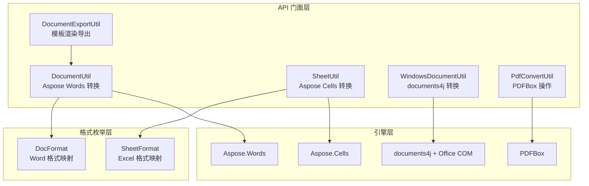

# i2f-extension-document

> **基于 Aspose/Apache POI 生态的办公文档格式转换与处理套件 / 将 Word/Excel/PDF 文档的格式互转、模板渲染、文本提取与图片转存能力整合为统一工具门面**（7 源文件共 574 行、双包族 `i2f.extension.document.formats`/`.pdf`/`.word`、1 资源目录含 3 个 lib JAR + 1 测试资源目录、1 测试资源，依赖 `i2f-io-stream`/`i2f-io-file`/`i2f-extension-velocity` + 5 个三方库 system/provided）。

## 模块路径

- `i2f-extension/i2f-extension-document/pom.xml`
- 相对于仓库根目录：`i2f-extension/i2f-extension-document`

## 模块依赖

### 内部模块（compile 依赖）

| Maven 坐标 | scope | optional | 说明 |
|-----------|-------|----------|------|
| `i2f.turbo:i2f-io-stream:1.0-jdk8` | compile | false | 流工具（`StreamUtil.readString`/`readBytes`/`streamCopy` 用于文件读写与流复制） |
| `i2f.turbo:i2f-io-file:1.0-jdk8` | compile | false | 文件工具（`FileUtil.getTempFile`/`save` 用于临时文件管理） |
| `i2f.turbo:i2f-extension-velocity:1.0-jdk8` | compile | false | Velocity 模板引擎（`VelocityGenerator.render` 用于 Word XML 模板渲染） |

### 三方依赖（system + provided）

| Maven 坐标 | 版本 | scope | optional | 说明 |
|-----------|------|-------|----------|------|
| `com.aspose.words:aspose-words` | 15.8.0-jdk16 | system | — | Aspose.Words 本地 JAR（`lib/aspose-words-15.8.0-jdk16.jar`），Word 文档格式转换核心引擎 |
| `com.aspose.cells:aspose-cells` | 8.5.2-jdk16 | system | — | Aspose.Cells 本地 JAR（`lib/aspose-cells-8.5.2-jdk16.jar`），Excel 文档格式转换核心引擎 |
| `com.sum.media:imageio` | 1.1 | system | — | JAI ImageIO 本地 JAR（`lib/jai_imageio-1.1.jar`），Excel 转 TIFF 时依赖 |
| `com.documents4j:documents4j-local` | 1.1.10 | provided | false | documents4j 本地转换器（依赖本机 Office COM 组件，仅 Windows 可用） |
| `com.documents4j:documents4j-transformer-msoffice-word` | 1.1.10 | provided | false | documents4j Word 转换器（配合 documents4j-local 使用） |
| `org.apache.pdfbox:pdfbox` | 2.0.29 | provided | true | PDFBox 核心库，PDF 文本提取与图片渲染 |

## 模块设计

### 包结构

```
i2f.extension.document
├── formats
│   ├── excel
│   │   ├── SheetFormat.java       Excel 格式枚举（映射 Aspose.Cells.SaveFormat）
│   │   └── SheetUtil.java          Excel 格式转换支持（含内置 License + PDF 特殊选项）
│   └── word
│       ├── DocFormat.java          Word 格式枚举（映射 Aspose.Words.SaveFormat）
│       ├── DocumentUtil.java       Aspose.Words 格式转换核心（含内置 License + 字体路径搜索）
│       └── WindowsDocumentUtil.java documents4j Windows-only 转换（Office COM 桥接）
├── pdf
│   └── PdfConvertUtil.java         PDFBox 操作（文本提取 + 逐页转 PNG）
└── word
    └── DocumentExportUtil.java     Word 模板渲染导出（Velocity + Base64 图片嵌入）
```

### 双引擎架构

| 引擎 | 支撑库 | 用途 | 平台限制 |
|------|--------|------|---------|
| **Aspose 引擎** | `aspose-words` / `aspose-cells` | Word/Excel 主格式转换（HTML/DOCX/PDF/PNG/TIFF/CSV 等） | 无（纯 Java） |
| **documents4j 引擎** | `documents4j-local` + Office COM | Word ↔ PDF/HTML 转换（委托本机 Office 应用渲染） | **仅 Windows** |
| **PDFBox 引擎** | `pdfbox` | PDF 文本提取 + 逐页转 PNG | 无（纯 Java） |

### 架构层次图



### 设计要点

1. **内置许可证硬编码**：`DocumentUtil` 和 `SheetUtil` 各自包含一份相同的 XML License 字符串（声明为 `Aspose.Total for Java Enterprise Edition`，有效期至 2099-12-31），启动时通过 `ByteArrayInputStream` 加载；`hasLicence` 用 `AtomicBoolean` 做一次性短路
2. **临时文件中转模式**：`DocumentUtil.convert(InputStream→OutputStream)` 和 `SheetUtil.convert(InputStream→OutputStream)` 均通过临时文件中转（`FileUtil.getTempFile()` + 写入 + 转换 + 读取 + finally 删除）
3. **字体路径搜索**：`DocumentUtil.licence()` 在设置许可的同时搜索四个候选字体目录（`fonts`/`resources/fonts`/`conf/fonts`/`/usr/share/fonts/chinese`），找到首个非空目录即设置 `FontSettings.setFontsFolder`
4. **模板渲染流水线**：`DocumentExportUtil.renderXmlWordTemplate()` 串联三步——读取 XML 模板 → `processXsTplImgParams` 将 `XSTPLIMG%04d` 占位符替换为 Base64 编码图片数据 → `VelocityGenerator.render` 渲染 Velocity 模板参数 → `DocumentUtil.convert` 输出目标格式
5. **PDF 特殊选项**：`SheetUtil.convert()` 当目标格式为 PDF 时，创建 `PdfSaveOptions` 并设置 `setAllColumnsInOnePagePerSheet(true)` 以确保每页完整显示所有列
6. **documents4j 一次性转换器**：`WindowsDocumentUtil` 每次转换新建 `LocalConverter.builder().build()`，转换完成后立即 `shutDown()`
7. **PDFBox 资源管理**：`PdfConvertUtil.extractText` 和 `pdf2images` 均使用 try-with-resources 确保 `PDDocument` 自动关闭

## 模块目的

将办公文档（Word/Excel/PDF）的格式互转、模板渲染、文本提取与图片转换能力封装为易于使用的工具门面，屏蔽底层 Aspose / documents4j / PDFBox 的 API 差异，提供一致的编程接口。

## 模块功能

1. **Word 格式互转**：`DocumentUtil` 支持 HTML/DOCX/DOC/RTF/PDF/PNG/TIFF/SVG/EPUB/XPS 等 20+ 格式互转
2. **Excel 格式互转**：`SheetUtil` 支持 XLSX/XLS/CSV/PDF/TIFF/HTML/ODS/SVG 等 20+ 格式互转
3. **Word 模板渲染导出**：`DocumentExportUtil` 基于 Velocity 模板引擎 + Base64 嵌入图片，将 XML 格式的 Word 模板渲染后导出为任意格式
4. **Windows Office COM 转换**：`WindowsDocumentUtil` 借助 documents4j 委托本机 Office 应用进行 Word↔PDF/HTML 转换
5. **PDF 文本提取**：`PdfConvertUtil.extractText` 支持按页码范围提取纯文本
6. **PDF 转 PNG 图片**：`PdfConvertUtil.pdf2images` 逐页渲染为 PNG（150 DPI）
7. **格式枚举映射**：`DocFormat`/`SheetFormat` 枚举将格式名称映射为 Aspose 原生 `SaveFormat` 常量

## 模块主要使用方法

### 1. Word 格式互转

```java
// Word 转 PDF
DocumentUtil.word2pdf(new File("input.docx"), new File("output.pdf"));

// Word 转 PNG（逐页渲染）
DocumentUtil.word2png(new File("input.docx"), new File("output.png"));

// HTML 转 Word
DocumentUtil.html2word(new File("input.html"), new File("output.docx"));

// 流式转换（任意格式）
try (InputStream is = new FileInputStream("input.docx");
     OutputStream os = new FileOutputStream("output.pdf")) {
    DocumentUtil.convert(is, DocFormat.PDF, os);
}
```

### 2. Excel 格式互转

```java
// Excel 转 PDF（自动设置 allColumnsInOnePagePerSheet）
SheetUtil.excel2pdf(new File("input.xlsx"), new File("output.pdf"));

// Excel 转 CSV
SheetUtil.excel2csv(new File("input.xlsx"), new File("output.csv"));

// Excel 转 TIFF（需 jai_imageio）
SheetUtil.excel2tiff(new File("input.xlsx"), new File("output.tiff"));
```

### 3. Word 模板渲染

```java
// XML 模板中的占位符与 Velocity 变量
// 图片占位符：XSTPLIMG0000、XSTPLIMG0001 ...
// Velocity 变量：${title}、${date} ...

Map<String, Object> params = new HashMap<>();
params.put("title", "报告标题");
params.put("date", "2024-01-01");

Map<Integer, File> imgMap = new HashMap<>();
imgMap.put(0, new File("logo.png"));

try (InputStream tplIs = new FileInputStream("template.xml");
     OutputStream os = new FileOutputStream("output.docx")) {
    DocumentExportUtil.renderXmlWordTemplate(tplIs, "UTF-8",
        params, imgMap, SaveFormat.DOCX, os);
}
```

### 4. PDF 文本提取与转图

```java
// 提取全文
String text = PdfConvertUtil.extractText(new File("doc.pdf"));

// 提取第 3-5 页
String partial = PdfConvertUtil.extractText(new File("doc.pdf"), 3, 5);

// PDF 逐页转 PNG
List<File> images = PdfConvertUtil.pdf2images(
    new File("doc.pdf"), new File("output/images/"));
```

### 5. Windows Office COM 转换（需本机安装 Office）

```java
// Word 转 PDF
WindowsDocumentUtil.word2pdf(new File("input.docx"), new File("output.pdf"));

// HTML 转 Word
WindowsDocumentUtil.html2word(new File("input.html"), new File("output.docx"));
```

## 模块特性总结

1. **多引擎统一门面**：Aspose（Word + Excel）+ documents4j（Windows Office COM）+ PDFBox 三种引擎通过同一模块的门面类暴露
2. **内置许可证**：`DocumentUtil` 和 `SheetUtil` 内置硬编码 License XML，启动自动加载，无需外部许可证文件
3. **模板+图片流水线**：`DocumentExportUtil` 将 Velocity 模板渲染与 Base64 图片嵌入串联，适合动态生成含图片的 Word 文档
4. **临时文件安全**：`convert(InputStream→OutputStream)` 采用临时文件中转 + finally 清理，避免直接操作输入流
5. **PDF 全列适配**：Excel 转 PDF 时自动 `setAllColumnsInOnePagePerSheet(true)`，避免宽表格分页截断

## 模块瑕疵或错误

1. **内置 License 法律风险**：`DocumentUtil.LICENSE_TEXT` / `SheetUtil.LICENSE_TEXT` 硬编码的 Aspose 许可证 XML 声明为 `Enterprise Edition` 且有效期至 2099 年，实质为未经授权的破解许可，在商业环境中使用存在版权风险。同时该方法通过 `catch (Exception e) { e.printStackTrace(); }` 静默处理加载失败，许可证缺失时无告警

2. **临时文件泄漏风险**：`DocumentUtil.convert(InputStream, int, OutputStream)` 中 `FileUtil.getTempFile()` 和 `SheetUtil.convert` 的临时文件删除位于 `finally` 块，但如果 `FileUtil.save` 或 Aspose 转换抛出异常导致 `outFile` 尚未创建即进入 finally，`outFile.delete()` 对不存在文件无影响；更严重的是 `FileUtil.getTempFile()` 本身在磁盘满等极端条件下可能抛异常，此时 `wordFile` 引用尚未赋值，finally 中的 `wordFile.delete()` 将 NPE

3. **System-scope 依赖不可发布**：`aspose-words`、`aspose-cells`、`jai_imageio` 三个 JAR 以 `system` scope + `systemPath` 从 `lib/` 目录引入，这些 JAR 不在任何 Maven 仓库中，导致模块无法被标准 Maven 构建工具（如 CI 服务器）直接编译——需要手动将 lib/ 目录部署到构建环境

4. **空 catch 吞异常**：`DocumentExportUtil.processXsTplImgParams` 的 `catch (Exception e) { }` 为空块，图片 Base64 编码或替换过程中的任何异常（如文件权限、OOM）被静默吞掉，调用方完全感知不到错误

5. **字体路径硬编码混乱**：`DocumentUtil.fontsPaths` 同时包含相对路径（`fonts`、`resources/fonts`、`conf/fonts`）和 Linux 绝对路径（`/usr/share/fonts/chinese`），且搜索逻辑依赖工作目录——在生产环境中工作目录不可控，这些相对路径几乎总是找不到字体

6. **documents4j 每次新建/销毁转换器**：`WindowsDocumentUtil.convert()` 每次调用都 `LocalConverter.builder().build()` 再 `shutDown()`，未复用转换器实例，频繁创建/销毁带来不必要的开销。同时 `shutDown()` 后未处理未完成任务（`execute()` 同步调用，实际不影响）

7. **PDFBox 转图无图像格式参数**：`PdfConvertUtil.pdf2images` 固定使用 PNG 格式 + 150 DPI，调用方无法自定义格式（如 JPG）或分辨率

8. **SheetUtil 流式转换无 finally 保护**：`SheetUtil.convert(InputStream, int, OutputStream)` 在 finally 中删除临时文件，但若中间步骤抛出异常，输入/输出流未关闭——与 `DocumentUtil` 的同名方法（有 `streamCopy` 负责关闭）不一致

9. **AI 模块中未使用的 License 双份**：`DocumentUtil` 和 `SheetUtil` 各自维护独立的 `hasLicence` 标志和 `LICENSE_TEXT`，两份 License 字符串完全重复（440 字符），违背 DRY 原则。若许可证需要更新，必须两处同步修改

10. **Aspose 版本过旧**：`aspose-words` 15.8.0（2015 年发布）、`aspose-cells` 8.5.2（同样 2015 年）均为考古级版本，对较新的 DOCX/OOXML 规范支持有限，可能在高版本 Office（2019+/365）文档上出现布局偏差或渲染异常

## 消费方情况

| 消费类型 | 位置 | 说明 |
|---------|------|------|
| **聚合依赖** | `i2f-extension-all/pom.xml` | POM 聚合编译/打包 |
| **父模块注册** | `i2f-extension/pom.xml` | modules 列表注册 |
| **根 POM 版本管理** | `pom.xml`（L990） | dependencyManagement 统一版本 |
| **生产消费** | `i2f-springboot-ops-starter` | `RagAutoConfiguration.java` + `TmpFileTools.java` 共 2 处 `import i2f.extension.document.pdf.PdfConvertUtil`，用于 RAG 文档解析与 AI Tool 文件处理 |