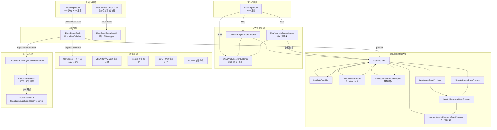
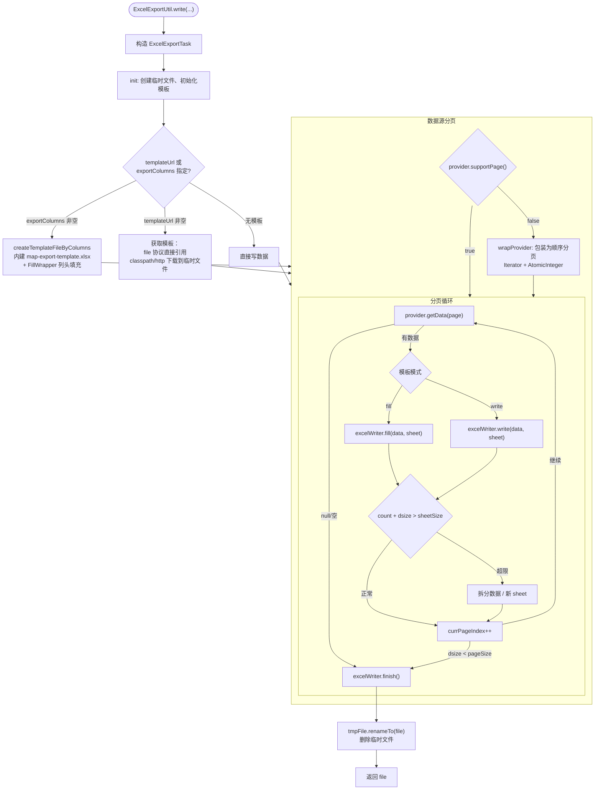

# i2f-extension-easyexcel

> **基于 Alibaba EasyExcel 的 Excel 导入/导出工具套件 / 将 EasyExcel API 装配为多数据源策略的数据提供者 + 多格式转换器 + 注解驱动样式的完整导入/导出框架**（约 53 源文件共约 4200 行、5 包族 `i2f.extension.easyexcel`/`.core`/`.annotation`/`.style`/`.complex`、1 资源文件、3 测试文件，依赖 `easyexcel:4.0.3` + `spring-jdbc`/`mybatis:3.5.19`/`jackson` provided + optional，内部依赖 `i2f-reflect`/`i2f-text`/`i2f-resources`）。

## 模块路径

- `i2f-extension/i2f-extension-easyexcel/pom.xml`
- 相对于仓库根目录：`i2f-extension/i2f-extension-easyexcel`

## 模块依赖

### 内部模块（compile 依赖）

| Maven 坐标 | scope | optional | 说明 |
|-----------|-------|----------|------|
| `i2f.turbo:i2f-text:1.0-jdk8` | compile | false | 文本工具（`StringUtils.isEmpty` 用于注解样式 SpEL 表达式空判断） |
| `i2f.turbo:i2f-reflect:1.0-jdk8` | compile | false | 反射工具（`ReflectResolver.getFields`/`getAnnotation`/`getAnnotations` 用于列发现与注解解析） |
| `i2f.turbo:i2f-resources:1.0-jdk8` | compile | false | 资源工具（`ResourceUtil.getClasspathResourceAsStream` 用于加载内建模板） |

### 三方依赖（provided + optional）

| Maven 坐标 | 版本 | scope | optional | 说明 |
|-----------|------|-------|----------|------|
| `com.alibaba:easyexcel` | 4.0.3 | provided | true | 核心 Excel 读写引擎（`EasyExcel` 读写器 + `AnalysisEventListener` + `Converter` + `WriteHandler`） |
| `org.springframework:spring-context` | ${spring.version} | provided | true | Spring 上下文（`StringUtils` 路径路由拼接，`complex` 包使用） |
| `org.springframework:spring-expression` | ${spring.version} | provided | true | Spring 表达式引擎（`SpelExpressionParser`，注解样式条件 `#{val > 30}`） |
| `org.springframework:spring-jdbc` | ${spring.version} | provided | true | Spring JDBC（`JdbcTemplate`，`JpaStreamDataProvider` 流式读取） |
| `org.mybatis:mybatis` | 3.5.19 | provided | true | MyBatis 框架（`Cursor`/`SqlSession`/`SqlSessionFactory`，`MybatisCursorDataProvider` 流式读取） |
| `com.fasterxml.jackson.core:jackson-core` | ${jackson.version} | provided | true | Jackson 核心（JSON 序列化/反序列化，转换器 JSON 字符串 <-> 对象） |
| `com.fasterxml.jackson.core:jackson-databind` | ${jackson.version} | provided | true | Jackson 数据绑定 |
| `org.projectlombok:lombok` | ${lombok.version} | provided | - | 编译期注解（`@Data`/`@NoArgsConstructor`） |

## 模块设计

### 包结构

```
i2f.extension.easyexcel
├── ExcelExportUtil.java          # 导出核心门面，约 21 个静态重载
├── ExcelImportUtil.java          # 导入核心门面
├── annotation/
│   ├── ExcelTag.java             # 字段标签注解（包含/排除列）
│   ├── ExcelCellStyle.java       # 单元格样式注解（可重复，含 SpEL 条件）
│   └── ExcelCellStyles.java      # 可重复注解容器
├── complex/
│   ├── ExcelExportComplexUtil.java   # 复杂模板导出门面
│   └── core/
│       └── EasyExcelComplexUtil.java # 递归展平嵌套 Bean/Map 为 FillWrapper
├── core/
│   ├── ExcelExportTask.java      # 导出核心引擎（737 行）
│   ├── ExcelExportColumn.java    # 导出列定义（title + prop）
│   ├── ExcelExportMode.java      # 导出模式枚举（PAGE / ALL）
│   ├── ExcelExportPage.java      # 分页模型（index + size）
│   ├── IDataProvider.java        # 数据提供者接口 + 静态工厂
│   ├── MapAnalysisEventListener.java   # Map 导入监听器
│   ├── ObjectAnalysisEventListener.java # 类型化导入监听器
│   ├── WrapAnalysisEventListener.java  # 通用 Wrap 监听器骨架
│   ├── IDataHoldCellWriteHandler.java  # 数据持有写处理器
│   ├── IDataHoldStyleCellWriteHandler.java # 样式写处理器
│   ├── convertor/
│   │   ├── Convertors.java       # 转换器注册中心（static + SPI）
│   │   ├── enums/
│   │   │   └── AbsEnumStringConvertor.java  # 枚举 <-> String 转换器骨架
│   │   ├── json/
│   │   │   ├── AbsObjectJsonStringConvertor.java # JSON 字串转换器骨架
│   │   │   ├── collection/       # 8 种集合类型 JSON 转换器
│   │   │   └── map/              # 7 种 Map 类型 JSON 转换器
│   │   ├── atomics/              # AtomicBoolean/Integer/Long 数字/布尔转换器
│   │   └── sql/                  # SqlDate/Time/Timestamp 转换器
│   └── impl/
│       ├── DefaultDataProvider.java         # Function 回调
│       ├── ListDataProvider.java            # List 包装
│       ├── ServiceDataProviderAdapter.java  # Service 适配器
│       ├── AbstractIteratorResourceDataProvider.java # 迭代器资源骨架
│       ├── IteratorResourceDataProvider.java         # 通用实现
│       ├── mybatis/
│       │   ├── MybatisCursorDataProvider.java        # MyBatis Cursor 流式
│       │   └── MybatisCursorList.java                # Cursor -> List
│       └── jpa/
│           └── JpaStreamDataProvider.java             # JPA Stream 流式
└── style/
    ├── AnnotationExcelStyleCellWriteHandler.java  # 注解驱动样式处理器
    ├── AnnotationStyleUtil.java                    # 注解样式核心解析引擎
    ├── ExcelStyleCallbackMeta.java                 # 样式回调元数据
    ├── SpelEnhancer.java                           # SpEL 表达式增强器
    └── StandaloneSpelExpressionResolver.java       # 独立 SpEL 解析器
```

### 整体架构



### 导出流程



### 设计要点

1. **数据提供者策略模式**：`IDataProvider` 接口定义 `getData(page)`/`getDataClass()`/`supportPage()`，7 种实现覆盖 List/Function/Service/MyBatis Cursor/JPA Stream 等场景
2. **Command 模式导出引擎**：`ExcelExportTask` 同时实现 `Runnable` + `Callable<File>`，支持 `Consumer<ExcelExportTask>` 回调修改属性后再执行
3. **分页-分 Sheet 两级拆分**：默认 `pageSize=5000`（单次查询最大数）+ `sheetSize=65530`（单 sheet 最大行），数据超出自动创建 sheet-n
4. **模板-写入双模式**：`useTemplate=true` 时使用 `EasyExcel.fill()`（填充模式），否则使用 `EasyExcel.write()`（写模式）；空数据时自动创建空表头
5. **注解驱动样式系统**：`@ExcelCellStyle` 支持 SpEL 条件表达式（`#{val > 30}`），可控制字体/颜色/对齐/超链接/批注/数据验证（下拉选择框）
6. **转换器注册中心**：`Convertors` 使用 `CopyOnWriteArrayList` 静态初始化 23 个预置转换器 + `ServiceLoader` SPI 扩展；覆盖 SQL 日期/Atomic 类型/集合 JSON/Map JSON
7. **导入三层级监听器**：`WrapAnalysisEventListener` 骨架（verify/convert/beforeConvert 三钩子 + batchSize 分批回调）→ `MapAnalysisEventListener`（Integer→String 头映射）→ `ObjectAnalysisEventListener`（简单类型化）
8. **复杂模板展平算法**：`EasyExcelComplexUtil.recursiveFoundFillData` 递归遍历 Bean/Map 的所有字段和嵌套对象，将 `.` 路径替换为 `$` 分隔（如 `role$parent.roleKey`），自动生成 `FillWrapper`
9. **迭代器流式资源管理**：`AbstractIteratorResourceDataProvider` 通过 `AtomicBoolean hasInit` 保证单次初始化，`finisher` 在数据取尽时自动 `close() + finalize()` 兜底
10. **空数据类型安全**：`ExcelExportTask` 无数据时 `updateWriteHandler(new ArrayList<>())` 确保表头正确生成；多 sheet 模板模式下用完克隆的 sheet 自动删除

## 模块目的

封装 Alibaba EasyExcel 的导入/导出 API，提供：
- **统一的静态门面** + **多数据源策略族**，屏蔽 EasyExcel 的逐级构建 API
- **注解驱动样式系统** + **SpEL 条件渲染**，支持条件字体/颜色/超链接/批注/数据验证
- **自动分 sheet** + **模板填充**，支持大数据量导出与复杂模板渲染
- **丰富类型转换器**，覆盖 SQL 日期、Atomic 类型、集合/Map 的 JSON 序列化
- **导入验真/转换双钩子** + **分批回调**，支持异常数据分离与批量处理

## 模块功能

1. **Excel 导出**：List<Map>/List<Bean>/Function 分页回调/Service 适配器，支持自定义 sheet 名、模板 URL、临时文件、Consumer 回调配置
2. **Excel 导入**：Map 模式（头映射为列名）/Bean 模式（自动映射字段），支持验真过滤 + 数据转换 + 分批回调
3. **复杂模板导出**：递归展平嵌套 Bean/Map 为 FillWrapper，支持 `$` 分隔路径的多块同 sheet 渲染
4. **注解样式控制**：`@ExcelCellStyle` 可重复注解，SpEL 表达式条件判断，支持字体/颜色/对齐/超链接/批注/下拉选择框
5. **类型转换器**：SqlDate/Time/Timestamp ↔ String、AtomicBoolean/Integer/Long ↔ Number/Boolean、Collection/Set/Map ↔ JSON String、Enum ↔ String
6. **流式大数据读取**：MyBatis Cursor + JPA Stream 流式数据提供者，避免全量加载 OOM
7. **标签过滤**：`@ExcelTag` 注解标记字段为包含/排除列，运行时通过 `exportColumnTags`/`excludeColumnTags` 控制
8. **自动分 sheet**：单 sheet 超 `sheetSize`(65530) 行自动创建 `sheetName-n`
9. **模板模式**：支持 EasyExcel 模板填充语法 + 内建 `map-export-template.xlsx` 动态列头
10. **临时文件管理**：导出使用临时文件写入，完成后 `renameTo` 目标；ForkJoinPool 4 线程异步清理

## 模块主要使用方法

### 1. 基本导出 - List<Map>

```java
List<Map<String, Object>> data = new ArrayList<>();
Map<String, Object> row = new HashMap<>();
row.put("name", "张三");
row.put("age", 25);
data.add(row);

ExcelExportUtil.write(data, new File("./output.xlsx"));
```

### 2. 分页导出 - Bean + Function

```java
IDataProvider provider = IDataProvider.of(page -> {
    List<UserVo> list = userService.page(page.getIndex() * page.getSize(), page.getSize());
    return list;
}, UserVo.class);

ExcelExportUtil.write(provider, new File("./users.xlsx"), "用户表",
        null, null, (task) -> {
    task.setPageSize(5000);
    task.setSheetSize(65530);
});
```

### 3. Service 适配器导出

```java
ExcelExportUtil.write(new ServiceDataProviderAdapter<UserQuery, UserService, UserVo>(
        ExcelExportMode.ALL, userService, query, UserVo.class) {
    @Override
    public List<UserVo> doRequestData(UserService service, ExcelExportPage page, UserQuery req, Object... args) {
        return service.queryPage(req, page.getIndex() * page.getSize(), page.getSize());
    }
}, file, "用户表", templateFile, null);
```

### 4. MyBatis Cursor 流式导出

```java
MybatisCursorDataProvider<UserVo> provider = new MybatisCursorDataProvider<>(
        sqlSessionFactory, UserVo.class,
        UserMapper.class, mapper -> mapper.scanAll());

ExcelExportUtil.write(provider, new File("./users.xlsx"), "用户表");
```

### 5. 导入 - Bean 模式

```java
// 带验真与转换
List<UserVo> data = ExcelImportUtil.read(file, UserVo.class,
        new ObjectAnalysisEventListener<UserVo>(500, (legal, illegal) -> {
            System.out.println("合法数据: " + legal.size() + ", 非法数据: " + illegal.size());
            // 批量处理
        }));
```

### 6. 导入 - Map 模式

```java
List<Map<String, Object>> data = ExcelImportUtil.read(new FileInputStream(file));
```

### 7. 复杂模板导出

```java
// 模板中使用 {name} {role$parent.roleKey} {role$perms.name} {addressList.address}
ExcelExportComplexUtil.exportComplex(outputFile, templateFile, 0, "sheet1", dataMap);
```

### 8. 注解样式控制

```java
@ExcelCellStyle(head = true, backgroundColor = IndexedColors.LIGHT_YELLOW, fontBold = Bool.TRUE)
public class UserVo {
    @ExcelProperty("用户名")
    @ExcelCellStyle(hyperLink = true, fontColor = IndexedColors.BLUE)
    private String username;

    @ExcelCellStyle(spel = "#{val > 30}", fontColor = IndexedColors.RED)
    @ExcelCellStyle(spel = "#{val <= 30}", fontColor = IndexedColors.BLUE)
    private int age;

    @ExcelCellStyle(selection = {"正常", "禁用"})
    private String status;

    @ExcelTag({"no-export"})
    @ExcelProperty("密码")
    private String password;
}
```

### 9. 排除/包含列

```java
task.setExcludeColumnTags(new HashSet<>(Arrays.asList("no-export")));
// 或
task.setExportColumnTags(new HashSet<>(Arrays.asList("export")));
```

## 模块特性总结

- **一站式导出门面**：21+ 静态 write 重载覆盖 List/Bean/Function/Service/Cursor 等多种数据源
- **自动分 Sheet 与分页**：`pageSize` + `sheetSize` 双阈值自动拆分，无缝处理大数据量
- **策略数据提供者**：7 种 `IDataProvider` 实现满足常见业务场景
- **注解驱动样式系统**：@ExcelCellStyle + SpEL 条件表达式实现条件格式
- **丰富类型转换器**：23+ 预置 Converter + SPI 扩展
- **复杂模板递归展平**：支持任意深度嵌套 Bean/Map 的模板渲染
- **导入验真双钩子**：verify + convert 分离，非法数据自动隔离
- **迭代器资源自动释放**：`AbstractIteratorResourceDataProvider` finalize 兜底 + finisher 钩子
- **零侵入集成**：所有三方依赖 `provided + optional`，使用方按需引入

## 模块瑕疵或错误

1. **空 catch 吞异常多处**：`ExcelExportUtil.urlOfFile`(L149-151)、`ExcelExportTask`(L629-640, L717-718)、`AnnotationStyleUtil`(L154-157) 等多处空 catch 静默吞异常，导致 IO 错误/反射异常/SpEL 解析异常被无提示忽略
2. **`deletePool` 静态 ForkJoinPool 未关闭**：`ExcelExportTask.deletePool`(L612) 为静态字段，4 线程，应用关闭时线程池不自动停止，可能导致资源泄漏
3. **`createTemplateFileByColumns` 创建双临时文件**：L677-678 先后创建 `templateFile` + `ret` 两个临时文件，模板文件填完后异步删除，`ret` 作为结果返回，可能因异步删除时序导致读取竞争
4. **非分页数据包装器严格顺序校验**：L390-391 要求 `page.getIndex()` 必须从 0 开始顺序递增，否则抛 `IllegalStateException`，对并发/并行导出不友好
5. **模板 URL classpath 下载为临时文件**：L322-330 将 classpath 资源复制到本地临时文件，每导出一次复制一次，无缓存
6. **`useFirstSheetTemplate` 克隆超量**：L442-445 `maxFirstSheetCloneCount=100` 硬克隆 sheet，用完 `removeSheetAt` 删除多余，对少量数据场景浪费
7. **`AnnotationStyleUtil` 并发缓存字段引用**：L231 `ConcurrentHashMap<Field, ExcelStyleCallbackMeta>` 使用 Field 对象作 key，不同 ClassLoader 的 Field 不相等，但反射获取的 Field 同一 ClassLoader 下可重用
8. **`resolveSpelExpression` 不处理解析异常**：`StandaloneSpelExpressionResolver.getBool` 内部可能抛异常，`AnnotationStyleUtil.resolveSpelExpression`(L314-318) 未包装异常信息
9. **`WrapAnalysisEventListener.batchConsumer` 空时行数不准确**：L75-81 在 `currSize == batchSize` 时重置列表，但 `batchConsumer` 为空时不触发、也不重置，`currSize` 持续增长失去分批意义
10. **`IDataHoldCellWriteHandler.getRawData` 下标越界**：L39-46 无边界检查，`list.get(dataIndex)` 当 `rowIndex < headCount + offsetIndex` 时抛 IndexOutOfBoundsException
11. **`ServiceDataProviderAdapter.mode` 默认 PAGE 但无分页实现**：L22 `mode = ExcelExportMode.ALL` 但 `supportPage()` 仅检查 mode 而子类可能不实现分页，职责不清晰
12. **`Convertors` SPI 加载错误不处理**：L51-53 `ServiceLoader.load(Converter.class)` 遍历时某个 SPI 实现构造函数抛异常，整个 static 初始化失败，模块无法加载

## 消费方情况

| 消费方 | 类型 | 说明 |
|-------|------|------|
| `i2f-extension-all` | POM 聚合 | `module` + `dependency` 声明 |
| `i2f-extension/pom.xml` | POM 模块注册 | `module` 声明 |
| 根 `pom.xml` | POM dependencyManagement | L995 版本注册 |
| 全仓 Java 源码 | 无源码级消费 | 仅测试文件自引用 |