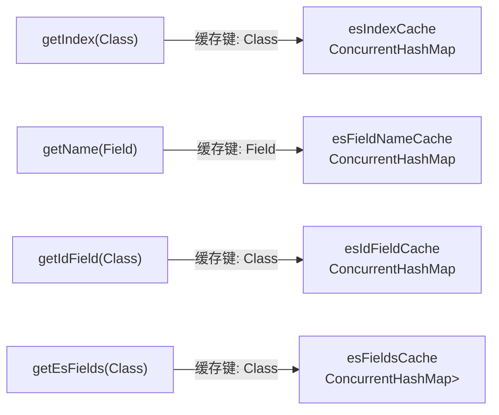
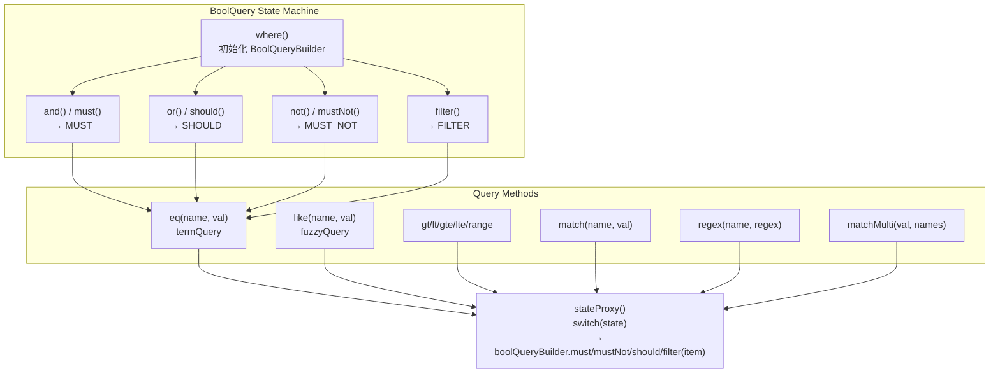

# i2f-extension-elasticsearch

> **基于 Elasticsearch RestHighLevelClient 7.6.2 的索引/文档/查询操作封装套件 / 将 ES REST API 装配为三层门面：原始操作门面 `EsManager` + POJO 注解映射层 `EsBeanManager` + 流式查询构建器 `EsQuery` + Spring Data 桥接 `SpringEsQuery`**（8 源文件共 1233 行、3 注解、单包族 `i2f.extension.elasticsearch`/`.annotation`、零测试零资源、1 内部 `readme.md`，依赖 `elasticsearch:7.6.2` + `elasticsearch-rest-high-level-client:7.6.2` + `spring-data-elasticsearch:4.0.6.RELEASE` + `spring-boot-starter-data-elasticsearch:2.3.7.RELEASE` 全部 provided + optional，内部依赖 `i2f-reflect`/`i2f-page`）。消费方 `i2f-springboot-ops-starter`（3 处 Java 引用） + `i2f-extension-all` 聚合。

## 模块路径

- `i2f-extension/i2f-extension-elasticsearch/pom.xml`
- 相对于仓库根目录：`i2f-extension/i2f-extension-elasticsearch`

## 模块依赖

### 内部模块（compile 依赖）

| Maven 坐标 | scope | optional | 说明 |
|-----------|-------|----------|------|
| `i2f.turbo:i2f-reflect:1.0-jdk8` | compile | false | 反射工具（`ReflectResolver.getAnnotation`/`getFieldsWithAnnotation`/`valueGet`/`getInstance`/`copyWeak` 用于注解解析与 Bean↔Map 转换） |
| `i2f.turbo:i2f-page:1.0-jdk8` | compile | false | 分页模型（`Page`/`ApiOffsetSize`/`ApiPage` 用于查询结果的分页封装与参数传递） |
| `org.projectlombok:lombok` | provided | true | 编译期注解（`@Data`/`@NoArgsConstructor` 用于 `EsMeta` POJO） |

### 三方依赖（全部 provided + optional）

| Maven 坐标 | 版本 | scope | optional | 说明 |
|-----------|------|-------|----------|------|
| `org.elasticsearch:elasticsearch` | 7.6.2 | provided | true | ES 核心库（`QueryBuilders`/`SearchHit`/`SearchHits`/`RestStatus`/`XContentType`/`ClusterHealthStatus` 等） |
| `org.elasticsearch.client:elasticsearch-rest-high-level-client` | 7.6.2 | provided | true | RestHighLevelClient 客户端（索引/文档/Bulk/Search API） |
| `org.springframework.data:spring-data-elasticsearch` | 4.0.6.RELEASE | provided | true | Spring Data ES 集成（`ElasticsearchRepository`/`NativeSearchQueryBuilder`，用于 `SpringEsQuery`） |
| `org.springframework.boot:spring-boot-starter-data-elasticsearch` | 2.3.7.RELEASE | provided | true | Spring Boot ES Starter（传递 `spring-data-elasticsearch` + 自动装配） |

## 模块设计

### 包结构

```
i2f.extension.elasticsearch
├── EsManager.java              (456行)  RestHighLevelClient 原始操作门面
├── EsBeanManager.java          (300行)  POJO 注解映射层（@EsIndex/@EsId/@EsField）
├── EsMeta.java                  (23行)  连接元数据 POJO（URL列表/认证/连接池配置）
├── EsQuery.java                (338行)  流式查询构建器（Fluent API + BoolQuery 状态机）
├── SpringEsQuery.java           (78行)  Spring Data ES 桥接适配
└── annotation/
    ├── EsField.java             (15行)  字段注解（inclusion toggle + alias）
    ├── EsId.java                (13行)  文档 ID 标记注解
    └── EsIndex.java             (13行)  索引名注解
```

### 三层架构设计

本模块采用三层门面架构，每层职责清晰、从底层到高层逐步抽象：

```
┌──────────────────────────────────────────────────────────┐
│                    EsQuery / SpringEsQuery                │
│  Fluent API: select().from().where().eq().page().done()  │
│          -> SearchSourceBuilder / NativeSearchQueryBuilder│
└──────────────────────┬───────────────────────────────────┘
                       │ 依赖
┌──────────────────────▼───────────────────────────────────┐
│                    EsBeanManager                          │
│  @EsIndex/@EsId/@EsField 注解驱动 POJO 映射 CRUD         │
│  bean2EsMap() / esMap2Bean() / cached reflection          │
└──────────────────────┬───────────────────────────────────┘
                       │ 委托
┌──────────────────────▼───────────────────────────────────┐
│                    EsManager                              │
│  RestHighLevelClient API 封装                             │
│  索引管理 / 文档 CRUD / 批量操作 / 搜索                   │
└──────────────────────┬───────────────────────────────────┘
                       │ 持有
┌──────────────────────▼───────────────────────────────────┐
│              RestHighLevelClient                          │
│              (elasticsearch-rest-high-level-client)       │
└──────────────────────────────────────────────────────────┘
```

### 注解体系

| 注解 | 目标 | 成员 | 用途 |
|------|------|------|------|
| `@EsIndex` | TYPE | `value()` 索引名 | 自定义索引名，默认取 `Class.getSimpleName()` |
| `@EsId` | FIELD | `value()` (保留) | 标记文档 ID 字段，支持 1 个 |
| `@EsField` | FIELD | `value()` (inclusion=true/false), `alias()` (字段别名) | 控制字段是否纳入 ES，`value=false` 排除；`alias` 定义 ES 中字段名 |

### 缓存设计

`EsBeanManager` 维护 4 个静态 `ConcurrentHashMap` 缓存：



### EsQuery 状态机设计

`EsQuery` 通过 `state` 字段控制 BoolQuery 子句类型，支持链式切换：



### 设计要点

1. **三层门面分离**：底层 `EsManager` 只操作 Map/String 原始数据；中层 `EsBeanManager` 通过注解将 POJO ↔ Map 双向转换；上层 `EsQuery` 提供 SQL-like Fluent 查询构建
2. **ConcurrentHashMap 缓存**：4 个静态缓存避免每次反射，缓存键为 Class/Field 对象引用，运行期不失效
3. **BoolQuery 状态机**：通过 `state` 字段（MUST/MUST_NOT/SHOULD/FILTER）控制后续查询条件加入的子句，支持灵活的链式切换
4. **双连接串格式**：`getClient(String connectString)` 支持 `host:port,host:port` 逗号分隔；`getClient(EsMeta)` 支持完整 URL 格式 + 认证 + 连接池配置
5. **`IMMEDIATE` 刷新策略**：所有写入请求统一设置 `WriteRequest.RefreshPolicy.IMMEDIATE`，保证写入后立即可查
6. **Spring Data 桥接**：`SpringEsQuery` 将 `EsQuery` 内部状态（BoolQuery + 分页 + 排序）原位转换为 `NativeSearchQueryBuilder`，复用 `ElasticsearchRepository` 的 Spring Data 查询通道
7. **JSON DSL 直接解析**：`searchSourceBuilderFromJsonDsl` 通过 `JsonXContent.createParser` 解析原生 ES JSON DSL 字符串
8. **分页统一返回 `Page<Map<String,Object>>` / `Page<T>`**：复用 `i2f-page` 模块的 `Page` 模型，与仓库其他查询模块返回类型一致
9. **`EsMeta` 可配置化连接**：`maxConnTotal`/`maxConnPerRoute` 连接池参数 + `BasicCredentialsProvider` 认证，通过 `setHttpClientConfigCallback` 注入
10. **`@EsField(alias)` 别名机制**：字段重命名仅在 `getName()` 读取时生效，`esMap2Bean` 通过双循环反向匹配别名到原始字段名

## 模块目的

将 Elasticsearch RestHighLevelClient 的零散 API 收敛为三层统一的面向 Java 开发者的操作门面：
- **消除样板代码**：客户端创建/关闭、索引管理、文档 CRUD、查询构建的重复编码
- **POJO 零配置映射**：通过 `@EsIndex`/`@EsId`/`@EsField` 注解自动推导索引名/文档ID/字段映射，无需手动维护 Map 转换
- **Fluent SQL-like 查询**：`EsQuery` 提供 `.where().eq("field", val).and().gt("age", 18).page(0,10).done()` 链式构建，降低 QueryBuilder 学习成本
- **Spring Data 兼容**：`SpringEsQuery` 桥接到 Spring Data Elasticsearch 生态，可与 `ElasticsearchRepository` 配合使用

## 模块功能

1. **客户端工厂**：支持连接字符串/HttpHost/EsMeta 三种方式创建 RestHighLevelClient，内置 Basic 认证与连接池参数配置
2. **索引管理**：创建（含 mapping/setting JSON）、搜索、删除、存在性检查、集群健康状态查询
3. **文档单条操作**：插入/更新/删除/查询（支持 Map 与 JSON 两种数据格式）
4. **文档批量操作**：批量插入/更新/删除（Bulk API，支持 Map/JSON 数据格式）
5. **搜索查询**：SearchSourceBuilder 方式、JSON DSL 字符串方式、matchAll 快捷方式
6. **搜索结果分页**：统一返回 `Page<Map<String, Object>>` 分页模型，含总记录数
7. **POJO 注解映射 CRUD**：通过 `@EsIndex`/`@EsId`/`@EsField` 自动推导索引名和字段映射，Bean ↔ Map 双向转换
8. **流式查询构建器**：Fluent API 链式构建查询条件（eq/like/gt/lt/gte/lte/range/match/regex/matchMulti）+ 分页 + 排序 + 列选择
9. **Spring Data ES 桥接**：`SpringEsQuery.inflate()` 将 Fluent 查询状态转换为 `NativeSearchQueryBuilder`，支持 `ElasticsearchRepository` 原生查询
10. **JSON DSL 解析**：将原生 ES JSON 查询字符串解析为 `SearchSourceBuilder`

## 模块主要使用方法

### 1. 客户端创建

```java
// 连接字符串方式
EsManager manager = EsManager.manager("localhost:9200,192.168.1.53:9200");

// HttpHost 方式
EsManager manager = EsManager.manager(new HttpHost("localhost", 9200));

// EsMeta 方式（含认证与连接池配置）
EsMeta meta = new EsMeta();
meta.getUrls().add("http://localhost:9200");
meta.setUsername("elastic");
meta.setPassword("changeme");
meta.setMaxConnTotal(100);
meta.setMaxConnPerRoute(50);
RestHighLevelClient client = EsManager.getClient(meta);
EsManager manager = new EsManager(client);
```

### 2. 索引管理

```java
// 创建索引
boolean ok = manager.indexCreate("my_index");

// 带 mapping 创建
String mapping = "{\"properties\":{\"name\":{\"type\":\"keyword\"},\"age\":{\"type\":\"integer\"}}}";
manager.indexCreate("my_index", mapping);

// 索引列表
List<String> indices = manager.indexListAll();

// 判断存在
boolean exists = manager.indexExists("my_index");

// 删除索引
manager.indexDelete("my_index");

// 集群健康状态
ClusterHealthStatus status = manager.indexHealth("my_index");
```

### 3. 文档 CRUD

```java
// 插入文档（Map）
Map<String, Object> doc = new HashMap<>();
doc.put("name", "张三");
doc.put("age", 25);
boolean ok = manager.recordsInsert("my_index", "1", doc);

// 插入文档（JSON）
manager.recordsInsert("my_index", "2", "{\"name\":\"李四\",\"age\":30}");

// 更新文档
doc.put("age", 26);
manager.recordsUpdate("my_index", "1", doc);

// 获取文档
GetResponse resp = manager.recordsGet("my_index", "1");
Map<String, Object> source = resp.getSourceAsMap();
String json = resp.getSourceAsString();

// 删除文档
manager.recordsDelete("my_index", "1");

// 批量插入
Map<String, Map<String, Object>> batch = new HashMap<>();
batch.put("1", doc1);
batch.put("2", doc2);
manager.recordsBatchInsertMap("my_index", batch);
```

### 4. 搜索查询

```java
// SearchSourceBuilder 方式
SearchSourceBuilder builder = new SearchSourceBuilder()
    .query(QueryBuilders.termQuery("name", "张三"))
    .from(0).size(10);
Page<Map<String, Object>> page = manager.searchAsMap("my_index", builder);

// JSON DSL 方式
String dsl = "{\"query\":{\"term\":{\"name\":\"张三\"}},\"from\":0,\"size\":10}";
SearchResponse resp = manager.search("my_index", dsl);
```

### 5. Fluent 查询构建

```java
// 基本查询
Page<Map<String, Object>> page = manager.query()
    .from("my_index")
    .where().eq("name", "张三")
    .and().gt("age", 18)
    .asc("age")
    .page(0, 10)
    .searchAsMap();

// 复杂 BoolQuery
Page<Map<String, Object>> page = manager.query()
    .from("my_index")
    .where()
        .must().eq("status", "active")
        .should().match("title", "java")
        .should().match("title", "elasticsearch")
        .filter().gt("age", 18)
    .desc("createTime")
    .page(0, 20)
    .cols("id", "name", "title")
    .colsExclude("password")
    .searchAsMap();
```

### 6. POJO 注解方式

```java
// 定义 POJO
@EsIndex("user_index")
public class User {
    @EsId
    private String id;
    
    @EsField(alias = "user_name")
    private String name;
    
    @EsField(value = false)  // 排除此字段
    private String password;
    
    private Integer age;
    // getter/setter...
}

// 使用 EsBeanManager
EsBeanManager beanManager = manager.beanOps();

// 插入 Bean
User user = new User();
user.setId("1");
user.setName("张三");
user.setAge(25);
beanManager.recordsInsert(user);

// 查询为 Bean
Page<User> page = beanManager.query()
    .from(User.class)
    .where().eq("user_name", "张三")
    .searchAsBean(User.class);
```

### 7. Spring Data ES 桥接

```java
// 将 Fluent 查询转换为 Spring Data NativeSearchQueryBuilder
NativeSearchQueryBuilder nativeBuilder = manager.query()
    .from("my_index")
    .where().eq("name", "张三")
    .page(0, 10)
    .spring()
    .inflate()
    .done();

// 配合 ElasticsearchRepository 使用
@Autowired
private ElasticsearchRepository<User, String> repository;
Page<User> springPage = repository.search(nativeBuilder.build());
```

## 模块特性总结

1. **三层门面架构**：原始 API → POJO 映射 → Fluent 查询，逐层抽象，按需选择
2. **注解驱动映射**：`@EsIndex`/`@EsId`/`@EsField` 三注解覆盖索引名推导、文档 ID、字段包含与别名
3. **Fluent SQL-like API**：链式查询构建 + BoolQuery 子句状态机，接近 SQL 体验
4. **双数据格式支持**：Map/JSON 双格式的 CRUD 接口，适应不同场景
5. **批量操作统一 Bulk**：批量插入/更新/删除统一使用 BulkRequest，`IMMEDIATE` 刷新
6. **JSON DSL 原生解析**：支持原生 ES JSON 查询字符串直接转为 SearchSourceBuilder
7. **Spring Data 兼容**：桥接 `NativeSearchQueryBuilder`，可与 Spring Data Elasticsearch Repository 协作
8. **连接池可配置**：`EsMeta` 支持 `maxConnTotal`/`maxConnPerRoute` 连接池参数 + Basic 认证
9. **统一分页模型**：返回 `i2f.page.Page<T>` 与仓库其他模块的分页模型一致
10. **双重连接格式**：支持简单 `host:port` 逗号分隔和完整 URL 协议两种客户端创建方式

## 模块瑕疵或错误

1. **端口解析异常被吞**（`EsManager.java` L93-96）：`getClient(String connectString)` 中 `Integer.parseInt(host[1])` 的 try-catch 为空块，端口格式异常被静默吞掉，默认回退为 9200，用户无感知易导致连接错误。
2. **批量操作空列表 `get(0)` NPE**（`EsBeanManager.java` L231/L243/L253）：`recordsBatchInsert/Delete/Update` 直接 `list.get(0)` 获取首元素推导索引名，传入空列表抛 `IndexOutOfBoundsException`，应增加空值校验并返回 `false` 或抛合理异常。
3. **静态缓存无限增长**（`EsBeanManager.java` L43-46）：4 个 `ConcurrentHashMap` 只增不减、无容量上限/淘汰策略，运行期大量动态类加载场景可能产生内存泄漏。
4. **无参构造器空指针风险**（`EsBeanManager.java` L25-27）：`new EsBeanManager()` 后 `manager` 字段为 null，任何委托方法均抛 NPE，应初始化为 `throw new IllegalStateException("manager required")` 或 `Objects.requireNonNull`。
5. **`SpringEsQuery.inflate()` 空 BoolQuery**（`SpringEsQuery.java` L31）：直接使用 `esQuery.boolQueryBuilder` 而未调 `where()` 时为 null，`.withQuery(null)` 导致 Spring Data 抛出 `IllegalArgumentException`。
6. **`recordsInsert` 返回语义不可靠**（`EsManager.java` L241）：Insert 已存在文档时 ES 返回 OK（非 CREATED），但与 Update 返回 `RestStatus.OK` 状态码相同，无法区分插入与更新。应检查 `response.getResult()` 为 `DocWriteResponse.Result.CREATED`。
7. **`searchAll` 无分页/大小限制**（`EsManager.java` L433-446）：`searchAllAsMap` 默认 `matchAllQuery` 不设 from/size 上限，大数据量索引下返回全部文档导致 OOM 或超时，应设置默认分页（如 size=10000）或增加分页参数重载。
8. **`esMap2Bean` 别名查找 O(n²)**（`EsBeanManager.java` L151-171）：对每个 Map entry 遍历所有 Field 匹配别名，字段数多时性能差。应预计算 `Map<String, Field>` 别名索引。
9. **`EsManager.getClient(connectString)` 无认证支持**（`EsManager.java` L81-107）：简单逗号分隔 `host:port` 格式不支持 Basic 认证用户名/密码，需使用者手动拼接 `EsMeta` 或 `BasicCredentialsProvider`，与 `EsMeta` 方式功能不对称。
10. **`EsQuery.done()` 未处理无查询条件场景**（`EsQuery.java` L284-291）：未调 `where()` 时 `boolQueryBuilder` 为 null，`applyWhere()` 中 `builder.query(null)` 导致 ES 查询语义不确定（实际会 matchAll），应显式 fallback 为 `matchAllQuery()`。

## 消费方情况

| 消费方 | 类型 | 使用内容 |
|-------|------|---------|
| `i2f-springboot-ops-starter` | Java 源码（3 处 import） | `ElasticSearchOpsController` 使用 `EsManager`；`ElasticSearchOperateDto` 使用 `EsMeta`；`ElasticSearchOpsHelper` 使用 `EsManager` |
| `i2f-extension-all` | POM 聚合 | 聚合分发包 |
| `i2f-extension` 父 POM | POM modules 注册 | 子模块声明 |
| `pom.xml` 根 POM | POM dependencyManagement | 版本统一管理 |

## 源文档

模块源码目录下已有 `readme.md`（144 行开发者笔记），本次文档为按 `project-docs.md` 规范重新撰写的正式模块文档。