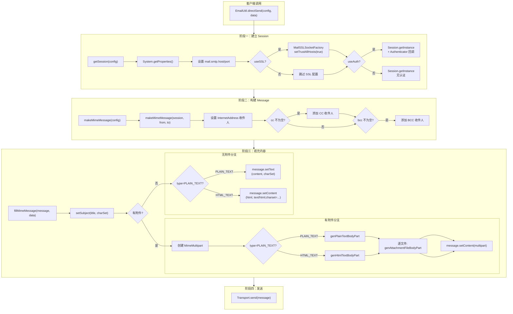

# i2f-extension-email

> **基于 JavaMail (javax.mail 1.6.2) 的邮件发送工具门面 / 将 SMTP 协议的发信流程封装为静态方法门面 + 流式配置构建器的薄适配层**（3 源文件共 396 行、单包族 `i2f.extension.email`/`.data`、零测试零资源，依赖 `javax.mail:1.6.2` + `javax.activation:1.1.1` 全部 provided，无内部 i2f 依赖）。

## 模块路径

- `i2f-extension/i2f-extension-email/pom.xml`
- 相对于仓库根目录：`i2f-extension/i2f-extension-email`

## 模块依赖

### 内部模块

无——本模块不依赖任何 i2f 内部模块。

### 三方依赖（全部 provided）

| Maven 坐标 | 版本 | scope | optional | 说明 |
|-----------|------|-------|----------|------|
| `com.sun.mail:javax.mail` | 1.6.2 | provided | false | JavaMail API 实现（SMTP 协议栈 + MIME 消息构建 + Transport 发送） |
| `javax.activation:activation` | 1.1.1 | provided | false | JavaBeans Activation Framework（`DataHandler`/`FileDataSource` 用于附件 MIME 类型推导） |
| `org.projectlombok:lombok` | 父 POM 管理 | provided | true | 编译期 `@Data` 注解生成 getter/setter/toString/equals/hashCode |

## 模块设计

### 包结构

```
i2f.extension.email
├── EmailUtil.java              # 核心发送门面（10 个静态方法）
└── data
    ├── EmailConfigData.java    # 邮件服务器配置 POJO（@Data + 流式 Builder）
    └── EmailSendData.java      # 邮件内容数据 POJO（@Data + 流式 Builder）
```

### 架构设计

本模块采用 **Facade Pattern + Fluent Builder Pattern** 两层结构：

- **Facade 层**（`EmailUtil`）：10 个静态方法，将 JavaMail 的 Session→Message→Transport 三阶段装配为一次 `directSend` 调用
- **Builder 层**（`EmailConfigData`/`EmailSendData`）：流式链式调用构建配置和内容对象

### 发送流程



### 预置邮箱配置

`EmailConfigData.Host` 接口定义了约 **20 个常见邮件服务商** 的 SMTP/POP3 服务器地址和端口常量：

| 服务商 | SMTP 服务器 | 默认端口 | SSL 端口 |
|-------|------------|---------|---------|
| 新浪 (sina.com) | smtp.sina.com.cn | 25 | - |
| 搜狐 (sohu.com) | smtp.sohu.com | 25 | - |
| 126 | smtp.126.com | 25 | - |
| 139 | smtp.139.com | 25 | - |
| 163 | smtp.163.com | 25 | - |
| QQ邮箱 | smtp.qq.com | 25 | - |
| QQ企业邮 | smtp.exmail.qq.com | 587 | 465 |
| Gmail | smtp.gmail.com | 587 | 995 |
| Yahoo | smtp.mail.yahoo.com | - | 587 |
| Outlook(Live) | smtp.live.com | 587 | 995 |
| Foxmail | smtp.foxmail.com | 25 | - |

### 设计要点

1. **零内部依赖**：本模块是 i2f-extension 中少数不依赖任何 i2f 内部模块的纯适配层
2. **SSL 信任所有证书**：`MailSSLSocketFactory.setTrustAllHosts(true)` 绕过证书验证，降低配置门槛但存在中间人攻击风险
3. **Authenticator 匿名内部类**：认证信息通过匿名 `Authenticator` 回调传入，非 Properties 明文传递
4. **未使用 Properties 的 user/password 属性**：L50-51 注释掉的代码表明设计者放弃将凭证放入 Properties 的方案
5. **`dot` 调用链**（`.sendFrom(...).sendTo(...).copyTo(...).build()`）：`EmailConfigData` 和 `EmailSendData` 均支持流式链式构建
6. **附件去重**：使用 `HashSet<String>` 存储附件路径，自动防止同一文件重复添加
7. **无 POP3/IMAP 支持**：模块仅封装 SMTP 发信，不包含收信能力

## 模块目的

将 JavaMail API 的复杂装配过程（Session 创建参数、MIME 消息构建、多部分内容组合、Transport 发送）简化为一次 `directSend` 调用，降低邮件发送功能的集成门槛。

## 模块功能

1. **SMTP 邮件发送**：支持普通文本和 HTML 格式邮件发送
2. **SSL 加密传输**：通过 `useSSL` 开关启用 SSL/TLS 加密通道，信任所有证书
3. **SMTP 认证**：通过 `useAuth` 开关启用用户名密码认证
4. **多收件人支持**：支持 TO（收件人）、CC（抄送）、BCC（密送）三种收件人类型
5. **附件发送**：支持 0-N 个文件附件，自动推导 MIME 类型
6. **自定义字符集**：支持指定邮件标题和内容的字符编码（默认 UTF-8）
7. **流式配置构建**：`EmailConfigData` 和 `EmailSendData` 均提供链式调用 Builder
8. **预置邮箱配置**：内置约 20 个常用邮件服务商的 SMTP 服务器地址和端口

## 模块主要使用方法

### 1. 引入依赖

```xml
<dependency>
    <groupId>i2f.turbo</groupId>
    <artifactId>i2f-extension-email</artifactId>
    <version>1.0-jdk8</version>
</dependency>
```

注意：运行时需自行声明 `javax.mail` 和 `javax.activation` 依赖（模块声明为 provided）。

### 2. 发送简单文本邮件

```java
EmailConfigData config = EmailConfigData.builder()
    .setServer("smtp.qq.com", 25)
    .setAuth("your@qq.com", "your-password")
    .sendFrom("your@qq.com")
    .sendTo("someone@example.com")
    .build();

EmailSendData data = EmailSendData.builder()
    .setTitle("测试邮件")
    .setContent("这是一封测试邮件的内容")
    .build();

EmailUtil.directSend(config, data);
```

### 3. 发送 HTML 邮件带附件

```java
EmailConfigData config = EmailConfigData.builder()
    .setServer("smtp.126.com", 25)
    .setAuth("user@126.com", "password")
    .sendFrom("user@126.com")
    .sendTo("to1@example.com", "to2@example.com")
    .copyTo("cc@example.com")
    .build();

EmailSendData data = EmailSendData.builder()
    .setType(EmailSendData.Type.HTML_TEXT)
    .setTitle("HTML 报告")
    .setContent("<h1>月报</h1><p>请查收附件</p>")
    .attach("report.pdf", "data.xlsx")
    .build();

EmailUtil.directSend(config, data);
```

### 4. 使用 SSL 加密发送（QQ企业邮）

```java
EmailConfigData config = EmailConfigData.builder()
    .setServer(EmailConfigData.Host.SMTP_EXMAIL_QQ_COM,
               EmailConfigData.Host.SMTP_EXMAIL_QQ_COM_PORT)
    .ssl(true)
    .setAuth("admin@company.com", "password")
    .sendFrom("admin@company.com")
    .sendTo("user@company.com")
    .build();
// ... then directSend
```

### 5. 分段构建（复用 Session/Message 对象）

```java
Session session = EmailUtil.getSession(config);
MimeMessage message = EmailUtil.makeMimeMessage(config);
EmailUtil.fillMimeMessage(message, data);
EmailUtil.send(message);
```

## 模块特性总结

1. **超薄门面**：仅 396 行源码，10 个静态方法，学习成本极低
2. **零内部依赖**：完全独立于 i2f 生态系统，可单独抽取使用
3. **流式 Builder**：配置和数据对象均支持链式调用，代码简洁
4. **预置邮箱库**：覆盖国内外约 20 个主流邮件服务商的 SMTP 配置
5. **SSL 一键开启**：`ssl(true)` 即可启用 SSL 加密，自动信任所有服务器证书

## 模块瑕疵或错误

1. **`mail.stmp.host` 拼写错误**（`EmailUtil.java:29`）：`System.getProperties().setProperty("mail.stmp.host", sendHost)` 中 `stmp` 应为 `smtp`。JavaMail 实际读取的 key 是 `mail.smtp.host`，因此该重载 `getSession(String)` 创建的 Session 的 host 属性实际上不会被 SMTP 协议栈识别，调用 Transport.send 时会因缺少有效 host 配置而失败。`getSession(EmailConfigData)` 重载使用正确的 `mail.smtp.host`（L37），不受影响。

2. **`System.getProperties()` 修改 JVM 全局状态**（`EmailUtil.java:28,36`）：直接操作 `System.getProperties()` 会污染 JVM 级系统属性。在多线程并发发信场景下，如果两个线程同时调用 `getSession` 设置了不同的 host/port，后设置的属性会覆盖前一个，导致竞态条件。应改用 `new Properties()` 创建隔离的 Properties 实例。

3. **SSL 信任所有证书**（`EmailUtil.java:42`）：`sslSocketFactory.setTrustAllHosts(true)` 禁用了所有 SSL 证书链验证，使加密传输降级为仅混淆，存在中间人攻击（MITM）风险。生产环境应替换为受信任的证书或使用自定义 TrustManager。

4. **无 try-finally 资源保护**：`Transport.send(message)`（L79）直接抛出 `MessagingException`，调用方需自行处理异常。当前设计下 `Message` 和 `Transport` 资源由 JavaMail 内部管理，但在异常或超时场景下 Transport 对象可能泄漏底层 Socket 连接。

5. **无 POP3/IMAP 收信支持**：模块仅封装 SMTP 发信能力，不提供收信、搜索、邮件箱管理等能力。`Host` 接口虽定义了 POP3 地址常量，但从未被代码引用。

6. **`attachFiles` 使用 `HashSet` 无序集合**（`EmailSendData.java:53`）：`HashSet<String>` 不保证附件添加顺序，多次调用 `attach` 后附件的排列顺序与添加顺序可能不一致。如需控制附件顺序，应改用 `LinkedHashSet`。

7. **`from` 和 `to` 空值无保护**：`EmailConfigData` 的 `from`/`to` 字段未做 null 检查。若 `from` 为 null，`makeMimeMessage` 调用 `new InternetAddress(null)` 会抛出 `AddressException`。类似地，`to` 数组若为 null/空，`makeMimeMessage` 中 `addrs` 数组长度为 0，发送时也会失败。

8. **`charSet` 参数直接字符串拼接**（`EmailUtil.java:144,150`）：`"text/plain;charset=" + charSet` 和 `"text/html;charset=" + charSet` 直接拼接用户输入，若 `charSet` 包含非法字符（如换行符），可能导致 MIME 头注入攻击。应使用 JavaMail 的 `MimeBodyPart.setText(content, charset)` 或 `MimeBodyPart.setContent(content, "text/plain", charset)` 等方法。

9. **无测试覆盖**：模块未包含任何测试文件，所有方法的正确性依赖 JavaMail 自身的行为，缺乏对 SSL/Auth/附件等组合场景的自动化验证。

10. **`getSession(String)` 重载行为不一致**（`EmailUtil.java:27-33`）：与 `getSession(EmailConfigData)` 不同，该重载仅设置 host 属性，不设置 port、SSL、Auth 等参数，且使用错误的属性名 `mail.stmp.host`。此方法是不可用的「陷阱 API」。

## 消费方情况

本模块无 Java 源码级 import 消费方，仅通过 POM 聚合引用：

| 消费方 | 类型 | 说明 |
|-------|------|------|
| `i2f-extension-all` | POM 聚合 | `i2f-extension-all/pom.xml:L105` compile 依赖 |
| `i2f-extension` | 父 POM | `i2f-extension/pom.xml:L39` 子模块注册 |
| 根 POM | dependencyManagement | `pom.xml:L1005` 版本统一管理 |