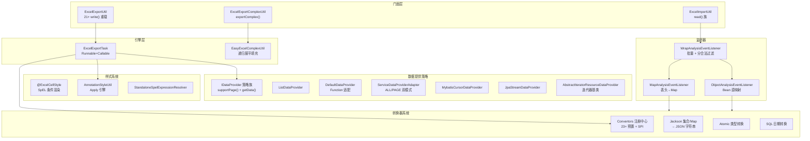
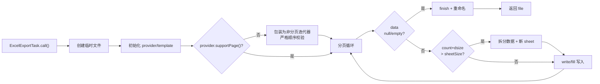

# i2f-extension-fastexcel

> **基于 cn.idev.excel (fastexcel:1.2.0) 的 Excel 导入/导出工具套件 / 将 fastexcel API 装配为多数据源策略的数据提供者 + 多格式转换器 + 注解驱动样式的完整导入/导出框架（与 i2f-extension-easyexcel 同构，仅底层切换为 fastexcel 引擎）**（56 源文件共约 3350 行、6 包族 `i2f.extension.fastexcel`/`.core`/`.annotation`/`.style`/`.complex`/`.complex.core`、1 资源文件 `map-export-template.xlsx`、3 测试文件，依赖 `fastexcel:1.2.0` + `spring-context`/`spring-expression`/`spring-jdbc`/`jackson`/`mybatis:3.5.19` provided + optional，内部依赖 `i2f-text`/`i2f-reflect`/`i2f-resources`）。

## 模块路径

- `i2f-extension/i2f-extension-fastexcel/pom.xml`
- 相对于仓库根目录：`i2f-extension/i2f-extension-fastexcel`

## 模块依赖

### 内部模块（compile 依赖）

| Maven 坐标 | scope | optional | 说明 |
|-----------|-------|----------|------|
| `i2f.turbo:i2f-text:1.0-jdk8` | compile | false | 文本工具（`StringUtils.isEmpty` 用于注解样式 SpEL 表达式空判断） |
| `i2f.turbo:i2f-reflect:1.0-jdk8` | compile | false | 反射工具（`ReflectResolver.getFields`/`getAnnotation`/`getAnnotations` 用于字段扫描与注解元数据解析） |
| `i2f.turbo:i2f-resources:1.0-jdk8` | compile | false | 资源工具（`ResourceUtil.getClasspathResourceAsStream` 用于加载内置模板 `map-export-template.xlsx`） |

### 三方依赖（全部 provided + optional）

| Maven 坐标 | 版本 | scope | optional | 说明 |
|-----------|------|-------|----------|------|
| `cn.idev.excel:fastexcel` | 1.2.0 | provided | true | FastExcel 核心库（EasyExcel 的社区 fork/rebrand，API 完全兼容） |
| `org.springframework:spring-context` | ${spring.version} | provided | true | Spring 上下文（SpEL 表达式解析器注册所需，可选） |
| `org.springframework:spring-expression` | ${spring.version} | provided | true | SpEL 表达式引擎（注解样式条件渲染的 SpEL 求值依赖） |
| `org.springframework:spring-jdbc` | ${spring.version} | provided | true | Spring JDBC（`JpaStreamDataProvider` 的流式查询支持，可选） |
| `com.fasterxml.jackson.core:jackson-core` | ${jackson.version} | provided | true | Jackson 核心（JSON 序列化转换器的基础依赖，可选） |
| `com.fasterxml.jackson.core:jackson-databind` | ${jackson.version} | provided | true | Jackson 数据绑定（集合/Map 类型 JSON 字符串转换器的实现依赖，可选） |
| `org.mybatis:mybatis` | 3.5.19 | provided | true | MyBatis 框架（`MybatisCursorDataProvider` 游标分页查询支持，可选） |
| `org.projectlombok:lombok` | - | provided | true | Lombok 编译期注解（`@Data`/`@NoArgsConstructor` 代码生成） |

### 隐式传递依赖

| 传递路径 | 说明 |
|---------|------|
| `i2f-reflect` → `i2f-typeof` | 类型判定（`TypeOf.typeOf` 用于 Map 类型检测） |
| `i2f-resources` → `i2f-io-stream` | 流复制工具（`StreamUtil.streamCopy`/`readBytes`） |
| `fastexcel` → `org.apache.poi` (poi/poi-ooxml) | Excel 读写底层（SS 用户模型 `Workbook`/`Sheet`/`Cell`/`CreationHelper`） |

## 模块设计

### 包结构

```
i2f.extension.fastexcel
├── ExcelExportUtil.java          -- 导出静态门面（21+ 重载 write 方法）
├── ExcelImportUtil.java          -- 导入静态门面（read 方法族）
├── annotation/
│   ├── ExcelTag.java             -- 字段标签注解（控制导出的包含/排除）
│   ├── ExcelCellStyle.java       -- 单元格样式注解（字体/颜色/对齐/超链接/批注/下拉框）
│   └── ExcelCellStyles.java      -- 样式注解容器（支持 @Repeatable）
├── core/
│   ├── ExcelExportTask.java      -- 核心导出引擎（Runnable+Callable，737 行）
│   ├── ExcelExportColumn.java    -- 导出列配置 POJO
│   ├── ExcelExportMode.java      -- 导出模式枚举（ALL/PAGE）
│   ├── ExcelExportPage.java      -- 分页参数 POJO
│   ├── IDataProvider.java        -- 数据提供者接口 + 静态工厂
│   ├── IDataHoldCellWriteHandler.java    -- 写处理器抽象基类（持有数据上下文）
│   ├── IDataHoldStyleCellWriteHandler.java -- 样式写处理器抽象基类
│   ├── MapAnalysisEventListener.java     -- Map 模式导入监听器
│   ├── ObjectAnalysisEventListener.java  -- Bean 模式导入监听器
│   ├── WrapAnalysisEventListener.java    -- 基础批量导入监听器
│   ├── convertor/
│   │   ├── Convertors.java               -- 转换器注册中心（23+ 预置 + SPI 扩展）
│   │   ├── AbsEnumStringConvertor.java    -- 枚举-字符串转换器抽象基类
│   │   ├── AbsObjectJsonStringConvertor.java -- JSON 字符串转换器抽象基类
│   │   ├── atomics/ (4 files)            -- Atomic* 类型转换器
│   │   ├── json/collection/ (12 files)   -- 集合→JSON 字符转换器
│   │   ├── json/map/ (6 files)           -- Map→JSON 字符转换器
│   │   └── sql/ (3 files)               -- SQL 日期类型转换器
│   └── impl/
│       ├── AbstractIteratorResourceDataProvider.java -- 迭代器资源基类（AtomicBoolean 单次初始化 + finalize 释放）
│       ├── DefaultDataProvider.java      -- Function 适配提供者
│       ├── IteratorResourceDataProvider.java -- 通用迭代器提供者
│       ├── ListDataProvider.java         -- List 数据提供者
│       ├── ServiceDataProviderAdapter.java -- Service 适配器（ALL/PAGE 双模式）
│       ├── jpa/JpaStreamDataProvider.java -- JPA Stream 游标提供者
│       └── mybatis/ (2 files)            -- MyBatis Cursor 游标提供者
├── style/
│   ├── AnnotationExcelStyleCellWriteHandler.java -- 注解驱动样式写处理器
│   ├── AnnotationStyleUtil.java          -- 样式元数据解析引擎（360 行，含缓存）
│   ├── ExcelStyleCallbackMeta.java       -- 样式回调元数据 POJO
│   ├── SpelEnhancer.java                 -- SpEL 辅助方法集合
│   └── StandaloneSpelExpressionResolver.java -- 独立于 Spring 的 SpEL 解析器
└── complex/
    ├── ExcelExportComplexUtil.java       -- 复杂模板导出门面
    ├── core/EasyExcelComplexUtil.java    -- 递归展平填充引擎（$ 路径分隔）
    └── readme.md                         -- 复杂导出开发者笔记
```

### 核心架构



### 导出流程



### 设计要点

1. **与 easyexcel 同构**：该模块与 `i2f-extension-easyexcel` 共享完全相同的架构设计、类层次、接口契约和包结构，唯一的区别是将底层引擎从 `com.alibaba:easyexcel:4.0.3` 替换为 `cn.idev.excel:fastexcel:1.2.0`（EasyExcel 的社区 rebrand 版本，API 完全兼容）
2. **Facade + Strategy + Template Method 三重模式**：`ExcelExportUtil` 21+ 重载静态门面统一入口，`IDataProvider` 策略族解耦数据源，`AbstractIteratorResourceDataProvider` 提供迭代器骨架
3. **Data Provider 策略族**：覆盖 7 种数据源（List/Function/Service/MyBatis Cursor/JPA Stream/通用迭代器/迭代器资源），`AbstractIteratorResourceDataProvider` 通过 `AtomicBoolean` 单次初始化 + `finalize()` 兜底释放
4. **annotation-driven 样式系统**（`AnnotationStyleUtil` 360 行）：通过 `@ExcelCellStyle` 注解 + SpEL 条件表达式实现单元格字体/颜色/对齐/超链接/批注/下拉框的条件渲染，`StandaloneSpelExpressionResolver` 独立于 Spring 上下文运行
5. **Converter 注册中心**：`Convertors` 静态 `CopyOnWriteArrayList` 持有 23+ 预置转换器，覆盖 Atomic 类型（4 个）、SQL 日期（3 个）、集合→JSON 字符串（12 个含各种 List/Set 实现）、Map→JSON 字符串（6 个含各种 Map 实现），并支持 `ServiceLoader` SPI 扩展
6. **自动分 sheet 引擎**：`ExcelExportTask` 默认 `pageSize=5000` + `sheetSize=65530`，超过 sheetSize 时自动拆分到新 sheet（命名 `sheetName-N`），非模板模式使用 `FastExcel.write`、模板模式使用 `fill`
7. **模板复制扩展**：`useFirstSheetTemplate=true` 时对第一个 sheet 进行 `Workbook.cloneSheet` 预创建 `maxFirstSheetCloneCount=100` 个模板副本
8. **Map 数据自动生成模板**：当未提供模板且数据类型为 `Map` 时，通过内置资源 `assets/excel/map-export-template.xlsx` 自动生成列头模板
9. **复杂模板递归填充**：`EasyExcelComplexUtil.recursiveFoundFillData` 对嵌套对象/Map 递归遍历，使用 `$` 分隔路径（如 `role$parent.name`）产生多个 `FillWrapper` 实现同 sheet 多块渲染
10. **双导入模式**：`MapAnalysisEventListener`（列头→Map 键值映射）+ `ObjectAnalysisEventListener`（直接 Bean 映射），均继承 `WrapAnalysisEventListener` 的批量消费+合法性校验框架

## 模块目的

将 fastexcel 的 Excel 读写 API 封装为统一接口套件，屏蔽底层引擎差异，通过策略模式支持多种数据源（内存 List、分页查询、MyBatis 游标、JPA Stream、Service 适配），通过注解系统提供条件样式渲染能力，通过 Converter 注册中心提供类型扩展点，同时保持与 i2f-extension-easyexcel 完全对等的架构设计。

## 模块功能

1. **Excel 导出**：`ExcelExportUtil` 21+ 重载 write 方法，支持 List/Map/Function/IDataProvider 等多种入参形态，支持自定义 sheet 名、模板、临时文件、`Consumer<ExcelExportTask>` 后处理器
2. **Excel 导入**：`ExcelImportUtil` 支持 File/InputStream 输入，Map 模式（列头→列值 Map）和 Bean 模式（直接映射 POJO）双模式，支持批量消费回调
3. **大文件分页导出**：`ExcelExportTask` 自动分页 + 自动分 sheet（65530 行/sheet），支持非分页数据源的自动包装
4. **模板导出**：支持 File URL / Classpath URL 模板文件，`useFirstSheetTemplate` 预克隆模板 sheet
5. **注解驱动样式**：`@ExcelCellStyle` 条件样式（SpEL 表达式控制）、超链接、批注、公式、下拉选择框（数据验证）、列宽自适应
6. **7 种数据源策略**：`IDataProvider` 实现族覆盖 List/Function/Service/MyBatis Cursor/JPA Stream/Iterator/IteratorResource
7. **23+ 预置类型转换器**：Atomic 类型、SQL 日期、集合/Map 的 JSON 字符串序列化，`ServiceLoader` SPI 扩展接口
8. **复杂模板递归填出**：`ExcelExportComplexUtil` 支持嵌套对象/Map 的递归展平，`$` 路径分隔符实现同 sheet 多块渲染
9. **标签列控制**：`@ExcelTag` 注解通过 `exportColumnTags`/`excludeColumnTags` 控制列级的包含/排除
10. **异步临时文件清理**：`deletePool`（ForkJoinPool 4 线程）异步删除临时模板文件和输出中间文件

## 模块主要使用方法

### 1. Maven 依赖引入

```xml
<dependency>
    <groupId>i2f.turbo</groupId>
    <artifactId>i2f-extension-fastexcel</artifactId>
    <version>1.0-jdk8</version>
</dependency>
<!-- 运行期需要 fastexcel 引擎 -->
<dependency>
    <groupId>cn.idev.excel</groupId>
    <artifactId>fastexcel</artifactId>
    <version>1.2.0</version>
</dependency>
```

### 2. List 数据导出

```java
// Map 列表导出
List<Map<String, Object>> data = new ArrayList<>();
// ... 填充数据
File file = ExcelExportUtil.write(data, new File("output.xlsx"));

// Bean 列表导出（通过反射读取字段名作为列头）
List<UserVo> users = userService.list();
File file = ExcelExportUtil.write(users, UserVo.class, new File("users.xlsx"), "用户列表");
```

### 3. 分页数据导出（Service 适配）

```java
IDataProvider provider = new ServiceDataProviderAdapter<QueryVo, UserService, UserVo>(
    ExcelExportMode.ALL, userService, queryVo, UserVo.class) {
    @Override
    public List<UserVo> doRequestData(UserService service, ExcelExportPage page, 
                                       QueryVo reqVo, Object... args) {
        // 构造分页查询
        PageResult<UserVo> result = service.queryPage(reqVo, page.getIndex(), page.getSize());
        return result.getList();
    }
};
File file = ExcelExportUtil.write(provider, new File("users.xlsx"), "用户数据");
```

### 4. 注解样式导出

```java
public class ProductVo {
    @ExcelProperty("商品名称")
    @ExcelCellStyle(spel = "#{val != null && val.toString().contains('促销')}",
                    fontColor = IndexedColors.RED,
                    fontBold = ExcelCellStyle.Bool.TRUE)
    private String name;

    @ExcelProperty("价格")
    @ExcelCellStyle(backgroundColor = IndexedColors.LIGHT_YELLOW)
    private BigDecimal price;

    @ExcelTag({"export", "admin"})
    @ExcelProperty("内部备注")
    private String internalNote;
}

// 只导出标记了 "export" 标签的列
ExcelExportTask task = new ExcelExportTask(provider, file, "商品");
task.setExportColumnTags(Arrays.asList("export"));
task.setEnableCellStyleAnnotation(true);
task.run();
```

### 5. 模板导出

```java
// 使用模板文件
File templateFile = new File("template.xlsx");
File file = ExcelExportUtil.write(data, new File("output.xlsx"), "Sheet1", templateFile);

// 使用 classpath 模板
URL templateUrl = ExcelExportUtil.urlOfClasspath("templates/report-template.xlsx");
File file = ExcelExportUtil.write(data, new File("output.xlsx"), "报表", templateUrl);
```

### 6. 复杂模板导出

```java
// 数据含嵌套结构
Map<String, Object> data = new HashMap<>();
data.put("name", "admin");
data.put("role", Map.of("roleKey", "root", "name", "超级管理员"));
data.put("addressList", Arrays.asList(
    Map.of("name", "建军路", "address", "建军路338号")
));

// 模板表达式：{name} {role$roleKey} {role$name} {addressList.name} {addressList.address}
ExcelExportComplexUtil.exportComplex(
    new File("output.xlsx"), 
    new File("template.xlsx"), 
    0, "Sheet1", data);
```

### 7. Excel 导入

```java
// Map 模式读取（列头作为 key）
List<Map<String, Object>> data = ExcelImportUtil.read(new File("data.xlsx"));

// Bean 模式读取
List<UserVo> users = ExcelImportUtil.read(new File("users.xlsx"), UserVo.class);

// 批量消费模式
ObjectAnalysisEventListener<UserVo> listener = new ObjectAnalysisEventListener<>(1000,
    (legal, illegal) -> {
        batchSave(legal);
        logWarn("illegal records: {}", illegal.size());
    });
List<UserVo> users = ExcelImportUtil.read(new File("users.xlsx"), UserVo.class, listener);
```

## 模块特性总结

1. **双引擎同构**：与 `i2f-extension-easyexcel` 共享完全对等的接口、策略、样式和转换器体系，仅底层从 EasyExcel 替换为 FastExcel
2. **多数据源策略族**：7 种 `IDataProvider` 实现覆盖 List/分页/Service/MyBatis Cursor/JPA Stream/迭代器，统一 `getData(page)` 契约
3. **全自动分页分 sheet**：pageSize/sheetSize 双阈值自动控制，非分页数据源自动包装为分页迭代器
4. **注解驱动条件样式**：SpEL 表达式条件渲染 + 超链接/批注/公式/下拉选择框/列宽调整
5. **可扩展转换器体系**：23+ 预置类型转换器 + ServiceLoader SPI 扩展点
6. **模板多级递归填充**：`$` 路径分隔 + `FillWrapper` 机制实现复杂嵌套数据同 sheet 多块渲染
7. **Map 数据自动模板**：零模板配置下自动生成 Map 列头模板
8. **批量消费框架**：WrapAnalysisEventListener 的合法性校验 + 批量消费回调节约内存

## 模块瑕疵或错误

1. **多处空 catch 吞异常**：`ExcelExportUtil.urlOfFile`(L149-151)、`ExcelExportUtil.urlOfClasspath`(L164-166)、`ExcelExportTask.deleteFileSync`(L629-631)、`AnnotationStyleUtil` 多个空 catch 块——异常被完全静默，调试时无法定位问题
2. **静态 deletePool 永不关闭**：`ExcelExportTask.deletePool = new ForkJoinPool(4)`(L612) 为静态字段，应用生命周期内从不 `shutdown()`，线程泄漏
3. **createTemplateFileByColumns 双重临时文件 + 异步删除竞争**：方法创建两个临时文件(templateFile+ret)(L677-678)，ret 返回给调用方但 templateFile 异步删除——若 GC 延迟或删除慢则临时文件残留；返回的 ret 由 finally 块异步删除(L600-603)，调用方未获得文件所有权语义
4. **非分页包装器严格顺序校验**：`ExcelExportTask` L391 对包装的非分页提供者强制要求 page index 严格连续递增 `[0,1,2,...]`，任一页读取失败/跳过即抛 `IllegalStateException`，缺乏容错机制
5. **WrapAnalysisEventListener.batchConsumer 空时 currSize 持续增长**：`batchSize` 默认 500 但未检查 `batchConsumer==null` 时 `currSize` 依然递增——用户未设置批量消费时 `currSize` 无限增长，纯内存消耗
6. **IDataHoldCellWriteHandler.getRawData 下标越界风险**：`list.get(dataIndex)`(L46) 在 `dataIndex >= list.size()` 时抛 `IndexOutOfBoundsException`，无边界保护
7. **useFirstSheetTemplate 移除 sheet 的索引算术风险**：`ExcelExportTask.call()` L564 `for (int i = numberOfSheets - 1; i > currSheetIndex; i--)` 移除未使用的模板副本——若实际写入 sheet 数 `currSheetIndex` 大于克隆数则可能移除有效 sheet
8. **FastExcel.writerSheet 不支持 excludeColumnFieldNames**：与 EasyExcel 不同，`FastExcel.writerSheet().build()` API 的 builder 不支持 `excludeColumnFieldNames` 过滤（仅在 `writer` builder 级别支持），可能导致被排除列仍然显示
9. **Map 自动模板中 prop 格式假设**：`createTemplateFileByColumns` L694 `propExpr = "{." + propExpr + "}"` 硬编码 `.` 前缀模板语法，若 prop 为嵌套路径（如 `address.city`）无法正确处理
10. **no-arg 构造器默认值不可配置**：`ExcelExportTask` 的 `sheetSize=65530`/`pageSize=5000` 等默认值为字段直接赋值，非通过构造器或 builder 传入，子类无法通过构造器链覆盖默认值

## 消费方情况

| 消费方 | 类型 | 说明 |
|-------|------|------|
| `i2f-extension-all/pom.xml` | POM 聚合 | 聚合本模块至 i2f-extension-all fat-jar 分发包 |
| `i2f-extension/pom.xml` | 父 POM 注册 | 在 `<modules>` 中注册模块 |
| 根 `pom.xml` (L1010) | dependencyManagement | 声明本模块的版本管理条目 |
| 全仓 Java 源码 | 无外部 import | 本模块无其他 i2f 模块的 Java 代码级引用，仅 POM 聚合级消费 |