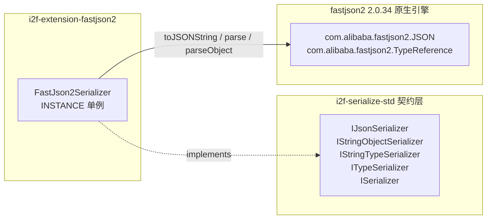

# i2f-extension-fastjson2

> **基于原生 fastjson2（`com.alibaba.fastjson2:fastjson2:2.0.34`，自包含、零运行时传递依赖的 JSON 引擎）的 `IJsonSerializer` 契约适配器**（1 个 pom.xml 49 行 + 1 源文件 63 行、单类 `FastJson2Serializer`、零测试零资源）：把 fastjson2 的 `JSON.toJSONString`/`parse`/`parseObject` 装配为 `i2f-serialize-std` 的 JSON 序列化契约实现，支持 `Class`/`Type`/`TypeReference` 三路类型化反序列化分派与 `bean2Map`/`deserializeAsMap` 覆写；`fastjson2` 以 provided 声明，运行期需使用方自备。与兄弟模块 `i2f-extension-fastjson`（fastjson1 兼容包）构成同一契约的两套可替换实现，本模块面向新项目与原生 fastjson2 生态（21 项运行时实证全部通过）。

## 模块路径

- `i2f-extension/i2f-extension-fastjson2/pom.xml`
- 相对于仓库根目录：`i2f-extension/i2f-extension-fastjson2`

## 模块依赖

### 内部依赖（compile）

| Maven 坐标 | scope | optional | 说明 |
|-----------|-------|----------|------|
| `i2f.turbo:i2f-serialize-std:1.0-jdk8` | compile | false | 序列化标准契约层（`IJsonSerializer` 定义 `serialize`/`deserialize` 类型化重载与 `bean2Map`/`deserializeAsMap` 语义） |

### 三方依赖

| Maven 坐标 | 版本 | scope | optional | 说明 |
|-----------|-------|-------|----------|------|
| `com.alibaba.fastjson2:fastjson2` | 2.0.34 | provided | false | 原生 fastjson2 引擎（JSON 解析器 + 生成器，Apache 2.0），**自包含零 compile/runtime 传递依赖**（其 POM 的 33 个 dependency 全部为 test scope，实测确认）；provided 声明，运行期由使用方提供；版本直接硬编码于本模块 POM（未纳入根 POM 统一管理，见瑕疵第 9 条） |
| `org.projectlombok:lombok` | 1.18.44（根 POM `lombok.version` 管理） | provided | true | 继承根 POM `dependencyManagement` 的 provided + optional；本模块源码实际未使用任何 lombok 注解（冗余声明） |

### 隐式传递依赖

| 传递路径 | 说明 |
|---------|------|
| `i2f-serialize-std` → `i2f-codec-std` | 契约根接口 `ISerializer<E,D>` 继承 `ICodec<E,D>` 并桥接 `encode`/`decode` |
| `com.alibaba.fastjson2:fastjson2` | 无任何 compile/runtime 传递依赖（与兄弟模块兼容包「fastjson → fastjson2-extension → fastjson2」的传递链不同，本模块直连引擎本体） |

## 模块设计

### 包结构

```
i2f.extension.fastjson2
└── FastJson2Serializer.java   -- 契约适配器（serialize / deserialize x5 / bean2Map / deserializeAsMap + INSTANCE 单例，63 行）
```

### 契约继承链

```
IJsonSerializer
  └── IStringObjectSerializer
        └── IStringTypeSerializer<Object>
              └── ITypeSerializer<String, Object>
                    └── ISerializer<String, Object>
                          └── ICodec<String, Object>
```

### 核心架构



### 设计要点

1. **单一职责的契约适配器**：全模块仅 1 个类 63 行，不做任何业务加工，只把 fastjson2 的三个静态门面（`JSON.toJSONString`/`JSON.parse`/`JSON.parseObject`）映射到契约方法；库耦合点集中在一处，替换实现零成本
2. **契约默认能力继承**：继承链（见上）自带 `map2Bean`（序列化 → 按类反序列化往返）、`encode`/`decode`（codec 桥接）、`asBytesSerializer()`（String ↔ byte[] 双向适配，默认 UTF-8）等默认方法，本类只需覆写 6 个契约方法（`serialize`、`deserialize` x3、`bean2Map`、`deserializeAsMap`），实际仅映射 3 个 fastjson2 静态门面
3. **三路类型化反序列化**：`deserialize(String, Class)` 走 `parseObject(text, clazz)`；`deserialize(String, Type)` 与泛型方法 `deserialize(String, TypeReference<T>)`（返回泛型 `T`）分别走 `parseObject(text, Type)` / `parseObject(text, TypeReference)`；契约统一入口 `deserialize(String, Object typeToken)` 按 `instanceof` 动态分派（`Type` 在前、`TypeReference` 在后），无法识别时抛 `UnsupportedOperationException`
4. **单例 + 无状态**：`INSTANCE` 提供进程级共享实例；类无任何字段状态，天然线程安全（但字段非 final 可变，见瑕疵第 6 条）
5. **provided 依赖策略**：fastjson2 仅为编译期依赖，编包不含引擎；使用方按自身版本诉求引入，与全仓「契约稳定、实现可换」原则一致
6. **原生引擎直连**：直接依赖 fastjson2 引擎本体（无 fastjson1 兼容层中间件），编解码行为即 fastjson2 原生行为——新增 API 特性（如 `JSONReader.Feature`/`JSONWriter.Feature` 生态）、安全策略、字段输出序（实测按名字母序）均以 2.0.34 原生实现为准

## 模块目的

为以原生 fastjson2 为 JSON 生态的项目提供「零改造接入 i2f 序列化契约」的适配实现：一方面把 fastjson2 的 API 纳入 `IJsonSerializer` 契约，使 i2f 各栈中按契约消费 JSON 能力的组件（AI 栈 `IJsonSerializer` 注入、HTTP 网络栈 processor 参数、MCP 工具参数 `deserializeAsMap` 等）可以直接切换/注入 fastjson2 实现；另一方面通过 provided 声明避免对使用方的 JSON 库选型产生强制绑定。

## 模块功能

1. **JSON 序列化**：`serialize(Object) → String`（`JSON.toJSONString`）
2. **无类型反序列化**：`deserialize(String) → Object`（`JSON.parse`，返回 fastjson2 原生模型 `JSONObject`/`JSONArray`/标量）
3. **类型化反序列化（Class）**：`deserialize(text, Class<?>)`（`JSON.parseObject(text, clazz)`）
4. **泛型类型化反序列化（Type / TypeReference）**：`deserialize(text, Type)` 与泛型方法 `deserialize(text, TypeReference<T>)`（返回泛型 `T`）
5. **契约动态分派入口**：`deserialize(text, Object typeToken)` 按运行期类型三路分派，不支持的类型抛 `UnsupportedOperationException`
6. **bean ↔ map 转换**：`bean2Map(Object)`、`deserializeAsMap(String)` 覆写实现 + 继承默认 `map2Bean(Map, Class)`
7. **通道互转**：继承 `asBytesSerializer()`（String ↔ byte[] 适配器，默认 UTF-8）与 `encode`/`decode` codec 桥接
8. **单例共享**：`FastJson2Serializer.INSTANCE`

## 模块主要使用方法

### 1. Maven 引入

```xml
<dependency>
    <groupId>i2f.turbo</groupId>
    <artifactId>i2f-extension-fastjson2</artifactId>
    <version>1.0-jdk8</version>
</dependency>
<!-- 本模块以 provided 声明 fastjson2，运行期需使用方自行提供（版本可自选） -->
<dependency>
    <groupId>com.alibaba.fastjson2</groupId>
    <artifactId>fastjson2</artifactId>
    <version>2.0.34</version>
</dependency>
```

### 2. 基础序列化 / 反序列化

```java
IJsonSerializer json = FastJson2Serializer.INSTANCE;

// 序列化（实测输出：{"age":20,"name":"admin"}，字段按名字母序）
String text = json.serialize(user);

// 无类型反序列化 → fastjson2 原生模型（JSONObject/JSONArray）
Object obj = json.deserialize(text);

// 类型化反序列化（Class）
User user = (User) json.deserialize(text, User.class);
```

### 3. 泛型类型反序列化（TypeReference / Type）

```java
// 推荐：TypeReference 匿名子类，直接获得泛型返回
List<User> users = FastJson2Serializer.INSTANCE.deserialize(
        listText, new TypeReference<List<User>>() {});

// 或先取得 java.lang.reflect.Type（如字段/方法签名中的泛型），再调用泛型重载
Type type = new TypeReference<List<User>>() {}.getType();
List<User> users2 = FastJson2Serializer.INSTANCE.deserialize(listText, type);
```

> 注意：泛型推断依赖静态类型为 `FastJson2Serializer`；经由 `IJsonSerializer` 接口引用调用时只会命中契约方法 `deserialize(String, Object)`，返回 `Object`。

### 4. bean ↔ map 转换

```java
// bean → map（依赖对象序列化为 JSON 对象）
Map<String, Object> map = json.bean2Map(user);

// map → bean（契约默认实现：序列化 → 按类反序列化往返）
User back = json.map2Bean(map, User.class);

// 文本 → map
Map<String, Object> m = json.deserializeAsMap(text);
```

### 5. 作为契约实现注入使用

```java
// 任何持有 IJsonSerializer 契约引用的组件均可注入本实现（示意）
IJsonSerializer json = FastJson2Serializer.INSTANCE;
component.setJsonSerializer(json);
```

### 注意事项

1. **provided 依赖需自备**：使用方必须自行引入 fastjson2（建议 2.0.34+），否则运行期 `NoClassDefFoundError`
2. **异常为 fastjson2 原生异常**：抛出的是 `com.alibaba.fastjson2.JSONException` 等原生异常，而非契约异常 `JsonSerializeException`
3. **`bean2Map`/`deserializeAsMap` 仅适用 JSON 对象**：对象若序列化为数组/标量（List、数组、String、数字），`parseObject(text, Map 类型)` 会抛 `JSONException`（实测消息 `expect '{', but '['`）；`null` 输入则静默返回 null
4. **升级需回归**：`Type`/`TypeReference` 的分派判定依赖 fastjson2 具体类结构（当前 `TypeReference` 不实现 `java.lang.reflect.Type`，实测 false），升级 fastjson2 版本时应回归验证
5. **新项目首选本模块**：存量 fastjson1 生态选兄弟模块 `i2f-extension-fastjson`，新项目建议原生 `i2f-extension-fastjson2`

## 模块特性总结

1. **极简适配**：63 行单类完成一个 JSON 引擎的契约接入，二次实现/替换成本极低
2. **零强绑定**：provided 依赖 + 运行期自备，使用方可自由选择 fastjson2 版本
3. **原生引擎直连**：无兼容层中间件，行为即 fastjson2 原生（自包含零运行时传递依赖，引入成本低）
4. **三路类型化反序列化**：Class / Type / TypeReference 覆盖常规 bean、复杂泛型与运行时泛型场景
5. **契约默认能力齐全**：`map2Bean`、`encode`/`decode`、`asBytesSerializer()` 开箱即用（实测通过）
6. **线程安全单例**：无状态实现，`INSTANCE` 可进程级共享
7. **双实现可替换**：与 `i2f-extension-fastjson` 共享同一契约，按生态选择即可
8. **新生态优先**：fastjson2 为 fastjson 家族的当前主力版本，新项目直接采用可避免后续迁移

## 模块瑕疵或错误

1. **lombok 声明未使用**：pom 声明 `org.projectlombok:lombok`（L16-19），但唯一源文件未使用任何 lombok 注解，属冗余声明（与全仓多个模块同类问题）
2. **异常未桥接契约异常族**：`serialize`/`deserialize` 直接抛出 fastjson2 原生 `JSONException`（实测无效 JSON 抛 `com.alibaba.fastjson2.JSONException: illegal fieldName ...`），而非契约层 `JsonSerializeException`（继承 `SerializeException`）；按契约捕获异常的使用方会漏接，异常防线失效
3. **`bean2Map`/`deserializeAsMap` 假设 JSON 为对象**：实现为先序列化再按 `TypeReference<Map<String, Object>>` 解析（L51-56 / L58-62）；对象序列化为数组或标量时 `parseObject` 抛 `JSONException`（实测 `expect '{', but '['`）
4. **null 边界静默**：实测 `serialize(null)` 返回字符串 `"null"`、`deserialize(null)` 返回 null、`deserializeAsMap("null")` 返回 null、`bean2Map(null)` 无异常返回 null——四种 null 路径均不抛异常、不做校验，使用方需自行判空
5. **不支持类型的异常语义弱**：`deserialize(text, Object)` 对无法识别的 typeToken（含 null）抛 JDK 原生 `UnsupportedOperationException("FastJson2 un-support parseText.")`（L33-41，实测确认）——消息措辞（parseText）与真实语义（typeToken 类型不受支持）不符，且同为契约外异常
6. **`INSTANCE` 为非 final 公共可变静态字段**（L16）：任意代码可重新赋值替换全局单例（类本身无状态、并发使用安全），但可被替换破坏全局一致性；建议 `public static final`
7. **重载 null 歧义与静态约束缺失**：`deserialize` 存在 (String, Class)/(String, Object)/(String, Type)/(String, TypeReference) 四个同名重载，直接以 `null` 字面量调用会编译歧义；契约入口 `(String, Object)` 完全依赖运行期 `instanceof` 校验（当前 `TypeReference` 不实现 `java.lang.reflect.Type`，分派顺序恰好正确，但属隐式依赖；补充实测：匿名的 `TypeReference` 实例因匿名类不可继承，直接书写 `instanceof Type` 在编译期即报「不兼容的类型」）
8. **双次编解码开销**：`bean2Map` 内部先 `serialize` 再 `deserialize` 两次编解码（继承的 `map2Bean` 默认实现同样「序列化 → 反序列化」往返），且每次调用新建匿名 `TypeReference` 子类实例；高频路径存在不必要开销
9. **版本硬编码且较旧**：`com.alibaba.fastjson2:fastjson2:2.0.34` 为 2023 年版本，直接声明于模块 POM（未纳入根 POM `dependencyManagement` 统一管理，无法随全仓依赖升级联动）；fastjson2 家族后续版本持续包含安全修复与性能优化，生产使用建议统一评估升级到较新修复版本
10. **零测试**：模块无任何测试类，类型分派、`bean2Map` 数组/null 边界、泛型解析等行为均无回归保障（本次文档工作以外部探测类做了 21 项运行时实证，见下节）

## 运行时实证验证

在 JDK8（`C:\Java\jdk1.8.0_201`）下以 `javac` 直编模块源码 + 探测类（`-encoding UTF-8`，classpath = `fastjson2-2.0.34` + `i2f-serialize-std-1.0-jdk8` + `i2f-codec-std-1.0-jdk8`），共 21 项探测全部通过（pass=21 / fail=0）。证据留存 `runtime/tmp/fastjson2-verify/`（`VerifyFastJson2.java` + `build.ps1`）。

| # | 验证项 | 实测结果 |
|---|--------|---------|
| T1 | `serialize(User)` | `{"age":20,"name":"admin"}`（fastjson2 原生字段输出序，与 POJO 声明序 name/age 不一致） |
| T2 | `deserialize(String)` 无类型 | 返回 `com.alibaba.fastjson2.JSONObject`（fastjson2 原生模型） |
| T3 | `deserialize(text, Class)` | 正确映射为 User 对象 |
| T4 | `deserialize(text, TypeReference)` 泛型 | `List<User>` 2 元素正确解析 |
| T5 | `deserialize(text, Type)` 泛型 | `java.util.List<User>` 正确解析 |
| T6 | `deserialize(text, Object)` 分派 TypeReference | 返回 `java.util.ArrayList` |
| T7 | `deserialize(text, Object)` 分派 Type | 返回 `java.util.ArrayList` |
| T8 | `deserialize(text, Object)` 不支持 token | 抛 `UnsupportedOperationException: FastJson2 un-support parseText.` |
| T9 | `TypeReference instanceof Type` | 运行时 `false`（分派顺序正确性的隐式依赖） |
| T10 | `bean2Map(bean)` | `{name=admin, age=20}` |
| T11 | `deserializeAsMap(text)` | `{name=admin, age=20}` |
| T12 | `map2Bean`（契约默认实现） | 往返正确 |
| T13 | `bean2Map(null)` | 无异常，静默返回 null |
| T14 | `bean2Map(List)` 非对象 | 抛 `com.alibaba.fastjson2.JSONException: expect '{', but '['` |
| T15 | `deserializeAsMap("[1,2,3]")` 非对象 | 抛 `com.alibaba.fastjson2.JSONException: expect '{', but '['` |
| T16 | `deserializeAsMap("null")` | 静默返回 null |
| T17 | `deserialize(null)` | 静默返回 null |
| T18 | 无效 JSON 异常类型 | 抛 `com.alibaba.fastjson2.JSONException`（未包装为契约 `JsonSerializeException`） |
| T19 | `serialize(null)` | 返回字符串 `"null"` |
| T20 | `encode`/`decode` + `asBytesSerializer()` | codec 桥接与 UTF-8 字节通道往返正确 |
| T21 | `deserialize(text, (Object) null)` | 抛 `UnsupportedOperationException: FastJson2 un-support parseText.` |

**缺陷实锤汇总**：T18（契约异常未包装）、T14/T15（非对象 JSON 抛原生异常）、T13/T16/T17/T19（null 边界静默）、T8/T21（异常语义弱 + null token 无防护）分别对应上节瑕疵第 2/3/4/5 条。

## 姊妹模块对比（i2f-extension-fastjson）

| 对比项 | `i2f-extension-fastjson2`（本模块） | `i2f-extension-fastjson` |
|-------|-------------------------------------|---------------------------|
| API 包 | `com.alibaba.fastjson2`（原生 API） | `com.alibaba.fastjson`（1.x 兼容 API） |
| 引擎依赖 | `com.alibaba.fastjson2:fastjson2:2.0.34` provided（自包含零传递依赖） | `com.alibaba:fastjson:2.0.26` provided（兼容包 → fastjson2-extension → fastjson2 传递链） |
| 实现类 | `FastJson2Serializer`（63 行） | `FastJsonSerializer`（63 行，结构同构） |
| 契约 | `IJsonSerializer` | `IJsonSerializer` |
| 适用场景 | 新项目/新模块，推荐 | 存量 fastjson1 生态、需 1.x API 语义 |

## 消费方情况

| 消费方 | 类型 | 说明 |
|-------|------|------|
| `i2f-extension/pom.xml`（L42） | 父 POM 模块注册 | `<modules>` 中注册本模块，参与全仓构建 |
| 根 `pom.xml`（L1018-1022） | dependencyManagement | 以 `${i2f.version}` 统一管理本模块版本（注：`com.alibaba.fastjson2:fastjson2` 三方版本未纳入根 POM 管理） |
| `i2f-extension-all/pom.xml`（L115-118） | POM 聚合 | 纳入 i2f-extension-all 聚合；fastjson2（provided）不传递打包，运行期需使用方自备 |
| `bash/backup-jdk8`、`bash/deploy-jdk8`、`bash/deploy-jdk17` | 预构建产物分发 | `i2f-extension-fastjson2-1.0-jdk8.jar` / `-jdk17.jar` 随分发包分发 |
| 全仓 Java 源码 | 零代码级引用 | `FastJson2Serializer` 无任何外部 import（仅模块内自引用），作为契约实现供使用方按需选用 |
| `.wiki/docs/module-i2f-extension.md`（L20）、`.wiki/wiki.md`（L137）、`.wiki/modules/i2f-extension/i2f-extension-fastjson/readme.md` | 文档引用 | 被列为 JSON 适配族成员（fastjson2 原生实现）与姊妹模块对比对象 |
