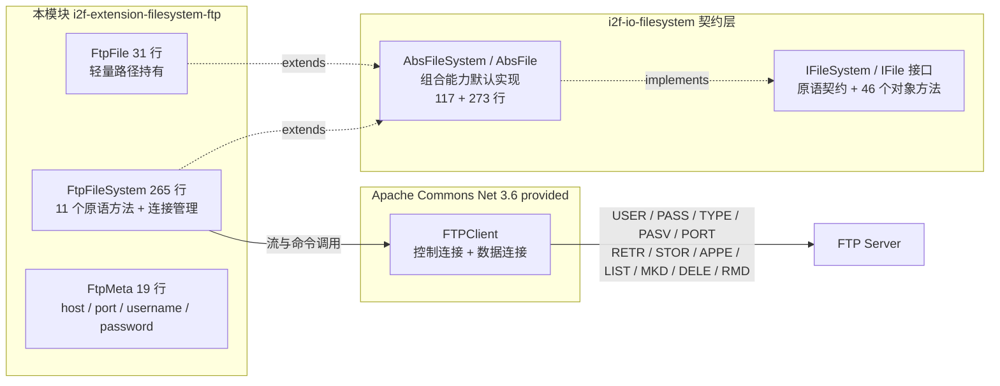
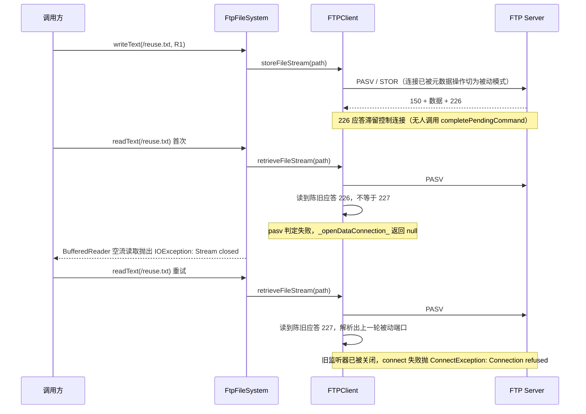

# i2f-extension-filesystem-ftp

> **基于 Apache Commons Net `FTPClient`（`commons-net:commons-net:3.6`，provided）的 `IFileSystem` 契约适配器**（1 pom.xml 48 行 + 3 源文件 315 行：`FtpFileSystem` 265 行 + `FtpFile` 31 行 + `FtpMeta` 19 行、零测试零资源）：把 FTP 协议的文件操作装配为 `i2f-io-filesystem` 的 `IFileSystem`/`IFile` 契约实现——仅实现 11 个操作原语（`isDirectory`/`isFile`/`isExists`/`listFiles` 均为「切分目录 + 被动模式 LIST + 名称匹配」；三路流 `retrieveFileStream`/`storeFileStream`/`appendFileStream`；`makeDirectory`），另覆写 `getFile`/`getAbsolutePath`（契约覆写共 13 个），`mkdirs`/`copyTo`/`moveTo`/`store`/`load`/`readText`/`writeText`/`readLines` 等 40+ 组合能力全部继承自 `AbsFileSystem`/`AbsFile`。连接策略二选一：默认 `enableNewClient=true` 每个操作新建「连接 → 登录 → TYPE → 操作 → QUIT」（天然规避 FTP 流传输应答残留，但连接代价高，实测约 40 个逻辑操作产生 46 次连接/登录）；`false` 复用单连接，但流传输后从不调用 `completePendingCommand()`，服务端 226 应答永久残留、控制连接逐次错位（29 项运行时实证 T25/T26 实锤：`IOException: Stream closed` → `ConnectException: Connection refused`，不自愈）。`commons-net` 以 provided 声明、运行期需使用方自备。

## 模块路径

- `i2f-extension/i2f-extension-filesystem-ftp/pom.xml`
- 相对于仓库根目录：`i2f-extension/i2f-extension-filesystem-ftp`

## 模块依赖

### 内部依赖（compile）

| Maven 坐标 | scope | optional | 说明 |
|-----------|-------|----------|------|
| `i2f.turbo:i2f-io-filesystem:1.0-jdk8` | compile | false | 文件系统契约层（`IFileSystem`/`IFile` 接口 + `AbsFileSystem`/`AbsFile` 抽象基类 + `FileSystemUtil` 路径工具），本模块继承其抽象基类实现 FTP 后端 |

### 三方依赖

| Maven 坐标 | 版本 | scope | optional | 说明 |
|-----------|-------|-------|----------|------|
| `commons-net:commons-net` | 3.6 | provided | false | Apache Commons Net FTP 协议栈（`FTPClient`/`FTP`/`FTPFile`/`FTPReply`），**版本直接硬编码于本模块 POM（未纳入根 POM `dependencyManagement` 统一管理，见瑕疵第 14 条）**；provided 声明，编包不含协议栈，运行期由使用方提供 |
| `org.projectlombok:lombok` | 1.18.44（根 POM `lombok.version` 管理） | provided | true | 继承根 POM `dependencyManagement` 的 provided + optional；仅 `FtpMeta` 使用 `@Data`/`@NoArgsConstructor`（getter/setter 编译期生成） |

### 隐式传递依赖

| 传递路径 | 说明 |
|---------|------|
| `i2f-io-filesystem` → `i2f-io-stream` | 组合能力实现依赖 `StreamUtil`（`streamCopy` 等流桥接工具，`AbsFile`/`AbsFileSystem` 使用） |
| `i2f-io-filesystem` → `i2f-text` | 上游 POM 声明的传递依赖（上游文档注明该依赖实际未被使用，属冗余声明） |
| `commons-net:commons-net:3.6` | 无 compile/runtime 传递依赖（自包含协议栈）；且 provided 声明不参与传递，使用方需自行引入 |

## 模块设计

### 包结构

```
i2f.extension.filesystem.ftp
├── FtpFileSystem.java   -- 契约适配器主体（连接管理 + 11 个原语方法，265 行）
├── FtpFile.java         -- 轻量路径持有（仅 3 个字段方法，31 行）
└── FtpMeta.java         -- 连接配置（host/port/username/password + lombok，19 行）
```

同时源码目录内嵌一份历史遗留的 `readme.md`（位于 `src/main/java/i2f/extension/filesystem/ftp/`，描述的是「FTP/SFTP/MinIO/HDFS 四种文件系统扩展」的聚合级说明与 `testFtpFs` 示例，非本模块专属文档）。

### 契约继承链

```
IFileSystem（契约接口：原语方法 + 组合方法）
  └── AbsFileSystem（抽象基类，117 行，提供 combinePath/absPath/mkdirs/store/load/copyTo/moveTo 等默认实现）
        └── FtpFileSystem implements Closeable（仅覆写 13 个契约方法：11 个操作原语 + getFile/getAbsolutePath；另含自有方法 getClient/getDirAndName）

IFile（契约接口：46 个对象方法）
  └── AbsFile（抽象基类，273 行，提供 writeText/readText/readLines/writeLines/copyTo/moveTo/writeBytes/readBytes 等默认实现）
        └── FtpFile（仅覆写 setFileSystem/getFileSystem/getPath 三个字段方法）
```

### 核心架构



### 设计要点

1. **契约适配器定位（模板级样板实现）**：全模块 315 行实现一个完备的远端文件系统——`FtpFile` 仅 3 个字段方法，`FtpFileSystem` 仅 11 个原语方法，其余 40+ 组合能力（含 `mkdirs` 逐级递归、跨文件系统 `copyTo`/`moveTo` 流桥接、`readLines`/`writeLines`）全部由 `AbsFileSystem`/`AbsFile` 继承；上游 `i2f-io-filesystem` 的 wiki 文档即以本模块（`FtpFile`/`FtpFileSystem`）为「扩展一个文件系统」的参照模板
2. **双连接模式（`enableNewClient`）**：
   - `true`（默认，L22）：`getClient()` 无条件重建连接——每个操作独立走「connect → login → TYPE I → 操作 → logout/QUIT」，操作间零状态共享，天然规避 FTP 协议流传输后的应答残留问题（正确性优先）；
   - `false`：复用单连接，仅当 `client == null || !isConnected || !isAvailable` 时才重建——省去重复登录开销，但存在应答错位缺陷（详见「运行时实证验证」与瑕疵第 1 条）。
3. **守卫式连接管理 `getClient()`（L36-72）**：判定 `enableNewClient || client == null || !client.isConnected() || !client.isAvailable()` 命中即重建；重建前对旧连接静默 `logout + disconnect`（异常吞没）；新连接依次 `setControlEncoding("UTF-8")` → `connect(host, port)` → `login(username, password)` → `type(FTP.BINARY_FILE_TYPE)`（二进制传输），最后校验 `FTPReply.isPositiveCompletion(reply)`，失败则清理连接并抛 `IllegalStateException("ftp not positive completion")`。注意 `isAvailable()` 是 commons-net 的纯本地 socket 状态检查（零协议报文，实测无 NOOP 命令），无法探测服务端侧会话失效
4. **「列目录匹配」元数据策略**：`getDirAndName(path)`（L84-108）把路径切分为「目录 + 名称」对（边界行为见实证 T15），`isDirectory`/`isFile`/`isExists`/`length` 四方法同构：`enterLocalPassiveMode()` → `listFiles(目录)` → 逐条比对条目名 → 返回匹配条目属性；代价是每次元数据操作都要发起一次完整的 LIST 数据连接（实测 LIST 命令 32 次为全模块最高频命令之一）
5. **数据连接模式随方法隐式切换（状态污染）**：
   - 元数据系方法（`isDirectory`/`isFile`/`isExists`/`listFiles`/`delete`/`length`）每次调用 `enterLocalPassiveMode()` → 该连接切入 **PASV 被动模式**；
   - 流系方法（`getInputStream`/`getOutputStream`/`getAppendOutputStream`）不切换模式 → **继承连接当前模式**：默认模式（每操作新连接，初始为 ACTIVE）下发 **PORT 主动命令**；复用模式下若此前发生过元数据操作则随之为 **PASV**。实测命令统计 PASV=35 / PORT=9，且复用连接日志可见 `PASV + STOR /reuse.txt`——同一写操作在不同模式下走不同数据连接方向
6. **三路流直接透传**：`getInputStream`/`getOutputStream`/`getAppendOutputStream` 分别直接返回 `retrieveFileStream`/`storeFileStream`/`appendFileStream` 的原始结果（含 null，见瑕疵第 6/7 条），不包装、不补偿 `completePendingCommand()`——流关闭时机完全交由上层 `AbsFile`/`AbsFileSystem` 决定（`writeBytes` 显式 close、`streamCopy` 双参版关闭双流）
7. **provided 依赖策略**：`commons-net` 仅编译期可见，编包与 POM 传递均不含协议栈；使用方按需自选版本引入，与全仓「契约稳定、实现可换」原则一致
8. **异常体系统一为 `IllegalStateException` 包装**：原语方法统一 `catch (Throwable e) { throw new IllegalStateException(e.getMessage(), e); }`（Error 也被归并）；`getClient()` 则对 `RuntimeException` 直接透传、非 RuntimeException 包装——异常类型不可预测且非契约异常（见瑕疵第 13 条）

## 模块目的

为需要以 FTP 协议存取文件的场景提供「零改造接入 i2f 文件系统契约」的适配实现：业务代码只依赖 `IFileSystem`/`IFile` 抽象（参见 `i2f-io-filesystem` 的「面向抽象编程」章节），即可把本地盘、FTP、SFTP、HDFS、OSS 等后端互换使用；同时复用 `AbsFileSystem`/`AbsFile` 提供的路径规约、防穿越校验（`getStrictFile`）、跨文件系统流桥接等高阶能力，并可通过 provided 声明避免对使用方的网络库选型产生强制绑定。

## 模块功能

1. **构造即连接**：`new FtpFileSystem(meta)` 立即完成「连接 → 登录 → TYPE I → 应答校验」，失败即抛异常（fail-fast 实测 T01）
2. **三态元信息检查**：`isDirectory`/`isFile`/`isExists`（被动 LIST + 名称匹配）
3. **目录列举**：`listFiles(path)` 返回 `IFile` 列表（子项路径 = `combinePath(path, name)`）
4. **文件长度**：`length(path)` 取 LIST 条目 `getSize()`（目录返回 0、缺失抛异常，见实证 T11/T12）
5. **三路流读写**：`getInputStream`（RETR）/`getOutputStream`（STOR）/`getAppendOutputStream`（APPE），并经继承获得 `readText`/`writeText`/`appendText`/`readBytes`/`writeBytes`/`readLines`/`writeLines`/`getReader`/`getWriter` 等便捷方法
6. **创建与删除**：`mkdir`（MKD）/`delete`（按条目类型分派 DELE 或 RMD）；`mkdirs` 经继承逐级递归创建
7. **组合能力（继承）**：`store`/`load`/`copyTo`/`moveTo`（同 FS 或跨 FS 流桥接）/`getStrictFile` 防穿越/`getReader` 等 40+ 方法
8. **路径工具（公开）**：`getDirAndName(path)` 路径切分（返回 `Map.Entry<目录, 名称>`，含 7 类边界行为，实测 T15）
9. **连接生命周期**：`close()`（logout + disconnect）；`isAppendable`（弱判定 = `isFile`）

## 模块主要使用方法

### 1. Maven 引入

```xml
<dependency>
    <groupId>i2f.turbo</groupId>
    <artifactId>i2f-extension-filesystem-ftp</artifactId>
    <version>1.0-jdk8</version>
</dependency>
<!-- 本模块以 provided 声明 commons-net，运行期需使用方自行提供（版本可自选） -->
<dependency>
    <groupId>commons-net</groupId>
    <artifactId>commons-net</artifactId>
    <version>3.6</version>
</dependency>
```

### 2. 基础 CRUD（内嵌 readme 同名示例流程，实测全部通过）

```java
FtpMeta meta = new FtpMeta();
meta.setHost("127.0.0.1");
meta.setPort(21);
meta.setUsername("root");
meta.setPassword("xxx");

// 默认模式：每个操作独立连接（enableNewClient = true）
FtpFileSystem fs = new FtpFileSystem(meta);

IFile file = fs.getFile("/root/home/test/ftp.txt");
if (!file.getDirectory().isExists()) {
    file.getDirectory().mkdirs();      // 继承能力：逐级 MKD（实测 /a、/a/b、/a/b/c 全建）
}
if (!file.isExists()) {
    file.writeText("hello", "UTF-8");  // STOR（二进制模式）
}
String str = file.readText("UTF-8");   // RETR
file.delete();                          // DELE；目录走 RMD
fs.close();                             // logout + disconnect
```

### 3. 作为契约实现注入使用（跨文件系统桥接）

```java
FtpFileSystem ftp = new FtpFileSystem(meta);
IFile local = JdkFileSystem.getInstance().getFile("D:/data/a.txt");

// 跨 FS 拷贝：AbsFile.copyTo 检测到文件系统不同 → RETR + STOR 流桥接
local.copyTo(ftp.getFile("/upload/a.txt"));

// 同 FS 拷贝/移动：AbsFileSystem.copyTo/moveTo 组合原语完成
ftp.getFile("/upload/a.txt").copyTo(ftp.getFile("/upload/b.txt"));

// 面向 IFileSystem 抽象的业务代码可无感切换后端
void export(IFileSystem fs, String dir) { fs.getFile(dir).mkdirs(); /* ... */ }
ftp.close();
```

### 4. 连接模式选择（`enableNewClient`）

```java
// 正确性优先（默认）：每操作新建连接，操作间零状态共享
FtpFileSystem fsSafe = new FtpFileSystem(meta);          // enableNewClient = true

// 低开销复用：适用于「纯元数据操作」场景（实测 2 次元数据操作 0 新连接）
FtpFileSystem fsReuse = new FtpFileSystem(meta, false);
fsReuse.getFile("/a.txt").isExists();                    // LIST，连接稳定

// ⚠ 复用模式下混用流传输（write/read/append）会触发应答错位，见下节实证
```

### 注意事项

1. **provided 依赖需自备**：使用方必须自行引入 `commons-net`（3.6+），否则运行期 `NoClassDefFoundError`
2. **复用模式 + 流传输 = 应答错位**：复用连接上任何一次 STOR/RETR/APPE 之后，服务端 226 应答残留导致后续所有操作逐个错位、永不自愈（实测 T24→T25→T26 链路）；如确需复用连接，应只做元数据操作，或改用姊妹模块 `i2f-extension-ftp` 的完整操作 API（`storeFile`/`retrieveFile` 内部会消费应答）
3. **根路径 `/` 语义不对称**：`isExists("/")` 恒为 `false`，但 `listFiles("/")` 可用（实测 T14）
4. **`length` 的两种语义**：目录返回 `0`（非异常）；路径不存在抛 `IllegalStateException("file not found.")`
5. **异常为 `IllegalStateException` 包装**：非契约异常，且缺失文件读取表现为 `IOException: Stream closed`、写入缺失目录表现为 `NullPointerException`（实测 T18/T19），调用方需按实际行为防御
6. **非线程安全**：`client` 字段无并发保护且 `getClient()` 公开暴露内部 `FTPClient`；建议单实例串行使用或每线程独立实例
7. **`close()` 后可继续使用**：close 不置空 `client`，后续操作会自动重连（实测 T22），「关闭」语义弱化

## 模块特性总结

1. **模板级扩展实现**：315 行完成一个远端文件系统——`FtpFileSystem` 11 原语 + `FtpFile` 3 字段方法，其余全部继承（上游契约文档将其作为扩展参照）
2. **fail-fast 构造**：实例化即完成连接/登录/二进制模式配置与应答校验，配置错误在构造期暴露
3. **二进制模式传输**：固定 `FTP.BINARY_FILE_TYPE`，避免文本模式换行转换损坏内容
4. **三路流支持**：读（RETR）/ 写（STOR）/ 追加（APPE）齐全（对比：SFTP/HDFS 之外的多数云端实现不支持追加）
5. **UTF-8 控制编码**：`setControlEncoding("UTF-8")`，中文路径/文件名可用
6. **双连接模式**：默认每操作新连接保正确性；可切换复用模式省登录开销（附应答错位风险）
7. **零强绑定**：provided 依赖 + 运行期自备，使用方可自由选择 commons-net 版本
8. **契约默认能力齐全**：`mkdirs` 逐级递归、跨 FS `copyTo`/`moveTo` 流桥接、`readLines`/`writeLines`、防穿越 `getStrictFile` 开箱即用
9. **路径切分工具公开可用**：`getDirAndName` 可直接用于自定义 FTP 逻辑
10. **零测试**：模块无任何测试类，全部行为保障来自本次文档工作的 29 项外部运行时实证

## 模块瑕疵或错误

1. **流传输后从不调用 `completePendingCommand()`（最重）**：`getInputStream`/`getOutputStream`/`getAppendOutputStream`（L224-236）直接透传 commons-net 原始流，而流传输完成后服务端发出的 **226 完成应答无人消费**（`writeBytes` 关闭流、`streamCopy` 关闭流、`copyTo` 桥接皆只关流不发命令）。默认模式因每操作新连接而「碰巧」规避；复用模式下残留的 226 导致后续每个命令读到的都是上一个命令的应答（偏移恒为 1 且随操作数漂移），实测 T25 抛 `IOException: Stream closed`、T26 抛 `ConnectException: Connection refused`，持久不自愈——这是本模块最需要规避的使用方式
2. **默认每操作新建连接（高开销）**：`enableNewClient=true` 下每个逻辑操作都要完整执行「connect → USER/PASS → TYPE → SYST → 操作 → QUIT」，实测约 40 个逻辑操作累计 **46 次控制连接/46 次登录**（命令统计 USER=PASS=TYPE=QUIT=44~46）；高频小操作场景有连接风暴与服务端连接数限制风险
3. **数据连接模式状态污染**：模块不提供数据连接模式配置入口，行为取决于「连接上是否曾调用过元数据方法（会切入 PASV）」——默认模式流传输恒 ACTIVE/PORT（NAT 与防火墙场景不友好），复用模式流传输可能变 PASV；实测 PASV=35 / PORT=9。L53-55 存在被注释的 FTPS 相关调用（`enterLocalPassiveMode`/`execPBSZ`/`execPROT`），FTPS 能力实际未启用
4. **根路径 `/` 语义不对称**：`getDirAndName("/")` 切分为 `(".", "")`，对 `.` 目录 LIST 后按空名匹配恒失败 → `isExists("/")`/`isDirectory("/")`/`isFile("/")` 恒 `false`，而 `listFiles("/")` 正常（实测 T14）
5. **`delete` 静默失败**：目标为非空目录时 `removeDirectory` 被服务端拒绝（550）且**返回值被忽略**（L205-209 无返回值检查）；路径不存在时循环零迭代静默返回——调用方无法感知删除失败（实测 T16：删除非空目录后目录与内部文件俱在）
6. **读取缺失文件抛误导性异常**：`retrieveFileStream` 对不存在文件返回 `null`（commons-net 约定），`AbsFile.readBytes` 对其包装 `BufferedInputStream(null)` 后读取 → `IOException: Stream closed`（实测 T18，栈头 `BufferedInputStream.getInIfOpen:159 → StreamUtil.streamCopy:69`）；消息与真实原因（文件不存在）无关，排障困难
7. **写入缺失目录抛 NPE**：`storeFileStream` 对不存在目录返回 `null`，`writeBytes` 中 `os.write` 直接抛 `NullPointerException: null`（实测 T19）；同为异常语义缺陷
8. **`mkdir` 返回值忽略**：`makeDirectory` 的 boolean 结果被丢弃（L239-245），无权限、重名等情况静默失败（实测：正常场景 MKD 成功，但失败场景无异常）
9. **`length` 语义缺陷**：目录返回 `0` 而非异常/特殊值（服务端 LIST 条目 size=0，实测 T12），易与空文件混淆；缺失路径抛 `IllegalStateException("file not found.")`（实测 T11）——同一方法对三类输入的语义不统一
10. **`close()` 不置空连接 + 静默重连**：「关闭」后实例仍可用（任何操作触发 `getClient()` 重建连接，实测 T22 重连 1 次）；`close` 中 `logout()` 的异常直接向外抛且不保证 `disconnect` 执行（L75-82 无 try/finally）
11. **非线程安全 + 内部句柄公开**：`client` 字段无锁、无同步；`getClient()` 为 public，外部可取得内部 `FTPClient` 并绕过模块直接操作（含进入 PASV、关闭连接等破坏性操作）
12. **`getAbsolutePath` 直通不规整**（L116-118）：直接返回入参——相对路径保持相对（实测 `getAbsolutePath("rel/x.txt")` 返回 `rel/x.txt`），不拼接服务端工作目录；配合继承的 `getExtension` 缺陷（`AbsFile.L110-117` 返回去掉扩展名的主名，实测 `ext="x"`）等，路径派生语义与直觉有偏差
13. **异常包装不一致 / `Error` 被归并**：原语方法统一 `catch (Throwable)` 包装为 `IllegalStateException`——`Error`（含 OOM）也被吞并；`getClient()`（L64-69）则对 `RuntimeException` 透传、其余包装，导致同类失败在不同入口的异常类型不一致，且全部非契约异常
14. **`commons-net` 版本硬编码**：`3.6`（2017 年版本）直接声明于模块 POM（L28，未纳入根 POM `dependencyManagement` 统一管理，无法随全仓依赖升级联动）；commons-net 后续版本包含安全修复与 FTP 兼容性改进，生产使用建议评估升级
15. **`FtpMeta` 配置面薄**：密码为明文 `String` 字段（无加密/外部化支持）；无连接超时/数据超时/编码/被动端口范围等配置入口（`FTPClient` 默认超时无限，网络故障时操作可能长时间阻塞）；`port` 默认 21 无校验；`FtpMeta` 依赖 lombok 但仅两个注解（`@Data`/`@NoArgsConstructor`），也可手写消除
16. **零测试**：无任何测试类；本次文档工作以外部探测类完成 29 项运行时实证（见下节）

## 运行时实证验证

在 JDK8（`C:\Java\jdk1.8.0_201`）下以 `javac` 直编模块 3 个源文件 + 探测类（`-encoding UTF-8`；classpath = `commons-net-3.6` + `i2f-io-filesystem-1.0-jdk8` + `i2f-io-stream-1.0-jdk8` + `lombok-1.18.44` 注解处理）；因本地无 FTP 服务端，自研 385 行内存 VFS `MockFtpServer`（支持 PASV/PORT 双模式 + 命令/应答双日志 + 连接计数）。**29 项探测全部通过（pass=29 / fail=0 / time=1487ms），累计 46 控制连接、46 登录，mock 零会话错误**。证据留存 `runtime/tmp/filesystem-ftp-verify/`（`VerifyFtpFs.java` + `MockFtpServer.java` + `build.ps1`）。

| # | 验证项 | 实测结果 |
|---|--------|---------|
| T01 | 构造即连接 | 新建 1 连接 + 1 登录 + 1 次 `TYPE I`（fail-fast 确认） |
| T02 | `mkdir` | 服务端目录出现 `/docs`（MKD 生效） |
| T03 | `writeText` → STOR | 服务端内容 `hello FTP`（异步落盘，见竞态说明） |
| T04 | `readText` → RETR | 读回 `hello FTP` |
| T05 | 文件三态 | `isFile=true, isDirectory=false, isExists=true` |
| T06 | 目录三态 | `isDirectory=true, isFile=false, isExists=true` |
| T07 | `listFiles` | 根 `[/docs]`、`/docs` 下 `[/docs/hello.txt]`（条目名为拼接后全路径） |
| T08 | `length(file)` | `9` |
| T09 | `appendText` → APPE | 服务端内容 `hello FTP +more` |
| T10 | `isAppendable` | 存在文件 `true`、缺失 `false`（= `isFile`） |
| T11 | `length`(缺失) | 抛 `IllegalStateException: file not found.` |
| T12 | `length`(目录) | 返回 `0`（记录值） |
| T13 | `mkdirs` 链 | `/a`、`/a/b`、`/a/b/c` 逐级创建成功（MKD=5） |
| T14 | 根路径不对称 | `isExists("/")=false` 而 `listFiles("/")` 返回 2 项 |
| T15 | `getDirAndName` 边界表 | `/`→`(. , "")`、`""`→`(. , "")`、`a.txt`→`(. , a.txt)`、`/a.txt`→`(/ , a.txt)`、`a/b`→`(a , b)`、`/a/b/`→`(/a , b)`、`//a`→`(/ , a)` 全部符合实现 |
| T16 | `delete`(非空目录) | **静默失败**：目录与其内部文件俱在（RMD 被拒 + 返回值忽略） |
| T17 | `delete`(文件 + 空目录) | 二者均删除成功（DELE=1 / RMD=2） |
| T18 | `readText`(缺失) | 抛 `IOException: Stream closed`（`BufferedInputStream.getInIfOpen:159 → StreamUtil.streamCopy:69`） |
| T19 | `writeText`(缺失目录) | 抛 `NullPointerException: null` |
| T20 | 默认模式连接行为 | 3 次元数据操作 → **3 个新连接**（每操作一连接确认） |
| T21 | 同 FS `copyTo` | 目标内容 `SRC` 正确（内部各 1 次 RETR + STOR） |
| T22 | `close` 后复用 | 操作自动重连 1 次并成功（`isExists` 返回 `true`） |
| T23 | 复用模式元数据稳定性 | 2 次元数据操作 → **0 个新连接**（复用生效） |
| T24 | 复用模式 `writeText` | 写入成功（`R1`），但服务端 226 应答开始残留 |
| T25 | 复用模式「写后读」 | 抛 `IOException: Stream closed`——`pasv()` 读到陈旧 226 应答（≠227）→ `_openDataConnection_` 返回 null（错位实锤） |
| T26 | 复用模式重试读 | 抛 `ConnectException: Connection refused`——读到陈旧 227 应答解析出**上一轮已关闭**的被动端口（错位持续、不自愈） |
| T27 | 数据连接模式统计 | **PASV=35（列目录系）/ PORT=9（流传输，主动模式）**；复用连接日志含 `PASV + STOR` |
| T28 | 路径派生（继承） | `getAbsolutePath=rel/x.txt`（直通）、`getName=x.txt`、`getExtension=x`（继承反转缺陷）、`getDirectory=rel` |
| T29 | mock 服务端会话错误 | 0（全部命令均被正常应答，排除 mock 自身缺陷干扰） |

命令直方图（46 连接全程）：`{APPE=1, DELE=1, LIST=32, MKD=5, PASV=35, PORT=9, QUIT=44, RETR=3, RMD=2, STOR=6, SYST=31, TYPE=46, USER=46}`——可读出：每个新连接必含 `USER + PASS + TYPE`（46 组）；LIST 一次要 1 个 PASV 数据连接（32 次）；流传输 10 次（STOR 6 + RETR 3 + APPE 1）中 9 次走 PORT、复用连接的 1 次走 PASV。

**应答错位全链路（T24 → T25 → T26，本模块最重要的实证）**：



错位机理（commons-net 3.6 源码级确认）：`FTPClient._openDataConnection_`（源码 L807-944）在 `pasv() != ENTERING_PASSIVE_MODE` 时直接 `return null`；`retrieveFileStream`/`storeFileStream`/`appendFileStream` 对 null 原样透传；`SocketClient.isAvailable()`（纯本地 socket 状态检查、零协议报文）无法发现服务端应答积压——因此 `getClient()` 的守卫永远为「健康」，错位持续漂移且不自愈。对照实验：默认模式（enableNewClient=true）下相同读写序列全部成功（T03/T04/T09/T21），因为每次操作的新连接不复用任何残留应答。

**竞态说明**：写操作（STOR/APPE）在客户端不等待服务端落盘确认即返回，初期 4 项写断言在断言时刻内容未落盘而失败；改用最长 3 秒轮询等待后全部通过——这本身即「流式 API 异步语义」的实证（模块不提供写完成同步点，仅默认模式靠 QUIT 前隐式收尾）。

## 姊妹模块对比

### i2f-extension-ftp（同协议工具类）vs 本模块

| 对比项 | `i2f-extension-filesystem-ftp`（本模块） | `i2f-extension-ftp` |
|-------|------------------------------------------|----------------------|
| 定位 | `IFileSystem` 契约适配器（可与其他后端互换） | 独立 FTP 工具类 `FtpUtil`（150 行，不接入契约） |
| 文件模型 | `IFile`/`FtpFile` 对象（含全部 46 个对象方法） | 无文件对象，仅路径字符串参数 |
| 操作粒度 | 流式 API（`retrieveFileStream`/`storeFileStream`） | 完整操作 API（`storeFile`/`retrieveFile`，内部消费应答） |
| 连接策略 | 默认每操作新连接 / 可选复用（复用有应答错位缺陷） | 全生命周期单连接（`login()` 后长期持有） |
| 登录校验 | `if (!isPositiveCompletion) throw`（正确） | `if (isPositiveCompletion) { throw }`（**条件反转**，L35-40：登录成功反而抛异常） |
| 附加能力 | `mkdirs` 递归、跨 FS 桥接、防穿越、40+ 继承方法 | `existDir`、`upload`/`download` 便捷封装 |
| 异常语义 | `IllegalStateException` 包装 | `IOException` 为主 |

> 两者都基于 `commons-net`，可共存；本模块面向契约化/多后端统一场景，`FtpUtil` 面向单次脚本式 FTP 操作（注意其 login 反转缺陷需先修复）。

### i2f-extension-filesystem-sftp（同契约姊妹实现）

`SftpFileSystem` 与本模块为同构复制关系：`SftpFile`（3 字段方法，31 行量级）与 `getDirAndName` 路径切分逻辑逐行同源；差异在底层（JSch `ChannelSftp`）与不支持追加流（`UnsupportedOperationException`）。两者共享 `AbsFileSystem`/`AbsFile` 的全部继承能力与同类缺陷（如 `getExtension` 反转、根路径语义等）。

## 消费方情况

| 消费方 | 类型 | 说明 |
|-------|------|------|
| `i2f-extension/pom.xml`（L43） | 父 POM 模块注册 | `<modules>` 中注册本模块，参与全仓构建 |
| 根 `pom.xml`（L1023-1027） | dependencyManagement | 以 `${i2f.version}` 统一管理本模块版本（注：`commons-net` 三方版本未纳入根 POM 管理） |
| `i2f-extension-all/pom.xml`（L119-122） | POM 聚合 | 纳入 i2f-extension-all 聚合；commons-net（provided）不传递打包，运行期需使用方自备 |
| `bash/backup-jdk8`、`bash/deploy-jdk8`、`bash/deploy-jdk17` | 预构建产物分发 | `i2f-extension-filesystem-ftp-1.0-jdk8.jar` / `-jdk17.jar` 随分发包分发 |
| 全仓 Java 源码 | 零代码级引用 | 无任何模块 import `i2f.extension.filesystem.ftp.*`，作为契约实现供使用方按需选用 |
| `.wiki/docs/filesystem.md`（L198-215 专节、L348/L361 表格）、`.wiki/wiki.md`（L140、L474）、`.wiki/docs/module-i2f-extension.md`（L44）、`i2f-io-filesystem/readme.md`（L188-216 扩展模板示例、L318） | 文档引用 | 被列为文件系统实现家族成员，并被上游契约文档用作「扩展一个文件系统」的参照模板 |
