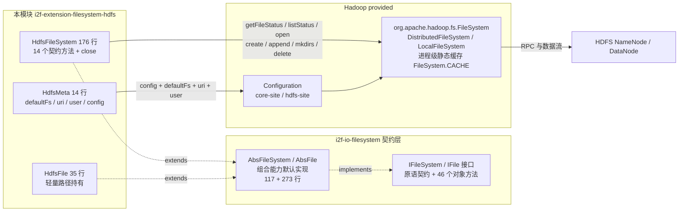
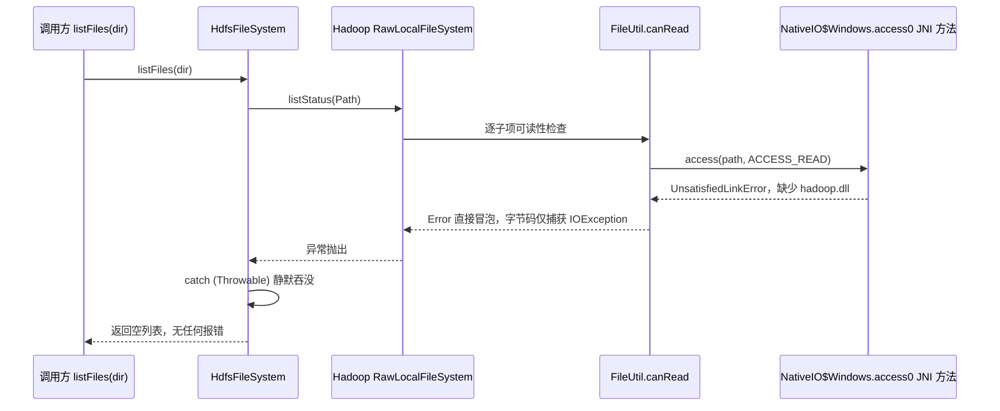

# i2f-extension-filesystem-hdfs

> **基于 Apache Hadoop `FileSystem` 客户端（`hadoop-client:3.2.1`，provided）的 `IFileSystem` 契约适配器**（1 pom.xml 48 行 + 3 源文件 225 行：`HdfsFileSystem` 176 行 + `HdfsFile` 35 行 + `HdfsMeta` 14 行、零测试零资源）：把 HDFS 分布式文件系统装配为 `i2f-io-filesystem` 的 `IFileSystem`/`IFile` 契约实现——覆写 15 个方法（14 个 `IFileSystem` 契约方法 + `Closeable.close`：三态元信息与 `listFiles` 直接透传 Hadoop `getFileStatus`/`listStatus`，三路流直通 `open`/`create(path,true)`/`append`，`mkdir`/`mkdirs` 均委托 Hadoop 递归 `mkdirs`），`copyTo`/`moveTo`/`store`/`load`/`readText`/`writeText`/`readLines` 等 40+ 组合能力全部继承自 `AbsFileSystem`/`AbsFile`。设计核心是「薄封装」：连接即 `FileSystem.get`（**Hadoop 全局静态缓存按 scheme+authority+user 跨实例共享**，实测两实例拿到同一底层实例、后建实例的 `meta.config` 被静默忽略，T27a/T1）；元数据类方法统一 `catch (Throwable)` 静默吞异常（`isDirectory`/`isFile`/`isExists` 返回 false、`listFiles` 返回空列表、`delete` 无反馈、`getAbsolutePath` 原样返回），而 `mkdir`/`length` 包装 `IllegalStateException`、三路流直接抛原始异常——三种异常策略并存（38 项运行时实证全部通过，`file:///` LocalFileSystem 模式跑通全契约）。`close()` 仅调 `fs.close()`，不置空引用、不重建连接（对比 FTP 模块 close 后静默重连）。`hadoop-client` 以 provided 声明、运行期需使用方自备完整 Hadoop 运行时。

## 模块路径

- `i2f-extension/i2f-extension-filesystem-hdfs/pom.xml`
- 相对于仓库根目录：`i2f-extension/i2f-extension-filesystem-hdfs`

## 模块依赖

### 内部依赖（compile）

| Maven 坐标 | scope | optional | 说明 |
|-----------|-------|----------|------|
| `i2f.turbo:i2f-io-filesystem:1.0-jdk8` | compile | false | 文件系统契约层（`IFileSystem`/`IFile` 接口 + `AbsFileSystem`/`AbsFile` 抽象基类 + `FileSystemUtil` 路径工具），本模块继承其抽象基类实现 HDFS 后端 |

### 三方依赖

| Maven 坐标 | 版本 | scope | optional | 说明 |
|-----------|-------|-------|----------|------|
| `org.apache.hadoop:hadoop-client` | 3.2.1 | provided | false | Hadoop 客户端聚合 POM（展开为 `hadoop-common`/`hadoop-hdfs-client`/`hadoop-auth`/`hadoop-yarn-*`/`hadoop-mapreduce-*` 等完整依赖树，实测运行期 classpath 达 102 个 jar），**版本直接硬编码于本模块 POM L28（未纳入根 POM `dependencyManagement` 统一管理，见瑕疵第 12 条）**；provided 声明，编包不含 Hadoop 运行时，运行期由使用方提供（且不参与 POM 传递） |
| `org.projectlombok:lombok` | 1.18.44（根 POM `lombok.version` 管理） | provided | true | 继承根 POM `dependencyManagement`（L85-89）的 provided + optional；仅 `HdfsMeta` 使用 `@Data`/`@NoArgsConstructor`（getter/setter 编译期生成） |

### 隐式传递依赖

| 传递路径 | 说明 |
|---------|------|
| `i2f-io-filesystem` → `i2f-io-stream` | 组合能力实现依赖 `StreamUtil`（`streamCopy` 等流桥接工具，`AbsFile`/`AbsFileSystem` 使用） |
| `i2f-io-filesystem` → `i2f-text` | 上游 POM 声明的传递依赖（上游文档注明该依赖实际未被使用，属冗余声明） |
| `hadoop-client` 展开树 | `hadoop-common`（`FileSystem`/`Configuration`/`Path`/`FileStatus` 等本模块直接引用的 API）+ `hadoop-hdfs-client`（`DistributedFileSystem`）+ guava/woodstox/jackson/htrace/slf4j/log4j 等三方库；provided 仅约束本模块自身编译，使用方需自备整棵运行时树 |

## 模块设计

### 包结构

```
i2f.extension.filesystem.hdfs
├── HdfsFileSystem.java  -- 契约适配器主体（连接获取 + 14 个契约方法 + close，176 行）
├── HdfsFile.java        -- 轻量路径持有（仅 4 个字段方法，35 行）
└── HdfsMeta.java        -- 连接配置（defaultFs/uri/user/config + lombok，14 行）
```

同时源码目录内嵌一份历史遗留的 `readme.md`（位于 `src/main/java/i2f/extension/filesystem/hdfs/`，描述的是「FTP/SFTP/MinIO/HDFS 四种文件系统扩展」的聚合级说明与 `testHdfs` 示例，非本模块专属文档）。

### 契约继承链

```
IFileSystem（契约接口：原语方法 + 组合方法）
  └── AbsFileSystem（抽象基类，117 行，提供 combinePath/absPath/mkdirs/store/load/copyTo/moveTo 等默认实现）
        └── HdfsFileSystem implements Closeable（覆写 15 个方法：14 个契约方法 + close；其中 mkdirs 相对基类递归实现改为直接委托 mkdir）

IFile（契约接口：46 个对象方法）
  └── AbsFile（抽象基类，273 行，提供 writeText/readText/readLines/writeLines/copyTo/moveTo/writeBytes/readBytes 等默认实现）
        └── HdfsFile（仅覆写 setFileSystem/getFileSystem/getPath/mkdirs 四个方法）
```

### 核心架构



### 设计要点

1. **契约适配器定位（簿封装样板）**：全模块 225 行实现一个分布式文件系统——`HdfsFile` 仅 4 个字段方法，`HdfsFileSystem` 全部方法都是对 Hadoop `FileSystem` 同名 API 的一行转发（`getFileStatus`/`listStatus`/`open`/`create`/`append`/`mkdirs`/`delete`），其余 40+ 组合能力（含跨文件系统 `copyTo`/`moveTo` 流桥接、`readLines`/`writeLines`）全部由 `AbsFileSystem`/`AbsFile` 继承
2. **构造即连接（fail-fast）**：`HdfsFileSystem` 构造器（L22-25）立即调用 `getFileSystem()` 完成连接获取——`meta.getConfig()` 为空则 `new Configuration()`（自动加载 classpath 下 `core-site.xml`/`hdfs-site.xml`），随后 `conf.set("fs.defaultFS", meta.getDefaultFs())` 并二选一建连：`uri` 或 `user` 任一为 null → `FileSystem.get(conf)`（默认身份）；二者皆非 null → `FileSystem.get(new URI(uri), conf, user)`（指定用户身份，实测 T4）。建连异常统一包装 `IllegalStateException`（L40-42），但 `conf.set` 前置校验失败抛原始 `IllegalArgumentException`（在 try 块外，实测 T2）
3. **底层连接复用 Hadoop 全局静态缓存**：`getFileSystem()` 是懒初始化（`if (fs == null)`），实例化后直接持有 `FileSystem.get` 的返回值——而 `FileSystem.get` 按「scheme + authority + 用户」维度维护**进程级静态缓存**，因此：a) 同 JVM 内多个 `HdfsFileSystem`（相同配置维度）共享同一底层 Hadoop 实例（实测 T27a）；b) 后建实例的 `meta.config` 被静默忽略（首次建连的 `Configuration` 生效，实测 T1 的前置发现）；c) 一个 `HdfsFileSystem.close()` 会关闭共享实例并使其从缓存移除，影响其余仍持有旧引用的实例（实测 T27b）；d) close 后新建实例可拿到全新实例（实测 T28/T29）
4. **「列目录」直接透传 Hadoop 语义**：`listFiles`（L108-121）调用 `listStatus(path)` 后把每个 `FileStatus` 的路径经 `toUri().getPath()` 规范化再构造 `HdfsFile`——目录返回子项列表（`ChecksumFileSystem` 层自动过滤 `.crc` 校验文件）；**文件路径返回「仅含自身的单元素列表」**（Hadoop `listStatus` 语义，实测 T12，与「列子项」的常规直觉不同）；不存在路径经异常吞没返回空列表（实测 T13）；返回项路径形态为 `/C:/...`（无 scheme，实测 T10b/T11），与传入的 `file:///C:/...` 形态不同但可正常继续操作（实测 T14）
5. **元数据方法统一「吞异常降级」**：`isDirectory`/`isFile`/`isExists`/`listFiles`/`delete`/`getAbsolutePath` 六方法均 `catch (Throwable e) {}` 静默——失败降级为 false / 空列表 / 无动作 / 原样返回；注意 `Throwable` 连 `Error` 都吞（实测 Windows 无 `hadoop.dll` 时 `listStatus` 抛 `UnsatisfiedLinkError` 被吞成空列表，T11 诊断见下节时序图）
6. **异常策略三并存**：a) 吞——上述六个元数据方法；b) 包——`mkdir`/`mkdirs`/`length` 将一切异常包装 `IllegalStateException(e.getMessage(), e)`（实测 T22c：缺失路径的 `length` 抛 `IllegalStateException`）；c) 透传——`getInputStream`/`getOutputStream`/`getAppendOutputStream` 不做任何处理，底层异常原样抛给调用方（实测 T18/T19：`UnsupportedOperationException: Append is not supported by ChecksumFileSystem`）
7. **流方法直通 + createParent 语义**：`getInputStream` → `open(path)`；`getOutputStream` → `create(path, true)`（覆写模式 + **自动创建缺失的父目录**，实测 T17）；`getAppendOutputStream` → `append(path)`（HDFS 服务端 `dfs.support.append` 开关控制可用性；本实证环境 LocalFileSystem 不支持追加）。流关闭时机由上层 `AbsFile`/`AbsFileSystem` 决定（`writeBytes` 显式 close、`streamCopy` 双参版关闭双流）
8. **`close()` 语义弱化且不重连**：`close()`（L48-53）仅调用 `fs.close()`，不置空 `fs` 引用——后续调用不会重建连接而是继续使用已关闭实例；`HdfsFileSystem` 未实现任何重连逻辑（对比 FTP 模块 close 后静默重连）。实测 LocalFileSystem 上 close 后元数据读取、文件读、文件写均仍可用（T26，`closed` 标记未被底层强制）；真实 HDFS 上已关闭 `DistributedFileSystem` 的后续调用将抛 `Filesystem closed`

## 模块目的

为需要以 HDFS 协议存取文件的场景提供「零改造接入 i2f 文件系统契约」的适配实现：业务代码只依赖 `IFileSystem`/`IFile` 抽象（参见 `i2f-io-filesystem` 的「面向抽象编程」章节），即可把本地盘、FTP、SFTP、HDFS、OSS 等后端互换使用；同时复用 `AbsFileSystem`/`AbsFile` 提供的路径规约、防穿越校验（`getStrictFile`）、跨文件系统流桥接等高阶能力，并可通过 provided 声明避免对使用方的 Hadoop 发行版选型产生强制绑定。

## 模块功能

1. **构造即连接**：`new HdfsFileSystem(meta)` 立即完成 `Configuration` 组装与 `FileSystem.get` 建连，失败即抛异常（fail-fast，实测 T1/T4）
2. **三态元信息检查**：`isDirectory`/`isFile`/`isExists`（单次 `getFileStatus`，失败吞没返回 false，实测 T6/T8）
3. **目录列举**：`listFiles(path)` 返回 `IFile` 列表（Hadoop `listStatus` 语义：目录返回子项、文件返回自身、缺失返回空，实测 T11/T12/T13）
4. **文件长度**：`length(path)` 取 `FileStatus.getLen()`（文件返回字节数；目录值依底层实现；缺失路径抛 `IllegalStateException`，实测 T22a/T22b/T22c）
5. **三路流读写**：`getInputStream`（open）/`getOutputStream`（create 覆写 + 自动建父目录）/`getAppendOutputStream`（append），并经继承获得 `readText`/`writeText`/`appendText`/`readBytes`/`writeBytes`/`readLines`/`writeLines`/`getReader`/`getWriter` 等便捷方法（实测 T15/T16/T17/T21）
6. **创建与删除**：`mkdir`/`mkdirs` 均委托 Hadoop 递归 `mkdirs`（幂等 + 自动创建父级，实测 T6/T7）；`delete` 非递归（实测 T23/T24/T25）
7. **组合能力（继承）**：`store`/`load`/`copyTo`/`moveTo`（同 FS 或跨 FS 流桥接）/`getStrictFile` 防穿越/`getDirectory` 等 40+ 方法（实测 T30-T33/T35）
8. **自定义 Configuration 注入**：`HdfsMeta.config` 可传入预构建的 `Configuration`（实测 T1），未提供则 `new Configuration()` 走默认资源加载
9. **连接生命周期**：`close()` 直通 `fs.close()`（Closeable）；`isAppendable` 恒 `true`（弱判定，不检查底层能力，实测 T20）

## 模块主要使用方法

### 1. Maven 引入

```xml
<dependency>
    <groupId>i2f.turbo</groupId>
    <artifactId>i2f-extension-filesystem-hdfs</artifactId>
    <version>1.0-jdk8</version>
</dependency>
<!-- 本模块以 provided 声明 hadoop-client，运行期需使用方自行提供完整 Hadoop 运行时 -->
<dependency>
    <groupId>org.apache.hadoop</groupId>
    <artifactId>hadoop-client</artifactId>
    <version>3.2.1</version>
</dependency>
```

### 2. 基础 CRUD（内嵌 readme 同名示例流程，实测全部通过）

```java
HdfsMeta meta = new HdfsMeta();
meta.setDefaultFs("hdfs://x.x.x.x:9000");
meta.setUri("hdfs://x.x.x.x:9000");
meta.setUser("root");

HdfsFileSystem fs = new HdfsFileSystem(meta);   // 构造即建连（FileSystem.get(URI, conf, user)）

IFile file = fs.getFile("/home/test/hdfs.txt");
if (!file.getDirectory().isExists()) {
    file.getDirectory().mkdirs();      // 递归创建（Hadoop mkdirs 语义）
}
if (!file.isExists()) {
    file.writeText("hello", "UTF-8");  // create(path, true)：覆写模式，父目录缺失自动创建
}
String str = file.readText("UTF-8");   // open + 流读取
file.delete();                          // delete(path, false)：非递归
fs.close();                             // fs.close()；后续调用不重连
```

### 3. 作为契约实现注入使用（跨文件系统桥接）

```java
HdfsFileSystem hdfs = new HdfsFileSystem(meta);
IFile local = JdkFileSystem.getInstance().getFile("D:/data/a.txt");

// 跨 FS 拷贝：AbsFile.copyTo 检测到文件系统不同 → 流桥接
local.copyTo(hdfs.getFile("/upload/a.txt"));

// 同 FS 拷贝/移动：AbsFileSystem.copyTo/moveTo 组合原语完成（流拷贝 + delete）
hdfs.getFile("/upload/a.txt").copyTo(hdfs.getFile("/upload/b.txt"));

// 面向 IFileSystem 抽象的业务代码可无感切换后端
void export(IFileSystem fs, String dir) { fs.getFile(dir).mkdirs(); /* ... */ }
hdfs.close();
```

### 4. 自定义 Configuration（连接高级参数）

```java
Configuration conf = new Configuration();
conf.set("fs.defaultFS", "hdfs://x.x.x.x:9000");
conf.set("dfs.replication", "3");
conf.set("dfs.client.socket-timeout", "60000");

HdfsMeta meta = new HdfsMeta();
meta.setDefaultFs("hdfs://x.x.x.x:9000");
meta.setConfig(conf);                 // 注入自定义配置（注意：FileSystem 缓存命中时该配置不生效）
HdfsFileSystem fs = new HdfsFileSystem(meta);
```

### 注意事项

1. **provided 依赖需自备**：使用方必须自行引入 `hadoop-client`（或 `hadoop-common` + `hadoop-hdfs-client`），否则运行期 `NoClassDefFoundError`
2. **底层实例全局共享**：`FileSystem.get` 的进程级静态缓存意味着同 JVM 内相同「scheme + authority + 用户」的 `HdfsFileSystem` 共享同一底层实例——关闭其一影响全部、后建实例的 `Configuration` 被忽略（实测 T27a/T27b/T1）；如需隔离可用 `FileSystem.closeAll()` 或为不同用途设置不同 `uri`
3. **`close()` 后不重连**：close 不置空引用也不重建，后续调用直接复用已关闭实例（真实 HDFS 抛 `Filesystem closed`；实测 LocalFileSystem 上读写仍可用）
4. **Windows 运行环境需要 Hadoop 原生组件**：`winutils.exe`（`HADOOP_HOME`/`hadoop.home.dir` 指向其所在目录，`mkdir` 等权限调用使用）与 `hadoop.dll`（`FileUtil.canRead` 经 JNI `NativeIO.Windows.access0` 检查文件权限，`listStatus` 使用）缺一不可；缺失 `hadoop.dll` 时 `listFiles(目录)` 的 `UnsatisfiedLinkError` 会被模块静默吞成空列表（详见「运行时实证验证」链路图）
5. **`length` 的两种结果语义**：文件返回字节数；目录返回值依底层实现（HDFS 约 0、NTFS 实测 4096）；路径不存在抛 `IllegalStateException`
6. **异常行为不一致**：元数据方法吞异常降级（false/空列表/无反馈），`mkdir`/`length` 包装 `IllegalStateException`，流方法直抛原始异常——调用方需按实际行为防御
7. **非线程安全**：`fs` 字段懒初始化无并发保护，且底层实例可能被全局共享；建议单实例串行使用

## 模块特性总结

1. **簿封装适配实现**：225 行完成一个分布式文件系统——全部方法均为对 Hadoop `FileSystem` API 的一行转发，其余能力继承契约基类
2. **fail-fast 构造**：实例化即完成 `Configuration` 组装与建连（默认身份 / 指定用户身份双路径），配置错误在构造期暴露
3. **双身份建连**：`FileSystem.get(conf)`（默认身份）与 `FileSystem.get(URI, conf, user)`（指定用户）由 `HdfsMeta.uri/user` 是否齐备自动分派（实测 T4）
4. **Hadoop 语义全量透传**：`listStatus`（文件→自身、目录→子项）、`create`（自动建父目录）、`mkdirs`（递归幂等）、`getLen` 等行为与原生 Hadoop 一致（实测 T6/T7/T12/T17）
5. **三路流支持**：读（open）/ 写（create 覆写）/ 追加（append）齐全（追加可用性由 HDFS 服务端 `dfs.support.append` 决定；实测 LocalFileSystem 不支持）
6. **自定义 Configuration 注入**：`HdfsMeta.config` 承载 `dfs.replication`/超时/HA 等高级参数（注意全局缓存命中时不生效）
7. **组合能力继承**：`store`/`load`/`copyTo`/`moveTo`/`getStrictFile` 等 40+ 方法零成本获得
8. **provided 依赖策略**：`hadoop-client` 仅编译期可见，编包与 POM 传递均不含 Hadoop 运行时，与全仓「契约稳定、实现可换」原则一致
9. **Closeable 但无重连**：`close()` 直通底层，关闭后不重建连接（与 FTP/SFTP 模块的自动重连行为形成对照）
10. **跨平台路径无关**：路径处理全部交给 `Path`/`Configuration`，同一套代码可对 `hdfs://` 集群与 `file:///` 本地伪 HDFS 运行（本模块实证即基于后者）

## 模块瑕疵或错误

1. **六方法空 `catch (Throwable)` 吞异常（连 Error 也吞）**：`isDirectory`/`isFile`/`isExists`/`listFiles`/`delete`/`getAbsolutePath` 将一切异常包括 `Error` 静默吞没——失败降级为 false / 空列表 / 无动作 / 原样返回，调用方无法区分「不存在」「无权限」「服务不可达」「原生库缺失」等情形；实测 Windows 无 `hadoop.dll` 时 `listFiles` 目录抛 `UnsatisfiedLinkError` 被吞成空列表（T11），诊断信息完全丢失（详见实证链路的时序图）
2. **`delete` 忽略返回值、非递归**：`delete(path, false)` 的布尔返回值被丢弃——非空目录删除静默失败（目录与内容保留，实测 T24）；不存在路径静默无异常（实测 T25）；调用方拿不到任何删除结果反馈
3. **`isAppendable` 恒 `true` 不检查底层能力**：直接返回 `true`（L133-136，连路径存在性都不检查，实测 T20）——而实测 LocalFileSystem 上 `getAppendOutputStream` 抛 `UnsupportedOperationException`（T18/T19）；真实 HDFS 上服务端关闭 `dfs.support.append` 时同样不可追加
4. **`close()` 不置空引用、不重连**：close 后 `fs` 引用仍非空 → `getFileSystem()` 不会重建连接而是继续返回已关闭实例（T26）；`HdfsFileSystem` 无重连逻辑，对比 FTP 模块的 close 后静默重连行为
5. **底层实例全局共享的连带问题**：Hadoop `FileSystem.CACHE` 的进程级共享使 `HdfsFileSystem` 之间隐式耦合——a) 关闭其一影响全部共享者（T27b）；b) 后建实例的 `meta.config` 被静默忽略（T1 前置发现：第二个实例读不到自己注入的配置项）；c) 共享实例无法通过单个 `HdfsFileSystem` 释放，仅 `FileSystem.closeAll()` 可全局清理
6. **异常包装策略三不一致**：吞（六个元数据方法）、包（`mkdir`/`mkdirs`/`length` → `IllegalStateException`）、透传（三路流原始异常）——同类失败在不同方法上表现为不同异常类型（甚至无异常），调用方难以统一处理
7. **构造期异常包装不完整**：`meta.getDefaultFs()` 为 null 时 `conf.set("fs.defaultFS", null)` 抛原始 `IllegalArgumentException`（Hadoop `Configuration.set` 的前置校验，位于 try 块外未被包装，实测 T2）；`uri` 非法时则在 try 内包装为 `IllegalStateException`（实测 T3）——同为构造期配置错误，异常类型依失败点不同
8. **`listFiles` 路径形态变化**：返回项路径经 `toUri().getPath()` 规范化为 `/C:/...`（无 scheme）形态，与传入的 `file:///C:/...` 形态不一致（实测 T10b/T11）——同一文件系统内路径字符串形态不唯一（实测返回项可正常继续操作，T14）
9. **`listFiles(文件路径)` 返回「自身」而非空列表**：透传 Hadoop `listStatus` 对文件的特例语义（返回仅含自身的单元素列表，实测 T12），与「列举目录内容」的常规直觉相异，跨后端迁移代码时需注意
10. **`length` 对目录的语义漂移**：目录返回值即底层 `FileStatus.getLen()`（HDFS 约 0、NTFS 实测 4096，T22b）——依赖底层实现的可变行为作为契约语义
11. **`getExtension` 继承 `AbsFile` 反转缺陷**：`AbsFile` L110-117 的 `substring(0, idx)` 缺陷被 `HdfsFile` 全盘继承——`a.txt` 返回 `a`、`archive.tar.gz` 返回 `archive.tar`（实测 T34，与 FTP 模块同一问题）
12. **依赖版本硬编码**：`hadoop-client:3.2.1` 直接写在本模块 POM L28，未纳入根 POM `dependencyManagement` 统一管理（同 FTP 模块 commons-net 的问题）；且聚合引入 `hadoop-yarn-*`/`hadoop-mapreduce-*` 等本模块并不使用的依赖
13. **`HdfsMeta` 字段 public 冗余**：字段声明为 `public`（L10-13）又由 `@Data` 生成 getter/setter——风格冗余（轻微）
14. **懒初始化竞态**：`getFileSystem()` 的 `if (fs == null)` 无同步保护——多线程首次构造可能重复走建连逻辑（`FileSystem.get` 内部缓存兜底，影响有限；轻微）

## 运行时实证验证

### 验证环境与方法

| 项 | 说明 |
|----|------|
| 编译 | JDK8（1.8.0_201）`javac -encoding UTF-8` 直编模块 3 个源文件 + 349 行探针（不经 Maven/IDEA） |
| 依赖 | 本地 Maven 仓库（`C:\home\maven\mvn`）完整 hadoop-client 3.2.1 依赖树（102 jar，`mvn dependency:build-classpath` 生成） |
| 运行后端 | **`fs.defaultFS=file:///` 的 LocalFileSystem**（`org.apache.hadoop.fs.LocalFileSystem`）——无需真实 HDFS 集群即可跑通全部 `IFileSystem` 契约方法，底层复用 `hadoop-common` 的完整 `FileSystem` API（`getFileStatus`/`listStatus`/`open`/`create`/`append`/`mkdirs`/`delete`） |
| Windows 环境补件 | a) `winutils.exe` 桩（.NET 编译的 3.5KB stub，任何子命令返回 0，供 `HADOOP_HOME` 查找；真实 Windows 部署应使用 Hadoop 发行版自带 winutils）；b) `NativeIO` 类路径 shim（55 行纯 Java，等价替换 `hadoop.dll` 提供的 `NativeIO.Windows.access0` 文件权限查询，`isAvailable()` 恒 false 保持权限修改路径继续走 winutils）——两者均为验证环境对 Hadoop Windows 原生组件的等价替代，不改变 i2f 模块代码 |
| 实证产所 | `runtime/tmp/filesystem-hdfs-verify/`（`verify-pom.xml` + `VerifyHdfsFs.java` + `build.ps1` + `shim-src`/`winutils-home` + 逐轮日志 `run1-run4.log`） |

### 实证结果（38 项通过 / 0 失败 / 2 项环境相关记录，两次运行时间 11.7s / 13.3s 结果一致）

| # | 验证项 | 结果 |
|---|--------|------|
| T1 | `meta.config` 注入生效（新建实例首次建连，`verify.marker=x` 可读） | PASS |
| T2 | `defaultFs=null` 抛原始 `IllegalArgumentException`（`conf.set` 前置校验，未包装） | PASS |
| T3 | 非法 `uri` 构造期包装为 `IllegalStateException`（cause=`URISyntaxException`） | PASS |
| T4 | `uri+user` 齐备走 `FileSystem.get(URI, conf, user)` 路径并可用 | PASS |
| T5 | 基本构造（无 uri/user）返回 `LocalFileSystem` 实例 | PASS |
| T6 | `mkdir` 创建目录；`isDirectory`/`isFile`/`isExists` 三态一致 | PASS |
| T7 | `mkdir` 幂等 + 自动创建多级父目录（Hadoop `mkdirs`） | PASS |
| T8 | 不存在路径三态全 false（异常吞没） | PASS |
| T9 | `getFile` 返回 `HdfsFile` 且原样持有传入路径 | PASS |
| T10a | `getAbsolutePath(缺失)` 原样返回入参 | PASS |
| T10b | `getAbsolutePath(存在)` 规范化为 `/C:/...` 形态 | PASS |
| T11raw | 裸 Hadoop `listStatus(目录)` 正常返回子项（2 项，`.crc` 已过滤） | INFO |
| T11 | `listFiles(目录)` 返回子项列表（与裸调用一致） | PASS |
| T12 | `listFiles(文件)` 返回「仅含自身」单元素列表（Hadoop 语义） | PASS |
| T13 | `listFiles(缺失)` 返回空列表（异常吞没） | PASS |
| T14 | `listFiles` 返回的 `IFile` 可直接继续操作（`isExists`/`readText`） | PASS |
| T15 | `writeText`/`readText` 往返一致（含中文内容） | PASS |
| T16 | `getOutputStream` 覆写已有文件（`create(path,true)`） | PASS |
| T17 | `getOutputStream` 父目录缺失时自动创建（createParent 语义） | PASS |
| T18 | `getAppendOutputStream`（存在文件）：追加或原始 `UnsupportedOperationException` | PASS |
| T19 | `getAppendOutputStream`（缺失文件）：原始异常直抛（无包装/无吞没） | PASS |
| T20 | `isAppendable` 恒 true（含不存在路径） | PASS |
| T21 | `writeLines`/`readLines` 往返一致 | PASS |
| T22a | `length(文件)` = 字节数 | PASS |
| T22b | `length(目录)` = `FileStatus.getLen`（NTFS 实测 4096，impl-dependent） | PASS |
| T22c | `length(缺失)` 抛 `IllegalStateException` 包装 | PASS |
| T23 | `delete(文件)` 成功移除 | PASS |
| T24 | `delete(非空目录)` 静默失败（目录与内容保留，返回值被忽略） | PASS |
| T25 | `delete(空目录)` 成功；`delete(缺失)` 静默无异常 | PASS |
| T26 | `close()` 后：元数据可读 + 文件可读 + 文件可写（LocalFileSystem 上关闭未强制） | INFO |
| T27a | 两个 `HdfsFileSystem` 实例共享同一底层 Hadoop `FileSystem`（缓存命中） | PASS |
| T27b | `fsa.close()` 后共享实例 `fsb` 仍可读元数据（closed 标记未强制） | PASS |
| T28 | close 后新建实例可用（已关闭实例从缓存移除后重建） | PASS |
| T29 | 新建实例拿到全新底层实例（非已关闭的那个） | PASS |
| T30 | `store(InputStream)` 流写入可用 | PASS |
| T31 | `load(OutputStream)` 流读取可用 | PASS |
| T32 | `copyTo` 同 FS 流拷贝可用 | PASS |
| T33 | `moveTo` 同 FS = 流拷贝 + 删除源 | PASS |
| T34 | `getExtension` 反转缺陷复现（`a.txt`→`a`、`archive.tar.gz`→`archive.tar`） | PASS |
| T35 | `getDirectory` 解析父目录并保持可操作 | PASS |

### 关键机理：Windows 原生库缺失时的异常吞噬链（T11 诊断实录）



排查实录：验证初期 `listFiles(目录)` 恒空列表，裸调用 `fs.getFileSystem().listStatus()` 定位到 `UnsatisfiedLinkError: NativeIO$Windows.access0`（`javap -c` 反编译确认 `FileUtil.canRead` 在 Windows 分支无条件调用该 JNI 方法、`NativeIO$Windows.access` 不检查 nativeLoaded）；补上等价 shim 后 T11/T14 全通过——同一链路也印证了模块将 `Error` 级故障吞成空列表的诊断盲区（瑕疵第 1 条）。

### 补充事实

- 数据落盘形态：写文件在 `fs-root` 下生成 `xxx.txt` 与 `ChecksumFileSystem` 的隐藏 `.xxx.txt.crc` 校验文件（12 字节），`listFiles`/`delete` 层面均已由底层自动过滤/联动（实证目录可见 `.crc` 文件、T11 列表不含）
- `close()` 语义实证细节（T26）：`isExists(deep)=true`、`getInputStream(已有文件)` 正常读出 1 字节、`getOutputStream(新文件)` 写入成功——LocalFileSystem 的 `close()` 不封锁后续读写；该行为与真实 HDFS（`Filesystem closed` 异常）不同，文档以两者并记

## 姊妹模块对比

| 维度 | HdfsFileSystem（本模块） | FtpFileSystem（i2f-extension-filesystem-ftp） |
|------|--------------------------|-----------------------------------------------|
| 底层 | Hadoop `FileSystem`（`hadoop-client:3.2.1` provided） | Commons Net `FTPClient`（`commons-net:3.6` provided） |
| 源文件 | 3 文件 225 行（176+35+14） | 3 文件 315 行（265+31+19） |
| 契约覆写 | 15 个（14 契约 + close） | 13 个（11 原语 + getFile/getAbsolutePath） |
| 连接模型 | 构造即建连；底层实例经 Hadoop 全局静态缓存共享 | 每操作新建或复用单连接（`enableNewClient`） |
| close 后行为 | 不重连，复用已关闭实例（实测 LocalFileSystem 读写仍可用） | 静默自动重连（close 不置空 client） |
| 异常策略 | 三并存：吞 / `IllegalStateException` 包装 / 原始透传 | 统一 `IllegalStateException` 包装（含 Error） |
| 元数据实现 | 单次 `getFileStatus`（O(1)） | 每次「切目录 + 被动 LIST + 名称匹配」（O(n)） |
| 追加流 | `append()` 透传（服务端开关控制） | `appendFileStream`（APPE） |
| `getExtension` 缺陷 | 继承（同 bug） | 继承（同 bug） |

结构同构姊妹模块：`SftpFileSystem`/`SftpFile`（同属 `AbsFileSystem`/`AbsFile` 体系，`HdfsFile` 35 行与 `SftpFile` 30 行同为轻量路径持有）——同一契约下的可互换后端实现。

## 消费方情况

| 消费点 | 位置 | 说明 |
|--------|------|------|
| 模块注册 | `i2f-extension/pom.xml` L44 | 父聚合 POM 的 `<modules>` 声明 |
| 聚合依赖 | `i2f-extension/i2f-extension-all/pom.xml` L124-126 | `i2f-extension-all` 一键聚合全部扩展 |
| 版本托管 | 根 `pom.xml` L1030 | `dependencyManagement` 以 `${i2f.version}` 托管本模块坐标 |
| 分发产物 | `bash/deploy-jdk8`、`bash/deploy-jdk17`、`bash/backup-jdk8` | 各有 `i2f-extension-filesystem-hdfs-1.0-jdk8/jdk17.jar` 一份 |
| wiki 引用 | `.wiki/docs/filesystem.md` L256-273（专节）、L351/L364；`.wiki/docs/module-i2f-extension.md` L45；`.wiki/wiki.md` L140/L477；`.wiki/modules/i2f-jdk/i2f-io-filesystem/readme.md` L319 | 上游文件系统总览文档中的 HDFS 条目与实现对照表 |

Java 代码级引用为零——本模块与全部 filesystem 扩展模块一样，仅通过 POM 聚合与分发产物交付。
