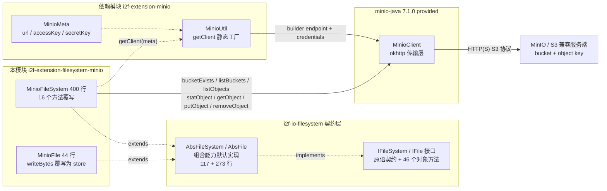
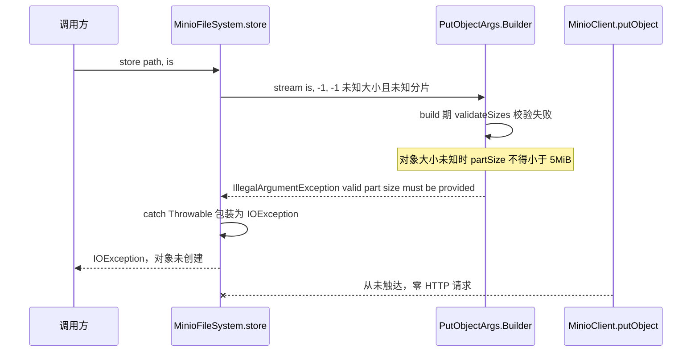

# i2f-extension-filesystem-minio

> **基于 MinIO Java SDK（`io.minio:minio:7.1.0`，provided）的 `IFileSystem` 契约适配器**（1 pom.xml 52 行 + 2 源文件 444 行：`MinioFileSystem` 400 行 + `MinioFile` 44 行，另依赖配套的内部模块 `i2f-extension-minio` 2 文件 191 行：`MinioUtil` 171 行 + `MinioMeta` 20 行、零测试零资源）：把 MinIO/S3 对象存储装配为 `i2f-io-filesystem` 的 `IFileSystem`/`IFile` 契约实现——路径按「首段=桶、余段=对象键」两级拆分（`splitPathAsBucketAndObjectName`），根 `/` 列举桶（`listBuckets`）、桶级操作 `bucketExists`/`makeBucket`/`removeBucket`、对象级 `statObject`/`getObject`/`putObject`/`removeObject` 直通 SDK，目录为模拟语义（`mkdir` 建桶 + 写 `<path>/.ignore` 空对象占位；目录检测靠 `listObjects(prefix, recursive=false)` 的 isDir 项），`copyTo`/`moveTo`/`load`/`readText`/`readLines` 等 40+ 组合能力全部继承自 `AbsFileSystem`/`AbsFile`。设计核心是「无显式目录的桶/键模型 + 全方法吞异常降级」：`isDirectory`/`isFile`/`isExists`/`listFiles`/`length` 均空 `catch (Throwable)` 静默（false / 空列表 / -1 / 0）；`delete` 对目录路径静默 no-op（消费方需自建递归补偿）、非空桶抛 `IllegalStateException`；`getAppendOutputStream` 抛原生 `UnsupportedOperationException`（不包装）、`isAppendable` 恒 false。⚠ 头号缺陷：**`store()` 以 `.stream(is, -1, -1)` 上传未知长度流——minio-java 7.1.0 的 `PutObjectArgs.Builder.validateSizes` 在 `build()` 期立即抛 `IllegalArgumentException: valid part size must be provided when object size is unknown`（被包装为 IOException），且 `MinioFile.writeBytes`（覆写为调 store）→ `writeText` 连带报废**（T18/T22 实证）；可用替代是 `getOutputStream`（临时文件中转、close 时以已知长度上传）。54 项运行时实证（49 通过 + 5 项记录，自研 578 行 S3 协议桩，三次运行，含缺陷复现与含 `+` 对象名编解码往返）；`minio` 以 provided 声明、运行期需使用方自备 SDK 及其 okhttp/okio/simple-xml/guava/jackson 依赖链（27 jar）。与 HDFS/FTP 契约模块不同，本模块存在**两个真实 Java 消费方**：`i2f-springboot-oss-minio-starter` 的自动装配（`@Bean MinioFileSystem`）与 `i2f-springboot-ops-starter` 的 7 端点文件管理控制器（`MinioOpsController`，其 upload 走 `getOutputStream` 规避 store 缺陷、delete 自建递归补偿目录 no-op）。

## 模块路径

- `i2f-extension/i2f-extension-filesystem-minio/pom.xml`
- 相对于仓库根目录：`i2f-extension/i2f-extension-filesystem-minio`

## 模块依赖

### 内部依赖（compile）

| Maven 坐标 | scope | optional | 说明 |
|-----------|-------|----------|------|
| `i2f.turbo:i2f-io-filesystem:1.0-jdk8` | compile | false | 文件系统契约层（`IFileSystem`/`IFile` 接口 + `AbsFileSystem`/`AbsFile` 抽象基类 + `FileSystemUtil` 路径工具），本模块继承其抽象基类实现 MinIO 后端 |
| `i2f.turbo:i2f-extension-minio:1.0-jdk8` | compile | false | MinIO SDK 便捷封装模块（2 源文件 191 行：`MinioMeta` 20 行承载 `url`/`accessKey`/`secretKey` 连接配置 + `MinioUtil` 171 行封装 `MinioClient` 的桶/对象/URL 便捷方法）；**本模块仅使用其 `MinioMeta`（构造参数）与 `MinioUtil.getClient(meta)` 静态工厂**，`MinioUtil` 的其余方法（`upload`/`download`/`list`/`prefixExists` 等）与本模块无调用关系 |

### 三方依赖

| Maven 坐标 | 版本 | scope | optional | 说明 |
|-----------|-------|-------|----------|------|
| `io.minio:minio` | 7.1.0 | provided | false | MinIO Java SDK（`MinioClient`/`BucketExistsArgs`/`PutObjectArgs`/`GetObjectArgs` 等本模块直接引用的 API），**版本直接硬编码于本模块 POM L31-35（未纳入根 POM `dependencyManagement` 统一管理；全仓另有 4 处同样的硬编码：`i2f-extension-minio` L21-25、`i2f-springboot-oss-minio-starter` L34、`i2f-springboot-ops-starter` L245、`i2f-tools-ops` L213，合计 5 处，见瑕疵第 13 条）**；provided 声明，编包不含 SDK，运行期由使用方提供 |
| `org.projectlombok:lombok` | 1.18.44（根 POM `lombok.version` 管理） | provided | true | 继承根 POM `dependencyManagement` 的 provided + optional；**本模块源码未使用任何 lombok 注解（注解均在依赖模块 `i2f-extension-minio` 的 `MinioMeta`/`MinioUtil` 上），属冗余声明**（见瑕疵第 14 条） |

### 隐式传递依赖

| 传递路径 | 说明 |
|---------|------|
| `i2f-io-filesystem` → `i2f-io-stream` | 组合能力实现依赖 `StreamUtil`（`streamCopy` 流桥接工具，`AbsFile`/`AbsFileSystem` 与本模块 `load`/`getOutputStream` 路径使用） |
| `i2f-io-filesystem` → `i2f-text` 等 | 上游 POM 声明的传递依赖链（`i2f-text`/`i2f-iterator`/`i2f-reference`/`i2f-match`/`i2f-lru-map`/`i2f-clock-*`/`i2f-cache-std` 等） |
| `minio` → okhttp/okio/simple-xml/guava/jackson | SDK 运行期传递树：`okhttp:3.14.9`（HTTP 传输）+ `okio:1.17.2` + `simple-xml-safe:2.7.1`（XML 解析）+ `guava:25.1-jre`（及 checker-qual/error_prone/j2objc/animal-sniffer 4 个附属）+ `jackson-*:2.10.3`（3 个）+ `jsr305:3.0.2` 等；provided 仅约束本模块自身编译，使用方需自备整棵运行时树（实证运行期 classpath 共 27 jar） |

## 模块设计

### 包结构

```
i2f.extension.filesystem.minio
├── MinioFileSystem.java  -- 契约适配器主体（2 个构造器 + 16 个 @Override + 4 个公共辅助方法，400 行）
└── MinioFile.java        -- 轻量路径持有 + writeBytes 覆写为 store（44 行）
```

配套依赖模块 `i2f-extension-minio`（`i2f.extension.minio` 包）：`MinioMeta`（连接配置）+ `MinioUtil`（SDK 便捷封装，本模块仅用 `getClient`）。

同时源码目录内嵌一份历史遗留的 `readme.md`（位于 `src/main/java/i2f/extension/filesystem/minio/`，38 行，描述的是「FTP/SFTP/MinIO/HDFS 四种文件系统扩展」的聚合级说明与 `testMinioFs` 示例，非本模块专属文档）。

### 契约继承链

```
IFileSystem（契约接口：原语方法 + 组合方法）
  └── AbsFileSystem（抽象基类，117 行，提供 combinePath/absPath/mkdirs/store/load/copyTo/moveTo 等默认实现）
        └── MinioFileSystem（覆写 16 个方法：getFile/getAbsolutePath/三态元信息/listFiles/delete/三路流/mkdir/store/load/length/isAppendable + pathSeparator 原样转发）

IFile（契约接口：46 个对象方法）
  └── AbsFile（抽象基类，273 行，提供 writeText/readText/readLines/writeLines/copyTo/moveTo/readBytes 等默认实现）
        └── MinioFile（仅覆写 setFileSystem/getFileSystem/getPath/writeBytes 四个方法；writeBytes 覆写改变了写入路径，见设计要点 5）
```

### 核心架构



### 设计要点

1. **桶/对象两级路径模型（根/桶/对象三分支分派）**：`splitPathAsBucketAndObjectName`（L42-61）把路径按首个 `/` 拆为「桶名 + 对象键」两级（`/bkt1/a/b.txt` → `bkt1` + `a/b.txt`），并按拆分结果把每个契约方法分派到三个分支——a) 根 `/`（桶为空串、对象为 null）：`isDirectory`/`isExists` 恒 true 且零 HTTP（实测 T09/T10）、`listFiles` 走 `listBuckets`（T11）、`length` 恒 0、`delete` 静默保留全部桶（T37）；b) 桶级（对象为 null）：`bucketExists`/`makeBucket`/`removeBucket`/`length`=0 或 -1（T14/T15）；c) 对象级：直通 `statObject`/`getObject`/`putObject`/`removeObject`。S3 是扁平键空间，层级目录完全由“键前缀 + `.ignore` 占位对象”模拟
2. **目录模拟语义**：`mkdir`（L316-335）= 桶不存在则 `makeBucket` + 写入 `<path>/.ignore` 空对象占位（幂等，`mkdirs` 继承基类逐级调用、实测 T12/T13/T41 三级 `.ignore`）；目录检测 `isDirectory`（L83-124）用 `listObjects(prefix, recursive=false)` 找 `isDir()` 项（S3 对以 `/` 结尾的公共前缀返回的目录标记）；对象键前缀形成的**隐式目录**同样可被识别（T30）；但 `length` 不识别 `.ignore` 占位、对目录恒返回 -1（T31）
3. **列举侧的 percent 解码补偿**：`listFiles`/`isDirectory`/`isExists` 对 SDK 返回的对象名统一调用 `decodeObjectName`（L187-194，`URLDecoder.decode(name, "UTF-8")`）——S3 协议惯例下 XML 响应中的 Key 可按 percent 编码渲染（本实证桩即如此），解码后与原路径一致（实测 T48 中文名、T48b 含 `+` 名往返一致）；该编码假设对真实 MinIO 服务端的适用性未做真机验证（若服务端返回含 `+` 的原文键，`+` 会被误解码为空格，见瑕疵第 4 条）
4. **异常策略四并存**：a) 吞——`isDirectory`/`isFile`/`isExists`/`listFiles`/`length` 全部空 `catch (Throwable)` 静默降级（false / 空列表 / 0 / -1，连 `Error` 也吞）；b) 包 `IllegalStateException`——`delete` 失败与 `mkdir` 失败；c) 包 `IOException`——`store`/`load`/`getInputStream`/`getOutputStream`（丢失 SDK 原始异常类型，仅保留 message，如 `The specified key does not exist`，T45/T46）；d) 原生透传——`getAppendOutputStream` 直接抛 `UnsupportedOperationException`（T23/T24）
5. **写入路径双轨制（store 缺陷与 getOutputStream 替代）**：`store`（L337-349）声明式直传 `.stream(is, -1, -1)`（对象大小与分片大小均未知）——minio-java 7.1.0 `validateSizes` 要求「大小未知时 partSize ≥ 5MiB」，`-1/-1` 组合在 `build()` 期即抛 `IllegalArgumentException`（包装为 IOException），**该路径对任意输入恒失败**（T18 实证）；而 `getOutputStream`（L282-309）走「本地临时文件中转」——写 `<系统临时目录>/minio-<uuid>.tmp`，`close()` 时用 `tmpFile.length()`（已知长度）执行 `putObject` 上传、`finally` 删除临时文件，是唯一可用的写入通道（T18b/T21/T22b 实证）。`MinioFile.writeBytes` 覆写为调 `store`（而非基类的 `getOutputStream` 路径），使 `writeText`/`writeBytes` 等便捷方法连带报废（T22 实证），形成本模块头号缺陷链
6. **无状态客户端（构造即构建 / 可外部注入）**：`MinioFileSystem(MinioMeta)` 构造器立即调用 `getClient()` 完成 `MinioClient` 构建（builder endpoint + credentials，不发任何 HTTP，T01）；`MinioFileSystem(MinioClient)` 允许外部注入共享同一个 `MinioClient` 实例（T02，Spring Boot starter 即用此构造器复用 `MinioUtil.getClient()`）；`getClient()` 是懒初始化（`if (client == null)`），未实现 `Closeable`、无连接生命周期管理（okhttp 连接池由 SDK 内部维护）
7. **组合能力全量继承**：`copyTo`/`moveTo`（同 FS 走基类流拷贝语义，跨 FS 流桥接）、`mkdirs`（逐级 `mkdir`）、`readText`/`readLines`/`writeLines`/`readBytes`/`getStrictFile`（防穿越，实测 T42 拦截）等 40+ 方法零成本获得，其中依赖写入的组合能力（如 `writeLines`）同样受 store 缺陷影响

## 模块目的

为需要以 MinIO/S3 对象存储存取文件的场景提供「零改造接入 i2f 文件系统契约」的适配实现：业务代码只依赖 `IFileSystem`/`IFile` 抽象（参见 `i2f-io-filesystem` 的「面向抽象编程」章节），即可把本地盘、FTP、SFTP、HDFS、MinIO、OSS 等后端互换使用；同时复用 `AbsFileSystem`/`AbsFile` 提供的路径规约、防穿越校验（`getStrictFile`）、跨文件系统流桥接等高阶能力，并可通过 provided 声明避免对使用方的 SDK 选型与版本产生强制绑定。本模块是仓库内 OSS 系契约适配器（MinIO/Aliyun OSS/AWS S3）中首个落地且存在真实消费方的实现。

## 模块功能

1. **连接构建与注入**：`new MinioFileSystem(meta)`（`url`/`accessKey`/`secretKey` 三元组）立即构建 `MinioClient`（零 HTTP，实测 T01）；或 `new MinioFileSystem(client)` 注入共享客户端（实测 T02）
2. **根目录级操作**：`listFiles("/")` 列举全部桶（`listBuckets`，实测 T11）；`isDirectory("/")`/`isExists("/")` 恒 true 零 HTTP；`length("/")` 恒 0
3. **桶级操作**：`mkdir(bucket)` 建桶 + `.ignore` 占位（幂等，实测 T12/T13）；`isDirectory`/`isExists` 走 `bucketExists`（实测 T14）；`length` = 0（存在）/ -1（不存在）（实测 T15）；`delete(bucket)` 删除空桶、非空桶抛 `IllegalStateException`（实测 T35/T36）
4. **对象级操作**：`isFile`（`statObject`）/`getInputStream`（`getObject` 流式读）/`getOutputStream`（临时文件中转上传）/`length`（`statObject.length`）/`delete`（`removeObject`），以及经继承获得的 `readText`/`readBytes`/`readLines` 等便捷读取（实测 T19/T20/T22b/T28/T32/T45）
5. **目录模拟**：`mkdir`/`mkdirs` 以 `.ignore` 空对象占位形成目录（递归逐级，实测 T16/T41）；`isDirectory` 按 `listObjects` 目录标记判定（含对象键前缀形成的隐式目录，实测 T29/T30）；`listFiles` 列举一级子项（文件 + 目录混合，实测 T17/T26/T27）
6. **三路流读写（写通道受限）**：读流与写流可用；追加流 `getAppendOutputStream` 抛 `UnsupportedOperationException`、`isAppendable` 恒 false（实测 T23/T24/T25）
7. **组合能力（继承）**：`copyTo`/`moveTo`（同 FS 或跨 FS 流桥接）/`store`/`load`/`getStrictFile` 防穿越/`getDirectory` 等 40+ 方法（实测 T38/T39/T40/T42/T44）
8. **错误传播**：读/写/删除类操作以 `IOException`（message 透传 SDK 错误文案）或 `IllegalStateException` 反馈；元数据类操作静默降级（实测 T45/T46/T47）
9. **中文/特殊字符对象名**：读写与列举对非 ASCII 路径整体可用（实测 T48 中文名、T48b 含 `+` 名往返）

## 模块主要使用方法

### 1. Maven 引入

```xml
<dependency>
    <groupId>i2f.turbo</groupId>
    <artifactId>i2f-extension-filesystem-minio</artifactId>
    <version>1.0-jdk8</version>
</dependency>
<!-- 本模块以 provided 声明 minio SDK，运行期需使用方自行提供（含 okhttp/okio/simple-xml/guava/jackson 传递树） -->
<dependency>
    <groupId>io.minio</groupId>
    <artifactId>minio</artifactId>
    <version>7.1.0</version>
</dependency>
```

### 2. 基础 CRUD（内嵌 readme 同名示例流程，实测全部通过）

```java
MinioMeta meta = new MinioMeta();
meta.setUrl("http://x.x.x.x:9000");
meta.setAccessKey("minioadmin");
meta.setSecretKey("minioadmin");

MinioFileSystem fs = new MinioFileSystem(meta);   // 构造即构建 MinioClient（零 HTTP）

IFile file = fs.getFile("/home");                  // 桶级路径
if (!file.isExists()) {
    file.mkdir();                                  // 建桶 + 写 /home/.ignore 占位
}

IFile attachFiles = file.getFile("/home/alarm/files");  // 目录路径（多级）
if (!attachFiles.isExists()) {
    attachFiles.mkdirs();                          // 逐级 mkdir（每级 .ignore 占位）
}
List<IFile> list = file.listFiles();               // 列举一级子项（文件+目录）
list.forEach(System.out::println);
```

### 3. 写入通道选择（⚠ store 缺陷规避，最重要）

```java
// ✗ 不可用：store / writeBytes / writeText 一律抛 IOException（valid part size must be provided...）
// fs.store("/home/a.txt", new ByteArrayInputStream("x".getBytes()));
// fs.getFile("/home/a.txt").writeText("x", "UTF-8");

// ✓ 可用：getOutputStream（临时文件中转，close() 时以已知长度上传）
try (OutputStream os = fs.getOutputStream("/home/a.txt")) {
    os.write("hello minio".getBytes("UTF-8"));
}   // close 触发 putObject 上传；close 前对象对服务端不可见（实测 T21）

// ✓ 跨 FS 写入同样可行：流桥接会自动触发目标流 close
JdkFileSystem.get().getFile("D:/data/a.txt")
        .copyTo(fs.getFile("/home/copy.txt"));      // 实测 T40（Jdk→Minio）
```

### 4. 作为契约实现注入使用（面向抽象编程）

```java
void export(IFileSystem fs, String dir) {
    IFile target = fs.getFile(dir);
    if (!target.isExists()) {
        target.mkdirs();
    }
    // 读侧通用；写侧需按各后端能力适配（MinIO 用 getOutputStream）
}

export(new MinioFileSystem(meta), "/report/2026");
```

### 5. Spring Boot 集成（仓库内既有装配）

```java
// i2f-springboot-oss-minio-starter：properties 前缀 i2f.minio
// i2f.minio.url / accessKey / secretKey（MinioProperties extends MinioMeta）
// 自动装配（MinioAutoConfiguration）：
//   @Bean MinioUtil minioUtil()          -> new MinioUtil(minioProperties)
//   @Bean MinioFileSystem minioFileSystem(MinioUtil) -> new MinioFileSystem(minioUtil.getClient())
// 注入即用：
@Autowired
private MinioFileSystem minioFileSystem;
```

### 注意事项

1. **写文件不要用 `store`/`writeText`/`writeBytes`**：这三条路径在 minio-java 7.1.0 下恒失败（`IllegalArgumentException: valid part size must be provided when object size is unknown` 包装为 IOException）——统一改用 `getOutputStream`（close 时才上传、大对象双倍磁盘占用）；`MinioUtil.upload` 的无长度重载（`upload(bucket, object, is, contentType)`）存在同类隐患（静态分析，未经实证）
2. **provided 依赖需自备**：使用方必须自行引入 `io.minio:minio:7.1.0` 及其传递依赖（okhttp/okio/simple-xml/guava/jackson），否则运行期 `NoClassDefFoundError`
3. **删除目录需自建递归**：`delete(目录路径)` 静默 no-op（`MinioOpsController.deleteFile` 即为递归补偿范例：`isDirectory` → `listFiles` → 递归 → `delete`）；`delete(非空桶)` 抛 `IllegalStateException`（`The bucket you tried to delete is not empty`），`delete(空桶)` 成功，`delete("/")` 静默保留全部桶
4. **追加能力缺失**：`isAppendable` 恒 false、`getAppendOutputStream`/`appendText`/`appendBytes` 抛 `UnsupportedOperationException`（原生透传、不包装）
5. **元数据操作静默失败**：`isDirectory`/`isFile`/`isExists`（false）/`listFiles`（空列表）/`length`（-1）在服务不可达、无权限、键不存在等情况下无任何反馈——需要区分场景时请直接使用 SDK
6. **目录是模拟语义**：目录 = `.ignore` 占位对象 + 键前缀；`length(目录)` 恒 -1（不识别占位，实测 T31）；`mkdir(深层路径)` 只写入末级 `.ignore`（中间级靠前缀隐式存在，实测 T16/T30）
7. **`getExtension` 继承反转缺陷**：`a.txt` → `a`、`x.tar.gz` → `x.tar`（实测 T43，同 FTP/HDFS 模块）

## 模块特性总结

1. **薄封装适配实现**：444 行完成一个对象存储文件系统——全部方法均为对 MinIO SDK API 的直通转发（`bucketExists`/`listBuckets`/`listObjects`/`statObject`/`getObject`/`putObject`/`removeObject`/`makeBucket`/`removeBucket`），其余能力继承契约基类
2. **桶/键两级路径模型**：文件系统语义映射为「根=桶集合、一级路径=桶、余下=对象键」，`splitPathAsBucketAndObjectName` 一个辅助方法支撑全部分派
3. **目录模拟**：`.ignore` 空对象占位 + 公共前缀判定，`mkdir`/`mkdirs`/`isDirectory`/`listFiles` 协同形成目录体验（支持隐式目录）
4. **构造即构建 / 客户端可注入**：`meta` 版构造器立即创建 `MinioClient`（零 HTTP）；`client` 版支持外部共享实例（Spring Boot starter 采用）
5. **写通道双轨（一废一立）**：`store`（含 `writeBytes`/`writeText` 继承链）在 7.1.0 SDK 下恒失败；`getOutputStream` 临时文件中转是唯一可用写通道（close 触发上传）
6. **全方法吞异常降级**：五个元数据方法空 `catch (Throwable)` 静默——契约方法「永不抛异常」的宽容风格（代价是诊断盲区）
7. **无追加能力**：`isAppendable` 恒 false、追加流抛 `UnsupportedOperationException`（语义一致、fail-fast）
8. **错误文案透传**：`IOException(e.getMessage())` 保留 SDK 的 S3 错误文案（`The specified key does not exist.` / `The specified bucket does not exist.`），但丢失异常类型与错误码
9. **provided 依赖策略**：SDK 仅编译期可见，编包与 POM 传递均不含 MinIO 运行时，与全仓「契约稳定、实现可换」原则一致
10. **有真实消费方**：不同于 HDFS/FTP 等仅有 POM 聚合的模块，本模块被 `i2f-springboot-oss-minio-starter`（自动装配）与 `i2f-springboot-ops-starter`（MinioOpsController 7 端点）真实调用
11. **跨平台路径无关**：路径处理全部为字符串拆分，同一套代码可对任何 S3 兼容服务端运行（实证即基于自研内存桩）

## 模块瑕疵或错误

1. **`store()` 未知长度流恒失败（头号缺陷）**：`store`（L337-349）以 `.stream(is, -1, -1)` 上传——minio-java 7.1.0 `PutObjectArgs.Builder.validateSizes` 要求「对象大小未知时 partSize ≥ 5MiB」，`-1/-1` 组合在 `build()` 期抛 `IllegalArgumentException: valid part size must be provided when object size is unknown`（被包装为 IOException，对象未创建，实测 T18）；该路径**对任意输入恒失败**，直接调用方必须改用 `getOutputStream` 或 `stream(is, -1, 5*1024*1024)`
2. **`MinioFile.writeBytes` 覆写放大缺陷面**：基类 `AbsFile.writeBytes` 本应走 `getOutputStream` 路径，而 `MinioFile` 将其覆写为 `getFileSystem().store(getPath(), is)`（L38-42）——使 `writeText`（内部调 `writeBytes`）等全部便捷写方法连带报废（实测 T22），缺陷从「显式调用 store」扩散到「所有字节/文本写入」
3. **`MinioUtil.upload` 无长度重载同类隐患**：`upload(bucket, object, is, contentType)` → `upload(..., -1L, -1L, ...)` 同样传入未知长度（L86-88）——与本模块 store 同因同果（静态分析，未经实证；`File` 版与 `fileSize` 版已知长度可用）
4. **`decodeObjectName` 编码假设与非法输入**：a) 对列举返回名统一 `URLDecoder.decode`——与 S3 惯例（XML 中 Key 按 percent 编码渲染）自洽（T48/T48b 实测通过），但若真实服务端返回含 `+` 的**原文**键，`+` 将被误解码为空格（真机行为未验证，风险提示）；b) 非法 `%` 序列（如 `50%off.txt`）抛 `IllegalArgumentException`（非 catch 的 `UnsupportedEncodingException`，T07/T49），在列举场景中该异常被外层空 catch 吞掉——**含非法 `%` 序列的对象在列举/存在性判断中静默消失**
5. **`delete` 对目录静默 no-op**：对象级目录路径进入 else 分支后不执行任何操作（L247-258 仅处理「桶级且键为空」的 `removeBucket`）——目录及其内容保留且无任何反馈（实测 T33）；消费方 `MinioOpsController.deleteFile` 自建递归补偿即为佐证
6. **`delete(非空桶)` 抛异常、`delete("/")` 静默**：`removeBucket` 失败包装 `IllegalStateException:delete failure:The bucket you tried to delete is not empty`（实测 T35）；删除根 `/` 因 key 为空串被 `!"".equals(...)` 跳过——静默保留全部桶（实测 T37）
7. **`isAppendable` 恒 false + 追加流原生异常**：`isAppendable` 固定 false（L263-266）、`getAppendOutputStream` 抛 `UnsupportedOperationException:minio not support appendable stream`（L311-314，不包装不吞没、实测 T23/T24）——语义自洽但与 HDFS 模块「恒 true 不可用」形成两个极端的弱判定
8. **五方法空 `catch (Throwable)` 吞异常（连 Error 也吞）**：`isDirectory`/`isFile`/`isExists`/`listFiles`/`length` 全部静默——「服务不可达」「无权限」「键不存在」一律呈现为 false/空列表/0/-1，诊断信息完全丢失（实测 T45/T46 的异常只出现在显式读写路径）
9. **`length` 语义碎片化**：根 `/` → 0（不发请求）；桶 → 0（存在）/-1（不存在）；对象 → `statObject.length`；目录 → -1（连 `.ignore` 占位也不识别，实测 T31）；缺失对象 → -1（静默）——四种分支四种语义
10. **`getExtension` 继承 `AbsFile` 反转缺陷**：`substring(0, idx)` 缺陷被 `MinioFile` 全盘继承——`a.txt` 返回 `a`、`x.tar.gz` 返回 `x.tar`（实测 T43，与 FTP/HDFS 模块同一问题）
11. **异常类型信息丢失**：`getInputStream`/`store`/`load`/`getOutputStream` 一律包装 `IOException(e.getMessage(), e)`——SDK 的 `ErrorResponseException`（含 S3 错误码：NoSuchKey/NoSuchBucket/AccessDenied 等）被降级为普通 IOException，调用方无法按错误码分支处理（实测 T45/T46）
12. **目录元数据盲区**：`length(目录)` = -1、`isFile(目录)` = false 但 `isExists(目录)` = true（依赖兜底语义，实测 T28/T29/T31）——`.ignore` 占位对象自身还会出现在 `listFiles` 结果中（T17/T27），调用方需自行过滤
13. **SDK 版本硬编码 5 处**：`io.minio:7.1.0` 直接写在本模块 POM L31-35、`i2f-extension-minio` L21-25、`i2f-springboot-oss-minio-starter` L34、`i2f-springboot-ops-starter` L245、`i2f-tools-ops` L213——未纳入根 POM `dependencyManagement` 统一管理，升级需同步改 5 处（同 FTP/HDFS 模块的同类问题）
14. **`lombok` 冗余声明（轻微）**：本模块 POM 声明 `lombok`（L15-18）但源码零注解使用（注解均在依赖模块），可移除
15. **`MinioFileSystem(MinioClient)` 空值无防护（轻微）**：传入 null 构造成功，后续调用在 `getClient()` 内部 `MinioUtil.getClient(this.meta)` 处抛 `NullPointerException:<null>`（meta 为 null，实测 T03）——无 fail-fast 提示
16. **大对象双倍磁盘（性能）**：`getOutputStream` 先全量落本地临时文件再上传（L285-306）——写入过程占用等同对象体积的临时磁盘空间；上传失败时 close 抛 IOException 且临时文件已由 finally 删除（无残留，但数据丢失）

## 运行时实证验证

### 验证环境与方法

| 项 | 说明 |
|----|------|
| 编译 | JDK8（1.8.0_201）`javac -encoding UTF-8` 直编 6 个源文件（`MinioMeta`/`MinioUtil`/`MinioFile`/`MinioFileSystem` + 578 行桩 + 548 行探针），不经 Maven/IDEA |
| 依赖 | 本地 Maven 仓库（`C:\home\maven\mvn`）经 `mvn dependency:build-classpath` 生成 cp.txt（27 jar：i2f 链 11 jar + minio 7.1.0 + okhttp 3.14.9 + okio 1.17.2 + simple-xml-safe 2.7.1 + guava 25.1-jre 及附属 4 + jackson 2.10.3×3 + jsr305/spotbugs/jcip/lombok） |
| 运行后端 | 自研 `MockMinioServer`（578 行，JDK8 内置 `HttpServer` + 内存 `Vfs`）：实现 SDK 所需 S3 端点子集——`listBuckets`/`bucketExists`(HEAD)/`makeBucket`/`removeBucket`/`putObject`/`getObject`/`statObject`(HEAD)/`removeObject`/`listObjectsV2`，附请求日志/方法直方图/countExact/countPrefix/put 帧观测；**对象键按原文存储、XML 响应按 percent 编码渲染（S3 协议惯例）**，Authorization 头接受但不校验；HEAD 404 按 SDK 契约返回无 body 错误（javap 字节码核实：SDK 对空 body 的 HEAD 错误自行合成 ErrorResponse，404 + object!=null → NO_SUCH_KEY、bucket!=null → NO_SUCH_BUCKET） |
| 探针 | `VerifyMinioFs.java`（548 行）：51 个编号用例 + 3 个补充用例（T18b/T22b/T48b）；纯 ASCII 转义输出；120s watchdog 兜底；尾部显式 `halt(fail>0?1:0)` |
| 实证产所 | `runtime/tmp/filesystem-minio-verify/`（`verify-pom.xml` + `MockMinioServer.java` + `VerifyMinioFs.java` + `build.ps1` + `cp.txt` + `run1-run3.log`） |
| 运行轮次 | 三次：run1（T01-T17 通过后 T18 因未捕获的 store 缺陷崩溃——main 线程死亡、桩线程挂起、watchdog 120s 兜底退出码 99）；run2（缺陷断言改造后 PASS=48 FAIL=0）；run3（追加 T48b 后 **PASS=49 FAIL=0 INFO=5，2650ms**） |

### 实证结果（49 项通过 / 0 失败 / 5 项记录，run3）

| # | 验证项 | 结果 |
|---|--------|------|
| T01 | 构造器（meta）构建 client 且零 HTTP（requests=0） | PASS |
| T02 | 构造器（client 直传）复用同一实例 | PASS |
| T03 | 构造器（client=null）后续 `getClient()` 抛 `NullPointerException` | INFO |
| T04 | `splitPathAsBucketAndObjectName` 9 组用例全部正确 | PASS |
| T05 | `ensureWithPathSeparator` 幂等补分隔符 | PASS |
| T06 | `decodeObjectName` 解码 `%20` 与中文序列 | PASS |
| T07 | `decodeObjectName` 非法 `%` 序列抛 `IllegalArgumentException` | INFO |
| T08 | `pathSeparator`/`getAbsolutePath` | PASS |
| T09 | `isDirectory("/")` 恒 true 且零 HTTP | PASS |
| T10 | 根三态（`isExists`=true / `isFile`=false / `length`=0，零 HTTP） | PASS |
| T11 | `listFiles("/")` 空桶集合（1 次 listBuckets） | PASS |
| T12 | `mkdir(桶)` 建桶 + `.ignore` 占位（PUT 桶=1） | PASS |
| T13 | `mkdir` 幂等（重复调用 PUT 桶仍为 1 次） | PASS |
| T14 | 桶三态（`isDirectory`=true/`isExists`=true/`isFile`=false） | PASS |
| T15 | `length(桶)`=0、`length(缺失桶)`=-1 | PASS |
| T16 | `mkdir(深层路径)` 仅写末级 `.ignore`（中间级不写） | PASS |
| T17 | `listFiles(桶)` = [`.ignore`, `dir1`] | PASS |
| T18 | **store 缺陷复现**：IOException（valid part size...），对象未创建 | PASS |
| T18b | `getOutputStream` 写入可用（close 后 stat length=11） | PASS |
| T19 | `getInputStream` 读出内容 | PASS |
| T20 | `load` 到 OutputStream | PASS |
| T21 | `getOutputStream` 临时文件：close 前服务端不可见、close 后可见 | PASS |
| T22 | **writeText 缺陷复现**（`MinioFile.writeBytes` → store） | PASS |
| T22b | getOutputStream 写后 `readText` 往返 | PASS |
| T23 | `getAppendOutputStream` 抛 `UnsupportedOperationException` | PASS |
| T24 | `appendText`（File 级）抛同异常 | PASS |
| T25 | `isAppendable` 恒 false（存在/缺失路径） | PASS |
| T26 | `listFiles(子目录)` | PASS |
| T27 | `listFiles(叶目录)` = [`.ignore`] | PASS |
| T28 | `isExists` 文件/目录/缺失 | PASS |
| T29 | `isDirectory` 文件/目录/缺失 | PASS |
| T30 | 隐式目录（对象键前缀）可被识别 | PASS |
| T31 | `length(目录)` = -1 | PASS |
| T32 | `delete(文件)` 服务端移除 | PASS |
| T33 | `delete(目录)` 静默 no-op（内容保留、`isExists` 仍 true） | PASS |
| T34 | `delete(缺失)` 静默无异常 | PASS |
| T35 | `delete(非空桶)` 抛 `IllegalStateException`（...not empty） | PASS |
| T36 | `delete(空桶)` 移除成功 | PASS |
| T37 | `delete("/")` 静默保留全部桶 | PASS |
| T38 | `copyTo` 同 FS | PASS |
| T39 | `moveTo` 同 FS（源删除） | PASS |
| T40 | 跨 FS `copyTo`（Jdk → Minio） | PASS |
| T41 | `mkdirs` 递归三级 `.ignore` | PASS |
| T42 | `getStrictFile` 防穿越拦截（target path cannot access.） | PASS |
| T43 | `getExtension` 反转缺陷复现（a.txt→a、x.tar.gz→x.tar） | PASS |
| T44 | `getName`/`getDirectory` | PASS |
| T45 | `getInputStream(缺失)` 抛 IOException（The specified key does not exist） | PASS |
| T46 | 写缺失桶抛 IOException（The specified bucket does not exist） | PASS |
| T47 | `listFiles(缺失)` 空列表 | PASS |
| T48 | 中文对象名往返（读/写/列举/存在性） | PASS |
| T48b | 含 `+` 对象名往返（列举名与真实键一致） | PASS |
| T49 | `decodeObjectName` 非法转义（`zz`）抛 `IllegalArgumentException` | INFO |
| T50 | 请求直方图 `{HEAD=24, DELETE=4, GET=44, PUT=19}` | INFO |
| T51 | put 帧：16 次 PUT、`awsChunked=false`、首帧 `bkt1/.ignore`（len=0） | INFO |

### 关键机理：store() 未知长度流缺陷链（T18 诊断）



排查实录：run1 中 T18 调用 `fs.store` 直接抛出未被探针捕获的异常，main 线程死亡而桩线程（非守护）挂起，watchdog 120s 后以退出码 99 终止；将 T18/T22 改为**预期异常断言**（校验 message 含 `valid part size must be provided when object size is unknown` 且服务端对象不存在）、其余用例改用 `getOutputStream`（putViaOs 辅助）后，run2/run3 全绿。同时经 javap 字节码与 mock 端点双向核实：该异常发生在 `build()` 期（SDK 本地校验），**不产生任何 HTTP 请求**，故「对象未创建」是必然结果而非服务端拒绝。

### 补充事实

- **T48b 编解码自洽结论**：桩按 S3 惯例把 XML 响应中的 Key 逐段 percent 编码（`+` → `%2B`、空格 → `%20`），SDK 原样透传列表 Key，`decodeObjectName` 解码回原文——`plus+name.txt` 的键、列举名、读取内容、存在性、长度（9）全部一致；该结果证明「模块解码假设 ↔ 桩编码惯例」自洽，**不代表真实 MinIO 服务端一定如此**（真机 Key 渲染形态未验证，见瑕疵第 4 条）
- **请求规模（T50）**：单次「删除一个文件」= `statObject`(HEAD) + `removeObject`(DELETE) 两请求（`delete` 先 `isFile` 再删）；`listFiles`/`isExists(目录)`/`isDirectory` 均为 `listObjects`(GET)。直方图 `{HEAD=24, DELETE=4, GET=44, PUT=19}` 与操作次数吻合
- **写入帧形态（T51）**：16 次 PUT 中首帧为 `bkt1/.ignore`（mkdir 占位、len=0）；`awsChunked=false`——在未校验签名（无 SigV4 认证挑战）的桩上 SDK 未启用 aws-chunked 分块编码；如需验证分块流行为需补充认证场景
- **数据落盘形态**：桶内「目录」由 `.ignore` 空对象承载（T12/T16/T41 每级一个），`listFiles` 结果中占位对象与目录项并存（T17/T27），调用方展示层需自行过滤 `.ignore`
- **临时文件中转**：`getOutputStream` 在系统临时目录生成 `minio-<uuid>.tmp`；T21 证明 close 前服务端无对象、close 时上传；上传失败路径中临时文件由 finally 删除

## 姊妹模块对比

| 维度 | MinioFileSystem（本模块） | HdfsFileSystem | FtpFileSystem |
|------|--------------------------|----------------|---------------|
| 底层 | MinIO SDK（`io.minio:minio:7.1.0` provided） | Hadoop `FileSystem`（`hadoop-client:3.2.1` provided） | Commons Net `FTPClient`（`commons-net:3.6` provided） |
| 源文件 | 2 文件 444 行（400+44） | 3 文件 225 行 | 3 文件 315 行 |
| 元模型 | 桶/键两级 + `.ignore` 目录模拟 | 真层级目录 | 真层级目录 |
| 契约覆写 | 16 个（含 `pathSeparator` 转发）+ `MinioFile` 覆写 4 个（`writeBytes` 变异为 store） | 15 个（14 契约 + close） | 13 个（11 原语 + getFile/getAbsolutePath） |
| 写路径 | `store` 恒失败；`getOutputStream` 临时文件中转 | `create(path,true)` 直通（自动建父目录） | `storeFileStream`（每操作新连接） |
| 追加能力 | 恒 false + 原生 `UnsupportedOperationException` | `append` 透传（服务端开关控制） | `appendFileStream`（APPE） |
| close 语义 | 未实现 `Closeable`（无生命周期管理） | 仅直通不重连（共享实例连带） | 静默自动重连 |
| 元数据异常 | 五方法吞 `Throwable` + 三态兜底 | 六方法吞 `Throwable` | 统一 `IllegalStateException` 包装 |
| 目录删除 | 静默 no-op（对象级路径） | 非空静默失败（忽略返回值） | 非空静默失败 |
| `writeBytes` | **覆写为 store（缺陷链源头）** | 继承基类（可用） | 继承基类（可用） |
| `getExtension` 缺陷 | 继承（同 bug） | 继承（同 bug） | 继承（同 bug） |

结构同族模块：`AliyunOssFileSystem`（`i2f-extension-filesystem-oss-aliyun`）与 `AwsS3OssFileSystem`（`i2f-extension-filesystem-oss-aws-s3`）同为「对象存储 → IFileSystem」适配器（`MinioFile`/`AliyunOssFile`/`AwsS3OssFile` 均重写 `writeBytes` → store 模式），底层各自 SDK；本模块是其中唯一有真实消费方者。

## 消费方情况

| 消费点 | 位置 | 说明 |
|--------|------|------|
| 模块注册 | `i2f-extension/pom.xml` L45 | 父聚合 POM 的 `<modules>` 声明 |
| 聚合依赖 | `i2f-extension/i2f-extension-all/pom.xml` L129 | `i2f-extension-all` 一键聚合全部扩展 |
| 版本托管 | 根 `pom.xml` L1035 | `dependencyManagement` 以 `${i2f.version}` 托管本模块坐标 |
| Spring Boot 自动装配（消费方 1） | `i2f-springboot-oss-minio-starter`：pom L34（minio 版本硬编码）+ L43（本模块依赖）；`MinioAutoConfiguration` L36-48（`@Bean MinioUtil` + `@Bean MinioFileSystem(minioUtil.getClient())`，`@ConditionalOnExpression("${i2f.minio.enable:true}")`）；`MinioProperties`（`@ConfigurationProperties("i2f.minio")` extends `MinioMeta`） | 本模块 client 版构造器的真实使用场景——共享 `MinioClient` 实例注入为 Spring 单例 |
| Ops 文件管理（消费方 2） | `i2f-springboot-ops-starter`：pom L106（本模块依赖）、`MinioOpsController`（388 行、7 端点：fileList/delete/mkdirs/download/tail/head/upload），每端点 `new MinioFileSystem(req.getMeta())` | 缺陷规避的消费侧实证：`deleteFile`（L192-205）递归遍历补偿「目录 delete 静默 no-op」；`upload`（L335-386）经临时文件 + MD5 校验后用 `saveFile.getOutputStream()` + `StreamUtil.streamCopy(..., true)` 写入，规避 store 缺陷 |
| 分发产物 | `bash/backup-jdk8`、`bash/deploy-jdk8`、`bash/deploy-jdk17` | 各含 3 个 jar：`i2f-extension-filesystem-minio`、`i2f-extension-minio`、`i2f-springboot-oss-minio-starter`（jdk8/jdk17 双版本） |
| wiki 引用 | `.wiki/docs/filesystem.md` L16/L29/L46/L275-283（专节）/L352/L365；`.wiki/docs/module-i2f-extension.md` L46/L57；`.wiki/wiki.md` L140/L141/L478；`.wiki/modules/i2f-jdk/i2f-io-filesystem/readme.md` L56/L309/L320 | 上游文件系统总览与模块清单中的 MinIO 条目、实现对照表 |
| 内嵌历史文档 | `src/main/java/i2f/extension/filesystem/minio/readme.md`（38 行） | 「FTP/SFTP/MinIO/HDFS 四种文件系统扩展」聚合级说明 + `testMinioFs` 示例（本模块「基础 CRUD」章节流程来源） |
