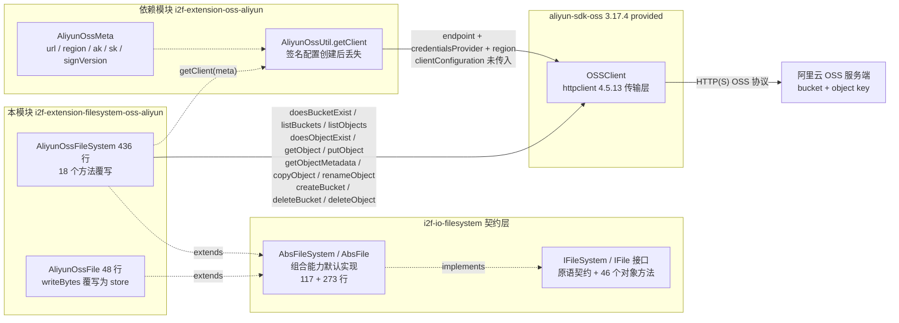
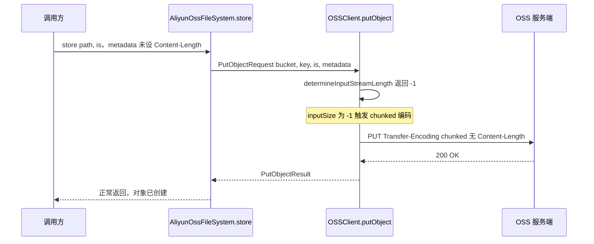
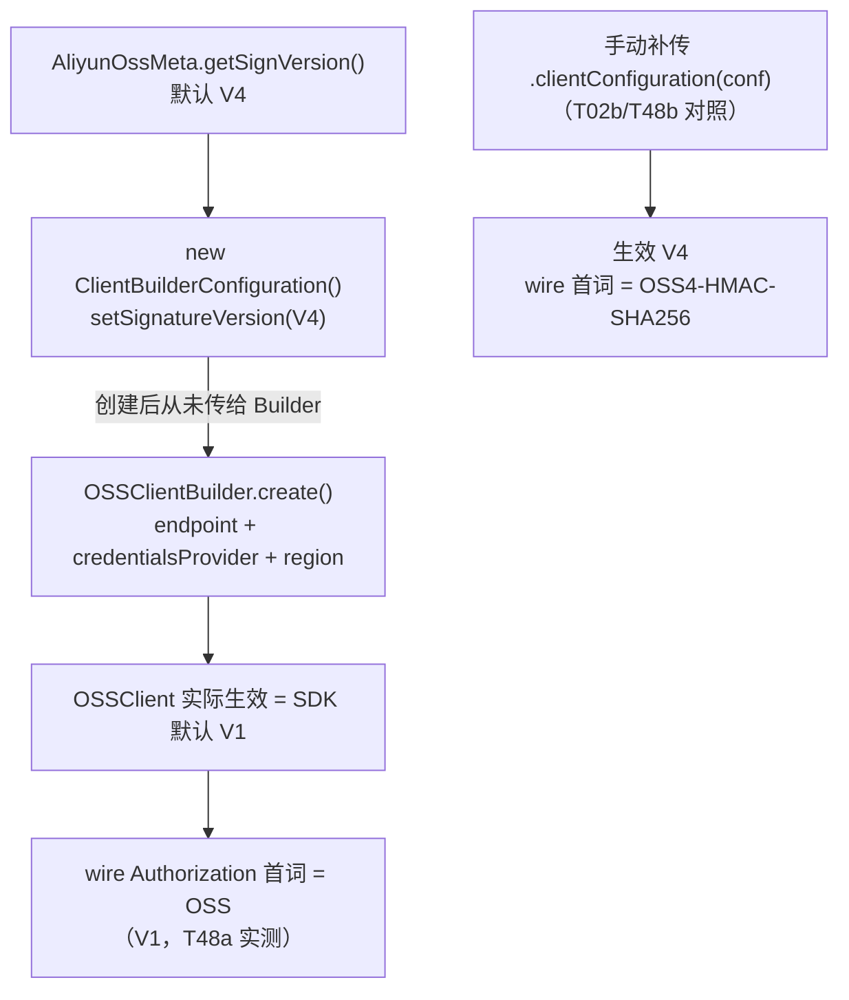

# i2f-extension-filesystem-oss-aliyun

> **基于阿里云 OSS Java SDK（`com.aliyun.oss:aliyun-sdk-oss:3.17.4`，provided）的 `IFileSystem` 契约适配器**（1 pom.xml 79 行 + 2 源文件 484 行：`AliyunOssFileSystem` 436 行 + `AliyunOssFile` 48 行，另依赖配套的内部模块 `i2f-extension-oss-aliyun` 2 文件 237 行：`AliyunOssUtil` 194 行 + `AliyunOssMeta` 43 行、零测试零资源）：把阿里云 OSS 对象存储装配为 `i2f-io-filesystem` 的 `IFileSystem`/`IFile` 契约实现——路径按「首段=桶、余段=对象键」两级拆分（`splitPathAsBucketAndObjectName` 首个 `/` 分派，契约覆写共 18 个），根 `/` 列举桶（`listBuckets`）、桶级 `doesBucketExist`/`createBucket`/`deleteBucket`、对象级 `doesObjectExist`/`getObject`/`putObject`/`getObjectMetadata`/`deleteObject` 直通 SDK，目录为 `.ignore` 空对象占位 + 键前缀模拟，`copyTo` 走服务端 `copyObject`、`moveTo` 同桶走服务端 `renameObject`（`POST /key?x-oss-rename`，全仓独有）、跨桶先拷贝后删除，`readText`/`readLines` 等 40+ 组合能力继承自 `AbsFileSystem`/`AbsFile`。**与 MinIO 模块最大的差异在写入通道**：`store()` 上传未知长度流（`ObjectMetadata` 不设 Content-Length）被 SDK 3.17.4 自动转为标准 chunked 编码传输——**上传成功**（T17 帧证据 `TE=chunked | CL=null`），`AliyunOssFile.writeBytes` 覆写为 store 后 `writeText`/`writeBytes` 等便捷写方法整体可用（T19），`getOutputStream` 则以临时文件中转 + 已知长度上传（T20 帧 `CL=8`）作为第二条通道。⚠ 头号缺陷：**签名版本配置失效**——`AliyunOssUtil.getClient`（L33-47）创建了 `ClientBuilderConfiguration` 并执行 `setSignatureVersion(meta.getSignVersion())`，却**从未传给 `OSSClientBuilder`**（无 `.clientConfiguration(...)` 调用），`meta` 默认声明的 V4 被静默降级为 SDK 默认 V1：运行时双证据为客户端配置 `getSignatureVersion()`=V1（T02，`meta.getSignVersion()`=V4）与 wire `Authorization` 首词=`OSS`（V1 方案，T48a；手动补传 `clientConfiguration` 的对照客户端为 `OSS4-HMAC-SHA256`，T02b/T48b）。其余重点缺陷：`listFiles` 分页缺陷——`do/while (isTruncated)` 循环中取的 `nextMarker` 从未喂给请求（L201 恒用两参 `listObjects(bucket, prefix)` 重载），真实 OSS 上截断响应将**重复列举同一页永不终止**（T47：list calls=3 / marker calls=0 / 只返回首页 3 of 6，实测靠桩的 repeatCap 截停）；`decodeObjectName` 对列举名**无条件** `URLDecoder.decode`——OSS ListObjects 返回**原文键**（非 percent 编码），`+` 被误解码为空格（T45）、`%41` 被解码为 `A`（T46），且含非法 `%` 序列的条目被外层空 catch 吞没静默消失；`getStrictFile` **绝对路径恒拒绝**（`getAbsolutePath` 恒等 + 上游 `FileSystemUtil.absPath` 丢前导斜杠 → `startsWith(root + "/")` 恒 false，T42a；相对 root 可用 T42b、穿越仍拦 T42c）；`delete(目录)` 静默 no-op（T32）；`mkdir` 的 `.ignore` 占位致桶无法直接删除（T51a 需先删 `.ignore`）。112 项运行时实证（112 通过 / 0 失败 / 13 记录，自研 714 行 OSS 协议桩，两次运行结果一致）；`aliyun-sdk-oss` 以 provided 声明、运行期需使用方自备 SDK 及其 httpclient/jdom2/jettison/gson 依赖链（实证运行期 31 jar）。消费方仅 POM 聚合与分发产物（全仓无 Java 层调用）。

## 模块路径

- `i2f-extension/i2f-extension-filesystem-oss-aliyun/pom.xml`
- 相对于仓库根目录：`i2f-extension/i2f-extension-filesystem-oss-aliyun`

## 模块依赖

### 内部依赖（compile）

| Maven 坐标 | scope | optional | 说明 |
|-----------|-------|----------|------|
| `i2f.turbo:i2f-io-filesystem:1.0-jdk8` | compile | false | 文件系统契约层（`IFileSystem`/`IFile` 接口 + `AbsFileSystem`/`AbsFile` 抽象基类 + `FileSystemUtil` 路径工具），本模块继承其抽象基类实现阿里云 OSS 后端 |
| `i2f.turbo:i2f-extension-oss-aliyun:1.0-jdk8` | compile | false | 阿里云 OSS SDK 便捷封装模块（2 源文件 237 行：`AliyunOssMeta` 43 行承载 `url`/`region`/`accessKeyId`/`accessKeySecret`/`signVersion` 连接配置 + `AliyunOssUtil` 194 行封装 `OSS` 客户端的桶/对象/URL 便捷方法）；**本模块仅使用其 `AliyunOssMeta`（构造参数）与 `AliyunOssUtil.getClient(meta)` 静态工厂**——`AliyunOssUtil` 的其余方法（`bucketCreate`/`upload`/`download`/`list`/`prefixCreate`/`urlOf` 等）与本模块无调用关系；注意其 `list(bucket, prefix)`（L142-156）是**正确实现**（`setMarker(nextMarker)` + `do/while` 回填，另有无 prefix 重载 L127-140），与本模块 `listFiles` 的分页缺陷形成同仓正反对照 |

### 三方依赖

| Maven 坐标 | 版本 | scope | optional | 说明 |
|-----------|-------|-------|----------|------|
| `com.aliyun.oss:aliyun-sdk-oss` | 3.17.4 | provided | true | 阿里云 OSS Java SDK（`OSS`/`OSSClientBuilder`/`PutObjectRequest`/`ObjectMetadata`/`ObjectListing` 等本模块直接引用的 API），**版本直接硬编码于本模块 POM L33-35（未纳入根 POM `dependencyManagement` 统一管理；全仓另有 1 处同样硬编码：`i2f-extension-oss-aliyun` L22-24，合计 2 处，见瑕疵第 18 条）**；provided 声明，编包不含 SDK，运行期由使用方提供 |
| `org.projectlombok:lombok` | 1.18.44（根 POM `lombok.version` 管理） | provided | true | 继承根 POM `dependencyManagement` 的 provided + optional；**本模块源码未使用任何 lombok 注解（注解在依赖模块 `i2f-extension-oss-aliyun` 的 `AliyunOssMeta`/`AliyunOssUtil` 上），属冗余声明**（见瑕疵第 18 条） |
| `javax.xml.bind:jaxb-api` | 2.3.1 | provided | true | Java 9+ 运行 JAXB 所需（SDK 的 XML 解析链），POM 注释「java 9 及以上需要以下内容」 |
| `javax.activation:activation` | 1.1.1 | provided | true | 同上，Java 9+ 下 `javax.activation` 命名空间的补充 |
| `org.glassfish.jaxb:jaxb-runtime` | 2.3.3 | provided | true | JAXB 运行时实现，POM 注释「no more than 2.3.3」限定上限 |

### 隐式传递依赖

| 传递路径 | 说明 |
|---------|------|
| `i2f-io-filesystem` → `i2f-io-stream` | `load`/`getOutputStream` 等路径依赖 `StreamUtil`（`streamCopy` 流桥接工具） |
| `i2f-io-filesystem` → `i2f-text` 等 | 上游 POM 声明的传递依赖链（`i2f-text`/`i2f-iterator`/`i2f-reference`/`i2f-match`/`i2f-lru-map`/`i2f-clock-*`/`i2f-cache-std` 等） |
| `aliyun-sdk-oss` → httpclient/jdom2/jettison/gson 等 | SDK 运行期传递树：`httpclient:4.5.13` + `httpcore:4.4.13` + `commons-logging:1.2` + `commons-codec:1.11`（HTTP 传输）+ `jdom2:2.0.6.1` + `jettison:1.5.4`（XML 解析）+ `aliyun-java-sdk-core:4.5.10` + `gson:2.8.6` + `jaxb-api:2.3.1`/`javax.activation-api:1.2.0` + `ini4j` + `slf4j-api:1.7.30` + `opentracing-*:0.33.0`（3 个）+ `aliyun-java-sdk-ram:3.1.0`/`aliyun-java-sdk-kms:2.11.0` 等；provided 仅约束本模块自身编译，使用方需自备整棵运行时树（实证运行期 classpath 共 31 jar） |

## 模块设计

### 包结构

```
i2f.extension.filesystem.oss.aliyun
├── AliyunOssFileSystem.java  -- 契约适配器主体（2 个构造器 + 18 个 @Override + 3 个公共辅助方法，436 行）
└── AliyunOssFile.java        -- 轻量路径持有 + writeBytes 覆写为 store（48 行）
```

配套依赖模块 `i2f-extension-oss-aliyun`（`i2f.extension.oss.aliyun` 包）：`AliyunOssMeta`（连接配置 + 签名版本容错解析）+ `AliyunOssUtil`（SDK 便捷封装，本模块仅用 `getClient`）。

与 MinIO 模块不同，本模块源码目录内**没有**内嵌历史 readme；模块零测试零资源（源码目录仅 `pom.xml` + 2 个 Java 文件）。

### 契约继承链

```
IFileSystem（契约接口：原语方法 + 组合方法）
  └── AbsFileSystem（抽象基类，117 行，提供 combinePath/absPath/mkdirs/store/load/copyTo/moveTo 等默认实现）
        └── AliyunOssFileSystem（覆写 18 个方法：pathSeparator 转发/getFile/getAbsolutePath/三态元信息/listFiles/delete/三路流/mkdir/store/load/length/copyTo/moveTo + isAppendable）

IFile（契约接口：46 个对象方法）
  └── AbsFile（抽象基类，273 行，提供 writeText/readText/readLines/writeLines/copyTo/moveTo/readBytes 等默认实现）
        └── AliyunOssFile（仅覆写 setFileSystem/getFileSystem/getPath/writeBytes 四个方法；writeBytes 覆写改变了写入路径，见设计要点 3）
```

### 核心架构



### 设计要点

1. **桶/对象两级路径模型（根/桶/对象三分支分派）**：`splitPathAsBucketAndObjectName`（L41-60）先剥离前导 `/`，再按首个 `/` 把路径拆为「桶名 + 对象键」两级（`/bkt1/a/b.txt` → `bkt1` + `a/b.txt`），并按拆分结果把每个契约方法分派到三个分支——a) 根 `/`（键为 `""`、值为 null）：`isDirectory`/`isExists` 恒 true、`isFile` 恒 false、`length` 恒 0，全部零 HTTP（实测 T07）、`listFiles` 走 `listBuckets`（L181 根分支）、`delete` 静默零 HTTP（T35）；b) 桶级（值为 null）：`doesBucketExist`/`createBucket`/`deleteBucket`、`length` = 0 或 -1（T13）；c) 对象级：直通 `doesObjectExist`/`getObject`/`putObject`/`getObjectMetadata`/`deleteObject`。OSS 是扁平键空间，层级目录完全由「键前缀 + `.ignore` 占位对象」模拟。7 组拆分用例实测（T03a-g）：`null`→`,null`、`//bkt1`→`,bkt1`（第二个 `/` 成为分隔）、`/bkt1/`→`bkt1,`（空键非 null，触发「对象级」分支，见瑕疵第 8 条）
2. **目录模拟语义**：`mkdir`（L330-352）= 桶不存在则 `createBucket`（幂等，T09 第二次不重复建桶）+ 写入 `<path>/.ignore` 空对象占位（`contentLength=0`、`contentType=application/octet-stream`，T08c）；`mkdir("/bkt1")` 写 `bkt1/.ignore`、`mkdir("/bkt1/dir1")` 写 `dir1/.ignore`（T10）；`mkdirs` 继承基类逐级调用（`/bkt2/d1/d2` → 桶 + `.ignore` + `d1/.ignore` + `d1/d2/.ignore` 四个对象，T11）。目录检测 `isDirectory`（L82-107）对桶级走 `doesBucketExist`、对对象级用 `listObjects(bucket, prefix + "/")` 非空即目录（对象键前缀形成的**隐式目录**同样可识别）；`length(目录)` 不识别 `.ignore` 占位、恒 -1（T12d）
3. **写入路径双通道全量可用（与 MinIO 模块的头号差异）**：a) `store`（L354-365）以不设 Content-Length 的 `ObjectMetadata` 提交 `putObject`——SDK 3.17.4 在 `determineInputStreamLength` 判定无法预知长度后**自动改用标准 chunked 编码传输，上传成功**（T17a 内容完整、T17b 帧证据 `TE=chunked | CL=null`；经 javap 字节码核实：`build()` 中 `setUseChunkEncoding(inputSize == -1 || useChunkEncoding)`、`HttpRequestFactory` 对 PUT+chunked 选用 `ChunkedInputStreamEntity`）；`AliyunOssFile.writeBytes` 覆写为 `ByteArrayInputStream` + `store`（L42-46），故 `writeBytes`/`writeText` 等便捷写方法**整体可用**（T19，帧同样为 chunked）；b) `getOutputStream`（L295-323）走「本地临时文件中转」——写 `<系统临时目录>/aliyun-oss-<uuid>.tmp`，`close()` 时用 `tmpFile.length()`（已知长度）执行 `putObject` 上传、`finally` 删除临时文件（T20c 帧证据 `TE=null | CL=8`）。两条通道互补：store 适合已知/未知长度的流式直传（内存友好），getOutputStream 适合框架式「打开-写入-关闭」习惯（但占双倍磁盘）
4. **签名版本机制失效（头号缺陷，根因在依赖模块）**：`AliyunOssUtil.getClient`（L33-47）先 `new ClientBuilderConfiguration()` 并 `setSignatureVersion(meta.getSignVersion())`（L39-41），随后 `OSSClientBuilder.create().endpoint(...).credentialsProvider(...).region(...).build()`（L42-46）——**缺少 `.clientConfiguration(clientBuilderConfiguration)` 调用**，配置对象被丢弃，实际生效 SDK 默认 V1（`ClientConfiguration.DEFAULT_SIGNATURE_VERSION`）。运行时双证据：`((OSSClient) client).getClientConfiguration().getSignatureVersion()` = V1 而 `meta.getSignVersion()` = V4（T02）；wire `Authorization` 首词 = `OSS`（V1，T48a）。对照实验：手动补传 `.clientConfiguration(v4conf)` 的客户端生效 V4（T02b）、wire 首词 = `OSS4-HMAC-SHA256`（T48b）。`AliyunOssMeta.DEFAULT_SIGN_VERSION = V4`（L15）与 `getSignVersion()` 容错解析（非法值回退 V4，L27-37）都表明「默认 V4」的设计意图，但整条链路从未生效
5. **listFiles 分页缺陷（真实服务端将死循环）**：`listFiles`（L174-252）非根分支用 `do { listing = getClient().listObjects(pair.getKey(), subPath); ... nextMarker = listing.getNextMarker(); } while (listing.isTruncated())`（L200-250）——循环体内**从未使用 `nextMarker`**（两参 `listObjects(bucket, prefix)` 重载不支持 marker 参数，SDK 会新建 `ListObjectsRequest`），每轮都重新请求同一前缀的**第一页**。实测（T47，桩分页旋钮 pageSize=3/repeatCap=3）：6 个对象只返回 3 个（T47b）、3 次 list 请求全部不带 marker（T47a：marker calls=0）、循环重复列举同一页直到桩的 repeatCap 强制截断（T47c）——真实 OSS 桶对象数超过单页上限（默认 100）时该 while 永不终止（探针为此挂 120s watchdog 兜底）。同仓 `AliyunOssUtil.list(bucket, prefix)`（L142-156）的 `setMarker(nextMarker)` + 回填实现即为正确对照
6. **列举名解码假设（与 MinIO 模块相反方向的缺陷）**：`decodeObjectName`（L165-172）对 SDK 返回的对象名统一 `URLDecoder.decode(name, "UTF-8")`。OSS 的 ListObjects 协议返回**原文键**（实测桩按原文渲染，与真实 OSS 行为一致；不同于 S3 惯例的 percent 编码）——中文键不受影响（T44 中文名读写列举完好），但含 `+` 的键被误解码为空格（T45：列举含空格不含 `+`）、含 `%xx` 序列的键被误解码（T46：`%41` 显示为 `A`），列举结果与真实键不一致、后续据此访问将 404；含**非法** `%` 序列的键（如 `50%off.txt`）触发 `URLDecoder` 的 `IllegalArgumentException`，在条目级空 catch（L246-247）中吞没——该条目从列举结果中**静默消失**。对比：MinIO 模块对同一 SDK 语义的假设（S3 percent 编码）在其实证桩上自洽，而本模块对 OSS 原文键的解码属真实副作用
7. **异常策略四并存**：a) 吞——`isDirectory`/`isFile`/`isExists`/`length` 的空 `catch (Throwable)` 静默降级（false/-1），`listFiles` 对条目级异常同样吞（L246-247）；b) 包 `IllegalStateException`——`delete`/`mkdir`/`copyTo`/`moveTo` 失败（`copyTo`/`moveTo` 方法签名却声明 `throws IOException`，实际从不抛 IOException，T37/T41 实测为 `IllegalStateException`）；c) 包 `IOException`——`getInputStream`/`store`/`load`/`getOutputStream`（message 为 SDK 异常全文，含 `[ErrorCode]`/`[RequestId]`/XML 片段，但类型统一降为 IOException，调用方无法按类型分支）；d) 原生透传——`getAppendOutputStream` 直接抛 `UnsupportedOperationException`（T25b/c）
8. **组合能力与覆写并存**：`copyTo`（L409-418）覆写为服务端 `copyObject`（零数据传输，T36）；`moveTo`（L420-434）覆写为「同桶 `renameObject`（`POST /key?x-oss-rename`，T39c 帧证据 `renames=[bkt2/dst.txt -> bkt2/moved.txt]`）/ 跨桶 `copyObject` + `deleteObject`」（T40 实测 deleteRequests=1）；`mkdirs`/`store(path, File)` 等其余组合能力继承基类；`getStrictFile` 继承基类但在本模块下**绝对路径恒拒绝**（见瑕疵第 4 条）

## 模块目的

为需要以阿里云 OSS 对象存储存取文件的场景提供「零改造接入 i2f 文件系统契约」的适配实现：业务代码只依赖 `IFileSystem`/`IFile` 抽象（参见 `i2f-io-filesystem` 的「面向抽象编程」章节），即可把本地盘、FTP、SFTP、HDFS、MinIO、OSS 等后端互换使用；同时复用 `AbsFileSystem`/`AbsFile` 提供的路径规约、`mkdirs`、跨文件系统流桥接等高阶能力，并可通过 provided 声明避免对使用方的 SDK 选型与版本产生强制绑定。本模块是仓库内 OSS 系契约适配器（MinIO/Aliyun OSS/AWS S3）之一，其 OSS 客户端构造与签名配置经配套模块 `i2f-extension-oss-aliyun` 复用，`copyObject`/`renameObject` 服务端操作是全仓对象存储适配器中唯一的服务端重命名能力。

## 模块功能

1. **连接构建与注入**：`new AliyunOssFileSystem(meta)`（`url`/`region`/`accessKeyId`/`accessKeySecret` 四元组）立即构建 `OSSClient`（零 HTTP，实测 T01）；或 `new AliyunOssFileSystem(client)` 注入共享 `OSS` 实例（支持外部复用；null 注入无防护，见瑕疵第 17 条）
2. **根目录级操作**：`listFiles("/")` 列举全部桶（`listBuckets`）；`isDirectory("/")`/`isExists("/")` 恒 true、`isFile("/")` 恒 false、`length("/")` 恒 0，全部零 HTTP（实测 T07）
3. **桶级操作**：`mkdir(bucket)` 建桶 + `.ignore` 占位（幂等，实测 T08/T09）；`isDirectory`/`isExists` 走 `doesBucketExist`（实测 T13）；`length` = 0（存在）/ -1（不存在）；`delete(bucket)` 删除空桶、非空桶抛 `IllegalStateException`（`BucketNotEmpty`，实测 T33/T34）
4. **对象级操作**：`isFile`（`doesObjectExist`）/`getInputStream`（`getObject` 流式读）/`store`（`putObject` 直传，未知长度自动 chunked）/`getOutputStream`（临时文件中转上传）/`length`（`getObjectMetadata`）/`delete`（`deleteObject`），以及经继承获得的 `readText`/`readBytes`/`readLines` 等便捷能力（实测 T14/T17/T19/T20/T22）
5. **目录模拟**：`mkdir`/`mkdirs` 以 `.ignore` 空对象占位形成目录（递归逐级，实测 T10/T11）；`isDirectory` 按前缀列举判定（含对象键前缀形成的隐式目录）；`listFiles` 列举一级子项（文件 + 目录混合，实测 T26/T27）
6. **服务端拷贝与重命名**：`copyTo` 走 `copyObject`（对象原地复制、零数据传输，实测 T36）；`moveTo` 同桶走 `renameObject`（服务端重命名，实测 T39）、跨桶 `copyObject` + `deleteObject`（实测 T40）——全部为 OSS 服务端操作，全仓独有
7. **三路流读写（写通道全可用）**：读流、写流、`store` 均可用；仅追加流 `getAppendOutputStream` 抛 `UnsupportedOperationException`、`isAppendable` 恒 false（实测 T25）
8. **组合能力（继承）**：`load`/`mkdirs`/`readText`/`writeText`/`readLines`/`writeLines`/`readBytes`/`getStrictFile` 等 40+ 方法（实测 T19/T22/T42）
9. **中文/特殊字符对象名**：读写与列举对中文路径整体可用（实测 T44 中文名往返）；但 `+`/`%xx` 形态的键在列举侧被解码污染（实测 T45/T46，见瑕疵第 3 条）

## 模块主要使用方法

### 1. Maven 引入

```xml
<dependency>
    <groupId>i2f.turbo</groupId>
    <artifactId>i2f-extension-filesystem-oss-aliyun</artifactId>
    <version>1.0-jdk8</version>
</dependency>
<!-- 本模块以 provided 声明 aliyun-sdk-oss，运行期需使用方自行提供（含 httpclient/jdom2/jettison/gson 传递树） -->
<dependency>
    <groupId>com.aliyun.oss</groupId>
    <artifactId>aliyun-sdk-oss</artifactId>
    <version>3.17.4</version>
</dependency>
<!-- Java 9 及以上还需 jaxb-api 2.3.1 / activation 1.1.1 / jaxb-runtime 2.3.3 -->
```

### 2. 基础 CRUD（实证流程）

```java
AliyunOssMeta meta = new AliyunOssMeta();
meta.setUrl("https://oss-cn-hangzhou.aliyuncs.com");   // endpoint
meta.setRegion("cn-hangzhou");                          // V4 签名区域
meta.setAccessKeyId("your-ak");
meta.setAccessKeySecret("your-sk");

AliyunOssFileSystem fs = new AliyunOssFileSystem(meta); // 构造即构建 OSSClient（零 HTTP）

IFile dir = fs.getFile("/my-bucket/docs");              // 桶级 + 目录路径
if (!dir.isExists()) {
    dir.mkdirs();                                       // 逐级 mkdir（每级 .ignore 占位）
}

IFile f = fs.getFile("/my-bucket/docs/a.txt");
f.writeText("hello oss", "UTF-8");                      // writeBytes → store（chunked 上传，可用）

List<IFile> list = dir.listFiles();                     // 列举一级子项（含 .ignore 占位，需自行过滤）
list.forEach(System.out::println);
```

### 3. 写入通道（双通道可用，按场景选择）

```java
// ✓ store：未知长度流直接可用（SDK 自动转 chunked 编码传输，实测 T17 帧 TE=chunked | CL=null）
fs.store("/bkt/a.txt", new ByteArrayInputStream("hello".getBytes("UTF-8")));

// ✓ writeBytes / writeText：内部走 store，同样可用（实测 T19）
fs.getFile("/bkt/b.txt").writeText("line1", "UTF-8");

// ✓ getOutputStream：临时文件中转，close 时以已知 Content-Length 上传（实测 T20 帧 CL=8）
try (OutputStream os = fs.getOutputStream("/bkt/c.txt")) {
    os.write("streamed".getBytes("UTF-8"));
}   // close 触发 putObject；close 前对象对服务端不可见（实测 T20a）

// ⚠ 注意：getOutputStream 返回的流 close 只能调用一次——
//   二次 close 因临时文件已被删除而抛 IOException（实测 T21）
```

### 4. 作为契约实现注入使用（面向抽象编程）

```java
void export(IFileSystem fs, String dir) {
    IFile target = fs.getFile(dir);
    if (!target.isExists()) {
        target.mkdirs();
    }
    // 读侧通用；写侧 store/writeText/getOutputStream 在本后端均可用
}

export(new AliyunOssFileSystem(meta), "/report/2026");
```

### 注意事项

1. **签名版本配置不生效（先于一切）**：`meta.setSignVersion("V4")`（默认即 V4）不会生效——依赖模块 `AliyunOssUtil.getClient` 丢弃了 `ClientBuilderConfiguration`，实际以 V1 签名请求（T02/T48a）。需要 V4 签名（如部分区域/合规要求）时，使用方需**自行构建 `OSS` 客户端**（`OSSClientBuilder.create()....clientConfiguration(conf).build()`，参见 T02b 对照）并通过 `new AliyunOssFileSystem(client)` 注入
2. **大桶列举勿依赖 `listFiles`**：分页 `nextMarker` 未被使用，对象数超过单页上限（默认 100）时真实 OSS 上将重复请求第一页永不返回（T47）；需要完整列举请直接使用 SDK，或参照 `AliyunOssUtil.list(bucket, prefix)` 的正确分页实现自建
3. **特殊字符对象名规避**：列举对 `+`（误解码为空格）与 `%xx` 序列（如 `%41`→`A`）会返回被解码的名字、含非法 `%` 序列键的条目静默消失（T45/T46）——含此类字符的键请直接使用 SDK 访问
4. **provided 依赖需自备**：使用方必须自行引入 `com.aliyun.oss:aliyun-sdk-oss:3.17.4`（Java 9+ 另加 jaxb 三件套）及其传递依赖，否则运行期 `NoClassDefFoundError`
5. **删除目录需自建递归**：`delete(目录路径)` 静默 no-op（T32 零 DELETE、目录保留）；`delete(非空桶)` 抛 `IllegalStateException`；且 `mkdir` 写入的 `.ignore` 占位使桶**不能直接删除**（T51a：先 `delete("<桶>/.ignore")` 再删桶，T51b）
6. **列表结果含 `.ignore` 占位**：`mkdir` 过的目录下会出现 `.ignore` 条目（T26/T27），展示层需自行过滤；`.ignore` 本身 `isFile`=true、`length`=0（T50）
7. **`getStrictFile` 的绝对路径陷阱**：以 `/` 开头的 rootPath 恒被拒绝（T42a，根因见瑕疵第 4 条）——需要防穿越校验时请使用**相对形式** rootPath（如 `"bkt1/dir1"`，T42b 可用、穿越仍被拦 T42c）
8. **`getExtension` 继承反转缺陷**：`photo.jpg` → `photo`（返回去扩展名的部分，实测 T43，同 FTP/HDFS/MinIO 模块）

## 模块特性总结

1. **薄封装适配实现**：484 行完成一个对象存储文件系统——核心方法均为对 OSS SDK API 的直通转发（`doesBucketExist`/`listBuckets`/`listObjects`/`doesObjectExist`/`getObject`/`putObject`/`getObjectMetadata`/`copyObject`/`renameObject`/`createBucket`/`deleteBucket`/`deleteObject`），其余能力继承契约基类
2. **桶/键两级路径模型**：文件系统语义映射为「根=桶集合、一级路径=桶、余下=对象键」，`splitPathAsBucketAndObjectName` 一个辅助方法支撑全部分派
3. **目录模拟**：`.ignore` 空对象占位 + 公共前缀判定，`mkdir`/`mkdirs`/`isDirectory`/`listFiles` 协同形成目录体验
4. **写通道双可用（对 MinIO 的优势项）**：`store` 未知长度流经 SDK 自动 chunked 上传成功（T17）、`getOutputStream` 临时文件已知长度上传（T20）—— `writeBytes`/`writeText` 等便捷写方法无失效（T19）
5. **服务端拷贝 + 服务端重命名**：`copyTo`=`copyObject`、`moveTo` 同桶=`renameObject`（JSON 拷贝零数据传输、`POST ?x-oss-rename`）——全仓对象存储适配器中唯一的服务端重命名
6. **构造即构建 / 客户端可注入**：`meta` 版构造器立即创建 `OSSClient`（零 HTTP）；`client` 版支持外部共享实例
7. **签名版本静默失效**：`meta` 的 `signVersion`（默认 V4）配置完整但链路断裂，实际 V1（T02/T48a）——本模块与依赖模块 `i2f-extension-oss-aliyun` 的一切客户端构建路径同步受影响
8. **分页缺陷**：`listFiles` 取 `nextMarker` 而不用、循环重列同一页（T47）——真实 OSS 大数据量下不终止
9. **列举名无条件 URL 解码**：中文名可用（T44）但 `+`/`%xx` 被污染（T45/T46）——与 MinIO 模块同写法、不同后果（OSS 返回原文键）
10. **异常策略四并存**：吞（四方法 + 条目级）/ `IllegalStateException`（delete/mkdir/copyTo/moveTo，且 copyTo/moveTo 声明 IOException 实抛 ISE）/ `IOException`（四流方法，message 保留 SDK 全文但类型降级）/ 原生 `UnsupportedOperationException`（追加流）
11. **provided 依赖策略**：SDK 仅编译期可见，编包与 POM 传递均不含 OSS 运行时，与全仓「契约稳定、实现可换」原则一致

## 模块瑕疵或错误

1. **签名版本配置失效（头号缺陷）**：`AliyunOssUtil.getClient`（`i2f-extension-oss-aliyun` L33-47）创建 `ClientBuilderConfiguration` 并 `setSignatureVersion(meta.getSignVersion())` 后**未将其传给 `OSSClientBuilder`**（缺 `.clientConfiguration(...)`）——`meta` 默认 V4 被静默降级为 SDK 默认 V1。双证据：客户端生效配置 = V1（T02）、wire `Authorization` 首词 = `OSS`（V1 方案，T48a）；手动补传的对照客户端 = V4 / `OSS4-HMAC-SHA256`（T02b/T48b）。影响面：本模块与该依赖模块的所有 `getClient` 使用路径；V1 签名缺少 V4 的区域绑定与安全特性，且与代码注释「显式声明使用 V4 签名算法」的意图直接矛盾
2. **`listFiles` 分页缺陷（真实 OSS 死循环）**：`do/while (listing.isTruncated())`（L200-250）循环体内取出的 `nextMarker`（L249）从未用于下一次请求——两参 `listObjects(bucket, prefix)` 重载无 marker 能力，每轮重复请求第一页。实测（T47）：6 对象只返回 3（首页）、3 次请求 0 次带 marker、靠桩 repeatCap 截停循环。真实 OSS 页面截断时该循环**永不终止**（探针专设 120s watchdog 以 `halt(2)` 兜底此预期死循环）。同仓 `AliyunOssUtil.list(bucket, prefix)`（L142-156）为正确实现的对照
3. **`decodeObjectName` 无条件 URL 解码污染原文键**：`URLDecoder.decode(name, "UTF-8")`（L165-172）假设列表返回 percent 编码名，但 OSS 返回**原文键**——`+` 被解码为空格（T45）、`%41` 被解码为 `A`（T46），列举名与真实键不一致；含非法 `%` 序列的键使 `URLDecoder` 抛 `IllegalArgumentException`，被条目级空 catch（L246-247）吞没——**条目静默消失**（既不在结果中、也无任何反馈）。中文名不受影响（无 `%`/`+`，T44）
4. **`getStrictFile` 绝对路径恒拒绝（与上游叠加缺陷）**：`getAbsolutePath`（L77-80）恒等返回，`FileSystemUtil.absPath` 的 Stack 算法在拼接后**丢失前导斜杠**（`/bkt1/dir1/x.txt` → `bkt1/dir1/x.txt`），而 `getStrictFile` 的防穿越校验要求结果 `startsWith(rootPath + "/")`——任何以 `/` 开头的 rootPath 恒不满足 → 恒抛 `IllegalStateException: target path cannot access.`（T42a）。相对形式 rootPath（`"bkt1/dir1"`）可用且穿越仍被拦截（T42b/T42c）。根因一半在本模块（`getAbsolutePath` 未覆写补偿）、一半在上游 `i2f-io-filesystem`（`absPath` 实现），同族对象存储模块同理受影响
5. **`delete(目录)` 静默 no-op**：`delete`（L254-275）对「是文件」走 `deleteObject`；否则仅当「桶级且键为空」走 `deleteBucket`——对象级目录路径落入空分支，不执行任何操作也无反馈（T32a 零 DELETE、T32b 目录保留）。消费方必须自建递归删除
6. **`.ignore` 占位导致桶无法直接删除**：`mkdir` 每次都写入 `.ignore` 空对象（L339-346）——仅含 `.ignore` 的「空目录」桶执行 `deleteBucket` 抛 `IllegalStateException: BucketNotEmpty`（T51a），须先 `delete("<path>/.ignore")`（T51b）。目录删除（瑕疵 5 no-op）与此叠加，形成「建目录容易、清目录难」的组合陷阱
7. **`listFiles` 泄漏 `.ignore` 占位**：mkdir 产生的 `.ignore` 对象出现在列举结果中（T26b size=3 含 `.ignore`、T27 叶目录仅 `[/bkt1/dir1/.ignore]`）——消费方需按名过滤，否则目录项与占位对象混显
8. **`listFiles("/bkt1/")` 尾斜杠返回空（怪癖）**：`splitPathAsBucketAndObjectName` 把 `/bkt1/` 拆为「桶 `bkt1` + 空键 `""`」（T03g），随后 `ensureWithPathSeparator("")` → `"/"` 作为前缀列举——无对象以 `/` 开头故恒空（T29）。桶路径**带尾斜杠时列举静默为空**，与不带尾斜杠（T26 三项）行为不一致
9. **`listFiles` 缺失桶泄漏原生 `OSSException`**：仅根分支的 `listBuckets` 有 catch（L187-189）；非根分支的 `listObjects`（L200-250）处于任何 catch 之外——`listFiles("/nobucket")` 抛原生 `com.aliyun.oss.OSSException`（`NoSuchBucket`，T28b），与「列举失败返回空列表」的静默风格自相矛盾；`isDirectory` 对象级 `listObjects`（L99）同样处于 catch 之外（静态观察；T28b 在 listFiles 侧已实证同类逃逸）
10. **异常策略四并存 + 声明与实抛不符**：吞（`isDirectory`/`isFile`/`isExists`/`length` 空 `catch (Throwable)`）、包 `IllegalStateException`（`delete`/`mkdir`/`copyTo`/`moveTo`）、包 `IOException`（四流方法）、原生透传（`getAppendOutputStream`）四套策略。其中 `copyTo`/`moveTo`（L409-434）方法签名声明 `throws IOException` 但实际从不抛 IOException、恒抛 `IllegalStateException`（T37/T41）——调用方按签名捕获将漏接
11. **`getOutputStream` 二次 close 抛异常**：close 内上传后 `finally` 删除临时文件（L319），流对象未做 closed 状态标记——二次 close 时 `new FileInputStream(tmpFile)` 因文件已删抛 `FileNotFoundException`（包装为 IOException，T21）。对「try-with-resources 双重关闭」防御性代码不友好
12. **`getOutputStream` 临时文件中转与失败语义**：先全量落本地临时文件（`aliyun-oss-<uuid>.tmp`）再上传（L295-323）——写入过程占用等同对象体积的临时磁盘空间；上传失败时 close 抛 IOException 且临时文件已由 `finally` 删除（无残留但数据丢失，调用方需自行重试）。close 前对象不可见、close 时一次性上传（T20a/T20b）
13. **`getAppendOutputStream` 原生异常 + `isAppendable` 恒 false**：`getAppendOutputStream`（L325-328）直接抛 `UnsupportedOperationException: aliyun-oss not support appendable stream`（不包装不吞没，T25b；`appendText` 连带 T25c）、`isAppendable`（L277-280）恒 false——语义自洽、fail-fast
14. **`getExtension` 继承反转缺陷**：`AbsFile` 的 `substring(0, idx)` 缺陷被 `AliyunOssFile` 全盘继承——`photo.jpg` 返回 `photo`（去扩展名的部分而非扩展名 `jpg`），无点全名返回原样（T43b/T43c，同 FTP/HDFS/MinIO 模块）
15. **`getAbsolutePath` 恒等与 `absPath` 未覆写**：`getAbsolutePath`（L77-80）原样返回入参（T05：`/x/y`→`/x/y`、null→null），路径「规约化」（`..`/`.` 消解）完全依赖上游 `FileSystemUtil.absPath`——该实现丢前导斜杠，直接导致瑕疵 4 的 `getStrictFile` 恒拒绝
16. **桶级路径读写报错信息量低**：`store("/bkt2", is)` 与 `getInputStream("/bkt2")` 因对象键为 null 触发 SDK 参数校验异常，被包装为 `IOException`（message 为含 `key` 字样的校验文案，无桶/键上下文，T18/T24）——错误定位困难
17. **null-client 无防护**：`new AliyunOssFileSystem((OSS) null)` 构造成功（无 fail-fast），后续：`isExists` 吞 NPE 返回 false（T49a）、`store` 把 NPE 包装为 `IOException: null`（T49b）——传入 null 是编程错误却全程静默/低信息反馈
18. **SDK 版本硬编码 + lombok 冗余声明（轻微）**：`aliyun-sdk-oss:3.17.4` 直接写在本模块 POM L33-35 与 `i2f-extension-oss-aliyun` POM L22-24（合计 2 处）——未纳入根 POM `dependencyManagement`，升级需同步改 2 处；本模块 POM 声明 `lombok`（L16-19）但源码零注解使用（注解均在依赖模块），可移除

## 运行时实证验证

### 验证环境与方法

| 项 | 说明 |
|----|------|
| 编译 | JDK8（1.8.0_201）`javac -encoding UTF-8` 直编 6 个源文件（`AliyunOssMeta`/`AliyunOssUtil`/`AliyunOssFile`/`AliyunOssFileSystem` + 714 行桩 + 607 行探针），不经 Maven/IDEA |
| 依赖 | 本地 Maven 仓库经 `mvn dependency:build-classpath` 生成 cp.txt（31 jar：i2f 链 11 jar + aliyun-sdk-oss 3.17.4 + httpclient 4.5.13/httpcore 4.4.13 + jdom2 2.0.6.1 + jettison 1.5.4 + gson 2.8.6 + aliyun-java-sdk-core/ram/kms + jaxb-api/activation-api + lombok 等） |
| 运行后端 | 自研 `MockOssServer`（714 行，JDK8 内置 `HttpServer` + 内存 `TreeMap` VFS）：实现 SDK 所需 OSS 端点子集——`listBuckets`/`doesBucketExist`(GET `?acl`)/`createBucket`/`deleteBucket`(非空 409)/`putObject`(记录 TE/CL 帧)/`getObject`/`getObjectMetadata`(HEAD)/`deleteObject`/`listObjects`(v1，原文键渲染 + marker 分页 + pageSize/repeatCap 旋钮)/`copyObject`(x-oss-copy-source)/`renameObject`(POST `?x-oss-rename`)；虚拟主机风格寻址（Host=`bucket.127.0.0.1.nip.io`，经 DnsProbe 验证通配 DNS 解析）；捕获 wire `Authorization` 签名方案；**对无 body 响应统一 `noBody()`（`Connection: close`）**——修复 JDK HttpServer keep-alive 半关闭连接导致的 SDK 重试噪音 |
| 探针 | `VerifyAliyunOssFs.java`（607 行）：T01-T51 共 112 个断言 + 13 项记录；纯 ASCII 转义输出；120s watchdog 兜底分页死循环；尾部显式 `halt(fail>0?1:0)` |
| 实证产所 | `runtime/tmp/filesystem-oss-aliyun-verify/`（`verify-pom.xml` + `MockOssServer.java` + `VerifyAliyunOssFs.java` + `DnsProbe.java` + `build.ps1` + `cp.txt` + `run2.log`/`run3.log`） |
| 运行轮次 | 两次：run2 与 run3 结果一致——**PASS=112 FAIL=0 INFO=13**（run3 因桩稳定性修复后循环截停行为一致而日志更短） |

### 实证结果（112 项通过 / 0 失败 / 13 项记录，run3）

| # | 验证项 | 结果 |
|---|--------|------|
| T01 | 构造器（meta）构建 client 且零 HTTP（requests=0） | PASS |
| T02 | **签名缺陷复现**：`meta`=V4 但客户端生效=V1（配置对象被丢弃） | PASS |
| T02b | 手动补传 `clientConfiguration` => 生效 V4（对照） | PASS |
| T03a-g | `splitPathAsBucketAndObjectName` 7 组（含 `null`→`,null`、`//bkt1`→`,bkt1`、`/bkt1/`→`bkt1,`） | PASS ×7 |
| T04a-d | `ensureWithPathSeparator` 4 组（幂等、null 透传、空串→`/`） | PASS ×4 |
| T05a-b | `getAbsolutePath` 恒等 / null 透传 | PASS ×2 |
| T06a-d | `getFile` 三形态（含 `getFile(bucket, name)` 拼接）+ T03-T06 零 HTTP | PASS ×4 |
| T07a-e | 根三态（isDirectory/isExists 恒 true、isFile false、length=0）且零 HTTP | PASS ×5 |
| T08a-c | `mkdir(桶)` 建桶（1 次 createBucket）+ `.ignore` 占位（len=0） | PASS ×3 |
| T09 | `mkdir` 幂等（重复调用 createBucket 仍 1 次） | PASS |
| T10 | 深层 `mkdir` 写 `dir1/.ignore` | PASS |
| T11a-d | `mkdirs` 逐级（桶 + `.ignore` + `d1/.ignore` + `d1/d2/.ignore`） | PASS ×4 |
| T12a-d | 目录探测（含尾斜杠、前缀兜底 `isExists`）+ `length(目录)`=-1 | PASS ×4 |
| T13a-f | 桶三态 + 缺失桶三态（`isExists`/`isDirectory`/`isFile` 均 false） | PASS ×6 |
| T14a-d | 对象三态（isFile/isExists/非目录）+ `length`=5 | PASS ×4 |
| T16 | `isDirectory(缺失对象)` = false | PASS |
| T17a-c | **store 未知长度成功** + **chunked 帧证据**（`TE=chunked / CL=null`）+ 回读一致 | PASS ×3 |
| T18 | `store(桶级)` → IOException（SDK 参数校验文案，对象键为 null） | PASS |
| T19a-b | `writeBytes`→store / `writeText` 覆写（均走 chunked） | PASS ×2 |
| T20a-c | `getOutputStream`：close 前不可见 / close 后可见 / **`CL=8` 已知长度帧** | PASS ×3 |
| T21 | 二次 close → IOException（临时文件已被删除） | PASS |
| T22 | `load` 拷贝内容 | PASS |
| T23 | 缺失对象读 → IOException（`NoSuchKey` 文案） | PASS |
| T24 | 桶级读 → IOException（同上参数校验） | PASS |
| T25a-c | `isAppendable` 恒 false + `getAppendOutputStream`/`appendText` 抛原生 UOE | PASS ×3 |
| T26a-b | `listFiles(桶)`=3 项（`.ignore`/`a.txt`/`dir1`） | PASS ×2 |
| T27 | `listFiles(叶目录)` 泄漏 `.ignore` 占位 | PASS |
| T28a-b | missing prefix 空列表 / **missing 桶泄漏原生 OSSException**（NoSuchBucket） | PASS ×2 |
| T29 | `listFiles("/bkt1/")` 尾斜杠 → 空（怪癖） | PASS |
| T30 | `delete(文件)` 服务端移除 | PASS |
| T31 | `delete(缺失)` 静默且零 DELETE | PASS |
| T32a-b | **`delete(目录)` 静默 no-op**（零 DELETE、目录保留） | PASS ×2 |
| T33a-b | `delete(非空桶)` → IllegalStateException（BucketNotEmpty）/ 空桶成功 | PASS ×2 |
| T34 | `delete(缺失桶)` → IllegalStateException（NoSuchBucket） | PASS |
| T35 | `delete("/")` 静默零 HTTP | PASS |
| T36a-b | `copyTo` 同桶（dst 内容 + 源保留） | PASS ×2 |
| T37 | `copyTo(缺失源)` → IllegalStateException（声明 IOException 实抛 ISE） | PASS |
| T38 | `copyTo(桶级源)` → IllegalStateException | PASS |
| T39a-c | `moveTo` 同桶=服务端 rename（**帧证据 `renames=[bkt2/dst.txt -> bkt2/moved.txt]`**） | PASS ×3 |
| T40a-c | 跨桶 `moveTo` = copy+delete（deleteRequests=1） | PASS ×3 |
| T41 | `moveTo(缺失源)` → IllegalStateException（NoSuchKey） | PASS |
| T42a-c | **`getStrictFile` 绝对 root 恒拒绝** / 相对 root 可用 / 穿越拦截 | PASS ×3 |
| T43a-c | `getName` 正常 / **`getExtension` 反转**（photo.jpg→photo）/ 无点全名 | PASS ×3 |
| T44a-c | 中文键写入（原文 UTF-8）+ 回读 + 列举完好 | PASS ×3 |
| T45 | **`listFiles` 把 `+` 污染为空格**（URLDecoder 副作用） | PASS |
| T46 | **`listFiles` 把 `%41` 解码为 A**（原文键污染） | PASS |
| T47a-c | **分页缺陷定量**（list calls=3 / marker calls=0 / 首页 3 of 6 / 靠 repeatCap 截停） | PASS ×3 |
| T48a-b | **wire 签名双证据**（模块=V1 `OSS` / 对照=V4 `OSS4-HMAC-SHA256`） | PASS ×2 |
| T49a-b | null-client：`isExists` 吞 NPE→false / `store` 包装 NPE→IOException | PASS ×2 |
| T50a-b | `.ignore` 占位 `isFile` + `length`=0 | PASS ×2 |
| T51a-b | **`.ignore` 删除陷阱**（仅含 `.ignore` 的桶删不掉 → 删 `.ignore` 后成功） | PASS ×2 |
| T52 | 汇总：final histogram + RESULT 输出 | INFO |

### 关键机理 1：store() 未知长度流 chunked 上传链（T17 诊断）



排查记录：经 javap 字节码考古确认链路——`writeObjectInternal` 中 `inputSize = determineInputStreamLength(stream, metadata.getContentLength())`，`determineInputStreamLength` 对「长度 ≤ 0 或流不支持 mark」返回 -1；`build()` 中 `setUseChunkEncoding(inputSize == -1 || useChunkEncoding)`；`HttpRequestFactory` 对 PUT + chunked 选用 `ChunkedInputStreamEntity`——即未知长度流走**标准 chunked 编码**而非分片上传，SDK 与 OSS 服务端均接受（桩帧证据 `TE=chunked | CL=null` 且内容完整回读）。这与 MinIO 模块「未知长度流在 SDK 本地校验期即抛异常」形成鲜明对比：同为对象存储适配器、同为未知长度上传，一个是 SDK 协议特性自动兜底、一个是 SDK 参数校验直接拒绝。

### 关键机理 2：签名版本配置失效链（T02/T48 诊断）



运行时探针通道：`((OSSClient) client).getClientConfiguration().getSignatureVersion()` 直接读取生效配置（T02 = V1）；桩端从每个请求的 `Authorization` 头提取签名方案首词（T48a 捕获到 `OSS` 与 `OSS4-HMAC-SHA256` 两种方案并存——前者来自模块客户端、后者来自探针手动的对照客户端）。修复方式极具确定性：在 `AliyunOssUtil.getClient` 的 builder 链补上 `.clientConfiguration(clientBuilderConfiguration)` 即可（T02b 已验证该调用可使 V4 生效）。

### 补充事实

- **请求规模与直方图**：T48 时点累计 73 请求 `{DELETE=6, GET=35, HEAD=11, POST=2, PUT=19}`；全部用例结束（T52）时 `{DELETE=9, GET=36, HEAD=14, POST=2, PUT=21}` 共 82 请求。单次「删除一个文件」= `doesObjectExist`（HEAD，`delete` 先走 `isFile`）+ `deleteObject`（DELETE）；目录与列举探测（`isDirectory`/`isExists`/`listFiles`）为 `listObjects`（GET）；桶存在性（`doesBucketExist`）为 GET `?acl`
- **写入帧形态对比（T48 捕获）**：`store`/`writeBytes`/`writeText`/`mkdir` 占位的六帧均为 `TE=chunked | CL=null`（含 `bkt2/up1.txt` len=6、`bkt2/w1.txt` len=3/5、`bkt4/.ignore` len=0、`bkt2/中文文件.txt` len=12）；唯 `getOutputStream` 帧为 `TE=null | CL=8`——两条写入通道的 wire 形态差异一目了然
- **服务端重命名帧证据（T39c）**：`renames=[bkt2/dst.txt -> bkt2/moved.txt]`——`renameObject` 确实走 OSS 服务端 `POST ?x-oss-rename`（携带 `x-oss-rename-source`），而非「拷贝+删除」模拟
- **T47 死循环的桩端防护说明**：mock 的 `repeatCap` 旋钮（3 次后强制 `IsTruncated=false`）专为截停模块「nextMarker 不用」导致的非终止循环而设——这是**有意为之的探针防护**，不改变「真实 OSS 上循环不终止」的结论（探针另设 120s watchdog 双击保险）
- **桩稳定性修复**：JDK8 `HttpServer` 对无 body 响应（`sendResponseHeaders(code, -1)`）默认不渲染 `Content-Length` 且不复用连接，SDK 的 Apache HttpClient 复用半关闭 socket 时报 `Software caused connection abort` 并触发重试（T41 曾因此反复命中）；桩端对全部无 body 响应统一补 `Connection: close` 后噪音消失、结果稳定可复现

## 姊妹模块对比

| 维度 | AliyunOssFileSystem（本模块） | MinioFileSystem | HdfsFileSystem |
|------|------------------------------|-----------------|----------------|
| 底层 | Aliyun OSS SDK（`aliyun-sdk-oss:3.17.4` provided） | MinIO SDK（`io.minio:minio:7.1.0` provided） | Hadoop `FileSystem`（`hadoop-client:3.2.1` provided） |
| 源文件 | 2 文件 484 行（436+48） | 2 文件 444 行（400+44） | 3 文件 225 行 |
| 元模型 | 桶/键两级 + `.ignore` 目录模拟 | 桶/键两级 + `.ignore` 目录模拟 | 真层级目录 |
| 契约覆写 | 18 个（含 `pathSeparator` 转发） | 16 个（含 `pathSeparator` 转发） | 15 个（14 契约 + close） |
| 写路径 | **`store` chunked 直传可用 + `getOutputStream` 临时文件** | `store` 恒失败；仅 `getOutputStream` 可用 | `create(path,true)` 直通 |
| `writeBytes` | 覆写为 store（**可用**） | 覆写为 store（**连带报废**） | 继承基类（可用） |
| 服务端操作 | `copyObject` + `renameObject`（**全仓独有重命名**） | 无（SDK 层组合） | 无（`rename` 服务端支持） |
| 列举解码 | `URLDecoder` 无条件解码，**污染原文键**（`+`/`%xx`，T45/T46） | 同写法，桩上自洽（S3 percent 惯例） | 无此问题 |
| 分页列举 | **缺陷**：`nextMarker` 未用，真实 OSS 死循环（T47） | 正常（SDK 迭代接口） | 正常（`listStatus`） |
| 特有机制 | 签名版本配置（**失效**，V4 意图 V1 实际） | 分片大小校验（store 缺陷根源） | 全局静态缓存/共享实例 |
| 追加能力 | 恒 false + 原生 `UnsupportedOperationException` | 恒 false + 原生 UOE | `append` 透传 |
| 元数据异常 | 四方法吞 `Throwable` + 条目级吞 | 五方法吞 `Throwable` | 六方法吞 `Throwable` |
| 目录删除 | 静默 no-op（对象级路径） | 静默 no-op | 非空静默失败 |
| `getExtension` 缺陷 | 继承（同 bug） | 继承（同 bug） | 继承（同 bug） |
| 消费方 | 仅 POM 聚合 + 分发产物 | starter + ops 控制器（真实调用） | 仅 POM 聚合 + 分发产物 |

结构同族模块：`AwsS3OssFileSystem`（`i2f-extension-filesystem-oss-aws-s3`）为第三个「对象存储 → IFileSystem」适配器（`AliyunOssFile`/`AwsS3OssFile`/`MinioFile` 均重写 `writeBytes` → store 模式）；本模块是全仓对象存储适配器中唯一提供**服务端重命名**（`renameObject`）者。

## 消费方情况

| 消费点 | 位置 | 说明 |
|--------|------|------|
| 模块注册 | `i2f-extension/pom.xml` L46 | 父聚合 POM 的 `<modules>` 声明 |
| 聚合依赖 | `i2f-extension/i2f-extension-all/pom.xml` L133 | `i2f-extension-all` 一键聚合全部扩展 |
| 版本托管 | 根 `pom.xml` L1040 | `dependencyManagement` 以 `${i2f.version}` 托管本模块坐标 |
| Java 消费方 | 无 | 全仓检索确认：`AliyunOssFileSystem`/`AliyunOssUtil` 无任何业务模块 import（仅本模块自身、依赖模块 `i2f-extension-oss-aliyun` 与实证桩）——与 MinIO 模块（starter + ops 控制器真实调用）不同，同 HDFS/FTP 模块仅有 POM 级消费 |
| 分发产物 | `bash/backup-jdk8`、`bash/deploy-jdk8`、`bash/deploy-jdk17` | 各含 2 个 jar：`i2f-extension-filesystem-oss-aliyun`、`i2f-extension-oss-aliyun`（jdk8/jdk17 双版本） |
| wiki 引用 | `.wiki/docs/filesystem.md` L17/L30/L47/L58/L297-317（专节）/L353/L366/L371-380（特性对比表：服务端拷贝 ✓、服务端重命名 ✓、Bucket 模型 ✓、临时文件中转 ✓、分页列举 ✓——其中分页标记与实测缺陷不符）；`.wiki/docs/module-i2f-extension.md` L48/L55；`.wiki/wiki.md` L140/L141/L479；`.wiki/modules/i2f-jdk/i2f-io-filesystem/readme.md` L56/L321 | 上游文件系统总览与模块清单中的 OSS 条目、实现对照表 |
| 构建产物 | `i2f-extension/i2f-extension-filesystem-oss-aliyun/target/` | 已构建 jar + class（`i2f-extension-filesystem-oss-aliyun-1.0-jdk8.jar`） |
