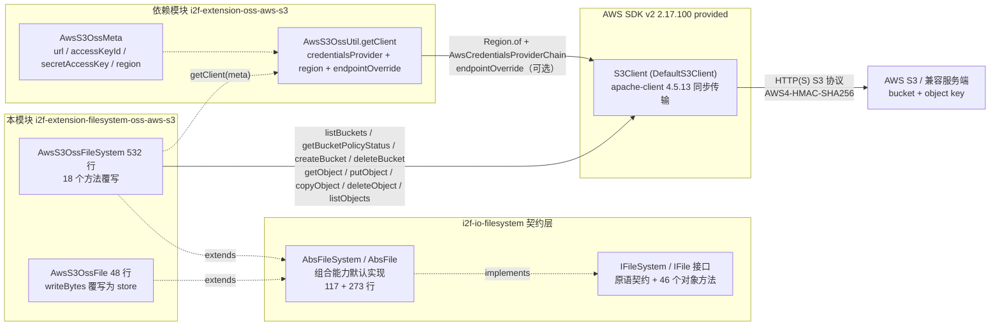
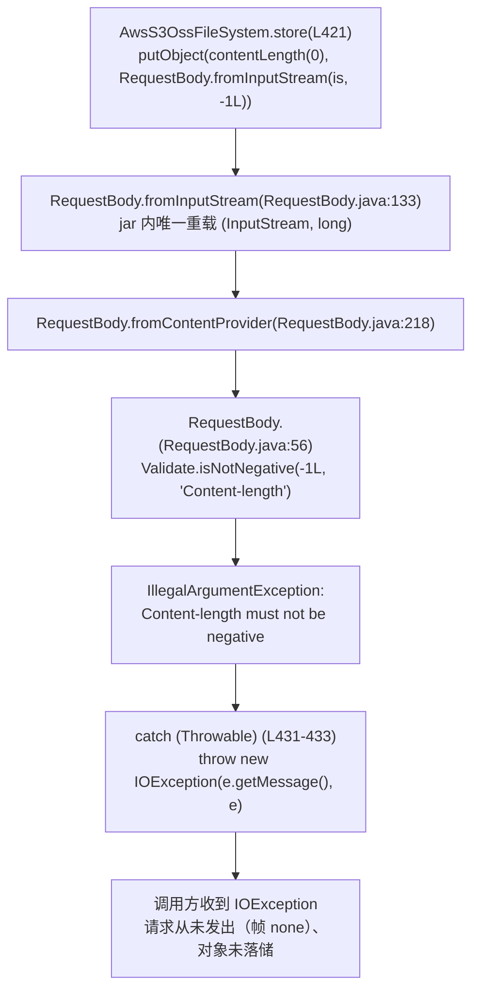
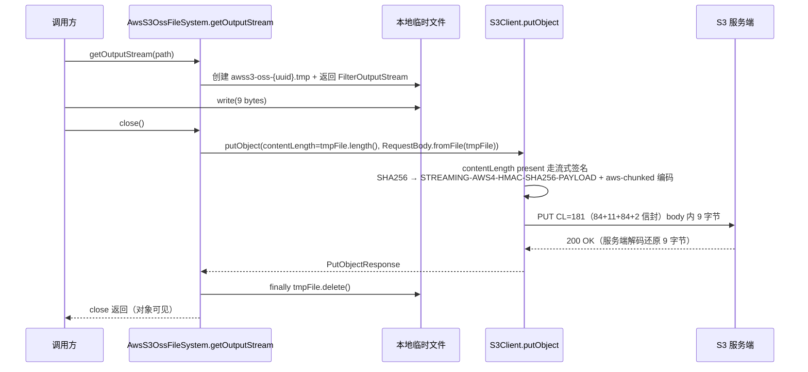
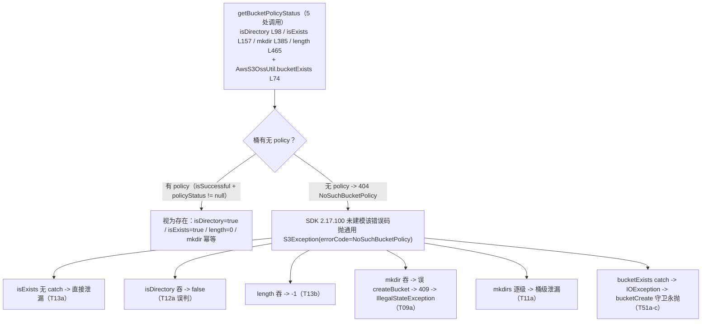

# i2f-extension-filesystem-oss-aws-s3

> **基于 AWS SDK v2（`software.amazon.awssdk:s3` 2.17.100，provided + optional，模块内 BOM 版本管理）的 `IFileSystem` 契约适配器**（1 pom.xml 79 行 + 2 源文件 580 行：`AwsS3OssFileSystem` 532 行 + `AwsS3OssFile` 48 行，另依赖配套的内部模块 `i2f-extension-oss-aws-s3` 2 文件 287 行：`AwsS3OssUtil` 265 行 + `AwsS3OssMeta` 22 行、零测试零资源）：把 AWS S3 对象存储装配为 `i2f-io-filesystem` 的 `IFileSystem`/`IFile` 契约实现——路径按「首段=桶、余段=对象键」两级拆分（`splitPathAsBucketAndObjectName` 首个 `/` 分派，契约覆写共 18 个），根 `/` 列举桶（`listBuckets`）、桶级存在性探测统一走 `getBucketPolicyStatus`（全仓独有）、对象级 `getObject`/`putObject`/`copyObject`/`deleteObject`/`listObjects` 直通 SDK，目录为 `.ignore` 空对象占位 + 键前缀模拟，`copyTo` 走服务端 `copyObject`、`moveTo` 恒为 `copyObject`+`deleteObject` 两步（无跨桶分支），`readText`/`readLines` 等 40+ 组合能力继承自 `AbsFileSystem`/`AbsFile`。**与 MinIO/Aliyun 两模块最大的差异在签名与写入通道的两极反转**：签名全程 `AWS4-HMAC-SHA256`、零降级（T48：78 请求全签名，与 Aliyun 模块「配置 V4 实际降级 V1」恰好相反）；⚠ 头号缺陷：**`store()` 100% 失败**——`RequestBody.fromInputStream(is, -1L)`（L429）在构造 `RequestBody` 的瞬间即被 SDK 参数校验 `Validate.isNotNegative(-1L, "Content-length")` 拒绝（`IllegalArgumentException: Content-length must not be negative`，被模块包装为 `IOException`），**请求从未发出**（T17：cause 链 `Validate.isNotNegative <- RequestBody.<init> <- fromContentProvider <- fromInputStream <- store(L429)`，帧证据 frame=`<none>`、对象未落储）；`AwsS3OssFile.writeBytes` 覆写为 store（L43-46），`writeBytes`/`writeText` 等便捷写方法**整体不可用**。唯一可用写通道为 `getOutputStream`（临时文件 + `RequestBody.fromFile` + 已知长度，T20 帧 `CL=181 SHA=STREAMING-AWS4-HMAC-SHA256-PAYLOAD aws-chunked` envelope、服务端还原 body=9 字节）。其余重点缺陷：桶存在性探测簇——`getBucketPolicyStatus` 对无 policy 桶返回 404 `NoSuchBucketPolicy`（SDK 2.17.100 未建模该异常、抛通用 `S3Exception`）连锁出 `isExists(桶)` 泄漏异常（T13a）、`isDirectory(桶)`=false 错判（T12a）、`mkdir` 已存在桶走 createBucket→409→ISE（T09a）、`mkdirs` 泄漏（T11a）、`bucketCreate` 首行守卫致完全不可用（T51c）；`length()` 对象级用 `resp.available()` 实测恒 0（T14b/c 对 8B 与 100KB 对象均 observed=0）；`listFiles` 分页缺陷——真实 S3 无 delimiter 时 `NextMarker` 不返回、`nextMarker` 恒 null 重复拉首页（T47 strict：4 calls/0 marker/3 of 6 files，靠桩 repeatCap 截停；manual alwaysNextMarker 对照：2 calls/1 marker/6 files）；`urlOf` 预签名**恒失败**——`Duration.of(999, ChronoUnit.YEARS)` 在 `Duration.of` 期即抛 `UnsupportedTemporalTypeException: Unit must not have an estimated duration`（T53：url=null，预签名 URL 从未生成）。127 项运行时实证（127 通过 / 0 失败 / 26 记录，自研 798 行 Mock S3 协议桩 + 虚拟主机风格寻址，两次运行结果一致）；`awssdk:s3` 以 provided + optional 声明、运行期需使用方自备 SDK 及其 apache-client/httpclient/netty 依赖链（实证运行期 49 jar）。真实消费方：`i2f-springboot-ops-starter` 的 `AwsS3OpsController`（387 行 8 端点：upload 走 `getOutputStream` 规避 store 缺陷、delete 自建递归、download/tail/head 走 `getInputStream`）。

## 模块路径

- `i2f-extension/i2f-extension-filesystem-oss-aws-s3/pom.xml`
- 相对于仓库根目录：`i2f-extension/i2f-extension-filesystem-oss-aws-s3`

## 模块依赖

### 内部依赖（compile）

| Maven 坐标 | scope | optional | 说明 |
|-----------|-------|----------|------|
| `i2f.turbo:i2f-io-filesystem:1.0-jdk8` | compile | false | 文件系统契约层（`IFileSystem`/`IFile` 接口 + `AbsFileSystem`/`AbsFile` 抽象基类 + `FileSystemUtil` 路径工具），本模块继承其抽象基类实现 AWS S3 后端 |
| `i2f.turbo:i2f-extension-oss-aws-s3:1.0-jdk8` | compile | false | AWS S3 SDK 便捷封装模块（2 源文件 287 行：`AwsS3OssMeta` 22 行承载 `url`/`accessKeyId`/`secretAccessKey`/`region` 连接配置 + `AwsS3OssUtil` 265 行封装 `S3Client`/`S3Presigner` 构建与桶/对象/预签名便捷方法）；**本模块仅使用其 `AwsS3OssMeta`（构造参数）与 `AwsS3OssUtil.getClient(meta)` 静态工厂**——`AwsS3OssUtil` 的其余方法（`bucketExists`/`bucketCreate`/`upload`/`download`/`list`/`prefixCreate`/`urlOf` 等）与本模块无调用关系；注意其 `list(bucket)`/`list(bucket, prefix)`（L171-210）是**正确分页**（`.marker(nextMarker)` + 回填），与本模块 `listFiles` 的分页缺陷形成同仓正反对照；其 `upload(is, contentType)`（L142-144 传 -1L）与 `store` 为**同根缺陷**（同样在 `RequestBody.fromInputStream(is, -1L)` 处立即失败） |

### 三方依赖

| Maven 坐标 | 版本 | scope | optional | 说明 |
|-----------|-------|-------|----------|------|
| `software.amazon.awssdk:s3` | 2.17.100 | provided | true | AWS SDK v2 S3 客户端（`S3Client`/`PutObjectRequest`/`RequestBody`/`GetObjectResponse` 等本模块直接引用的 API）；**版本经本模块 POM 自身 `dependencyManagement` import `software.amazon.awssdk:bom` 2.17.100 管理（L53-63）**——`2.17.100` 全仓硬编码 3 处（本模块 POM L58、`i2f-extension-oss-aws-s3` POM L47、`i2f-springboot-ops-starter` POM L322），未纳入根 POM 统一管理，见瑕疵第 19 条；provided 声明，编包不含 SDK，运行期由使用方提供 |
| `software.amazon.awssdk:kms` | 2.17.100 | provided | true | SSE-KMS 用户密钥支持依赖，SDK 传递树需要，本模块源码无直接引用（POM 注释「amazon s3」组） |
| `software.amazon.awssdk:s3control` | 2.17.100 | provided | true | S3 控制面（账户级操作）依赖，本模块源码无直接引用 |
| `org.projectlombok:lombok` | 1.18.44（根 POM `lombok.version` 管理） | provided | true | 继承根 POM `dependencyManagement` 的 provided + optional；**本模块源码未使用任何 lombok 注解（注解在依赖模块 `i2f-extension-oss-aws-s3` 的 `AwsS3OssMeta`/`AwsS3OssUtil` 上），属冗余声明**（见瑕疵第 19 条） |

### 隐式传递依赖

| 传递路径 | 说明 |
|---------|------|
| `i2f-io-filesystem` → `i2f-io-stream` | `load` 路径依赖 `StreamUtil.streamCopy`（流桥接工具） |
| `i2f-io-filesystem` → `i2f-text` 等 | 上游 POM 声明的传递依赖链（`i2f-text`/`i2f-iterator`/`i2f-reference`/`i2f-match`/`i2f-match-std`/`i2f-lru-map`/`i2f-clock-impl`/`i2f-clock-std`/`i2f-cache-std` 等） |
| `awssdk:s3` → SDK 运行树 | **AWS 核心 17 jar**（`sdk-core`/`auth`/`aws-core`/`http-client-spi`/`metrics-spi`/`protocol-core`/`aws-xml-protocol`/`aws-query-protocol`/`arns`/`profiles`/`json-utils`/`third-party-jackson-core`/`eventstream`/`regions`/`annotations`/`utils` + `s3` 自身）+ **默认同步传输** `apache-client:2.17.100` → `httpclient:4.5.13` + `httpcore:4.4.11` + `commons-logging:1.2` + `commons-codec:1.11` + **异步栈** `netty-nio-client:2.17.100` → `netty-*:4.1.68.Final`（10 jar）+ `netty-reactive-streams*:2.0.5`（2 jar） + `slf4j-api:1.7.30` + `reactive-streams:1.0.3` 等；provided 仅约束本模块自身编译，使用方需自备整棵运行时树（实证运行期 classpath 共 49 jar） |

## 模块设计

### 包结构

```
i2f.extension.filesystem.oss.aws.s3
├── AwsS3OssFileSystem.java  -- 契约适配器主体（2 个构造器 + 18 个 @Override + 4 个公共辅助方法，532 行）
└── AwsS3OssFile.java        -- 轻量路径持有 + writeBytes 覆写为 store（48 行）
```

配套依赖模块 `i2f-extension-oss-aws-s3`（`i2f.extension.oss.aws.s3` 包）：`AwsS3OssMeta`（连接配置四元组）+ `AwsS3OssUtil`（SDK 便捷封装，本模块仅用 `getClient`）。

模块源码目录仅 `pom.xml` + 2 个 Java 文件，**零测试零资源**（无 readme、无 resources）。

### 契约继承链

```
IFileSystem（契约接口：原语方法 + 组合方法）
  └── AbsFileSystem（抽象基类，117 行，提供 combinePath/absPath/mkdirs/store/load/copyTo/moveTo 等默认实现）
        └── AwsS3OssFileSystem（覆写 18 个方法：pathSeparator 转发/getFile/getAbsolutePath/三态元信息/listFiles/delete/三路流/mkdir/store/load/length/copyTo/moveTo + isAppendable）

IFile（契约接口：46 个对象方法）
  └── AbsFile（抽象基类，273 行，提供 writeText/readText/readLines/writeLines/copyTo/moveTo/readBytes 等默认实现）
        └── AwsS3OssFile（仅覆写 setFileSystem/getFileSystem/getPath/writeBytes 四个方法；writeBytes 覆写改变了写入路径，见设计要点 3）
```

### 核心架构



### 设计要点

1. **桶/对象两级路径模型（根/桶/对象三分支分派）**：`splitPathAsBucketAndObjectName`（L45-64）先剥离前导 `/`，再按首个 `/` 把路径拆为「桶名 + 对象键」两级（`/bkt1/a/b.txt` → `bkt1` + `a/b.txt`），并按拆分结果把每个契约方法分派到三个分支——a) 根 `/`（键为 `""`、值为 null）：`isDirectory`/`isExists` 恒 true、`isFile` 恒 false、`length` 恒 0，全部零 HTTP（实测 T07）、`listFiles` 走 `listBuckets`、`delete` 静默零 HTTP；b) 桶级（值为 null）：`getBucketPolicyStatus` 探测存在性（`isDirectory`/`isExists`/`length`/`mkdir` 守卫）、`createBucket`/`deleteBucket`；c) 对象级：直通 `getObject`/`putObject`/`copyObject`/`deleteObject`/`listObjects`。S3 是扁平键空间，层级目录完全由「键前缀 + `.ignore` 占位对象」模拟。7 组拆分用例实测（T03a-g）：`null`→`,null`、`//bkt1`→`,bkt1`（第二个 `/` 成为分隔）、`/bkt1/`→`bkt1,`（空键非 null，触发「对象级」分支导致列举恒空，见瑕疵第 11 条）
2. **目录模拟语义**：`mkdir`（L379-419）= 「桶不存在则 `createBucket`（含 `CreateBucketConfiguration`）+ 写入 `<path>/.ignore` 空对象占位」（`contentLength=0`、`contentType=application/octet-stream`，T08c）——但**桶存在性检查同样走 `getBucketPolicyStatus`**：对已存在但无 policy 的桶误判为不存在而走 `createBucket`，服务端 409 `BucketAlreadyOwnedByYou` → 包装 `IllegalStateException`（T09a/T10c）；有 policy 桶则幂等（T09c/T10a）。`mkdirs` 继承基类逐级调用（`/bkt2/d1/d2` → 逐级 `mkdir`，T11b/T11c 有 policy 桶实测成功）。目录检测 `isDirectory` 对对象级用 `listObjects(prefix + "/")` 非空即目录（对象键前缀形成的**隐式目录**同样可识别，T12b/T12c），但桶级依赖 `getBucketPolicyStatus` → 无 policy 桶返回 false（T12a 错判）
3. **写入通道单可用（头号缺陷与服务端验证并存）**：a) `store`（L421-434）以 `RequestBody.fromInputStream(is, -1L)` 提交上传——**在构造 `RequestBody` 的瞬间**即被 SDK 参数校验 `Validate.isNotNegative(-1L, "Content-length")` 拒绝（`IllegalArgumentException`），模块 catch Throwable 包装为 `IOException(e.getMessage(), e)`（L431-433）——**请求从未发出、对象从未落储**（T17：`store()` 抛 `IOException: Content-length must not be negative`、桩无 PUT 帧、cause 链四层定位到 L429）；`AwsS3OssFile.writeBytes` 覆写为 `ByteArrayInputStream` + store（L42-46），故 `writeBytes`/`writeText` 等便捷写方法**整体连带失败**（T19a/T19b）；b) `getOutputStream`（L344-372）走「本地临时文件中转」——写 `<系统临时目录>/awss3-oss-<uuid>.tmp`，`close()` 时用 `tmpFile.length()`（已知长度）执行 `putObject`（`RequestBody.fromFile`，L357-361）、`finally` 删除临时文件（T20c 帧证据 `CL=181 SHA=STREAMING-AWS4-HMAC-SHA256-PAYLOAD aws-chunked`——181 字节为 aws-chunked 编码信封总长、服务端 SDK 解码还原 9 字节 body）。另注意 `mkdir` 的占位上传用 `RequestBody.fromInputStream(new ByteArrayInputStream(new byte[0]), 0L)`（L414）——长度 **0 非负**故合法（T08c 成功写入 `.ignore`），与 `store` 的 -1 形成同文件内对照
4. **桶存在性探测统一走 `getBucketPolicyStatus`（缺陷簇根源）**：`getBucketPolicyStatus`（GET `?policyStatus&policy`）在本模块出现 4 处（`isDirectory` L98-100、`isExists` L157-159、`mkdir` L385-387、`length` L465-467）+ 依赖模块 `AwsS3OssUtil.bucketExists` L74-76 1 处，共 5 处。真实 S3 对**未配置 policy 的桶**返回 404 `NoSuchBucketPolicy`——SDK 2.17.100 **未建模**该异常（jar 内仅有 `NoSuchBucketException`/`NoSuchKeyException`/`NoSuchUploadException` 等），因此抛出通用 `S3Exception`（`errorCode=NoSuchBucketPolicy`，非建模异常）：`isDirectory`/`mkdir`/`length` 有 catch（吞或降级），`isExists` 桶级分支（L157-166）**无 catch** → 泄漏 `S3Exception`（T13a）；`length` 吞掉后返回 -1（T13b）；`mkdir` 吞掉后误走 createBucket → 409 → `IllegalStateException`（T09a）
5. **listFiles 分页缺陷（真实服务端将死循环）**：`listFiles`（L208-294）非根分支用 `do { ... } while (resp != null && resp.isTruncated())`（L237-291），循环体内 `nextMarker.set(resp.nextMarker())`（L290）回填后作为下一轮 `.marker(nextMarker.get())`（L241）——**写法本身正确**，但 S3 ListObjects v1 在**无 delimiter 的请求下不返回 `NextMarker`**（仅当携带 delimiter 时返回），故 `nextMarker` 恒 null、每轮重复请求第一页。实测（T47，桩分页旋钮 pageSize=3/repeatCap=3）：6 个对象只返回 3 个（T47c）、4 次 list 请求全部不带 marker（T47b：markerCalls=0）、循环重复列举同一页直到桩的 repeatCap 强制截断（T47a：listCalls=4）——真实 S3 桶对象数超过单页上限（默认 1000）时该循环**永不终止**（探针为此挂 watchdog 兜底）。对照：同仓 `AwsS3OssUtil.list(bucket, prefix)`（L191-210）同样写法、但桩在 `alwaysNextMarker` 模式（手动返回 NextMarker 模拟 delimiter 场景）下 2 calls/1 marker/6 files 完整分页（T47d/T47e）
6. **列举名无条件 URL 解码（三态实证）**：`decodeObjectName`（L199-206）对 SDK 返回的对象名统一 `URLDecoder.decode(name, "UTF-8")`，解码失败时 catch 返回原名。S3 协议允许服务端按 `encoding-type=url` 返回编码名，但**本模块从不请求 `encoding-type`**（T44 INFO：asked encoding-type=url: false），而桩/真实 S3 默认返回**原文键**——中文键不受影响（T43a-c 中文+空格名读写列举完好），但含 `+` 的键被误解码为空格（T44a：`a+b.txt` 列举为 `a b.txt`）、含 `%xx` 序列的键被误解码（T45a：`a%41b.txt` 列举为 `aAb.txt`），列举结果与真实键不一致、后续据此访问将 404；含**非法** `%` 序列的键（如 `bad%x.txt`）触发 `URLDecoder` 的 `IllegalArgumentException`，被 `decodeObjectName` 内部 catch 捕获后**以原名存活于列表**（T46a：catch fallback）
7. **异常策略四并存 + 原生泄漏面**：a) 吞——`isDirectory`/`isFile`/`length` 的空 `catch (Throwable)` 静默降级（false/-1）、`isExists` 的对象级两段 `catch (Exception)`（L175-177/L192-194）；b) 包 `IllegalStateException`——`delete`/`mkdir`/`copyTo`/`moveTo` 失败（`copyTo`/`moveTo` 方法签名却声明 `throws IOException`，实际从不抛 IOException，T37/T39 实测 `IllegalStateException`）；c) 包 `IOException`——`getInputStream`/`store`/`load`/`getOutputStream`（message 为 SDK 异常全文，但类型统一降为 IOException）；d) **原生透传**——`isExists` 桶级分支的 `getBucketPolicyStatus` 无 catch 泄漏 `S3Exception`（T13a）、`listFiles` 非根分支的 `listObjects`（L238-242）无 catch 泄漏原生 `NoSuchBucketException`（T26：`listFiles("/nobucket")` 抛 SDK 建模异常）、`isDirectory` 对象级 `listObjects`（L112-115）无 catch 泄漏 `NoSuchBucketException`（T12d）、`getAppendOutputStream` 直接抛 `UnsupportedOperationException`（T25b/c）
8. **组合能力与服务端操作**：`copyTo`（L494-508）覆写为服务端 `copyObject`（零数据传输，T35/T36：同桶与跨桶均实测成功、源对象保留）；`moveTo`（L510-530）**恒为 `copyObject` + `deleteObject` 两步**（无同/跨桶分支，与 Aliyun 模块「同桶 `renameObject` 服务端重命名」不同，T38：src 消失 dst 就位）；`load` 走 `getObject` + `StreamUtil.streamCopy`（T22a）；`getStrictFile` 继承基类但在本模块下**绝对路径恒拒绝**（见瑕疵第 15 条）；`pathSeparator`（L40-43）为原样转发基类（`/`）

## 模块目的

为需要以 AWS S3（及一切兼容 S3 协议的对象存储服务）存取文件的场景提供「零改造接入 i2f 文件系统契约」的适配实现：业务代码只依赖 `IFileSystem`/`IFile` 抽象（参见 `i2f-io-filesystem` 的「面向抽象编程」章节），即可把本地盘、FTP、SFTP、HDFS、MinIO、阿里云 OSS、AWS S3 等后端互换使用；同时复用 `AbsFileSystem`/`AbsFile` 提供的路径规约、`mkdirs`、跨文件系统流桥接等高阶能力，并可通过 provided + optional 声明避免对使用方的 SDK 选型与版本产生强制绑定。本模块是仓库内对象存储系契约适配器（MinIO / Aliyun OSS / AWS S3）中的第三个，S3 客户端构造与凭据链经配套模块 `i2f-extension-oss-aws-s3` 复用；S3 系特征——`getBucketPolicyStatus` 桶探测（全仓独有）、`AWS4-HMAC-SHA256` 全程签名、aws-chunked 签名载荷上传——均与 OSS 系（MinIO/Aliyun）形成对照。

## 模块功能

1. **连接构建与注入**：`new AwsS3OssFileSystem(meta)`（`url`/`accessKeyId`/`secretAccessKey`/`region` 四元组）**构造即构建** `S3Client`（零 HTTP，实测 T01a；meta 为 null 时构造期 NPE，T02b）；或 `new AwsS3OssFileSystem(client)` 注入共享 `S3Client` 实例（T02a）
2. **根目录级操作**：`listFiles("/")` 列举全部桶（`listBuckets`）；`isDirectory("/")`/`isExists("/")` 恒 true、`isFile("/")` 恒 false、`length("/")` 恒 0，全部零 HTTP（实测 T07）
3. **桶级操作**：`mkdir(bucket)` 建桶 + `.ignore` 占位（对无 policy 桶因探测缺陷走 createBucket→409 失败，见瑕疵第 3 条）；`isExists`/`isDirectory`/`length` 走 `getBucketPolicyStatus`；`delete(bucket)` 删除空桶、非空桶抛 `IllegalStateException`（`BucketNotEmpty`，实测 T33b）
4. **对象级操作**：`isFile`（`getObject` 全量探测，T15）、`getInputStream`（`getObject` 流式读）、`store`（`putObject`——**恒失败**，见瑕疵第 1 条）、`getOutputStream`（临时文件中转上传，**唯一可用写通道**，T20）、`length`（`getObject` + `available()`——恒 0，见瑕疵第 4 条）、`delete`（`deleteObject`），以及经继承获得的 `readText`/`readBytes`/`readLines` 等便捷能力（实测 T14/T22）
5. **目录模拟**：`mkdir`/`mkdirs` 以 `.ignore` 空对象占位形成目录（实测 T08/T10/T11）；`isDirectory` 按前缀列举判定（含对象键前缀形成的隐式目录）；`listFiles` 列举一级子项（文件 + 目录混合，T16）
6. **服务端拷贝与两步移动**：`copyTo` 走 `copyObject`（对象原地复制、零数据传输，实测 T35/T36）；`moveTo` = `copyObject` + `deleteObject` 两步（实测 T38）
7. **三路流读写（写通道单可用）**：读流 `getInputStream`、写流 `getOutputStream` 可用；`store` 不可用（瑕疵 1）；仅追加流 `getAppendOutputStream` 抛 `UnsupportedOperationException`、`isAppendable` 恒 false（实测 T25）
8. **组合能力（继承）**：`load`/`mkdirs`/`readText`/`writeText`/`readLines`/`writeLines`/`readBytes`/`getStrictFile` 等 40+ 方法（实测 T22/T41；注意 `writeText` 经 writeBytes→store 连带不可用）
9. **中文/特殊字符对象名**：读写与列举对中文路径整体可用（实测 T43 中文+空格名往返）；但 `+`/`%xx` 形态的键在列举侧被解码污染（实测 T44/T45，见瑕疵第 6 条）；非法 `%` 序列条目以原名存活于列表（T46）

## 模块主要使用方法

### 1. Maven 引入

```xml
<dependency>
    <groupId>i2f.turbo</groupId>
    <artifactId>i2f-extension-filesystem-oss-aws-s3</artifactId>
    <version>1.0-jdk8</version>
</dependency>
<!-- 本模块以 provided + optional 声明 awssdk s3/kms/s3control，运行期需使用方自行提供（含 apache-client/httpclient/netty 传递树） -->
<dependency>
    <groupId>software.amazon.awssdk</groupId>
    <artifactId>s3</artifactId>
    <version>2.17.100</version>
</dependency>
```

### 2. 基础 CRUD（实证流程）

```java
AwsS3OssMeta meta = new AwsS3OssMeta();
meta.setUrl("http://127.0.0.1:9000");        // endpoint（可空则走默认 AWS 端点）
meta.setRegion("us-east-1");                 // 签名区域
meta.setAccessKeyId("your-ak");
meta.setSecretAccessKey("your-sk");

AwsS3OssFileSystem fs = new AwsS3OssFileSystem(meta); // 构造即构建 S3Client（零 HTTP）

IFile dir = fs.getFile("/my-bucket/docs");   // 桶级 + 目录路径
if (!dir.isExists()) {                       // ⚠ 无 policy 桶此探测会抛 S3Exception（瑕疵 3）
    dir.mkdirs();                            // ⚠ 无 policy 桶将 409 失败（瑕疵 3）
}

// ✓ 写入必须走 getOutputStream（唯一可用通道）
try (OutputStream os = fs.getOutputStream("/my-bucket/docs/a.txt")) {
    os.write("hello s3".getBytes("UTF-8"));
}
// ⚠ fs.getFile("/my-bucket/docs/a.txt").writeText(...) 不可用：writeBytes → store 恒抛 IOException（瑕疵 1）

List<IFile> list = dir.listFiles();          // 列举一级子项（⚠ 分页缺陷：超过单页时结果不完整，见瑕疵 5）
list.forEach(System.out::println);
```

### 3. 写入通道（单通道可用，务必使用 getOutputStream）

```java
// ✗ store：未知长度流恒失败——RequestBody.fromInputStream(is, -1L) 在构造期即被
//   Validate.isNotNegative 拒绝（实测 T17：IOException: Content-length must not be negative，请求未发出）
// fs.store("/bkt/a.txt", new ByteArrayInputStream("hello".getBytes("UTF-8")));  // 抛 IOException

// ✗ writeBytes / writeText：内部经 AwsS3OssFile.writeBytes → store，同样恒失败（实测 T19）
// fs.getFile("/bkt/b.txt").writeText("line1", "UTF-8");  // 抛 IOException

// ✓ getOutputStream：临时文件中转，close 时以已知 length 上传（实测 T20 帧 CL=181 signed aws-chunked 信封）
try (OutputStream os = fs.getOutputStream("/bkt/c.txt")) {
    os.write("streamed".getBytes("UTF-8"));
}   // close 触发 putObject；close 前对象对服务端不可见（实测 T20a）

// ⚠ 注意：getOutputStream 返回的流 close 只能调用一次——
//   二次 close 因临时文件已被删除而抛 IOException（实测 T21）
```

### 4. 作为契约实现注入使用（面向抽象编程）

```java
void export(IFileSystem fs, String dir, byte[] data) throws IOException {
    IFile target = fs.getFile(dir);
    if (!target.isExists()) {
        target.mkdirs();
    }
    // 读侧通用；写侧必须用 getOutputStream（store/writeText 在本后端恒失败）
    try (OutputStream os = fs.getOutputStream(dir + "/export.bin")) {
        os.write(data);
    }
}

export(new AwsS3OssFileSystem(meta), "/report/2026", bytes);
```

### 注意事项

1. **store / writeText / writeBytes 恒失败（先于一切）**：唯一可用写通道是 `getOutputStream`（临时文件中转）；依赖模块 `AwsS3OssUtil.upload(is, ...)` 传 -1L 为同根缺陷同样恒失败
2. **桶级存在性探测有缺陷**：`isExists(桶)` 对无 policy 桶抛 `S3Exception`（而非返回 false）、`isDirectory(桶)` 返回 false、`length(桶)` 返回 -1——探测桶存在请直接用 SDK `headBucket`，或自行 catch 降级
3. **大桶列举勿依赖 `listFiles`**：`NextMarker` 在无 delimiter 请求下不返回，对象数超过单页上限时真实 S3 上将重复请求第一页永不返回（T47）；需要完整列举请直接使用 SDK
4. **特殊字符对象名规避**：列举对 `+`（误解码为空格）与 `%xx` 序列（如 `%41`→`A`）会返回被解码的名字（T44/T45）——含此类字符的键请直接使用 SDK 访问；非法 `%` 条目以原名存活（T46）
5. **provided + optional 依赖需自备**：使用方必须自行引入 `software.amazon.awssdk:s3:2.17.100`（建议 BOM import）及其传递依赖（httpclient 4.5.13 / netty 4.1.68 等），否则运行期 `NoClassDefFoundError`
6. **删除目录需自建递归**：`delete(目录路径)` 静默 no-op（T31）；`delete(非空桶)` 抛 `IllegalStateException`；且 `mkdir` 写入的 `.ignore` 占位使桶**不能直接删除**（T33b：先 `delete("<桶>/.ignore")` 再删桶，T33d）
7. **列表结果含 `.ignore` 占位**：`mkdir` 过的目录下会出现 `.ignore` 条目（T16f/T16g），展示层需自行过滤
8. **`getStrictFile` 的绝对路径陷阱**：以 `/` 开头的 rootPath 恒被拒绝（T41a，根因见瑕疵第 15 条）——需要防穿越校验时请使用**相对形式** rootPath（如 `"bkt1/dir1"`，T41b 可用、穿越仍被拦 T41c）
9. **`getExtension` 继承反转缺陷**：`hello.txt` → `hello`（返回去扩展名的部分，实测 T42，同 FTP/HDFS/MinIO/Aliyun 模块）

## 模块特性总结

1. **薄封装适配实现**：580 行完成一个对象存储文件系统——核心方法均为对 AWS SDK v2 API 的直通转发（`listBuckets`/`getBucketPolicyStatus`/`createBucket`/`deleteBucket`/`getObject`/`putObject`/`copyObject`/`deleteObject`/`listObjects`），其余能力继承契约基类
2. **桶/键两级路径模型**：文件系统语义映射为「根=桶集合、一级路径=桶、余下=对象键」，`splitPathAsBucketAndObjectName` 一个辅助方法支撑全部分派
3. **目录模拟**：`.ignore` 空对象占位 + 公共前缀判定，`mkdir`/`mkdirs`/`isDirectory`/`listFiles` 协同形成目录体验
4. **写通道单可用（头号缺陷）**：`store` 未知长度流在 `RequestBody.fromInputStream(-1L)` 处被 SDK 参数校验硬拒（T17）、`writeBytes` 连带报废；`getOutputStream`（临时文件 + 已知长度 + signed aws-chunked 信封）是唯一可用通道（T20）
5. **服务端拷贝 + 两步移动**：`copyTo`=`copyObject`、`moveTo`=`copyObject`+`deleteObject`——无服务端重命名（对照 Aliyun 模块 `renameObject` 的全仓独有）
6. **构造即构建 / 客户端可注入**：`meta` 版构造器立即创建 `S3Client`（零 HTTP，T01a）；`client` 版支持外部共享实例（T02a）
7. **签名全程 AWS4-HMAC-SHA256**：实证 78 请求零降级（T48，`authSchemes=[AWS4-HMAC-SHA256]`）——与 Aliyun 模块签名配置失效降级 V1 形成全仓对照
8. **桶探测走 policyStatus**：5 处 `getBucketPolicyStatus` 替代 `headBucket`/`doesBucketExist`（全仓独有），对无 policy 桶构成系统性缺陷簇（T09a/T11a/T12a/T13a/T13b/T51a-c）
9. **分页缺陷**：`listFiles` 依赖 `NextMarker` 回填，真实 S3 无 delimiter 时 `NextMarker` 恒不返回（T47）——真实大数据量下不终止
10. **列举名无条件 URL 解码**：中文名可用（T43）但 `+`/`%xx` 被污染（T44/T45）、非法 `%` 条目以原名存活（T46，catch fallback）
11. **异常策略四并存**：吞（四方法 + isExists 两段）/ `IllegalStateException`（delete/mkdir/copyTo/moveTo，且 copyTo/moveTo 声明 IOException 实抛 ISE）/ `IOException`（四流方法）/ 原生透传（S3Exception、NoSuchBucketException 泄漏 + UOE）
12. **provided + optional 依赖策略（BOM 版本管理）**：SDK 仅编译期可见，编包与 POM 传递均不含 AWS 运行时；版本经模块内 BOM import 2.17.100（全仓 3 处硬编码）

## 模块瑕疵或错误

1. **`store()` 参数校验硬失败（头号缺陷，写入主通道报废）**：`store`（L421-434）以 `RequestBody.fromInputStream(is, -1L)`（L429）提交上传——`RequestBody` 2.17.100 在**构造期**即执行 `Validate.isNotNegative(contentLength, "Content-length")`，抛 `IllegalArgumentException: Content-length must not be negative`；模块 catch Throwable（L431-433）将其包装为 `IOException(e.getMessage(), e)`。经 cause 链逐层实证（T17 stack）：`IllegalArgumentException` <= `Validate.isNotNegative(Validate.java:662)` <= `RequestBody.<init>(RequestBody.java:56)` <= `fromContentProvider(RequestBody.java:218)` <= `fromInputStream(RequestBody.java:133)` <= `store(AwsS3OssFileSystem.java:429)`。**请求从未发出、对象从未落储**（T17a/T17b：帧 `<none>`、stored=-1）。`RequestBody` 2.17.100 的 `fromInputStream` 仅此一个重载（`(InputStream, long)`，javap 确认无单参版本）且长度必须非负——**SDK 层面不支持「未知长度流」**，`store` 在此 SDK 版本下无原位修复可能（除非自行缓冲计长）。影响面：`AwsS3OssFile.writeBytes`（覆写为 store，L42-46）→ `writeText`/`writeLines` 等全部便捷写方法连带 100% 失败（T19a/T19b）；对照 `mkdir` 的 `.ignore` 占位上传用长度 `0L`（合法）成功写入（T08c）——同文件内一正一反
2. **`AwsS3OssUtil.upload(InputStream)` 同根缺陷**：`upload(bucket, obj, is, contentType)`（L142-144）转调 `upload(bucket, obj, is, -1L, contentType)` → `RequestBody.fromInputStream(is, fileSize == null ? -1 : fileSize)`（L135）——`fileSize` 为 null（即经 3 参重载调用）时同样传 -1L，在构造期抛同一 `IllegalArgumentException` 并被包装为 `IOException`。即依赖模块的「流式上传」入口同样恒失败；唯 `upload(File)`（L146-157，`RequestBody.fromFile`）可用
3. **桶存在性探测缺陷簇（`getBucketPolicyStatus` 5 处全线受影响）**：模块以 `getBucketPolicyStatus`（GET `?policyStatus&policy`）作为桶存在性探测，但真实 S3 对**未配置 policy 的桶**返回 404 `NoSuchBucketPolicy`——该错误码在 SDK 2.17.100 中**未建模异常类**（jar 内无 `NoSuchBucketPolicyException`，仅 `NoSuchBucketException`/`NoSuchKeyException`/`NoSuchUploadException` 等），抛出通用 `S3Exception`（`errorCode=NoSuchBucketPolicy`，T11a/T13a 实证）。连锁：a) `isExists(桶)` 桶级分支（L157-166）**无 catch** 直接泄漏 `S3Exception`（T13a——既不是 true 也不是 false）；b) `isDirectory(桶)` 吞掉后返回 false（T12a 错判）；c) `length(桶)` 吞掉返回 -1（T13b；有 policy 桶才返回 0，T13d）；d) `mkdir(已存在桶)` 吞掉误走 `createBucket` → 409 `BucketAlreadyOwnedByYou` → `IllegalStateException`（T09a/T10c），有 policy 桶才幂等（T09c）；e) `mkdirs` 逐级调用在桶级即失败（T11a 泄漏 S3Exception）；f) `AwsS3OssUtil.bucketCreate` 首行 `if (bucketExists(bucketName))` 守卫（L90-92）——`bucketExists` 对无 policy 桶抛 IOException（T51a）、对缺失桶也抛 IOException（T51b，`NoSuchBucket`），故 `bucketCreate` 对**任何**桶都在到达 createBucket 前抛异常——**完全不可用**（T51c：createBucket 请求从未发出；对照 T51d 有 policy 桶 `bucketExists`=true 正常）
4. **`length()` 对象级用 `available()` 恒 0**：`length`（L456-492）对象级走 `getObject` + `resp.available()`（L485）——`ResponseInputStream.available()` 返回本地缓冲已到达字节数而非对象大小，实测 8 字节与 102400 字节对象均返回 0（T14b/T14c：observed=0）；缺失对象返回 -1（T14d）。契约语义（返回对象字节长度）完全失真，依赖 `length()` 的消费方（如 ops 文件列表展示大小）将全部得到 0
5. **`listFiles` 分页缺陷（真实服务端死循环）**：`listFiles`（L208-294）非根分支的 `do/while (resp.isTruncated())`（L237-291）以 `resp.nextMarker()`（L290）回填 `.marker(...)`（L241），但 S3 ListObjects v1 **无 delimiter 时不返回 `NextMarker`**（协议行为）——`nextMarker` 恒 null、每轮重复请求第一页。实测（T47 strict，桩无 NextMarker 模式）：list calls=4（靠 repeatCap 截停）/ marker calls=0 / 只返回首页 3 of 6；对照（alwaysNextMarker=true 模拟 delimiter 场景）：2 calls / 1 marker / 6 files 完整分页（T47d/T47e）。真实 S3 上页面截断时循环**永不终止**（探针专设 watchdog 兜底）。同仓 `AwsS3OssUtil.list(bucket, prefix)`（L191-210）同样写法、在带 `NextMarker` 的响应下完整分页——正确性外因在于服务端是否返回 NextMarker
6. **`decodeObjectName` 无条件 URL 解码污染原文键**：`decodeObjectName`（L199-206）对列表返回的对象名统一 `URLDecoder.decode(name, "UTF-8")`，但模块从不设置 `encoding-type=url` 参数（T44 INFO：asked encoding-type=url: false）——桩/真实 S3 默认渲染**原文键**：`+` 被误解码为空格（T44a：`a+b.txt`→`a b.txt`）、`%41` 被误解码为 `A`（T45a：`a%41b.txt`→`aAb.txt`），列举名与真实键不一致、后续据此访问将 404；中文名不受影响（无 `%`/`+`，T43a-c）。含**非法** `%` 序列（如 `bad%x.txt`）时 `URLDecoder` 抛 `IllegalArgumentException`，被 catch 捕获后**返回原名存活于列表**（T46a：catch fallback——与 Aliyun 模块「条目静默消失」的后果不同，本模块该条目以原名保留）
7. **`isFile` 用 `getObject` 全量探测（无 HEAD）**：`isFile`（L128-144）以 `getObject`（GET）判断对象存在——实测全周期零 HEAD 请求（T15a：HEAD=0、GET=29；T15 帧 `GET /bkt1/f8.bin ... SHA=UNSIGNED-PAYLOAD raw=0 body=0`）。探测语义与开销均劣于 `headObject`（大对象/高延迟场景尤甚），且与依赖模块 `getObjectInfo` 同为 GET 系
8. **`delete(目录)` 静默 no-op**：`delete`（L296-322）对「是文件」走 `deleteObject`；否则仅当「桶级且键为空」走 `deleteBucket`——对象级目录路径（如 `/bkt1/dir1`）落入空分支（L320 附近 else 内层无任何操作），不执行任何请求也无反馈（T31a 无异常、T31b 目录内容保留）。消费方必须自建递归删除（ops 控制器即如此，见消费方章节）
9. **`.ignore` 占位导致桶无法直接删除**：`mkdir` 每次都写入 `.ignore` 空对象（L406-415）——仅含 `.ignore` 的「空目录」桶执行 `deleteBucket` 抛 `IllegalStateException: delete failure:... BucketNotEmpty`（T33b），须先 `delete("<path>/.ignore")`（T33d）。目录删除（瑕疵 8 no-op）与此叠加，形成「建目录容易、清目录难」的组合陷阱
10. **`urlOf` 预签名恒失败（预签名 URL 从未生成）**：`AwsS3OssUtil.urlOf`（L244-258）以 `Duration.of(999, ChronoUnit.YEARS)`（L248）构造签名有效期——**`Duration.of` 对 YEARS 这类 estimated unit 立即抛** `UnsupportedTemporalTypeException: Unit must not have an estimated duration`，被 catch 包装为 `IOException`（T53a）；返回 `url=null`（T53b），预签名 URL **从未成功生成过一次**（连「超长有效期 URL」都不存在；T53 host=unparseable 佐证）。对照：`S3Presigner` 本身可用（T53c：预签名过程零 HTTP、未发出请求）；修复方式为改用 `Duration.ofDays(...)` 等精确单位
11. **`listFiles("/bkt1/")` 尾斜杠恒空（空键怪癖）**：`splitPathAsBucketAndObjectName` 把 `/bkt1/` 拆为「桶 `bkt1` + 空键 `""`」（T03g），随后 `ensureWithPathSeparator("")` → `"/"` 作为前缀列举——无对象以 `/` 开头故恒空（T27 实测 size=0）。桶路径**带尾斜杠时列举静默为空**，与不带尾斜杠（正常列出子项）行为不一致
12. **原生异常泄漏面（三处无 catch 逃逸）**：a) `isExists` 桶级分支（L157-166）泄漏 `S3Exception`（T13a）；b) `listFiles` 非根分支的 `listObjects`（L238-242）处于任何 catch 之外——`listFiles("/nobucket")` 抛原生 `NoSuchBucketException`（T26），与「列举失败返回空列表」的宽容风格自相矛盾（根分支 `listBuckets` 有 catch L224-226）；c) `isDirectory` 对象级 `listObjects`（L112-115）无 catch——缺失桶场景抛 `NoSuchBucketException`（T12d）
13. **异常策略多并存 + 声明与实抛不符**：吞（`isDirectory`/`isFile`/`length` 空 catch Throwable、`isExists` 两段 catch Exception）/ 包 `IllegalStateException`（`delete`/`mkdir`/`copyTo`/`moveTo`）/ 包 `IOException`（`getInputStream`/`store`/`load`/`getOutputStream`）/ 原生透传（S3Exception、NoSuchBucketException、UOE）。其中 `copyTo`/`moveTo`（L494-530）方法签名声明 `throws IOException` 但实际只抛 `IllegalStateException`（T37/T39）——调用方按签名捕获将漏接；桶级路径的 `store`/`getInputStream` 报错分别为 `Content-length must not be negative`（T18）与 `Unable to marshal request to JSON: Parameter 'Key' must not be null`（T24）——同为桶级路径、两种低信息量错误
14. **`moveTo` 同桶也不做服务端重命名**：`moveTo`（L510-530）恒为 `copyObject` + `deleteObject` 两个请求（无同桶/跨桶分支）——同桶移动多一次往返；与 Aliyun 模块「同桶 `renameObject`（`POST ?x-oss-rename`）单请求服务端重命名」形成能力对照（T38 实测 src 消失 dst 就位，语义正确、仅路径非最优）
15. **`getStrictFile` 绝对路径恒拒绝（与上游叠加缺陷）**：`getAbsolutePath`（L81-84）恒等返回，`FileSystemUtil.absPath` 的 Stack 算法在拼接后**丢失前导斜杠**（`/bkt1/dir1/x.txt` → `bkt1/dir1/x.txt`），而 `getStrictFile` 的防穿越校验要求结果 `startsWith(rootPath + "/")`——任何以 `/` 开头的 rootPath 恒不满足 → 恒抛 `IllegalStateException: target path cannot access.`（T41a）。相对形式 rootPath（`"bkt1/dir1"`）可用且穿越仍被拦截（T41b/T41c）。根因一半在本模块（`getAbsolutePath` 未覆写补偿）、一半在上游 `i2f-io-filesystem`（`absPath` 实现），同族对象存储模块同理受影响
16. **`getExtension` 继承反转缺陷**：`AbsFile` 的 `substring(0, idx)` 缺陷被 `AwsS3OssFile` 全盘继承——`hello.txt` 返回 `hello`（去扩展名的部分而非扩展名 `txt`），无点全名返回原样（T42，同 FTP/HDFS/MinIO/Aliyun 模块）
17. **`getOutputStream` 临时文件缺陷组**：a) close 内上传后 `finally` 删除临时文件（L364-369），流对象未做 closed 状态标记——二次 close 时 `new FileInputStream(tmpFile)` 因文件已删抛 `FileNotFoundException`（包装为 IOException，T21b）；b) L353-355 创建/关闭的 `FileInputStream fis` **全程未被使用**（上传走 `RequestBody.fromFile`）——冗余代码；c) 临时文件 `awss3-oss-<uuid>.tmp` 占用等同对象体积的磁盘空间，上传失败时数据丢失（临时文件已由 finally 删除）
18. **null 边界无防护**：`new AwsS3OssFileSystem((AwsS3OssMeta) null)` 构造期 NPE（`Region.of(meta.getRegion())` L53，T02b——无 fail-fast 提示）；`getFile(null)` 返回的 `AwsS3OssFile` 在 `getName()` 调用时 NPE（T49——`splitPathAsBucketAndObjectName` 虽容忍 null，但 `getPath()`/`getName()` 链路无守卫）；`new AwsS3OssFileSystem((S3Client) null)` 构造成功（无 fail-fast），后续首次 `getClient()` 补建时若 meta 亦为 null 则 NPE（静态观察）
19. **SDK 版本 3 处硬编码 + lombok 冗余声明（轻微）**：`2.17.100` 经各 POM 内 BOM import 重复声明 3 处（本模块 POM L58、`i2f-extension-oss-aws-s3` POM L47、`i2f-springboot-ops-starter` POM L322）——未纳入根 POM `dependencyManagement` 统一管理，升级需同步改 3 处；本模块 POM 声明 `lombok`（L16-19）但源码零注解使用（注解均在依赖模块 `AwsS3OssMeta`/`AwsS3OssUtil`），可移除

## 运行时实证验证

### 验证环境与方法

| 项 | 说明 |
|----|------|
| 编译 | JDK8（1.8.0_201）`javac -encoding UTF-8` 直编 6 个源文件（`AwsS3OssMeta`/`AwsS3OssUtil`/`AwsS3OssFile`/`AwsS3OssFileSystem` + 798 行桩 + 931 行探针），不经 Maven/IDEA |
| 依赖 | 本地 Maven 仓库经 `mvn dependency:build-classpath` 生成 cp.txt（49 jar：i2f 链 11 jar + lombok + awssdk 2.17.100 核心 17 jar + apache-client/httpclient 4.5.13/httpcore 4.4.11/commons-logging 1.2/commons-codec 1.11 + netty 4.1.68.Final 全家 13 jar + slf4j-api 1.7.30/reactive-streams 1.0.3/eventstream 1.0.1 等） |
| 运行后端 | 自研 `MockS3Server`（798 行，JDK8 内置 `HttpServer` + 内存 VFS）：实现 SDK 所需 S3 端点子集——`listBuckets`/`getBucketPolicyStatus`（无 policy 桶 404 `NoSuchBucketPolicy` / 有 policy 桶 200，可切换）/`createBucket`（已拥有 409 `BucketAlreadyOwnedByYou`）/`deleteBucket`（非空 409）/`putObject`（记录 CL/TE/签名字段/aws-chunked 帧）/`getObject`/`deleteObject`/`listObjects`（v1，原文键渲染 + pageSize/repeatCap/alwaysNextMarker 三旋钮）/`copyObject`（`x-amz-copy-source`）；虚拟主机风格寻址（Host=`bucket.127.0.0.1.nip.io`，通配 DNS 解析）；aws-chunked 信封解码还原；捕获每个请求的 wire `Authorization` 签名方案 |
| 探针 | `VerifyAwsS3OssFs.java`（931 行）：T01-T54 共 127 个断言 + 26 项记录；纯 ASCII 转义输出；watchdog 兜底分页死循环；`stackOf` 打印 3 层 cause 链；尾部显式 `halt(fail>0?1:0)` |
| 实证产所 | `runtime/tmp/filesystem-oss-aws-s3-verify/`（`verify-pom.xml` + `MockS3Server.java` + `VerifyAwsS3OssFs.java` + `build.ps1` + `cp.txt` + `marshaller.txt`/`cl-search.txt`（javap 勘察落盘）+ `run1.log`/`run2.log`/`run3.log`） |
| 运行轮次 | 三次：run1（PASS=116 FAIL=11）暴露 5 组断言偏差与 1 处编译问题（`NoSuchBucketPolicyException` 不存在）→ 修正后 run2/run3 结果一致——**PASS=127 FAIL=0 INFO=26**（两轮 153 行输出仅 mock 端口号、临时文件 UUID、T17 stack 行三处环境噪声差异） |

### 实证结果（127 项通过 / 0 失败 / 26 项记录，run3）

| # | 验证项 | 结果 |
|---|--------|------|
| T01a | meta 构造器构建 `DefaultS3Client` 且零 HTTP（requests=0） | PASS |
| T02a | client 构造器保留给定实例 | PASS |
| T02b | `ctor(null meta)` -> NPE（构造期无 fail-fast 信息） | INFO |
| T03a-g | `splitPathAsBucketAndObjectName` 7 组（含 `null`→`,null`、`//bkt1`→`,bkt1`、`/bkt1/`→`bkt1,`） | PASS ×7 |
| T04a-d | `ensureWithPathSeparator` 4 组（幂等、null 透传、空串→`/`） | PASS ×4 |
| T05a-b | `getAbsolutePath` 恒等 / null 透传 | PASS ×2 |
| T06a-d | `getFile` 三形态（含 `getFile(bucket, name)` 拼接）+ T03-T06 零 HTTP | PASS ×4 |
| T07a-e | 根三态（isDirectory/isExists 恒 true、isFile false、length=0）且零 HTTP | PASS ×5 |
| T08a-e | `mkdir(桶)` 建桶 + `.ignore` 占位（len=0）+ policyStatus 探测 1 次 + createBucket 请求 1 次；帧 `PUT /bkt1 | CL=0 SHA=UNSIGNED-PAYLOAD raw=0` | PASS ×5 |
| T09a-d | no-policy：`mkdir(已存在桶)` → ISE（409 `BucketAlreadyOwnedByYou`）；with-policy：幂等成功 | PASS ×4 |
| T10a-c | with-policy：深层 mkdir 成功（`dirA/.ignore` 写入）；no-policy：深层 mkdir → ISE | PASS ×3 |
| T11a-c | no-policy：`mkdirs` 泄漏 `S3Exception(NoSuchBucketPolicy)`；with-policy：成功（`m1/m2/.ignore` 写入） | PASS ×3 |
| T12a-e | no-policy：`isDirectory(桶)`=false（误判）；对象级 prefix 判定 true/false；缺失桶泄漏 `NoSuchBucketException`；with-policy=true | PASS ×5 |
| T13a-d | no-policy：**`isExists(桶)` 泄漏 `S3Exception(NoSuchBucketPolicy)`**；`length(桶)`=-1；with-policy：true / 0 | PASS ×4 |
| T14a-g | 对象三态 + **`length(8B)`=0 / `length(100KB)`=0**（available 观测）+ 缺失 -1 + isExists + !isDirectory + !isFile | PASS ×7 |
| T15a | `isFile` 用 GET 全量探测（HEAD=0、GET=29）；帧 `GET /bkt1/f8.bin | SHA=UNSIGNED-PAYLOAD raw=0` | PASS |
| T16a-g | `listFiles` 桶（`[dir1, dir2, root.txt]`）/ 目录 / 根列举桶 / `.ignore` 泄漏（`[.ignore, m2]`）；帧 `GET /bkt2?prefix=dir1%2F` | PASS ×7 |
| T17a-b | **store 抛 IOException 'Content-length must not be negative' + 未持久化**（帧 `<none>`；cause 链至 L429） | PASS ×2 |
| T18 | `store(桶级)` → IOException（同 CL 负值文案、请求未发出） | PASS |
| T19a-b | `writeBytes` 抛 IOException（store 通道不可用）+ 未持久化（stored=-1） | PASS ×2 |
| T20a-c | `getOutputStream`：close 无异常 / 9 字节落储 / 帧 **`CL=181 SHA=STREAMING-AWS4-HMAC-SHA256-PAYLOAD aws-chunked raw=181 body=9`** | PASS ×3 |
| T21a-b | close 一次 ok / 二次 close → IOException（临时文件已删） | PASS ×2 |
| T22a-b | `load` 拷贝内容 / `readBytes` | PASS ×2 |
| T23 | `getInputStream(缺失 key)` → IOException（NoSuchKey 文案） | PASS |
| T24 | `getInputStream(桶级)` → IOException（`Unable to marshal request to JSON: Parameter 'Key' must not be null`） | PASS |
| T25a-c | `isAppendable` 恒 false + `getAppendOutputStream`/`appendText` 抛原生 UOE | PASS ×3 |
| T26 | **`listFiles(缺失桶)` 泄漏原生 `NoSuchBucketException`** | PASS |
| T27 | `listFiles("/bkt2/")` 尾斜杠 → 空（size=0，空键怪癖） | PASS |
| T30a-b | `delete(对象)` 无异常 + 服务端移除 | PASS ×2 |
| T31a-b | **`delete(目录)` 静默 no-op**（无异常、目录内容保留） | PASS ×2 |
| T32 | `delete(缺失桶)` → ISE（`delete failure:...NoSuchBucket`） | PASS |
| T33a-d | `mkdir(/bkt4)` ok + **`delete(含 .ignore 桶)` → ISE(BucketNotEmpty)** + 桶保留 + 删 `.ignore` 后删桶成功 | PASS ×4 |
| T34a-b | `delete(缺失 key)` 无异常 + 零 DELETE 请求 | PASS ×2 |
| T35a-c | `copyTo` 成功（copies=1）/ dst 创建 / src 保留 | PASS ×3 |
| T36 | 跨桶 `copyTo` 成功 | PASS |
| T37 | `copyTo(缺失源)` → ISE（声明 IOException 实抛 ISE） | PASS |
| T38a-b | `moveTo` 成功 / src 消失 dst 就位 | PASS ×2 |
| T39 | `moveTo(缺失源)` → ISE | PASS |
| T41a-c | **`getStrictFile` 绝对 root 恒拒绝** / 相对 root 可用 / 穿越拦截 | PASS ×3 |
| T42 | `getExtension` 反转（`hello.txt`→`hello`） | PASS |
| T43a-c | 中文+空格键写入（12 字节）/ 回读 / 列举原名 | PASS ×3 |
| T44a | 列举 `+` → 空格污染（`a b.txt`；encoding-type 未请求） | PASS |
| T45a | 列举 `%41` → `A` 污染（`aAb.txt`） | PASS |
| T46a | 非法 `%` 条目以原名存活（catch fallback，`bad%x.txt`） | PASS |
| T47a-c | **strict：分页缺陷定量**（listCalls=4 / markerCalls=0 / files=3 of 6，repeatCap 截停） | PASS ×3 |
| T47d-e | lenient 对照：2 calls（1 带 marker）/ 6 files 完整分页 | PASS ×2 |
| T48 | **全部请求签名 `AWS4-HMAC-SHA256`**（78 请求零降级） | PASS |
| T49 | `getFile(null).getName()` NPE（无 null guard） | PASS |
| T51a-c | `bucketExists(现有无 policy 桶)` → IOException / `(缺失桶)` → IOException / **`bucketCreate` 在 createBucket 前失败** | PASS ×3 |
| T51d-f | with-policy：`bucketExists`=true / `prefixCreate` 成功（buffered）/ `prefixExists`=true | PASS ×3 |
| T53a-c | **`urlOf` 恒失败**（estimated duration / url=null）+ 预签名零 HTTP | PASS ×3 |
| T54 | final histogram + authSchemes + puts tail | INFO |

### 关键机理 1：store() 失败链（T17 诊断）



排查记录：T17 初跑时探针只读到模块自身栈（4 帧，真实抛出点被模块 catch 包装截断），升级 `stackOf` 为 3 层 cause 链后定位到 SDK 内部第一现场：`Validate.isNotNegative(Validate.java:662)`。`RequestBody` 2.17.100 经 javap 确认 `fromInputStream` 仅 `(InputStream, long)` 一个重载（无单参版本）且长度必须非负；`fromFile`/`fromBytes`/`fromString` 等长度自明入口均可正常构造——即失败属于「模块以 -1L 表示未知长度」与「SDK 强制非负」的直接冲突，不是 HTTP 层或服务端问题。配套勘察（落盘 `marshaller.txt`/`cl-search.txt`）：`PutObjectRequestMarshaller` 的 SDK_OPERATION_BINDING 无 Content-Length binding、`AbstractStreamingRequestMarshaller.addHeaders` 在 contentLength 存在时 putHeader（否则 requiresLength 抛异常或 Transfer-Encoding: chunked）、`BaseClientHandler.addHttpRequest` 从 `firstMatchingHeader("Content-Length")` 取长度——这些分支在 `RequestBody` 构造期的校验之前均未走到。

### 关键机理 2：getOutputStream 的 aws-chunked 签名信封（T20 帧诊断）



排查记录：`getOutputStream` 的帧初看令人意外（对象 9 字节却 `CL=181`、`TE=null`）——经桩端原始字节解析确认为 **SigV4 流式签名的 aws-chunked 编码信封**（`84+11+84+2=181`）：每个数据块为「十六进制块长;chunk-signature=<64 字符>」头 + 数据 + CRLF，尾块 0 长度 + 签名。`contentLength(181)` 是信封总长而非对象长度，SDK 在签名载荷模式下自动编码（`SHA=STREAMING-AWS4-HMAC-SHA256-PAYLOAD`），服务端 S3 解码后还原原始 9 字节——这就是「已知长度上传可用」的完整 wire 形态。

### 关键机理 3：policyStatus 探测缺陷簇（T09/T11-T13/T51 诊断）



排查记录：run1 初跑时探针引用了 `NoSuchBucketPolicyException`（不存在）导致编译失败——`jar tf` 确认 SDK 2.17.100 的 s3 model 内仅有 `NoSuchBucketException`/`NoSuchKeyException`/`NoSuchUploadException`/`BucketAlreadyExistsException`/`BucketAlreadyOwnedByYouException` 等，**无 `NoSuchBucketPolicyException`**，探针改用 `S3Exception` + `errorCode` 断言后编译通过。桩端对无 policy 桶返回 404 + `NoSuchBucketPolicy`（真实 S3 行为），有 policy 桶（`policyConfigured` 旋钮）返回 200 + `{"PolicyStatus":{"IsPublic":false}}`——同一代码在两种桶上的行为分化被 T09-T13、T51 完整量化。

### 补充事实

- **请求规模与直方图**：T54 时点累计 **84 请求** `{DELETE=6, GET=59, PUT=19}`；`authSchemes=[AWS4-HMAC-SHA256]`（T48 时点 78 请求全覆盖、零降级）。单次「删除一个文件」= `isFile`（GET 探测）+ `deleteObject`（DELETE）；目录与列举探测（`isDirectory`/`isExists`/`listFiles`）为 `listObjects`（GET）；桶探测为 `getBucketPolicyStatus`（GET `?policyStatus`）
- **写入帧形态对比（T08/T20 捕获）**：`mkdir` 占位帧为 `CL=0 / TE=null / SHA=UNSIGNED-PAYLOAD / raw=0`（T08 frame：`PUT /bkt1 | bucket=bkt1 key=null | CL=0 ...`）；`getOutputStream` 唯一成功对象上传帧为 `CL=181 / SHA=STREAMING-AWS4-HMAC-SHA256-PAYLOAD / aws-chunked / raw=181 / body=9`（T20）——`store` 通道则**没有任何帧**（构造期失败）。`puts tail=[bkt1/m1/m2/.ignore:0, bkt3/out.bin:9, bkt3/out2.bin:2, bkt4/.ignore:0, bkt3/中文文件.txt:12, bkt1/pfx/obj:0]`（T54）——除 `out.bin`/`out2.bin`/`中文文件.txt` 外全部来自 `mkdir` 占位与 `prefixCreate`
- **T47 死循环的桩端防护说明**：mock 的 `repeatCap` 旋钮（3 次后强制 `IsTruncated=false`）专为截停「nextMarker 为 null 却不终止」的循环而设——这是**有意为之的探针防护**，不改变「真实 S3 上循环不终止」的结论（探针另设 watchdog 双击保险）；`alwaysNextMarker` 旋钮用于构造「服务端返回 NextMarker」的对照场景（T47d/T47e）
- **T17 stack 的探针升级**：初版 `stackOf` 只打印外层栈（4 帧，因模块 catch 包装导致真实抛出点被截断，仅见 `store(L432) <- run <- safe <- main`），升级为 3 层 cause × 5 帧后拿到完整 SDK 链——该 cause 链是「-1L 在构造期被拒」结论的直接证据
- **两次运行一致性**：run2/run3 对比（各 153 行输出）唯一差异 = mock 端口号（3 处）、`getOutputStream` 临时文件 UUID（T21b 文案）、T17 stack 行（run3 为升级版）——结论完全可复现

## 姊妹模块对比

| 维度 | AwsS3OssFileSystem（本模块） | AliyunOssFileSystem | MinioFileSystem |
|------|------------------------------|---------------------|-----------------|
| 底层 | AWS SDK v2（`software.amazon.awssdk:s3:2.17.100`，provided + optional，模块内 BOM） | Aliyun OSS SDK（`aliyun-sdk-oss:3.17.4` provided） | MinIO SDK（`io.minio:minio:7.1.0` provided） |
| 源文件 | 2 文件 580 行（532+48） | 2 文件 484 行（436+48） | 2 文件 444 行（400+44） |
| 元模型 | 桶/键两级 + `.ignore` 目录模拟 | 桶/键两级 + `.ignore` 目录模拟 | 桶/键两级 + `.ignore` 目录模拟 |
| 契约覆写 | 18 个（含 `pathSeparator` 转发） | 18 个（含 `pathSeparator` 转发） | 16 个（含 `pathSeparator` 转发） |
| 桶探测 | **`getBucketPolicyStatus`（全仓独有）**：无 policy 桶 404 缺陷簇（T09-T13/T51） | `doesBucketExist`（GET `?acl`） | `bucketExists`（SDK 原生） |
| 写路径 | **`store` 恒失败**（`fromInputStream(-1L)` 构造期被拒）；仅 `getOutputStream` 可用 | `store` chunked 直传**可用** + `getOutputStream` 临时文件 | `store` 恒失败；仅 `getOutputStream` 可用 |
| `writeBytes` | 覆写为 store（**连带报废**，T19） | 覆写为 store（**可用**） | 覆写为 store（**连带报废**） |
| 签名 | **`AWS4-HMAC-SHA256` 全程零降级**（T48：78 请求） | 配置 V4 **实际降级 V1**（T48 双证据） | —（模块未涉及签名配置） |
| 服务端操作 | `copyObject` + **两步移动**（copy+delete 恒两步，无跨桶分支） | `copyObject` + `renameObject`（**全仓独有重命名**） | 无（SDK 层组合） |
| 列举解码 | `URLDecoder` 无条件解码，**污染原文键**（`+`/`%xx`；非法 `%` 条目幸存 T46） | 同写法，**污染原文键**（T45/T46） | 同写法，桩上自洽（S3 percent 惯例） |
| 分页列举 | **缺陷**：无 delimiter 时 `NextMarker` 不返回，真实 S3 死循环（T47） | **缺陷**：`nextMarker` 未用，真实 OSS 死循环（T47） | 正常（SDK 迭代接口） |
| 特有机制 | `getBucketPolicyStatus` 探测 + **signed aws-chunked 信封**（T20：CL=181/body=9） | 签名版本配置（**失效**，V4 意图 V1 实际） | 分片大小校验（store 缺陷根源） |
| 追加能力 | 恒 false + 原生 `UnsupportedOperationException` | 恒 false + 原生 UOE | 恒 false + 原生 UOE |
| 元数据异常 | 三方法吞 `Throwable` + `isExists` 两段吞 + **原生泄漏面**（`S3Exception`/`NoSuchBucketException`） | 四方法吞 `Throwable` + 条目级吞 | 五方法吞 `Throwable` |
| 目录删除 | 静默 no-op（对象级路径，T31） | 静默 no-op | 静默 no-op |
| `getExtension` 缺陷 | 继承（同 bug，T42） | 继承（同 bug） | 继承（同 bug） |
| 消费方 | starter + ops 控制器（`AwsS3OpsController` 8 端点真实调用） | 仅 POM 聚合 + 分发产物 | starter + ops 控制器（真实调用） |

结构同族模块：`AwsS3OssFileSystem`/`AliyunOssFileSystem`/`MinioFileSystem` 三个「对象存储 → `IFileSystem`」适配器共享同一套「桶/键两级路径 + `.ignore` 占位目录」元模型（`AwsS3OssFile`/`AliyunOssFile`/`MinioFile` 均重写 `writeBytes` → store 模式，`getExtension` 同为继承 bug）。写路径的全仓分布呈三种命运：Aliyun 的 `store` 走 chunked 直传**可用**、MinIO 的 `store` 在 SDK 分片校验处失败、AWS（本模块）的 `store` 在 SDK 参数校验（`Validate.isNotNegative`）处失败——**同为「未知长度流」，差异根源在底层 SDK 的处理策略**。本模块另有两点全仓独有：唯一以 `getBucketPolicyStatus` 探测桶存在性；唯一在模块 POM 内自带 BOM 版本管理（`awssdk:bom:2.17.100` import）。

## 消费方情况

| 消费点 | 位置 | 说明 |
|--------|------|------|
| 模块注册 | `i2f-extension/pom.xml` L47 | 父聚合 POM 的 `<modules>` 声明（依赖模块 `i2f-extension-oss-aws-s3` 于 L76） |
| 聚合依赖 | `i2f-extension/i2f-extension-all/pom.xml` L137 | `i2f-extension-all` 一键聚合（依赖模块于 L257） |
| 版本托管 | 根 `pom.xml` L1045 | `dependencyManagement` 以 `${i2f.version}` 托管本模块坐标（依赖模块于 L1195） |
| Java 消费方 | `i2f-springboot/i2f-springboot-ops-starter` | `AwsS3OpsController`（387 行、8 端点：`/workdir`/`/file-list`/`/delete`/`/mkdirs`/`/download`/`/tail`/`/head`/`/upload`）+ `AwsS3OperateDto`（19 行）——upload 走 `getOutputStream` 规避 store 缺陷、delete 自建递归、download/tail/head 走 `getInputStream`；**全仓唯一真实业务消费方** |
| 依赖提供方 | `i2f-springboot-ops-starter/pom.xml` | L111 引入本模块；L253-270 提供 awssdk `s3`/`kms`/`s3control`（provided + optional）；L318-328 import BOM 2.17.100——为 provided 声明补全运行期依赖 |
| 分发产物 | `bash/backup-jdk8`、`bash/deploy-jdk8`、`bash/deploy-jdk17` | 各含 2 个 jar：`i2f-extension-filesystem-oss-aws-s3`、`i2f-extension-oss-aws-s3`（jdk8/jdk17 双版本） |
| wiki 引用 | `.wiki/wiki.md` L140/L480；`.wiki/docs/filesystem.md` L18/L31/L323/L354/L367；`.wiki/docs/module-i2f-extension.md` L49；`.wiki/docs/ops-starter.md` L45/L257；`.wiki/modules/i2f-jdk/i2f-io-filesystem/readme.md` L322；`.wiki/modules/i2f-jdk-ext/i2f-jdk-ext-web/readme.md` L304 | 文件系统总览、模块清单、ops-starter 文档与上游契约模块 readme 中的 S3 条目 |
| 构建产物 | `i2f-extension/i2f-extension-filesystem-oss-aws-s3/target/` | 已构建 jar：`i2f-extension-filesystem-oss-aws-s3-1.0-jdk8.jar` + `classes/` 编译输出 |
