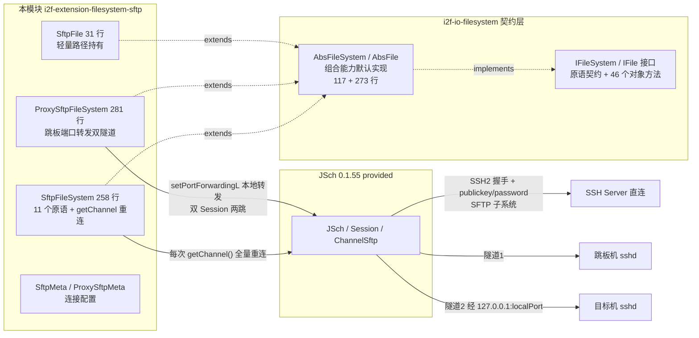
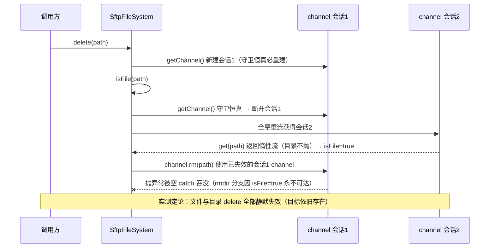
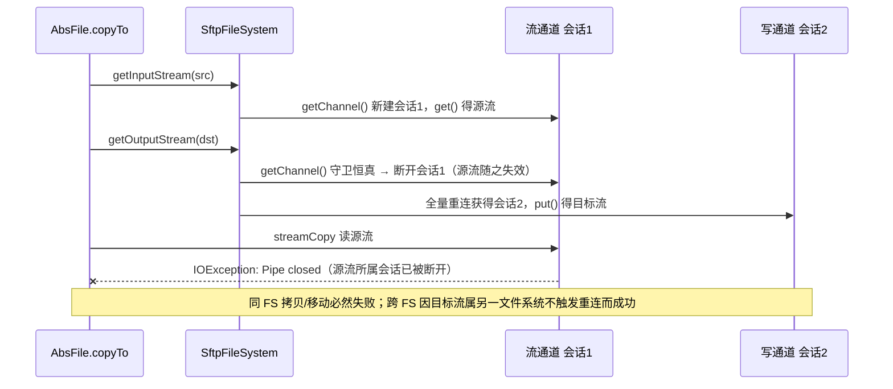

# i2f-extension-filesystem-sftp

> **基于 JSch（`com.jcraft:jsch:0.1.55`，provided）的 `IFileSystem` 契约适配器**（1 pom.xml 48 行 + 6 源文件 649 行：`SftpFileSystem` 258 行 + `ProxySftpFileSystem` 281 行 + `SftpFile` 31 行 + `ProxySftpFile` 31 行（死代码）+ `SftpMeta` 23 行 + `ProxySftpMeta` 25 行、零测试零资源）：把 SFTP 协议的文件操作装配为 `i2f-io-filesystem` 的 `IFileSystem`/`IFile` 契约实现——覆写 14 个方法（11 个操作原语 + `getFile`/`getAbsolutePath`/`close`），`copyTo`/`moveTo`/`store`/`load`/`readText`/`writeText` 等 40+ 组合能力全部继承自 `AbsFileSystem`/`AbsFile`；`ProxySftpFileSystem` 经 SSH 本地端口转发实现「跳板机 → 目标机」双隧道两跳接入。**核心缺陷**：`getChannel()` 守卫 `!channel.isClosed()` 恒真（JSch 新建 channel `close=false`，`isClosed()` 仅在 `disconnect()` 后为 true）→ **每次操作都断开旧会话并全量重连**（实测每次操作恰好 1 个新 SSH 会话；Proxy 每次 2 个）；并叠加 delete 三重失效链（外层 channel 被 `isFile()` 内部重建作废 + `isFile` 对目录误判 `true` + 异常全吞没）→ **`delete` 对文件与目录全部静默失效**；`listFiles(path)` 实际列出的是 **path 的父目录**内容（含 `.`/`..`）；同 FS `copyTo`/`moveTo` 因「先取输入流、再取输出流触发重连断源流」必然抛 `IOException: Pipe closed`。64 项运行时实证（38 通过 / 5 对立断言失败实锤缺陷 / 21 记录；真实 OpenSSH 9.0p1 mock sshd + `sshd.log` 会话计数 + JSch `get()` 惰性流探针）。

## 模块路径

- `i2f-extension/i2f-extension-filesystem-sftp/pom.xml`
- 相对于仓库根目录：`i2f-extension/i2f-extension-filesystem-sftp`

## 模块依赖

### 内部依赖（compile）

| Maven 坐标 | scope | optional | 说明 |
|-----------|-------|----------|------|
| `i2f.turbo:i2f-io-filesystem:1.0-jdk8` | compile | false | 文件系统契约层（`IFileSystem`/`IFile` 接口 + `AbsFileSystem`/`AbsFile` 抽象基类 + `FileSystemUtil` 路径工具），本模块继承其抽象基类实现 SFTP 后端 |

### 三方依赖

| Maven 坐标 | 版本 | scope | optional | 说明 |
|-----------|-------|-------|----------|------|
| `com.jcraft:jsch` | 0.1.55 | provided | false | JSch SSH2 协议栈（`JSch`/`Session`/`ChannelSftp`/`SftpATTRS`），**版本直接硬编码于本模块 POM（L25-30，未纳入根 POM `dependencyManagement` 统一管理，见瑕疵第 16 条）**；provided 声明，编包不含协议栈，运行期由使用方提供 |
| `org.projectlombok:lombok` | 1.18.44（根 POM `lombok.version` 管理） | provided | true | 继承根 POM `dependencyManagement` 的 provided + optional；仅 `SftpMeta`/`ProxySftpMeta` 使用 `@Data`（getter/setter 编译期生成） |

### 隐式传递依赖

| 传递路径 | 说明 |
|---------|------|
| `i2f-io-filesystem` → `i2f-io-stream` | 组合能力实现依赖 `StreamUtil`（`streamCopy` 等流桥接工具，`AbsFile`/`AbsFileSystem` 使用） |
| `i2f-io-filesystem` → `i2f-text` | 上游 POM 声明的传递依赖（上游文档注明该依赖实际未被使用，属冗余声明） |
| `com.jcraft:jsch:0.1.55` | 无 compile/runtime 传递依赖（自包含协议栈）；且 provided 声明不参与传递，使用方需自行引入 |

## 模块设计

### 包结构

```
i2f.extension.filesystem.sftp
├── SftpFileSystem.java          -- 契约适配器主体（连接管理 + 11 个原语方法，258 行）
├── SftpFile.java                -- 轻量路径持有（仅 3 个字段方法，31 行）
├── SftpMeta.java                -- 连接配置（host/port/username/password/privateKey/config，23 行）
├── readme.md                    -- 源码目录内嵌历史遗留说明（聚合四类文件系统的示例，非模块专属文档）
└── proxy
    ├── ProxySftpFileSystem.java -- 跳板双隧道契约适配器（本地端口转发 + 双 Session，281 行）
    ├── ProxySftpFile.java       -- 死代码（模块内零引用，getFile 实际返回 SftpFile，31 行）
    └── ProxySftpMeta.java       -- 代理配置（extends SftpMeta + localPort/remoteHost/remoteUsername/...，25 行）
```

### 契约继承链

```
IFileSystem（契约接口：原语方法 + 组合方法）
  └── AbsFileSystem（抽象基类，117 行，提供 combinePath/absPath/mkdirs/store/load/copyTo/moveTo 等默认实现）
        ├── SftpFileSystem implements Closeable（覆写 13 个契约方法：11 个操作原语 + getFile/getAbsolutePath；另含自有方法 getChannel/getDirAndName）
        └── ProxySftpFileSystem implements Closeable（同构覆写 13 个契约方法，连接拓扑换为双隧道）

IFile（契约接口：46 个对象方法）
  └── AbsFile（抽象基类，273 行，提供 writeText/readText/readLines/writeLines/copyTo/moveTo/writeBytes/readBytes 等默认实现）
        └── SftpFile（仅覆写 setFileSystem/getFileSystem/getPath 三个字段方法）
              ProxySftpFile（同构但无任何引用，死代码）
```

### 核心架构



### 设计要点

1. **契约适配器定位（模板级样板实现）**：全模块 649 行实现一个远端文件系统——`SftpFile` 仅 3 个字段方法，`SftpFileSystem` 仅 11 个原语方法，其余 40+ 组合能力（含 `mkdirs` 逐级递归、跨文件系统 `copyTo`/`moveTo` 流桥接、`readLines`/`writeLines`）全部由 `AbsFileSystem`/`AbsFile` 继承；与姊妹模块 `i2f-extension-filesystem-ftp` 同构（`getDirAndName` 路径切分逻辑逐行同源）
2. **守卫式连接管理 `getChannel()`（L26-73）**：判定 `channel == null || !channel.isConnected() || !channel.isClosed()` 命中即重建——**该表达式恒为真**：新建的 `ChannelSftp` 在 `connect()` 后 `isConnected()=true`、`isClosed()=false` → `!isClosed()` 恒真（JSch `Channel` 字节码确认：构造 `close=false`；包级 `close()` 置 `close=true`，仅由 `disconnect()` 调用）；`disconnect()` 后 `isConnected()=false` 同样命中。因此 **`getChannel()` 每次调用都执行完整重建**：断旧 channel/session（异常吞没）→ `new JSch()` → `addIdentity(privateKey)`（每次重读私钥文件）→ 新 `Session`（put `StrictHostKeyChecking=no` + 合并 `meta.config`）→ `session.connect()`（完整 SSH 握手 + 认证）→ `openChannel("sftp")` + `connect()`；失败包装 `IllegalStateException(e.getMessage(), e)`。守护条件中的"复用分支"实际为死逻辑
3. **「列目录匹配」元数据策略**：`getDirAndName(path)`（L75-99）把路径切分为「目录 + 名称」对（边界行为见实证 T04），`isExists`/`listFiles` 共用该切分——`isExists` 对 `ls(目录)` 结果做名称匹配；**`listFiles` 则直接把 `ls(目录)` 的全部条目返回**，因此返回的是 **path 的父目录**内容（含 `.`/`..`）而非 path 目录内的条目（语义缺陷，见瑕疵第 4 条）
4. **`delete` 三重失效链（功能性重灾）**：`delete(path)`（L197-209）先取外层 `channel = getChannel()`，随后 `isFile(path)` 内部的 `getChannel()` 因守卫恒真而**断开并替换**了外层 channel/session（新会话），此后 `channel.rm(path)`/`channel.rmdir(path)` 在已断开的旧 channel 上执行、异常被 `catch (Exception)` 吞没；又因 `isFile` 对目录误判 `true`（第 5 条），`isDirectory` 分支永不可达——**文件与目录的删除全部静默失效**（实证 T12/T13/T14/T16/T17，目标始终可见）
5. **`isFile` 惰性流误判**：`isFile(path)`（L144-158）执行 `InputStream is = channel.get(path)` 后仅 `is.close()` 而**从不读取**。JSch 0.1.55 的 `get()` 为惰性流（`ChannelSftp$2`）——对目录/根路径**不抛异常**（错误延迟至 `read()` 时抛 `IOException: error`），仅对不存在的路径在 `get()` 阶段抛 `SftpException`（探针实测）。因此 `isFile(目录)` 与 `isFile("/")` 恒为 `true`，并连带污染 `isReadable`/`isWritable`（继承自 `AbsFileSystem` 的 `isExists && isFile` 组合）
6. **同 FS `copyTo`/`moveTo` 双流冲突**：`AbsFile.copyTo`（同 FS 分支）委托 `AbsFileSystem.copyTo`（契约层 L93-98）：`getInputStream(src)`（会话 1 建流）→ `getOutputStream(dst)`（**触发 `getChannel()` 全量重连，会话 1 被断开**）→ `StreamUtil.streamCopy` 读源流即抛 `IOException: Pipe closed`——同 FS 拷贝/移动必然失败（与文件大小无关，T24 小文件同样失败）；跨 FS 分支（`AbsFile.copyTo` L146-155）因目标流属另一文件系统、不触发源 FS 重连而正常（T26/T27）
7. **`close()` 仅断开不置空**：`close()`（L101-113）断开 channel/session 但不将字段置空；后续任何操作经 `getChannel()` 守卫自动重连（实测 T18 重连 1 会话），"关闭"语义弱化
8. **异常策略四重奏**：`isDirectory`/`isFile`/`isExists`/`listFiles`/`delete`/`getAbsolutePath` 为静默吞没（空 `catch (Exception)` 返回 false/空列表/原值）；`mkdir`/`length` 包装 `IllegalStateException`；`getInputStream`/`getOutputStream` 包装 `IOException`；`getAppendOutputStream` 抛 `UnsupportedOperationException`（`isAppendable` 恒 `false`、不支持追加）
9. **Proxy 双隧道（跳板模式）**：`ProxySftpFileSystem.getChannel()`（L25-91）在每次重建时执行：jump `session.connect()` → `setPortForwardingL(localPort, remoteHost, remotePort)`（本地端口转发）→ `remoteSession = jsch.getSession(remoteUsername, "127.0.0.1", localPort)` → `remoteSession.connect()` → `openChannel("sftp")`；**每个逻辑操作 = 2 个新 SSH 会话**（跳板 + 目标，实测 P05 delta=2），重建块只清理 channel/session 而**遗漏 remoteSession**（依赖跳板断开连带掐断隧道 TCP 促使旧 remote 会话回收，实测线程无净增长）
10. **remote 侧认证的隐式行为**：`remoteSession` 与跳板 `session` 共用同一 `JSch` 实例，`jsch.addIdentity(privateKey)` 注册的身份对两个 Session 均生效——因此 `remotePassword` 未设置也能认证成功（实测 P02 使用同一密钥通过）；而 `ProxySftpMeta.remotePrivateKey` 字段**完全未接线**（死配置，见瑕疵第 14 条）
11. **provided 依赖策略**：`jsch` 仅编译期可见，编包与 POM 传递均不含协议栈；使用方按需自选版本引入，与全仓「契约稳定、实现可换」原则一致

## 模块目的

为需要以 SFTP 协议存取文件的场景提供「零改造接入 i2f 文件系统契约」的适配实现：业务代码只依赖 `IFileSystem`/`IFile` 抽象（参见 `i2f-io-filesystem` 的「面向抽象编程」章节），即可把本地盘、FTP、SFTP、HDFS、OSS 等后端互换使用；同时复用 `AbsFileSystem`/`AbsFile` 提供的路径规约、防穿越校验（`getStrictFile`）、跨文件系统流桥接等高阶能力；`ProxySftpFileSystem` 进一步覆盖「目标机只允许跳板机访问」的受限网络拓扑，经跳跃主机 SSH 端口转发两跳接入。provided 声明避免对使用方的 SSH 协议栈选型产生强制绑定。

## 模块功能

1. **构造即连接**：`new SftpFileSystem(meta)` 立即完成「SSH 握手 → 认证 → 打开 sftp 通道」，失败即抛 `IllegalStateException`（fail-fast 实测 T01/T02/T03）
2. **三态元信息检查**：`isDirectory`（cd 试探）/`isFile`（惰性流试探）/`isExists`（列目录名称匹配）
3. **目录列举**：`listFiles(path)` 返回 `IFile` 列表（⚠ 实际列出父目录内容，见瑕疵第 4 条）
4. **文件长度**：`length(path)` 取 `lstat().getSize()`（目录返回 0、缺失抛异常，见实证 T09）
5. **双路流读写**：`getInputStream`（`ChannelSftp.get`）/`getOutputStream`（`ChannelSftp.put`），并经继承获得 `readText`/`writeText`/`readBytes`/`writeBytes`/`readLines`/`writeLines`/`getReader`/`getWriter` 等便捷方法；不支持追加（`getAppendOutputStream` 抛 `UnsupportedOperationException`、`isAppendable` 恒 false）
6. **创建与删除**：`mkdir`（重名抛 `IllegalStateException("Failure")`）；`mkdirs` 经继承逐级递归创建；`delete`（⚠ 静默失效，见瑕疵第 2 条）
7. **组合能力（继承）**：`store`/`load`/`copyTo`/`moveTo`（同 FS 必失败、跨 FS 可用）/`getStrictFile` 防穿越/`getReader` 等 40+ 方法
8. **路径工具（公开）**：`getDirAndName(path)` 路径切分（返回 `Map.Entry<目录, 名称>`，含 7 类边界行为，实测 T04）；`getAbsolutePath` 经 `realpath` 绝对化（相对路径解析到远端 home，失败原样返回）
9. **跳板代理接入**：`ProxySftpFileSystem` 经本地端口转发双隧道两跳访问目标机（`ProxySftpMeta` 增加 `localPort`/`remoteHost`/`remotePort`/`remoteUsername`/`remotePassword`/`remoteConfig` 配置面）
10. **连接生命周期**：`close()`（断开 channel + session，Proxy 为三级断开）；任何后续操作自动重连

## 模块主要使用方法

### 1. Maven 引入

```xml
<dependency>
    <groupId>i2f.turbo</groupId>
    <artifactId>i2f-extension-filesystem-sftp</artifactId>
    <version>1.0-jdk8</version>
</dependency>
<!-- 本模块以 provided 声明 jsch，运行期需使用方自行提供（版本可自选） -->
<dependency>
    <groupId>com.jcraft</groupId>
    <artifactId>jsch</artifactId>
    <version>0.1.55</version>
</dependency>
```

### 2. 基础 CRUD（内嵌 readme 同名示例流程，实测全部通过）

```java
SftpMeta meta = new SftpMeta();
meta.setHost("x.x.x.x");
meta.setPort(22);
meta.setUsername("root");
meta.setPassword("xxx");
// 或使用私钥认证：meta.setPrivateKey("C:/keys/id_ecdsa");

SftpFileSystem fs = new SftpFileSystem(meta);   // 构造即连接（fail-fast）

IFile file = fs.getFile("/root/home/test/ftp.txt");
if (!file.getDirectory().isExists()) {
    file.getDirectory().mkdirs();               // 继承能力：逐级创建（实测 /a、/a/b、/a/b/c 全建）
}
if (!file.isExists()) {
    file.writeText("hello", "UTF-8");           // put 流写入
}

if (file.isExists()) {
    String str = file.readText("UTF-8");        // get 流读取
    System.out.println("read:" + str);
    // ⚠ delete 静默失效（瑕疵第 2 条）：实测调用后远端文件依然存在
    file.delete();
}

List<IFile> list = file.getDirectory().getDirectory().listFiles();
// ⚠ listFiles 实际返回「父目录」内容（含 . / ..），见瑕疵第 4 条

fs.close();
```

### 3. 跳板代理模式（内嵌 readme 示例，已修正原示例拼写错误）

```java
ProxySftpMeta meta = new ProxySftpMeta();
meta.setHost("x.x.x.x");            // 跳板机
meta.setPort(22);
meta.setUsername("root");
meta.setPassword("xxx");

meta.setLocalPort(7700);            // ⚠ 内嵌 readme 原示例误写为 setLocalPost（编译不过）
meta.setRemoteHost("192.168.1.100");// 目标机（从跳板机视角可达）
meta.setRemotePort(22);
meta.setRemoteUsername("root");
meta.setRemotePassword("xxx");      // 可与 remotePrivateKey 均不设置：跳板身份经共享 JSch 隐式生效（瑕疵第 14 条）

ProxySftpFileSystem fs = new ProxySftpFileSystem(meta);  // 构造即建立双隧道（2 个 SSH 会话）
IFile file = fs.getFile("/root/home/test/ftp.txt");
file.writeText("hello", "UTF-8");
String str = file.readText("UTF-8");
fs.close();                          // 三级断开：channel → remoteSession → session
```

### 4. 作为契约实现注入使用（跨文件系统桥接）

```java
SftpFileSystem sftp = new SftpFileSystem(meta);
IFile local = JdkFileSystem.getInstance().getFile("D:/data/a.txt");

// 跨 FS 拷贝：AbsFile.copyTo 检测到文件系统不同 → get + put 流桥接（实测成功 T26）
local.copyTo(sftp.getFile("/upload/a.txt"));

// 跨 FS 移动：内容可送达，但源文件不会被删除（delete 静默失效连带，实测 T27）
sftp.getFile("/upload/a.txt").moveTo(local);

// ⚠ 同 FS 拷贝/移动必抛 IOException: Pipe closed（瑕疵第 5 条）
// sftp.getFile("/a.txt").copyTo(sftp.getFile("/b.txt"));

// 面向 IFileSystem 抽象的业务代码可无感切换后端
void export(IFileSystem fs, String dir) { fs.getFile(dir).mkdirs(); /* ... */ }
sftp.close();
```

### 注意事项

1. **provided 依赖需自备**：使用方必须自行引入 `jsch`（0.1.55 或兼容版本），否则运行期 `NoClassDefFoundError`
2. **每次操作全量重连**：`getChannel()` 守卫恒真（瑕疵第 1 条），任何一次元数据/流操作都会「断旧会话 + 完整 SSH 握手 + 认证 + 开通道」；高频小操作场景有连接风暴与服务端连接数限制风险（实测 3 次元数据 = 3 个新会话），请控制调用频率或在上层做会话聚合
3. **`delete` 不可用**：对文件与目录全部静默失效且不抛异常（瑕疵第 2 条），业务方需改用姊妹模块 `i2f-extension-sftp` 的 `SftpUtil.rm` 类操作自行补偿
4. **同 FS `copyTo`/`moveTo` 不可用**：必然抛 `IOException: Pipe closed`（瑕疵第 5 条）；跨 FS 桥接可用，但 moveTo 后源文件不删除（瑕疵第 6 条）
5. **`listFiles` 语义与直觉不符**：返回的是入参路径的**父目录**全部条目（含 `.`/`..`），缺失目录也返回父内容而不报错（瑕疵第 4 条）；如需列出目录内容需自行过滤 `IFile.getName()` 或改用 `SftpUtil`
6. **`isFile` 对目录返回 `true`**：连带影响 `isReadable`/`isWritable`/`delete` 分支决策（瑕疵第 3 条）；判断类型请优先使用 `isDirectory`
7. **根路径语义不对称**：`isExists("/")=false`、`isFile("/")=true`、`isDirectory("/")=true`（实证 T19）；根路径判断需用 `isDirectory`
8. **默认关闭主机密钥校验**：`StrictHostKeyChecking=no` 由代码内置（可经 `meta.config` 覆盖），生产环境应显式配置为 `yes` 并管理 known_hosts（瑕疵第 16 条）
9. **非线程安全**：`channel`/`session` 字段无并发保护且 `getChannel()` 公开暴露；建议单实例串行使用或每线程独立实例（瑕疵第 12 条）

## 模块特性总结

1. **模板级扩展实现**：649 行完成两个远端文件系统形态（直连 + 跳板双隧道），其余 40+ 组合能力全部继承
2. **fail-fast 构造**：实例化即完成 SSH 握手/认证/开通道，配置错误在构造期暴露（T01/T02/T03）
3. **公钥/密码双认证**：`privateKey`（`addIdentity`）与 `password` 均可配置；实证以 ECDSA 公钥认证全链路通过
4. **中文路径可用**：中文文件名 + 中文内容 UTF-8 往返实测一致（T06b）
5. **双路流支持**：读（get）/ 写（put）齐全；不支持追加（UOE，与 HDFS 的 append 支持形成对比）
6. **跨文件系统桥接可用**：`copyTo`/`moveTo` 跨 FS 方向实测成功（SFTP → 本地 JDK）
7. **跳板双隧道**：本地端口转发两跳接入，适配受限网络；重复操作下端口重绑稳定（P03b 连续 5 次）
8. **零强绑定**：provided 依赖 + 运行期自备，使用方可自由选择 SSH 协议栈版本
9. **契约默认能力齐全**：`mkdirs` 逐级递归、`getStrictFile` 防穿越、`readLines`/`writeLines` 开箱即用
10. **零测试**：模块无任何测试类，全部行为保障来自本次文档工作的 64 项外部运行时实证

## 模块瑕疵或错误

1. **`getChannel()` 守卫恒真 → 每次调用全量重连（性能重灾）**：L27 条件 `channel == null || !channel.isConnected() || !channel.isClosed()` 中 `!channel.isClosed()` 对健康连接恒真（JSch 新建 channel `close=false`，`isClosed()` 仅在 `disconnect()` 后为 true）→ 任何状态的 `getChannel()` 都进入重建分支：断旧 channel/session、`new JSch()`、`addIdentity` 重读私钥、完整 SSH 握手认证、开新通道。实测每次元数据操作 = 1 个新 SSH 会话（T15：3 次 `isExists` = 3 会话；T17c：单次 `writeText` = 1 会话），构造、close 后操作同样重建（T01/T18）；守护表达式中作者意图的"连接复用"分支为死逻辑
2. **`delete` 对文件与目录全部静默失效（功能性重灾）**：`delete`（L197-209）先取外层 channel，`isFile(path)` 内部的 `getChannel()` 因守卫恒真而断开并替换了该 channel（新会话），随后 `channel.rm(path)`/`rmdir(path)` 在**已断开的旧 channel** 上执行、异常被空 `catch (Exception)` 吞没；又因 `isFile` 对目录误判 `true`（瑕疵第 3 条），`isDirectory` 分支永不可达。实测：`delete(file)`/`delete(空目录)`/`delete(非空目录)` 均无异常返回且目标依然存在（T12b/T13b/T14b `visible-after=true, physical=true`）；会话计数 delete(file)=2、delete(目录)=2（T16/T17，若类型判定正确目录应为 3）
3. **`isFile` 对目录与根路径恒判 `true`（惰性流误判）**：`isFile`（L144-158）执行 `get(path)` 后仅 `close()` 不读取——JSch 0.1.55 `get()` 对目录/根返回惰性流（错误延迟到 `read()` 才抛），仅对不存在路径在 `get()` 阶段抛 `SftpException`（探针实锤：dir/root `get()` 返回 `ChannelSftp$2`、`read()` 抛 `IOException: error`、`close()` 正常；missing `get()` 直接抛 `SftpException: No such file`）。连带污染：`isFile(目录)=true`（T07 实锤）、`isFile("/")=true`（T19c）、`isReadable(目录)=true`/`isWritable(目录)=true`（T30 实锤，继承自 `AbsFileSystem.isReadable = isExists && isFile`）、`delete` 分支错误
4. **`listFiles` 返回父目录内容（语义错误）**：`listFiles(path)`（L179-195）经 `getDirAndName` 拆出父目录后直接返回 `ls(父目录)` 的**全部条目**（含 `.`/`..`），且对缺失路径同样返回父目录内容而不报错。实测：`listFiles(ROOT+"/docs")` 返回 `[ROOT/., ROOT/.., ROOT/docs]`（自身与兄弟条目而非目录内子项，T08 实锤）；`listFiles(ROOT+"/no-such-dir")` 返回 3 项而非空列表（T08b 实锤）；`listFiles("/")` 返回 83 项远端 home 内容（T19d）
5. **同 FS `copyTo`/`moveTo` 必然失败（双流冲突）**：同 FS 分派到 `AbsFileSystem.copyTo`（契约层 L93-98）：`getInputStream(src)` 建立源流（会话 1）→ `getOutputStream(dst)` 触发 `getChannel()` 全量重连断开会话 1 → `streamCopy` 读源流抛 `IOException: Pipe closed`。实测小文件（T24）与 100KB 文件（T25）全部失败，dst 已创建但 0 字节（T25b `dstExists=true, dstLen=0`）；与文件大小无关，属必然失败
6. **`moveTo` 源文件不删除**：跨 FS `moveTo`（`AbsFile.moveTo` L157-167）在流桥接成功后调用 `this.delete()`——因 delete 静默失效（瑕疵第 2 条），源文件保留。实测 SFTP → 本地移动后源仍存在（T27b `src still exists=true, physical=true`）；同 FS `moveTo` 则因瑕疵第 5 条直接抛异常
7. **根路径三态不一致**：`isExists("/")=false`（`getDirAndName("/")` 得 `(".", "")`，空名称无法匹配任何条目）、`isFile("/")=true`（惰性流误判）、`isDirectory("/")=true`（cd 试探成功）——同一路径三种判定自相矛盾（实测 T19/T19b/T19c）
8. **`length` 目录语义漂移**：`length(目录)=0`（lstat size 非异常，实测 T09b）易与空文件混淆；缺失路径抛 `IllegalStateException("No such file")`（T09c）——同一方法三类输入语义不统一
9. **`getAbsolutePath` 语义偏差**：`realpath` 成功即绝对化（相对路径解析到**远端用户 home**，实测 `docs` → `/c/Users/Ice2Faith/docs`）；缺失路径 `realpath` 失败后原样返回入参（不抛异常、不规整，T20/T20b/T20c）
10. **`close()` 不置空 + 静默重连**：`close()`（L101-113）断开 channel/session 但不置空字段，后续任何操作自动重连（实测 T18 重连 1 会话后成功）；"关闭"语义弱化，且无法通过 close 阻止资源再次创建
11. **异常策略四种并存 + `Error` 归并**：静默吞没（六方法空 `catch (Exception)`）、`IllegalStateException` 包装（`mkdir`/`length`/`getChannel` 失败，且 `getChannel` 用 `catch (Throwable)` 连 `Error` 也归并）、`IOException` 包装（双流方法）、`UnsupportedOperationException`（追加流）——同类失败在不同入口异常类型不一致，且异常消息直接透传 JSch 原文（如 `"Failure"`、`"No such file"`），无上下文信息
12. **非线程安全 + 内部句柄公开**：`channel`/`session` 字段无锁无同步；`getChannel()` 为 public，外部可取得内部 `ChannelSftp` 并绕过模块直接操作（含断开连接等破坏性操作）；`isDirectory` 的 `pwd → cd → cd(bak)` 序列在共享实例并发下存在 cwd 竞争
13. **Proxy 重建遗漏 `remoteSession` 清理**：`ProxySftpFileSystem.getChannel()` 重建块（L27-40）只断开 `channel` 与跳板 `session`，**未断开 `remoteSession`**（close() L120-136 三级齐全）——旧 remote 会话依靠跳板断开连带掐断隧道 TCP 回收（实测线程无净增长 P08，但属隐性依赖），显式清理缺失
14. **`ProxySftpMeta.remotePrivateKey` 未接线（死配置）**：字段定义（L22）但代码从未使用；`remoteSession` 仅支持 `remotePassword`，实际认证依赖「与跳板共用同一 `JSch` 实例、`addIdentity` 身份隐式生效」的未文档化行为（实测 remotePassword 未设置也认证成功）；两条机使用不同密钥时该配置项无效
15. **`ProxySftpFile` 死代码 + 内嵌 readme 示例错误**：`ProxySftpFile`（31 行）在模块内外零引用（`getFile` 实际返回 `SftpFile`）；源码内嵌 `readme.md` 的 Proxy 示例中 `meta.setLocalPost(7700)` 拼写错误（正确方法为 `setLocalPort`，按原文书写编译不过）
16. **`jsch` 版本硬编码 + 默认关闭主机密钥校验 + 配置面薄**：`0.1.55`（2018 年最终官方版，社区已以 mwiede/jsch 分支延续维护）直接声明于模块 POM（L28）未纳入根 POM 统一管理；代码内置 `StrictHostKeyChecking=no`（可被 `meta.config` 覆盖，默认放行任何主机密钥存在 MITM 风险）；`SftpMeta` 密码明文、无连接/会话超时入口（`Session` 默认超时无限，网络异常时操作可能长时间阻塞）
17. **零测试**：无任何测试类；本次文档工作以外部探测类完成 64 项运行时实证（见下节）

## 运行时实证验证

在 JDK8（`C:\Java\jdk1.8.0_201`）下以 `javac` 直编模块 6 个源文件 + 探测类（`-encoding UTF-8`；classpath = `jsch-0.1.55` + `i2f-io-filesystem-1.0-jdk8` + `i2f-io-stream-1.0-jdk8` + `lombok-1.18.44` 注解处理）。**运行环境**：本机无 SFTP 服务端，采用 Git for Windows 自带 **OpenSSH 9.0p1 sshd**（`C:\Git\usr\bin\sshd.exe`，`internal-sftp` 子系统、公钥认证、`LogLevel DEBUG2`）作为真实 mock，监听 `127.0.0.1:22022`；哈希密钥由 JSch 程序化生成（ECDSA nistp256），并配置 `HostKeyAlgorithms +ssh-rsa`、`PubkeyAcceptedAlgorithms +ssh-rsa` 兼容 JSch 0.1.55 的算法集。**会话计数证据**：sshd 日志每建立一个 SSH 会话打印一行 `Accepted publickey`，以行数差精确统计每次操作的建连次数。**主验证 64 项**（`VerifySftpFs` 54 项：30 通过 / 5 失败 / 19 记录；`VerifyProxySftpFs` 10 项：8 通过 / 2 记录；`ProbeGet` 4 条根因探针）。证据留存 `runtime/tmp/filesystem-sftp-verify/`（`VerifySftpFs.java` 498 行 + `VerifyProxySftpFs.java` 162 行 + `ProbeGet.java` + `build.ps1` + `run1.log`/`run2.log`/`probe-get.log` + `sshd_config`/`sshd.log`）。

### 主验证（SftpFileSystem，直连模式）

| # | 验证项 | 实测结果 |
|---|--------|---------|
| T01 | 构造即连接 | 新建 1 SSH 会话（fail-fast 确认） |
| T02 | 错误端口构造 | 抛 `IllegalStateException`（cause 非空） |
| T03 | 无凭据构造 | 抛 `IllegalStateException`（cause 非空） |
| T04 | `getDirAndName` 边界表 | `/`→`(. , "")`、`""`→`(. , "")`、`a.txt`→`(. , a.txt)`、`/a.txt`→`(/ , a.txt)`、`a/b`→`(a , b)`、`/a/b/`→`(/a , b)`、`//a`→`(/ , a)` 全部符合 |
| T05 | `mkdir` | 目录创建成功 |
| T05b | `mkdir` 重名 | 抛 `IllegalStateException("Failure")` |
| T06 | `writeText`/`readText` 往返（ASCII） | 内容一致 |
| T06b | 中文文件名 + 中文内容往返 | 内容一致（UTF-8 可用） |
| T07 | 文件/目录/缺失三态 | **FAIL 实锤**：目录 `isFile=true`（`dir not file` 断言失败）；文件三态、目录 `isDirectory`、缺失三态均正确 |
| T08 | `listFiles(目录)` | **FAIL 实锤**：返回父目录内容 `[ROOT/., ROOT/.., ROOT/docs]`，目录内子项未列出 |
| T08b | `listFiles(缺失目录)` | **FAIL 实锤**：返回父目录 3 项（非空列表） |
| T09 | `length(file)` | `10` |
| T09b | `length(目录)` | `0`（记录） |
| T09c | `length(缺失)` | 抛 `IllegalStateException("No such file")` |
| T10 | `getOutputStream`/`getInputStream` | `BYTES-DATA` 往返一致 |
| T11 | `isAppendable` / 追加流 | `false` / `UnsupportedOperationException("sftp not support appendable stream")` |
| T12 | `delete(file)` 调用 | 无异常返回 |
| T12b | `delete(file)` 结果 | **`visible-after=true, physical=true`**（静默失效） |
| T13 | `delete(空目录)` 调用 | 无异常返回 |
| T13b | `delete(空目录)` 结果 | **`visible-after=true, physical=true`**（静默失效） |
| T14 | `delete(非空目录)` 调用 | 无异常返回 |
| T14b | `delete(非空目录)` 结果 | `visible-after=true`（无变化） |
| T15 | 3 次 `isExists` 会话数 | **3 个新 SSH 会话**（每次调用全量重连） |
| T16 | `delete(file)` 会话数 | 2（外层 + `isFile` 内部各 1；rm 在已断 channel 上静默失败） |
| T16b | `delete(file)` 结果 | `visible-after=true` |
| T17 | `delete(目录)` 会话数 | **2（FAIL 实锤）**：预期 3，`isFile(目录)=true` 短路 `isDirectory` 分支 |
| T17b | `delete(目录)` 结果 | `visible-after=true` |
| T17c | 单次 `writeText` 会话数 | 1 |
| T18 | `close()` 后操作 | 重连 1 会话且成功（静默重连） |
| T19 | 根路径语义 | `isExists=false`、`isDirectory=true`、`isFile=true`、`listFiles`=83 项（远端 home 内容，首项 `./.`） |
| T20 | `getAbsolutePath` | 绝对路径直通；相对 `docs`→`/c/Users/Ice2Faith/docs`（远端 home）；缺失→原样返回 |
| T21 | `mkdirs` 三级链 | `/a`、`/a/b`、`/a/b/c` 全建成功 |
| T22 | `writeText` 缺失目录 | 抛 `IOException("No such file")` |
| T23 | `readText` 缺失文件 | 抛 `IOException("No such file")` |
| T24 | 同 FS `copyTo`（小文件） | **EX `IOException: Pipe closed`**；src 仍在 |
| T25 | 同 FS `copyTo`（100KB） | **EX `IOException: Pipe closed`**；dst 存在但 0 字节 |
| T26 | 跨 FS `copyTo`（SFTP→JDK） | 成功，本地内容一致 |
| T27 | 跨 FS `moveTo`（SFTP→JDK） | 本地内容一致；**源仍存在**（`physical=true`，delete 连带失效） |
| T28 | `store`/`load` | 内容一致 |
| T29 | `writeLines`/`readLines` | 3 行往返一致 |
| T30 | `isReadable`/`isWritable`（文件） | `true`/`true`；缺失 `false`；**FAIL 实锤**：目录 `isReadable=true`（继承 `isFile` 目录误判） |
| T31 | 10 次操作线程数 | delta=0（无净泄漏） |

### 代理验证（ProxySftpFileSystem，双隧道模式；跳板与目标均指向同一 mock sshd，`localPort=23023`）

| # | 验证项 | 实测结果 |
|---|--------|---------|
| P01 | 构造 | **2 个新 SSH 会话**（跳板 + 远程） |
| P02 | `mkdir`+`writeText`+`readText`+`listFiles` | 内嵌 readme 同名流程全通（listFiles 同样返回父目录内容） |
| P03/P03b | 重建后重复操作 | 二次操作及连续 5 次操作全部稳定（本地端口重绑无冲突） |
| P05 | 单次操作会话数 | **2**（跳板与远程会话均重建） |
| P06 | `delete(file)`（Proxy） | 调用无异常返回 |
| P06b | `delete(file)` 结果 | **`visible-after=true, physical=true`**（与直连模式同一缺陷） |
| P07 | `close()` 后操作 | 三级断开后重建 2 会话且操作成功 |
| P08 | 3 次操作线程数 | delta=0（无净增长） |

### 根因探针（ProbeGet：`ChannelSftp.get()` 惰性流行为）

| 目标 | 实测 |
|------|------|
| 目录 | `get()` 返回惰性流 `com.jcraft.jsch.ChannelSftp$2`（**不抛**）→ `read()` 抛 `java.io.IOException: error` → `close()` 正常 |
| 文件 | 返回流 → `read()` 读到 10 字节正常 |
| 根 `/` | 同目录（`get()` 返回流、`read()` 抛 `IOException: error`） |
| 不存在路径 | `get()` 直接抛 `com.jcraft.jsch.SftpException: No such file`（惰性流不产生） |

→ 结论：`isFile()` 的 `get() + close()`（从不 `read()`）使**目录与根路径恒判 `true`**，这是瑕疵第 2/3/7 条的共同根因。

### delete 缺陷链（T12→T17，本模块最重要的实证）



### 同 FS copyTo 缺陷链（T24/T25）



### 补充说明

- **每次操作 1 会话的完备性**：T01（构造）、T15（元数据）、T17c（写）、T18（close 后）四处独立计数一致收敛于「每次 `getChannel()` 调用 = 1 个新 SSH 会话」；Proxy 模式全程 = 2 个（P01/P05/P07）
- **mock 环境适配记录**：JSch 0.1.55 与 OpenSSH 9.0 组合需在 sshd 侧显式启用 `ssh-rsa` 算法族（JSch 默认算法集交集有限）；首跑使用 `sftp-server` 外部子系统时进程立即断管（`inputstream is closed`），改用 `internal-sftp` 后握手/认证/传输全通——属 mock 环境问题而非模块缺陷，记录备查
- **delete 静默失效的独立确认**：主验证 T12b/T13b/T14b/T16b/T17b 与 Proxy 验证 P06b 在两种连接拓扑下结果一致（`visible-after=true`），并与探针的 `isFile` 误判根因互相印证

## 姊妹模块对比

### i2f-extension-sftp（同协议工具类）vs 本模块

| 对比项 | `i2f-extension-filesystem-sftp`（本模块） | `i2f-extension-sftp` |
|-------|------------------------------------------|----------------------|
| 定位 | `IFileSystem` 契约适配器（可与其他后端互换） | 独立 SFTP 工具类 `SftpUtil`/`ProxySftpUtil`（不接入契约） |
| 连接策略 | 每次操作全量重连（守卫缺陷，1 会话/操作） | 工具类自管理（按操作语义设计） |
| 删除能力 | `delete` 静默失效（瑕疵第 2 条） | `rm` 类操作可用（建议作为 delete 的补偿通道） |
| 追加能力 | 不支持（UOE） | 视具体实现 |
| 附加能力 | `mkdirs` 递归、跨 FS 桥接、`getStrictFile`、40+ 继承方法 | 操作级便捷封装 |
| 配置模型 | `SftpMeta`/`ProxySftpMeta`（本模块自有） | `ISftpMeta`/`IProxySftpMeta` 接口族 |

> 两者都基于 JSch，可共存；本模块面向契约化/多后端统一场景（须规避 delete/copyTo 缺陷），`SftpUtil` 面向单次脚本式 SFTP 操作。

### i2f-extension-filesystem-ftp（同契约姊妹实现）vs 本模块

两者为同构复制关系：`getDirAndName` 路径切分逐行同源，`SftpFile`/`FtpFile` 同为 3 字段轻量持有；差异在底层的连接模型（FTP 默认每操作新连接「正确优先」vs SFTP 守卫恒真「意外每操作重连」）、追加流（FTP 支持 APPE vs SFTP 抛 UOE）、以及缺陷谱（FTP 是「复用模式应答错位」，SFTP 是「delete/copyTo 静默失效」）。两者共享 `AbsFileSystem`/`AbsFile` 的全部继承能力与同类衍生缺陷（如 `getExtension` 反转、`getStrictFile` 行为等）。

## 消费方情况

| 消费方 | 类型 | 说明 |
|-------|------|------|
| `i2f-extension/pom.xml`（L48） | 父 POM 模块注册 | `<modules>` 中注册本模块，参与全仓构建 |
| 根 `pom.xml`（L1048-1052） | dependencyManagement | 以 `${i2f.version}` 统一管理本模块版本（注：`jsch` 三方版本未纳入根 POM 管理） |
| `i2f-extension-all/pom.xml`（L139-142） | POM 聚合 | 纳入 i2f-extension-all 聚合；jsch（provided）不传递打包，运行期需使用方自备 |
| `bash/backup-jdk8`、`bash/deploy-jdk8`、`bash/deploy-jdk17` | 预构建产物分发 | `i2f-extension-filesystem-sftp-1.0-jdk8.jar` / `-jdk17.jar` 随分发包分发（`backup-jdk17` 目录无此产物） |
| 全仓 Java 源码 | 零代码级引用 | 无任何模块 import `i2f.extension.filesystem.sftp.*`，作为契约实现供使用方按需选用 |
| `.wiki/docs/filesystem.md`（L217-254 专节、L349-363 表格） | 文档引用 | 被列为文件系统实现家族成员（`SftpFileSystem`/`ProxySftpFileSystem` 为编号 3/4 实现） |
