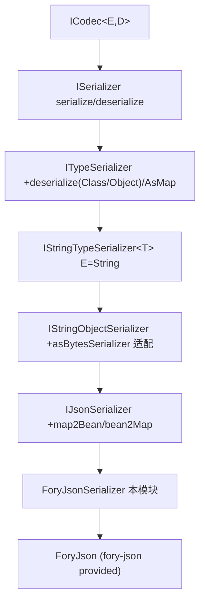

# i2f-extension-fory-json

> JSON 序列化契约 `IJsonSerializer` 的 **Apache Fory 实现适配层**（`i2f-extension` 组新增模块，`fory-json:1.7.4` 以 `provided` 引入、模块内硬编码版本）：单类 `ForyJsonSerializer` 把 Apache Fory（Fury 改名后的继任者）的 `ForyJson` 门面适配到 i2f 序列化契约族，实现 `serialize`/`deserialize` 全变体（`Class`/`Type`/`TypeRef`/泛型 `Object` token 分派）及 `bean2Map`/`deserializeAsMap`，与 `JacksonJsonSerializer`、`FastjsonSerializer`、`GsonSerializer` 等构成「一契约多引擎」的并列 JSON 实现。当前仓库内无任何源码级消费方，属新引入的参考实现。

## 模块路径

- `i2f-extension/i2f-extension-fory-json`

## 模块依赖

| 依赖 | Maven 坐标 | scope | optional | 说明 |
| --- | --- | --- | --- | --- |
| i2f-serialize-std | `i2f.turbo:i2f-serialize-std` | compile | 否 | 被实现的契约族所在模块（`IJsonSerializer` ← `IStringObjectSerializer` ← `IStringTypeSerializer` ← `ITypeSerializer` ← `ISerializer` ← `ICodec`） |
| lombok | `org.projectlombok:lombok` | provided | 是（父 DM 治理） | `ForyJsonSerializer` 使用 `@Data`（生成 `getFory`/`equals`/`hashCode`/`toString`），真实用到但用法存疑（见瑕疵） |
| Fory JSON | `org.apache.fory:fory-json:1.7.4` | provided | 否 | 目标序列化引擎；**`provided` 故不随包发布**，消费方需自备；版本在本 pom 硬编码、未走根 DM |

> 内部依赖仅 `i2f-serialize-std`；三方仅 `fory-json` 且 `provided`。i2f 制品版本由根 `pom.xml` 的 `dependencyManagement`（L1055）统一管理。构建继承父 pom，`maven-assembly-plugin` 设 `addMavenDescriptor=true`。

## 模块设计

单类，位于包 `i2f.extension.fory.json`：

- `ForyJsonSerializer implements IJsonSerializer`：适配器本体，`@Data` 修饰。
  - 持有 `final ForyJson fory`；无参构造复用静态共享单例 `JSON`（`ForyJson.builder().build()` 裸默认配置），也可经 `ForyJsonSerializer(ForyJson)` 注入自定义引擎。
  - 对外暴露静态 `INSTANCE`（非 final）与静态 `JSON`（final）。
  - 方法映射契约族：`serialize`→`fory.toJson`、`deserialize(String)`→`fromJson(...,Object.class)`、`deserialize(String,Class)`→`fromJson`、`deserialize(String,Object)` 按 `Type`/`TypeRef` 运行时分派（否则抛 `UnsupportedOperationException`）、私有泛型 `deserialize(String,TypeRef)`/`deserialize(String,Type)`、`bean2Map`/`deserializeAsMap` 以 `new TypeRef<Map<String,Object>>(){}` 落泛型。



## 模块目的

- 为 i2f 序列化契约族补一条 Apache Fory JSON 引擎实现，与 Jackson/Fastjson/Gson 实现并列，令上层面向 `IJsonSerializer` 注入时可按需切换到底层引擎。
- 复用契约自带的 `map2Bean`/`asBytesSerializer` 等 default 能力，最小化适配代码（单类约 78 行）。

## 模块功能

- `IJsonSerializer` 全套 string↔object JSON 序列化/反序列化，含 `Class`/`Type`/`TypeRef`/泛型 `Object` token 多种目标类型指定方式。
- `bean2Map`/`deserializeAsMap` 产出 `Map<String,Object>` 视图；继承 `map2Bean` 与 `asBytesSerializer` 字节适配。
- 消费生态：仓库内**无任何源码级消费方**、无 `META-INF/services` SPI 注册，仅被 `i2f-extension-all` 以 compile 聚合并纳入根 DM 版本管理，属新引入待接入的参考实现。

## 模块主要使用方法

```java
// 共享默认单例（无配置 ForyJson）
IJsonSerializer s = ForyJsonSerializer.INSTANCE;
String json = s.serialize(someBean);
Object back = s.deserialize(json, SomeBean.class);

// 或注入自定义引擎
ForyJson engine = ForyJson.builder().build();
IJsonSerializer custom = new ForyJsonSerializer(engine);
Map<String, Object> m = custom.bean2Map(someBean);
```

注意事项：
- `fory-json` 为 `provided`，运行环境须自备 `org.apache.fory:fory-json:1.7.4`（含其传递依赖）。
- 契约的 `encode`/`decode` 由 `ISerializer` default 转调 `serialize`/`deserialize`；`map2Bean` 为契约 default（先 `serialize(map)` 再 `deserialize(text,clazz)`）。
- 目标类型传非 `Type`/`TypeRef` 的 `Object` token（如类名字符串）会抛 `UnsupportedOperationException`。

## 模块特性总结

- 契约适配：完整实现 `IJsonSerializer` 及其在 `ITypeSerializer` 上扩展的类型化 `deserialize` 与 `deserializeAsMap`。
- 引擎可插拔：默认走静态共享 `JSON`，亦可构造注入自定义 `ForyJson`。
- 与其他 JSON 引擎实现同契约并列，可运行时无缝替换。
- 极简单类实现，复用契约 default 方法，零额外 i2f 内部依赖。

## 模块瑕疵或错误

> 以下为静态识别的问题/潜在问题，未做运行实证。

- 【**静态共享 `ForyJson` 单例的线程安全隐患**】无参构造与 `INSTANCE` 都复用同一个 `static final JSON = ForyJson.builder().build()`，该引擎以**默认配置**构建、未显式开启线程安全模式，被全进程多线程共享；Fory/Fury 的 `Fory` 实例通常非线程安全，官方建议 `ThreadLocalFory`/线程安全模式，直接并发 `toJson`/`fromJson` 存在数据竞争风险。
- 【**与兄弟实现行为不一致（日期/null/包含策略）**】`JacksonJsonSerializer.INSTANCE` 显式设 `yyyy-MM-dd HH:mm:ss SSS` 日期格式、Locale 与 `Include.ALWAYS`；本类用裸 `builder().build()`，日期/时间序列化形态、null 字段保留与否全交由 Fory 默认，若上层在 Jackson↔Fory 间切换会产生不同 JSON 输出（契约层未约束）。
- 【**异常未统一包装**】契约族提供 `JsonSerializeException`（Jackson 经 `AbsJacksonSerializer` 包装），本实现所有方法直接透传 Fory 运行时异常；`deserialize(String,Object)` 未匹配分支抛的是 `UnsupportedOperationException` 而非家族异常，破坏统一错误契约（消息 `"ForyJson un-support parseText."` 亦语义含混、拼写 `un-support`）。
- 【**`@Data` 用于序列化器语义不当**】为非业务状态的适配器生成 `equals`/`hashCode`/`toString`（基于 `ForyJson` 引用比较/拼接），既无意义又可能触发引擎的重量级 `toString`；且手写无参构造与 `@Data` 隐式构造器语义叠加易混淆。
- 【**`bean2Map` 冗余强转 + 双重转换**】`bean2Map` 先 `serialize` 成 JSON 串再 `fromJson` 回 `Map`（对象→串→Map 两趟），且第 69 行 `(Map<String,Object>)` 强转对已能命中 `deserialize(String,TypeRef)` 泛型重载而言属冗余、带 unchecked 语义。
- 【**`INSTANCE` 非 final 可变公开静态**】`public static ForyJsonSerializer INSTANCE`（与 Jackson 同款）可被外部重新赋值，破坏单例约定。
- 【**`deserialize(String)`→`Object.class` 的泛型退化**】无类型反序列化只能还原为 Fory 默认泛型结构（Map/List/标量），对期望 POJO 的调用方不友好；契约 default 本身即忽略 `Class`/`type`，实现虽纠正但不同重载语义差异大易误用。
- 【**零激活 + `provided` 不打包**】全仓无构造/引用点、无 SPI 注册，仅 `extension-all` 聚合，处预留状态；`fory-json` 又 `provided`，任何真实消费方未自备引擎即 `NoClassDefFoundError`。
