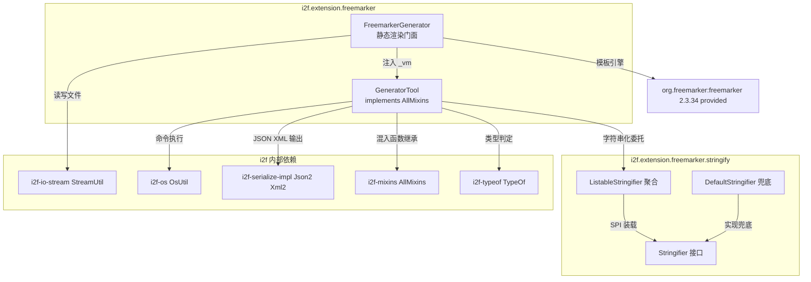
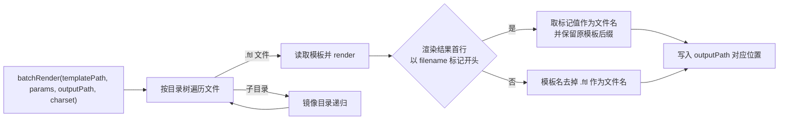

# i2f-extension-freemarker

> **基于 FreeMarker 2.3.34（provided）的模板渲染与代码生成工具 / 三源渲染（字符串、文件系统、类路径）+ 整目录批量代码生成（`#filename` 动态输出名）+ 模板内建工具对象（`GeneratorTool` 混入 500+ 工具函数 + `Stringifier` 字符串化 SPI）的轻量封装**（5 源文件约 510 行、单包族 `i2f.extension.freemarker` / `.stringify` / `.stringify.impl`、零测试零资源、7 依赖 = 6 个内部模块 + lombok + `org.freemarker:freemarker:2.3.34` provided）。

## 模块路径

- `i2f-extension/i2f-extension-freemarker/pom.xml`
- 相对于仓库根目录：`i2f-extension/i2f-extension-freemarker`

## 模块依赖

### 内部模块（compile，版本由根 POM `${i2f.version}` 统一管理）

| Maven 坐标 | scope | optional | 说明 |
|-----------|-------|----------|------|
| `i2f.turbo:i2f-io-stream` | compile | false | `StreamUtil.readString`/`writeString` 读写模板文件与渲染输出文件 |
| `i2f.turbo:i2f-os` | compile | false | `OsUtil.runCmd` 支撑模板内 `cmdResult` 命令执行 |
| `i2f.turbo:i2f-serialize-impl` | compile | false | `Json2.toJson`（`toJsonString`）与 `Xml2.toXmlString`（`toXmlString`） |
| `i2f.turbo:i2f-mixins` | compile | false | `AllMixins` 聚合混入接口，`GeneratorTool` 继承后获得 500+ 模板可用工具函数 |
| `i2f.turbo:i2f-typeof` | compile | false | `TypeOf.typeOfAny` 支撑 `isInTypes` 类型判定 |
| `i2f.turbo:i2f-text` | compile | false | 声明但源码未直接引用（编译期需求可由 `i2f-mixins` 传递满足） |

### 三方依赖

| Maven 坐标 | 版本 | scope | optional | 说明 |
|-----------|------|-------|----------|------|
| `org.freemarker:freemarker` | 2.3.34 | provided | false | 模板引擎本体，运行期由使用方自备；代码内硬编码 `Configuration.VERSION_2_3_34` 与其绑定 |
| `org.projectlombok:lombok` | 1.18.44（父 POM 管理） | provided | true | 编译期 `@Data`（真实使用于 `ListableStringifier`） |

> 注：`DefaultStringifier` 引用的 `i2f.convert.obj.ObjectConvertor` 属于 `i2f-convert` 模块，经 `i2f-mixins`/`i2f-serialize-impl` 传递引入，本模块 POM 未直接声明。

## 模块设计

### 包结构

```
i2f.extension.freemarker
├── FreemarkerGenerator.java         # 渲染门面：4 个静态方法
├── GeneratorTool.java               # 模板内建工具对象（_vm），implements AllMixins
└── stringify
    ├── Stringifier.java             # 字符串化 SPI 接口（support / stringify 双动词）
    └── impl
        ├── DefaultStringifier.java  # 兜底实现：ObjectConvertor.stringify(obj, "null")
        └── ListableStringifier.java # 聚合器：实例级 list + ServiceLoader 静态列表
```

### 架构设计

模块为「渲染门面 + 模板工具对象 + 字符串化 SPI」三层结构：

- **渲染门面**（`FreemarkerGenerator`）：以静态方法收口 FreeMarker 的 `Configuration`/`TemplateLoader`/`Template` 装配细节，对暴露字符串、文件系统、类路径三种模板来源的渲染入口与整目录批量生成入口；
- **模板工具对象**（`GeneratorTool`）：渲染时以 `_vm` 变量注入参数 Map，模板内通过 `${_vm.xxx(...)}` 调用；自身 `implements AllMixins`，将 i2f-mixins 的 500+ 混入函数直接开放给模板；
- **字符串化 SPI**（`stringify` 包）：为 `GeneratorTool.str` 提供可扩展的对象转字符串能力，`ListableStringifier` 按「实例列表 → ServiceLoader 静态列表 → DefaultStringifier 兜底」责任链择优。



### 渲染来源与装载器

| 入口方法 | 模板来源 | 使用的 TemplateLoader | 编码 |
|---------|---------|----------------------|------|
| `render` → `renderByStringResource` | 内存字符串 | `StringTemplateLoader`（UUID 生成临时模板名，渲染后移除） | UTF-8 |
| `renderByFileResource(isInClassPath=false)` | 文件系统 | `FileTemplateLoader`（以模板文件父目录为根，模板名取文件名） | UTF-8 |
| `renderByFileResource(isInClassPath=true)` | 类路径 | `ClassTemplateLoader(FreemarkerGenerator.class, "")`，以该类所在包 `i2f/extension/freemarker` 为基准路径 | UTF-8 |
| `batchRender` | 目录树中的 `.ftl` 文件 | 不使用 loader（`StreamUtil` 读取后走字符串渲染） | 由 `charset` 参数指定 |

### 统一渲染配置

所有渲染入口均以相同方式初始化 `Configuration`（`FreemarkerGenerator.java:125-132` / `:167-174`）：

1. 版本锁定 `Configuration.VERSION_2_3_34`；
2. 编码三连：`setEncoding(Locale.CHINA, UTF-8)` + `setDefaultEncoding(UTF-8)` + `setOutputEncoding(UTF-8)`；
3. 日期三格式：`yyyy-MM-dd` / `HH:mm:ss` / `yyyy-MM-dd HH:mm:ss`；
4. 可选覆盖：`config` 参数非空时 `configuration.setSettings(config)`；
5. 渲染前 `params.put("_vm", GeneratorTool.INSTANCE)` 注入工具对象，`finally` 中 `params.remove("_vm")`（字符串模式另行 `removeTemplate(id)` 移除临时模板）。

### 批量生成流程（#filename 动态输出名）

`batchRender` 对模板目录做递归镜像生成（`FreemarkerGenerator.java:53-99`）：

- 模板文件名以 `.ftl` 结尾，输出文件名默认去掉 `.ftl` 后缀（`LoginController.java.ftl` → `LoginController.java`）；
- 模板渲染结果首行若以 `#filename ` 开头，则首行剩余内容（trim 后非空）作为输出文件名主体，并保留原模板名最后一个 `.` 起的后缀（`#filename ${tableName}Controller` + 模板名 `Controller.java.ftl` → `UserController.java`）；
- 子目录递归处理，输出目录树与模板目录树结构一致；输出父目录不存在时自动 `mkdirs()`。



### 设计要点

1. **静态门面**：无实例状态依赖，`FreemarkerGenerator` 全部为 `public static` 方法；
2. **模板工具对象注入**：`_vm` 是模板与 Java 侧的唯一约定键，模板内 `${_vm.xxx(...)}` 即可调用全部工具方法与混入函数；
3. **字符串化责任链**：`ListableStringifier` 查询顺序为「实例 `list` → 静态 `STRINGFIERS`（ServiceLoader 装载）→ `DefaultStringifier`（恒支持，兜底）」；
4. **批量生成**：目录递归 + 后缀约定 + `#filename` 标记三件套，输出树与模板树同构，适合代码生成器场景；
5. **同构兄弟模块**：与 `i2f-extension-velocity`（Velocity 引擎版）结构完全同构（同为 `GeneratorTool implements AllMixins` + `stringify` SPI 包），二者相互独立、无依赖关系，属同一设计在两种模板引擎上的平行落地。

## 模块目的

将 FreeMarker 模板引擎的装配与使用样板（`Configuration` 初始化、编码与日期格式统一、多种模板来源的 loader 切换、工具对象注入）收敛为 4 个静态方法；同时通过 `_vm` 工具对象与 `AllMixins` 混入，让模板内直接使用 i2f 的 500+ 工具函数、JSON/XML 输出与命令执行能力，使「模板目录 → 代码/文本产物目录」的批量生成只需一次 `batchRender` 调用。

## 模块功能

1. **字符串模板渲染**：`render(template, params)` 一行完成内存模板求值；
2. **文件/类路径模板渲染**：`renderByFileResource(config, isInClassPath, fileName, params)` 支持文件系统与 classpath 双来源；
3. **整目录批量生成**：`batchRender(templatePath, params, outputPath, charset)` 递归镜像生成，支持 `#filename` 动态输出名；
4. **模板内建工具对象**：`_vm`（`GeneratorTool`）提供 `str`/`join`/`fori`/`list`/`instanceOf`/`split`/`toJsonString`/`toXmlString`/`cmd`/`cmdResult`/`isInTypes` 等定制函数，并继承 `AllMixins` 全量混入函数；
5. **字符串化 SPI 扩展**：`Stringifier` 接口 + `DefaultStringifier` 兜底 + `ListableStringifier` 聚合，支持 SPI 文件与编程式双通道扩展；
6. **统一渲染约定**：UTF-8 编码、`Locale.CHINA`、三种日期格式、`VERSION_2_3_34` 版本锁定。

## 模块主要使用方法

### 1. 引入依赖

```xml
<dependency>
    <groupId>i2f.turbo</groupId>
    <artifactId>i2f-extension-freemarker</artifactId>
    <version>1.0-jdk8</version>
</dependency>
```

运行期需自行声明 freemarker（模块声明为 provided）：

```xml
<dependency>
    <groupId>org.freemarker</groupId>
    <artifactId>freemarker</artifactId>
    <version>2.3.34</version>
</dependency>
```

### 2. 字符串模板渲染

```java
// 注意：params 必须是可变 Map（渲染过程会临时注入/移除 _vm 键）
Map<String, Object> params = new HashMap<>();
params.put("tableName", "User");

String rs = FreemarkerGenerator.render("Hello ${tableName}!", params);
// 需要自定义 FreeMarker 设置时：FreemarkerGenerator.renderByStringResource(config, template, params)
```

### 3. 文件与类路径模板渲染

```java
// 文件系统模板（建议传绝对路径，父目录不能为空）
String rs1 = FreemarkerGenerator.renderByFileResource(null, false, "D:/tpl/hello.ftl", params);

// 类路径模板（以 FreemarkerGenerator 类所在包 i2f/extension/freemarker 为基准路径）
// 对应 classpath 资源：i2f/extension/freemarker/tpl/hello.ftl
String rs2 = FreemarkerGenerator.renderByFileResource(null, true, "tpl/hello.ftl", params);
```

### 4. 整目录批量代码生成

```java
Map<String, Object> params = new HashMap<>();
params.put("tableName", "User");
params.put("columns", Arrays.asList("id", "name", "age"));

FreemarkerGenerator.batchRender("D:/gen/tpl", params, "D:/gen/out", "UTF-8");
```

模板目录树与输出目录树镜像对应，模板首行可使用 `#filename` 标记动态指定输出文件名（标记行不会出现在输出中）：

```
模板：D:/gen/tpl/Controller.java.ftl（首行如下）
    #filename ${tableName}Controller

输出：D:/gen/out/UserController.java

目录镜像示例：
D:/gen/tpl                          D:/gen/out
├── Controller.java.ftl         →   ├── UserController.java
└── entity/
    └── User.java.ftl           →   └── entity/
                                        └── User.java
```

### 5. 模板内建工具函数（_vm）

`GeneratorTool` 的定制函数在模板中按 `${_vm.方法(...)}` 调用：

| 方法 | 作用 | 备注 |
|------|------|------|
| `str(Object)` | 对象转字符串 | 走 `Stringifier` 责任链，null 输出 `"null"` |
| `join(Object, fmt, sep, open, close)` | 集合/数组连接 | `fmt` 为 `%s` 占位模板；`open`/`close` 为前后包裹串 |
| `fori(int begin, int end, int step)` | 生成整数序列供 `<#list>` 迭代 | 终止条件为 `i != end`，步长方向需与区间方向一致 |
| `list(Object)` | 集合/数组转 Map 列表 | 每项含 `first`/`last`/`index`/`size`/`value` 五键 |
| `instanceOf(Object, String)` | 类型判定 | 支持 `string`/`int`/`short`/`byte`/`char`/`long`/`float`/`double`/`date` 简名与全限定类名 |
| `split(String, trimBefore, regex, limit, removeEmpty)` | 字符串分割 | 可先 trim、限制段数、去除空段 |
| `toJsonString(Object)` | JSON 序列化 | 委托 `Json2.toJson` |
| `toXmlString(Object)` | XML 文本输出 | 先 `str` 再 `Xml2.toXmlString` 转义 |
| `cmd(String, boolean)` | 执行系统命令 | 可等待结束；异常被吞掉且无返回状态 |
| `cmdResult(String, String)` | 执行命令并返回输出 | 委托 `OsUtil.runCmd`，抛受检异常 |
| `isInTypes(Class, Class...)` | 类型匹配判定 | 委托 `TypeOf.typeOfAny` |
| 继承 `AllMixins` 的全部 default 方法 | 500+ 混入函数 | 字符串/数学/日期/正则/集合/文件等分类函数 |

模板中使用示例：

```
<#-- JSON 输出 -->
${_vm.toJsonString(entity)}

<#-- 带索引/首末标记的集合遍历 -->
<#list _vm.list(items) as item>
${item.index}. ${item.value}<#if !item.last>,</#if>
</#list>

<#-- 带分隔符的连接 -->
${_vm.join(columns, "%s", ", ", "", "")}

<#-- 整数区间迭代 -->
<#list _vm.fori(0, 10, 1) as i>
line-${i}
</#list>
```

### 6. 自定义字符串化（Stringifier）

方式一：编程式注册（向 `GeneratorTool.INSTANCE` 的聚合器实例列表追加）：

```java
((ListableStringifier) GeneratorTool.INSTANCE.STRINGFIER).getList().add(myStringifier);
```

方式二：SPI 注册——实现 `i2f.extension.freemarker.stringify.Stringifier` 接口，并在 classpath 提供
`META-INF/services/i2f.extension.freemarker.stringify.Stringifier` 描述文件（类加载时一次性装载）。

### 7. 注意事项

- 渲染过程会向 `params` 注入并移除 `_vm` 键：请传入可变 `HashMap`，且不要在该 Map 中预置 `_vm` 键；
- `renderByFileResource` 的 `isInClassPath=false` 模式请传绝对路径或带父目录的路径（无父目录时 `FileTemplateLoader` 构造会失败）；
- freemarker 版本需与 2.3.34 兼容（代码硬编码 `Configuration.VERSION_2_3_34`）；
- 模板内 `cmd`/`cmdResult` 可执行任意系统命令，仅应在模板来源可信的场景使用。

## 模块特性总结

1. **轻量薄封装**：5 源文件约 510 行，仅此一个三方强绑定依赖（freemarker，provided 引入）；
2. **三源渲染统一入口**：字符串 / 文件系统 / 类路径的模板装载细节全部由门面收口；
3. **批量代码生成**：目录递归镜像 + `#filename` 动态输出名，面向「一套模板生成一批文件」场景；
4. **模板即工具箱**：`_vm` 注入的 `GeneratorTool` 覆盖字符串化、集合加工、JSON/XML、类型判定、命令执行，外加 `AllMixins` 500+ 函数；
5. **可扩展字符串化**：SPI（ServiceLoader）与实例列表双通道接入自定义 `Stringifier`；
6. **一致性默认**：UTF-8 编码、中国区域、固定日期格式、引擎版本锁定，开箱即用；
7. **引擎平行设计**：与 `i2f-extension-velocity` 为同一设计在两种模板引擎上的同构落地。

## 模块瑕疵或错误

1. **`params` Map 侵入式增删 `_vm` 键**（`FreemarkerGenerator.java:155/162`、`:191/198`）：渲染前强行 `put`、`finally` 中 `remove`。传入 `null` 会直接 NPE；传入不可变 Map（`Collections.unmodifiableMap`、`Map.of`）会抛 `UnsupportedOperationException`；调用方原有 `_vm` 键会被静默丢弃。多线程共享同一 `params` 并发渲染时该键的增删存在竞争。
2. **`batchRender` 路径与目录读取的静默行为**（`FreemarkerGenerator.java:54-57`、`:62-63`）：模板路径不存在时直接 `return` 静默忽略（无任何提示）；`ipath.listFiles()` 在 IO 异常或权限不足时返回 `null`，随后 `for (File item : files)` 直接 NPE。
3. **`renderByFileResource` 相对路径 NPE 风险**（`FreemarkerGenerator.java:140-141`）：`isInClassPath=false` 时 `new File(fileName).getParentFile()` 对无父目录的相对路径（如 `"hello.ftl"`）返回 `null`，`new FileTemplateLoader(null)` 构造即抛异常；且 `fileName` 为空/null 时 `File` 构造行为同样不可控。
4. **无模板缓存**（`FreemarkerGenerator.java:125/167`）：每次渲染都新建 `Configuration` 与 `TemplateLoader`；`batchRender` 对每个 `.ftl` 文件各触发一次完整装配，批量场景下引擎初始化开销被线性放大（对比：正常 FreeMarker 用法应复用单例 `Configuration`）。
5. **`#filename` 标记识别边界**（`FreemarkerGenerator.java:70-86`）：仅检查渲染结果的第一个 `\n` 前内容是否 `startsWith("#filename ")`；单行模板（无换行）永远不识别；模板首行渲染后为空行、或标记不在第一行时标记失效，静默回退默认命名。
6. **`#filename` 标记依赖 `#` 前缀在模板中的透传行为**：该标记以 `#` 开头，而 `#` 在 FreeMarker 中是简写指令/注释的引导符（`#if`、`#--` 等），标记能被原样渲染输出（而非被引擎解析报错）依赖 FreeMarker 对未知 `#` 前缀的处理规则，属于潜在兼容风险点。
7. **`GeneratorTool.cmd` 空吞异常**（`GeneratorTool.java:98-107`）：`Runtime.getRuntime().exec` 与 `waitFor` 的异常仅 `printStackTrace`，方法无返回值、调用方无法感知命令失败或退出码；相反 `cmdResult` 抛出受检异常，两者错误契约不一致。`cmd` 失败时无任何反馈。
8. **`GeneratorTool.instanceOf` 异常吞与类型表局限**（`GeneratorTool.java:147-178`）：`Class.forName` 失败仅 `printStackTrace` 后返回 `false`；简名映射仅 9 项（`date` 仅对应 `java.util.Date`，不含 Java 8 时间类型）；`typeName` 传入原始类型名（`int` 等）会走 `Class.forName` 失败路径。
9. **`fori` 终止条件为 `i != end`**（`GeneratorTool.java:92`）：当 `step` 为 0，或步长方向与区间方向不一致（如 `fori(10, 0, 1)`）时循环永不满足终止条件，模板渲染将陷入死循环。
10. **`str` 的 support 分支恒真**（`GeneratorTool.java:25-30`）：`ListableStringifier.support` 链尾兜底 `DefaultStringifier.support` 恒返回 `true`，导致该条件恒真、分支冗余；即 `str` 实际永远走 `STRINGIFIER.stringify`。
11. **SPI 装载一次性 + 静态列表可被外部污染**（`ListableStringifier.java:16-26`）：`STRINGFIERS` 在类加载静态块中一次性 `ServiceLoader` 装载，运行期新增 SPI 实现需重启；且它是 `public static final` 可变列表，任何代码均可直接增删污染全局字符串化行为。
12. **freemarker 版本强耦合**：POM 以 provided 声明 2.3.34 但代码硬编码 `Configuration.VERSION_2_3_34`，使用方若在运行期引入更低版本 freemarker，将因该常量缺失而出现 `NoSuchFieldError` 等链接错误。
13. **`batchRender` 不复制非 `.ftl` 资源**（`FreemarkerGenerator.java:64-97`）：模板目录中非 `.ftl` 的普通文件既不被渲染也不被复制，输出目录仅包含渲染产物；`.ftl` 识别大小写敏感（`.FTL` 不识别）。
14. **类注释与接口不一致**（`FreemarkerGenerator.java:35`）：`batchRender` 注释中「参数 json 文件，需要是一个 JSON 格式的合法对象」描述的是 Map 参数的旧形态，实际方法签名接收已解析的 `Map<String, Object>`，注释为遗留描述。
15. **编码策略不对称**：`batchRender` 支持自定义 `charset` 参数，而 `renderByFileResource`/`renderByStringResource` 的模板读取编码硬编码 UTF-8（`Locale.CHINA`），三种入口的编码可调性不一致。
16. **无测试覆盖**：模块零测试零资源，`#filename` 标记、批量递归、SPI 装载等关键路径均无自动化验证。

## 消费方情况

本模块无 Java 源码级 import 消费方（全仓源码扫描 `i2f.extension.freemarker` 仅命中模块自身），仅通过 POM 聚合引用：

| 消费方 | 类型 | 说明 |
|-------|------|------|
| `i2f-extension-all` | POM 聚合 | `i2f-extension-all/pom.xml:L145` compile 依赖 |
| `i2f-extension` | 父 POM | `i2f-extension/pom.xml:L98` 子模块注册（构建顺序位于 `i2f-extension-zookeeper` 与 `i2f-extension-xproc4j` 之间） |
| 根 POM | dependencyManagement | `pom.xml:L1055` 版本统一管理（`${i2f.version}`） |

补充：`i2f-extension-velocity` 为本模块的设计同构兄弟模块（各自独立实现 `GeneratorTool` + `stringify` 包，互不依赖）；`wiki.md` 的 Mixin 体系中将其列为 `AllMixins` 的「模板渲染」应用案例之一。
