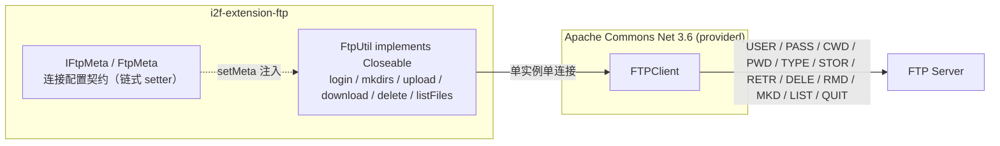

# i2f-extension-ftp

> 轻量 FTP 操作工具：以 `FtpUtil` 单类门面封装 Apache Commons Net `FTPClient`（provided）的登录、递归建目录、上传、下载、删除、列举等操作（链式 API + 单连接会话 + 完整操作式应答消费）；`IFtpMeta`/`FtpMeta` 沉淀「连接四要素」配置契约，被 `i2f-extension-sftp` 继承复用。

## 模块路径

- `i2f-extension/i2f-extension-ftp/pom.xml`
- 相对于仓库根目录：`i2f-extension/i2f-extension-ftp`

## 模块依赖

### 内部依赖（compile）

| Maven 坐标 | scope | optional | 说明 |
|-----------|-------|----------|------|
| `i2f.turbo:i2f-io-file:1.0-jdk8` | compile | false | 本地文件工具：`FileUtil.useParentDir`（自动创建文件的本地父目录）、`FileUtil.useDir`（确保本地目录存在），供 `download(File)`/`download2Dir` 使用 |

### 三方依赖

| Maven 坐标 | 版本 | scope | optional | 说明 |
|-----------|------|-------|----------|------|
| `commons-net:commons-net` | 3.6（硬编码于本模块 POM L28，未纳入根 POM `dependencyManagement` 统一管理） | provided | false | Apache Commons Net FTP 协议栈（`FTPClient`/`FTP`/`FTPFile`/`FTPReply`）；provided 声明，编包不含协议栈，运行期需使用方自备 |
| `org.projectlombok:lombok` | 1.18.44（根 POM `lombok.version` 管理） | provided | true | 继承根 POM `dependencyManagement` 的 provided + optional；注：本模块源码实际未使用任何 Lombok 注解，属冗余声明（见瑕疵第 12 条） |

### 隐式传递依赖

| 传递路径 | 说明 |
|---------|------|
| `i2f-io-file` → `i2f-text` / `i2f-io-stream` / `i2f-array` / `i2f-resources` | `FileUtil` 的上游工具依赖（字符串/流/数组/资源），随 Maven 传递引入 |
| `commons-net:commons-net:3.6` | 无 compile/runtime 传递依赖（自包含协议栈）；provided 声明不参与传递，使用方需自行引入 |

## 模块设计

### 包结构

```
i2f.extension.ftp
├── FtpUtil.java        -- 操作门面（implements Closeable，150 行）
└── data
    ├── IFtpMeta.java   -- 连接配置契约（host/port/username/password，17 行）
    └── FtpMeta.java    -- 链式配置实现（60 行）
```

### 核心架构



### 设计要点

1. **单类门面 + 单连接会话**：`FtpUtil` 为唯一操作类，内部持有唯一 `FTPClient`；`login()` 完成「connect → login」后，所有操作共享该会话及其工作目录状态，`logout()`/`close()` 结束会话。操作全部同步，无并发保护（见瑕疵第 7 条）
2. **链式 API（Fluent）**：`setMeta`/`login`/`logout`/`mkdirs`/`upload`/`delete`/`deleteDir` 均返回 `this`；`FtpMeta` 的四个 setter 同样返回 `this`，配置与操作均可串式书写
3. **配置契约分离**：`IFtpMeta` 抽象连接四要素（host/port/username/password），`FtpMeta` 为默认链式实现；契约被 `i2f-extension-sftp` 直接继承扩展（`ISftpMeta extends IFtpMeta`、`SftpMeta extends FtpMeta`），实现跨协议复用
4. **完整操作式 API（对比流式 API）**：上传/下载分别采用 `storeFile`/`retrieveFile`——commons-net 内部完成数据连接建立与传输、并消费完成应答（226），复用连接上不存在流式 API 的应答残留问题；代价是必须传入 `InputStream`/`OutputStream` 或本地 `File`，无流句柄返回
5. **便捷封装层**：`mkdirs` 逐级递归建目录（`\`→`/` 归一后按 `/` 切分、逐级检查并 `makeDirectory`）；`upload(String, File)` 以本地文件名作为远端文件名；`download(File)`/`download2Dir` 借 `FileUtil` 自动创建本地父目录
6. **传输模式**：`upload` 每次显式 `setFileType(FTP.BINARY_FILE_TYPE)` 切换二进制；`download` 未显式切换（潜在问题见瑕疵第 3 条）
7. **失败处理风格**：仅 `upload` 检查 `storeFile` 返回值并抛 `IOException("upload file failure!")`；其余操作（download/delete/deleteDir/mkdirs）的 boolean 返回结果均未检查、失败静默（见瑕疵第 4 条）

## 模块目的

为脚本式、单次性的 FTP 操作提供轻量工具门面：少量代码即可完成连接、登录、建目录、上传、下载、删除、列举；同时以 `IFtpMeta`/`FtpMeta` 沉淀「连接四要素」配置契约，供 `i2f-extension-sftp` 等兄弟模块继承复用。与契约化的 `i2f-extension-filesystem-ftp`（对接 `i2f-io-filesystem` 的 `IFileSystem`/`IFile` 契约）定位不同，本模块面向「简单直接的 FTP 场景」。

## 模块功能

1. **会话管理**：`login()`（连接 + 登录）、`logout()`/`close()`（登出 + 断开）、`setMeta(meta)`（更换配置）
2. **目录操作**：`mkdirs(serverPath)` 逐级创建；`existDir(path)` 目录存在判断（潜在缺陷见瑕疵第 2 条）；`deleteDir(serverPath)` 删除目录（RMD，FTP 协议仅支持删除空目录）
3. **上传**：`upload(serverPath, serverFileName, InputStream)`、`upload(serverPath, File)`（BINARY 模式，失败抛 `IOException`）
4. **下载**：`download(serverPath, serverFileName, OutputStream)`、`download(serverPath, serverFileName, File)`、`download2Dir(serverPath, serverFileName, localDir)`
5. **删除**：`delete(serverPath, serverFileName)`（DELE）
6. **列举**：`listFiles(serverPath)` 返回 `FTPFile[]`
7. **配置契约**：`IFtpMeta`（接口）/ `FtpMeta`（链式实现）

## 模块主要使用方法

### 1. Maven 引入

```xml
<dependency>
    <groupId>i2f.turbo</groupId>
    <artifactId>i2f-extension-ftp</artifactId>
    <version>1.0-jdk8</version>
</dependency>
<!-- 本模块以 provided 声明 commons-net，运行期需使用方自行提供（版本可自选） -->
<dependency>
    <groupId>commons-net</groupId>
    <artifactId>commons-net</artifactId>
    <version>3.6</version>
</dependency>
```

### 2. 典型用法

```java
FtpMeta meta = new FtpMeta()
        .setHost("127.0.0.1")
        .setPort(21)
        .setUsername("user")
        .setPassword("***");

try (FtpUtil ftp = new FtpUtil(meta)) {
    ftp.login();   // ⚠ 当前版本正负应答判断反转，需先修正后方可正常使用（见「模块瑕疵或错误」第 1 条）

    ftp.mkdirs("/upload/2024");                          // 逐级创建远端目录
    ftp.upload("/upload/2024", new File("D:/a.txt"));    // 二进制上传，远端文件名 = a.txt

    FTPFile[] files = ftp.listFiles("/upload/2024");     // 列举远端目录
    File f1 = ftp.download("/upload/2024", "a.txt", new File("D:/out/a.txt")); // 下载为本地文件（自动建本地父目录）
    File f2 = ftp.download2Dir("/upload/2024", "a.txt", new File("D:/out"));   // 下载到本地目录

    ftp.delete("/upload/2024", "a.txt");                 // 删除远端文件
    ftp.deleteDir("/upload/2024");                       // 删除远端目录（仅空目录）
}   // close() == logout()：登出并断开
```

### 3. 配置契约的继承复用（`i2f-extension-sftp` 的做法）

```java
// i2f-extension-sftp：ISftpMeta extends IFtpMeta；SftpMeta extends FtpMeta
SftpMeta sftpMeta = new SftpMeta();
sftpMeta.setHost("127.0.0.1");    // 以下四个 setter 继承自 FtpMeta
sftpMeta.setPort(22);
sftpMeta.setUsername("root");
sftpMeta.setPassword("***");
sftpMeta.setPrivateKey("/root/.ssh/id_rsa"); // SFTP 扩展配置（在本模块契约之上加挂）
```

### 注意事项

1. **`login()` 存在反转缺陷**：当前实现登录成功反而抛 `IOException("ftp not positive completion")` 并断开连接，使用前需先修复（见瑕疵第 1 条）
2. **provided 依赖需自备**：使用方必须自行引入 `commons-net`（3.6+），否则运行期 `NoClassDefFoundError`
3. **单实例单连接、非线程安全**：并发使用会造成命令/应答交叉错位，应单实例串行或每线程独立实例
4. **会话工作目录会被改变**：`upload`/`download`/`delete` 内部会切换会话 CWD 且不还原（`serverPath` 为 null/空 时直接使用当前 CWD），连续操作相互影响；建议 `serverPath` 统一以 `/` 开头
5. **静默失败**：除 `upload` 外，下载/删除/建目录失败均无异常或返回值反馈，重要场景需自行校验结果
6. **`download` 未切换二进制模式**：若下载发生在首次上传之前，会话仍处于默认 ASCII 模式，二进制内容可能被换行转换损坏

## 模块特性总结

1. **极小体量**：3 个源文件共 227 行（`FtpUtil` 150 + `FtpMeta` 60 + `IFtpMeta` 17），零测试、零资源
2. **链式 API + 单连接会话**：装配与操作均返回 `this`，可串式书写；一个实例对应一条 FTP 会话
3. **完整操作式 API**：`storeFile`/`retrieveFile` 内部消费完成应答，复用连接无应答残留问题（与姊妹契约模块的流式 API 形成对比）
4. **递归建目录**：`mkdirs` 支持 `\`→`/` 归一与逐级创建
5. **本地文件便捷封装**：`upload(File)` 自动取文件名；`download(File)`/`download2Dir` 借 `FileUtil` 自动创建本地父目录
6. **配置契约跨模块复用**：`IFtpMeta`/`FtpMeta` 被 `i2f-extension-sftp` 继承，作为其 FTP 之上的扩展底座
7. **provided 依赖策略**：`commons-net` 仅编译期可见，使用方可自由选择协议栈版本
8. **二进制上传固定**：`upload` 每次强制 `TYPE I`，避免文本模式换行转换损坏内容

## 模块瑕疵或错误

> 以下为源码静态分析识别的问题或潜在问题（依项目规则不做运行时实证）。

1. **`login()` 正负应答判断反转（最重）**：`FtpUtil` L34-40 中 `if (FTPReply.isPositiveCompletion(reply))` 分支内执行「logout → disconnect → 置空 → 抛 `IOException("ftp not positive completion")`」，缺少 `!` 取反——语义完全反转：登录成功（正完成应答）时反而抛异常且连接被断开置空；登录失败（如 530）时反而静默返回未登录的会话。按现状直接调用将无法正常使用，需修正为 `if (!FTPReply.isPositiveCompletion(reply))`。姊妹模块文档 `i2f-extension-filesystem-ftp` 的对比表中亦已标注该反转
2. **`existDir()` 存在性判据不成立**：以「`changeWorkingDirectory` 不抛异常」判定目录存在；而 commons-net 3.6 中该方法的实现为 `return FTPReply.isPositiveCompletion(cwd(pathname))`——目录不存在时返回 `false` 而非抛异常（返回值本身亦未被检查）——故 `existDir` 对不存在的目录通常仍返回 `true`（除非发生网络级 `IOException`）。连锁影响：正常网络状况下 `mkdirs` 中 `makeDirectory` 不会被触发（目标目录实际未创建）；`upload` 中 `changeWorkingDirectory(serverPath)` 失败（false 被忽略）后 `storeFile` 会把文件上传到会话当前目录而非目标目录
3. **`download` 不切换二进制模式**：`upload` 每次显式 `setFileType(FTP.BINARY_FILE_TYPE)`，`download`（L103-109）未设置——commons-net `FTPClient` 的默认传输模式为 ASCII（字段 `__fileType` 初始值 0），若下载发生在上传之前，二进制文件可能被换行转换损坏
4. **关键返回值被忽略（静默失败）**：`retrieveFile`（download）、`deleteFile`（delete）、`removeDirectory`（deleteDir）、`makeDirectory`（mkdirs）的 boolean 结果均未检查——下载/删除/建目录失败无任何反馈；且 FTP 的 RMD 对非空目录通常被服务端拒绝（RFC 959 语义为删除空目录）
5. **无被动模式与超时配置**：全程未调用 `enterLocalPassiveMode`，数据连接使用默认主动模式（PORT，服务端回连客户端），NAT/防火墙环境可能不可用；亦未设置 connect/data 超时（commons-net 默认无限等待），网络异常时操作可能长时间阻塞
6. **会话工作目录隐式漂移**：`upload` 成功后 CWD 停留在 `serverPath` 且不还原；`download`/`delete` 在 `serverPath` 为 null/空 时直接作用于当前 CWD——同一实例的连续操作相互影响，行为依赖调用历史
7. **非线程安全**：实例持有单个 `FTPClient` 且无同步；并发调用会造成命令/应答交叉错位
8. **本地流关闭缺少 try/finally**：`upload(String, File)`（L95-101）、`download(File)`（L111-117）、`download2Dir`（L119-126）中本地流的 `close()` 未置于 finally——中途异常将泄漏文件句柄（上传失败还可能残留半写文件）
9. **路径语义不统一**：`mkdirs` 将以 `/` 逐级构建路径（等效从 FTP 根目录创建）；`upload`/`download`/`delete` 的 `serverPath` 用于切换 CWD（相对当前目录）；`deleteDir` 不切换目录、直接把参数交给 `removeDirectory`；`\`→`/` 归一化仅 `mkdirs` 做了，其余方法直接透传
10. **明文协议与明文口令**：纯 FTP（无 FTPS/加密选项），`FtpMeta.password` 为明文 `String` 且明文发送；安全敏感场景应改用 `i2f-extension-sftp`
11. **`existDir` 吞异常**：`catch (Exception e) { e.printStackTrace(); }` 后返回 false，错误不向上传播
12. **lombok 冗余声明**：POM 声明 `org.projectlombok:lombok`（L15-18），但源码未使用任何 Lombok 注解（`FtpMeta` 为手写 getter/链式 setter）
13. **零测试**：模块无任何测试类（`src/test` 不存在）

## 姊妹模块对比

### i2f-extension-filesystem-ftp（同协议、契约化适配）vs 本模块

| 对比项 | `i2f-extension-ftp`（本模块） | `i2f-extension-filesystem-ftp` |
|-------|------------------------------|--------------------------------|
| 定位 | 独立 FTP 工具类（不接入契约） | `IFileSystem` 契约适配器（可与其他后端互换） |
| 文件模型 | 无文件对象，路径/文件名参数 | `IFile`/`FtpFile` 对象（含全部 46 个对象方法） |
| 操作粒度 | 完整操作 API（`storeFile`/`retrieveFile`） | 流式 API（`retrieveFileStream`/`storeFileStream`） |
| 连接策略 | 单实例单连接（`login()` 后长期持有） | 默认每操作新建连接 / 可选复用（复用有应答错位缺陷） |
| 登录校验 | `if (isPositiveCompletion) { throw }`（条件反转，登录成功反而抛异常） | `if (!isPositiveCompletion) throw`（正确） |
| 附加能力 | `mkdirs` 递归、`existDir`、`upload`/`download` 便捷封装 | `mkdirs` 递归、跨 FS 桥接、防穿越、40+ 继承方法 |
| 异常语义 | `IOException` 为主 | `IllegalStateException` 包装 |

### i2f-extension-sftp（配置契约消费者）

`i2f-extension-sftp` 的 `ISftpMeta extends IFtpMeta`、`SftpMeta extends FtpMeta`——直接继承本模块的连接配置契约，并在其上扩展 `privateKey`/`config`（SFTP 专属配置）；其模块内提供 `SftpUtil`/`ProxySftpUtil`/`SshTunnelUtil` 等 SSH/SFTP 能力。

## 消费方情况

| 消费方 | 类型 | 说明 |
|-------|------|------|
| `i2f-extension-sftp`（`ISftpMeta`/`SftpMeta`；其 POM L25-28） | 代码级消费 | 继承 `IFtpMeta`/`FtpMeta` 契约；POM 声明依赖本模块 |
| 根 `pom.xml`（L1058-1062） | dependencyManagement | 以 `${i2f.version}` 统一管理本模块版本 |
| `i2f-extension/pom.xml`（L49） | 父 POM 模块注册 | `<modules>` 中注册本模块，参与全仓构建 |
| `i2f-extension-all/pom.xml`（L147-150） | POM 聚合 | 纳入 i2f-extension-all 打包；`commons-net`（provided）不传递 |
| `bash/backup-jdk8`、`bash/backup-jdk17`、`bash/deploy-jdk8`、`bash/deploy-jdk17` | 预构建产物分发 | `i2f-extension-ftp-1.0-jdk8.jar` / `i2f-extension-ftp-1.0-jdk17.jar` 随分发包分发 |
| 全仓 Java 源码（除 sftp 外） | 零引用 | 无其他模块 import `i2f.extension.ftp.*` |
| `.wiki/docs/module-i2f-extension.md`（L205）、`.wiki/wiki.md`（L160） | 文档引用 | 列入「FTP 客户端」模块 |
| `.wiki/modules/i2f-jdk/i2f-io-file/readme.md`（L231） | 文档引用 | 列为 `FileUtil` 的消费方 |
| `.wiki/modules/i2f-extension/i2f-extension-filesystem-ftp/readme.md`（L295-309） | 文档引用 | 姊妹模块对比表已标注本模块与 `login` 反转缺陷 |
