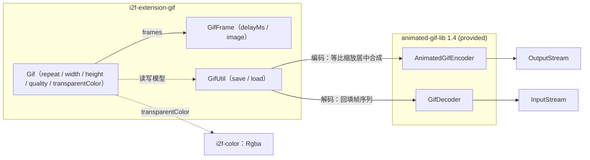

# i2f-extension-gif

> 极简 GIF 动图编解码工具：`Gif`/`GifFrame` 数据模型 + `GifUtil` 静态门面（封装 `animated-gif-lib`，provided）；`save` 将帧序列等比缩放居中合成到统一画布（`i2f-color` 的 `Rgba` 颜色键透明底）后编码为 GIF，`load` 将 GIF 解码回帧序列（含帧延迟与循环次数）。

## 模块路径

- `i2f-extension/i2f-extension-gif/pom.xml`
- 相对于仓库根目录：`i2f-extension/i2f-extension-gif`

## 模块依赖

### 内部依赖（compile）

| Maven 坐标 | scope | optional | 说明 |
|-----------|-------|----------|------|
| `i2f.turbo:i2f-io-file:1.0-jdk8` | compile | false | 注：三个源文件均未 `import` `i2f.io.file.*`，属声明冗余（见瑕疵第 10 条）；作为 compile 依赖仍会向使用方传递其上游工具包 |
| `i2f.turbo:i2f-color:1.0-jdk8` | compile | false | 颜色模型 `Rgba`：`Gif.transparentColor` 默认 `Rgba.rgba(1, 0, 1, 255)`，`save` 时经 `argb()`（`0xAARRGGBB`）转为带 alpha 的 AWT `Color` 作为编码器透明色 |

### 三方依赖

| Maven 坐标 | 版本 | scope | optional | 说明 |
|-----------|------|-------|----------|------|
| `com.madgag:animated-gif-lib` | 1.4（硬编码于本模块 POM L33，未纳入根 POM `dependencyManagement` 统一管理） | provided | false | GIF 动画编解码库：`com.madgag.gif.fmsware.AnimatedGifEncoder`（编码）与 `GifDecoder`（解码）；provided 声明，编包不含编解码库，运行期需使用方自备 |
| `org.projectlombok:lombok` | 1.18.44（根 POM `lombok.version` 管理） | provided | true | 继承根 POM `dependencyManagement` 的 provided + optional；注：本模块源码未使用任何 Lombok 注解，属冗余声明（见瑕疵第 9 条） |

### 隐式传递依赖

| 传递路径 | 说明 |
|---------|------|
| `i2f-io-file` → `i2f-text` / `i2f-io-stream` / `i2f-array` / `i2f-resources` | `FileUtil` 的上游工具依赖（字符串/流/数组/资源），随 Maven 传递引入（即使本模块未直接使用） |
| `i2f-color` → `i2f-math` | `Rgba` 依赖 `MathUtil`（值域钳制/插值），随 Maven 传递引入 |
| `animated-gif-lib:1.4` | 无 compile/runtime 传递依赖（自包含纯 Java GIF 编解码库）；provided 声明不参与传递，使用方需自行引入 |

## 模块设计

### 包结构

```
i2f.extension.gif
├── Gif.java        -- 动画模型（repeat/width/height/quality/transparentColor/frames，22 行）
├── GifFrame.java   -- 帧模型（delayMs/image，23 行）
└── GifUtil.java    -- 编解码门面（save/load 两静态方法，80 行）
```

### 核心架构



### 设计要点

1. **三层极简结构**：数据模型两件套（`Gif` 动画级 + `GifFrame` 帧级）+ 静态门面（`GifUtil` 全静态、无实例状态）+ 编解码库适配（`AnimatedGifEncoder`/`GifDecoder`）
2. **流式 IO 边界**：只接收/输出 `java.io.InputStream`/`OutputStream`，不持有文件路径；流生命周期由调用方管理（`save`/`load` 均不关闭传入流），可与任意 IO 体系（含 `i2f-io-file` 的文件流）对接
3. **统一画布合成管线**：`save` 对每帧先按 contain 规则等比缩放（等效缩放因子取 `min(width/pwid, height/phei)`）再居中绘制到 `gif.width × gif.height` 的统一画布，各帧原始尺寸不一致也能合成
4. **颜色键透明策略**：画布背景先以「透明键色」填充（默认 `Rgba.rgba(1, 0, 1, 255)` 经 `argb()` 转带 alpha 的 AWT `Color`），再绘制缩放帧；编码器把与键色相等的像素写为 GIF 透明索引——GIF 规范的颜色键（1 位透明）机制
5. **帧级延迟 + 动画级循环**：逐帧 `setDelay(GifFrame.delayMs)`（默认 300ms）；`setRepeat(Gif.repeat)` 一次性设置（默认 0 = 无限循环）
6. **模型与编解码解耦**：`Gif`/`GifFrame` 仅依赖 JDK AWT 与 `Rgba`，不感知编解码库；全部编解码依赖集中在 `GifUtil`
7. **宽松解码失败语义**：`load` 通过 `GifDecoder.read` 状态判别，非 `STATUS_OK` 直接返回 `null`——不抛异常、不区分错误类型

## 模块目的

为项目提供「图像帧序列 ↔ GIF」的最小转换能力：把内存中的 `BufferedImage` 帧序列合成为带统一画布、帧延迟、循环与透明底的 GIF；或把 GIF 解码回帧序列继续处理。作为 i2f-extension 域中的动图编解码补充，与 i2f-jdk 域的静态图像能力（如 `i2f-image-impl` 的图像滤镜）以 `BufferedImage` 为衔接点自由组合。

## 模块功能

1. **GIF 合成**：`GifUtil.save(OutputStream, Gif)`——逐帧等比缩放居中合成统一画布（透明键色底）→ `AnimatedGifEncoder` 编码输出（质量/循环/透明色/帧延迟）
2. **GIF 解析**：`GifUtil.load(InputStream)`——`GifDecoder` 解码为 `Gif` 模型（循环次数、帧尺寸、帧序列含每帧延迟）；解码失败返回 `null`
3. **动画模型**：`Gif`——`repeat`（循环次数，0 = 无限）、`width`/`height`（画布尺寸，默认 480 × 720）、`quality`（编码质量参数，默认 10）、`transparentColor`（透明键色，默认 `Rgba.rgba(1, 0, 1, 255)`）、`frames`（帧列表）
4. **帧模型**：`GifFrame`——`delayMs`（帧延迟毫秒，默认 300）、`image`（`BufferedImage`）；构造器 `GifFrame(image)` / `GifFrame(delayMs, image)`

## 模块主要使用方法

### 1. Maven 引入

```xml
<dependency>
    <groupId>i2f.turbo</groupId>
    <artifactId>i2f-extension-gif</artifactId>
    <version>1.0-jdk8</version>
</dependency>
<!-- 本模块以 provided 声明 animated-gif-lib，运行期需使用方自行提供 -->
<dependency>
    <groupId>com.madgag</groupId>
    <artifactId>animated-gif-lib</artifactId>
    <version>1.4</version>
</dependency>
```

### 2. 典型用法

```java
// 合成：BufferedImage 帧序列 → GIF
Gif gif = new Gif();
gif.width = 480;                            // 画布尺寸（默认 480 × 720）
gif.height = 720;
gif.repeat = 0;                             // 0 = 无限循环
gif.quality = 10;
gif.frames.add(new GifFrame(200, image1));  // 帧延迟 200ms
gif.frames.add(new GifFrame(300, image2));

try (OutputStream os = new FileOutputStream("out.gif")) {
    GifUtil.save(os, gif);                  // 等比缩放居中合成 + 透明底 + 编码
}                                           // 流由调用方管理，save 不关闭流

// 读取：GIF → 帧序列
try (InputStream is = new FileInputStream("out.gif")) {
    Gif loaded = GifUtil.load(is);
    if (loaded != null) {                   // 失败返回 null，注意判空
        System.out.println("loop=" + loaded.repeat
                + ", size=" + loaded.width + "x" + loaded.height
                + ", frames=" + loaded.frames.size());
        for (GifFrame frame : loaded.frames) {
            System.out.println(frame.delayMs + "ms "
                    + frame.image.getWidth() + "x" + frame.image.getHeight());
        }
    }
}
```

### 注意事项

1. **provided 依赖需自备**：使用方必须自行引入 `animated-gif-lib`（1.4+），否则运行期 `NoClassDefFoundError`
2. **统一画布与缩放规则**：所有帧按 contain 规则等比缩放后居中绘制到 `width × height` 画布；画布底为透明键色，缩放不裁剪、不变形
3. **透明为颜色键机制**：默认键色 `Rgba.rgba(1, 0, 1, 255)`（近似黑）；帧内容含相同颜色会被误透明，抗锯齿边缘可能残留键色杂边；如需其他透明色，可自定义 `transparentColor`
4. **`load` 的宽松失败与信息缺失**：失败返回 `null`（无异常、无错误类型）；且不恢复 `quality`/`transparentColor`——round-trip（load → save）场景需自行回填
5. **模型参数自行保证**：`width`/`height` 必须 > 0，`frames` 非空且每帧 `image` 非 null（否则可能抛 `IllegalArgumentException`/`NullPointerException`，见瑕疵第 1、2 条）
6. **非线程安全**：`Gif`/`GifFrame` 为可变共享模型；`GifUtil` 静态方法本身无状态，并发写同一模型需自行同步

## 模块特性总结

1. **极小体量**：3 个源文件共 125 行（`GifUtil` 80 + `GifFrame` 23 + `Gif` 22），零测试、零资源
2. **静态门面 + POJO 模型**：`GifUtil` 两静态方法无实例状态；模型全 public 字段直接赋值
3. **自动统一画布**：contain 等比缩放 + 居中 + 透明底合成，帧尺寸不一致也可用
4. **颜色键透明接入 i2f 颜色体系**：`Rgba` → `argb()` → AWT `Color`（保留 alpha）
5. **帧级延迟 + 动画级循环**：每帧 `delayMs`（默认 300ms）独立；`repeat = 0` 无限循环
6. **provided 编解码库**：`animated-gif-lib` 不随包分发，使用方按需自备版本
7. **纯流式接口**：以 `InputStream`/`OutputStream` 为边界，与任意 IO 体系对接
8. **宽松失败语义**：`load` 失败返回 `null`（不抛异常）

## 模块瑕疵或错误

> 以下为源码静态分析识别的问题或潜在问题（依项目规则不做运行时实证）。

1. **`save` 无空帧/空图校验**：`frames` 为空时直接 `finish()`（无任何防护，输出内容取决于编码器对零帧的处理）；`frame.image` 为 `null` 时 `item.image.getWidth()`（L29）直接 NPE
2. **无尺寸参数校验（除零/退化尺寸）**：`width`/`height` ≤ 0 时，缩放因子 `pwid * 1.0 / gif.width`（L32-33）产生 `Infinity`/负值，缩放尺寸计算退化为 0 或异常值，最终在 `new BufferedImage`（L45，JDK 要求宽高 > 0）处抛 `IllegalArgumentException`；`quality`/`repeat` 同样未校验
3. **`load` 失败返回 `null`**：`status != GifDecoder.STATUS_OK` 直接返回 `null`（L60-62），丢失错误类型（格式错误/流打开失败不可区分），调用方不判空即 NPE
4. **`load` 不恢复透明色与质量**：解码仅回填 `repeat`/`width`/`height`/`frames`（L63-75），`quality` 与 `transparentColor` 保持默认值——若原 GIF 使用其他透明色，load → save 往返后透明色改变（round-trip 非幂等）
5. **透明色键机制的固有局限**：GIF 透明为「颜色键」（1 位透明索引 + 精确颜色匹配）：① 帧内容若含与键色（默认 `(1,0,1)`）精确相等的像素会被一并透明；② `SCALE_SMOOTH` 抗锯齿产生的过渡色与键色不精确相等，透明边界可能残留键色杂边
6. **`Graphics` 未 `dispose`**：`save` 每帧通过 `fmg.getGraphics()`（L46）取图形上下文绘制后未调用 `dispose()`，批量帧编码时属资源释放不规范（由 GC 兜底）
7. **逐帧平滑缩放性能**：每帧独立执行 `getScaledInstance(..., Image.SCALE_SMOOTH)`（L43）——该 API 返回惰性 `Image`（绘制时才执行缩放），且无任何缓存；叠加每帧新建同尺寸 `BufferedImage`（L45），大尺寸、多帧场景 CPU/内存开销显著
8. **模型全公开可变、非线程安全**：`Gif`/`GifFrame` 全部字段 public 且无封装与校验（`frames` 为直接暴露的 `ArrayList`）；`GifUtil` 静态方法本身无状态，但并发修改/传递同一模型无同步保护
9. **lombok 冗余声明**：POM 声明 `org.projectlombok:lombok`（L15-18），源码未使用任何 Lombok 注解
10. **`i2f-io-file` 声明但未使用**：POM 以 compile 声明 `i2f-io-file`（L20-23），但三个源文件均未 import `i2f.io.file.*`（`GifUtil` 仅用 `java.io` 流）——声明冗余，且 compile 传递会让使用方依赖树额外引入 `i2f-text`/`i2f-io-stream`/`i2f-array`/`i2f-resources`
11. **`animated-gif-lib` 版本硬编码**：版本 `1.4` 直接写在模块 POM（L33），未纳入根 POM `dependencyManagement` 统一管理；provided 不传递，使用方版本与模块编译版本不一致时行为可能有差异
12. **零测试**：模块无任何测试类（`src/test` 不存在）

## 相关模块情况

| 模块 | 关系 | 说明 |
|------|------|------|
| `i2f-image-impl`、`i2f-graphics-2d` / `i2f-graphics-3d`（i2f-jdk 域） | 无代码依赖、场景互补 | 同属图像处理域；它们面向单帧 `BufferedImage`（滤镜/绘制），本模块面向多帧 GIF 装订与拆解——可组合为「GIF 拆帧 → 图像处理 → 合成 GIF」链路 |
| `i2f-color` | 直接依赖 | 透明键色使用其 `Rgba`；其文档反向将本模块列为消费方（`i2f-color` readme L103） |
| `i2f-io-file` | POM 声明（未使用） | 本模块未直接使用 `FileUtil`（瑕疵第 10 条）；其文档将本模块列为「POM 声明」消费方（`i2f-io-file` readme L236） |
| `i2f-math` | 间接传递 | 经 `i2f-color → i2f-math`（`Rgba` 的 `MathUtil`）传递；其文档将本模块列为消费方（`i2f-math` readme L218） |

## 消费方情况

| 消费方 | 类型 | 说明 |
|-------|------|------|
| 根 `pom.xml`（L1063-1067） | dependencyManagement | 以 `${i2f.version}` 统一管理本模块版本 |
| `i2f-extension/pom.xml`（L50） | 父 POM 模块注册 | `<modules>` 中注册本模块，参与全仓构建 |
| `i2f-extension-all/pom.xml`（L151-154） | POM 聚合 | 纳入 i2f-extension-all 打包；`animated-gif-lib`（provided）不传递 |
| `bash/backup-jdk8`、`bash/backup-jdk17`、`bash/deploy-jdk8`、`bash/deploy-jdk17` | 预构建产物分发 | `i2f-extension-gif-1.0-jdk8.jar` / `i2f-extension-gif-1.0-jdk17.jar` 随分发包分发 |
| 全仓 Java 源码 | 零引用 | 无其他模块 import `i2f.extension.gif.*`（消费方仅 POM 聚合与分发） |
| `.wiki/docs/module-i2f-extension.md`（L213）、`.wiki/wiki.md`（L160） | 文档引用 | 列入「GIF 处理」/「其他扩展」分类 |
| `.wiki/modules/i2f-jdk/` 的 `i2f-color`（L103）、`i2f-io-file`（L236）、`i2f-math`（L218） | 反向引用 | 分别将本模块列为 `Rgba`、`FileUtil`（POM 声明）、`MathUtil` 的消费方 |
