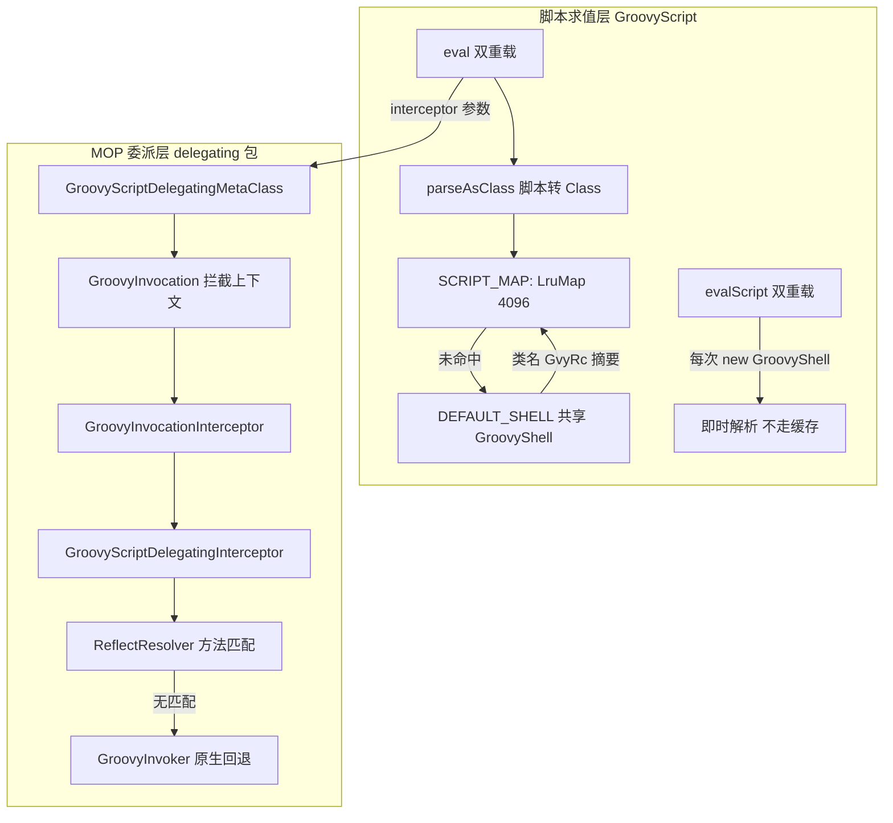

# i2f-extension-groovy

> Groovy 脚本嵌入执行工具：`GroovyScript` 静态门面提供 `evalScript`（即时解析）与 `eval`（`LruMap` 缓存脚本 Class）双轨求值；`delegating` 子包基于 Groovy MOP（`DelegatingMetaClass` + 拦截器链）把脚本中的方法调用路由到宿主 Java 类 / 对象 / `Method` / `IMethod` provider，未匹配时回退 Groovy 原生分发。Apache Groovy 4 以 provided 弱依赖引入。

## 模块路径

- `i2f-extension/i2f-extension-groovy/pom.xml`
- 相对于仓库根目录：`i2f-extension/i2f-extension-groovy`

## 模块依赖

### 内部依赖（compile）

| Maven 坐标 | scope | optional | 说明 |
|-----------|-------|----------|------|
| `i2f.turbo:i2f-lru-map:1.0-jdk8` | compile | false | `LruMap`：`SCRIPT_MAP` 脚本 Class 缓存（容量 4096，`ReentrantLock` 全方法加锁 + `removeEldestEntry` LRU 淘汰） |
| `i2f.turbo:i2f-reflect:1.0-jdk8` | compile | false | `ReflectResolver`：`matchExecMethod` / `matchExecutable`（参数类型距离匹配）、`getInstance`（实例化）、`execMethod`（调用执行），供 `GroovyScriptDelegatingInterceptor` 做 Java 方法路由 |

### 三方依赖

| Maven 坐标 | scope | optional | 说明 |
|-----------|-------|----------|------|
| `org.apache.groovy:groovy:4.0.18` | provided | optional | Groovy 核心（版本在模块 POM 硬编码，根 POM `dependencyManagement` 仅管理本模块自身版本）。提供 `Binding` / `GroovyShell` / `Script` / `InvokerHelper` / `DelegatingMetaClass` / `MetaClass` |
| `org.projectlombok:lombok`（无版本声明） | provided | optional | 继承根 POM 管理（1.18.44）。真实使用：`GroovyInvocation` `@Data` + `@NoArgsConstructor`、`GroovyScriptDelegatingInterceptor` `@Data` + `@NoArgsConstructor`、`GroovyScriptDelegatingMetaClass` `@Getter` + `@Setter` |

### 传递依赖（源码直接使用但 POM 未声明）

| Maven 坐标 | 传递路径 | 说明 |
|-----------|---------|------|
| `i2f.turbo:i2f-invokable:1.0-jdk8` | 经 `i2f-reflect` compile | `IMethod` / `JdkMethod` 方法抽象，`GroovyScriptDelegatingInterceptor` 直接 `import` 使用（四类 provider 中的两类） |

其余传递（`i2f-convert`、`i2f-typeof` 经 `i2f-reflect`；`i2f-clock-impl`、`i2f-cache-std` 经 `i2f-lru-map`）本模块源码未直接引用。

## 模块设计

### 包结构

```
i2f.extension.groovy
├── GroovyScript.java               # 静态门面：双轨求值 + 脚本 Class 缓存 + SHA-1 类名稳定化
└── delegating                      # Groovy MOP 委派框架（2026/4 新增）
    ├── GroovyInvocation.java       # 拦截上下文：type / instance / method / args + Type 四态枚举
    ├── GroovyInvocationInterceptor.java  # 拦截器接口：proceed(invocation, invoker)
    ├── GroovyInvoker.java          # 回退执行器接口：invoke(invocation) —— 原生 MOP 语义的闭包封装
    ├── GroovyScriptDelegatingInterceptor.java # 默认拦截器：四类 provider 方法路由
    └── GroovyScriptDelegatingMetaClass.java   # DelegatingMetaClass 扩展：五路 MOP 钩子统一转拦截器
```

### 核心架构



### 设计要点

1. **双轨求值 API**：`evalScript` 系列每次 `new GroovyShell` 即时解析（一次性脚本语义）；`eval` 系列经 `parseAsClass` 走 `SCRIPT_MAP`（4096 容量 LRU）复用已编译 Class，再由 `InvokerHelper.createScript` 绑定新 `Binding` 实例化执行——同文本只编译一次，多上下文隔离执行。
2. **类名稳定化**：脚本类名固定为 `"GvyRc" + SHA-1(脚本文本)`（`getTextDigest`），同文本同名类，支撑缓存命中与堆栈可读性；`NoSuchAlgorithmException` 时退化 UUID。
3. **MOP 拦截模型**：`GroovyScriptDelegatingMetaClass` 覆盖 `invokeMissingMethod` / `invokeMethod`（三重载）/ `invokeStaticMethod` 五路 MOP 入口，统一转成 `GroovyInvocation`（type / instance / method / args）交拦截器；`interceptor == null` 时直接透传 `super` 保持原生行为。
4. **责任链回退**：拦截器签名 `proceed(invocation, invoker)`——`GroovyInvoker` 是「原生 MOP 调用」的闭包封装，拦截器决定是否放行回退，形成 AOP 式环绕语义。
5. **默认路由拦截器**：`GroovyScriptDelegatingInterceptor` 按序遍历 `CopyOnWriteArrayList<Object>` providers，支持四类形态：`IMethod`（方法抽象）、`Method`（JDK 反射方法）、`Class`（按方法名匹配后静态调用或反射实例化调用）、任意实例对象（在其类上匹配方法）；全部未匹配则回退 `invoker.invoke` 走 Groovy 原生分发。
6. **方法匹配**：`Class` / 实例 provider 经 `ReflectResolver.matchExecMethod(clazz, methodName, args)` 按「方法名 + 参数类型距离」挑选最合适重载（含 varargs 打包），比 Groovy 原生 `methodMissing` 更精细。
7. **预热支持**：`parseAsClass` 独立暴露——消费方可在业务流量前预编译脚本填充缓存（如 xproc4j 的 `ScriptPreloadEventListener`）。

## 模块目的

为 Java 应用提供零框架的 Groovy 脚本嵌入能力：

1. **动态逻辑外置**：规则计算、表达式求值、动态编排等场景把易变逻辑放进脚本文本，避免重新编译发版。
2. **重复执行性能**：规则引擎型脚本往往同一文本高频执行，`eval` 的 Class 级 LRU 缓存把编译成本摊销为一次。
3. **脚本调用宿主能力**：纯 Groovy 脚本难以触达宿主 Java 对象；`delegating` 框架让脚本以「直接调用方法」的语法透明路由到宿主 provider，弥合脚本 / Java 边界。
4. **统一脚本门面**：与 `i2f-extension-ognl`、`i2f-extension-antlr4-*`（tinyscript/funic）等共同构成 xproc4j 的多语言求值层，本模块承接 Groovy 语言位。

## 模块功能

1. **即时求值**：`evalScript(script, params)` —— 每次全新 `GroovyShell` 解析执行，适合一次性脚本。
2. **拦截求值**：`evalScript(script, params, interceptor)` —— 即时解析 + `MetaClass` 包装，脚本内方法调用全部过拦截器。
3. **缓存求值**：`eval(script, params)` —— `SCRIPT_MAP` 命中 Class 后 `createScript` 新实例执行。
4. **缓存拦截求值**：`eval(script, params, interceptor)` —— 缓存 + `MetaClass` 包装组合。
5. **脚本转 Class**：`parseAsClass(script)` —— 暴露缓存内核，支持预热与独立持有脚本类。
6. **文本摘要**：`getTextDigest(text)` —— SHA-1 十六进制摘要（含 UUID 兜底），供类名生成。
7. **MOP 委派**：`delegating` 包五件套（上下文 / 拦截器 / 回退执行器 / 默认路由拦截器 / 委派 MetaClass），把 Groovy 方法调用路由到 Java provider。

## 模块主要使用方法

### Maven 引入

```xml
<dependency>
    <groupId>i2f.turbo</groupId>
    <artifactId>i2f-extension-groovy</artifactId>
    <version>1.0-jdk8</version>
</dependency>
<!-- groovy 为 provided + optional，使用方需自带 -->
<dependency>
    <groupId>org.apache.groovy</groupId>
    <artifactId>groovy</artifactId>
    <version>4.0.18</version>
</dependency>
```

### 基本求值

```java
Map<String, Object> params = new HashMap<>();
params.put("a", 1);
params.put("b", 2.5);

// 即时求值：每次重新解析（一次性脚本）
Object r1 = GroovyScript.evalScript("params.a + params.b", params);

// 缓存求值：相同脚本文本仅编译一次（规则型高频脚本）
Object r2 = GroovyScript.eval("params.a + params.b", params);

// 预热：业务流量前预编译填充缓存
GroovyScript.parseAsClass("params.a + params.b");
```

### MOP 委派：脚本调用宿主 Java 对象

```java
public class StringUtil {
    public String upperCase(String text) {
        return text == null ? "" : text.toUpperCase();
    }
}

// 实例对象作为 provider：脚本中直接「调用方法」即路由到 StringUtil
GroovyInvocationInterceptor interceptor =
        new GroovyScriptDelegatingInterceptor(new StringUtil());

Object r3 = GroovyScript.eval(
        "upperCase('hello') + '!'",
        new HashMap<>(),
        interceptor);

// Class 作为 provider：匹配静态方法直接调用，匹配实例方法则反射实例化后调用
Object r4 = GroovyScript.eval(
        "toUpperCase('abc')",
        new HashMap<>(),
        new GroovyScriptDelegatingInterceptor(String.class));
```

### 自定义拦截器（环绕语义）

```java
// invoker 是原生 MOP 的闭包封装，可选择性放行
GroovyInvocationInterceptor timed = (invocation, invoker) -> {
    long begin = System.currentTimeMillis();
    try {
        return invoker.invoke(invocation);   // 回退原生
    } finally {
        System.out.println(invocation.getMethod() + " cost "
                + (System.currentTimeMillis() - begin) + "ms");
    }
};
```

### 注意事项

1. groovy 依赖为 provided + optional——使用方必须自带 Groovy 4 运行时，否则 `NoClassDefFoundError`。
2. `evalScript`（无缓存）与 `eval`（缓存）双轨并存：高频重复脚本文本务必用 `eval`，否则每次编译开销显著。
3. `SCRIPT_MAP` 容量固定 4096、按插入序淘汰——超容量后旧脚本 Class 被逐出，再次执行会重新编译。
4. 缓存键为脚本文本全文——超大脚本会放大内存占用（见瑕疵第 8 条）。
5. `delegating` 路由仅拦截「方法调用」路径；属性访问、运算符等仍走 Groovy 原生 MOP。
6. 拦截器实例可跨脚本复用（providers 为 `CopyOnWriteArrayList`），但自定义拦截器需自行保证线程安全。

## 模块特性总结

1. **双轨 API**：即时（`evalScript`）与缓存（`eval`）求值并存，覆盖一次性与规则型两类负载。
2. **Class 级缓存**：`LruMap` 4096 容量、线程安全（`ReentrantLock` 全方法加锁）、按插入序 LRU 淘汰。
3. **稳定类名**：`GvyRc` + SHA-1 摘要，同文本同名类，异常堆栈可读。
4. **零实例静态门面**：`GroovyScript` 全静态方法，无状态共享（除共享 `DEFAULT_SHELL` 与缓存）。
5. **五路 MOP 钩子**：`invokeMissingMethod` / `invokeMethod`×3 / `invokeStaticMethod` 统一收口为拦截器上下文。
6. **四类 provider 路由**：`IMethod` / `Method` / `Class` / 实例对象，按序遍历首个匹配即命中。
7. **原生回退**：未匹配一律回退 Groovy 原生分发，委派不破坏脚本既有语义。
8. **弱依赖设计**：groovy provided + optional，模块自身只编译不捆绑运行时。

## 模块瑕疵或错误

> 以下为源码静态分析识别的问题或潜在问题（依项目规则不做运行时实证，后续如有需要再实证补充）：

1. **`invokeMethod` 实例重载丢失 receiver**（`GroovyScriptDelegatingMetaClass` L67-83、L86-102）：`new GroovyInvocation(Type.invokeMethod, null, methodName, args)` 将 instance 置 `null` 而非方法参数 `object`；且回退闭包 `super.invokeMethod(e.getInstance(), ...)` 读取的是 invocation 的 `null`——带实例的 `invokeMethod` 路径 receiver 丢失，回退调用以 `null` 实例进行（对比 `invokeMissingMethod` L28-45 正确传递、`invokeStaticMethod` L104-121 传递 object）。
2. **`IMethod` / `Method` provider 匹配忽略方法名**（`GroovyScriptDelegatingInterceptor` L42-56）：`matchExecMethod(singletonList(method), args)` / `matchExecutable(singletonList(method), args)` 仅按参数类型匹配、不校验 `methodName`——脚本调用任意名字的方法只要参数兼容即被错误路由到该 provider（`Class` / 实例分支 L57-75 才用方法名参与匹配）。
3. **`Class` provider 自动实例化语义隐式**（L83-87）：匹配到实例方法且无实例时 `ReflectResolver.getInstance(callClass)` 反射构造——要求 public 无参构造器，构造失败异常语义未在 API 契约中说明。
4. **provider 含 null 元素 NPE**（L41-76）：`else` 分支 `provider.getClass()` 对 null 直接 NPE，未做元素校验。
5. **Error 被包装为 `IllegalStateException`**（`GroovyScriptDelegatingMetaClass` 五处 catch）：仅 `RuntimeException` 原样抛出，`OutOfMemoryError` / `StackOverflowError` 等错误语义被吞入运行时异常。
6. **缓存填充非原子**（`GroovyScript` L65-71）：`get` 判空 → 编译 → `put` 序列无锁，并发首次执行同一脚本会重复编译（`LruMap` 自身线程安全，但此模式非 `computeIfAbsent`）。
7. **LRU 淘汰后重复编译的类堆积风险**（L40 + L69-70）：淘汰后再遇同文本会重新 `parseClass`——GroovyClassLoader 每次解析经内部子加载器重新定义类，旧 Class 及其 Groovy MetaClass 注册存在元数据堆积的潜在 Metaspace 压力。
8. **缓存键为脚本文本全文**（L65 / L70）：文本同时作为 Map 键与编译源码双份持有，大脚本内存放大。
9. **`getTextDigest` 平台默认字符集**（L78）：`text.getBytes()` 未指定字符集——跨平台（GBK / UTF-8）对含非 ASCII 字符的脚本摘要不一致，导致同名文本类名不稳定、缓存跨平台失效。
10. **`parseAsClass(null)` 返回 null 未快速失败**（L60-62）：`eval(null, ...)` 延迟到 `createScript(null, binding)` 深层 NPE，错误定位困难。
11. **摘要兜底 UUID 不稳定**（L82-84）：`NoSuchAlgorithmException` 理论分支退化 UUID——若触发则同文本每次类名不同，缓存永远不命中。
12. **`DEFAULT_SHELL` 全局共享单例**（L39）：静态共享 `GroovyShell` 及其 ClassLoader，并发 `parseClass` 的线程安全性完全依赖 Groovy 内部实现，模块层未做防护。
13. **groovy 三方版本硬编码**（pom L34）：`4.0.18` 写死于模块 POM，根 POM `dependencyManagement` 不覆盖，与 `i2f-jdbc-procedure-idea-plugin` 的 Gradle 声明（`build.gradle.kts` L36 同版本）仅靠人工同步。
14. **零测试**：无 `src/test`，`delegating` 拦截链与缓存行为均无自动化验证。

## 消费方情况

| 消费方 | 依赖方式 | 用法 |
|--------|---------|------|
| `i2f-extension-xproc4j` | POM L33 依赖 | `<lang-eval-groovy>` 节点经 `GroovyScript.eval` 缓存求值（`LangEvalGroovyNode` L71，import 前置抽取 + `def exec(executor, params)` 包装）；`ScriptPreloadEventListener` L128/L170 以 `parseAsClass` 预热脚本；`LangEvalJavaNode` L149 向动态编译的 Java 源码注入 `import i2f.extension.groovy.GroovyScript` 实现脚本互操作 |
| `i2f-springboot-ops-starter` | POM L101 依赖 | `AppEvalOpsController` L100 `/app/eval` 在线求值端点（`GroovyScript.eval` + `@ConditionalOnClass(GroovyShell.class)` 条件装配）；`GroovyTools` L72 以 `evalScript` 实现 AI 工具的 Groovy 脚本执行 |
| `i2f-jdbc-procedure-idea-plugin`（Gradle 项目） | `build.gradle.kts` L36 直依赖 groovy 4.0.18 | `GroovyTestAction` L253/L275：`parseAsClass` 语法校验 + `evalScript` 执行预览（IDEA 插件动作） |
| `i2f-extension-all` | POM L155-158 聚合 | 全量聚合分发 |
| 根 POM | L1068-1072 | `dependencyManagement` 统一 `${i2f.version}` |
| `bash` 分发产物 | backup / deploy 四目录 | `i2f-extension-groovy-1.0-jdk8.jar` / `-jdk17.jar` 各 1 份 |
| wiki 文档 | 4 处 | `wiki.md` L152（脚本行）、`docs/module-i2f-extension.md` L143、`docs/ops-starter.md` L43、`docs/xproc4j-framework.md` L70 |
