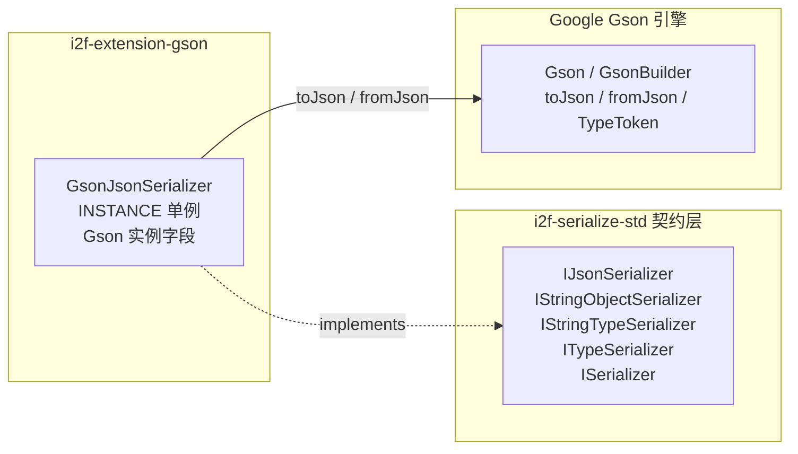

# i2f-extension-gson

> **基于 Google Gson（`com.google.code.gson:gson:2.10.1`，provided）的 `IJsonSerializer` 契约适配器**（1 源文件 82 行、单类 `GsonJsonSerializer`、零测试零资源）：把 Gson 的 `toJson`/`fromJson` 装配为 `i2f-serialize-std` 的 JSON 序列化契约实现，支持 `Class`/`Type`/`TypeToken` 类型化反序列化分派与 `bean2Map`/`deserializeAsMap` 覆写；区别于无状态的 fastjson 适配器，本类持有 `Gson` 实例字段——默认构造固化 `yyyy-MM-dd HH:mm:ss SSS` 日期格式，亦提供注入构造器携带使用方自备的定制 `Gson`。与兄弟模块 `i2f-extension-fastjson`/`i2f-extension-fastjson2`（及 `i2f-extension-jackson`）构成同一契约的多套可替换实现，本模块面向 Gson 生态。

## 模块路径

- `i2f-extension/i2f-extension-gson/pom.xml`
- 相对于仓库根目录：`i2f-extension/i2f-extension-gson`

## 模块依赖

### 内部依赖（compile）

| Maven 坐标 | scope | optional | 说明 |
|-----------|-------|----------|------|
| `i2f.turbo:i2f-serialize-std:1.0-jdk8` | compile | false | 序列化标准契约层（`IJsonSerializer` 定义 `serialize`/`deserialize` 类型化重载与 `bean2Map`/`deserializeAsMap` 语义） |

### 三方依赖

| Maven 坐标 | 版本 | scope | optional | 说明 |
|-----------|-------|-------|----------|------|
| `com.google.code.gson:gson` | 2.10.1 | provided | false | Google Gson 编解码引擎，POM 内硬编码版本（未纳入根 POM `dependencyManagement` 统一管理）；provided 声明，运行期由使用方自备；Gson 自身为零依赖库（compile 级无任何三方传递） |
| `org.projectlombok:lombok` | 1.18.44（根 POM 管理） | provided | true | 继承根 POM `dependencyManagement` 的 provided + optional；本模块源码实际未使用任何 lombok 注解（冗余声明） |

### 隐式传递依赖

| 传递路径 | 说明 |
|---------|------|
| `i2f-serialize-std` → `i2f-codec-std` | 契约根接口 `ISerializer<E,D>` 继承 `ICodec<E,D>` 并桥接 `encode`/`decode` |

## 模块设计

### 包结构

```
i2f.extension.gson
└── GsonJsonSerializer.java   -- 契约适配器（serialize / deserialize ×4 / bean2Map / deserializeAsMap + 双构造器 + INSTANCE 单例，82 行）
```

### 契约继承链

```
IJsonSerializer
  └── IStringObjectSerializer
        └── IStringTypeSerializer<Object>
              └── ITypeSerializer<String, Object>
                    └── ISerializer<String, Object>
                          └── ICodec<String, Object>
```

### 核心架构



### 设计要点

1. **单一职责的契约适配器**：全模块仅 1 个类 82 行，不做任何业务加工，只把 Gson 实例的 `toJson`/`fromJson` 映射到契约方法；库耦合点集中在一处，替换实现零成本
2. **有状态实例 + 双构造器形态**（区别于无状态的 fastjson/fastjson2 适配器）：默认构造器经 `GsonBuilder().setDateFormat("yyyy-MM-dd HH:mm:ss SSS")` 固化日期格式；注入构造器 `GsonJsonSerializer(Gson)` 允许使用方携带自备定制 `Gson`（如开启 `serializeNulls`、调整字段策略、注册自定义适配器），定制能力完全开放
3. **契约默认能力继承**：继承链自带 `map2Bean`（序列化 → 按类反序列化往返）、`encode`/`decode`（codec 桥接）、`asBytesSerializer()`（String ↔ byte[] 双向适配，默认 UTF-8）等默认方法，本类只需覆写 6 个契约方法（`serialize`、`deserialize` ×3、`bean2Map`、`deserializeAsMap`）
4. **双路类型令牌分派**：`deserialize(String, Object typeToken)` 按 `instanceof` 分派到 `java.lang.reflect.Type` 或 Gson 原生 `TypeToken`（Gson 的 `TypeToken` 是独立抽象类、并非 `java.lang.reflect.Type` 子类，分派无歧义）；另提供 `deserialize(String, Type)` 与泛型方法 `deserialize(String, TypeToken<T>)`（返回泛型 `T`）两个公开重载，便于强类型调用方直接获得泛型返回
5. **线程安全的实例复用**：Gson 官方设计为线程安全，单实例可并发复用；本类 `gson` 字段构造后无修改入口（无 setter），实际不可变；`INSTANCE` 提供进程级共享单例
6. **provided 依赖策略**：Gson 仅为编译期依赖，编包不含引擎；使用方按自身版本诉求引入，与全仓「契约稳定、实现可换」原则一致
7. **`bean2Map`/`deserializeAsMap` 的 TypeToken 往返**：两者均以 `new TypeToken<Map<String, Object>>() {}` 匿名子类捕获泛型目标类型，经一次 `fromJson` 解析为 `LinkedTreeMap`，实现 bean/map 与文本/map 的互转

## 模块目的

为以 Gson 为 JSON 生态的项目提供「零改造接入 i2f 序列化契约」的适配实现：一方面把 Gson 的成熟 API 纳入 `IJsonSerializer` 契约，使 i2f 各栈中按契约消费 JSON 能力的组件（AI 栈 `IJsonSerializer` 注入、HTTP 网络栈 processor 参数、MCP 工具参数 `deserializeAsMap` 等）可以直接切换/注入 Gson 实现；另一方面通过 provided 声明与注入构造器，避免对使用方的 JSON 库选型与 Gson 配置产生强制绑定。

## 模块功能

1. **JSON 序列化**：`serialize(Object) → String`（`gson.toJson`；`null` 输入输出字面量 `"null"`）
2. **无类型反序列化**：`deserialize(String) → Object`（`fromJson(enc, Object.class)`，返回 Gson 原生模型 `LinkedTreeMap`/`ArrayList`/标量）
3. **类型化反序列化（Class）**：`deserialize(text, Class<?>)`（`fromJson(text, clazz)`）
4. **泛型类型化反序列化（Type / TypeToken）**：泛型方法 `deserialize(text, TypeToken<T>)` 与 `deserialize(text, Type)`（返回泛型 `T`）
5. **契约动态分派入口**：`deserialize(text, Object typeToken)` 按运行期类型双路分派（`Type` 在前、`TypeToken` 在后），无法识别时抛 `UnsupportedOperationException`
6. **bean ↔ map 转换**：`bean2Map(Object)`、`deserializeAsMap(String)` 覆写实现 + 继承默认 `map2Bean(Map, Class)`
7. **通道互转**：继承 `asBytesSerializer()`（String ↔ byte[] 适配器，默认 UTF-8）与 `encode`/`decode` codec 桥接
8. **单例共享与定制注入**：`GsonJsonSerializer.INSTANCE` 单例；`new GsonJsonSerializer(gson)` 携带自备定制引擎

## 模块主要使用方法

### 1. Maven 引入

```xml
<dependency>
    <groupId>i2f.turbo</groupId>
    <artifactId>i2f-extension-gson</artifactId>
    <version>1.0-jdk8</version>
</dependency>
<!-- 本模块以 provided 声明 gson，运行期需使用方自行提供（版本可自选） -->
<dependency>
    <groupId>com.google.code.gson</groupId>
    <artifactId>gson</artifactId>
    <version>2.10.1</version>
</dependency>
```

### 2. 基础序列化 / 反序列化

```java
IJsonSerializer json = GsonJsonSerializer.INSTANCE;

// 序列化（日期字段按 yyyy-MM-dd HH:mm:ss SSS 格式输出）
String text = json.serialize(user);            // {"name":"admin",...}

// 无类型反序列化 → Gson 原生模型（LinkedTreeMap/ArrayList）
Object obj = json.deserialize(text);

// 类型化反序列化（Class）
User user = (User) json.deserialize(text, User.class);
```

### 3. 泛型类型化反序列化（TypeToken / Type）

```java
// 推荐：TypeToken 匿名子类，直接获得泛型返回
List<User> users = GsonJsonSerializer.INSTANCE.deserialize(
        listText, new TypeToken<List<User>>() {});

// 或先取得 java.lang.reflect.Type（如字段/方法签名中的泛型），再调用泛型重载
Type type = new TypeToken<List<User>>() {}.getType();
List<User> users2 = GsonJsonSerializer.INSTANCE.deserialize(listText, type);
```

> 注意：泛型推断依赖静态类型为 `GsonJsonSerializer`；经由 `IJsonSerializer` 接口引用调用时只会命中契约方法 `deserialize(String, Object)`，返回 `Object`。

### 4. bean ↔ map 转换

```java
// bean → map（依赖对象序列化为 JSON 对象）
Map<String, Object> map = json.bean2Map(user);

// map → bean（契约默认实现：序列化 → 按类反序列化往返）
User back = json.map2Bean(map, User.class);

// 文本 → map
Map<String, Object> m = json.deserializeAsMap(text);
```

### 5. 注入自备 Gson 定制

```java
// 携带定制引擎：开启 null 字段序列化、关闭 HTML 转义等
Gson custom = new GsonBuilder()
        .setDateFormat("yyyy-MM-dd HH:mm:ss")
        .serializeNulls()
        .disableHtmlEscaping()
        .create();
IJsonSerializer json = new GsonJsonSerializer(custom);
```

### 6. 作为契约实现注入使用

```java
// 任何持有 IJsonSerializer 契约引用的组件均可注入本实现（示意）
IJsonSerializer json = GsonJsonSerializer.INSTANCE;
component.setJsonSerializer(json);
```

### 注意事项

1. **provided 依赖需自备**：使用方必须自行引入 Gson（2.10.x 或自选版本），否则运行期 `NoClassDefFoundError`
2. **异常为 Gson 原生异常**：抛出的是 `JsonSyntaxException`/`JsonIOException` 等原生异常，而非契约异常 `JsonSerializeException`
3. **`bean2Map`/`deserializeAsMap` 仅适用 JSON 对象**：对象若序列化为数组/标量（List、数组、String、数字），`fromJson` 会抛 `JsonSyntaxException`；`null` 输入则经 `"null"` 字符串往返后静默返回 `null`
4. **默认日期格式非常规**：默认构造固化的 `yyyy-MM-dd HH:mm:ss SSS` 中秒与毫秒之间带空格（输出形如 `2026-09-14 10:00:00 123`），与其他 JSON 库常见的 ISO-8601 / 无空格毫秒格式互操作时需注意对齐（或经注入构造器自定格式）
5. **Gson 默认语义随引擎传入**：默认省略 `null` 字段（`bean2Map` 得到的 map 缺失值为 null 的键）、默认开启 HTML 转义（`&` 输出为 `\u0026`）等——契约消费方需知悉这些引擎级默认行为
6. **静态字段 `dateFormatPatten` 不影响单例**：`INSTANCE` 初始化时已固化默认格式，运行期修改该静态字段仅对之后 `new` 的实例生效（见瑕疵第 4 条）

## 模块特性总结

1. **极简适配**：82 行单类完成一个 JSON 引擎的契约接入，二次实现/替换成本极低
2. **零强绑定**：provided 依赖 + 运行期自备，使用方可自由选择 Gson 版本
3. **可定制注入**：区别于无状态适配器，双构造器形态开放 `GsonBuilder` 全量配置能力
4. **双路类型化反序列化**：Class / Type / TypeToken 覆盖常规 bean、复杂泛型与运行时泛型场景
5. **契约默认能力齐全**：`map2Bean`、`encode`/`decode`、`asBytesSerializer()` 开箱即用
6. **线程安全复用**：Gson 线程安全 + 实例字段构造后不可变，`INSTANCE` 可进程级共享
7. **多实现可替换**：与 fastjson/fastjson2/jackson 模块共享同一契约，按生态选择即可
8. **Gson 零依赖**：引擎自身无任何 compile 级三方传递，依赖树干净

## 模块瑕疵或错误

> 以下为源码静态分析识别的问题或潜在问题（依项目规则不做运行时实证）。

1. **lombok 声明未使用**：pom 声明 `org.projectlombok:lombok`，但唯一源文件未使用任何 lombok 注解，属冗余声明（与全仓多个模块同类问题）
2. **异常未桥接契约异常族**：`serialize`/`deserialize` 直接抛出 Gson 原生 `JsonSyntaxException`/`JsonIOException`，而非契约层 `JsonSerializeException`（继承 `SerializeException`）；按契约捕获异常的使用方会漏接，异常防线失效
3. **不支持类型的异常语义弱**：`deserialize(text, Object)` 对无法识别的 typeToken 抛 JDK 原生 `UnsupportedOperationException("Gson un-support parseText.")`（L59-66）——消息措辞（parseText）与真实语义（typeToken 类型不受支持）不符，且同为契约外异常
4. **`dateFormatPatten` 的三重问题**（L17）：① 字段名拼写错误（`Patten` → `Pattern`）；② `public static` 可变全局状态；③ 构造固化语义割裂——`INSTANCE`（L18）初始化时已读取该字段构建 Gson，运行期修改静态字段对 `INSTANCE` 完全无效、仅影响之后 `new` 的实例，「改了配置却不生效」极具误导性；且默认格式毫秒前置空格非常规（见注意事项第 4 条）
5. **`bean2Map`/`deserializeAsMap` 假设 JSON 为对象**：实现为先序列化再按 `TypeToken<Map<String, Object>>` 解析（L37-41 / L77-80）；对象序列化为数组或标量时 `fromJson` 抛 `JsonSyntaxException`；`null` 输入经 `"null"` 字符串往返后静默返回 `null`
6. **双次编解码开销**：`bean2Map` 内部先 `serialize` 再 `deserialize` 两次编解码（继承的 `map2Bean` 默认实现同样「序列化 → 反序列化」往返），且每次调用新建匿名 `TypeToken` 子类实例；高频路径存在不必要开销
7. **`INSTANCE` 为非 final 公共可变静态字段**（L18）：任意代码可重新赋值替换全局单例（`gson` 字段本身无 setter、Gson 线程安全，实例并发使用安全），但单例引用可被替换破坏全局一致性；建议 `public static final`
8. **重载 null 歧义与分派隐式依赖**：`deserialize` 存在 (String, Class)/(String, Object)/(String, Type)/(String, TypeToken) 四个同名重载，直接以 `null` 字面量调用会编译歧义；契约入口 `(String, Object)` 完全依赖运行期 `instanceof` 校验（当前 Gson 的 `TypeToken` 不实现 `java.lang.reflect.Type`，分派顺序恰好正确，但属对 Gson 类结构的隐式依赖）
9. **Gson 引擎默认语义未做契约对齐**：默认 `serializeNulls` 关闭（`null` 字段整体省略——`bean2Map` 产出的 map 缺键，与「字段存在但值为 null」的 map 语义不等价）、默认 `htmlSafe` 开启（`&`、`<` 等输出为 `\u0026` 等 Unicode 转义）、数字类型按 `double` 宽化（无类型反序列化时整数变为 `Double`）等引擎级行为直接传入契约，跨实现互换（fastjson/Jackson/Json2）时语义有差异
10. **版本硬编码且相对陈旧**：`gson:2.10.1`（2023 年初发布）在 POM 内硬编码、未纳入根 POM `dependencyManagement` 统一管理；Gson 后续版本（2.11+）包含缺陷修复与行为改进，生产使用建议评估升级并回归
11. **零测试**：模块无任何测试类，类型分派、`bean2Map` 数组/null 边界、泛型解析、日期格式往返等行为均无回归保障

## 姊妹模块对比（同契约 JSON 适配族）

| 对比项 | `i2f-extension-gson`（本模块） | `i2f-extension-fastjson` | `i2f-extension-fastjson2` |
|-------|-------------------------------|--------------------------|---------------------------|
| API 包 | `com.google.code.gson`（Google 原生） | `com.alibaba.fastjson`（1.x 兼容 API） | `com.alibaba.fastjson2`（原生 API） |
| 引擎依赖 | `gson:2.10.1` provided | `com.alibaba:fastjson:2.0.26` provided | `fastjson2:2.0.34` provided |
| 实现类 | `GsonJsonSerializer`（82 行，有状态：Gson 实例字段） | `FastJsonSerializer`（63 行，无状态） | `FastJson2Serializer`（63 行，无状态） |
| 定制能力 | 注入构造器开放 `GsonBuilder` 全量配置 | 无（仅 INSTANCE） | 无（仅 INSTANCE） |
| 默认日期格式 | `yyyy-MM-dd HH:mm:ss SSS`（固化） | 引擎默认 | 引擎默认 |
| 类型令牌 | `Type` / `TypeToken` | `Type` / `TypeReference` | `Type` / `TypeReference` |
| 适用场景 | Gson 生态、需深度定制 Gson 配置 | 存量 fastjson1 生态 | 新项目推荐 |

> 另有 `i2f-extension-jackson`（Jackson 多格式适配）与 `i2f-jdk/i2f-serialize-impl` 的自研 `Json2Serializer`（全仓默认引擎，零三方依赖）同属该契约家族。

## 消费方情况

| 消费方 | 类型 | 说明 |
|-------|------|------|
| `i2f-extension/pom.xml`（L52） | 父 POM 模块注册 | `<modules>` 中注册本模块，参与全仓构建 |
| 根 `pom.xml`（L1073-1077） | dependencyManagement | 以 `${i2f.version}` 统一管理本模块版本 |
| `i2f-extension-all/pom.xml`（L159-162） | POM 聚合 | 纳入 i2f-extension-all fat-jar 分发包；gson（provided）不传递打包，运行期需使用方自备 |
| `bash/backup-jdk8`、`bash/backup-jdk17`、`bash/deploy-jdk8`、`bash/deploy-jdk17` | 预构建产物分发 | `i2f-extension-gson-1.0-jdk8.jar` / `-1.0-jdk17.jar` 随分发包分发 |
| 全仓 Java 源码 | 零代码级引用 | `GsonJsonSerializer` 无任何外部 import（仅模块内自引用），作为契约实现供使用方按需选用 |
| `.wiki/wiki.md`（L137）、`.wiki/docs/module-i2f-extension.md`（L21） | 文档引用 | 被列为 JSON 处理分类的 Gson 封装成员 |
