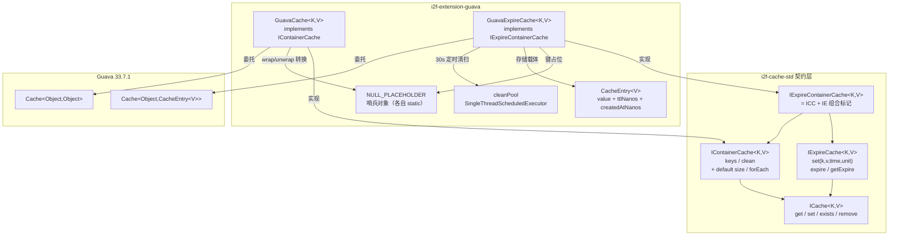

# i2f-extension-guava

> 基于 Google Guava 33.7.1 的本地缓存适配扩展：`GuavaCache` 落地 `IContainerCache`（有界容量淘汰 + null 占位 + keys/clean），`GuavaExpireCache` 落地 `IExpireContainerCache`（容器 + per-entry TTL）——因 Guava 无 Caffeine 式 `Expiry` 接口，改用「自管守护线程周期清扫 + 读时 `compute` 惰性判定」模拟逐条过期；Guava 以 provided 引入，源码注释明示「建议以 caffeine 代替此实现」。

## 模块路径

- `i2f-extension/i2f-extension-guava`

## 模块依赖

| 依赖 | Maven 坐标 | scope | 说明 |
|------|-----------|-------|------|
| i2f-cache-std | `i2f.turbo:i2f-cache-std` | compile | 提供 `IContainerCache<K,V>`（容器）与 `IExpireContainerCache<K,V>`（容器+过期组合）契约接口 |
| Guava | `com.google.guava:guava:33.7.1-jre` | provided | 本地缓存引擎（`CacheBuilder`/`Cache`；jre 版为 Java 8+ 主线发行） |
| Lombok | `org.projectlombok:lombok` | provided（继承父 POM） | `@Data` 生成 getter/toString/equals/hashCode |

> 全仓范围内，本模块仅被 `i2f-extension-all` 聚合 fat-jar 以 compile 引入，无源码级消费方。

## 模块设计



- **双类分工**：`GuavaCache` 落地无过期的有界缓存并实现 `IContainerCache`（比 caffeine 的 `CaffeineCache` 仅实现 `ICache` 多出 `keys`/`clean`/`size`/`forEach` 容器能力）；`GuavaExpireCache` 落地 per-entry TTL 并实现 `IExpireContainerCache`（= 容器 + 过期组合契约）；两者独立、无继承关系
- **null 占位（NULL_PLACEHOLDER）**：Guava `Cache` 同 Caffeine 一样拒绝 null 键/值，`GuavaCache` 对**键与值双向** `wrap()`/`unwrap()`（`set`/`get`/`exists`/`remove`/`keys` 全程编解码对称）；`GuavaExpireCache` 只对**键** `wrap()`（值被 `CacheEntry` 包装，其内部 `value` 字段可直接为 null，故无需哨兵）
- **过期机制的核心差异**：Guava 无 Caffeine 的 `Expiry` 逐条过期接口，`GuavaExpireCache` 以两条通道协同模拟——① `getIfPresent` 读路径经 `cache.asMap().compute()` 惰性判定 `remaining = ttlNanos - (nanoTime - createdAt)`，`<=0` 则就地 `invalidate`；② 后台 `cleanPool` 每 30s 触发 `cleanUp()` 遍历全键执行同一判定主动回收
- **CacheEntry 时间戳模型**：`CacheEntry<V>` 携带 `value` + `ttlNanos` + `createdAtNanos`（`System.nanoTime()` 基准），`set(k,v)` 无过期时以 `Long.MAX_VALUE` 纳秒作 TTL（等效永久）
- **原子 expire 重置**：`expire()` 用 `compute()` 原子替换 `CacheEntry`，重置 `createdAtNanos` 与 `ttlNanos`；键不存在时 `compute` 返回 null 不动
- **构造注入**：两个类均提供 `int capital` 便捷构造器（内部 `CacheBuilder` 建 `initialCapacity=Math.min(32,capital)`、`maximumSize=capital`）与接受既有 `Cache` 实例的完全控制构造器；仅 `GuavaCache` 开启 `recordStats()`

## 模块目的

- 为 `i2f-cache-std` 的容器/过期契约提供**零外部服务依赖的 JVM 进程内 Guava 实现**，服务已引入 Guava 生态、不愿额外携带 Caffeine 的宿主
- 以自管清扫线程 + 读时惰性判定，在缺少原生 per-entry 过期的 Guava 上补齐「不同 key 拥有不同生存周期」的本地缓存能力
- 保持 Guava 为 provided 依赖，不向下游强加版本约束——部署方按运行环境自选 Guava 版本
- 作为 caffeine 本地缓存适配的**平行备选实现**，为契约族提供多引擎可替换性

## 模块功能

| 功能点 | 实现类 | 底层操作 |
|--------|--------|----------|
| 按 key 获取值（null 安全） | GuavaCache | `cache.getIfPresent(wrap(key))` → `unwrap()` |
| 存入键值（null 键/值占位） | GuavaCache | `cache.put(wrap(key), wrap(value))` |
| 判断 key 是否存在 | GuavaCache | `cache.getIfPresent(wrap(key)) != null` |
| 删除指定 key | GuavaCache | `cache.invalidate(wrap(key))` |
| 列出全部业务键 / 清空 | GuavaCache | `asMap().keySet()` 经 `unwrap`；`invalidateAll()` |
| 带 TTL 存入 | GuavaExpireCache | `put(wrap(key), new CacheEntry<>(v, time, unit))` |
| 不带 TTL 存入（永久） | GuavaExpireCache | TTL = `Long.MAX_VALUE` ns |
| 重置指定 key 过期时间 | GuavaExpireCache | `asMap().compute()` 原子替换 CacheEntry |
| 读取时惰性剔除过期项 | GuavaExpireCache | `compute` 判 `remaining<=0` 即 `invalidate` 返 null |
| 查询剩余 TTL | GuavaExpireCache | `ttlNanos - (nanoTime - created)`，已过期返 0L、缺失返 null |
| 后台周期主动清扫 | GuavaExpireCache | `cleanPool` 每 30s `cleanUp()` 遍历全键判定 |
| 容量受限淘汰 | 两者 | Guava `maximumSize` 触发 LRU 驱逐 |
| 命中率统计 | GuavaCache | `recordStats()` 开启（仅此类） |

## 模块主要使用方法

```java
// 1. 有界容器缓存（无过期，实现 IContainerCache，容量 1000）
GuavaCache<String, Object> cache = new GuavaCache<>(1000);
cache.set("user:1", userObj);
Object val = cache.get("user:1");
boolean has = cache.exists("user:1");
cache.remove("user:1");

// 2. null 键/值占位（哨兵机制使 null 可安全存取）
cache.set("nullable", null);
assert cache.exists("nullable");        // true —— key 存在
assert cache.get("nullable") == null;   // null —— 值为 null
Collection<String> keys = cache.keys(); // 已 unwrap 还原真实键
int n = cache.size();                   // default：keys().size()
cache.clean();                          // invalidateAll，仅清本实例

// 3. 完全自定义 Guava Cache 实例
Cache<Object, Object> raw = CacheBuilder.newBuilder()
        .maximumSize(5000)
        .expireAfterWrite(10, TimeUnit.MINUTES)
        .build();
GuavaCache<String, Object> custom = new GuavaCache<>(raw);
```

```java
// 4. 带 per-entry TTL 的过期容器缓存（实现 IExpireContainerCache）
GuavaExpireCache<String, Object> expireCache = new GuavaExpireCache<>(2000);
expireCache.set("session:abc", userData, 30, TimeUnit.MINUTES);

Object v = expireCache.get("session:abc");               // 读时惰性剔除过期项
Long ttl = expireCache.getExpire("session:abc", TimeUnit.SECONDS);
expireCache.expire("session:abc", 60, TimeUnit.MINUTES); // 原子重置 TTL
expireCache.set("config:app", configObj);                // 永久存储

expireCache.keys();   // 注意：可能含未清扫的逻辑过期键
expireCache.clean();  // invalidateAll，仅清本实例
```

**注意事项**：
- `get()` 对「key 不存在」与「value 为 null」均返回 null，需以 `exists()` 区分两种语义
- `getExpire()` 对不存在的 key 返回 null，对「已逻辑过期但尚未清理」的 key 返回 `0L`
- 每个 `GuavaExpireCache` 实例都会派生一条常驻守护清扫线程，无 `shutdown`/`close` 释放入口，实例数应与线程开销权衡
- `recordStats()` 仅在 `GuavaCache(int capital)` 构造时开启；`GuavaExpireCache` 未启用统计
- 源码类注释明示「建议使用 caffeine 代替此实现」——同等场景下 caffeine 的 `Expiry` 原生逐条过期更精确、无需后台清扫线程

## 模块特性总结

- **契约精准对齐**：`GuavaCache`→`IContainerCache`（`ICache` 4 + `keys`/`clean`，`size`/`forEach` 走 default），`GuavaExpireCache`→`IExpireContainerCache`（容器 + 过期组合）
- **null 安全**：`NULL_PLACEHOLDER` 哨兵解决 Guava 不接受 null 的限制；`GuavaCache` 键值双向编解码、`keys()` 经 `unwrap` 还原真实业务键，键空间往返一致
- **过期双通道**：读路径 `compute` 惰性判定 + 后台 30s 定时主动清扫，弥补 Guava 无 `Expiry` 接口的缺口
- **原子 expire 重置**：`expire()`/`getIfPresent()` 均以 `ConcurrentMap.compute()` 原子操作，并发安全
- **provided 解耦 + 双构造模式**：编译产物不自带 Guava jar；便捷构造（传 int）+ 完全控制构造（传 `Cache` 实例）
- **caffeine 平行件**：与 `i2f-extension-caffeine` 同为本地缓存契约实现，面向已重度使用 Guava 的宿主

## 模块瑕疵或错误

1. **每个过期缓存实例派生一条永不释放的守护线程**：`GuavaExpireCache` 以字段初始化创建 `cleanPool`（单线程调度池）并无对应 `shutdown`/`close`，实例化多份即常驻多条 `guava-cache-cleanup-N` 线程 + 每 30s 全键遍历，容器/短生命周期场景下存在线程与 CPU 抖动开销
2. **实例初始化块造成 `this` 提前逸出**：`{ cleanPool.scheduleAtFixedRate(this::cleanerTask, ...) }` 在构造期即把 `this`（经方法引用）交给后台线程，`cache` final 字段此刻虽已赋值，但对象尚未完成构造便被其他线程可见，属不安全发布（首刷延后 30s 使实际触发概率低，但语义隐患存在）
3. **`keys()`/`size()` 视图与点查视图在过期边界不对称**：`keys()` 仅调 `cache.cleanUp()`（Guava 的容量维护，不保证剔除逻辑过期项）后返回 `asMap().keySet()`，可能包含「已逻辑过期但未被 30s 清扫回收」的键；而 `get()`/`exists()`/`getExpire()` 经 `compute` 即时判过期，两视图在过期瞬间口径不一致，`size()` 偏大
4. **`@Data` 用于持有 `final` 字段的缓存包装类语义可疑**：`cache`/`cleanPool` 均 `final` 不生成 setter，但生成的 `toString()`/`equals()`/`hashCode()` 会把 Guava `Cache` 与 `ScheduledExecutorService` 一并纳入——委托到这两个未覆写值语义的对象，实为 identity 判定，对缓存包装无业务意义，且 `toString()` 可能输出庞大内部结构
5. **`initialCapacity` 硬编码 `Math.min(32, capital)` 上限**：无论声明多大容量，初始桶数最多 32，容量 > 32 的缓存在预热阶段会频繁 resize（与 caffeine 版同款实现），且缺少阈值选择理由的注释
6. **`GuavaExpireCache` 无 `recordStats()`**：与 `GuavaCache` 不对称，过期缓存不启用统计，生产环境缺少命中率/淘汰可观测性
7. **永久 TTL 依赖 `Long.MAX_VALUE` 纳秒的减法不溢出假设**：`remaining = ttlNanos - (nanoTime - createdAt)` 在 `nanoTime` 跨越其理论回绕边界时，差值语义依赖 `System.nanoTime()` 的相对性约定，极端长跑场景下逻辑过期判定存在理论偏差（一般场景不可达，仅识别）
