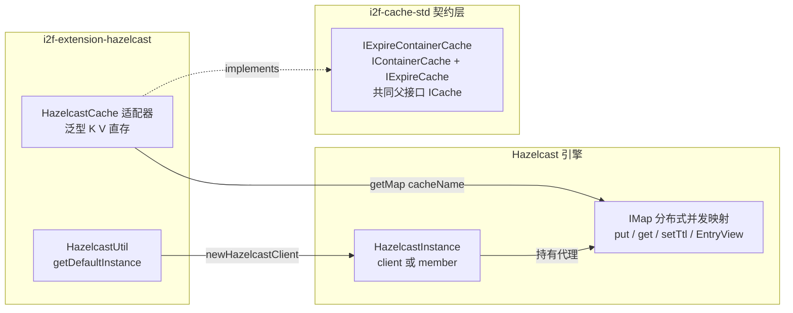

# i2f-extension-hazelcast

> **基于 Hazelcast（`com.hazelcast:hazelcast:5.3.0`，provided）的分布式缓存契约适配器**（2 源文件 100 行 + 1 个 main 方法测试 34 行）：`HazelcastCache<K,V>` 把分布式并发 `IMap`（`put`/`get`/`setTtl`/`EntryView`）装配为 `i2f-cache-std` 的 `IExpireContainerCache` 契约实现——泛型 K/V 直接存取（Hazelcast 原生 Java 序列化，无需 encoder/decoder）、TTL 写入一步到位；`HazelcastUtil` 提供 `getDefaultInstance(clusterName)` 快速创建智能客户端。构造器接收任意 `HazelcastInstance`，客户端（client）与嵌入式（member）双形态皆可。与 `i2f-extension-redis-cache`、`i2f-extension-zookeeper` 同属 cache 契约的远程实现族。

## 模块路径

- `i2f-extension/i2f-extension-hazelcast/pom.xml`
- 相对于仓库根目录：`i2f-extension/i2f-extension-hazelcast`

## 模块依赖

### 内部依赖（compile）

| Maven 坐标 | scope | optional | 说明 |
|-----------|-------|----------|------|
| `i2f.turbo:i2f-cache-std:1.0-jdk8` | compile | false | 缓存标准契约层（`ICache` 四动词 + `IContainerCache` 容器能力 + `IExpireCache` 过期能力，组合为 `IExpireContainerCache`） |

### 三方依赖

| Maven 坐标 | 版本 | scope | optional | 说明 |
|-----------|-------|-------|----------|------|
| `com.hazelcast:hazelcast` | 5.3.0 | provided | true | Hazelcast 分布式内存数据网格引擎（含 client 与 member 双形态），POM 内硬编码版本（未纳入根 POM `dependencyManagement` 统一管理）；provided + optional 声明，运行期由使用方自备；引擎核心自包含（slf4j-api/picocli/jline 均为其 provided+optional 依赖，无强制传递） |
| `org.projectlombok:lombok` | 1.18.44（根 POM 管理） | provided | true | 继承根 POM `dependencyManagement` 的 provided + optional；本模块源码实际未使用任何 lombok 注解（冗余声明） |

## 模块设计

### 包结构

```
i2f.extension.hazelcast
├── HazelcastCache.java    -- 契约适配器（ICache 四动词 + keys/clean + set(TTL)/expire/getExpire + getMap 逃逸口，78 行）
└── HazelcastUtil.java     -- 客户端工具（getDefaultInstance：按集群名创建智能客户端，22 行）

src/test/java/i2f.extension.hazelcast.test
└── TestHazelcast.java     -- main 方法冒烟演示（map put/get + queue put/poll，34 行，非 JUnit）
```

### 契约继承链

```
IExpireContainerCache<K, V>
  ├── IContainerCache<K, V>  -- keys() / clean() + default size() / forEach()
  └── IExpireCache<K, V>     -- set(key,value,ttl,unit) / expire / getExpire + default preferSetAndTtl()
        └── 共同父接口 ICache<K, V>  -- get / set / exists / remove
```

### 核心架构



### 设计要点

1. **单一职责的契约适配器**：`HazelcastCache` 仅做「`IExpireContainerCache` 契约方法 → `IMap` 原生操作」的一一映射，不做任何业务加工；库耦合点集中在一处，替换实现零成本
2. **泛型 K/V 直存，零编码器**（区别于 redis/zookeeper 适配器的最大特征）：Hazelcast `IMap` 原生以 Java 序列化存取任意可序列化对象，因此无需 `Function<Object, String>` 编解码器与 String key 约束，键值类型完整保留泛型语义
3. **双形态实例兼容**：构造器形参为 `HazelcastInstance` 接口——既可以传入 `HazelcastClient.newHazelcastClient(...)` 产生的智能客户端（连接远端集群），也可以传入 `Hazelcast.newHazelcastInstance(...)` 产生的嵌入式成员（自身即集群节点），适配器对两者无感知差异
4. **map name 即命名空间**：`cacheName` 直接对应 Hazelcast 的分布式 map 名称，多个 `HazelcastCache` 实例可指向同一集群的不同 map，天然实现缓存隔离
5. **TTL 写入一步到位**：`set(key, value, time, unit)` 直接映射 `IMap.put(key, value, ttl, unit)`——单次网络调用原子完成「写入 + 设 TTL」，无需走契约 `preferSetAndTtl`（默认 true）提示的「先 set 再 expire」两步降级路径
6. **原生能力逃逸口**：公开 `getMap()` 直接暴露 `IMap`，使用方可越过契约使用 Hazelcast 特有能力（EntryProcessor、监听器、near-cache、map store 等）
7. **每次操作即时取代理**：每个契约方法都经 `getMap()` 即时获取 `IMap` 代理（Hazelcast 内部对同名 map 代理有缓存，开销极小，但保证了对 map 配置变更的即时可见性）
8. **provided + optional 弱依赖**：引擎仅为编译期依赖，编包不含 Hazelcast；使用方按自身版本诉求引入，与全仓「契约稳定、实现可换」原则一致

## 模块目的

为以 Hazelcast 为分布式缓存/数据网格的项目提供「零改造接入 i2f 缓存契约」的适配实现：把 `IMap` 的成熟分布式能力（数据分片、多副本备份、集群弹性、TTL 驱逐）纳入 `IExpireContainerCache` 契约，使 i2f 各栈中按契约消费缓存能力的组件（SWL 过期 nonce 管理、限流器、登录守卫、MCP 会话缓存等以 `ICache`/`IExpireCache` 为形参的组件）可以直接切换/注入 Hazelcast 实现；同时通过 provided + optional 双声明，避免对使用方的引擎选型产生强制绑定。

## 模块功能

1. **基础缓存四动词**（`ICache`）：`get(key)` / `set(key, value)` / `exists(key)`（`containsKey`）/ `remove(key)`
2. **容器能力**（`IContainerCache`）：`keys()`（`IMap.keySet()` 全量键集）、`clean()`（`IMap.clear()` 全清）+ 继承 default `size()` / `forEach()`
3. **过期能力**（`IExpireCache`）：`set(key, value, time, unit)`（带 TTL 原子写入）、`expire(key, time, unit)`（`setTtl` 刷新/补设 TTL）、`getExpire(key, unit)`（`EntryView.getTtl()` 毫秒值按目标单位转换，entry 不存在返回 `null`）
4. **原生逃逸口**：`getMap()` 暴露 `IMap<K, V>`，直达 Hazelcast 全量分布式 map 能力
5. **客户端快速创建**：`HazelcastUtil.getDefaultInstance(clusterName)`——按集群名构建默认 `ClientConfig` 并创建智能客户端
6. **双形态兼容**：构造器接收任意 `HazelcastInstance`（客户端或嵌入式成员皆可）

## 模块主要使用方法

### 1. Maven 引入

```xml
<dependency>
    <groupId>i2f.turbo</groupId>
    <artifactId>i2f-extension-hazelcast</artifactId>
    <version>1.0-jdk8</version>
</dependency>
<!-- 本模块以 provided 声明 hazelcast，运行期需使用方自行提供（版本可自选） -->
<dependency>
    <groupId>com.hazelcast</groupId>
    <artifactId>hazelcast</artifactId>
    <version>5.3.0</version>
</dependency>
```

### 2. 客户端模式（连接既有集群）

```java
// 快速创建：仅指定集群名，默认连接 127.0.0.1:5701
HazelcastInstance client = HazelcastUtil.getDefaultInstance("my-cluster");

// 或自行配置地址/凭证后创建
ClientConfig config = new ClientConfig();
config.setClusterName("my-cluster");
config.getNetworkConfig().addAddress("node1:5701", "node2:5701");
HazelcastInstance client2 = HazelcastClient.newHazelcastClient(config);

// 包装为契约缓存
IExpireContainerCache<String, User> cache = new HazelcastCache<>(client, "user-cache");
```

### 3. 嵌入式成员模式（自身即集群节点）

```java
// 本进程作为集群成员启动（节点间自动组网）
HazelcastInstance member = Hazelcast.newHazelcastInstance();

// 同一构造器，无缝包装
IExpireContainerCache<String, Session> sessions = new HazelcastCache<>(member, "session-cache");
```

### 4. 契约操作

```java
// 基础读写
cache.set("u1", user);
User u1 = cache.get("u1");
boolean has = cache.exists("u1");
cache.remove("u1");

// 带 TTL 原子写入（10 分钟）
cache.set("token", token, 10, TimeUnit.MINUTES);

// 刷新/补设 TTL
cache.expire("token", 30, TimeUnit.MINUTES);

// 读取 TTL（毫秒值按目标单位转换）
Long ttl = cache.getExpire("token", TimeUnit.SECONDS);

// 容器操作
Collection<String> keys = cache.keys();
int size = cache.size();          // default：keys().size()
cache.clean();                    // 清空整个 map

// 原生逃逸口：直达 IMap 全量能力
IMap<String, User> raw = ((HazelcastCache<String, User>) cache).getMap();
```

### 5. 作为契约实现注入使用

```java
// 任何持有 ICache / IExpireCache / IExpireContainerCache 契约引用的组件均可注入（示意）
component.setCache(new HazelcastCache<>(client, "biz-cache"));
```

### 注意事项

1. **provided 依赖需自备**：使用方必须自行引入 hazelcast（5.3.x 或自选版本），否则运行期 `NoClassDefFoundError`
2. **键值需 Hazelcast 可序列化**：K/V 需实现 `java.io.Serializable` 或使用 Hazelcast 序列化体系（`IdentifiedDataSerializable`/`Portable`/`DataSerializable`），否则操作时抛序列化异常
3. **客户端模式需既有集群**：`getDefaultInstance` 只设了集群名，地址取默认 `127.0.0.1:5701`；连接远端集群请自行构建 `ClientConfig`（见示例 2）
4. **客户端生命周期自管理**：`HazelcastInstance` 的 `shutdown()` 责任在使用方；`HazelcastUtil` 每次调用都会新建客户端连接，不复用也不回收
5. **`keys()` 是集群级全量查询**：客户端模式下 `keySet()` 会把该 map 的全部 key 从集群拉到本地，大数据量场景有网络与内存压力（见瑕疵第 3 条）
6. **TTL 语义与 Redis 不同**：`getExpire` 返回的是 entry 的 TTL 配置时长而非剩余时间；`setTtl` 会整体重置 TTL（见瑕疵第 2 条）
7. **异常为 Hazelcast 原生异常**：抛出 `HazelcastInstanceNotActiveException` 等引擎异常，而非契约层异常

## 模块特性总结

1. **极简适配**：2 个类 100 行完成一个分布式数据网格的缓存契约接入，替换成本极低
2. **泛型 K/V 直存**：零编码器设计，键值类型完整保留（对比 redis/zookeeper 适配器的 String 化 + Function 编解码）
3. **双形态兼容**：client（智能客户端）与 member（嵌入式成员）同一构造器无缝接入
4. **TTL 原子写入**：`IMap.put` 单调用完成写入 + 过期设置，无两步降级窗口
5. **原生逃逸口**：`getMap()` 直达 `IMap` 全量分布式能力（EntryProcessor/监听器/near-cache 等）
6. **零强绑定**：provided + optional 双声明，使用方自选引擎版本
7. **实现族可替换**：与 redis-cache、zookeeper 共享同一契约，按基础设施选型切换

## 模块瑕疵或错误

> 以下为源码静态分析识别的问题或潜在问题（依项目规则不做运行时实证）。

1. **lombok 声明未使用**：pom 声明 `org.projectlombok:lombok`，但两个源文件均未使用任何 lombok 注解，属冗余声明（与全仓多个模块同类问题）
2. **`getExpire` 语义漂移（TTL 总时长 ≠ 剩余时间）**：`EntryView.getTtl()` 返回的是该 entry 配置的 TTL 总时长（毫秒），实现将其直接 `convert` 为目标单位返回（L49-56）——契约族通行的三态语义为「`null` 不存在 / `-1` 永不过期 / 正数=剩余时间」（见 `i2f-cache-std` 文档对 `ExpireCacheWrapper` 的约定），而本实现：① 未过期期间返回值恒为配置值而非递减的剩余时间；② TTL=0（永不过期）返回 `0` 而非 `-1`；③ 与 Redis `PTTL` 的剩余时间语义不一致，跨实现互换时消费方判断逻辑会失真
3. **`keys()` 集群级全量拉取**：`IMap.keySet()`（L29-31）在客户端模式下会把该 map 的全部 key 从集群传输到调用方本地构造 `HashSet`——大数据量场景存在 O(N) 网络与内存压力；继承的 default `size()`/`forEach()` 同样受累（`IMap` 自身有 `size()` 服务端计数可直用）；对比 `localKeySet()` 仅取本地分片
4. **`put` 返回旧值的隐性开销**：`set(key, value, ttl, unit)` 映射为 `IMap.put(...)`（L39-41）、`set(key, value)` 映射为 `IMap.put`（L63-66）、`remove(key)` 映射为 `IMap.remove`（L73-76）——三者均返回被覆盖/删除的旧值（实现处忽略）；对不需要旧值的写入路径，Hazelcast 提供无返回值的 `IMap.set(key, value[, ttl, unit])` 重载可省去旧值的取回与网络传输开销
5. **客户端生命周期无管理**：`HazelcastUtil.getDefaultInstance`（L12-19）每次调用都 `HazelcastClient.newHazelcastClient(config)` 新建客户端连接，既无单例复用，也无 `shutdown` 挂钩；`HazelcastCache` 未实现 `Closeable`/`AutoCloseable`，客户端关闭责任完全外置，易造成连接泄漏
6. **`getDefaultInstance` 配置能力硬编码**：仅暴露 `clusterName` 一个参数；网络地址（默认 `127.0.0.1:5701`）、认证凭证、重连策略、智能路由开关等均无入口，实际生产几乎必然要绕开该工具自建 `ClientConfig`
7. **测试死代码**：`TestHazelcast` L15-16 构建的 `ClientConfig`（设置了 clusterName）从未被使用——L18 直接再次调用 `HazelcastUtil.getDefaultInstance("demo")` 内部重建 config，前两行属死代码
8. **测试为 main 方法而非 JUnit**：无断言、无生命周期管理，仅 `System.out.println` 观感式冒烟（同仓多模块同类风格），`mvn test` 不会执行任何验证
9. **字段非 final 的弱不可变声明**：`client`/`cacheName`（L16-17）声明为普通 private 字段（构造后无 setter，事实不可变），但缺少 `final` 修饰——不可变性仅靠约定保证，重构时易被意外打破；同理 `HazelcastCache` 可变字段与泛型实例的并发安全性完全依赖 `IMap` 代理自身的线程安全
10. **契约覆盖窄于同族实现**：`redis-cache`/`zookeeper` 的缓存适配器同时实现 `IPersistCache` + `IDistributedCache` 标记契约，本模块仅实现 `IExpireContainerCache`——按契约族「标记接口声明持久化/分布式能力」的组织惯例，本模块未声明这两项标记，按契约类型筛选分布式实现的消费方（若存在）会漏掉本实现
11. **版本硬编码且相对陈旧**：`hazelcast:5.3.0`（2023-06 发布）在 POM 内硬编码、未纳入根 POM `dependencyManagement`；5.3.x 线后续有多个累积 patch（性能与安全修复），5.4+ 为后续大版本，生产使用建议评估升级并回归
12. **`expire` 的重置语义未在文档层提示**：`setTtl(key, time, unit)`（L43-46）按 Hazelcast 语义是整体重置该 entry 的 TTL（重新计时），而非「在剩余时间基础上延长」——与部分缓存实现的「续期」预期不同，契约层亦未约定 `expire` 的确切语义，行为差异需使用方自行确认

## 姊妹模块对比（cache 契约远程实现族）

| 对比项 | `i2f-extension-hazelcast`（本模块） | `i2f-extension-redis-cache` | `i2f-extension-zookeeper` |
|-------|-------------------------------------|-----------------------------|---------------------------|
| 引擎依赖 | `hazelcast:5.3.0` provided | 经 `i2f-extension-redis-api` 抽象 | curator/zookeeper（模块内依赖） |
| 实现契约 | `IExpireContainerCache` | `IExpireContainerCache` + `IPersistCache` + `IDistributedCache` | `IExpireContainerCache` + `IPersistCache` + `IDistributedCache` |
| 键值类型 | 泛型 `K`/`V` 直存 | `String` key + `Object` value | `String` key + `Object` value |
| 编解码器 | 无需（Hazelcast 原生 Java 序列化） | 必须（构造器注入 `Function` encoder/decoder） | 必须按需自带 |
| TTL 机制 | `IMap.put` 原子写 + `setTtl` 重置 | Redis `SET ... EX` / `EXPIRE` | ZK 无原生 TTL（需自实现驱逐） |
| 连接形态 | client（智能客户端）/ member（嵌入式）双形态 | `IRedisClient` 抽象（jedis/lettuce 等实现） | `ZookeeperManager`（curator 会话） |
| 适用场景 | 已有/需要 Hazelcast 集群、对象级缓存 | Redis 基础设施、字符串协议生态 | 强一致 CP 场景、配置/协调数据 |

> 另有本地实现族：`i2f-jdk/i2f-cache`（`MapCache` 实现 `IContainerCache`、`ExpireCacheWrapper` 实现 `IExpireCache`）与 `i2f-lru-cache`，同属 `i2f-cache-std` 契约家族。

## 消费方情况

| 消费方 | 类型 | 说明 |
|-------|------|------|
| `i2f-extension/pom.xml`（L53） | 父 POM 模块注册 | `<modules>` 中注册本模块，参与全仓构建 |
| 根 `pom.xml`（L1078-1082） | dependencyManagement | 以 `${i2f.version}` 统一管理本模块版本 |
| `i2f-extension-all/pom.xml`（L163-166） | POM 聚合 | 纳入 i2f-extension-all fat-jar 分发包；hazelcast（provided+optional）不传递打包，运行期需使用方自备 |
| `bash/backup-jdk8`、`bash/backup-jdk17`、`bash/deploy-jdk8`、`bash/deploy-jdk17` | 预构建产物分发 | `i2f-extension-hazelcast-1.0-jdk8.jar` / `-1.0-jdk17.jar` 随分发包分发 |
| 全仓 Java 源码 | 零代码级引用 | `HazelcastCache`/`HazelcastUtil` 无任何外部 import，作为契约实现供使用方按需选用 |
| `.wiki/modules/i2f-jdk/i2f-cache-std/readme.md`（L209） | 契约层文档引用 | 被缓存契约层文档列为「远程实现」族成员（Hazelcast 分布式缓存实现） |
| `.wiki/wiki.md`（L157）、`.wiki/docs/module-i2f-extension.md`（L179） | 文档引用 | 被列为分布式组件分类成员（Hazelcast 分布式） |
