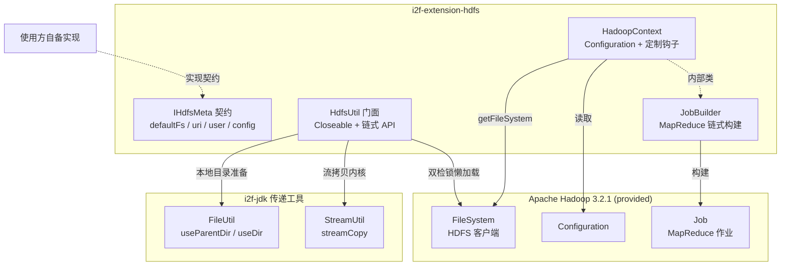

# i2f-extension-hdfs

> HDFS 操作与 Hadoop 上下文工具（`org.apache.hadoop:hadoop-client:3.2.1`，provided）：`HdfsUtil` 以 `IHdfsMeta`「连接四要素」契约（defaultFs/uri/user/config）双检锁懒加载 `FileSystem`，链式封装建目录/上传/下载/删除/列举（失败显式抛 `IOException`）；`HadoopContext` 另辟一轨，提供 `Configuration` 继承定制钩子与 `JobBuilder` 链式构建 MapReduce 作业。与 `i2f-extension-filesystem-hdfs`（`IFileSystem` 契约实现）构成同协议双轨姊妹模块。

## 模块路径

- `i2f-extension/i2f-extension-hdfs/pom.xml`
- 相对于仓库根目录：`i2f-extension/i2f-extension-hdfs`

## 模块依赖

### 内部依赖（compile）

| Maven 坐标 | scope | optional | 说明 |
|-----------|-------|----------|------|
| `i2f.turbo:i2f-io-file:1.0-jdk8` | compile | false | `FileUtil.useParentDir`/`useDir`：下载到本地文件/目录前自动创建父目录（`HdfsUtil` L85、L93 真实使用） |

### 三方依赖

| Maven 坐标 | scope | optional | 说明 |
|-----------|-------|----------|------|
| `org.apache.hadoop:hadoop-client:3.2.1` | provided | false | Hadoop 客户端聚合包（POM 硬编码版本，根 POM 无统一管理）。传递 `hadoop-common`/`hadoop-hdfs-client`/`hadoop-yarn-api/client/common`/`hadoop-mapreduce-client-core/jobclient` 及 jetty/jersey/guice/avro/netty/zookeeper/guava/slf4j-log4j12 等组件。provided 语义：运行时由 Hadoop 环境或使用方自备 |
| `org.projectlombok:lombok` | provided（继承根 POM） | true | 声明冗余：3 个源文件均未使用任何 lombok 注解（姊妹模块 `filesystem-hdfs` 的 `HdfsMeta` 用了 `@Data`，本模块没有对应物） |

### 隐式传递依赖（源码直接使用、POM 未声明）

| Maven 坐标 | 实际来源 | 说明 |
|-----------|----------|------|
| `i2f.turbo:i2f-io-stream:1.0-jdk8` | 经 `i2f-io-file` compile 传递 | `StreamUtil.streamCopy(is, os, false)`：上传/下载的流拷贝内核（`HdfsUtil` L6 直接 import、L63/L79 使用，与 `i2f-extension-ftp` 相同的「传递依赖直接使用」模式） |
| `i2f.turbo:i2f-text / i2f-array / i2f-resources` | 经 `i2f-io-file` compile 传递 | 随 `i2f-io-file` 一并传递，本模块未直接使用 |

## 模块设计

### 包结构

```
i2f.extension.hdfs
├── HadoopContext.java          # Hadoop 上下文：Configuration 封装 + MapReduce JobBuilder
│   └── JobBuilder (static)     # MapReduce Job 链式构建器（name/input/output/mapper/reducer）
├── HdfsUtil.java               # HDFS 文件操作门面（Closeable + 链式 API）
└── data
    └── IHdfsMeta.java          # 连接四要素契约（defaultFs/uri/user/config）
```

### 核心架构



### 设计要点

1. **双组件分工**：`HdfsUtil` 面向「文件 CRUD 会话」（`Closeable`，一次连接多次操作）；`HadoopContext` 面向「计算上下文」（`Configuration` 装配 + `JobBuilder` 组装 MapReduce 作业），两者互不依赖，可独立使用。
2. **契约模式 + 零实现**：`IHdfsMeta` 定义 `getDefaultFs`/`getUri`/`getUser`/`getConfig` 四要素，javadoc 内嵌 `fs.defaultFS` 属性配置示例（`hdfs://192.168.1.120:8020`）。模块内不提供任何实现类——使用方自行实现或匿名类提供（对比 `i2f-extension-ftp` 同时提供 `FtpMeta` POJO 的做法）。
3. **双检锁懒加载**：`getFileSystem()` 以 `synchronized` + 二次判空懒初始化 `FileSystem.get(new URI(uri), conf, user)`，首次操作才建立连接；`conf` 为 null 时自动 `new Configuration()` 并回填 `fs.defaultFS`。
4. **链式 API**：`setMeta`/`mkdirs`/`upload`/`delete`/`deleteDir` 返回 `this`（`download` 到流/文件返回目标对象），支持一句链式表达。
5. **JobBuilder 流式构建 MapReduce**：`createJob()` 起链，`input`（默认 `TextInputFormat` 的三便捷重载）→ `mapper` → `output` → `reducer` → `done()`（取回 Job 继续定制）或 `doneAndWaitCompletion(verbose)`（提交并等待）。
6. **模板方法钩子**：`HadoopContext` 的 `getDefaultFs()`/`rewriteConfig()` 为 protected 钩子——子类覆写即可注入默认文件系统或追加任意 Hadoop 配置项，无需重写 `init()`。
7. **错误显式化**：`delete`/`deleteDir` 检查 `FileSystem.delete` 返回值，失败抛 `IOException`（对比姊妹模块 `filesystem-hdfs` 静默吞异常返回默认值）。

## 模块目的

为使用方提供最薄一层的 HDFS/Hadoop 门面：

- 以一份「连接四要素」契约 + 单工具类覆盖 HDFS 日常文件操作（建目录/上传/下载/删除/列举），屏蔽 `FileSystem`/`Path`/`FSDataInputStream` 等底层 API。
- 用链式 `JobBuilder` 把 MapReduce 作业组装压缩到几行代码，适合嵌入式/工具型场景快速提交作业。
- provided 弱依赖 + 零源码级反向耦合，运行时绑定使用方环境中的 Hadoop 发行版。

## 模块功能

1. **连接管理**：`IHdfsMeta` 四要素 + 双检锁懒加载 `FileSystem`（URI + 代理用户名登录）；`close()` 释放连接。
2. **目录操作**：`mkdirs(serverPath)` 递归创建目录。
3. **上传**：`upload(serverPath, serverFileName, InputStream)` 流上传 / `upload(serverPath, File)` 本地文件上传（自动取文件名，覆盖语义 `create(path, true)`，上传前自动 `mkdirs`）。
4. **下载**：`download(serverPath, serverFileName, OutputStream)` 到流 / `download(..., File)` 到本地文件（自动建父目录）/ `download2Dir(..., File)` 到本地目录（自动建目录 + 沿用远端文件名）。
5. **删除**：`delete` 删文件（非递归）、`deleteDir` 递归删目录；返回 false 时抛 `IOException`。
6. **列举**：`listFiles(serverPath)` 返回 `FileStatus[]`（大小/权限/时间等 HDFS 元信息）。
7. **Hadoop 上下文**：`HadoopContext` 提供 `getConfig`/`getFileSystem`（单参默认与 uri+user 双形态）/`createJob`。
8. **MapReduce 构建**：`JobBuilder` 链式组装作业名/主类/输入格式/输入路径/输出路径与 KV 类型/mapper/reducer 及任务数，`done` 或 `doneAndWaitCompletion` 收尾。

## 模块主要使用方法

### 1. Maven 引入

```xml
<dependency>
    <groupId>i2f.turbo</groupId>
    <artifactId>i2f-extension-hdfs</artifactId>
    <version>1.0-jdk8</version>
</dependency>

<!-- hadoop-client 为 provided，需自行引入匹配运行环境的版本 -->
<dependency>
    <groupId>org.apache.hadoop</groupId>
    <artifactId>hadoop-client</artifactId>
    <version>3.2.1</version>
    <scope>provided</scope>
</dependency>
```

本模块 POM 同时配置了 `maven-assembly-plugin`（`addMavenDescriptor`），`bash/deploy-jdk8`、`bash/deploy-jdk17` 等目录中存有其分发 jar。

### 2. 实现 IHdfsMeta 契约

```java
public class MyHdfsMeta implements IHdfsMeta {
    @Override
    public String getDefaultFs() { return "hdfs://192.168.1.120:8020"; }
    @Override
    public String getUri() { return "hdfs://192.168.1.120:8020"; }
    @Override
    public String getUser() { return "hadoop"; }
    @Override
    public Configuration getConfig() { return null; } // null 时内部自动 new Configuration()
}
```

### 3. 典型用法

```java
try (HdfsUtil util = new HdfsUtil(new MyHdfsMeta())) {
    util.mkdirs("/data/app");

    // 上传本地文件（覆盖远端同名文件）
    util.upload("/data/app", new File("D:/local.log"));

    // 下载到本地目录（自动创建目录、沿用远端文件名）
    File f = util.download2Dir("/data/app", "local.log", new File("D:/out"));

    // 列举目录
    FileStatus[] status = util.listFiles("/data/app");

    // 递归删除目录（失败抛 IOException）
    util.deleteDir("/data/app");
}
```

### 4. MapReduce 作业构建

```java
HadoopContext ctx = new HadoopContext() {
    @Override
    protected String getDefaultFs() { return "hdfs://192.168.1.120:8020"; }

    @Override
    protected void rewriteConfig(Configuration conf) {
        conf.set("mapreduce.job.reduces", "2");
    }
};

ctx.createJob()
        .app(WordCountJob.class, "word-count")
        .input("/data/in")                    // 默认 TextInputFormat
        .mapper(TokenizerMapper.class, Text.class, IntWritable.class)
        .output("/data/out", Text.class, IntWritable.class)
        .reducer(IntSumReducer.class, 1)
        .doneAndWaitCompletion(true);
```

### 注意事项

- `IHdfsMeta` 的 `getUri()`/`getUser()` 不可为 null：`new URI(null)` 将抛 NPE（`getDefaultFs()` 为 null 时 `conf.set` 亦有潜在 NPE，见瑕疵第 2 条）。
- `upload` 为覆盖语义（`create(path, true)`），远端同名文件会被直接截断重写。
- `delete`/`deleteDir` 对不存在的路径会因返回 false 而抛 `IOException`，不是幂等操作。
- `close()` 之前更换 `setMeta` 不会重建已缓存的 `FileSystem`。
- hadoop-client 是 provided：IDE 内直接运行需自行添加 classpath，集群提交时由 Hadoop 环境提供。

## 模块特性总结

- 双组件门面：`HdfsUtil`（文件会话）与 `HadoopContext`（计算上下文 + JobBuilder）互不依赖、各取所需。
- 契约驱动连接配置：`IHdfsMeta` 四要素，模块内零实现、使用方自备。
- 双检锁懒加载 `FileSystem`，首次操作才连接，`Closeable` 统一收尾。
- 链式 API + `download2Dir` 本地目录自动创建（`FileUtil` 借力 i2f-jdk 工具族）。
- 上传/下载流拷贝复用 `StreamUtil.streamCopy`（i2f-jdk 传递依赖）。
- MapReduce 作业流式组装：input 默认 `TextInputFormat`、`done` 取回 Job 继续定制、`doneAndWaitCompletion` 一键提交。
- `HadoopContext` protected 钩子（`getDefaultFs`/`rewriteConfig`）支持继承定制，无需重写装配流程。
- 删除失败显式抛 `IOException`，错误语义比姊妹模块更严格。
- provided 弱依赖 hadoop-client 3.2.1，运行时绑定环境发行版。

## 模块瑕疵或错误

以下为源码静态分析识别的问题或潜在问题（依项目规则不做运行时实证）：

1. **双检锁无 volatile**：`HdfsUtil.fileSystem` 字段未声明 `volatile`，JDK8 下双检锁存在指令重排可见性风险（半初始化对象逃逸）。
2. **null 契约无防御**：`getFileSystem()` 中 `meta.getDefaultFs()` 为 null 时 `conf.set("fs.defaultFS", null)` 底层 `Properties.setProperty` 将抛 NPE；`meta.getUri()` 为 null 时 `new URI(null)` 抛 NPE——对比姊妹模块 `filesystem-hdfs` 对 `uri/user` 为 null 时回退 `FileSystem.get(conf)`，本模块无此防御。
3. **JobBuilder 无参构造器为死代码**：`JobBuilder()` 不初始化 `job` 字段，后续任何链式调用（如 `name(...)`）立即 NPE。
4. **流关闭无 try/finally**：`upload`（L62-64）、`download`（L78-80）、`upload(File)`（L70-72）、`download(File)`（L86-88）、`download2Dir`（L95-97）中流拷贝抛异常时，`FSDataOutputStream`/`FSDataInputStream`/`FileInputStream`/`FileOutputStream` 均泄漏。
5. **删除非幂等**：`delete`/`deleteDir` 对不存在路径（Hadoop 返回 false）抛 `IOException("delete file failure.")`，重试语义不友好。
6. **deleteDir 异常文案失真**：删除目录失败的消息仍是 "delete file failure."，目录/文件语义混用，排障误导。
7. **setMeta 热替换失效**：`setMeta` 可链式更换 meta，但已缓存的 `FileSystem` 不会重建，后续操作仍连旧集群（静默配置漂移）。
8. **download 返回值风格不一致**：其余方法返回 `this`，`download(..., OutputStream)` 却返回 `os`，链式表达在下载处断链。
9. **listFiles 暴露底层类型**：直接返回 `FileStatus[]`（hadoop 原始类型），使用方强绑定 hadoop API，无递归列举能力。
10. **upload 每次全量 mkdirs**：每次上传都重复 `mkdirs(serverPath)`，目录已存在时为冗余 RPC（幂等无害但高频上传场景放大开销）。
11. **lombok 冗余声明**：3 个源文件均无 lombok 注解，依赖声明可移除。
12. **零测试**：无 `src/test`，所有路径仅经编译验证。
13. **hadoop-client 版本硬编码且陈旧**：3.2.1（2019 年）直接写在模块 POM，根 POM 无统一管理，升级需逐模块比对（与 `filesystem-hdfs` 各自硬编码同一版本）。
14. **非线程安全的使用模型**：双检锁仅保护初始化，`close` 与并发操作间无协调（hadoop `FileSystem` 自身线程安全，风险主要在关闭时序）。

## 姊妹模块对比

### i2f-extension-filesystem-hdfs（同协议、契约化适配）vs 本模块

| 维度 | i2f-extension-hdfs（本模块） | i2f-extension-filesystem-hdfs |
|------|------|------|
| 定位 | 独立 HDFS/Hadoop 工具类（直连门面） | `IFileSystem` 文件系统标准契约的 HDFS 实现 |
| 文件模型 | 路径字符串 + `FileStatus[]` | `IFile`/`AbsFileSystem` 抽象文件模型 |
| 连接配置 | `IHdfsMeta` 接口（模块内零实现，使用方自备） | `HdfsMeta` POJO（lombok `@Data`） |
| 连接时机 | 首次操作双检锁懒加载 | 构造器立即连接 |
| null 防御 | 无（uri/user null 即 NPE） | 有（uri/user null 回退 `FileSystem.get(conf)`） |
| 异常语义 | 上抛 `IOException`，delete 失败显式抛 | 普通操作吞异常返回默认值，仅 mkdir/length 转抛 `IllegalStateException` |
| 能力范围 | 文件 CRUD + `HadoopContext`/`JobBuilder`（MapReduce） | 文件 CRUD + `isAppendable`/`getAppendOutputStream`（追加写） |
| 锁 | 双检锁（无 volatile） | 无锁懒加载 |
| 互操作 | 两者均基于 `FileSystem.get(URI, conf, user)` 三参数载入，连接语义一致 | 同左 |

两模块为「同协议双轨」：需要与其他文件系统（本地/FTP/SFTP/MinIO/OSS 等统一 `IFileSystem` 抽象互换）时选 `filesystem-hdfs`；需要直连 HDFS + MapReduce 作业提交时选本模块。

## 消费方情况

| 消费方 | 形态 | 说明 |
|--------|------|------|
| 根 `pom.xml` | dependencyManagement | L1083-1087 统一版本 `${i2f.version}` |
| `i2f-extension/pom.xml` | module 登记 | L54 |
| `i2f-extension-all` | 聚合依赖 | L167-170，进入 fat-jar 分发包 |
| `bash/deploy-jdk8`、`bash/deploy-jdk17` | 分发 jar | 各 1 个 `i2f-extension-hdfs-1.0-jdk*.jar`（backup 同构） |
| `.wiki/docs/module-i2f-extension.md` | 文档登记 | L207「HDFS 客户端」 |
| `i2f-io-file`/`i2f-io-stream` 文档 | 消费方反向表 | 两文档消费方清单中列有本模块 |

全仓无任何 Java 源码级 `import i2f.extension.hdfs` 引用——本模块为终端工具型模块，面向外部场景使用。
