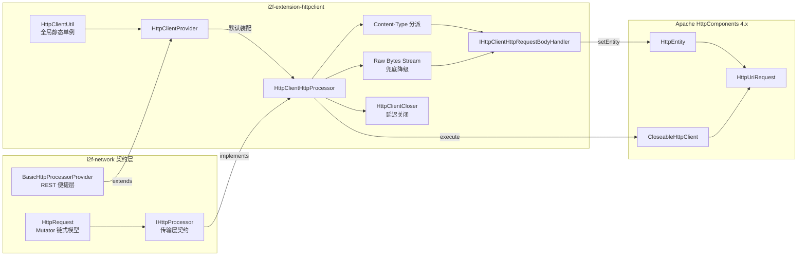

# i2f-extension-httpclient

> Apache HttpClient 4.x 的 `IHttpProcessor` 传输层绑定（`httpclient`/`httpmime` provided）：`HttpClientHttpProcessor` 按请求 `Content-Type` 分派 JSON/XML/Form/Multipart 四类请求体处理器（`Map`/Bean 经 `ReflectResolver.bean2map` 展开字段），将 `i2f-network` 的中立 `HttpRequest`/`HttpResponse` 模型装配为 `HttpUriRequest`/`HttpEntity` 并执行，超时与重定向经 `RequestConfig` 逐请求配置；`HttpClientProvider` 继承 `BasicHttpProcessorProvider` 数十个 REST 便捷方法，`HttpClientUtil` 提供全局静态单例切换点。与 `i2f-network` 默认的 `HttpUrlConnectProcessor`（JDK 原生）及 `i2f-extension-okhttp`、spring-web 绑定为可互换实现。

## 模块路径

- `i2f-extension/i2f-extension-httpclient/pom.xml`
- 相对于仓库根目录：`i2f-extension/i2f-extension-httpclient`

## 模块依赖

### 内部依赖（compile）

| Maven 坐标 | scope | optional | 说明 |
|-----------|-------|----------|------|
| `i2f.turbo:i2f-network:1.0-jdk8` | compile | false | HTTP 契约层：`IHttpProcessor`/`IHttpRequestBodyHandler`/`IHttpResponseExtractor` 接口、`HttpRequest`/`HttpResponse`/`HttpHeaders`/`MultipartFile` 数据模型、`BasicHttpProcessorProvider` 便捷层、`HttpUtil.generateUrl` URL 装配、`ContentTypeConstants`/`HttpHeaderConstants`/`HttpMethodConstants` 常量。**传递引入** `i2f-serialize-impl`（`Json2Serializer`/`Xml2Serializer`，处理器默认序列化引擎）、`i2f-serialize-std`（`IJsonSerializer`/`IXmlSerializer` 契约）、`i2f-reflect`（`ReflectResolver.bean2map`，Form/Multipart 处理器使用）、`i2f-io-stream`、`i2f-form-url-encoded`、`i2f-mutator`——均被本模块源码直接使用（传递依赖直接使用模式） |
| `i2f.turbo:i2f-io-file:1.0-jdk8` | compile | false | **声明冗余**：三个包共 10 个源文件中无任何 `i2f.io.file.*` 引用（对比 ftp/hdfs 模块真实使用 `FileUtil`）。作为 compile 依赖会向使用方传递 `i2f-text`/`i2f-io-stream`/`i2f-array`/`i2f-resources` 四个上游包 |

### 三方依赖（provided）

| Maven 坐标 | scope | optional | 说明 |
|-----------|-------|----------|------|
| `org.apache.httpcomponents:httpclient:4.5.13` | provided | false | Apache HttpClient 4.x 执行引擎：`CloseableHttpClient`/`HttpClientBuilder`/`RequestConfig`/`HttpGet` 等请求族与 `HttpEntity` 体系。版本在模块 POM 硬编码（根 POM 无 dependencyManagement 条目），使用方需自备运行时 |
| `org.apache.httpcomponents:httpmime:4.5.3` | provided | false | multipart/form-data 支持：`MultipartEntityBuilder`/`HttpMultipartMode`/`ContentType`。**版本与 httpclient 4.5.13 不一致**（见瑕疵第 1 条） |

### 编译期依赖（继承根 POM 管理）

| Maven 坐标 | scope | optional | 说明 |
|-----------|-------|----------|------|
| `org.projectlombok:lombok:1.18.44` | provided | true | `HttpClientHttpProcessor` 的 `@Data`/`@NoArgsConstructor`（暴露 `jsonSerializer`/`xmlSerializer` 的 getter/setter 供替换） |

## 模块设计

### 包结构

| 包 | 类 | 职责 |
|----|----|------|
| `i2f.extension.httpclient` | `HttpClientProvider` | 便捷层：继承 `BasicHttpProcessorProvider`，默认装配 `HttpClientHttpProcessor`，亦开放注入自定义 `IHttpProcessor` |
| `i2f.extension.httpclient` | `HttpClientUtil` | 全局入口：`public static volatile HttpClientProvider httpProvider` 单例 + `http()` 访问器 |
| `i2f.extension.httpclient.impl` | `HttpClientHttpProcessor` | 核心处理器：`IHttpProcessor` 的 HttpClient 4.x 实现，含 `HttpClientCloser` 内部类（流式响应的延迟关闭策略） |
| `i2f.extension.httpclient.impl` | `IHttpClientHttpRequestBodyHandler` | 处理器适配契约：`IHttpRequestBodyHandler<HttpEntityEnclosingRequestBase>` 的模块内窄化接口 |
| `i2f.extension.httpclient.impl` | `HttpClientJsonRequestBodyHandler` 等 6 个 | 请求体处理器族：JSON/XML/Form/Multipart/RawBytes/RawInputStream 各自装配 `HttpEntity` |

### 核心架构



### 设计要点

1. **绑定式适配（Strategy 绑定）**：与 SLF4J 绑定同构——`i2f-network` 定义传输契约并自带 JDK 原生默认实现 `HttpUrlConnectProcessor`，本模块提供 Apache HttpClient 引擎的等价实现，`HttpRequest.send(processor)` 显式传入即完成引擎切换，数据模型与便捷方法零改动。
2. **Content-Type 分派处理器（Strategy by Content-Type）**：`HttpClientHttpProcessor.http()` 读取请求头的 `Content-Type`，含 `json`/`xml`/`form`/`multipart` 关键字分别选择对应请求体处理器，缺省回落到 Form 处理器；`data` 为 `byte[]`/`InputStream` 时无条件覆盖为 Raw 处理器。
3. **模块内窄化契约**：`IHttpClientHttpRequestBodyHandler` 把泛型参数固化到 `HttpEntityEnclosingRequestBase`（HttpClient 带体请求基类），处理器族只需关心 `setEntity`，与 `i2f-network` 的 JDK 原生处理器族（`IOutputStreamHttpRequestBodyHandler`，面向 `OutputStream`）形成平行的两套实现。
4. **处理器间委派链**：Form 处理器检测到 `request.files` 非空时自动委派 Multipart 处理器（与契约层行为一致）；各处理器对 `byte[]`/`InputStream` data 统一委派 Raw 处理器——两条委派路径保证「同一份调用代码覆盖全部请求体形态」。
5. **双资源策略（流式 vs 即用）**：执行后由 `IHttpResponseExtractor` 在处理器资源作用域内消费响应；若提取结果本身是 `HttpResponse`（调用方要流式读取），处理器挂载 `HttpClientCloser` 到 `retResp.setCloser(...)` 并跳过自动关闭——把连接生命周期移交给响应对象的 `close()`；否则 finally 中立即关闭客户端。
6. **每请求独立客户端**：每次 `http()` 调用 `HttpClientBuilder.create().build()` 新建 `CloseableHttpClient`，配合 `RequestConfig` 逐请求设置连接超时/读取超时/重定向（`connectTimeout`/`connectionRequestTimeout`/`socketTimeout`/`redirectsEnabled`/`circularRedirectsAllowed`）。
7. **序列化引擎可替换**：处理器字段 `jsonSerializer`（默认 `Json2Serializer`）与 `xmlSerializer`（默认 `Xml2Serializer`）经 Lombok `@Data` 暴露 setter，可替换为 gson/jackson/fastjson 等任意 `IJsonSerializer`/`IXmlSerializer` 实现。
8. **全局切换点**：`HttpClientUtil.httpProvider` 为 `public static volatile`，运行期可整体替换（例如换成注入定制处理器的 `HttpClientProvider`），是模块对外的主推使用入口。

## 模块目的

- 为 `i2f-network` 的 HTTP 中立契约提供 Apache HttpClient 4.x 引擎绑定，让偏好 HttpClient 生态（成熟的连接管理、重定向与认证体系）的使用方以零侵入方式切换传输层。
- 复用契约层全部上层设施：`Mutator` 链式请求构建、`BasicHttpProcessorProvider` 数十个 REST 便捷重载、`IHttpResponseExtractor` 响应提取器、`MultipartFile` 文件模型——本模块只做「中立模型 ↔ HttpClient 类型」的翻译。
- 以 provided 弱依赖引入 httpclient/httpmime，不在使用方 classpath 强加引擎。

## 模块功能

- **四方法执行**：GET（无体）/ POST / PUT（经处理器写体）/ DELETE（无体）构建对应 `HttpUriRequest` 并执行，状态行/响应头/Content-Length/响应流回填 `HttpResponse`。
- **JSON 请求体**：任意对象经 `IJsonSerializer.serialize` 序列化为 `StringEntity`（`application/json`，UTF-8）。
- **XML 请求体**：任意对象经 `IXmlSerializer.serialize` 序列化为 `StringEntity`（`text/xml`，UTF-8）。
- **Form 请求体**：`Map` 直接展开 / 任意 Bean 经 `ReflectResolver.bean2map` 反射展开为 `UrlEncodedFormEntity`（UTF-8）键值对。
- **Multipart 请求体**：`MultipartEntityBuilder`（`BROWSER_COMPATIBLE` 模式，UTF-8）——普通字段作 `text/plain` 文本体，`MultipartFile` 列表作 `application/octet-stream`（`MULTIPART_FORM_DATA`）二进制体；携带文件名。
- **原始体透传**：`data` 为 `byte[]` → `ByteArrayEntity`；为 `InputStream` → `InputStreamEntity`，不经任何序列化。
- **请求配置**：连接超时、读取超时（同时映射到 `connectionRequestTimeout` 与 `socketTimeout`）、是否跟随重定向（同时作用于循环重定向允许位）逐请求装配。
- **响应流式与即用两用**：extractor 返回 `HttpResponse` 时移交关闭权（挂 `HttpClientCloser`），否则请求结束时自动关闭客户端。
- **REST 便捷层**：经 `HttpClientProvider`（继承 `BasicHttpProcessorProvider`）获得 `get`/`getForString`/`getForObject`/`postJson`/`postForm`/`postJsonForObject`/`postFormForObject` 等数十个重载。
- **多值请求头**：`HttpHeaders`（`Map<String, ArrayList<String>>`）逐值展开为多个同名 header，null 值以空串补齐。

## 模块主要使用方法

### Maven 引入

```xml
<!-- 引入绑定（契约经 i2f-network 传递） -->
<dependency>
    <groupId>i2f.turbo</groupId>
    <artifactId>i2f-extension-httpclient</artifactId>
    <version>1.0-jdk8</version>
</dependency>

<!-- provided 引擎需使用方自备 -->
<dependency>
    <groupId>org.apache.httpcomponents</groupId>
    <artifactId>httpclient</artifactId>
    <version>4.5.13</version>
</dependency>
<dependency>
    <groupId>org.apache.httpcomponents</groupId>
    <artifactId>httpmime</artifactId>
    <version>4.5.13</version>
</dependency>
```

### 典型用法一：显式指定处理器（单次切换）

```java
// 复用 i2f-network 的链式构建，仅替换传输引擎
HttpResponse resp = HttpRequest.doPost("api.example.com/login")
        .set(u -> u::setData, MapUtil.of("user", "tom", "pwd", "123"))
        .with2(u -> u::addHeader, HttpHeaderConstants.ContentType, ContentTypeConstants.Form)
        .done()
        .send(new HttpClientHttpProcessor());   // 此处切换为 HttpClient 引擎

String body = resp.getContentAsString("UTF-8");
```

### 典型用法二：全局默认入口（HttpClientUtil）

```java
// 一次替换，处处生效（volatile 静态单例）
String json = HttpClientUtil.http()
        .postJsonForString("api.example.com/users", userBean, "UTF-8");

User u = HttpClientUtil.http()
        .getForObject("api.example.com/users/1", null, "UTF-8",
                User.class, new Json2Serializer());
```

### 典型用法三：替换序列化引擎

```java
HttpClientHttpProcessor processor = new HttpClientHttpProcessor();
// 换成任意 IJsonSerializer 实现（如 gson 适配器）
processor.setJsonSerializer(new GsonJsonSerializer());

HttpResponse resp = HttpRequest.doPost("api.example.com/save")
        .json()                                   // Content-Type: application/json
        .set(u -> u::setData, dto)
        .done()
        .send(processor);
```

### 注意事项

1. 请求必须携带 `Content-Type` 头（`json()`/`form()`/`multipart()`/`xml()` 链式方法或手动 `addHeader`），否则处理器在分派处直接 NPE（见瑕疵第 3 条）。
2. 仅支持 GET/POST/PUT/DELETE 四种方法，其余方法（PATCH/HEAD/OPTIONS 等）会以 null 请求执行而崩溃（见瑕疵第 4 条）。
3. `DELETE` 请求设置的 `data` 会被静默忽略（不写请求体）。
4. 引擎为 provided 弱依赖，运行时 classpath 缺失 `httpclient`/`httpmime` 时首次调用即 `NoClassDefFoundError`。
5. 流式读取响应（extractor 返回 `HttpResponse`）后，必须调用 `resp.close()`（其内部经 closer 关闭客户端），否则连接与响应实体泄漏。

## 模块特性总结

- **契约绑定**：`IHttpProcessor` 的 Apache HttpClient 4.x 引擎实现，与 JDK 原生/OkHttp/Spring Web 实现可互换，上层代码零改动。
- **五形态请求体**：JSON/XML/Form/Multipart/Raw（字节与流）全覆盖，Content-Type 自动分派 + data 类型兜底降级。
- **反射展开**：Form 与 Multipart 的普通字段支持任意 Bean（`ReflectResolver.bean2map`），无需实现特定接口。
- **双资源策略**：即用型响应自动关闭，流式响应经 `HttpClientCloser` 移交生命周期，兼顾便利与长连接。
- **逐请求配置**：超时与重定向语义按单次请求粒度装配，不共享全局状态。
- **可替换序列化**：JSON/XML 引擎默认自研 `Json2`/`Xml2`，可换任意契约实现。
- **全局切换点**：`HttpClientUtil` 静态单例支持运行期整体替换。
- **弱依赖**：httpclient/httpmime 均 provided，由使用方决定引擎版本与存在性。

## 模块瑕疵或错误

> 以下为源码静态分析识别的问题或潜在问题（依项目规则不做运行时实证，后续如有需要再实证补充）。

1. **httpmime 与 httpclient 版本错位**：`httpclient:4.5.13` 与 `httpmime:4.5.3` 同 groupId 不同版本，Maven 依赖调解后 httpmime 以 4.5.3 基线链接 4.5.13 的 httpclient——4.5.x 系列二进制兼容性较好，但属工程瑕疵，建议统一为 4.5.13。
2. **每请求新建 `CloseableHttpClient`**：`HttpClientBuilder.create().build()` 逐请求执行，无连接池复用、无 keep-alive、无拦截器/重试配置入口——与 `.wiki/docs/network-proxy.md` 所述「适用场景：需要连接池、重试、拦截器等高级特性」形成落差（该能力实际未暴露，需使用方绕过本模块自建）。
3. **缺省 Content-Type 即 NPE**：`request.getHeader().getFirstHeader(HttpHeaderConstants.ContentType)` 返回 null 时（如裸 POST 未设头），`contentType.contains(...)` 抛 NPE——契约层默认实现会回落 Form 处理器，本实现直接崩溃，行为不一致。
4. **仅四方法支持，其余方法崩溃**：`PATCH`/`HEAD`/`OPTIONS`/`TRACE` 等不匹配任何分支，`req` 保持 null，`httpClient.execute(null)` 抛 NPE（虽 finally 会关闭客户端，但错误信息无方法语义）。
5. **DELETE 携带 data 被静默丢弃**：`data != null` 且方法为 DELETE 时处理器选择逻辑照常运行，但 DELETE 分支不调用 `writeBody`——调用方无任何提示。
6. **`connectionRequestTimeout` 复用 `readTimeout`**：池获取等待与读超时语义不同（前者应远小于后者），当前映射会在高并发短读超时场景放大连接获取失败率。
7. **`circularRedirectsAllowed` 跟随 `allowRedirect`**：允许循环重定向，仅靠 HttpClient 默认 `maxRedirects=50` 兜底，循环重定向链会拖满 50 跳才终止。
8. **`CloseableHttpResponse` 从不显式关闭**：流式路径下 `resp` 及其 `HttpEntity` 流交由调用方经 `HttpResponse.close()` 间接释放（HttpClientCloser 只关客户端不关响应）；即用路径下依赖 `httpClient.close()` 隐式回收——两条路径都依赖 HttpClient 内部实现细节，未调用 `resp.close()` 属非规范用法。
9. **`i2f-io-file` 声明冗余**：模块源码对该包零引用，compile 声明却向使用方传递 4 个上游包（`i2f-text`/`i2f-io-stream`/`i2f-array`/`i2f-resources`），徒增依赖面。
10. **处理器实例共享可变字段**：`jsonSerializer`/`xmlSerializer` 为 `@Data` 暴露的可变字段，而 `HttpClientUtil.httpProvider` 全局共享单例持有处理器——运行期调用 setter 替换引擎时存在可见性与并发风险（常规只读使用无碍）。
11. **`@Data` 附带生成 equals/hashCode/toString**：对无状态语义的处理器类属冗余（与仓库其他模块一致的 Lombok 习惯，仅影响字节码体积）。
12. **GET 的 data 静默忽略**：与 DELETE 同理，GET 分支不写体且无提示（GET 携体在 RFC 语义上本就无定义，属可接受行为但未防御性说明）。
13. **零测试**：模块无任何测试源码，五形态请求体与双资源策略均无自动化验证。

## `IHttpProcessor` 实现族横向对比

本模块是全仓 4 个 `IHttpProcessor` 实现之一（详见 `.wiki/docs/network-proxy.md`），四者共享 `i2f-network` 契约与处理器分派结构，可按需互换：

| 实现类 | 所属模块 | 底层引擎 | 外部依赖 | 差异化特征 |
|--------|---------|---------|---------|-----------|
| `HttpUrlConnectProcessor` | `i2f-network` | JDK `HttpURLConnection` | 无 | 契约层默认实现，`HttpRequest.send()` 无参时的缺省引擎 |
| `HttpClientHttpProcessor` | 本模块 | Apache HttpClient 4.x | `httpclient`/`httpmime`（provided） | 唯一提供 `HttpClientProvider` + `HttpClientUtil` 全局单例切换点的绑定 |
| `OkHttpHttpProcessor` | `i2f-extension-okhttp` | OkHttp3 | `okhttp`（provided） | 支持外部注入 `OkHttpClient` 单例复用连接池；模块结构与本模块完全对称（8 文件处理器族，无 Provider/Util 门面） |
| `SpringWebHttpProcessor` | `i2f-spring-web` | Spring `RestTemplate` | `spring-web` | Spring 环境内的绑定实现 |

## 消费方情况

| 消费方 | 形式 | 位置 |
|--------|------|------|
| `i2f-extension-all` | POM 聚合依赖 | `i2f-extension-all/pom.xml` L173 |
| 根 POM | 版本管理 | `pom.xml` L1090（dependencyManagement，`${i2f.version}`） |
| `i2f-extension` | 模块声明 | `i2f-extension/pom.xml` L55 |
| bash 分发产物 | 预构建 jar | `bash/backup-jdk17`、`bash/backup-jdk8`、`bash/deploy-jdk17` 各 1 个 jar |
| `.wiki/docs/network-proxy.md` | 文档旁证 | L170/L184：`IHttpProcessor` 全项目实现一览第 2 位及专节描述 |
| `.wiki/modules/i2f-jdk/i2f-serialize-impl/readme.md` | 文档旁证 | L243：`new Json2Serializer()` 默认引擎消费证据 |
| `.wiki/modules/i2f-jdk/i2f-serialize-std/readme.md` | 文档旁证 | L289：`IJsonSerializer`/`IXmlSerializer` 契约消费证据 |
| `.wiki/wiki.md` / `.wiki/docs/module-i2f-extension.md` | 文档旁证 | L142 网络通信模块清单 / L65 Apache HttpClient 行 |

> 全仓源码级消费方为零——本模块定位为「按需引入的传输引擎替换件」，典型消费方式是使用方显式 `send(new HttpClientHttpProcessor())` 或引入后以 `HttpClientUtil` 全局切换。
