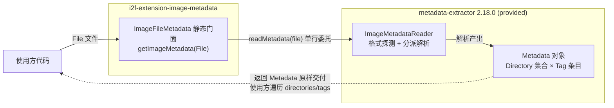

# i2f-extension-image-metadata

> 图像元数据读取工具：`ImageFileMetadata` 以单静态方法门面委托 `metadata-extractor`（`com.drewnoakes:metadata-extractor:2.18.0`，provided）的 `ImageMetadataReader.readMetadata(File)`，把图片文件解析为 `Metadata`（`Directory` × `Tag` 树形模型）原样返回——可读取 JPEG/PNG/GIF/BMP/TIFF/WebP/HEIF/PSD 及部分 RAW、音视频容器格式的 EXIF、GPS、XMP、IPTC、尺寸、色彩等元数据。极简无状态设计，不二次封装库类型。

## 模块路径

- `i2f-extension/i2f-extension-image-metadata/pom.xml`
- 相对于仓库根目录：`i2f-extension/i2f-extension-image-metadata`

## 模块依赖

### 三方依赖

| Maven 坐标 | scope | optional | 说明 |
|-----------|-------|----------|------|
| `com.drewnoakes:metadata-extractor:2.18.0` | provided | false（POM 硬编码版本） | 元数据解析引擎：`ImageMetadataReader` 按文件头探测格式并解析出 `Metadata` 树；provided 语义下不传递，使用方需自行引入 |

### 隐式传递依赖

| Maven 坐标 | scope | optional | 说明 |
|-----------|-------|----------|------|
| `com.adobe.xmp:xmpcore:6.1.11` | compile（经 metadata-extractor 传递） | false | Adobe XMP（可扩展元数据平台）解析内核，metadata-extractor 2.18.0 的 compile 级依赖；由于引擎本身 provided，该传递同样不生效，使用方需 XMP 支持时应一并显式引入 |

### 冗余依赖

| Maven 坐标 | 说明 |
|-----------|------|
| `org.projectlombok:lombok`（无版本无 scope，继承根 POM provided + optional） | 源码 0 引用（无注解、无 import），属声明冗余，见瑕疵第 3 条 |

## 模块设计

### 包结构

```
i2f.extension.image.metadata
├── ImageFileMetadata.java        // 唯一主类：17 行静态门面
└── test（src/test）
    └── TestImageMetadata.java    // main 方法冒烟演示：遍历 Directory/Tag 打印
```

### 核心架构



### 设计要点

1. **单方法委托门面**：`getImageMetadata(File)` 一行转发 `ImageMetadataReader.readMetadata(file)`，无任何附加逻辑，符合本仓库「简练、单一」的宗旨
2. **无状态静态门面**：类无字段无实例化必要，天然线程安全
3. **库类型原样返回**：返回值即库的 `Metadata` 对象，不做二次包装——保留库的全量能力（`Directory` 分组、`Tag` 键值、错误收集等），也意味着使用方必须同时依赖 metadata-extractor（provided 语义下的必然结果）
4. **弱依赖引入**：引擎以 provided 引入不参与传递，使用方自备版本，模块自身零运行时依赖
5. **File 形态单入口**：库本身还提供 `InputStream`/`byte[]` 等重载形态，门面仅暴露最常用的 `File` 形态（能力收缩，见瑕疵第 2 条）

## 模块目的

- 为图像元数据读取提供一个 i2f 风格的极简入口：一行调用获取结构化元数据，省去直接引库时对 `ImageMetadataReader` 的认知成本
- 将「图像元数据」能力纳入 `.wiki` 体系（wiki 图像处理分类的一员，与 opencv 族并列），形成能力地图的完整覆盖

## 模块功能

- **读取图像/媒体元数据**：输入一个 `File`，返回 `Metadata` 对象（`Directory` 集合，每个 `Directory` 含若干 `Tag`）
- **覆盖常见格式**：JPEG（EXIF/JFIF/IPTC/Photoshop/XMP）、PNG（含 iCCP/iTXt）、GIF、BMP、TIFF、WebP、HEIF/HEIC、PSD、ICO 等，另支持部分 RAW（CRW/CR2/NEF/ARW/RW2/ORF/RAF 等）与音视频容器（MP4/MOV/AVI/WAV/AIFF）——具体可用 `Directory` 随文件格式与文件实际内容而定
- **典型元数据类别**：拍摄参数（快门/光圈/ISO/焦距）、拍摄时间、GPS 定位、图像尺寸与色彩空间、压缩参数、相机型号、注释等

## 模块主要使用方法

### 1. Maven 引入

```xml
<dependency>
    <groupId>i2f.turbo</groupId>
    <artifactId>i2f-extension-image-metadata</artifactId>
    <version>1.0-jdk8</version>
</dependency>
<!-- provided 引擎需使用方自备 -->
<dependency>
    <groupId>com.drewnoakes</groupId>
    <artifactId>metadata-extractor</artifactId>
    <version>2.18.0</version>
</dependency>
<!-- 如需 XMP 元数据支持，一并引入其 compile 依赖 -->
<dependency>
    <groupId>com.adobe.xmp</groupId>
    <artifactId>xmpcore</artifactId>
    <version>6.1.11</version>
</dependency>
```

### 2. 读取并遍历元数据（测试类同款模式）

```java
import com.drew.metadata.Directory;
import com.drew.metadata.Metadata;
import com.drew.metadata.Tag;
import i2f.extension.image.metadata.ImageFileMetadata;

import java.io.File;

Metadata metadata = ImageFileMetadata.getImageMetadata(new File("./test.jpg"));
for (Directory directory : metadata.getDirectories()) {
    System.out.println("======= " + directory.getName() + " =======");
    for (Tag tag : directory.getTags()) {
        // 三个视图：键名 / 原始类型码 / 人类可读描述
        System.out.println(tag.getTagName() + " | " + tag.getDescription());
    }
    // 解析过程中的非致命错误（Throwable）也会收集在 Directory 上
    for (Throwable error : directory.getErrors()) { }
}
```

### 3. 定向取用（按目录类型）

```java
import com.drew.metadata.exif.ExifSubIFDDirectory;
import com.drew.metadata.exif.GpsDirectory;

Metadata metadata = ImageFileMetadata.getImageMetadata(file);
// EXIF 拍摄时间（大量便捷取值以 Directory 子类的 getXxx 形式提供）
ExifSubIFDDirectory exif = metadata.getFirstDirectoryOfType(ExifSubIFDDirectory.class);
if (exif != null) {
    System.out.println(exif.getDateOriginal());
    System.out.println(exif.getString(ExifSubIFDDirectory.TAG_DATETIME_ORIGINAL));
}
// GPS 坐标（ExifGpsDirectory 提供地理位置换算）
GpsDirectory gps = metadata.getFirstDirectoryOfType(GpsDirectory.class);
```

### 注意事项

- 引擎为 provided：不引入 `metadata-extractor` 直接调用将编译失败；需要 XMP 时还需 `xmpcore`
- `Metadata` 遍历结果随文件格式与内容动态变化，取值前应判空（如 `getFirstDirectoryOfType` 可能返回 null）
- `getErrors()` 收集的是解析过程中的非致命问题（如截断的段），健壮场景可检视

## 模块特性总结

- 极简：主源码 17 行、单类单方法、零状态、零内部依赖
- 门面化：一行调用获得全量结构化元数据
- 格式面广：常见图片格式 + 部分 RAW 与音视频容器
- 库模型直通：`Metadata`/`Directory`/`Tag` 原样交付，能力不缩水
- 弱依赖：引擎 provided 不传递，版本由使用方掌控
- 线程安全：无共享状态

## 模块瑕疵或错误

> 以下为源码静态分析识别的问题或潜在问题（依项目规则不做运行时实证）：

1. **异常签名泛化**：`getImageMetadata` 声明 `throws Exception`，吞掉了库的具体异常类型（`ImageProcessingException`/`IOException` 等），使用方无法按类型精确捕获与分类处理
2. **入口形态收缩**：库的 `readMetadata` 还提供 `InputStream`/`byte[]` 等重载，门面仅暴露 `File`——流式/内存内（如网络下载未落盘）场景使用方需绕过门面直接调库
3. **lombok 冗余声明**：POM 声明 lombok 但源码 0 引用（无注解、无 import），传递上亦无作用
4. **无入参防御**：`file` 为 null 或不存在时的失败形态完全取决于底层异常（NPE 或 `FileNotFoundException`），门面层无校验与友好提示
5. **测试不可自动化**：`TestImageMetadata` 为 main 方法硬编码工作目录相对路径 `./test.jpg`，非 JUnit 断言，依赖运行前手动准备文件
6. **公共签名暴露库类型**：返回 `com.drew.metadata.Metadata` 使使用方与 metadata-extractor 强耦合（provided 语义下这是设计必然，但意味着模块无法隔离库版本更替的影响）
7. **javadoc 缺失**：仅 `@author`/`@date`，无方法说明与示例指引

## 同类模块关联

| 模块 | 关系 |
|------|------|
| `i2f-extension-opencv` / `i2f-extension-opencv-data` / `i2f-extension-opencv-javacv` | 同属 wiki「图像处理」分类（wiki.md 分类表）；opencv 族面向像素级图像处理，本模块面向文件级元数据读取，能力互补无代码耦合 |

## 消费方情况

| 消费方 | 形式 | 位置 |
|--------|------|------|
| 根 POM | dependencyManagement 版本登记 | `pom.xml` L1093-1097 |
| i2f-extension 组 POM | module 聚合声明 | `i2f-extension/pom.xml` L56 |
| i2f-extension-all | 聚合依赖引用 | `i2f-extension-all/pom.xml` L175-178 |
| bash 分发产物 | 4 个 jar | `bash/backup-jdk8`、`bash/backup-jdk17`、`bash/deploy-jdk8`、`bash/deploy-jdk17` |
| wiki 文档 | 分类登记 | `wiki.md` L147（图像处理）、`docs/module-i2f-extension.md` L105 |

> 全仓无源码级消费（无任何 `import i2f.extension.image.metadata`），属待用工具模块。
