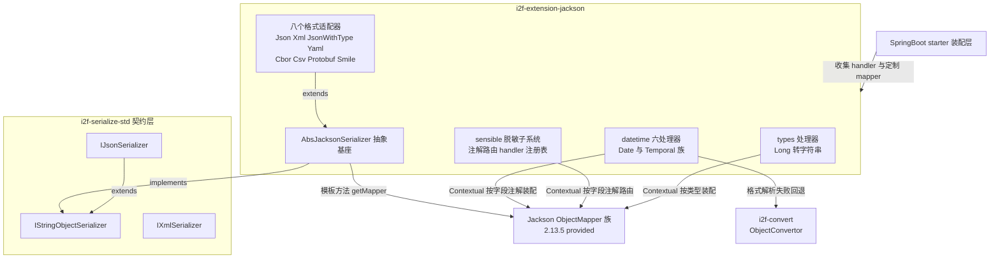

# i2f-extension-jackson

> Jackson 多格式序列化适配器与扩展件集合（jackson 2.13.5，provided）：`serializer` 包以 `AbsJacksonSerializer` 模板基座派生 8 个格式适配器（JSON/XML 实现标准契约并带 `INSTANCE` 预配置单例，另含多态类型保留 JSON 与 YAML/CBOR/CSV/Protobuf/Smile 五格式）；`datetime` 包提供 6 个日期时间读写处理器（`@JsonFormat` pattern 上下文装配 + `ObjectConvertor` 解析回退）；`sensible` 包为注解式数据脱敏子系统（`@Sensible` 元注解组合 + handler 双注册表路由 + 字典翻译扩展点）；`types` 包以 `@Long2String` 解决 Long 前端精度丢失。是全仓消费最广的序列化适配模块。

## 模块路径

- `i2f-extension/i2f-extension-jackson/pom.xml`
- 相对于仓库根目录：`i2f-extension/i2f-extension-jackson`

## 模块依赖

### 内部依赖（compile）

| Maven 坐标 | scope | optional | 说明 |
|-----------|-------|----------|------|
| `i2f.turbo:i2f-serialize-std:1.0-jdk8` | compile | false | 契约层：`IStringObjectSerializer`（`AbsJacksonSerializer` 直接实现）、`IJsonSerializer`/`IXmlSerializer`（Json/Xml 适配器标记契约）、`SerializeException` 统一异常 |
| `i2f.turbo:i2f-convert:1.0-jdk8` | compile | false | `ObjectConvertor`：datetime 四个反序列化器的兜底解析引擎（`tryParseDate`/`parseLocalDate`/`parseLocalDateTime`/`parseLocalTime`）；传递引入 `i2f-typeof` |

### 三方依赖（provided + optional）

| Maven 坐标 | scope | optional | 说明 |
|-----------|-------|----------|------|
| `com.fasterxml.jackson.core:jackson-core:${jackson.version}` | provided | true | Jackson 流式内核（`JsonGenerator`/`JsonParser`） |
| `com.fasterxml.jackson.core:jackson-databind:${jackson.version}` | provided | true | 数据绑定核心（`ObjectMapper`/`JsonSerializer`/`ContextualSerializer` 等），传递 `jackson-annotations` |
| `com.fasterxml.jackson.dataformat:jackson-dataformat-xml` | provided | true | XML 格式（`XmlMapper`），`JacksonXmlSerializer` 使用 |
| `com.fasterxml.jackson.dataformat:jackson-dataformat-yaml` | provided | true | YAML 格式（`YAMLMapper`），`JacksonYamlSerializer` 使用 |
| `com.fasterxml.jackson.dataformat:jackson-dataformat-protobuf` | provided | true | Protobuf 格式（`ProtobufMapper`） |
| `com.fasterxml.jackson.dataformat:jackson-dataformat-cbor` | provided | true | CBOR 二进制格式（`CBORMapper`） |
| `com.fasterxml.jackson.dataformat:jackson-dataformat-csv` | provided | true | CSV 格式（`CsvMapper`） |
| `com.fasterxml.jackson.dataformat:jackson-dataformat-smile` | provided | true | Smile 二进制格式（`SmileMapper`） |
| `org.projectlombok:lombok` | provided | true | `JacksonDateDeserializer` 使用 `@Data`/`@NoArgsConstructor`；其余类未使用 |

注：`${jackson.version}`（根 POM L53）= `2.13.5`；本模块自带 `dependencyManagement` 以该属性统一管理 8 个 Jackson artifact（区别于多数 extension 模块的逐处硬编码版本）。全部 Jackson 依赖 provided + optional——使用方按所需格式自行引入，Spring Boot web 环境自带 `jackson-databind` 无需重复声明。

## 模块设计

### 包结构（22 个主源码 + 2 个内嵌使用文档）

| 包 | 成员 | 职责 |
|----|------|------|
| `i2f.extension.jackson.serializer` | `AbsJacksonSerializer`（抽象基座）+ `JacksonJsonSerializer`、`JacksonXmlSerializer`、`JacksonJsonWithTypeSerializer`、`JacksonYamlSerializer`、`JacksonCborSerializer`、`JacksonCsvSerializer`、`JacksonProtobufSerializer`、`JacksonSmileSerializer`（8 个适配器）+ `readme.md` | 多格式契约适配层 |
| `i2f.extension.jackson.datetime` | `serializer/JacksonDateSerializer`、`serializer/JacksonTemporalSerializer`；`deserializer/JacksonDateDeserializer`、`JacksonLocalDateDeserializer`、`JacksonLocalDateTimeDeserializer`、`JacksonLocalTimeDeserializer` | 日期时间字段级读写处理器 |
| `i2f.extension.jackson.sensible` | `JacksonSensibleSerializer`、`annotations/Sensible`、`handler/ISensibleHandler`、`handler/AbsDictSensibleHandler`、`handler/impl/TruncateSensibleHandler`、`handler/impl/SensibleType`、`holder/SensibleHandlersHolder` + `readme.md` | 注解式数据脱敏子系统 |
| `i2f.extension.jackson.types` | `JacksonLong2StringSerializer`、`Long2String`（注解） | Long 转字符串处理器 |

### 核心架构



### 设计要点

1. **模板方法基座**：`AbsJacksonSerializer implements IStringObjectSerializer`，仅声明抽象 `getMapper()`；`serialize`/`deserialize`（Class、`Type`、`TypeReference` 三分派）/`deserializeAsMap` 的公共逻辑全部沉淀在基座，8 个子类各自只提供一种 `ObjectMapper` 形态。
2. **Jackson Contextual 扩展机制**：datetime 六处理器与 sensible、types 处理器均实现 `ContextualSerializer`/`ContextualDeserializer`——`createContextual` 在遇到具体字段时读取该字段注解（`@JsonFormat` pattern / `@Sensible` / `@Long2String`），动态构造携带对应配置的处理器实例，实现「一个注册、按字段生效」。
3. **元注解组合**：`@Sensible` 自身组合了 `@JsonSerialize(using = JacksonSensibleSerializer.class)` + `@JacksonAnnotationsInside`——使用方在字段上标注一个业务注解即完成脱敏声明，无需感知 Jackson 底层注解。
4. **双注册表路由**：`SensibleHandlersHolder` 维护 `GLOBAL_HANDLERS`（`CopyOnWriteArrayList`，全局）与 `THREAD_HANDLERS`（`ThreadLocal`，线程级覆盖）两级 handler 注册表，`getContextHandlers()` 线程级优先——支持同一应用内多套脱敏策略并存。
5. **两级回退链**：datetime 反序列化在注解 pattern 解析失败时回退 `ObjectConvertor` 智能解析；sensible 在注册表中无匹配 handler 时回退内置 `TruncateSensibleHandler`（按 `prefix`/`suffix`/`fill` 截断填充）。
6. **预配置单例**：`JacksonJsonSerializer.INSTANCE` 与 `JacksonXmlSerializer.INSTANCE` 经 `Supplier` 匿名类初始化，固化 `Locale.getDefault()` + 日期格式 `yyyy-MM-dd HH:mm:ss SSS` + `JsonInclude.Include.ALWAYS`；无参构造则为裸 mapper，具体格式构造器（`JsonMapper`/`XmlMapper` 等）与 `ObjectMapper` 注入构造器三路开放定制。
7. **多态类型保留**：`JacksonJsonWithTypeSerializer.getMapper()` 每次调用 `activateDefaultTyping`（`LaissezFaireSubTypeValidator` + `NON_FINAL` + `WRAPPER_ARRAY`），序列化结果内嵌类型信息，用于泛型多态对象的 round-trip。
8. **模块自管理版本**：POM 自带 `dependencyManagement` 以根属性 `${jackson.version}` 统一 8 个 artifact，避免各处版本漂移。

## 模块目的

- 把 Jackson 生态（含 6 种 dataformat 扩展格式）装配为 `i2f-serialize-std` 的中立序列化契约实现，与 fastjson/fastjson2/gson 适配器及自研 `Json2Serializer` 形成可互换的多实现家族。
- 沉淀一套与具体业务解耦的 Jackson 字段级扩展件：日期时间格式化读写、敏感数据脱敏、Long 精度保护——供 Spring/SpringBoot 层以 builder customizer 或直接注册的方式统一装配。
- 为 SpringBoot 提供专门的脱敏 starter（`i2f-springboot-jackson-sensible-starter`）承接「Spring 容器 bean → handler 注册表」的桥接。

## 模块功能

1. **多格式序列化适配**：一个基座 8 种格式——JSON、XML（实现 `IJsonSerializer`/`IXmlSerializer` 标准契约）、多态类型保留 JSON（`WRAPPER_ARRAY` 内嵌类名）、YAML、CBOR、CSV、Protobuf、Smile。
2. **类型化反序列化**：`deserialize(text, Class)`、`deserialize(text, Type)`、`deserialize(text, TypeReference<T>)` 三级重载（`TypeReference` 匿名内部类解决泛型擦除）；`deserializeAsMap` 便捷方法。
3. **格式化输出**：`serialize(obj, formatted=true)` 启用 pretty printer。
4. **日期时间处理器**：`Date`（`JacksonDateSerializer`/`JacksonDateDeserializer`）与 `LocalDate`/`LocalDateTime`/`LocalTime`（`JacksonTemporalSerializer` + 三个 Deserializer）的字段级注解驱动读写，支持 `@JsonFormat(pattern)` 逐字段定制，解析失败回退 `ObjectConvertor` 智能解析。
5. **注解式数据脱敏**：`@Sensible(type/prefix/suffix/fill/param)` 标注字段，序列化时自动脱敏——预置 `phone`/`email`/`id-card`/`password`/`sequence`/`trunc` 六种正则策略；`dict` 类型经 `AbsDictSensibleHandler` 子类实现字典翻译；`ISensibleHandler` 接口支持任意自定义策略（加密、转码等）。
6. **Long 精度保护**：`JacksonLong2StringSerializer` 按 `@Long2String` 注解（字段/类级）将 Long 输出为字符串，规避 JavaScript `Number.MAX_SAFE_INTEGER` 精度丢失；`@JsonFormat` 字段则保持数字输出。

## 模块主要使用方法

### Maven 引入

```xml
<dependency>
    <groupId>i2f.turbo</groupId>
    <artifactId>i2f-extension-jackson</artifactId>
    <version>1.0-jdk8</version>
</dependency>
<!-- JSON：Spring Boot web 环境自带，无需额外引入；非 web 环境按需引入 -->
<dependency>
    <groupId>com.fasterxml.jackson.core</groupId>
    <artifactId>jackson-databind</artifactId>
    <version>2.13.5</version>
</dependency>
<!-- 使用哪种扩展格式，再引入对应 dataformat（以 XML/YAML 为例） -->
<dependency>
    <groupId>com.fasterxml.jackson.dataformat</groupId>
    <artifactId>jackson-dataformat-xml</artifactId>
    <version>2.13.5</version>
</dependency>
```

### 基本用法（契约一致，格式可换）

```java
import com.fasterxml.jackson.core.type.TypeReference;
import i2f.extension.jackson.serializer.JacksonJsonSerializer;
import i2f.extension.jackson.serializer.JacksonXmlSerializer;
import i2f.extension.jackson.serializer.JacksonYamlSerializer;

// 预配置单例（默认日期格式 yyyy-MM-dd HH:mm:ss SSS）
UserDto user = ...;
String json = JacksonJsonSerializer.INSTANCE.serialize(user);
String pretty = JacksonJsonSerializer.INSTANCE.serialize(user, true); // 格式化输出

// 类型化反序列化：泛型集合须用 TypeReference 匿名内部类（规避泛型擦除）
List<UserDto> list = JacksonJsonSerializer.INSTANCE
        .deserialize(json, new TypeReference<List<UserDto>>() { });

// 换一种格式：XML / YAML 用法完全一致（同一契约）
String xml = new JacksonXmlSerializer().serialize(user);
UserDto back = (UserDto) new JacksonXmlSerializer().deserialize(xml, UserDto.class);
String yaml = new JacksonYamlSerializer().serialize(user);

// 定制：注入自备 ObjectMapper（复用 Spring 容器中的实例）
JacksonJsonSerializer serializer = new JacksonJsonSerializer(objectMapper);
```

### 数据脱敏

```java
import i2f.extension.jackson.sensible.annotations.Sensible;
import i2f.extension.jackson.sensible.handler.impl.SensibleType;

public class TestBean {
    @Sensible(type = SensibleType.PHONE)      // 182****1111
    private String phone;
    @Sensible(type = SensibleType.EMAIL)      // 5****2@163.com
    private String email;
    @Sensible(type = SensibleType.PASSWORD)   // ******
    private String password;
    @Sensible(type = SensibleType.TRUNC, prefix = 1, suffix = 0, fill = "#") // 刘##
    private String realname;
    @Sensible(type = SensibleType.DICT, param = "country") // 字典翻译：86 -> 中国
    private Long country;
}
// 直接用任意 ObjectMapper 序列化即可生效（注解驱动，无需手工调用）
```

### 扩展自定义脱敏策略

```java
import i2f.extension.jackson.sensible.handler.ISensibleHandler;
import i2f.extension.jackson.sensible.holder.SensibleHandlersHolder;

public class CustomSensibleHandler implements ISensibleHandler {
    @Override
    public Set<String> accept() {          // 匹配 @Sensible 的 type 值
        return new HashSet<>(Arrays.asList("format", "encrypt"));
    }
    @Override
    public Set<Class<?>> type() {          // 匹配字段的数据类型
        return new HashSet<>(Collections.singletonList(String.class));
    }
    @Override
    public Object handle(Object obj, Sensible ann) {
        if (obj == null) { return obj; }
        // 按 ann.type() / ann.param() 实现变换
        return transform((String) obj, ann);
    }
}

// 注册（二选一）：全局注册 / 线程级注册
SensibleHandlersHolder.GLOBAL_HANDLERS.add(new CustomSensibleHandler());
SensibleHandlersHolder.THREAD_HANDLERS.set(handlers); // 覆盖全局，用完记得 remove
```

### SpringBoot 集成（经配套 starter）

- **`i2f-springboot-jackson-sensible-starter`**：`JacksonSensibleAutoConfiguration` 在容器刷新时把所有 `ISensibleHandler` bean 自动收集进 `SensibleHandlersHolder.GLOBAL_HANDLERS`——自定义 handler 只需声明为 Spring bean。开关：`i2f.springboot.jackson.sensible.enable`（默认 true）。
- **`i2f-springboot-spring-starter`**：`SpringObjectMapperCustomizerConfiguration` 经 `Jackson2ObjectMapperBuilderCustomizer` 装配 datetime 处理器与 Long→String（`i2f.spring.jackson.enable` / `enableLongToString` / `enableGlobalLong2String` / `spring.jackson.date-format` 等配置项），并把容器 `ObjectMapper` 注入 `JacksonJsonSerializer` bean 供各处复用。

### 注意事项

- 全部 Jackson 依赖为 provided + optional：**运行期必须由使用方（或其容器）提供**，否则 `NoClassDefFoundError`；Spring Boot web 环境自带 databind，但 XML/YAML 等扩展格式仍需按需引入。
- `JacksonJsonSerializer` 无参构造为未配置裸 mapper（日期按 Jackson 默认策略输出）；需要统一日期格式请使用 `INSTANCE` 或注入配置好的 `ObjectMapper`。
- sensible 脱敏依赖 handler 注册表；**纯 Java 环境默认注册表为空**，此时全部回退 `TruncateSensibleHandler`（`trunc` 语义）——`phone` 等正则策略同样由 Truncate 内置实现，`dict` 则必须有自定义 handler 才生效。
- `THREAD_HANDLERS` 为 `ThreadLocal`：线程池复用线程场景下用完必须 `remove`，否则策略串线程泄漏。

## 模块特性总结

- 一基座八格式：模板方法 + 具体格式 mapper，JSON/XML 走标准契约，其余六种同样可用。
- 三级类型化反序列化（`Class`/`Type`/`TypeReference`）+ pretty printer。
- 四套字段级 Jackson 扩展件：datetime（注解 pattern + 智能回退）、sensible（脱敏）、Long2String（精度保护）、JsonWithType（多态保留）。
- 元注解组合让业务注解自带序列化行为，业务方零 Jackson 感知。
- 双注册表（全局 + 线程级）脱敏策略路由，支持多策略并存。
- 消费面广：Spring MVC JSON 响应、SWL 接口加解密、OpenAI 客户端、Netty RPC 测试与多个 SpringBoot starter 均以其为引擎。

## 模块瑕疵或错误

> 以下为源码静态分析识别的问题或潜在问题（依项目规则不做运行时实证）：

1. **`createContextual` 注解二次获取失效**（datetime 六类 + `JacksonLong2StringSerializer`）：`if (ann == null) { ann = beanProperty.getAnnotation(Xxx.class); }` 回退分支重复调用 `getAnnotation` 而非 `getContextAnnotation`——意图回退类/上下文级注解，实际两次获取同一字段注解，类级注解永不生效（对比 `JacksonSensibleSerializer` L36-38 正确使用了 `getContextAnnotation`）。
2. **异常族不一致**：`AbsJacksonSerializer` 中 `deserialize(text, Class)` 抛 `SerializeException`，`deserialize(text, TypeReference)`/`deserialize(text, Type)` 抛 `IllegalArgumentException`——同一契约下异常类型分裂，使用方难以统一捕获。
3. **未检查强转**：`deserialize(text, TypeReference<T>)` 与 `deserialize(text, Type)` 内 `(T) obj` 强转——实际类型不匹配时错误延迟到调用方赋值处才爆 `ClassCastException`。
4. **`deserialize(text, Object typeToken)` 拒绝语义**：既非 `Type` 也非 `TypeReference` 时抛 `UnsupportedOperationException("Jackson un-support parseText.")`——文案为旧契约遗留，未随契约演进更新。
5. **静默吞异常回退**：datetime 各 `format`/`parse` 方法 catch 空块——注解 pattern 配置错误（如非法格式串）时无任何告警，静默回退引擎解析，配置错误难排查。
6. **脱敏正则硬编码**：`TruncateSensibleHandler` 的 PHONE 正则固定 11 位、ID_CARD 固定 18 位、EMAIL 仅匹配小写 TLD——非典型长度/大写域名输入不匹配时 `replaceAll` 原样返回，**敏感数据明文透出且无告警**。
7. **`hide()` 的 fill 语义**：每个被遮蔽字符位追加完整 `fill` 字符串——`fill="**"` 时输出长度翻倍，与「逐位替换」的常规预期不符。
8. **直接 new 使用即 NPE**：`JacksonSensibleSerializer` 直接实例化用于 `serialize` 时 `handler`/`ann` 为 null 抛 NPE——该类仅可经 `createContextual` 流程构造。
9. **`findNullValueSerializer(null)` 语义存疑**：`beanProperty == null` 分支向 provider 传 null property，行为依赖 Jackson 内部实现。
10. **starter 刷新非原子**：sensible-starter 的 `refresh()` 先 `clear()` 再 `addAll()`——并发序列化线程可能读到空注册表窗口，全部字段回退 Truncate 语义。
11. **`activateDefaultTyping` 每次调用**：`JacksonJsonWithTypeSerializer.getMapper()` 每次取 mapper 都重新激活默认类型——重复配置开销（幂等但冗余）。
12. **内嵌文档包名过时**：`serializer/readme.md` 示例 import 为 `i2f.spring.serialize.jackson.*`（实际包 `i2f.extension.jackson.serializer.*`）——按文档复制示例无法编译。
13. **内嵌文档与实现出入**：`sensible/readme.md` 称「自动从 spring 容器中读取相关的 bean」，实际本模块无 Spring 依赖，容器桥接由配套 starter 完成。
14. **protobuf 适配器自述不可用**：内嵌 readme 明言 protobuf 等「实际测试中，也没能正常使用，可能需要额外的设置」。
15. **版本陈旧**：jackson 2.13.5（2022 年线）；与 Spring Boot 2.7.x 默认线一致，但较当前主流落后多个大版本。
16. **lombok 依赖部分使用**：仅 `JacksonDateDeserializer` 使用 `@Data`/`@NoArgsConstructor`（对反序列化器暴露无意义 getter/setter），其余类未使用。
17. **测试不可自动化**：两个测试类均为 `main` 方法手工冒烟（`TestJackson` 注释掉了 5 个格式、`TestSensible` 依赖人工观察输出）。

## 姊妹模块对比（同契约序列化适配族）

| 维度 | 本模块 jackson | gson | fastjson / fastjson2 | 自研 serialize-impl |
|------|--------------|------|---------------------|---------------------|
| 格式覆盖 | **8 种**（JSON/XML/YAML/CBOR/CSV/Protobuf/Smile + 类型保留 JSON） | 仅 JSON | 仅 JSON | JSON + XML（`Json2`/`Xml2`） |
| 契约标记 | JSON/XML 实现标准契约，其余继承 `IStringObjectSerializer` | `IJsonSerializer` | `IJsonSerializer` | 官方实现（`i2f-serialize-impl`） |
| 状态 | 有状态（`ObjectMapper` 字段 + 三构造器注入） | 有状态（`Gson` 字段 + 注入构造器） | 无状态静态 | 实例化使用 |
| 字段级扩展件 | **datetime + sensible + Long2String 三套** | 无 | 无 | 无 |
| 生态位 | Spring Boot 默认引擎、全仓消费最广 | Gson 生态 | fastjson 存量/新项目 | 零三方依赖的全仓兜底引擎 |

> JSON 契约家族完整对照见 [i2f-extension-gson](../i2f-extension-gson/readme.md)；自研引擎见 `i2f-jdk/i2f-serialize-impl`。

## 消费方情况

| 消费方 | 消费方式 | 说明 |
|-------|---------|------|
| `i2f-extension-ai-openai` | POM + 源码 | `OpenAiModel` 以 `.jsonSerializer(JacksonJsonSerializer.INSTANCE)` 作为 OpenAI 客户端 JSON 引擎 |
| `i2f-extension-netty` | POM + 源码 | `TestNettyRpcClient/Server` 以 `new JacksonJsonSerializer()` 作 RPC 编解码器（`IJsonSerializer` 契约注入） |
| `i2f-spring-web` | POM + 源码 | `SpringMvcUtil.respJsonObj` 经 `JacksonJsonSerializer.INSTANCE` 输出 JSON 响应 |
| `i2f-spring-swl` | POM + 源码 | SWL 加解密 `RequestBodyAdvice`/`ResponseBodyAdvice` 以 `JacksonJsonSerializer` 为序列化引擎 |
| `i2f-springboot-spring-starter` | POM + 源码 | `SpringObjectMapperCustomizerConfiguration` 装配 datetime/Long2String 处理器并暴露容器 `ObjectMapper` 版 `JacksonJsonSerializer` bean；`SpringJacksonMessageConverter` 装配 HTTP 消息转换器 |
| `i2f-springboot-jackson-sensible-starter` | POM + 源码 | **专属配套 starter**：把容器内 `ISensibleHandler` bean 收集进 `SensibleHandlersHolder.GLOBAL_HANDLERS` |
| `i2f-springboot-ai-starter` / `i2f-springboot-swl-starter` | POM | 经传递引入作为 AI / SWL 场景序列化引擎 |
| `i2f-springboot-ai-mcp-client`、`i2f-springboot-ai-mcp-server`、`i2f-springboot-ops-starter`、`test-swl-starter` | 源码（间接） | 直接 import `i2f.extension.jackson.*` 类，经传递依赖获得 |
| `i2f-extension/pom.xml`（L57） | 父 POM 模块注册 | 参与全仓构建 |
| 根 `pom.xml`（L1098-1102） | dependencyManagement | 以 `${i2f.version}` 统一管理版本 |
| `i2f-extension-all/pom.xml`（L179-182） | POM 聚合 | 纳入 fat-jar 分发包（Jackson 为 provided 不打入，运行期需使用方自备） |
| `bash/backup-*`、`bash/deploy-*` | 预构建产物 | `i2f-extension-jackson-1.0-jdk8/jdk17.jar` 与配套 `i2f-springboot-jackson-sensible-starter` jar 共 8 个随分发包分发 |
| `.wiki/wiki.md`（L137）、`.wiki/docs/module-i2f-extension.md`（L22） | 文档引用 | JSON 分类与扩展模块清单收录 |
