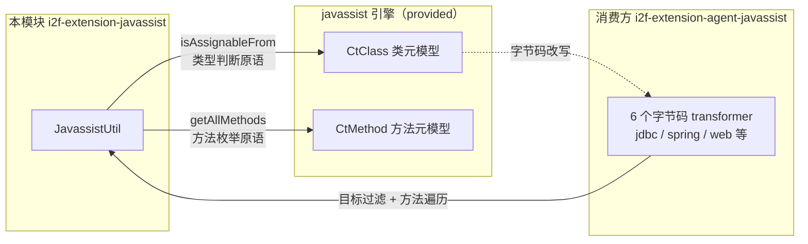

# i2f-extension-javassist

> Javassist 字节码工具底座（`org.javassist:javassist:3.28.0-GA`，provided）：单类 `JavassistUtil` 提供两个静态原语——`isAssignableFrom(CtClass, String)`（弥补 CtClass 缺失的「可赋值性」语义：名字精确匹配短路 + 递归超类链 + 递归接口链）与 `getAllMethods(CtClass)`（含父类/接口全层次的方法枚举，`LinkedHashMap<CtMethod, CtClass>` 保留每个方法的声明类）。被 `i2f-extension-agent-javassist` 的 6 个字节码 transformer 消费，是其「目标类型判断 + 全量方法枚举」的共享下沉。

## 模块路径

- `i2f-extension/i2f-extension-javassist/pom.xml`
- 相对于仓库根目录：`i2f-extension/i2f-extension-javassist`

## 模块依赖

### 三方依赖

| Maven 坐标 | scope | optional | 说明 |
|-----------|-------|----------|------|
| `org.javassist:javassist:3.28.0-GA` | provided | false（版本 POM 硬编码，根 POM 无 javassist 版本属性） | 字节码操作引擎：`CtClass`（类元模型）/`CtMethod`（方法元模型）；使用方需自行引入 |

### 传递依赖说明

- javassist 3.28.0-GA 自身的依赖：`com.sun:tools`（system + optional，仅 JDK8 附带场景，不传递）与 `junit`/`hamcrest-all`（test，不传递）——**compile 级零强制传递**，引入后不会向使用方传染任何依赖。
- lombok（`org.projectlombok:lombok`，compile，继承根 POM provided+optional 管理）：**声明但源码零引用**（无任何 `import lombok`、无注解使用）→ 冗余声明，可移除。

## 模块设计

### 包结构

```
i2f.extension.javassist
└── JavassistUtil          // 87 行单类，2 个 public static 方法
```

### 核心设计



### 双原语设计

- **`isAssignableFrom(CtClass clazz, String fullClassName)`**：JDK `Class` 自带 `isAssignableFrom`，但 javassist 的 `CtClass` 没有等价便捷 API（`CtClass.subtypeOf` 需要目标也是 CtClass 且签名不同）。本方法以全限定名字符串为目标实现同语义：
  - null 防御：`clazz == null` 或类名为 null 直接返回 `false`；
  - 名字精确匹配短路：`fullClassName.equals(clazz.getName())`；
  - 递归超类链：`getSuperclass()` 逐层上溯（`java.lang.Object` 之上为 null 终止）；
  - 递归接口链：`getInterfaces()` 深度优先遍历接口 DAG（接口可多继承）；
  - 两条链上的 `NotFoundException`（父类/接口不在 `ClassPool`）均被捕获并静默视为不存在。
- **`getAllMethods(CtClass clazz)`**：返回 `LinkedHashMap<CtMethod, CtClass>`（value = 声明该方法的那一层 CtClass），覆盖：
  - `getMethods()`：本类 + 继承的 public 方法（javassist 语义）；
  - `getDeclaredMethods()`：本类声明的全部方法（含 private/protected/default）；
  - 超类链递归与接口链递归的同类合并；
  - `LinkedHashMap` 保持插入序，方法按「本类 → 父类 → 接口」的声明层次顺序枚举。

### 设计意图

- **下沉共享原语**：agent 场景中每个 transformer 都需要「判断被加载的类是否为目标类型（如 `java.sql.Connection`）」与「枚举目标类全部可插桩方法」两个动作，将其从 6 个 transformer 中抽出沉淀为本模块，`agent-javassist` 只专注「目标选择 + 片段注入」。
- **防御式编程**：两个方法对 null 入参均有防御（返回 `false` / 空 Map），适配 agent 环境中类元信息不完整的常态。

## 模块目的

- 弥补 javassist `CtClass` API 相对 JDK `Class` 的语义缺口（`isAssignableFrom` 字符串目标版）。
- 为基于 javassist 的字节码增强场景（典型：Java Agent 类插桩）提供免重复实现的类型判断与方法全量枚举工具。
- 以 provided 弱依赖保持模块自身的零侵入（不向使用方传递任何三方依赖）。

## 模块功能

| 功能 | 方法 | 行为 |
| --- | --- | --- |
| 类型可赋值性判断 | `isAssignableFrom(CtClass, String)` | 沿超类链 + 接口链递归匹配全限定名，命中返回 true |
| 全量方法枚举 | `getAllMethods(CtClass)` | 收集本类 + 全部父类 + 全部接口的方法，value 保留声明类 |

## 模块主要使用方法

### Maven 引入

```xml
<!-- 根 POM dependencyManagement 已管理版本 -->
<dependency>
    <groupId>i2f.turbo</groupId>
    <artifactId>i2f-extension-javassist</artifactId>
    <version>1.0-jdk8</version>
</dependency>

<!-- javassist 为 provided，使用方需自行引入引擎 -->
<dependency>
    <groupId>org.javassist</groupId>
    <artifactId>javassist</artifactId>
    <version>3.28.0-GA</version>
    <scope>provided</scope>
</dependency>
```

### 典型用法（agent transformer 场景）

```java
import i2f.extension.javassist.JavassistUtil;
import javassist.ClassPool;
import javassist.CtClass;
import javassist.CtMethod;

ClassPool pool = ClassPool.getDefault();
CtClass cc = pool.get("com.demo.UserDao");

// 1. 判断是否为目标类型（Connection/Statement/Spring 上下文等）
if (JavassistUtil.isAssignableFrom(cc, "java.sql.Connection")) {
    // 2. 枚举全层次方法（含父类与接口声明）
    for (Map.Entry<CtMethod, CtClass> entry : JavassistUtil.getAllMethods(cc).entrySet()) {
        CtMethod method = entry.getKey();
        // 按 entry.getValue()（声明类）或 method.getName() 过滤，注入插桩片段
    }
}
```

### 注意事项

- javassist 为 provided：直接依赖本模块须同时自带 javassist，否则运行期 `NoClassDefFoundError`。
- 父类/接口不在 `ClassPool` 时（`NotFoundException`）方法会静默截断层次——如需完整层次请先确保 `pool.appendClassPath` 覆盖目标类路径。
- `getAllMethods` 会同时保留「父类声明 + 子类覆写」两个 `CtMethod` 键（javassist 中两者是不同对象），按签名去重需消费方自行处理。

## 模块特性总结

- **极简**：87 行单类 2 方法，零状态、全静态、可直接复用。
- **防御式**：null 入参安全（返回 false / 空 Map），适配 agent 环境的元信息缺失常态。
- **全层次覆盖**：类型判断与方法枚举均贯穿「本类 + 超类链 + 接口 DAG」。
- **保序**：`LinkedHashMap` 令方法按声明层次顺序（本类 → 父类 → 接口）枚举。
- **零传递**：javassist provided 且 compile 级零强制传递，引入无依赖传染。
- **下沉底座**：与 `i2f-agent`（装配）、`i2f-compiler`（编译）共同构成 `i2f-extension-agent-javassist` 的三层能力底座。

## 模块瑕疵或错误

> 以下为源码静态分析识别的问题或潜在问题（依项目规则不做运行时实证）。

1. **空 catch 静默吞异常**：`isAssignableFrom`（两处）与 `getAllMethods`（两处）的 `catch (Exception e) {}` 把 `NotFoundException` 静默当作「无父类/无接口」——层次被截断无任何告警，agent 场景中可能因此漏判目标类型或漏枚举方法。
2. **无环保护**：两方法的递归均未做访问去重/深度上限。Java 语言层不允许继承环，但 javassist 处理的是原始字节码，畸形或恶意构造的类层次理论上可触发 `StackOverflowError`；接口 DAG 的共享父接口（如多接口共同继承 `java.lang.Comparable`）也会被重复遍历。
3. **重复枚举**：`getAllMethods` 的 `getMethods()`（已含继承 public 方法）与父类递归、接口递归存在覆盖重叠；「父类声明 + 子类覆写」同签名产生两个不同 `CtMethod` 键均保留——消费方按每键一次插桩时可能对同一逻辑方法重复插桩，需自行按签名去重。
4. **value 覆盖语义含糊**：`ret.put(method, clazz)`（本类）先写入、`ret.putAll(next)` 父类结果后并入——键不同不覆盖、同键覆盖时父类声明胜出，语义未在 javadoc 说明（本模块也无 javadoc）。
5. **递归无缓存**：多子类共享同一父类时反复遍历同一层次；agent 场景类量有限影响不大，但未提供缓存开关。
6. **lombok 冗余声明**：POM 声明 lombok 但源码零引用（无注解、无 import），可移除。
7. **版本硬编码**：javassist 3.28.0-GA（2019 年）为 POM 硬编码，根 POM 无版本属性统一管理；姊妹模块 `i2f-extension-agent-javassist` 同样硬编码同版本，升级需多点同步修改。
8. **零测试**：无任何测试用例；亦无 javadoc（仅类头 `@author/@date/@desc` 模板注释）。
9. **API 强耦合引擎类型**：公共签名直接暴露 `CtClass`/`CtMethod`——对工具模块本身合理，但意味着使用方同样需要 javassist 源码级依赖（与 provided 弱依赖定位一致的取舍）。

## 姊妹模块关系

| 模块 | 关系 |
| --- | --- |
| `i2f-extension-agent-javassist` | 唯一代码级消费方：6 个 transformer（jdbc×2 / spring×3 / web×1）import `JavassistUtil`，POM L27 compile 依赖；其文档明确本模块为「字节码工具下沉」层 |
| `i2f-extension-cglib` | 同属 wiki「字节码」分类（wiki.md L153），但面向 cglib 代理生成而非 javassist CtClass 元模型操作 |
| `i2f-agent`（i2f-jdk） | 平行的另一下沉层：装配与 `InstrumentTransformerFeature` 契约；两者共同支撑 agent-javassist |

## 消费方情况

| 消费方 | 形式 |
| --- | --- |
| `i2f-extension-agent-javassist` | POM compile 依赖（L27）+ 6 源文件 import（ConnectionSql/StatementSql/SpringApplicationContextHold/SpringApplicationHold/SpringBeanHold/XxeGuard transformer） |
| 根 POM `dependencyManagement` | L1105-L1107 版本 `${i2f.version}` 登记 |
| `i2f-extension-all` | L183-L186 聚合分发包成员 |
| `i2f-extension` 组 POM | L58 模块声明 |
| bash 分发产物 | `backup-jdk8/jdk17` 与 `deploy-jdk8/jdk17` 各含 `i2f-extension-javassist-1.0-jdk8/jdk17.jar`（共 4 个） |
| wiki 文档 | wiki.md L153（字节码分类）、docs/module-i2f-extension.md L151、agent-javassist 文档 3 处引用 |
