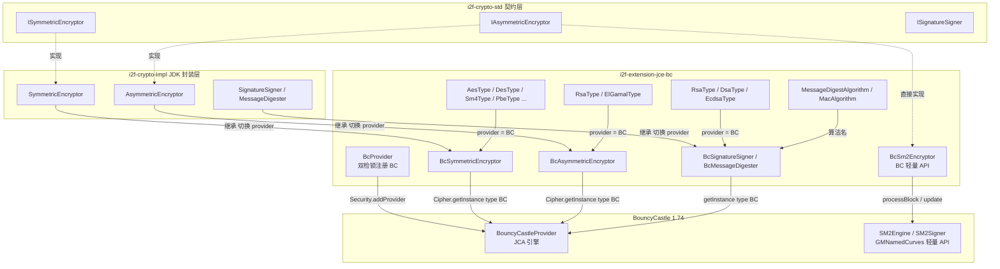

# i2f-extension-jce-bc

> BouncyCastle 加密增强适配器（`bcprov-jdk15to18:1.74`，provided）：`BcProvider` 反射注册 BC 安全提供者后，`BcSymmetricEncryptor`/`BcAsymmetricEncryptor`/`BcSignatureSigner`/`BcMessageDigester` 继承 `i2f-crypto-impl` 的 JDK JCE 封装基类、把 provider 切换为 `BC`，配套 8 个 BC 版算法枚举（AES/DES/DESede/SM4/PBE/RSA/ElGamal/DSA/ECDSA），解锁 JDK 默认不支持的国密 SM4、SHA3、SHAKE 等算法；`BcSm2Encryptor` 直接走 BC 轻量 API（`GMNamedCurves` + `SM2Engine`/`SM2Signer`）实现 SM2 加密与签名一体。与 `i2f-extension-jce-sm-antherd`（antherd 轻量国密库）构成国密双引擎。

## 模块路径

- `i2f-extension/i2f-extension-jce-bc/pom.xml`
- 相对于仓库根目录：`i2f-extension/i2f-extension-jce-bc`

## 模块依赖

### 内部依赖（compile）

| Maven 坐标 | scope | optional | 说明 |
|-----------|-------|----------|------|
| `i2f.turbo:i2f-crypto-impl:1.0-jdk8` | compile | false | JDK JCE 封装层：`SymmetricEncryptor`/`AsymmetricEncryptor`/`SignatureSigner`/`MessageDigester` 四个基类（Bc* 子类继承并切换 providerName）+ `Encryptor` 静态工厂 + `SecureRandomAlgorithm`；传递引入 `i2f-crypto-std`（契约）、`i2f-array`、`i2f-bytes`、`i2f-codec-impl` |
| `i2f.turbo:i2f-codec-impl:1.0-jdk8` | compile | false | 编解码实现层：`BcSm2Encryptor` 直接使用 `HexStringByteCodec` 做 SM2 密钥 hex 编解码（该依赖亦经 crypto-impl 传递，此处为显式再声明） |

### 三方依赖

| Maven 坐标 | scope | optional | 说明 |
|-----------|-------|----------|------|
| `org.bouncycastle:bcprov-jdk15to18:1.74` | provided | false（版本 POM 硬编码，根 POM 无统一管理） | BouncyCastle 加密引擎：JCA Provider（`BouncyCastleProvider`）+ 轻量 API（`SM2Engine`/`SM2Signer`/`GMNamedCurves`）；自身零强制传递依赖，使用方需按 `BcProvider.MAVEN_DEPENDENCY` 常量自备 |

> 本模块未声明 lombok（区别于同组多数模块），`BcSm2Encryptor` 的 equals/hashCode/toString 为手写。

## 模块设计

### 包结构

| 包 | 类 | 职责 |
|----|----|------|
| `i2f.extension.jce.bc` | `BcProvider` | BC 安全提供者单例注册（双检锁 + `Class.forName` 反射装配） |
| `...bc.digest.md` | `BcMessageDigester` | 摘要器：17 个 `Supplier` 预置常量（MD5 → Whirlpool） |
| `...bc.encrypt.symmetric` | `BcSymmetricEncryptor` + `AesType`/`DesType`/`DesEdeType`/`Sm4Type`/`PbeType` | 对称加密：基类切换 provider + 5 个 BC 版算法枚举 + `genKeyEncryptor`/`genPbeKeyEncryptor` 工厂 |
| `...bc.encrypt.asymmetric` | `BcAsymmetricEncryptor` + `BcSm2Encryptor` + `RsaType`/`ElGamalType` | 非对称加密：JCA 路线（RSA/ElGamal）+ BC 轻量 API 路线（SM2 加密签名一体） |
| `...bc.signature` | `BcSignatureSigner` + `RsaType`/`DsaType`/`EcdsaType` | 签名：基类切换 provider + 3 个签名算法枚举 |
| `...bc.supports` | `MessageDigestAlgorithm`/`MacAlgorithm` | BC 专属算法名枚举（17 摘要 + 16 MAC） |
| 各包 `*.test` | 3 个 main 方法测试 | 冒烟验证（位于 `src/main`，非自动化断言） |

### 核心架构



### 设计要点

1. **Provider 切换式继承**：`BcSymmetricEncryptor` 等四个子类不重写任何加密逻辑，仅在各构造器中把基类的 `providerName` 字段设为 `BcProvider.PROVIDER_NAME`（"BC"），基类的 `Encryptor.cipherOf(type, providerName)` 便走 `Cipher.getInstance(type, "BC")`——JDK 版与 BC 版共享同一套 JCA 封装代码，仅引擎不同。
2. **静态块自注册**：每个 Bc* 类的静态块调用 `BcProvider.registryProvider()`，保证「只要用到本模块任何加密类，BC 引擎就已注册」，使用方无需手工注册提供者。
3. **`BcProvider` 的防御式装配**：优先复用 JVM 已注册的名为 `BC` 的 Provider（`Security.getProvider`），否则反射加载 `org.bouncycastle.jce.provider.BouncyCastleProvider` 实例并 `Security.addProvider`；`MAVEN_DEPENDENCY` 常量自描述所需 Maven 坐标（provided 弱依赖的友善提示）。
4. **BC 版枚举镜像**：`AesType`/`RsaType` 等枚举与 crypto-impl 的 JDK 同名枚举同构（type/noPadding/密钥长度元数据），仅 `provider()` 返回 "BC"；`AesType` 借 `Encryptor.algorithmNameOf` 组装「算法/模式/填充」三元组。
5. **SM2 双路线**：`BcAsymmetricEncryptor`（JCA 路线，RSA/ElGamal）与 `BcSm2Encryptor`（BC 轻量 API 路线）并列——SM2 未走 JCA，因为 BC 对 SM2 的 JCA 支持不完备，轻量 API 可完整控制曲线参数（`GMNamedCurves.getByName("sm2p256v1")`）、`ParametersWithID`（国密 UserID）与 `SM2Signer`。
6. **密钥的字符串化**：`BcSm2Encryptor` 以 hex 字符串持有公私钥（非压缩公钥点 65 字节 / 私钥 D 标量），`BytesPublicKey`/`BytesPrivateKey`（crypto-std 的轻量密钥包装）桥接 JCA `KeyPair` 世界。
7. **算法能力面**：摘要 17 种（含 SM3/SHA3 全系/SHAKE/Tiger/Whirlpool）、MAC 16 种（含 HmacSM3/HmacRIPEMD128~320）、对称 5 族（AES 128/192/256、DES、DESede、SM4、PBE 7 变体）、非对称 3 族（RSA 9 模式、ElGamal 7 模式、SM2）、签名 3 族（RSA/DSA/ECDSA 摘要组合）。

## 模块目的

- 在不引入新依赖树的前提下（bcprov provided + 零传递），为 `i2f-crypto-std`/`i2f-crypto-impl` 体系补上 BouncyCastle 引擎：国密 SM2/SM3/SM4、SHA3/SHAKE、Tiger/Whirlpool、RIPEMD 系、ElGamal 等 JDK 默认 Provider 不支持或受出口管制的算法。
- 保持与 JDK 版完全一致的调用面：`Bc*` 类与 crypto-impl 同名同构，使用方从 JDK 版切换到 BC 版只需换类名前缀，零学习成本。
- 为 `i2f-extension-swl`（安全传输层）与 `i2f-tools-encrypt`（加密工具菜单）提供 BC 引擎底座。

## 模块功能

1. **BC 提供者管理**：`BcProvider.registryProvider()` 幂等注册（已注册则复用），`PROVIDER_NAME`/`PROVIDER_CLASS_NAME`/`MAVEN_DEPENDENCY` 常量自描述。
2. **对称加密**：`BcSymmetricEncryptor.genKeyEncryptor(algorithm[, keyBytes[, vectorBytes[, rng]])` 一键生成含密钥实例（AES/DES/DESede/SM4/PBE）；`genPbeKeyEncryptor` 为 PBE 提供迭代次数参数。
3. **非对称加密**：`BcAsymmetricEncryptor.genKeyEncryptor(RsaType/ElGamalType, ...)` 同构工厂 + `keyPairOf`/`publicKeyOf`/`privateKeyOf` 密钥装配。
4. **SM2 加密与签名**：`BcSm2Encryptor` 支持密钥生成（`genKeyPair`）、加解密（`encrypt`/`decrypt`）、签名验签（`sign`/`verify`）、四种密钥形态互转（`KeyPair`/bytes/hex string/`AsymKeyPair`），`std`（曲线名）与 `pid`（UserID）可配置。
5. **摘要**：`BcMessageDigester.MD5`/`SHA256`/`SM3`/`SHA3_512`/`SHAKE_256`/`Tiger`/`Whirlpool` 等 17 个 `Supplier` 常量即取即用。
6. **签名**：`BcSignatureSigner.genKeySignatureSigner(RsaType/DsaType/EcdsaType, secretBytes, rng)` 生成含密钥对的签名器。
7. **算法元数据**：`supports` 包两组枚举可作 BC 能力清单查询；各 `*Type` 枚举的 `secretBytesLen()`/`vectorBytesLen()`/`SUPPORTS_MODE`/`SUPPORTS_PADDING` 描述密钥与参数约束。

## 模块主要使用方法

### Maven 引入

```xml
<dependency>
    <groupId>i2f.turbo</groupId>
    <artifactId>i2f-extension-jce-bc</artifactId>
    <version>1.0-jdk8</version>
</dependency>

<!-- 引擎为 provided，使用方需自备（与 BcProvider.MAVEN_DEPENDENCY 一致） -->
<dependency>
    <groupId>org.bouncycastle</groupId>
    <artifactId>bcprov-jdk15to18</artifactId>
    <version>1.74</version>
</dependency>
```

### 对称加密（AES，BC 引擎）

```java
// 一键生成：算法 + 密钥种子 + 向量种子 + 随机算法
SymmetricEncryptor encryptor = BcSymmetricEncryptor.genKeyEncryptor(
        AesType.ECB_PKCS5Padding, "hello".getBytes(), "hello".getBytes(),
        SecureRandomAlgorithm.SHA1PRNG.text());
byte[] enc = encryptor.encrypt("hello world".getBytes());
byte[] dec = encryptor.decrypt(enc);

// SM4（国密，JDK 默认引擎不支持）
encryptor = BcSymmetricEncryptor.genKeyEncryptor(Sm4Type.ECB_PKCS5PADDING,
        "hello".getBytes(), "hello".getBytes(),
        SecureRandomAlgorithm.SHA1PRNG.text());
```

### SM2 加密与签名（BC 轻量 API）

```java
BcSm2Encryptor sm2 = new BcSm2Encryptor(BcSm2Encryptor.genKeyPair());
// 也可由 hex 字符串构造：new BcSm2Encryptor(publicKeyHex, privateKeyHex)

byte[] enc = sm2.encrypt("hello".getBytes());          // SM2Engine 默认 C1C2C3
byte[] dec = sm2.decrypt(enc);

byte[] sign = sm2.sign("hello".getBytes());            // SM2Signer + ParametersWithID(pid)
boolean ok = sm2.verify(sign, "hello".getBytes());

// 可选定制：曲线与 UserID
sm2.setStd("sm2p256v1");
sm2.setPid("1234567812345678");
```

### 摘要

```java
// Supplier 常量即取即用（每次 get 生成新实例）
byte[] digest = BcMessageDigester.SM3.digest("hello".getBytes("UTF-8"));
byte[] sha3 = BcMessageDigester.SHA3_256.digest("hello".getBytes("UTF-8"));
```

### 签名

```java
SignatureSigner signer = BcSignatureSigner.genKeySignatureSigner(
        RsaType.SHA256withRSA, "hello".getBytes(),
        SecureRandomAlgorithm.SHA1PRNG.text());
byte[] sign = signer.sign(data);
boolean ok = signer.verify(sign, data);
```

### 注意事项

- **引擎必须 provided 自备**：运行时缺失 bcprov 时，`BcProvider.registryProvider()` 反射失败仅 `printStackTrace`，后续 `Cipher.getInstance(type, "BC")` 抛 `NoSuchProviderException`。
- **工厂方法返回基类类型**：`genKeyEncryptor` 等返回 `SymmetricEncryptor`/`AsymmetricEncryptor`/`SignatureSigner`（基类实例，非 Bc 子类），provider 已正确设为 BC，但 `instanceof BcSymmetricEncryptor` 为 false。
- **SM2 密钥格式**：公钥为 65 字节非压缩点 hex、私钥为 D 标量 hex；`BigInteger.toByteArray()` 可能在 D 高位为 1 时补前导 `0x00`，与外部系统交换密钥时注意长度规范化。
- **PBE 路线的 provider 不一致**：`genPbeKeyEncryptor` 内部 `Encryptor.genPbeSecretKey(name, null, keyBytes)` 显式传 null provider（走 JDK 默认引擎），与「BC 增强」名义不符（见瑕疵第 2 条）。
- **线程安全**：`BcSm2Encryptor` 的实例字段（密钥、std、pid）无同步保护，get 引擎过程中还可能回写 `secureRandomAlgorithmName`（见瑕疵第 5 条）；多线程请每次新建实例或外置锁。

## 模块特性总结

- **Provider 切换式增强**：不复制封装代码，仅换引擎，JDK 版与 BC 版 API 完全同构。
- **静态自注册**：用到即注册，免手工 `Security.addProvider`。
- **国密全家桶**：SM2（加密+签名+UserID）、SM3（摘要+HMAC）、SM4（对称）。
- **冷门算法解锁**：SHA3 全系、SHAKE、Tiger、Whirlpool、RIPEMD160、ElGamal、ISO10126Padding。
- **弱依赖设计**：bcprov provided + 零传递 + `MAVEN_DEPENDENCY` 常量自描述。
- **四种密钥形态互通**：`KeyPair` ↔ bytes ↔ hex string ↔ `AsymKeyPair`。
- **密钥长度元数据**：枚举携带合法密钥/向量长度，便于上层校验与生成。
- **无 lombok 依赖**：全模块手写 equals/hashCode/toString。

## 模块瑕疵或错误

> 以下为源码静态分析识别的问题或潜在问题（依项目规则不做运行时实证）。

1. **`BcProvider.registryProvider` 双检锁两段锁分离**：第一个 `synchronized` 块内查 `Security.getProvider` 命中即 return（但该块外的 `if (BC_PROVIDER != null) return` 先行短路，进入第一块说明字段为 null）；未命中时跳出第一块、在**第二个独立的** `synchronized` 块中反射注册——两段锁不是同一个临界区，并发下可能多线程同时进入第二段重复 `addProvider`（`Security.addProvider` 对同名返回 -1，BC_PROVIDER 最终仍指向同一实例，故多为无害竞态，但写法不严谨）。
2. **PBE 工厂的 provider 丢失**：`BcSymmetricEncryptor.genPbeKeyEncryptor` 调用 `Encryptor.genPbeSecretKey(algorithm.algorithmName(), null, keyBytes)` 显式传 null provider，`PBEWithHmacSHAAndIDEA-CBC` 等 BC 专属 PBE 变体在 JDK 默认引擎上不存在，将抛 `NoSuchAlgorithmException`；而枚举 `provider()` 声称返回 "BC"，名实不符。
3. **`BcSm2Encryptor.privateKeyOf` 参数名错位**：`privateKeyOf(byte[] publicKey)` 参数名为 publicKey（L83-85），实为私钥字节——复制粘贴笔误，功能正确但误导阅读。
4. **`SM2Engine` 默认 C1C2C3**：`new SM2Engine()` 未显式指定 Mode，BC 1.74 默认 `C1C2C3`（旧排列）；国密 GM/T 0003.4 标准推荐 `C1C3C2`，与遵循新标准的第三方系统（银联/政务）互操作可能解密失败。
5. **查询方法产生写副作用**：`BcSm2Encryptor` 的 `getEncryptEngine`/`getDecryptEngine`/`getSignSigner`/`getVerifySigner` 在 `secureRandomAlgorithmName` 为空串时直接给**实例字段**赋值回退值（L117-119 等四处），getter 语义的调用方无意间修改共享状态；非线程安全场景下竞态。
6. **null 密钥无防御**：`BcSm2Encryptor.getPublicKey()`/`getPrivateKey()`（L148/L159）在字段为 null 时 `HexStringByteCodec.INSTANCE.decode(null)` 直接 NPE；`getEncryptEngine` 对 null publicKey 同样 NPE。
7. **`pid.getBytes()` 平台默认字符集**：SM2 `ParametersWithID` 的 UserID 用平台默认字符集编码（L262/L276），跨平台（GBK/UTF-8）时同一 pid 产生不同签名输入，验签失败。
8. **工厂方法返回基类而非 Bc 子类**：`BcSymmetricEncryptor.genKeyEncryptor` 返回 `new SymmetricEncryptor(...)`（基类），`BcAsymmetricEncryptor.genKeyEncryptor`/`BcSignatureSigner.genKeySignatureSigner` 同理——Bc 前缀的类型承诺落空，`setProviderName` 之外的 Bc 特化（如静态块语义）对返回实例不适用。
9. **`clazz.newInstance()` 已废弃**：`BcProvider` L47 使用 JDK9 起废弃的 `Class.newInstance()`（传播任意受检异常无类型约束），应换 `getDeclaredConstructor().newInstance()`；JDK8 下仅是风格问题。
10. **`BcProvider` 注册失败仅打印堆栈**：L51-53 catch 后 `e.printStackTrace()` 不抛出、不记录字段，模块在无 bcprov 的环境「静默降级」到延迟爆炸（NoSuchProviderException），错误源头难以定位。
11. **枚举注释复制失真**：`AesType`/`Sm4Type` 等注释沿用 DES 的「不足8位补足8位」表述（AES/SM4 块为 16 字节 128 位），注释与实际块大小不符。
12. **`DesType.SECRET_BYTES_LEN = {56, 64}` 标注存疑**：DES 有效密钥位为 56（存储 64 含校验位），`vectorBytesLen` 标注 {56} 与 DES 64 位块不符，按此元数据生成向量可能长度不足。
13. **`BcMessageDigester` 的 MD5/SHA 系走 BC 无增量价值**：MD5、SHA-1、SHA256 等 JDK 已内置，经 BC 提供只是换实现，性能与结果一致；BC 版常量的真正价值仅在 SM3/SHA3/SHAKE/Tiger/Whirlpool 等约 8 项。
14. **测试为 main 方法冒烟**：3 个测试类位于 `src/main`（随产物分发）、仅 `System.out.println` 打印布尔值无断言，不可自动化回归。
15. **SM2 equals/hashCode 含密钥**：`BcSm2Encryptor.hashCode()` 把公私钥 hex 纳入哈希，密钥材料进入通用哈希容器（HashMap 桶位置）存在轻微侧信道面（低危）。

## 姊妹模块对比

| 维度 | `i2f-extension-jce-bc`（本模块） | `i2f-extension-jce-sm-antherd` | `i2f-jdk/i2f-crypto-impl` |
|------|------|------|------|
| 引擎 | BouncyCastle 1.74（JCA + 轻量 API 双路线） | `com.antherd:sm-crypto:0.3.2.1`（Nashorn 执行内嵌 JS 的国密桥接库） | JDK 内置 JCE（SUN provider） |
| 算法面 | 全科：国密 + SHA3/SHAKE/Tiger/Whirlpool + RSA/ElGamal/DSA/ECDSA + AES/DES/PBE | 仅国密 SM2/SM3/SM4 | JDK 原生全套（无 SM/SHA3） |
| 结构模式 | 继承 crypto-impl 基类切 provider + SM2 独立轻量实现 | 平行四件套（Provider/摘要/对称/签名）独立实现 | 基类本体 |
| 引擎体量 | bcprov 约 6.5MB | sm-crypto 约 31KB（另需 JS 引擎） | 零 |
| 适用场景 | 已引入 BC 或需非国密冷门算法 | 只要国密且追求轻量 | 无三方依赖要求 |

## 消费方情况

| 消费方 | 形式 | 说明 |
|--------|------|------|
| `i2f-extension-swl` | POM compile + 7 个实现类 | `SwlBcSm2AsymmetricEncryptor`/`SwlBcSm4SymmetricEncryptor`/`SwlBcAes256SymmetricEncryptor`/`SwlBcRsa2048AsymmetricEncryptor`/`SwlBcSm3MessageDigester`/`SwlBcSha512MessageDigester` 等：包装为 SWL 的 String 层门面（hex/base64 编码 + `SwlException` 统一异常） |
| `i2f-tools-encrypt` | POM compile + 30+ 菜单 Handler | `menus/bc/digest`（SM3/Tiger/Whirlpool/SHA3 系/SHAKE 系/HMAC 系 14 个）+ `menus/bc/encrypt`（SM2 加解密/密钥生成/签名验签、SM4 编解码/密钥生成 10 个）：`BcMessageDigester.SM3.digest(...)` 等直连调用 |
| 根 POM | L1110 dependencyManagement | 版本统一管理（1.0-jdk8） |
| `i2f-extension-all` | L189 dependencies | 聚合分发 |
| `bash` 分发 | 4 个 jar | backup/deploy × jdk8/jdk17 |
| wiki 文档 | 多处 | `wiki.md` 加密分类、`crypto-std`/`crypto-impl`/`codec-impl` 文档的下游消费方章节（其中 crypto-impl 文档 L209 将本模块引擎误记为 `bcprov-jdk18on`，实为 `bcprov-jdk15to18`） |
