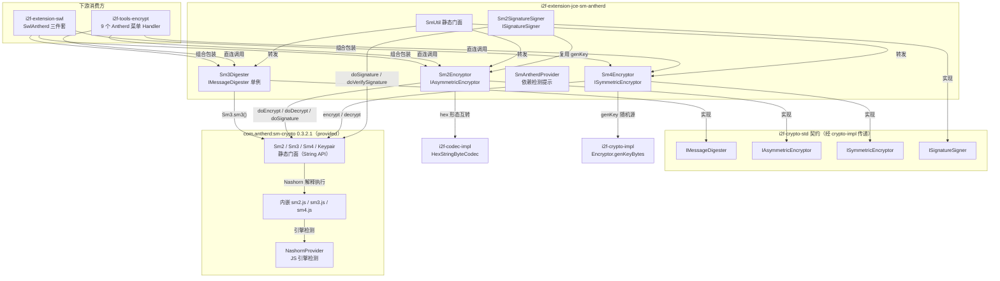

# i2f-extension-jce-sm-antherd 模块文档

> `com.antherd:sm-crypto:0.3.2.1-RELEASE`（provided，约 31KB）的国密三算法契约适配器——antherd 库内嵌 `sm2.js`/`sm3.js`/`sm4.js`（npm 版 sm-crypto）并经 **Nashorn JavaScript 引擎**（`javax.script`）解释执行，本模块把这层 JS 桥接包装为 `i2f-crypto-std` 四大契约：`Sm2Encryptor`（`IAsymmetricEncryptor`，加解密 + 签名验签一体）、`Sm4Encryptor`（`ISymmetricEncryptor`）、`Sm3Digester`（`IMessageDigester`，单例）、`Sm2SignatureSigner`（`ISignatureSigner`），密钥与密文统一 **hex 字符串**形态；`SmUtil` 提供 6 方法静态门面；每个功能类静态块自检运行环境（`NashornProvider.printNonNashorn()` 检测 JS 引擎 + `SmAntherdProvider.printNonDependency()` 检测算法库），缺失时以 `System.err` 打印 Maven/NPM 依赖提示。JDK8-14 自带 nashorn，JDK15+ 需自行补充 `nashorn-core:15.4`（provided + optional）。

## 模块路径

`i2f-extension/i2f-extension-jce-sm-antherd`

## 模块依赖

| 依赖 | scope | 说明 |
|------|-------|------|
| `i2f.turbo:i2f-crypto-impl` | compile | 仅 `Sm4Encryptor.genKey` 复用 `Encryptor.genKeyBytes`（SHA1PRNG 随机源生成 128 位密钥）与 `SecureRandomAlgorithm`；经其传递引入 `i2f-crypto-std` 契约与密钥模型 |
| `i2f.turbo:i2f-codec-impl` | compile | `HexStringByteCodec`：密钥 hex 字符串 ↔ bytes 互转（`Sm2Encryptor`/`Sm4Encryptor` 的形态转换基础） |
| `com.antherd:sm-crypto:0.3.2.1-RELEASE` | provided | 国密三算法引擎：内嵌 3 个 JS 源文件 + `NashornProvider` 引擎检测 + `Sm2`/`Sm3`/`Sm4`/`Keypair` 等静态门面，版本由本模块 POM 硬编码（未入根 POM 管理） |
| `org.openjdk.nashorn:nashorn-core:15.4` | provided + optional | Java 15+ 环境补回被 JDK 移除的 Nashorn JS 引擎（antherd 库的运行前提）；JDK8-14 无需引入 |
| `org.projectlombok:lombok` | provided（根 POM 管理 1.18.44） | 仅 `Sm2Encryptor` 的 `@Data` 注解（与手写 getter/setter/equals/hashCode/toString 冗余并存） |

## 模块设计

### 包结构

| 类 | 行数 | 职责 |
|----|------|------|
| `i2f.extension.jce.sm.antherd.SmAntherdProvider` | 77 | 依赖存在性检测（双 ClassLoader 尝试加载 `com.antherd.smcrypto.sm2.Sm2`），缺失时一次性打印 Maven + NPM 依赖提示；`MAVEN_DEPENDENCY`/`NPM_DEPENDENCY` 常量自描述 |
| `i2f.extension.jce.sm.antherd.SmUtil` | 47 | 静态门面：`sm3`/`sm4Encrypt`/`sm4Decrypt`/`sm2Encrypt`/`sm2Decrypt`/`sm2Signature`/`sm2Verify` 共 6 方法（全 String 进出） |
| `digest.Sm3Digester` | 67 | `IMessageDigester` 实现，`INSTANCE` 单例；`digest(String)` 委托 `Sm3.sm3(str)` 返回 hex；`verify(sign, str)` 以 `equalsIgnoreCase` 比对 |
| `encrypt.asymmetric.Sm2Encryptor` | 289 | `IAsymmetricEncryptor` 实现（本模块最大类）：hex 字符串持有公私钥、四种密钥形态互转（KeyPair/bytes/String/AsymKeyPair 各 8 组读写方法）、`genKey`/`genKeyPair` 密钥生成 |
| `encrypt.symmetric.Sm4Encryptor` | 153 | `ISymmetricEncryptor` 实现：`keyHex` 持有密钥；`genKey` 走 JDK `Encryptor.genKeyBytes`（SHA1PRNG）而非 antherd 的 `Sm4.generateKeyHex()` |
| `signature.Sm2SignatureSigner` | 121 | `ISignatureSigner` 实现：密钥生成复用 `Sm2Encryptor.genKey`；`sign`/`verify` 委托 `Sm2.doSignature`/`doVerifySignature` |
| `test.TestSm`（src/test） | 86 | main 方法四段冒烟（SM3/SM4/SM2/SM2 签名），位于 `src/test` 不随产物分发 |

### 架构图



### 设计要点

1. **JS 引擎桥接本质**：antherd jar 内嵌 3 个 JS 源文件，全部算法计算经 Nashorn（`javax.script.ScriptEngine`）解释执行——这是它与 `i2f-extension-jce-bc`（纯 Java BC）和 `i2f-jdk/i2f-sm-crypto`（纯 Java 自研）的本质差异；由此带来「约 31KB 极小体积」与「JS 解释执行性能损耗 + JS 引擎环境依赖」的双面性。
2. **契约适配而非算法实现**：本模块自身零算法逻辑，四件套全部转发 antherd 静态门面；hex 字符串是密钥与密文的统一形态（JS 库的本位形态）。
3. **String 层为本位、byte[] 层为 UTF-8 桥接**：antherd API 全为 String 进出，`IAsymmetricEncryptor`/`ISymmetricEncryptor` 等契约的 byte[] 方法经 `new String(data, "UTF-8")` / `getBytes("UTF-8")` 桥接——密文即 hex 文本字节，任意二进制数据不安全。
4. **静态块环境自检**：每个功能类 static 块先调 `NashornProvider.printNonNashorn()`（antherd 提供，检测 JDK nashorn 与 OpenJDK nashorn 双类名）再调 `SmAntherdProvider.printNonDependency()`（本模块，检测 antherd 类存在）——类加载即引导补依赖，双提示均只打印一次。
5. **密钥四形态互转**：`Sm2Encryptor` 实现 `IAsymmetricEncryptor` 的 KeyPair（`BytesPublicKey`/`BytesPrivateKey` 轻量包装）/ bytes / hex String / `AsymKeyPair` 共 8 组读写方法，内部唯一真相是 `pubKey`/`priKey` 两个 hex 字符串字段。
6. **双入口签名能力**：`Sm2Encryptor`（因接口继承自带 sign/verify）与 `Sm2SignatureSigner`（专职签名）都能完成 SM2 签名验签，`Sm2SignatureSigner` 的密钥生成直接复用前者。
7. **检测三态控制**：`SmAntherdProvider` 用 `printed`/`checked`/`status` 三个 `AtomicBoolean` 分别控制「提示只打印一次」「检测只执行一次」「结果缓存」。

## 模块目的

以最小代价为 i2f 体系补齐国密三算法（SM2/SM3/SM4）的 `i2f-crypto-std` 契约实现：在自带 nashorn 的 JDK8-14 环境，仅一个 31KB 的 provided jar 即可获得全部能力；为 `i2f-extension-swl`（国密三件套）与 `i2f-tools-encrypt`（9 个菜单）提供与 BC 版平行的另一条国密引擎路线，使上层「JDK / BC / antherd」三套实现可整体互换。

## 模块功能

1. **SM3 摘要**：`Sm3Digester.INSTANCE.digest(String)` 返回 hex 摘要；`verify(sign, str)` 忽略大小写比对；byte[]/InputStream 重载经 UTF-8 桥接。
2. **SM2 密钥对生成**：`genKey()` 返回 antherd 的 hex `Keypair`；`genKeyPair()` 转为 JDK `KeyPair`（`BytesPublicKey`/`BytesPrivateKey` 包装）。
3. **SM2 加解密**：`Sm2Encryptor.encrypt/decrypt`（String 层直接转发；byte[] 层 UTF-8 桥接），密文为 hex 字符串。
4. **SM2 签名验签**：`Sm2Encryptor.sign/verify` 与 `Sm2SignatureSigner.sign/verify` 双入口。
5. **SM4 对称加解密**：`Sm4Encryptor.encrypt/decrypt`，密钥与密文均为 hex 字符串。
6. **SM4 密钥生成**：`genKey()` 走 JDK `Encryptor.genKeyBytes`（SHA1PRNG）生成 128 位密钥后 hex 化。
7. **密钥形态互转**：KeyPair / bytes / hex String / `AsymKeyPair` 四形态读写。
8. **运行环境自检提示**：JS 引擎缺失或 antherd 库缺失时，类加载阶段 `System.err` 打印补依赖指引（Maven / NPM 双格式）。

## 模块主要使用方法

Maven 引入（三方依赖需使用方自行补齐）：

```xml
<dependency>
    <groupId>i2f.turbo</groupId>
    <artifactId>i2f-extension-jce-sm-antherd</artifactId>
    <version>1.0-jdk8</version>
</dependency>
<dependency>
    <groupId>com.antherd</groupId>
    <artifactId>sm-crypto</artifactId>
    <version>0.3.2.1-RELEASE</version>
</dependency>
<!-- 仅 Java 15+ 环境需要：补回被 JDK 移除的 Nashorn JS 引擎 -->
<dependency>
    <groupId>org.openjdk.nashorn</groupId>
    <artifactId>nashorn-core</artifactId>
    <version>15.4</version>
</dependency>
```

门面速用（全 String 进出）：

```java
String hash = SmUtil.sm3("hello");
String key = Sm4Encryptor.genKey();
String enc = SmUtil.sm4Encrypt("hello", key);
assert "hello".equals(SmUtil.sm4Decrypt(enc, key));

Keypair kp = Sm2Encryptor.genKey();
String enc2 = SmUtil.sm2Encrypt("hello", kp.getPublicKey());
assert "hello".equals(SmUtil.sm2Decrypt(enc2, kp.getPrivateKey()));
String sign = SmUtil.sm2Signature("hello", kp.getPrivateKey());
assert SmUtil.sm2Verify(sign, "hello", kp.getPublicKey());
```

契约编程（面向 `i2f-crypto-std` 接口，可与其他实现互换）：

```java
IAsymmetricEncryptor encryptor = new Sm2Encryptor(kp.getPublicKey(), kp.getPrivateKey());
byte[] encBytes = encryptor.encrypt("hello".getBytes(StandardCharsets.UTF_8));
byte[] decBytes = encryptor.decrypt(encBytes);
byte[] signBytes = encryptor.sign("hello".getBytes(StandardCharsets.UTF_8));
boolean ok = encryptor.verify(signBytes, "hello".getBytes(StandardCharsets.UTF_8));
```

注意事项：

1. **JDK15+ 必须补 `nashorn-core`**，否则首次调用抛 `ScriptException`/引擎缺失；JDK8-14 无需任何额外依赖。
2. **byte[] 层 API 仅适用于 UTF-8 文本**：二进制数据（含非法 UTF-8 序列）经 String 桥接会损坏；密文/摘要的 byte[] 形态实为 hex 文本字节。
3. **性能敏感场景慎用**：每次调用都经 Nashorn 解释执行 JS，吞吐远低于 BC/纯 Java 实现（`i2f-jdk/i2f-sm-crypto` 文档载有 1000 次性能基准对照）。
4. `cipherMode` 字段（C1C2C3/C1C3C2）**未接线**，加解密模式实际由 antherd 默认值决定（见瑕疵 #1）。
5. `Sm3Digester.digest(byte[])` 返回 hex 文本字节而非 32 字节原始摘要，与通用摘要器语义不同。

## 模块特性总结

1. **极轻量**：三方引擎仅约 31KB（对比 bcprov 约 6.5MB），provided 引入不污染打包产物。
2. **契约完备**：一次适配 `i2f-crypto-std` 四大契约，上层可与 JDK/BC/自研国密实现整体互换。
3. **环境自适应提示**：JS 引擎与算法库双检测、一次性提示、双格式（Maven/NPM）指引，缺依赖时即用即知。
4. **hex 字符串统一形态**：密钥、密文、摘要全 hex，与前端 JS 版 sm-crypto 天然互通。
5. **密钥四形态互转**：覆盖 `java.security.KeyPair`、bytes、String、`AsymKeyPair` 全形态。
6. **门面 + 契约双风格**：`SmUtil` 速用与四件套契约编程并行。
7. **JDK 版本宽容**：JDK8-14 零额外配置，JDK15+ 以 optional 依赖显式补齐 nashorn。
8. **测试在 `src/test`**：不随产物分发（优于 jce-bc 的 src/main 测试类布局）。

## 模块瑕疵或错误

1. **`cipherMode` 字段死代码且常量值与底层库相反**：`Sm2Encryptor` L32-35 定义 `MODE_C1C3C2 = 0`、`MODE_C1C2C3 = 1` 并默认 `MODE_C1C2C3`，但 `encrypt`/`decrypt` 调用的是无模式重载 `Sm2.doEncrypt(data, pubKey)`——字段从未接线；且 antherd 库语义为 `1 = C1C3C2、0 = C1C2C3、默认 1`（见 `test-swl-starter` 的 `TestSm` 注释），与本模块常量数值正好相反，一旦按注释接线即发生模式颠倒。
2. **JS 解释执行的性能与兼容性代价**（架构性）：每次调用经 Nashorn 执行 JS，吞吐显著低于纯 Java 实现；且 JDK15+ 环境必须补 nashorn-core，未来 JVM 移除 javax.script 管线将无路可走。
3. **`Sm3Digester.digest(byte[])` 返回 hex 文本字节**：64 字节 hex 字符的 UTF-8 编码而非 32 字节原始摘要，`IMessageDigester` 语义被悄悄改变，与其他摘要实现不可比对接。
4. **`digest(InputStream)` 的副作用与损坏风险**：主动 `is.close()`（契约未声明）、全量载入内存、非 UTF-8 二进制流经 String 桥接损坏。
5. **byte[] 层 API 的 UTF-8 假设**：`Sm2Encryptor`/`Sm4Encryptor`/`Sm2SignatureSigner` 的 byte[] 重载均为 String 桥接，任意二进制加解密不安全（接口契约未声明此限制）。
6. **`privateKeyOf(byte[] publicKey)` 参数名错位**：`Sm2Encryptor` L89-91 形参名为 `publicKey`（与 jce-bc 的 `BcSm2Encryptor` 同款瑕疵）。
7. **`@Data` 与手写方法冗余并存**：`Sm2Encryptor` 已手写 `getPubKey`/`setPubKey`/`getPriKey`/`setPriKey`/`equals`/`hashCode`/`toString` 全套，`@Data` 生成的同签名方法被跳过——注解形同虚设，徒增困惑。
8. **`toString()` 泄漏完整密钥**：`Sm2Encryptor`/`Sm2SignatureSigner` 打印公私钥 hex、`Sm4Encryptor` 打印对称密钥，进入日志即泄密。
9. **null 密钥触发 NPE**：`getPublicKey()`/`getPrivateKey()`/`getKey()` 在字段为 null 时直接 `HexStringByteCodec.decode(null)`（构造器允许 null）。
10. **`checkDependency` 检测面窄**：仅探测 `com.antherd.smcrypto.sm2.Sm2` 单个类（`Sm3`/`Sm4` 不在列）；`arr` 数组仅一个元素却写循环，代码痕迹像是预留扩展未展开。
11. **提示走 `System.err`**：不接日志框架，Web 容器中输出位置不可控。
12. **`KeyPair` 构造器的 `getEncoded()` 语义不一致**：传入 `BytesPublicKey`（encoded 即 raw bytes）与标准 X.509 `PublicKey`（encoded 为 DER 结构）行为不同，后者 hex 化后与 JS 库期望的 raw hex 公钥不兼容——构造器未做区分与文档说明。
13. **`SECRET_BYTE_LEN = {128}` 命名误导**：实为密钥位数（bits）而非字节数（SM4 密钥 16 字节），命名沿用 jce-bc 枚举的同款失真。
14. **测试覆盖薄弱**：`TestSm` 为 main 方法冒烟（无断言，仅打印布尔）；`testSm4` L82 将 `enc` 打印两次而 `dec` 未打印（复制粘贴错误）。
15. **`Sm2SignatureSigner` 与 `Sm2Encryptor` 签名能力重复**：两套 sign/verify 实现并存（一个因接口继承、一个专职），维护时易只改其一。
16. **消费方测试瑕疵连带**：`test-swl-starter` 的 `TestSm` L18-19 注释互换（`privateKey` 行注释「公钥」）、L33 `// TODO wrong`（`Sm2Utils.decrypt` 误用 `encryptData` 而非 `encrypt`）——本模块文档如实记录，供消费方排错参考。

## 姊妹模块对比

| 维度 | `i2f-extension-jce-sm-antherd`（本模块） | `i2f-extension-jce-bc` | `i2f-jdk/i2f-sm-crypto` | `i2f-jdk/i2f-crypto-impl` |
|------|------|------|------|------|
| 引擎 | antherd 0.3.2.1（Nashorn 执行内嵌 JS，约 31KB） | BouncyCastle 1.74（纯 Java，约 6.5MB） | 纯 Java 自研（BigInteger 域运算，零三方） | JDK 内置 JCE（SUN provider） |
| 算法面 | 仅 SM2/SM3/SM4 | 全科：国密 + SHA3/SHAKE/Tiger/Whirlpool + RSA/ElGamal/DSA/ECDSA + AES/DES/PBE | 仅 SM2/SM3/SM4（另含 HMAC-SM3、ASN.1 DER 签名、CBC 模式） | JDK 原生全套（无 SM/SHA3） |
| 计算性能 | 低（JS 解释执行） | 高 | 高 | 高 |
| 运行前提 | JDK8-14 自带 nashorn；JDK15+ 需补 nashorn-core | 需引入 bcprov | 零额外依赖 | 零额外依赖 |
| 契约对接 | crypto-std 四契约（四件套） | crypto-std 四契约（Provider 切换式继承 + SM2 轻量实现） | crypto-std 三件套（std 适配层） | 契约的 JDK 基类本体 |
| 已知重点缺陷 | cipherMode 未接线等 16 项 | PBE provider 丢失等 15 项 | `boostKeyPair` 随机数 k 静态复用（严重） | 见其模块文档 |

注：`i2f-jdk/i2f-sm-crypto` 是 antherd JS 库的**等价纯 Java 移植**（其 POM 同样 provided 引入 antherd jar，但仅作测试对照），与本模块构成「JS 桥接 vs 纯 Java 移植」的路线分叉；两文档可互为参照。

## 消费方情况

| 消费方 | 形式 | 说明 |
|--------|------|------|
| `i2f-extension-swl` | POM L37 compile + 3 个实现类 | `SwlAntherdSm2AsymmetricEncryptor`/`SwlAntherdSm4SymmetricEncryptor`/`SwlAntherdSm3MessageDigester`：组合四件套包装为 SWL 的 String 层门面（`SwlException` 统一异常 + `SwlCode` 错误码），构成 SWL 的 antherd 国密路线（与 BC 六件套、纯 Java 三件套并列） |
| `i2f-tools-encrypt` | 9 个菜单 Handler | `menus/sm/antherd` 包：`AntherdSm2`（加密/解密/密钥生成/签名/验签 5 个）+ `AntherdSm3`（摘要 1 个）+ `AntherdSm4`（编码/解码/密钥生成 3 个），直连本模块四件套 |
| `test-swl-starter`（i2f-springboot） | 测试类 | `TestSm`：混用 antherd 原生 API（带 cipherMode 重载）与本模块 `Sm2Encryptor` 的对照冒烟 |
| 根 POM | L1115 dependencyManagement | 版本统一管理（1.0-jdk8）；三方 sm-crypto 版本由本模块 POM 自带 |
| `i2f-extension-all` | L193 dependencies | 聚合分发 |
| `bash` 分发 | 4 个 jar | backup/deploy × jdk8/jdk17 |
| wiki 既有引用 | 多处 | `crypto-std`（四契约映射与依赖图）、`crypto-impl`（下游消费方章节）、`codec-impl`（HexStringByteCodec 消费方）、`i2f-sm-crypto`/`i2f-sm-crypto-swl`/`i2f-swl-std`（三套国密实现对比）、`jce-bc`（国密双引擎） |
