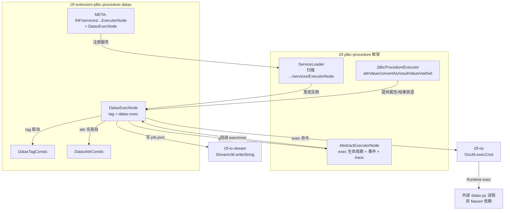
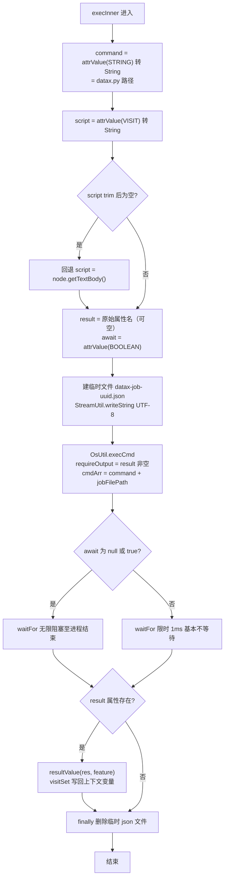

# i2f-extension-jdbc-procedure-datax 模块文档

> `i2f-jdbc-procedure`（存储过程/流程编排框架）的 **DataX 节点扩展**——以 `AbstractExecutorNode` 子类 + `META-INF/services` SPI 注册的方式，向 procedure XML 语法新增一个 `<datax-exec>` 标签（`DataxExecNode`，本模块唯一执行节点）。执行时把节点内联的 DataX JSON 作业写入系统临时文件，再以**外部操作系统进程**方式调用 `command` 指定的 `datax.py`（`OsUtil.execCmd`）完成异构数据源的批量 ETL，可选捕获标准输出经 `resultValue` 回写上下文变量，并按 `await`（默认 true）决定阻塞或非阻塞等待；`finally` 删除临时文件。**零三方 Maven 依赖**（DataX 本体是外部 Python 程序，不进 classpath），仅依赖框架 `i2f-jdbc-procedure` 及其传递的 `i2f-os`/`i2f-io-stream`。

## 模块路径

`i2f-extension/i2f-extension-jdbc-procedure-datax`

## 模块依赖

| 依赖 | scope | 说明 |
|------|-------|------|
| `i2f.turbo:i2f-jdbc-procedure` | compile | 框架底座：`AbstractExecutorNode`（exec 生命周期/事件/trace/异常包装）、`ExecutorNode`（SPI 服务接口）、`JdbcProcedureExecutor`（`attrValue`/`convertAs`/`resultValue`/`visitSet` 属性与结果原语）、`XmlNode`（`getTextBody`/`getTagAttrMap`/`getAttrFeatureMap`）、`AttrConsts`（`SCRIPT`/`RESULT`/`AWAIT`）与 `FeatureConsts`（`STRING`/`VISIT`/`BOOLEAN`）常量、`ThrowSignalException` |
| ↳ `i2f.turbo:i2f-io-stream` | 传递（经 `i2f-jdbc-procedure`） | `StreamUtil.writeString(String, Charset, File)`：把 JSON 文本以 UTF-8 覆写进临时 job 文件 |
| ↳ `i2f.turbo:i2f-os` | 传递（经 `i2f-jdbc-procedure`） | `OsUtil.execCmd(boolean requireOutput, long waitForMillsSeconds, String[] cmdArr, String[] envp, File dir, String charset)`：`Runtime.exec` 启动外部进程、读标准输出、按 `waitForMillsSeconds` 正负决定限时/无限等待 |
| `org.projectlombok:lombok` | provided（根 POM 统一管理） | POM 声明，但本模块 3 个 Java 源文件均未使用任何 Lombok 注解（见「瑕疵」#1） |

> 本模块**无任何第三方 Maven 依赖**：DataX 是独立发行的 Python + Java 数据同步程序，通过 `command` 属性传入其 `datax.py` 的绝对路径、以子进程方式调用，不进本模块编译/运行 classpath。

## 模块设计

### 包结构

| 类 / 文件 | 行数 | 职责 |
|-----------|------|------|
| `i2f.jdbc.procedure.extension.datax.node.DataxExecNode` | 66 | 唯一执行节点，`extends AbstractExecutorNode`；`tag()` 返回 `datax-exec`，`execInner` 完成「解析属性 → 落盘 JSON → exec 外部进程 → 回写结果 → 清理临时文件」全流程 |
| `i2f.jdbc.procedure.extension.datax.consts.DataxTagConsts` | 9 | 标签常量：`DATAX_EXEC = "datax-exec"` |
| `i2f.jdbc.procedure.extension.datax.consts.DataxAttrConsts` | 9 | 本模块私有属性常量：`COMMAND = "command"`（`script`/`result`/`await` 复用框架 `AttrConsts`） |
| `src/main/resources/META-INF/services/i2f.jdbc.procedure.node.ExecutorNode` | 1 | SPI 注册：`i2f.jdbc.procedure.extension.datax.node.DataxExecNode`，供框架 `ServiceLoader` 发现 |
| `i2f.jdbc.procedure.extension.datax.datax-procedure.dtd` | 13 | `<datax-exec>` 语法（元素 + `command`/`script`/`result`/`await`/`_lang` 属性）定义，随包分发，供 IDE 插件补全/文档参照，不被运行期加载 |
| `i2f.jdbc.procedure.extension.datax.datax-procedure.xml` | 84 | 可运行示例：Oracle → OceanBase 的 `SYS_USER` 表同步作业（含属性语义注释），随包分发 |

> `datax-procedure.dtd`/`datax-procedure.xml` 放在 `src/main/java` 包目录下（与 `flink` 姊妹模块一致），经父 POM 的资源配置一并打入 jar（`jar tf` 已核证 `i2f/jdbc/procedure/extension/datax/datax-procedure.xml` 在产物内）。

### 组件与加载关系



### 执行流程（`execInner`）



### 设计要点

1. **外部进程式集成，零 classpath 污染**：DataX 不进依赖树，节点只做「写 JSON 文件 → `Runtime.exec` 调 `datax.py` → 收标准输出」，把重量级数据同步引擎隔离为独立 OS 进程，本模块保持极小面（1 节点 + 2 常量）。
2. **SPI 插拔注册**：`DataxExecNode` 通过 `META-INF/services/i2f.jdbc.procedure.node.ExecutorNode` 被框架 `ServiceLoader` 发现，业务方仅引入本模块 jar，procedure XML 即可使用 `<datax-exec>` 标签——与 `flink`（8 节点）、`xproc4j` 等扩展同属一套节点插拔机制。
3. **作业来源二选一**：`script` 属性默认以 `VISIT` 解析（从上下文取保存 JSON 的变量名）；当解析结果为空/空白时（如示例 `script=""`），回退取 `<datax-exec>` 的**文本体内联 JSON**。二者最终都落盘为临时 `.json` 交付 `datax.py`。
4. **`result` 属性一举两用**：既决定是否捕获标准输出（`requireOutput = result != null`），其值又是回写的目标变量名；捕获文本再经 `resultValue(res, feature)` 按属性特征转换后 `visitSet` 入上下文。`result` 名取自 `getTagAttrMap()` 原始值、转换特征取自 `getAttrFeatureMap()`，不做 `attrValue` 二次求值。
5. **`await` 双模等待**：`await` 默认（null 或 true）走 `waitFor()` 无限阻塞直到进程结束；显式 false 时传 `1ms` 限时等待，语义为「发起即返回」。
6. **临时文件生命周期自封闭**：`File.createTempFile("datax-job-" + UUID, ".json")` 避让并发冲突，`finally` 无条件 `delete()`，异常统一包装为 `ThrowSignalException` 交由框架 `AbstractExecutorNode.exec` 记录节点级 trace 与错误链。

## 模块目的

在不把 DataX 引擎引入 classpath 的前提下，让 procedure/流程编排 XML 能以一个声明式标签驱动异构数据的批量迁移同步（ETL），把 DataX 这类「外部命令行工具」纳入统一的可编排、可捕获输出、可阻塞控制的节点体系，与 `i2f-jdbc-procedure` 内置的 `sql-etl`（JVM 内 ETL）、`flink`（JVM 内流/批计算）形成互补的「外部引擎」扩展档。

## 模块功能

1. **`<datax-exec>` 标签执行**：把 DataX JSON 作业交给外部 `datax.py` 进程运行。
2. **作业内联 / 变量双供给**：支持节点文本体内联 JSON，或 `script` 变量引用，空值自动回退内联。
3. **标准输出捕获回写**：指定 `result` 时捕获进程输出（含 stderr），按特征转换后写入上下文变量。
4. **阻塞 / 非阻塞控制**：`await`（默认 true）决定同步等待还是发起即返回。
5. **临时作业文件管理**：自动生成唯一临时 `.json`、执行后自动清理。
6. **错误统一信号化**：IO 异常包装为 `ThrowSignalException`，纳入框架节点级异常与 trace 体系。

## 模块主要使用方法

Maven 引入（DataX 本体需在运行环境自备 `datax.py` 及其插件，本模块不提供）：

```xml
<dependency>
    <groupId>i2f.turbo</groupId>
    <artifactId>i2f-extension-jdbc-procedure-datax</artifactId>
    <version>1.0-jdk8</version>
</dependency>
```

procedure XML 用法（`command` 指向 datax.py，作业 JSON 内联于文本体，输出回写 `v_log`）：

```xml
<datax-exec result="v_log" command="/app/datax.py" script="" await="true" _lang="JSON">
    { "job": { "content": [ { "reader": {...}, "writer": {...} } ] } }
</datax-exec>
```

属性一览：

| 属性 | 默认特征 | 含义 |
|------|----------|------|
| `command` | `string` | `datax.py` 脚本路径（作为可执行命令第 0 元，作业文件路径为第 1 参数） |
| `script` | `visit` | 保存作业 JSON 的上下文变量；为空时回退节点文本体 |
| `result` | —（原始属性名） | 目标变量名；存在即捕获标准输出，缺省则不捕获 |
| `await` | `boolean` | 是否阻塞等待进程结束，默认 `true` |

注意事项：

1. **`command` 必须是可被 `Runtime.exec` 直接启动的执行体**：示例用 Linux 绝对路径 `/app/datax.py`（依赖脚本 shebang）。Windows 下直接 exec `.py` 依赖文件关联、通常不可用，需自备可执行入口（见「瑕疵」#2）。
2. **`await="false"` 且未指定 `result` 时才近似「异步」**：此时几乎不等待且临时文件被立即删除，异步进程可能读不到作业文件（见「瑕疵」#3）。要稳定取回输出请保持 `await="true"`。
3. **需输出请显式写 `result`**：不写 `result` 时进程 stdout/stderr 不被消费，datax 输出量大时可能阻塞（见「瑕疵」#4）。

## 模块特性总结

1. **极简面**：1 个执行节点 + 2 个常量接口即完成 DataX 集成，无三方 Maven 依赖。
2. **声明式编排**：把外部命令行数据同步工具纳入 procedure 的可编排节点体系。
3. **SPI 可插拔**：经 `ExecutorNode` 服务文件自动注册，引包即得 `<datax-exec>` 标签，无需改框架。
4. **输出可回写**：`result` 属性打通「进程标准输出 → 上下文变量」，可被后续节点消费。
5. **同步/异步双模**：`await` 控制阻塞策略。
6. **自管理临时资源**：UUID 临时 job 文件、`finally` 强制清理。
7. **框架级可观测**：继承 `AbstractExecutorNode` 的 before/after/throwing/finally 事件、耗时统计、节点 trace 与调试桥接。
8. **自带语法与示例资源**：`.dtd` 定义标签语法、`.xml` 给出 Oracle→OceanBase 完整示例，随包分发供 IDE/文档使用。

## 模块瑕疵或错误

> 仅作静态识别，未做运行期实证。

1. **Lombok 依赖形同虚设**：POM 声明 `org.projectlombok:lombok`，但 `DataxExecNode`/两个常量接口均无任何 Lombok 注解与生成代码需求，属冗余依赖。
2. **`command` 跨平台可执行性依赖环境**：直接以 `command` 值作为 `Runtime.exec(cmdArr)` 的第 0 元、作业文件为第 1 参数，要求该路径本身可直接执行；示例 `/app/datax.py` 仅适配带 shebang 的 Linux，Windows 需以 `python.exe datax.py` 形式或文件关联方能工作，节点未提供 `python 解释器 + 脚本` 两段式配置入口。
3. **`await=false` 与临时文件删除竞态**：非阻塞时 `waitFor` 仅 1ms 即返回，`finally` 随即 `delete()` 临时 job 文件，而异步启动的 datax 进程可能尚未打开该文件，导致「作业文件已消失」的竞态，异步模式不可靠。
4. **输出未消费时的管道死锁风险（继承自 `i2f-os`）**：`result` 缺省时 `requireOutput=false`，`OsUtil` 完全不读 stdout/stderr，若进程输出填满 OS 管道缓冲区会阻塞子进程、`waitFor()` 永不返回；即便 `requireOutput=true`，其「先读 stdout 到 EOF 再读 stderr」的顺序读取在 stderr 先写满时同样可能死锁——datax 这类日志冗长程序风险尤高。
5. **无超时上限**：`await=true` 走 `waitFor()` 无限等待，datax 卡死会使整条 procedure 挂起，节点未提供 `timeout` 属性。
6. **示例文件瑕疵**：`datax-procedure.xml` 根元素 `id="flink-procedure"` 复用姊妹模块命名（应为 datax），且内嵌贴近真实的连接串/口令占位（`xxx123456`），易被误当可直接运行模板。
7. **DTD 内容模型非法**：`<!ELEMENT datax-exec (ANY|EMPTY)>` 将两个内置关键字以选择式并列，非合法 DTD 内容模型，严格 DTD 校验会报错；该文件仅作语法说明，运行期不加载。
8. **`jobFile.delete()` 结果被忽略**：清理失败（如句柄占用）时静默残留临时文件，无告警。

## 姊妹模块对比

| 维度 | `i2f-extension-jdbc-procedure-datax`（本模块） | `i2f-extension-jdbc-procedure-flink` | `i2f-jdbc-procedure` 内置 `sql-etl` |
|------|------|------|------|
| 定位 | 外部 DataX 引擎驱动的批量异构数据同步（ETL） | 外部/内嵌 Flink 引擎驱动的流/批计算与 SQL | JVM 内、基于 JDBC 的表间数据搬运 |
| 节点数 | 1（`DataxExecNode`） | 8（`FlinkExecEnvNode`/`FlinkExecSqlNode`/`FlinkTableEnvNode`/`FlinkExecuteNode` 等） | 框架自带 |
| 执行方式 | 起独立 OS 进程跑 `datax.py`，文件交换 | JVM 内调用 Flink Table/DataStream API | JVM 内直接读写数据源 |
| 三方 Maven 依赖 | 无（DataX 不进 classpath） | 一组 `org.apache.flink:*`（provided） | 无额外 |
| 结果回写 | `result` 捕获进程标准输出 | `result` 捕获 `JobExecutionResult` 等 | 框架统一 result 语义 |
| 共同点 | 均 `extends AbstractExecutorNode`、经 `META-INF/services/...ExecutorNode` SPI 注册、属性走 `AttrConsts`/`FeatureConsts`、异常包装 `ThrowSignalException` | 同左 | 属核心框架节点 |

> `datax`（外部进程 / 批量数据同步）与 `flink`（JVM 内 / 流批计算）是 `i2f-jdbc-procedure` 节点扩展体系下面向「数据工程」的两条互补路线。

## 消费方情况

| 消费方 | 形式 | 说明 |
|--------|------|------|
| `i2f-jdbc-procedure` | 运行期 SPI 加载 | 框架通过 `ExecutorNode` 服务文件发现并实例化 `DataxExecNode`，`<datax-exec>` 标签方可被解析执行 |
| `i2f-extension-all` | POM `L197` dependencies | 聚合发行，随扩展包一并提供 `<datax-exec>` 能力 |
| 根 `pom.xml` | `L1120` dependencyManagement | 统一版本管理（`1.0-jdk8`） |
| `i2f-extension/pom.xml` | `L61` module 声明 | 参与 `i2f-extension` 聚合构建 |
| `bash` 分发 | 4 个 jar | `backup-jdk8`/`deploy-jdk8`/`backup-jdk17`/`deploy-jdk17`，含 SPI 与 datax 示例资源 |
| wiki 既有引用 | 多处 | `docs/module-i2f-extension.md`（DataX 数据同步条目）、`i2f-jdbc-procedure` readme（3 个直接依赖扩展之一）、`i2f-os` readme（`OsUtil.execCmd` 消费方）、`wiki.md`（数据同步能力映射） |
