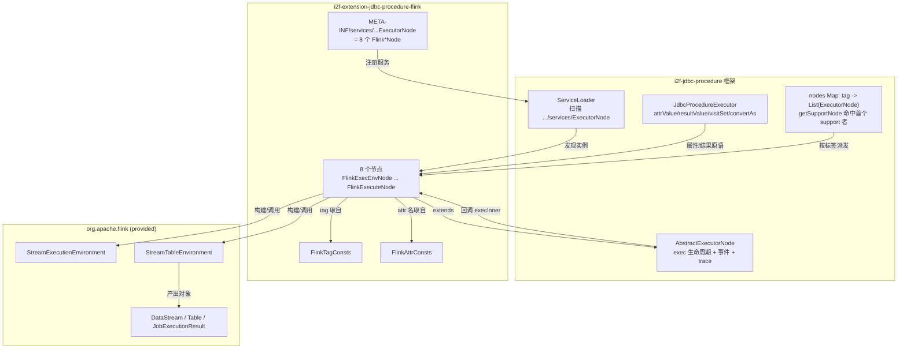
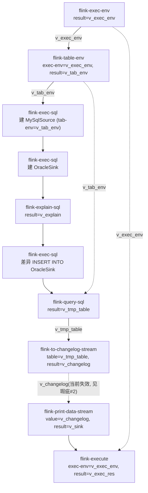

# i2f-extension-jdbc-procedure-flink 模块文档

> `i2f-jdbc-procedure`（存储过程/流程编排框架）的 **Flink 节点扩展**——以 `AbstractExecutorNode` 子类 + `META-INF/services` SPI 注册的方式，向 procedure XML 语法新增 8 个 `flink-*` 标签，把「建执行环境 → 建 Table 环境 → 执行/解释/查询 Flink SQL → Table 转 Changelog 流 → 打印流 → 提交作业」这条 **Flink 流批计算 / 异构 ETL** 链路拆解为可编排的声明式节点。各节点通过上下文变量（`visit` 访问）传递 `StreamExecutionEnvironment`/`StreamTableEnvironment`/`Table`/`DataStream` 等 Flink 对象，最终由 `<flink-execute>` 触发作业真正执行。**编译期仅引用 `flink-core`/`flink-streaming-java`/`flink-table-api-java-bridge`，其余 `org.apache.flink:*`（连接器、planner、runtime-web、rocksdb、clients）以 `provided` 声明交由运行环境提供**，本模块产物只有 8 个节点类 + 2 个常量接口 + SPI + 示例 XML/DTD。

## 模块路径

`i2f-extension/i2f-extension-jdbc-procedure-flink`

## 模块依赖

| 依赖 | scope | 说明 |
|------|-------|------|
| `i2f.turbo:i2f-jdbc-procedure` | compile | 框架底座：`AbstractExecutorNode`（exec 生命周期/事件/trace/异常包装）、`ExecutorNode`（SPI 服务接口，默认 `support()` 按 `tag()` 匹配）、`JdbcProcedureExecutor`（`attrValue`/`resultValue`/`visitSet`/`convertAs` 属性与结果原语）、`XmlNode`（`getTextBody`/`getTagAttrMap`/`getAttrFeatureMap`）、`AttrConsts`（`RESULT`/`NAME`/`SCRIPT`/`TABLE`/`VALUE`）、`FeatureConsts`（`VISIT`/`STRING`）、`ThrowSignalException` |
| `org.apache.flink:flink-core` | provided | 编译期引用：`configuration.Configuration`、`types.Row`、`api.common.JobExecutionResult` |
| `org.apache.flink:flink-streaming-java_2.12` | provided | 编译期引用：`streaming.api.environment.StreamExecutionEnvironment`、`datastream.DataStream`/`DataStreamSink` |
| `org.apache.flink:flink-table-api-java-bridge_2.12` | provided | 编译期引用：`table.api.bridge.java.StreamTableEnvironment`、`table.api.Table`/`TableResult`/`ExplainDetail` |
| `org.apache.flink:flink-clients_2.12` | provided | 运行期：本地/远端作业提交客户端（本模块源码不 import） |
| `org.apache.flink:flink-table-planner-blink_2.12` | provided | 运行期：Flink SQL 规划与执行引擎（`executeSql`/`sqlQuery` 真正落地依赖它） |
| `org.apache.flink:flink-runtime-web_2.12` | provided | 运行期：Web UI / REST 监控 |
| `org.apache.flink:flink-statebackend-rocksdb_2.12` | provided | 运行期：RocksDB 状态后端 |
| `org.apache.flink:flink-connector-kafka_2.12` | provided | 运行期：Kafka source/sink 连接器 |
| `org.apache.flink:flink-connector-jdbc_2.12` | provided | 运行期：JDBC source/sink（示例的 `MySqlSource`/`OracleSink` 用它） |
| `org.apache.flink:flink-connector-elasticsearch7_2.12` | provided | 运行期：Elasticsearch 7 连接器 |
| `org.projectlombok:lombok` | provided（根 POM 统一管理） | POM 声明，但本模块 10 个 Java 源文件均未使用任何 Lombok 注解（见「瑕疵」#1） |

> 全部 `org.apache.flink:*` 均为 `provided`：**编译只用到 core/streaming/table-bridge 三件套**，连接器、planner、runtime-web、rocksdb、clients 是为让最终装配出的应用能真正跑起 Flink 作业而提供的运行期依赖，不随本模块 jar 传递，避免污染下游 classpath。版本由本 POM 属性 `flink.version=1.13.5`、`flink.scala.version=2.12` 锁定。

## 模块设计

### 包结构

| 类 / 文件 | 行数 | 标签 `tag()` | 职责（等价 Java 代码） |
|-----------|------|--------------|------------------------|
| `...flink.node.FlinkExecEnvNode` | 35 | `flink-exec-env` | `StreamExecutionEnvironment.getExecutionEnvironment(new Configuration())` → 结果写入 `result` 变量 |
| `...flink.node.FlinkTableEnvNode` | 39 | `flink-table-env` | `StreamTableEnvironment.create(execEnv)`（`exec-env` 经 visit 取环境） |
| `...flink.node.FlinkExecSqlNode` | 45 | `flink-exec-sql` | `tabEnv.executeSql(script)`（DDL/INSERT，`script` 为空回退文本体） |
| `...flink.node.FlinkExplainSqlNode` | 45 | `flink-explain-sql` | `tabEnv.explainSql(script, JSON_EXECUTION_PLAN, ESTIMATED_COST, CHANGELOG_MODE)` → String 执行计划 |
| `...flink.node.FlinkQuerySqlNode` | 44 | `flink-query-sql` | `tabEnv.sqlQuery(script)` → `Table` |
| `...flink.node.FlinkToChangelogStreamNode` | 40 | **`flink-query-sql`（BUG，应为 `flink-to-changelog-stream`）** | `tabEnv.toChangelogStream(table)` → `DataStream<Row>`（见「瑕疵」#2） |
| `...flink.node.FlinkPrintDataStreamNode` | 36 | `flink-print-data-stream` | `dataStream.print()` → `DataStreamSink` |
| `...flink.node.FlinkExecuteNode` | 48 | `flink-execute` | `execEnv.execute()` / `execute(jobName)` → `JobExecutionResult`，异常包装 `ThrowSignalException` |
| `...flink.consts.FlinkTagConsts` | 18 | — | 8 个标签名常量 |
| `...flink.consts.FlinkAttrConsts` | 10 | — | 本模块私有属性常量：`EXEC_ENV="exec-env"`、`TAB_ENV="tab-env"`（`result`/`name`/`script`/`table`/`value` 复用框架 `AttrConsts`） |
| `src/main/resources/META-INF/services/i2f.jdbc.procedure.node.ExecutorNode` | 8 | — | SPI 注册 8 个节点类，供框架 `ServiceLoader` 发现 |
| `...flink.flink-procedure.dtd` | 47 | — | 8 标签语法（元素 + 属性）定义，供 IDE/离线参照（**未打入 jar**，见「瑕疵」#3） |
| `...flink.flink-procedure.xml` | 147 | — | 可运行示例：MySQL(JDBC) → Oracle(JDBC) 的建表 + 差异 INSERT + changelog 打印全链路，随包分发 |

> 目录约定：`flink-procedure.dtd`/`flink-procedure.xml` 放在 `src/main/java` 包目录下（与 `datax` 姊妹模块一致）。`jar tf` 核证：示例 `.xml`、SPI 服务文件确在产物内，但 `.dtd` 因根 POM `maven-jar-plugin` 的 `<includes>` 白名单未列 `.dtd` 而未入 jar。

### 组件与加载关系



### 上下文数据流（以示例 `flink-procedure.xml` 为例）

节点之间不直接引用，而是把 Flink 对象以 `result` 名写入上下文、下游再以 `visit` 属性名读回，形成一条链：



### 设计要点

1. **把 Flink 编程模型拆成原子节点**：环境构建（`exec-env`/`table-env`）、SQL 执行（`exec-sql`）、执行计划（`explain-sql`）、查询（`query-sql`）、流转换（`to-changelog-stream`）、打印（`print-data-stream`）、提交（`execute`）各成一类，业务方按需编排顺序，复用框架统一的属性求值与结果回写机制。
2. **对象经上下文变量流转**：节点不做生命周期管理，只把 `StreamExecutionEnvironment`/`StreamTableEnvironment`/`Table`/`DataStream` 以 `result` 变量名 `visitSet` 入上下文，下游 `attrValue(..., VISIT, ...)` 取回并强制转型。因此**节点顺序敏感**——下游必须先有上游产出的变量。
3. **真正的作业触发只在 `flink-execute`**：`executeSql`/`sqlQuery`/`toChangelogStream`/`print` 只是构建 DataGraph（transformation），`<flink-execute>` 调 `execEnv.execute([jobName])` 才提交；示例把 SQL 结果 `Table`→`toChangelogStream`→`print()` 挂到流上后统一 execute。
4. **SQL 供给与 datax 一致的「属性优先、文本体兜底」**：`script`（`visit`）为空/空白时回退 `node.getTextBody()`，让 SQL 既可内联写在标签体内，也可来自上下文变量；`.dtd` 用 `script.text-body` / `script.text-body.render` 点分属性暴露文本体/渲染特征开关。
5. **`result` 语义统一**：仅当节点写了 `result` 属性时才 `resultValue(value, feature)` 转换并 `visitSet` 回写，缺省即「执行但不留痕」；`result` 名取自 `getTagAttrMap()` 原始值、转换特征取自 `getAttrFeatureMap()`，不做二次 `attrValue` 求值。
6. **异常按节点粒度处理**：`FlinkExecuteNode` 显式 `try/catch` 把 `execute` 的受检异常包装成 `ThrowSignalException`；其余节点不捕获，交由 `AbstractExecutorNode.exec` 统一记录节点级 trace、耗时与错误链。

## 模块目的

在不把 Flink 引擎「焊死」进编排框架的前提下，让 procedure/流程编排 XML 以声明式标签驱动 Flink 的流/批计算与异构数据 ETL（借 Flink 的 connector 生态读写 MySQL/Oracle/Kafka/ES 等），把 Flink 的 Table/DataStream API 纳入统一的「可编排、可传对象、可观测、可捕获结果」节点体系；`provided` 依赖策略使其与 `datax`（外部进程批量同步）、`i2f-jdbc-procedure` 内置 `sql-etl`（JVM 内 JDBC 搬运）构成数据工程的互补档位。

## 模块功能

1. **环境构建**：`<flink-exec-env>` 建执行环境、`<flink-table-env>` 建 Table 环境。
2. **Flink SQL 执行 / 解释 / 查询**：`<flink-exec-sql>`（DDL/DML）、`<flink-explain-sql>`（执行计划文本）、`<flink-query-sql>`（返回 `Table`）。
3. **流转换与调试输出**：`<flink-to-changelog-stream>`（`Table`→`DataStream<Row>`）、`<flink-print-data-stream>`（`print()`）。
4. **作业提交**：`<flink-execute>`（可带 `name` 指定 jobName）。
5. **对象上下文流转**：Flink 对象经 `result`/`visit` 在节点间传递。
6. **错误统一信号化**：`ThrowSignalException` 纳入框架节点级异常与 trace。

## 模块主要使用方法

Maven 引入（Flink 运行期依赖需由最终应用自备，本模块以 `provided` 不传递）：

```xml
<dependency>
    <groupId>i2f.turbo</groupId>
    <artifactId>i2f-extension-jdbc-procedure-flink</artifactId>
    <version>1.0-jdk8</version>
</dependency>
```

procedure XML 用法（最小可用：建环境 → 建表 → 查询 → 转流 → 打印 → 提交）：

```xml
<procedure id="demo">
    <flink-exec-env result="v_exec_env"/>
    <flink-table-env result="v_tab_env" exec-env="v_exec_env"/>
    <flink-exec-sql tab-env="v_tab_env" result="">
        CREATE TEMPORARY TABLE src (id INT, name STRING) WITH ('connector'='datagen')
    </flink-exec-sql>
    <flink-query-sql tab-env="v_tab_env" result="v_tab">SELECT * FROM src</flink-query-sql>
    <flink-to-changelog-stream tab-env="v_tab_env" table="v_tab" result="v_stream"/>
    <flink-print-data-stream value="v_stream" result="v_sink"/>
    <flink-execute exec-env="v_exec_env" name="demo-job" result="v_res"/>
</procedure>
```

关键属性一览：

| 属性 | 默认特征 | 用于标签 | 含义 |
|------|----------|----------|------|
| `result` | —（原始属性名） | 全部 | 目标上下文变量名；存在才回写，空串表示不留痕 |
| `exec-env` | `visit` | `table-env` / `execute` | 引用上下文中的 `StreamExecutionEnvironment` 变量 |
| `tab-env` | `visit` | `exec/explain/query-sql`、`to-changelog-stream` | 引用 `StreamTableEnvironment` 变量 |
| `script` | `visit` | `exec/explain/query-sql` | SQL 变量名；为空回退节点文本体 |
| `table` | `visit` | `to-changelog-stream` | 引用 `Table` 变量 |
| `value` | `visit` | `print-data-stream` | 引用 `DataStream` 变量 |
| `name` | `string` | `execute` | Flink jobName，缺省走无参 `execute()` |

注意事项：

1. **`<flink-to-changelog-stream>` 目前不可用**：`FlinkToChangelogStreamNode` 的 `tag()` 误置为 `flink-query-sql`，导致该标签无任何处理器注册、被静默跳过，其 `result` 变量（如示例的 `v_changelog`）不会被写入，下游 `<flink-print-data-stream>` 取到 `null` 触发 NPE（见「瑕疵」#2）。修复前请避免使用这两个标签组成的链路，或改走 `sqlQuery().execute().collect()` 等替代路径。
2. **节点顺序即依赖顺序**：`exec-env` 必须先于引用它的 `table-env`/`execute`；`table-env` 先于任何 `*-sql`。变量缺失时 `visit` 求值返回 `null`，强转即 NPE。
3. **运行期需自备 Flink 引擎**：本模块不传递 `org.apache.flink:*`；最终应用需按运行环境补全 planner/clients/connector 等，否则 `executeSql`/`execute` 因缺类无法落地。

## 模块特性总结

1. **API 分解式编排**：将 Flink 环境/SQL/流/提交拆成 8 个原子 `ExecutorNode`。
2. **SPI 可插拔**：经 `ExecutorNode` 服务文件自动注册，引包即得 `flink-*` 标签，无需改框架。
3. **对象引用传递**：Flink 重对象经上下文变量 `visit`/`result` 流转，节点无状态。
4. **provided 依赖隔离**：编译三件套 + 运行全套连接器交由下游提供，零 classpath 污染。
5. **SQL 双供给**：`script` 变量或标签文本体内联，空值自动回退。
6. **同步提交**：`flink-execute` 阻塞式 `execute` 提交作业并取回 `JobExecutionResult`。
7. **框架级可观测**：继承 `AbstractExecutorNode` 的 before/after/throwing/finally 事件、耗时统计、节点 trace 与调试桥接。
8. **自带语法与示例资源**：`.dtd` 定义标签语法、`.xml` 给出 MySQL→Oracle 完整 ETL 示例。

## 模块瑕疵或错误

> 仅作静态识别，未做运行期实证。

1. **Lombok 依赖形同虚设**：POM 声明 `org.projectlombok:lombok`，但 8 个节点与 2 个常量接口均无任何 Lombok 注解与生成需求，属冗余依赖。
2. **`FlinkToChangelogStreamNode` 标签复制粘贴错误（功能性缺陷）**：其 `TAG_NAME` 被写成 `FlinkTagConsts.FLINK_QUERY_SQL`（值 `flink-query-sql`）而非 `FLINK_TO_CHANGELOG_STREAM`。后果链：① `registryExecutorNode` 以 `tag()` 为 key `computeIfAbsent(...).add(...)`，使该节点被错误并入 `flink-query-sql` 列表（`getSupportNode` 仍返回先注册的 `FlinkQuerySqlNode`，故 `flink-query-sql` 行为侥幸正常）；② `flink-to-changelog-stream` 标签在 nodes map 中**无任何注册项**，`getSupportNode` 返回 `null`，`exec` 分支仅在 debug 下打印「not found any executor!」并**静默跳过**，示例与文档承诺的 Table→DataStream 转换不发生；③ 该节点 `result` 变量（示例 `v_changelog`）不被写入，下游 `flink-print-data-stream` 以 `visit` 取到 `null`，`ds.print()` 触发 NPE 并被包装抛出。修复仅需把常量改回 `FLINK_TO_CHANGELOG_STREAM`。
3. **`.dtd` 未打入产物**：`flink-procedure.dtd` 位于 `src/main/java` 且被 `maven-resources-plugin` 的 copy-resources（`**/*` 排除 `*.java`）复制进 `target/classes`，但根 POM `maven-jar-plugin` 的 `<includes>` 白名单（`.class/.xml/.json/...`）未含 `.dtd`，故最终 jar 不含 DTD（`jar tf` 已核证仅见 `.xml`）。IDE/离线语法参照需从源码仓库获取。
4. **DTD 内容模型非法**：各 `<!ELEMENT flink-* (ANY|EMPTY)>` 将两个内置关键字以选择式并列，非合法 DTD 内容模型，严格 DTD 校验会报错；该文件仅作语法说明。
5. **强类型无校验**：`(StreamTableEnvironment) attrValue(TAB_ENV,...)`、`(Table)`、`(DataStream<?>)` 等直接强转，变量存错类型即 `ClassCastException`，且 `visit` 对缺失变量返回 `null` 时以 NPE 暴露，缺少面向标签的友好校验。
6. **`toChangelogStream`/`print` 的流式结果需配 `execute` 才落地**：单独使用不产生副作用，文档与示例虽体现该点，但对「忘写 `flink-execute` 则作业永不执行」无防护。
7. **示例含明文连接信息占位**：`flink-procedure.xml` 内联 `password='password'`/`'oracle'` 等，易被误当可直接运行模板。

## 姊妹模块对比

| 维度 | `i2f-extension-jdbc-procedure-flink`（本模块） | `i2f-extension-jdbc-procedure-datax` | `i2f-jdbc-procedure` 内置 `sql-etl` |
|------|------|------|------|
| 定位 | JVM 内嵌 Flink 引擎驱动的流/批计算与 SQL ETL | 外部 DataX 引擎驱动的批量异构数据同步 | JVM 内、基于 JDBC 的表间数据搬运 |
| 节点数 | 8（环境/SQL/解释/查询/转流/打印/提交） | 1（`DataxExecNode`） | 框架自带 |
| 执行方式 | JVM 内调用 Flink Table/DataStream API，`execute` 提交作业 | 起独立 OS 进程跑 `datax.py`，文件交换 | JVM 内直接读写数据源 |
| 三方 Maven 依赖 | 一组 `org.apache.flink:*`（全 `provided`） | 无（DataX 不进 classpath） | 无额外 |
| 上下文流转 | 传递 Flink 重对象（env/table/stream）变量 | 传递作业 JSON 与输出文本 | 框架统一 result 语义 |
| 结果回写 | `result` 捕获 `TableResult`/`Table`/`JobExecutionResult` 等 | `result` 捕获进程标准输出 | 框架统一 result 语义 |
| 主要静态缺陷 | `to-changelog-stream` 标签错标（#2）、DTD 未入包（#3） | `command` 跨平台、`await=false` 竞态、管道死锁 | 属核心框架节点 |
| 共同点 | 均 `extends AbstractExecutorNode`、经 `META-INF/services/...ExecutorNode` SPI 注册、属性走 `AttrConsts`/`FeatureConsts`、异常包装 `ThrowSignalException`、`.dtd`/`.xml` 置于 `src/main/java` | 同左 | 属核心框架节点 |

> `flink`（JVM 内 / 流批计算）与 `datax`（外部进程 / 批量数据同步）是 `i2f-jdbc-procedure` 节点扩展体系下面向「数据工程」的两条互补路线；`i2f-extension/test-flink` 虽同名前缀，却是直接使用 Flink 原生 API 的独立 demo，不依赖本模块。

## 消费方情况

| 消费方 | 形式 | 说明 |
|--------|------|------|
| `i2f-jdbc-procedure` | 运行期 SPI 加载 | 框架经 `ExecutorNode` 服务文件 `ServiceLoader` 发现并实例化 8 个节点，`flink-*` 标签方可被解析执行 |
| `i2f-extension-all` | POM `L201` dependencies | 聚合发行，随扩展包一并提供 `flink-*` 标签能力 |
| 根 `pom.xml` | `L1125` dependencyManagement | 统一版本管理（`1.0-jdk8`） |
| `i2f-extension/pom.xml` | `L62` module 声明 | 参与 `i2f-extension` 聚合构建 |
| `bash` 分发 | 4 个 jar | `backup-jdk8`/`deploy-jdk8`/`backup-jdk17`/`deploy-jdk17`（fat jar，含 SPI 与示例 `.xml`） |
| wiki 既有引用 | 多处 | `docs/module-i2f-extension.md`（Flink 流计算条目）、`i2f-jdbc-procedure` readme（3 个直接依赖扩展之一，8 节点）、`wiki.md`（数据同步能力映射） |

> 注：`i2f-extension/test-flink` 与本模块共享 `flink.version=1.13.5` 及同一批 `provided` 依赖，但**不依赖本模块**（独立使用 Flink 原生 `StreamExecutionEnvironment`/`TableEnvironment` 的 demo），非消费方。
