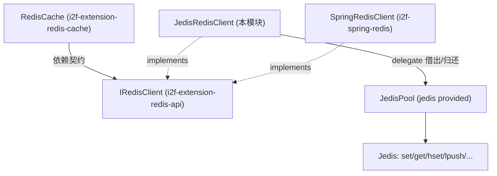

# i2f-extension-jedis

> Redis 客户端契约 `IRedisClient` 的 **Jedis 实现适配层**（`i2f-extension` 组，`jedis:3.8.0` 以 `provided` 引入）：以单类 `JedisRedisClient` 把 Redis 官方 Java 客户端 Jedis（自管 `JedisPool`）适配到 `i2f-extension-redis-api` 定义的 23 方法统一契约（string/list/hash + 过期），配 `JedisMeta` 连接参数模型；采用「`delegate(Function<Jedis,R>)` 借出—执行—归还」模板封装每一次操作，并以 `prefix` 前缀实现键空间隔离。它是 i2f Redis 体系「一契约双实现」中的 Jedis 路线（另一路为 `i2f-spring-redis` 的 `SpringRedisClient`），与消费方 `i2f-extension-redis-cache.RedisCache` 通过 `IRedisClient` 契约解耦。

## 模块路径

- `i2f-extension/i2f-extension-jedis`

## 模块依赖

| 依赖 | Maven 坐标 | scope | optional | 说明 |
| --- | --- | --- | --- | --- |
| i2f-extension-redis-api | `i2f.turbo:i2f-extension-redis-api` | compile | 否 | 本模块实现的统一契约接口 `IRedisClient` 所在模块 |
| i2f-cache | `i2f.turbo:i2f-cache` | compile | 否 | **声明但全模块零 `import`、零使用**——本模块只依赖 redis-api，不经任何 cache 抽象（见「模块瑕疵」） |
| lombok | `org.projectlombok:lombok` | provided | 是（父 DM 治理） | `JedisMeta` 实际使用 `@Data`/`@NoArgsConstructor`，真实用到的编译期注解 |
| Jedis | `redis.clients:jedis:3.8.0` | provided | 否 | 目标 Redis 客户端；**`provided` 故不随包发布**，消费方需自备；版本在本 pom 硬编码、未走根 DM |

> 内部依赖 redis-api（必需）+ i2f-cache（冗余未用）；三方仅 jedis 且 `provided`。构建继承父 pom，`maven-assembly-plugin` 设 `addMavenDescriptor=true`。

## 模块设计

两个类，均在包 `i2f.extension.jedis`：

- `JedisMeta`：连接参数模型（`@Data`/`@NoArgsConstructor`）。字段 `host`(默认 127.0.0.1)、`port`(6379)、`password`、`database`(0)、`timeout`(3000ms)、`ssl`(false)，附 3 个便捷构造器（host+db / host+pwd+db / host+port+pwd+db）。**不含任何池参数**（maxTotal/maxIdle 等在 `createPool` 内硬编码）。
- `JedisRedisClient implements IRedisClient`：适配器本体。
  - 状态：`String prefix` + `JedisPool pool`；4 个构造器（有/无 prefix × 传 `JedisPool`/传 `JedisMeta` 自建池）。
  - `createPool(JedisPoolConfig, JedisMeta)`：`poolConfig` 为空时给定默认（`maxTotal=100`、`maxIdle=5`、`testOnBorrow/Return/Create/WhileIdle` 全 `true`），再 `new JedisPool(config, host, port, timeout, password, database, ssl)`。
  - `getJedis()`（`synchronized`）：`while(true)` 借连接，对 `JedisConnectionException`/`SocketTimeoutException` 重试至多 >3 次，失败**静默返回 null**（不上抛、不记日志）。
  - `delegate(Function<Jedis,R>)`：模板方法，`getJedis()`→null 则抛 `IllegalStateException`→`consumer.apply(jedis)`→`finally returnJedis`。**所有契约方法都经它实现**。
  - `wrapKey(key)`：`prefix + key`（prefix 为 null 时原样）。
  - 23 个 `@Override`：string（`set`/`set(超时)`/`expire`/`getExpire(ttl)`/`setUnique(setnx)`/`del`/`get`/`keys`/`hasKey(exists)`/`flushDb`）、list（`lpush`/`llen`/`lrange`/`lindex`/`lset`）、hash（`hset`/`hget`/`hmset`/`hgetAll`/`hlen`/`hdel`）。



## 模块目的

- 用 Jedis（非 Spring 栈）落地 `IRedisClient` 契约，为不依赖 spring-data-redis 的场景提供另一条 Redis 客户端实现，与 `SpringRedisClient` 在契约下可互换。
- 以 `prefix` 键前缀提供轻量多租户/多应用键空间隔离。
- 以 `delegate` 模板统一「借出—执行—归还」，把连接生命周期收敛到一处，业务方法只写命令本身。

## 模块功能

- 面向 `IRedisClient` 的完整 string/list/hash 与过期操作实现。
- 静态 `createPool` 便捷产池；`JedisMeta` 多构造器组装连接参数。
- 消费生态：契约消费方为 `i2f-extension-redis-cache.RedisCache`（把 `IRedisClient` 适配进 `i2f-cache-std` 三契约），但 `RedisCache` 依赖的是 redis-api 契约、**并不依赖本 Jedis 实现**；本模块在仓库内**无任何源码级消费方**，仅被 `i2f-extension-all` 以 compile 聚合，属「参考实现」性质。

## 模块主要使用方法

```java
// 自建连接池（默认池参数）
IRedisClient client = new JedisRedisClient("app1:", new JedisMeta("127.0.0.1", 6379, "pwd", 0));
client.set("user:1", "{\"name\":\"x\"}", 300);   // wrapKey -> "app1:user:1"，set + expire
String v = client.get("user:1");

// 也可直接传入自备的 JedisPool
JedisPool pool = JedisRedisClient.createPool(myPoolConfig, myMeta);
IRedisClient raw = new JedisRedisClient(pool);
```

注意事项：
- **返回 boolean 的写方法多为「执行即 true」**：`set`/`setUnique`/`expire`/`hashSetMap` 不反映真实结果（详见瑕疵）。
- `getExpire` 返回 Redis `TTL`（秒）：键不存在返 `-2`、无过期返 `-1`，调用方需自行辨识。
- `keys(pattern)` 直用 Redis `KEYS` 阻塞命令，生产大库慎用；返回的是**带 prefix 的存储键**，未剥前缀。
- jedis 为 `provided`，运行环境须自行引入 `redis.clients:jedis:3.8.0`（含 commons-pool2）。

## 模块特性总结

- 契约适配：完整实现 `IRedisClient` 23 方法，与 `SpringRedisClient` 同契约可互换。
- 模板化连接管理：`delegate(Function)` 统一借出/归还，业务方法皆为 lambda 一行命令。
- `prefix` 键空间隔离：所有键经 `wrapKey` 加前缀。
- `JedisMeta` + 多构造器 + 静态 `createPool`：既可用默认池参数快速接入，也可注入自定义 `JedisPool`/`JedisPoolConfig`。
- 零内部耦合到 cache 层：只依赖 redis-api 契约。

## 模块瑕疵或错误

> 以下为静态识别的问题/潜在问题，未做运行实证。

- 【**`setUnique` 恒返回 `true`、忽略 `setnx` 的 0/1 结果**】直接丢弃 `jedis.setnx` 返回值恒返 `true`，调用方无法判断 key 是否本已存在——用作分布式锁/幂等判定时必然误判「抢到锁」，是最语义性缺陷。
- 【**`returnResource` 为 Jedis 2.7+ 废弃 API**】`returnJedis` 调 `pool.returnResource(jedis)`；连接出异常时应 `close()`（新语义会自动归还/销毁 broken 连接），`returnResource` 在 3.x 已不推荐，异常连接被当作正常连接归还污染池。
- 【**`getJedis` 声明 `synchronized` 把借连接串行化**】所有 `delegate` 都先经 `getJedis()`，`synchronized` 使连接池的并发借用退化为按客户端实例串行，抵消 `JedisPool` 的多连接并发能力（`pool.getResource()` 本已线程安全，无需再加锁）。
- 【**取不到连接时静默返回 null + 拼写错误异常**】`getJedis` 重试耗尽后返回 `null` 且不记录/不上抛真实异常；`delegate` 随即抛 `IllegalStateException("jedis cloud not get.")`（`cloud` 应为 `could`），根因（连接失败）被吞没难排查。
- 【**`del` 先 `get` 再 `del` 两条命令、非原子**】为「返回旧值」把一次 `getdel` 语义拆成 `get`+`del` 两 RTT，高并发下可能返回他人刚写入的新值或误删，且多一次往返。
- 【**`set(key,val,超时)`/`setUnique` 的 `set`+`expire` 两步非原子**】若 `expire` 失败或进程在其间崩溃，key 永不过期（内存泄漏）；且 `timeOutSecond==0` 时 `expire(key,0)` 会让 Redis **立即删除**刚写的 key，语义反直觉。契约层缺失负数/0 超时的哨兵文档。
- 【**`keys()` 用 `KEYS` 阻塞命令**】`jedis.keys` 为 O(N) 全库扫描并阻塞服务端，大实例上危险；且返回带 `prefix` 的原始键，与消费方 `RedisCache.keys()` 组合时会二次 `wrapKey`（前缀叠加，同 `redis-cache` 文档记录之缺陷）。
- 【**`listAll` 的 `lrange(0, llen)` 越取一位且双命令非同一快照**】`llen` 返回长度为 `n`，`lrange` 的 end 为闭索引应传 `n-1`，这里多要一个元素（靠 Redis 截断侥幸）；`llen` 与 `lrange` 间列表可能已被改。
- 【**池参数全硬编码、探测开销过重**】`createPool` 写死 `maxTotal=100/maxIdle=5` 且 `testOnBorrow`+`testOnReturn`+`testOnCreate`+`testWhileIdle` 四测全开（每次借/还都额外 PING，`testOnReturn` 在 commons-pool2 已弃用/无效），`JedisMeta` 未暴露任何池调优字段，无法按场景调整。
- 【**`i2f-cache` 声明但零使用·冗余依赖**】pom 引入 `i2f.turbo:i2f-cache` 为 compile，但两源文件无任何 `i2f.cache.*` import；本实现只谈 `IRedisClient` 与 Jedis，cache 依赖纯属多余，还会把 i2f-cache 传递进下游。
- 【**仅 `i2f-extension-all` 聚合、仓库内零激活**】`JedisRedisClient` 全仓无任何构造/引用点，「一契约双实现」的 Jedis 路实际不在任何 starter 装配链上（starter 走 spring-data-redis 路），本模块处演示/预留状态；jedis 又 `provided`，若真有消费方未自备驱动则 `NoClassDefFoundError`。
