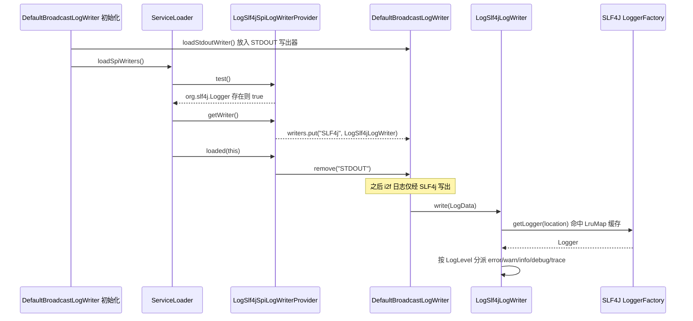

# i2f-extension-log-slf4j

> `i2f-log`（自研日志栈）的 **SLF4J 输出桥接扩展**——通过实现 `i2f.log.provider.LogWriterProvider` 并以 `META-INF/services` SPI 注册，在检测到 classpath 上存在 `org.slf4j.Logger` 时，向 `DefaultBroadcastLogWriter` 追加一个 `LogSlf4jLogWriter`，把 i2f 内部产生的 `LogData` 逐条转投到 **SLF4J 门面**（进而落到 logback / log4j2 / jul 等任意 SLF4J 后端）。它在 `loaded()` 回调里主动 `remove` 默认的 `STDOUT` 明文写出器，实现「一旦 SLF4J 可用，控制台输出即改由 SLF4J 接管」的平滑切换。本模块自身仅有 2 个类，三方依赖 `slf4j-api` 与内部 `i2f-log` 均为 `provided`，产物只是薄薄一层 SPI 适配器。

## 模块路径

- `i2f-extension/i2f-extension-log-slf4j`

## 模块依赖

| 依赖 | groupId:artifactId | 版本 | scope | optional | 作用 |
| --- | --- | --- | --- | --- | --- |
| Lombok | `org.projectlombok:lombok` | 父 POM 管理 | provided* | 否 | 编译期注解处理（本模块实际未用到其注解，见瑕疵） |
| i2f-log | `i2f.turbo:i2f-log` | 父 POM 管理 | provided | 否 | 提供 `LogWriterProvider`/`ILogWriter`/`DefaultBroadcastLogWriter`/`StdoutPlanTextLogWriter` SPI 与写出契约 |
| SLF4J API | `org.slf4j:slf4j-api` | 1.7.30 | provided | 否 | 提供 `org.slf4j.Logger`/`LoggerFactory` 门面（`test()` 探测目标 + 写出目标） |

> `i2f-log` 传递引入 `i2f-log-std`（`LogData`/`LogLevel`）与 `i2f-lru-map`（`i2f.lru.LruMap`，本模块用作 Logger 缓存）。因 `i2f-log` 为 `provided`，运行期由宿主应用负责提供完整日志栈与真实 SLF4J 绑定。

## 模块设计

### 包结构

| 包 | 类/资源 | 职责 |
| --- | --- | --- |
| `i2f.extension.log.slf4j` | `LogSlf4jSpiLogWriterProvider` | SPI 提供者：`test()` 探测 SLF4J 是否存在、`getWriter()` 产出写出器、`loaded()` 摘除 STDOUT |
| `i2f.extension.log.slf4j` | `LogSlf4jLogWriter` | `ILogWriter` 实现：按 `LogLevel` 分派到 SLF4J `Logger`，并以 `LruMap` 缓存 logger 实例 |
| `META-INF/services` | `i2f.log.provider.LogWriterProvider` | 注册 `LogSlf4jSpiLogWriterProvider`，供 `ServiceLoader` 发现 |

### 装配与写出时序



### 关键设计点

- **探测式挂载**：`test()` 先 `Class.forName("org.slf4j.Logger")`，失败再退到 `Thread.currentThread().getContextClassLoader().loadClass(...)`，双 ClassLoader 兜底覆盖容器/父子加载器场景；探测不到则整个 provider 被跳过，保持 i2f 原生 STDOUT 输出，零副作用。
- **后处理式接管**：`loadSpiWriters()` 先把所有通过探测的写出器装入 `writers`，再统一回调 `loaded()`；本模块借此在自身注册成功后移除 `STDOUT`，实现「SLF4J 优先、避免双份输出」的语义。
- **Logger 缓存**：`LruMap<String, Logger>`（容量 1024）以 `LogData.getLocation()`（即 logger 名称）为键缓存 SLF4J `Logger`，规避高频日志反复 `getLogger` 开销；key 基数等于 logger 数，通常远小于 1024。
- **级别映射**：`FATAL`/`ERROR`→`error`，`WARN`→`warn`，`INFO`→`info`，`DEBUG`→`debug`，`TRACE`→`trace`，其余（`OFF`/`ALL`）→`info`。真正的级别裁剪由上游 `DefaultLogger.enableLevel` + `ILogDecider` 完成，写出器不重复判定。

## 模块目的

- 让自研 `i2f-log` 的日志能够汇入成熟的 SLF4J 生态，复用 logback/log4j2 等的 appender、滚动、异步、Pattern 等能力，而不必在 i2f 内重造后端。
- 以纯 SPI、`provided` 依赖的方式实现「有 SLF4J 则接管、无则不干预」的可选增强，不强制宿主引入任何具体日志实现。
- 与反向桥接 `i2f-extension-slf4j-log`（SLF4J→i2f）配对，构成 i2f 与 SLF4J 之间的双向通路选择。

## 模块功能

- 提供 `LogSlf4jLogWriter`：将一条 `LogData` 按其 `location`/`level`/`msg`/`ex` 转投为一次 SLF4J 日志调用。
- 提供 `LogSlf4jSpiLogWriterProvider`：SPI 入口，负责存在性探测、写出器构造与 STDOUT 摘除。
- 经 `META-INF/services/i2f.log.provider.LogWriterProvider` 参与 `DefaultBroadcastLogWriter` 的自动装配。
- 用 LRU 缓存复用 SLF4J `Logger` 实例，降低热点路径开销。

## 模块主要使用方法

通常**无需编码**——把本模块（连同真实 SLF4J 绑定，如 logback-classic）放到 classpath 即可自动生效：

```xml
<dependency>
    <groupId>i2f.turbo</groupId>
    <artifactId>i2f-extension-log-slf4j</artifactId>
</dependency>
<!-- 运行期需自备真正的 SLF4J 绑定，否则落入 NOP（见瑕疵） -->
<dependency>
    <groupId>ch.qos.logback</groupId>
    <artifactId>logback-classic</artifactId>
</dependency>
```

生效后，`LogHolder` 默认写出器 `DefaultBroadcastLogWriter` 会在装载阶段打印 `spi log writer append : SLF4j` 并移除 STDOUT；此后 i2f 内部 `ILogger` 产生的日志将以 `location` 对应的 logger 名输出到 SLF4J 后端。

注意事项：
- logger 名取自 `LogData.getLocation()`，与 i2f 侧的 logger 定位串一致，可在 SLF4J 后端按该名称配置级别/appender。
- 写出器在 `DefaultBroadcastLogWriter` 的 `async` 线程池中执行（默认异步），异常被 `printStackTrace` 吞没，不影响主流程。

## 模块特性总结

- **零侵入 SPI 增强**：不改 i2f-log 一行代码即可挂载，探测失败自动降级。
- **双 ClassLoader 探测**：`Class.forName` + 上下文加载器兜底，适配容器环境。
- **自动让位 STDOUT**：SLF4J 就绪后摘除明文控制台输出，避免重复。
- **极薄产物**：仅 2 个类 + 1 个 SPI 描述文件，`slf4j-api`/`i2f-log` 全 `provided`，不打入、不锁定具体日志实现。
- **LRU Logger 复用**：按 location 缓存，削减 `getLogger` 开销。

## 模块瑕疵或错误

> 以下为静态识别的潜在问题，未做运行期实证。

- **`test()` 只探测门面类、不保证有真实绑定**：仅检查 `org.slf4j.Logger` 是否存在。若 classpath 只有 `slf4j-api` 而无任何绑定，SLF4J 将回退到 NOP logger——而本模块已在 `loaded()` 移除了 `STDOUT`，结果是 **i2f 日志被 SLF4J NOP 丢弃、控制台也不再输出**，日志彻底「静默丢失」。
- **与 `i2f-extension-slf4j-log` 同时存在时的回环风险**：`slf4j-log` 提供 SLF4J 绑定（`org.slf4j.impl.StaticLoggerBinder`），把 SLF4J 调用再路由回 i2f 的 `ILogger`。本模块写出器调用 `LoggerFactory.getLogger(...)` 时恰好命中该绑定：i2f→SLF4j(本模块)→绑定(slf4j-log)→i2f→…… 形成**无限递归**，异步池下表现为 `StackOverflowError`。二者语义相反、不应共存；但 `i2f-extension-all` 同时聚合了 `i2f-extension-log-slf4j` 与 `i2f-extension-slf4j-log`，凡引入 `extension-all` 者有触发该回环之虞。
- **消息串被当作 SLF4J 格式化模板**：`logger.info(data.getMsg(), data.getEx())` 中，`msg` 作为 `format` 参数。若已格式化的 `msg` 文本内含 `{}`（例如业务日志本身带花括号占位符），SLF4J 会把末位 `Throwable` 当作占位实参消费掉，导致**异常堆栈不被记录**、`{}` 被异常 `toString` 覆盖。应以「消息 + 显式 throwable」两参形式或对 `{}` 做规避。
- **Lombok 依赖冗余**：`pom.xml` 声明了 `org.projectlombok:lombok`，但两个源类均未使用任何 Lombok 注解，属无用依赖。
- **缓存 check-then-act 非原子**：`CACHE.get(location)` 判空后再 `put`，并发首次命中同一 location 时可能重复 `getLogger`。因 SLF4J 自身对 logger 名有缓存且 `LruMap` 单操作加锁，实害有限，但可用 `computeIfAbsent` 收敛（同项目 `slf4j-log` 的工厂即用 `computeIfAbsent`）。
- **未知级别默认降级为 INFO**：`else` 分支把 `OFF`/`ALL` 一律按 `info` 写出。正常经上游 `enableLevel` 过滤后不应到达此处，但语义上 `OFF` 被当作 INFO 输出并不直观。

## 桥接方向对比（三兄弟）

| 模块 | 方向 | 机制 | 是否绑定 |
| --- | --- | --- | --- |
| **i2f-extension-log-slf4j（本模块）** | i2f-log → SLF4J | `LogWriterProvider` SPI 写出器，转投 `LoggerFactory.getLogger` | 消费 SLF4J，不做绑定 |
| `i2f-extension-slf4j-log` | SLF4J → i2f-log | 提供 `org.slf4j.impl.StaticLoggerBinder` + `Slf4jLogLoggerAdapter implements Logger` | 是一个 SLF4J 绑定 |
| `i2f-extension-slf4j` | 面向 SLF4J 的工具层 | `PerfLogger`/`Slf4jMdcManager`/`Slf4jPrintStream`/`Slf4jUtil` | 非桥接，性能/MDC/流重定向工具 |

> 本模块与 `slf4j-log` 方向相反：前者把 i2f 日志送到 SLF4J，后者把 SLF4J 调用送回 i2f。**两者不可同时启用**（否则互成回环）；典型用法是按项目实际选其一，另一个留空。

## 消费方与生态位置

- **注册/聚合**：`i2f-extension/pom.xml`（module 声明，第 64 行）、根 `pom.xml` `dependencyManagement`（第 1135 行）、`i2f-extension-all/pom.xml`（第 209 行）均已登记。
- **产物核证**：`jar tf` 确认产物含 `META-INF/services/i2f.log.provider.LogWriterProvider` 及两个 `.class`，SPI 描述文件正常入包。
- **运行前提**：本模块为 `provided` 型桥接，需在宿主 classpath 自备 `i2f-log` 栈与真实 SLF4J 绑定方有实际输出。
- **既有文档引用**：`i2f-log`、`i2f-log-std` 的 wiki 已把本模块标注为其 `LogWriterProvider` SPI 的消费方；`.wiki/docs/module-i2f-extension.md` 概览表列为「日志 SLF4J 桥接」。
